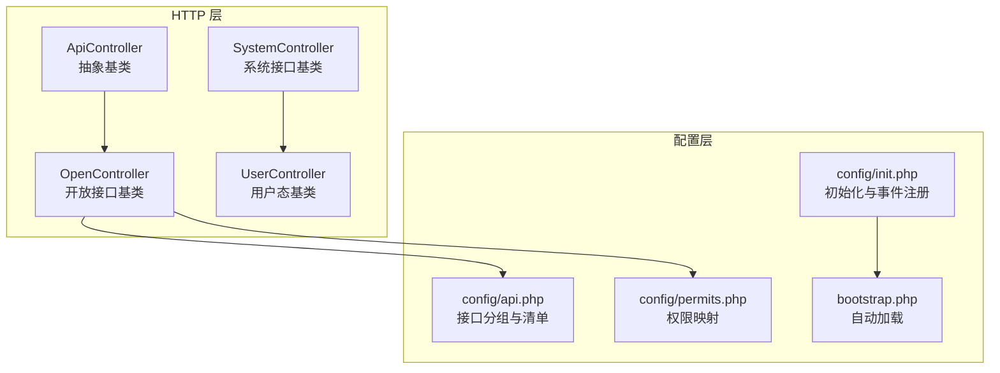
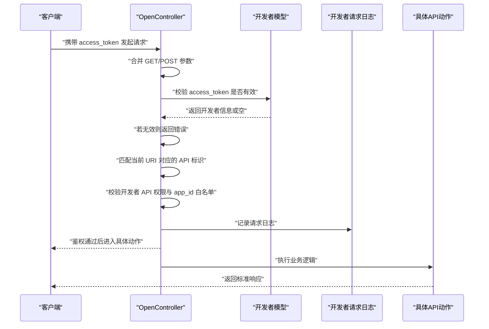
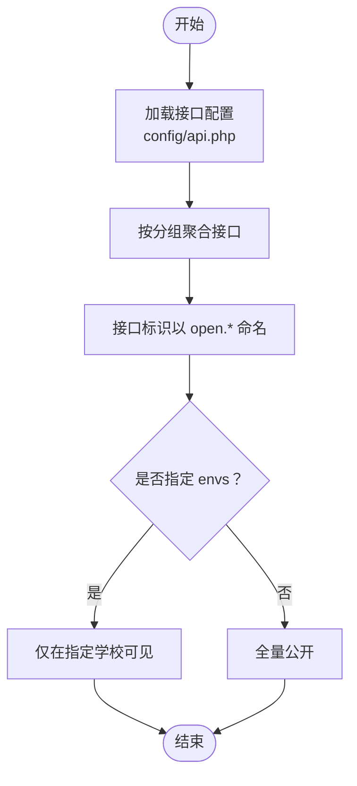
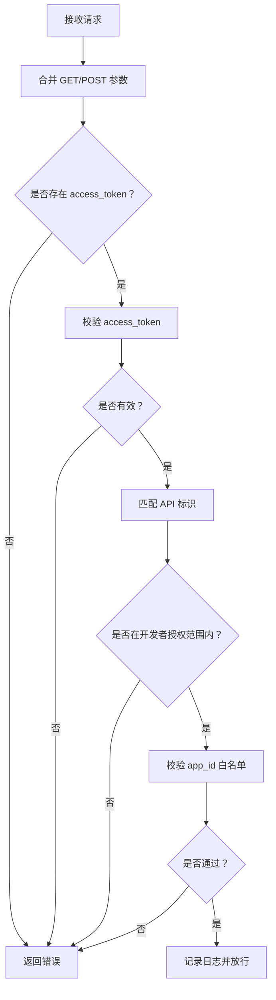
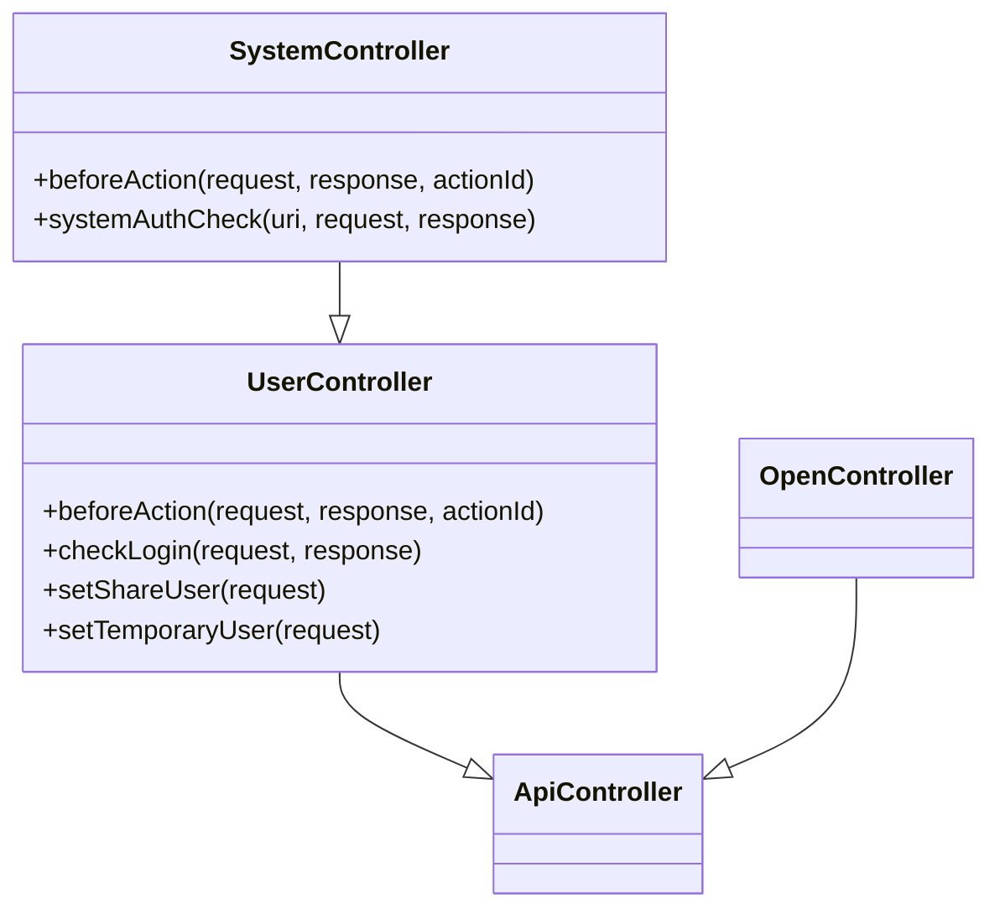
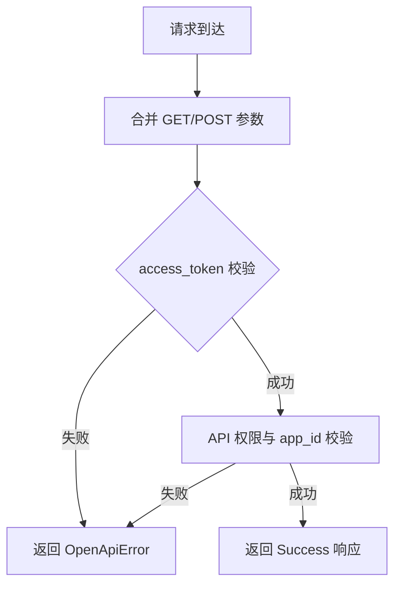
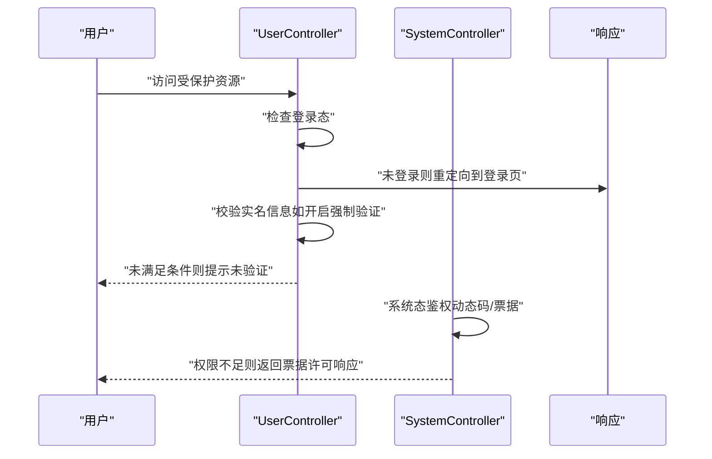
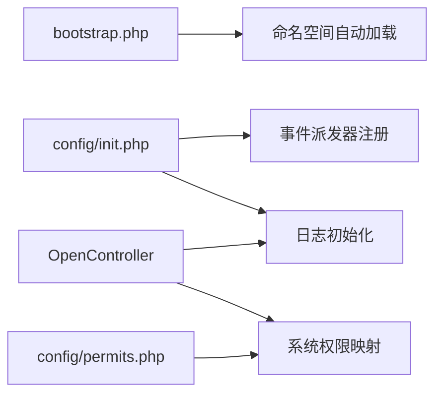

# API 接口文档

<cite>
**本文引用的文件**
- [process\src\config\api.php](file://process\src\config\api.php)
- [process\src\http\OpenController.php](file://process\src\http\OpenController.php)
- [process\src\http\ApiController.php](file://process\src\http\ApiController.php)
- [process\src\http\SystemController.php](file://process\src\http\SystemController.php)
- [process\src\http\UserController.php](file://process\src\http\UserController.php)
- [process\src\config\init.php](file://process\src\config\init.php)
- [process\src\bootstrap.php](file://process\src\bootstrap.php)
- [process\src\config\permits.php](file://process\src\config\permits.php)
</cite>

## 目录
1. [简介](#简介)
2. [项目结构](#项目结构)
3. [核心组件](#核心组件)
4. [架构总览](#架构总览)
5. [详细组件分析](#详细组件分析)
6. [依赖关系分析](#依赖关系分析)
7. [性能与扩展建议](#性能与扩展建议)
8. [故障排查指南](#故障排查指南)
9. [结论](#结论)
10. [附录](#附录)

## 简介
本文件面向 htdNew 项目的 API 接口，提供统一的 RESTful 设计规范、接口分组与版本管理策略说明，并对应用接口、工具接口、登录接口等进行深入解析。文档涵盖请求/响应格式约定、参数校验与错误码定义、认证方法与安全考虑、测试指南、性能优化与扩展方法，帮助开发者与集成方高效、稳定地对接系统。

## 项目结构
htdNew 的 API 层位于 process\src 下，采用“控制器基类 + 配置 + 模型/服务”的分层设计：
- 控制器基类：OpenController、SystemController、UserController 提供统一的鉴权、日志与安全策略
- 配置：api.php 定义接口分组与接口清单；permits.php 定义系统侧权限映射
- 初始化：bootstrap.php 实现自动加载；init.php 注册日志与事件派发器

**图表来源**
- [process\src\http\OpenController.php](file://process\src\http\OpenController.php#L1-L209)
- [process\src\http\SystemController.php](file://process\src\http\SystemController.php#L1-L95)
- [process\src\http\UserController.php](file://process\src\http\UserController.php#L1-L186)
- [process\src\http\ApiController.php](file://process\src\http\ApiController.php#L1-L9)
- [process\src\config\api.php](file://process\src\config\api.php#L1-L913)
- [process\src\config\permits.php](file://process\src\config\permits.php#L311-L329)
- [process\src\config\init.php](file://process\src\config\init.php#L1-L48)
- [process\src\bootstrap.php](file://process\src\bootstrap.php#L1-L40)

**章节来源**
- [process\src\http\OpenController.php](file://process\src\http\OpenController.php#L1-L209)
- [process\src\http\SystemController.php](file://process\src\http\SystemController.php#L1-L95)
- [process\src\http\UserController.php](file://process\src\http\UserController.php#L1-L186)
- [process\src\http\ApiController.php](file://process\src\http\ApiController.php#L1-L9)
- [process\src\config\api.php](file://process\src\config\api.php#L1-L913)
- [process\src\config\permits.php](file://process\src\config\permits.php#L311-L329)
- [process\src\config\init.php](file://process\src\config\init.php#L1-L48)
- [process\src\bootstrap.php](file://process\src\bootstrap.php#L1-L40)

## 核心组件
- OpenController：开放接口统一入口，负责 access_token 校验、接口授权白名单、开发者维度的 app_id 校验、请求日志记录
- SystemController：系统后台接口基类，在用户登录基础上增加动态码/票据校验、菜单权限与超级管理员判定
- UserController：用户态基类，处理分享态、临时下载态、CSRF 参考头校验、登录态与实名校验
- ApiController：抽象基类，作为 HTTP 控制器继承层次的根
- 配置与初始化：api.php 定义接口分组与接口清单；permits.php 定义系统侧权限映射；init.php 注册日志与事件；bootstrap.php 实现命名空间自动加载

**章节来源**
- [process\src\http\OpenController.php](file://process\src\http\OpenController.php#L1-L209)
- [process\src\http\SystemController.php](file://process\src\http\SystemController.php#L1-L95)
- [process\src\http\UserController.php](file://process\src\http\UserController.php#L1-L186)
- [process\src\http\ApiController.php](file://process\src\http\ApiController.php#L1-L9)
- [process\src\config\api.php](file://process\src\config\api.php#L1-L913)
- [process\src\config\permits.php](file://process\src\config\permits.php#L311-L329)
- [process\src\config\init.php](file://process\src\config\init.php#L1-L48)
- [process\src\bootstrap.php](file://process\src\bootstrap.php#L1-L40)

## 架构总览
htdNew 的 API 路由与鉴权流程如下：

**图表来源**
- [process\src\http\OpenController.php](file://process\src\http\OpenController.php#L177-L208)
- [process\src\http\OpenController.php](file://process\src\http\OpenController.php#L19-L95)

**章节来源**
- [process\src\http\OpenController.php](file://process\src\http\OpenController.php#L177-L208)

## 详细组件分析

### 接口分组与版本管理策略
- 分组维度：用户相关、流程相关、数据相关、智能问答、大模型、统计相关
- 版本策略：接口标识以 open.* 前缀命名，便于未来扩展 v2/v3；部分接口通过 envs 字段限定特定学校环境可见性
- 文档链接：每个接口在配置中提供文档链接，便于对接方查阅

**图表来源**
- [process\src\config\api.php](file://process\src\config\api.php#L1-L913)

**章节来源**
- [process\src\config\api.php](file://process\src\config\api.php#L1-L913)

### 认证与授权（OpenController）
- 认证方式：access_token 校验，开发者维度校验
- 授权控制：基于 API 标识与开发者授权的 apis 字段匹配；支持 app_id 白名单校验
- 日志记录：统一记录开发者、IP、API 标识与请求方法

**图表来源**
- [process\src\http\OpenController.php](file://process\src\http\OpenController.php#L177-L208)
- [process\src\http\OpenController.php](file://process\src\http\OpenController.php#L19-L95)

**章节来源**
- [process\src\http\OpenController.php](file://process\src\http\OpenController.php#L177-L208)
- [process\src\http\OpenController.php](file://process\src\http\OpenController.php#L19-L95)

### 用户态与系统态（UserController/SystemController）
- 用户态基类：处理分享态、临时下载态、CSRF 参考头校验、登录态与实名校验
- 系统态基类：在用户态基础上增加动态码/票据校验、菜单权限与超级管理员判定

**图表来源**
- [process\src\http\UserController.php](file://process\src\http\UserController.php#L1-L186)
- [process\src\http\SystemController.php](file://process\src\http\SystemController.php#L1-L95)
- [process\src\http\ApiController.php](file://process\src\http\ApiController.php#L1-L9)
- [process\src\http\OpenController.php](file://process\src\http\OpenController.php#L1-L209)

**章节来源**
- [process\src\http\UserController.php](file://process\src\http\UserController.php#L1-L186)
- [process\src\http\SystemController.php](file://process\src\http\SystemController.php#L1-L95)

### 请求/响应格式与错误码
- 请求参数：统一从 GET/POST 合并，access_token 必填
- 成功响应：遵循框架 Success 响应封装
- 错误响应：统一通过 OpenApiError 抛出，包含权限不足、app_id 不匹配等错误类型
- CSRF：基于 referer 校验，存在白名单机制

**图表来源**
- [process\src\http\OpenController.php](file://process\src\http\OpenController.php#L177-L208)

**章节来源**
- [process\src\http\OpenController.php](file://process\src\http\OpenController.php#L177-L208)

### 接口分类与功能特性
- 应用接口（用户相关）：用户基础信息、组织架构、标签与岗位、登录、文件下载、签章历史、身份与部门列表、用户列表、岗位流程等
- 流程接口：发起流程、审批流程、我的发起/任务、跳转节点、下载归档 PDF、草稿保存/删除、审批记录、实例详情、催办/撤销/收回、评价与统计、通知列表、发布/状态管理等
- 数据接口：数据集数据、流程表单数据、事项列表与详情、字段详情、热门/最近使用、流程监控、归档数据与附件、报表与填报、节假日等
- 智能问答接口：验证接口信息、事项接口信息、事项详细信息、发起事项、附件上传/下载、待办发起数、文件内容获取、语音识别、AI 应用与配置等
- 大模型接口：获取 token
- 统计接口：平台运行情况、事项运行情况、流程监控详情与权限、平台数据概览等

以上分类与接口清单均来源于配置文件，便于统一维护与扩展。

**章节来源**
- [process\src\config\api.php](file://process\src\config\api.php#L1-L913)

### 登录接口与安全考虑
- 登录跳转：在特定环境与路径下，未登录用户会被重定向至统一登录入口
- 实名校验：对于校外未验证用户，若系统开启强制验证，则需补齐姓名/手机/身份证等信息
- 动态码/票据：系统态接口支持动态码/票据校验，增强后台访问安全性
- CSRF：基于 referer 校验，支持白名单主机

**图表来源**
- [process\src\http\UserController.php](file://process\src\http\UserController.php#L105-L167)
- [process\src\http\SystemController.php](file://process\src\http\SystemController.php#L32-L94)

**章节来源**
- [process\src\http\UserController.php](file://process\src\http\UserController.php#L105-L167)
- [process\src\http\SystemController.php](file://process\src\http\SystemController.php#L32-L94)

## 依赖关系分析
- 自动加载：bootstrap.php 基于命名空间与目录扫描实现自动加载
- 初始化：init.php 注册日志级别、全局事件派发器与环境事件监听
- 权限映射：permits.php 将系统路由与权限键关联，配合 OpenController 的 API 标识匹配实现细粒度授权

**图表来源**
- [process\src\bootstrap.php](file://process\src\bootstrap.php#L1-L40)
- [process\src\config\init.php](file://process\src\config\init.php#L1-L48)
- [process\src\config\permits.php](file://process\src\config\permits.php#L311-L329)
- [process\src\http\OpenController.php](file://process\src\http\OpenController.php#L177-L208)

**章节来源**
- [process\src\bootstrap.php](file://process\src\bootstrap.php#L1-L40)
- [process\src\config\init.php](file://process\src\config\init.php#L1-L48)
- [process\src\config\permits.php](file://process\src\config\permits.php#L311-L329)

## 性能与扩展建议
- 接口分组与版本化：建议在现有 open.* 命名基础上引入版本号后缀（如 open.v2.*），并通过路由前缀隔离
- 缓存策略：对高频查询（如组织架构、岗位列表、数据集）增加缓存层，结合 CacheKeyHelper 使用
- 并发与异步：对耗时操作（如文件上传/下载、报表导出）采用队列与异步处理，减少请求阻塞
- 监控与追踪：利用 OpenController 的日志记录能力，结合统一日志系统实现端到端追踪
- 扩展点：通过 permits.php 与 api.php 的配置化扩展，快速接入新接口与权限

[本节为通用建议，无需列出章节来源]

## 故障排查指南
- 认证失败：确认 access_token 是否正确传递与有效；检查开发者授权的 apis 字段是否包含对应 API 标识；核对 app_id 是否在白名单内
- 权限不足：确认开发者账号启用状态与 API 权限；核对系统态接口的动态码/票据是否正确
- 登录相关：检查是否被重定向至登录页；确认实名信息是否满足强制验证要求
- CSRF：确认 referer 是否来自允许的主机或与站点主域名一致

**章节来源**
- [process\src\http\OpenController.php](file://process\src\http\OpenController.php#L177-L208)
- [process\src\http\UserController.php](file://process\src\http\UserController.php#L105-L167)
- [process\src\http\SystemController.php](file://process\src\http\SystemController.php#L32-L94)

## 结论
htdNew 的 API 体系以 OpenController 为核心，结合配置化的接口分组与权限映射，实现了统一的认证、授权与日志记录机制。通过明确的命名规范与版本策略，能够支撑多场景、多学校的扩展需求。建议在现有基础上完善版本化路由、缓存与异步处理，持续提升性能与稳定性。

[本节为总结性内容，无需列出章节来源]

## 附录

### 接口调用示例（步骤说明）
- 获取 access_token：通过开发者平台申请并获取 access_token
- 调用示例：携带 access_token 发起请求，请求参数从 GET/POST 合并；根据接口文档选择正确的 URI 与方法
- 返回结果：成功返回 Success 响应，失败返回 OpenApiError

**章节来源**
- [process\src\http\OpenController.php](file://process\src\http\OpenController.php#L177-L208)

### 安全最佳实践
- 强制使用 HTTPS 传输
- access_token 严格保密，避免泄露
- 对敏感接口启用系统态鉴权与动态码/票据
- 定期轮换 access_token 并清理无效授权

**章节来源**
- [process\src\http\SystemController.php](file://process\src\http\SystemController.php#L32-L94)
- [process\src\http\OpenController.php](file://process\src\http\OpenController.php#L177-L208)