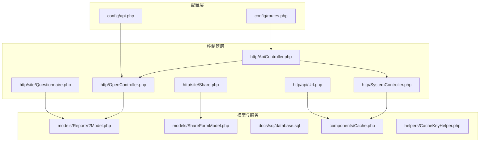
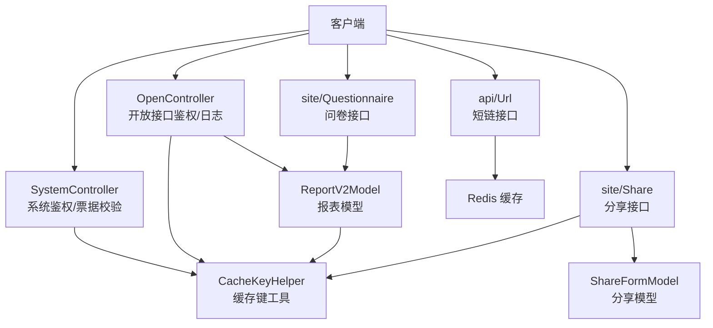
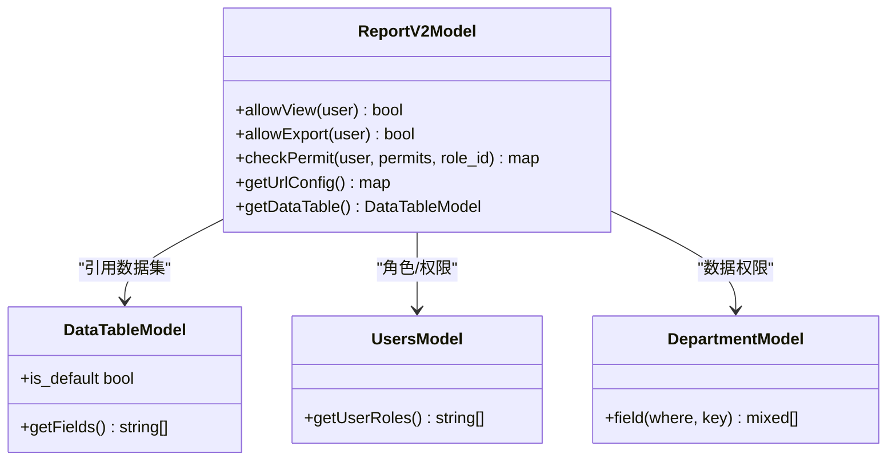
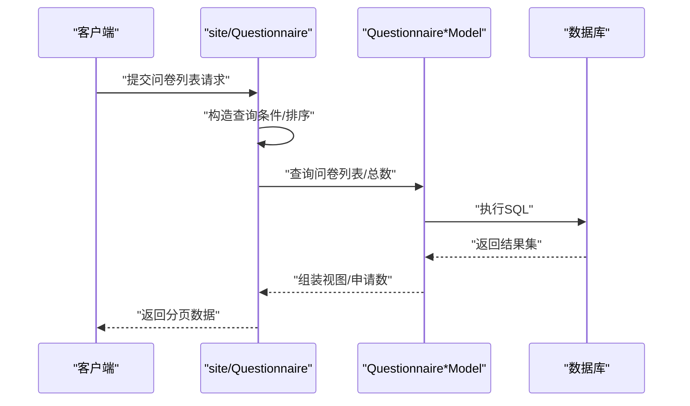
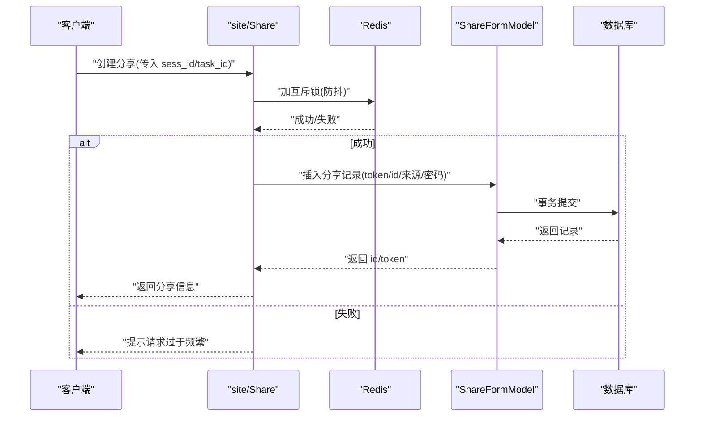
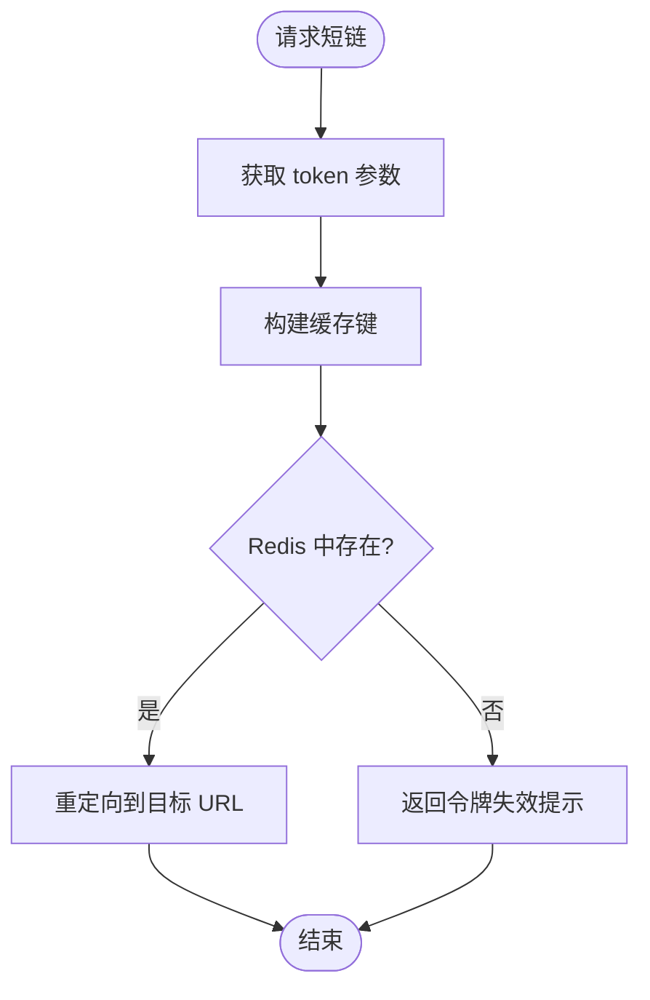
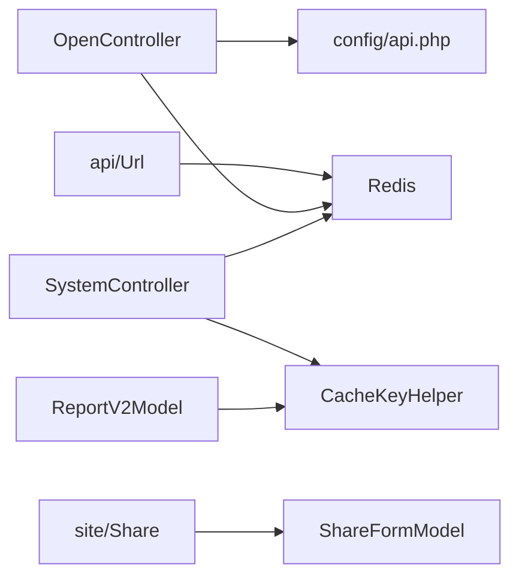

# 业务功能接口

<cite>
**本文引用的文件**
- [ApiController.php](file://process/src/http/ApiController.php)
- [OpenController.php](file://process/src/http/OpenController.php)
- [SystemController.php](file://process/src/http/SystemController.php)
- [routes.php](file://process/src/config/routes.php)
- [api.php](file://process/src/config/api.php)
- [Cache.php](file://process/src/components/Cache.php)
- [CacheKeyHelper.php](file://process/src/helpers/CacheKeyHelper.php)
- [ReportV2Model.php](file://process/src/models/ReportV2Model.php)
- [database.sql](file://process/docs/sql/database.sql)
- [Questionnaire.php](file://process/src/http/site/Questionnaire.php)
- [Share.php](file://process/src/http/site/Share.php)
- [ShareFormModel.php](file://process/src/models/ShareFormModel.php)
- [Url.php](file://process/src/http/api/Url.php)
</cite>

## 目录
1. [引言](#引言)
2. [项目结构](#项目结构)
3. [核心组件](#核心组件)
4. [架构总览](#架构总览)
5. [详细组件分析](#详细组件分析)
6. [依赖分析](#依赖分析)
7. [性能考虑](#性能考虑)
8. [故障排查指南](#故障排查指南)
9. [结论](#结论)
10. [附录](#附录)

## 引言
本文件面向业务功能接口，聚焦四大模块：报表接口（数据统计、图表展示、导出）、问卷接口（调查设计、填写收集、结果分析）、分享接口（链接生成、权限控制、访问统计）、URL 接口（短链生成、跳转管理、安全防护）。文档从架构、数据流、处理逻辑、集成与性能优化、安全与审计等方面进行系统化梳理，帮助开发者快速理解与落地。

## 项目结构
- 控制器层位于 http 目录，按业务域划分：api、open、site、system 等命名空间，分别承载开放接口、系统内部接口、站点业务接口与后台系统接口。
- 配置层位于 config 目录，集中管理路由、API 分类与接口清单。
- 业务模型与服务位于 models、services 目录，支撑报表、问卷、分享、缓存等核心能力。
- 辅助工具位于 helpers、components，提供缓存键、通用缓存、安全与工具方法。

**图示来源**
- [ApiController.php](file://process/src/http/ApiController.php#L1-L9)
- [OpenController.php](file://process/src/http/OpenController.php#L1-L209)
- [SystemController.php](file://process/src/http/SystemController.php#L1-L95)
- [Questionnaire.php](file://process/src/http/site/Questionnaire.php#L1-L200)
- [Share.php](file://process/src/http/site/Share.php#L1-L174)
- [Url.php](file://process/src/http/api/Url.php#L1-L20)
- [api.php](file://process/src/config/api.php#L1-L800)
- [routes.php](file://process/src/config/routes.php#L1-L4)
- [ReportV2Model.php](file://process/src/models/ReportV2Model.php#L1-L624)
- [ShareFormModel.php](file://process/src/models/ShareFormModel.php#L1-L83)
- [database.sql](file://process/docs/sql/database.sql#L1191-L1222)
- [Cache.php](file://process/src/components/Cache.php#L1-L136)
- [CacheKeyHelper.php](file://process/src/helpers/CacheKeyHelper.php#L1-L636)

**章节来源**
- [ApiController.php](file://process/src/http/ApiController.php#L1-L9)
- [OpenController.php](file://process/src/http/OpenController.php#L1-L209)
- [SystemController.php](file://process/src/http/SystemController.php#L1-L95)
- [routes.php](file://process/src/config/routes.php#L1-L4)

## 核心组件
- 报表接口：依托报表模型与数据集配置，支持多类型报表、字段权限与数据权限、导出与链接生成。
- 问卷接口：覆盖问卷生命周期管理、表单渲染、填写收集、统计分析与导出。
- 分享接口：生成带权限控制的分享链接，支持密码与来源配置，记录访问状态。
- URL 接口：短链生成与跳转，基于 Redis 缓存与令牌校验，具备安全与防刷能力。
- 缓存与安全：统一缓存组件与缓存键工具，配合系统级鉴权与票据校验，保障性能与安全。

**章节来源**
- [ReportV2Model.php](file://process/src/models/ReportV2Model.php#L1-L624)
- [Questionnaire.php](file://process/src/http/site/Questionnaire.php#L1-L200)
- [Share.php](file://process/src/http/site/Share.php#L1-L174)
- [ShareFormModel.php](file://process/src/models/ShareFormModel.php#L1-L83)
- [Url.php](file://process/src/http/api/Url.php#L1-L20)
- [Cache.php](file://process/src/components/Cache.php#L1-L136)
- [CacheKeyHelper.php](file://process/src/helpers/CacheKeyHelper.php#L1-L636)

## 架构总览
整体采用“控制器-模型-服务-缓存/存储”的分层架构。开放接口通过 OpenController 统一鉴权与日志；系统接口通过 SystemController 进行动态票据校验与菜单权限；站点接口负责业务域功能；URL 接口提供短链跳转；缓存组件与缓存键工具贯穿全链路，提升性能与一致性。

**图示来源**
- [OpenController.php](file://process/src/http/OpenController.php#L1-L209)
- [SystemController.php](file://process/src/http/SystemController.php#L1-L95)
- [Questionnaire.php](file://process/src/http/site/Questionnaire.php#L1-L200)
- [Share.php](file://process/src/http/site/Share.php#L1-L174)
- [ShareFormModel.php](file://process/src/models/ShareFormModel.php#L1-L83)
- [Url.php](file://process/src/http/api/Url.php#L1-L20)
- [ReportV2Model.php](file://process/src/models/ReportV2Model.php#L1-L624)
- [CacheKeyHelper.php](file://process/src/helpers/CacheKeyHelper.php#L1-L636)

## 详细组件分析

### 报表接口（数据统计、图表展示、导出）
- 功能定位
  - 数据统计：基于数据集配置与全局条件，按角色与数据权限聚合统计。
  - 图表展示：图形报表类型支持图表配置，普通/脚本报表支持结果字段与排序配置。
  - 导出能力：按导出权限组控制导出范围，支持导出提示文案与导出日志。
- 关键实现
  - 报表模型定义字段、类型、权限与链接配置，提供可见与导出权限判定。
  - 数据权限支持部门、个人、二级部门、自定义、关联表等多种维度，结合附加条件动态拼装查询。
  - 字段权限支持只读与隐藏，结合唯一字段自动放行。
  - 链接生成支持预览、分享、编辑三种模式，兼容旧版报表授权。
- 数据模型
  - 报表元数据与数据集表结构见数据库文档，包含报表配置、数据集、采集规则等。

**图示来源**
- [ReportV2Model.php](file://process/src/models/ReportV2Model.php#L1-L624)

**章节来源**
- [ReportV2Model.php](file://process/src/models/ReportV2Model.php#L1-L624)
- [database.sql](file://process/docs/sql/database.sql#L1191-L1222)

### 问卷接口（调查设计、填写收集、结果分析）
- 功能定位
  - 调查设计：支持问卷生命周期管理、表单组件与字段配置、权限控制。
  - 填写收集：支持预览、统计页面、答卷查看、标记无效、导出、删除等。
  - 结果分析：提供统计分析与导出能力，支持导出日志记录。
- 关键实现
  - 控制器基类统一鉴权入口，除部分公开接口外，均需具备问卷相关授权。
  - 列表查询支持状态、时间、标题、创建人等多维筛选，统计视图与申请数聚合。
  - 分页注解简化分页参数处理，提升开发效率。
  - 与表单、流程、触发器、模板等服务协同，支撑复杂业务场景。

**图示来源**
- [Questionnaire.php](file://process/src/http/site/Questionnaire.php#L1-L200)

**章节来源**
- [Questionnaire.php](file://process/src/http/site/Questionnaire.php#L1-L200)

### 分享接口（链接生成、权限控制、访问统计）
- 功能定位
  - 链接生成：为流程实例或任务生成分享令牌，支持密码与来源配置。
  - 权限控制：仅限创建者或具备审批权限的人可生成；支持修改、删除与列表查询。
  - 访问统计：通过分享模型记录状态与访问行为，便于后续统计与审计。
- 关键实现
  - 并发控制：使用 Redis set nx ex 防抖，避免重复提交。
  - 令牌校验：分享模型对 token 与 id 组合进行校验，失效或作废状态拦截。
  - 列表聚合：按会话聚合分享列表，补充应用图标、任务名等上下文信息。

**图示来源**
- [Share.php](file://process/src/http/site/Share.php#L1-L174)
- [ShareFormModel.php](file://process/src/models/ShareFormModel.php#L1-L83)

**章节来源**
- [Share.php](file://process/src/http/site/Share.php#L1-L174)
- [ShareFormModel.php](file://process/src/models/ShareFormModel.php#L1-L83)

### URL 接口（短链生成、跳转管理、安全防护）
- 功能定位
  - 短链生成：通过服务层生成短链令牌并持久化映射。
  - 跳转管理：短链接口根据令牌从缓存读取目标 URL 并重定向。
  - 安全防护：令牌过期校验、防刷互斥、最小权限暴露。
- 关键实现
  - 短链接口从 Redis 读取映射，命中即重定向，未命中返回失效提示。
  - 与缓存组件协作，确保跨进程一致与低延迟。

**图示来源**
- [Url.php](file://process/src/http/api/Url.php#L1-L20)

**章节来源**
- [Url.php](file://process/src/http/api/Url.php#L1-L20)

## 依赖分析
- 控制器继承关系
  - ApiController 为抽象基类，OpenController/SystemController/UserController 等在其之上扩展鉴权与前置逻辑。
- 模块耦合
  - 报表接口强依赖数据集模型与权限模型，形成“配置-权限-数据”闭环。
  - 分享接口依赖任务/会话模型与 Redis，强调并发控制与幂等。
  - URL 接口依赖 Redis 缓存，强调高并发与低延迟。
- 外部依赖
  - Redis：缓存、互斥锁、短链映射。
  - 数据库：报表、数据集、分享、用户等核心数据。
  - 配置：API 分类与接口清单集中管理，便于统一治理。

**图示来源**
- [OpenController.php](file://process/src/http/OpenController.php#L1-L209)
- [SystemController.php](file://process/src/http/SystemController.php#L1-L95)
- [api.php](file://process/src/config/api.php#L1-L800)
- [CacheKeyHelper.php](file://process/src/helpers/CacheKeyHelper.php#L1-L636)
- [ReportV2Model.php](file://process/src/models/ReportV2Model.php#L1-L624)
- [Share.php](file://process/src/http/site/Share.php#L1-L174)
- [ShareFormModel.php](file://process/src/models/ShareFormModel.php#L1-L83)
- [Url.php](file://process/src/http/api/Url.php#L1-L20)

**章节来源**
- [OpenController.php](file://process/src/http/OpenController.php#L1-L209)
- [SystemController.php](file://process/src/http/SystemController.php#L1-L95)
- [api.php](file://process/src/config/api.php#L1-L800)

## 性能考虑
- 缓存策略
  - 统一缓存组件定期清理过期对象，基于 Redis 维护版本一致性，进程间共享缓存键。
  - 使用缓存键工具生成报表权限、统计数据、访问量等键值，降低数据库压力。
- 并发与互斥
  - 分享接口使用 Redis set nx ex 实现轻量互斥，避免重复提交与竞争条件。
  - 短链接口通过缓存命中直接重定向，减少数据库与业务逻辑开销。
- 查询优化
  - 报表接口按角色与数据权限动态拼装 where 条件，尽量利用索引与数组字段查询。
  - 列表接口使用分页注解与必要字段选择，减少网络与序列化成本。

**章节来源**
- [Cache.php](file://process/src/components/Cache.php#L1-L136)
- [CacheKeyHelper.php](file://process/src/helpers/CacheKeyHelper.php#L1-L636)
- [Share.php](file://process/src/http/site/Share.php#L1-L174)
- [Url.php](file://process/src/http/api/Url.php#L1-L20)

## 故障排查指南
- 开放接口鉴权失败
  - 检查 access_token 是否传递与有效；确认开发者授权 API 与 app_id 白名单。
  - 日志记录与 action 映射有助于定位具体接口与请求方法。
- 系统鉴权失败
  - 校验用户身份类型与票据校验流程；检查 UA/IP/时间戳等参数完整性。
- 报表权限异常
  - 确认角色与数据权限配置；核对字段权限与唯一字段放行规则。
  - 若权限组为空，默认允许查看，注意与业务期望的一致性。
- 分享链接无效
  - 校验 token 与 id 组合；确认状态未被作废；检查互斥锁是否导致创建失败。
- 短链跳转失败
  - 校验令牌是否过期；确认缓存键是否存在；检查重定向目标是否正确。

**章节来源**
- [OpenController.php](file://process/src/http/OpenController.php#L1-L209)
- [SystemController.php](file://process/src/http/SystemController.php#L1-L95)
- [ReportV2Model.php](file://process/src/models/ReportV2Model.php#L1-L624)
- [ShareFormModel.php](file://process/src/models/ShareFormModel.php#L1-L83)
- [Url.php](file://process/src/http/api/Url.php#L1-L20)

## 结论
本项目围绕报表、问卷、分享与短链四类业务接口构建了清晰的分层架构与完善的鉴权、缓存与安全体系。通过配置化的 API 清单与统一的缓存键工具，实现了高性能与可扩展的业务能力。建议在生产环境中进一步完善埋点与审计日志，强化异常监控与告警，持续优化热点查询与缓存命中率。

## 附录
- 业务场景示例
  - 报表：按部门/个人/自定义范围聚合统计，支持图表与导出。
  - 问卷：多阶段生命周期管理，支持导出与统计分析。
  - 分享：面向外部用户的受控访问，支持密码与来源控制。
  - 短链：对外跳转与分享链接的统一入口，具备安全与防刷能力。
- 集成指南
  - 开放接口：在配置中注册 API，按需启用 access_token 校验与 app_id 白名单。
  - 系统接口：启用动态票据校验，结合 UA/IP/时间戳与 Cookie 校验。
  - 报表：在报表模型中配置数据集、字段与权限，生成分享/预览/编辑链接。
  - 问卷：通过站点控制器调用，结合表单与流程服务完成完整闭环。
  - 分享：调用分享控制器创建令牌，前端拼接分享链接并校验状态。
  - 短链：服务端生成 token 并写入缓存，客户端调用短链接口进行跳转。
- 性能优化方案
  - 使用缓存键工具对热点数据建立缓存，缩短响应路径。
  - 对高频接口引入互斥锁与限流策略，避免抖动。
  - 报表查询尽量使用数组字段与索引字段，减少全表扫描。
  - 对导出与统计类任务异步化，结合队列与进度上报。