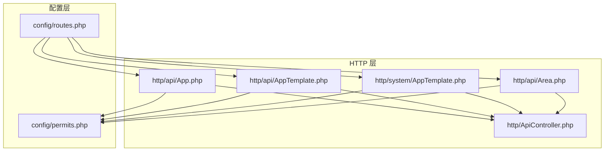
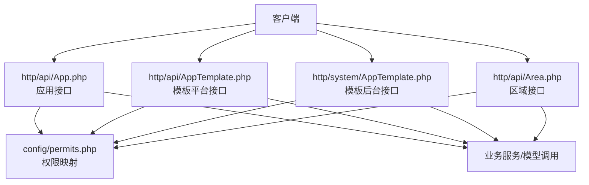
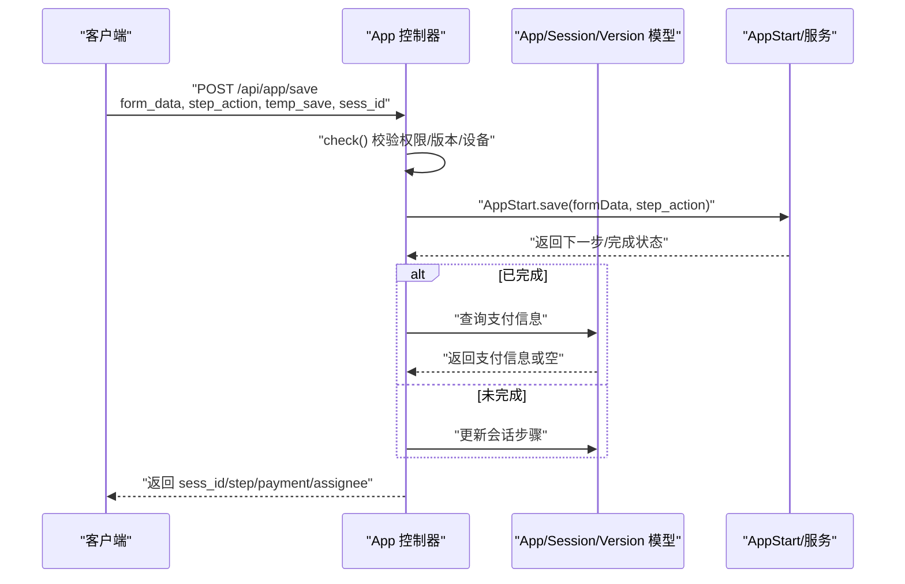
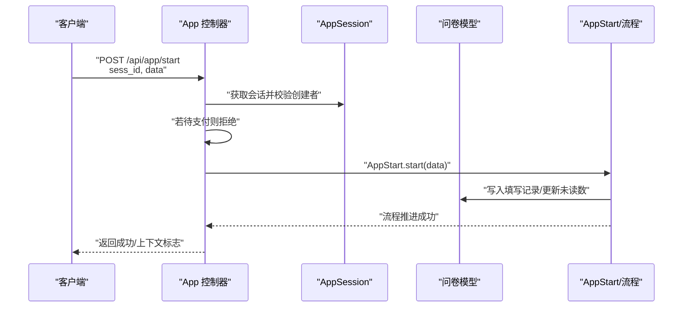
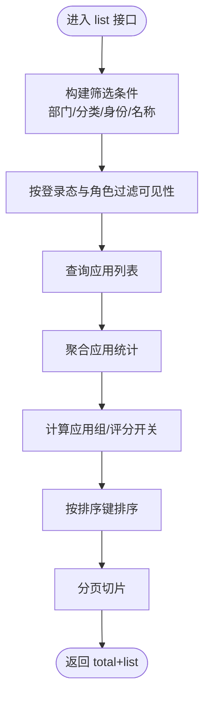
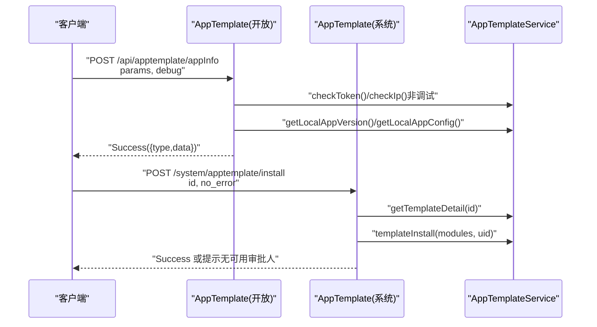
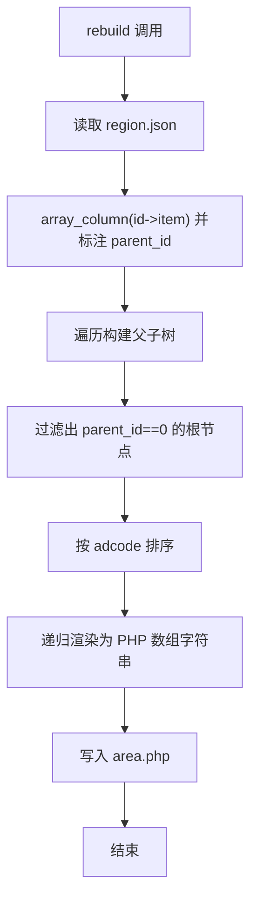
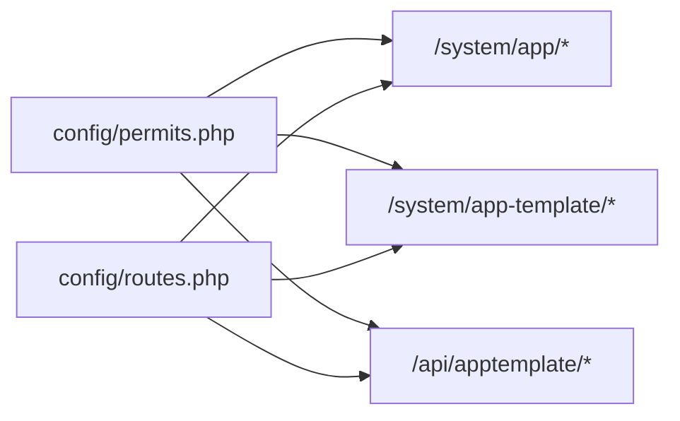

# 应用管理接口

<cite>
**本文引用的文件**
- [process/src/http/api/App.php](file://process/src/http/api/App.php)
- [process/src/http/api/AppTemplate.php](file://process/src/http/api/AppTemplate.php)
- [process/src/http/system/AppTemplate.php](file://process/src/http/system/AppTemplate.php)
- [process/src/http/api/Area.php](file://process/src/http/api/Area.php)
- [process/src/config/permits.php](file://process/src/config/permits.php)
- [process/src/config/routes.php](file://process/src/config/routes.php)
- [process/src/http/ApiController.php](file://process/src/http/ApiController.php)
</cite>

## 目录
1. [引言](#引言)
2. [项目结构](#项目结构)
3. [核心组件](#核心组件)
4. [架构总览](#架构总览)
5. [详细组件分析](#详细组件分析)
6. [依赖分析](#依赖分析)
7. [性能考虑](#性能考虑)
8. [故障排查指南](#故障排查指南)
9. [结论](#结论)
10. [附录](#附录)

## 引言
本文件面向应用管理与模板体系的 API 接口，围绕以下目标展开：应用创建、配置与生命周期管理；应用模板的模板管理、复制与发布；区域接口的地理信息管理与区域划分；权限控制、版本管理与部署配置；应用开发指南、模板使用示例与区域数据结构说明；以及应用市场接入、模板标准化与区域数据同步机制。文档以仓库中现有实现为依据，结合权限配置与路由约定，给出可操作的接口说明与流程图示。

## 项目结构
- 控制器层位于 http/api 与 http/system 下，分别承载开放接口与系统后台接口。
- 权限规则集中于 config/permits.php，按路径前缀匹配角色/权限标识。
- 路由配置位于 config/routes.php，当前为空数组，实际路由由框架或模块加载机制决定。
- 应用相关控制器包括 App（前台应用接口）、AppTemplate（模板平台接口与系统后台模板接口）、Area（区域数据接口）。

图表来源
- [process/src/http/api/App.php](file://process/src/http/api/App.php#L1-L120)
- [process/src/http/api/AppTemplate.php](file://process/src/http/api/AppTemplate.php#L1-L89)
- [process/src/http/system/AppTemplate.php](file://process/src/http/system/AppTemplate.php#L1-L104)
- [process/src/http/api/Area.php](file://process/src/http/api/Area.php#L1-L51)
- [process/src/http/ApiController.php](file://process/src/http/ApiController.php#L1-L9)
- [process/src/config/permits.php](file://process/src/config/permits.php#L1-L120)
- [process/src/config/routes.php](file://process/src/config/routes.php#L1-L4)

章节来源
- [process/src/http/api/App.php](file://process/src/http/api/App.php#L1-L120)
- [process/src/http/api/AppTemplate.php](file://process/src/http/api/AppTemplate.php#L1-L89)
- [process/src/http/system/AppTemplate.php](file://process/src/http/system/AppTemplate.php#L1-L104)
- [process/src/http/api/Area.php](file://process/src/http/api/Area.php#L1-L51)
- [process/src/config/permits.php](file://process/src/config/permits.php#L1-L120)
- [process/src/config/routes.php](file://process/src/config/routes.php#L1-L4)
- [process/src/http/ApiController.php](file://process/src/http/ApiController.php#L1-L9)

## 核心组件
- 应用接口（http/api/App.php）
  - 提供应用详情、流程图 SVG、应用列表、我的应用、服务大厅、发起保存与启动等能力。
  - 关键方法：detail、proc、list、homeApps、serviceList、save、start 等。
- 应用模板接口（http/api/AppTemplate.php 与 http/system/AppTemplate.php）
  - 对外：提供模板平台的事项信息查询、登录校验。
  - 后台：提供模板标签、模板列表、模板详情、安装与通知。
- 区域接口（http/api/Area.php）
  - 提供区域数据输出与重建逻辑（基于本地 JSON 构建 PHP 数组配置）。

章节来源
- [process/src/http/api/App.php](file://process/src/http/api/App.php#L58-L204)
- [process/src/http/api/AppTemplate.php](file://process/src/http/api/AppTemplate.php#L24-L88)
- [process/src/http/system/AppTemplate.php](file://process/src/http/system/AppTemplate.php#L14-L103)
- [process/src/http/api/Area.php](file://process/src/http/api/Area.php#L9-L51)

## 架构总览
应用管理相关接口遵循“控制器-服务-模型”的分层，权限通过 permits.php 的路径前缀映射到角色/权限标识，路由由框架或模块加载决定。应用接口侧重前台使用与流程交互，模板接口负责模板的检索、安装与发布，区域接口负责地理数据的维护与输出。

图表来源
- [process/src/http/api/App.php](file://process/src/http/api/App.php#L58-L204)
- [process/src/http/api/AppTemplate.php](file://process/src/http/api/AppTemplate.php#L24-L88)
- [process/src/http/system/AppTemplate.php](file://process/src/http/system/AppTemplate.php#L14-L103)
- [process/src/http/api/Area.php](file://process/src/http/api/Area.php#L9-L51)
- [process/src/config/permits.php](file://process/src/config/permits.php#L16-L60)

## 详细组件分析

### 应用接口（App）
- 功能要点
  - 列表与筛选：支持按部门、分类、身份、名称等条件筛选，支持多种排序策略（最热、最新、最近使用、分类排序）。
  - 权限校验：根据用户角色与禁用角色集合进行可见性过滤；访客场景下按公共角色与身份组合过滤。
  - 统计与属性：聚合应用统计、属性字典渲染、部门与身份信息拼装。
  - 流程与启动：返回流程 SVG、发起保存与启动流程，处理支付、审批人分配、异常分支。
- 关键流程（序列图）

图表来源
- [process/src/http/api/App.php](file://process/src/http/api/App.php#L614-L656)
- [process/src/http/api/App.php](file://process/src/http/api/App.php#L658-L727)
- [process/src/http/api/App.php](file://process/src/http/api/App.php#L729-L800)

- 关键流程（启动序列图）

图表来源
- [process/src/http/api/App.php](file://process/src/http/api/App.php#L737-L791)

- 数据流（列表筛选与排序）

图表来源
- [process/src/http/api/App.php](file://process/src/http/api/App.php#L229-L445)
- [process/src/http/api/App.php](file://process/src/http/api/App.php#L447-L514)

章节来源
- [process/src/http/api/App.php](file://process/src/http/api/App.php#L58-L204)
- [process/src/http/api/App.php](file://process/src/http/api/App.php#L229-L445)
- [process/src/http/api/App.php](file://process/src/http/api/App.php#L447-L514)
- [process/src/http/api/App.php](file://process/src/http/api/App.php#L614-L800)

### 应用模板接口（AppTemplate）
- 对外接口（http/api/AppTemplate.php）
  - appInfo：根据参数返回本地模板版本列表或配置数据；支持调试模式绕过校验。
  - login：基于 token/key 的登录跳转，调试模式可关闭校验。
- 系统后台接口（http/system/AppTemplate.php）
  - appTags：获取模板标签列表。
  - list：按关键词、标签、问卷类型、分类等条件分页查询模板。
  - detail：获取模板详情（含模块信息）。
  - install：安装模板，支持“无错误继续”选项，安装成功后触发通知。

图表来源
- [process/src/http/api/AppTemplate.php](file://process/src/http/api/AppTemplate.php#L24-L51)
- [process/src/http/api/AppTemplate.php](file://process/src/http/api/AppTemplate.php#L55-L88)
- [process/src/http/system/AppTemplate.php](file://process/src/http/system/AppTemplate.php#L21-L79)

章节来源
- [process/src/http/api/AppTemplate.php](file://process/src/http/api/AppTemplate.php#L24-L88)
- [process/src/http/system/AppTemplate.php](file://process/src/http/system/AppTemplate.php#L14-L103)

### 区域接口（Area）
- index：直接输出本地区域配置文件（由 rebuild 生成）。
- rebuild：从 region.json 读取数据，构建层级结构，生成 area.php（包含 label/value/children 的 PHP 数组）。

图表来源
- [process/src/http/api/Area.php](file://process/src/http/api/Area.php#L14-L51)

章节来源
- [process/src/http/api/Area.php](file://process/src/http/api/Area.php#L9-L51)

## 依赖分析
- 权限映射（config/permits.php）
  - 应用相关路径示例：
    - /system/app/save → matterCenter.matterManage | matterCenter.matterCreate
    - /system/app/list → matterCenter.matterManage
    - /system/app-template/* → matterCenter.templateCenter
  - 模板平台与系统后台：
    - /system/apptemplate/install → 模板安装权限（由系统后台控制器实现）
    - /api/apptemplate/* → 外部平台接口（需 token/IP 校验）
- 路由（config/routes.php）
  - 当前为空，具体路由由框架或模块加载机制决定，建议在对应模块中补充路由映射。

图表来源
- [process/src/config/permits.php](file://process/src/config/permits.php#L16-L60)
- [process/src/config/routes.php](file://process/src/config/routes.php#L1-L4)

章节来源
- [process/src/config/permits.php](file://process/src/config/permits.php#L16-L60)
- [process/src/config/routes.php](file://process/src/config/routes.php#L1-L4)

## 性能考虑
- 列表查询与统计分离：先查应用再聚合统计，避免一次性全量统计导致的 IO 压力。
- 分页与排序：服务大厅场景下先排序再分页，减少前端二次处理成本。
- 实时浏览量延迟计算：分页后按需获取实时浏览量，降低数据库压力。
- 缓存键与会话：安装模板时使用协程上下文传递“无错误继续”，减少重复校验成本。

章节来源
- [process/src/http/api/App.php](file://process/src/http/api/App.php#L229-L445)
- [process/src/http/system/AppTemplate.php](file://process/src/http/system/AppTemplate.php#L41-L79)

## 故障排查指南
- 权限不足
  - 现象：访问应用详情或列表时报无权访问。
  - 排查：确认用户角色与禁用角色集合是否满足 visible_roles 与 disable_roles 的交集过滤。
- 版本未发布
  - 现象：发起保存时报“应用未发布版本/未发布”。
  - 排查：确认应用已发布且存在 public_version_id。
- 支付未完成
  - 现象：启动流程返回“请先支付”。
  - 排查：检查会话状态是否为待支付，或是否存在支付回调未完成。
- 模板安装失败
  - 现象：安装时报“无可用审批人, 请联系管理员”。
  - 排查：检查模板模块依赖的审批人配置是否正确，必要时启用“无错误继续”。

章节来源
- [process/src/http/api/App.php](file://process/src/http/api/App.php#L674-L727)
- [process/src/http/api/App.php](file://process/src/http/api/App.php#L737-L791)
- [process/src/http/system/AppTemplate.php](file://process/src/http/system/AppTemplate.php#L60-L79)

## 结论
应用管理接口覆盖了从前台使用到后台模板管理与区域数据维护的完整链路。权限体系通过 permits.php 明确到路径级的权限映射，模板平台与系统后台接口职责清晰，区域接口提供了可重建的地理数据结构。建议后续完善路由配置与接口文档，并在模板安装与区域数据同步方面增加更细粒度的日志与回滚机制。

## 附录
- 应用接口清单（节选）
  - GET /api/app/items → 获取应用配置
  - GET /api/app/detail → 获取应用详情（含统计、属性、部门、身份）
  - GET /api/app/proc → 获取流程 SVG
  - GET /api/app/list → 应用列表（支持多维筛选与排序）
  - GET /api/app/homeApps → 我的应用
  - POST /api/app/save → 发起保存（支持暂存与下一步）
  - POST /api/app/start → 发起流程
- 模板接口清单（节选）
  - API 对外：
    - POST /api/apptemplate/appInfo → 查询模板配置/版本列表
    - GET /api/apptemplate/login → 登录跳转
  - 系统后台：
    - GET /system/apptemplate/tags → 模板标签
    - GET /system/apptemplate/list → 模板列表
    - GET /system/apptemplate/detail → 模板详情
    - POST /system/apptemplate/install → 安装模板
- 区域接口清单（节选）
  - GET /api/area/index → 输出区域配置
  - POST /api/area/rebuild → 重建区域配置文件

章节来源
- [process/src/http/api/App.php](file://process/src/http/api/App.php#L58-L204)
- [process/src/http/api/AppTemplate.php](file://process/src/http/api/AppTemplate.php#L24-L88)
- [process/src/http/system/AppTemplate.php](file://process/src/http/system/AppTemplate.php#L14-L103)
- [process/src/http/api/Area.php](file://process/src/http/api/Area.php#L9-L51)