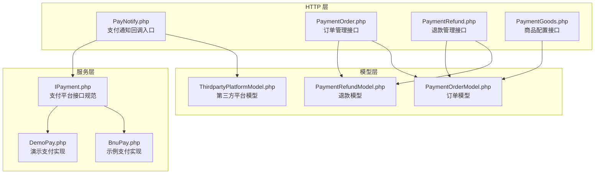
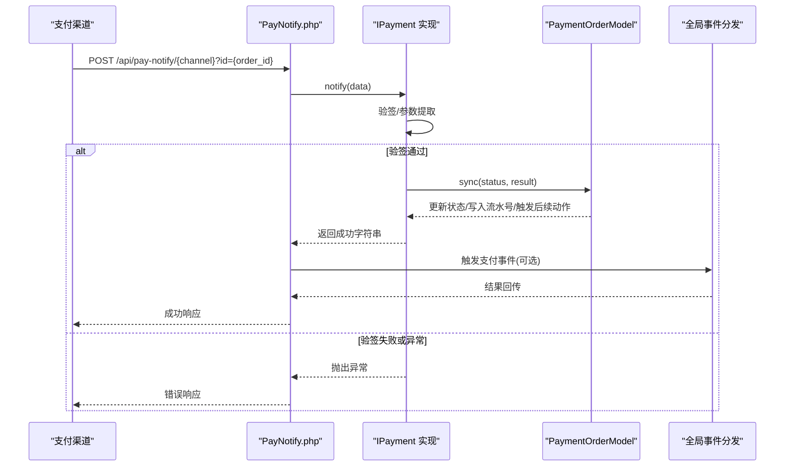
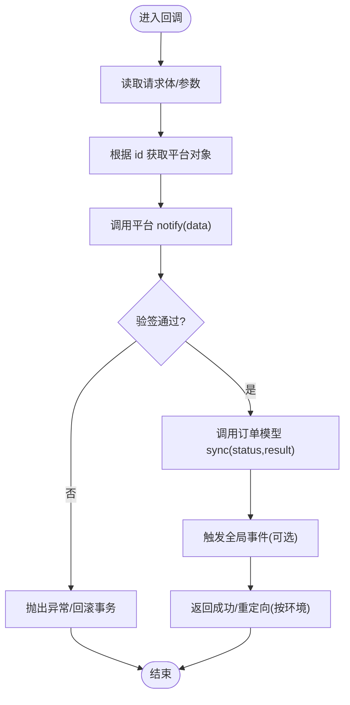
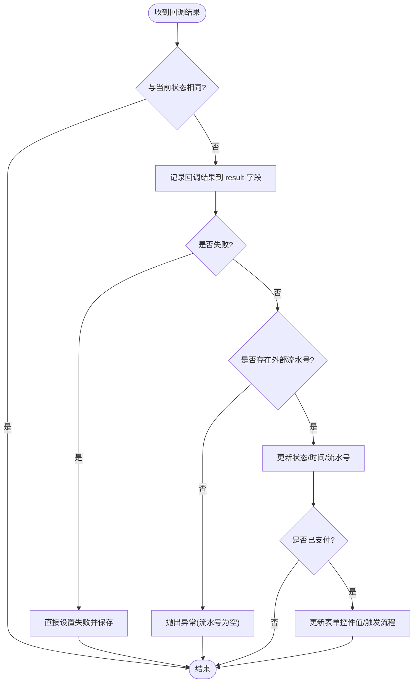
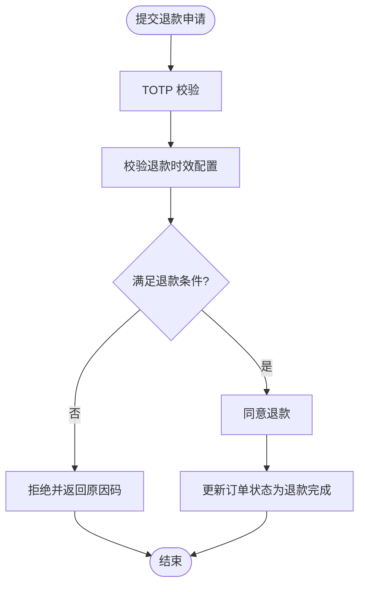
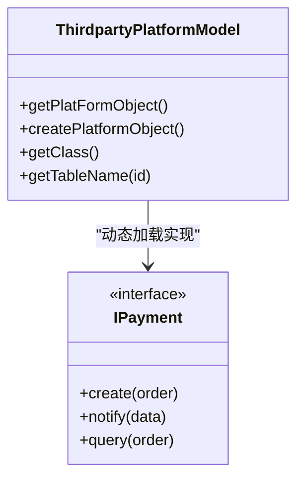
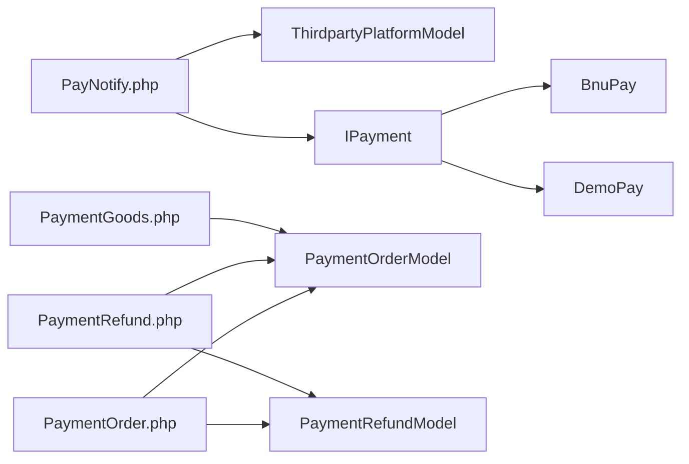

# 支付集成接口

<cite>
**本文引用的文件**
- [PayNotify.php](file://process/src/http/api/PayNotify.php)
- [PaymentOrder.php](file://process/src/http/system/PaymentOrder.php)
- [PaymentRefund.php](file://process/src/http/system/PaymentRefund.php)
- [PaymentOrderModel.php](file://process/src/models/PaymentOrderModel.php)
- [PaymentRefundModel.php](file://process/src/models/PaymentRefundModel.php)
- [ThirdpartyPlatformModel.php](file://process/src/models/ThirdpartyPlatformModel.php)
- [IPayment.php](file://process/src/services/platform/IPayment.php)
- [BnuPay.php](file://process/src/services/platform/BnuPay.php)
- [DemoPay.php](file://process/src/services/platform/DemoPay.php)
- [PaymentGoods.php](file://process/src/http/system/PaymentGoods.php)
</cite>

## 目录
1. [简介](#简介)
2. [项目结构](#项目结构)
3. [核心组件](#核心组件)
4. [架构总览](#架构总览)
5. [详细组件分析](#详细组件分析)
6. [依赖关系分析](#依赖关系分析)
7. [性能与并发特性](#性能与并发特性)
8. [安全策略与防重机制](#安全策略与防重机制)
9. [故障排查指南](#故障排查指南)
10. [结论](#结论)
11. [附录：接口清单与示例](#附录接口清单与示例)

## 简介
本文件面向支付集成工程师与平台对接开发者，系统化梳理支付通知回调、验签验证、状态更新、订单管理、退款流程、多支付渠道对接、账单对账与资金结算机制。文档以代码为依据，结合架构图与流程图，帮助快速理解回调链路、参数传递、数据格式与安全机制，并提供常见问题定位与优化建议。

## 项目结构
支付相关能力主要分布在以下模块：
- HTTP 层：对外暴露支付通知回调与后台管理接口
- 模型层：订单、退款、商品、第三方平台配置模型
- 服务层：支付平台适配器（实现统一接口）
- 控制器层：系统后台订单与退款管理

图表来源
- [PayNotify.php](file://process/src/http/api/PayNotify.php#L1-L136)
- [PaymentOrder.php](file://process/src/http/system/PaymentOrder.php#L1-L323)
- [PaymentRefund.php](file://process/src/http/system/PaymentRefund.php#L1-L254)
- [PaymentGoods.php](file://process/src/http/system/PaymentGoods.php#L1-L96)
- [PaymentOrderModel.php](file://process/src/models/PaymentOrderModel.php#L1-L284)
- [PaymentRefundModel.php](file://process/src/models/PaymentRefundModel.php#L1-L109)
- [ThirdpartyPlatformModel.php](file://process/src/models/ThirdpartyPlatformModel.php#L1-L687)
- [IPayment.php](file://process/src/services/platform/IPayment.php#L1-L19)
- [BnuPay.php](file://process/src/services/platform/BnuPay.php#L1-L261)
- [DemoPay.php](file://process/src/services/platform/DemoPay.php#L1-L75)

章节来源
- [PayNotify.php](file://process/src/http/api/PayNotify.php#L1-L136)
- [PaymentOrder.php](file://process/src/http/system/PaymentOrder.php#L1-L323)
- [PaymentRefund.php](file://process/src/http/system/PaymentRefund.php#L1-L254)
- [PaymentGoods.php](file://process/src/http/system/PaymentGoods.php#L1-L96)
- [PaymentOrderModel.php](file://process/src/models/PaymentOrderModel.php#L1-L284)
- [PaymentRefundModel.php](file://process/src/models/PaymentRefundModel.php#L1-L109)
- [ThirdpartyPlatformModel.php](file://process/src/models/ThirdpartyPlatformModel.php#L1-L687)
- [IPayment.php](file://process/src/services/platform/IPayment.php#L1-L19)
- [BnuPay.php](file://process/src/services/platform/BnuPay.php#L1-L261)
- [DemoPay.php](file://process/src/services/platform/DemoPay.php#L1-L75)

## 核心组件
- 支付通知回调控制器：统一入口，按渠道分发至对应平台实现，完成验签与状态同步
- 订单模型：定义状态枚举、状态转换、过期与异常处理、同步平台数据
- 退款模型：定义退款状态、时效校验、结果存储
- 第三方平台模型：平台能力与分类、动态加载平台实现对象
- 支付平台接口：统一 create/notify/query 三段式能力
- 示例与演示实现：BnuPay、DemoPay 展示签名、回调、查询与金额格式化

章节来源
- [PayNotify.php](file://process/src/http/api/PayNotify.php#L1-L136)
- [PaymentOrderModel.php](file://process/src/models/PaymentOrderModel.php#L1-L284)
- [PaymentRefundModel.php](file://process/src/models/PaymentRefundModel.php#L1-L109)
- [ThirdpartyPlatformModel.php](file://process/src/models/ThirdpartyPlatformModel.php#L1-L687)
- [IPayment.php](file://process/src/services/platform/IPayment.php#L1-L19)
- [BnuPay.php](file://process/src/services/platform/BnuPay.php#L1-L261)
- [DemoPay.php](file://process/src/services/platform/DemoPay.php#L1-L75)

## 架构总览
支付回调整体流程如下：

图表来源
- [PayNotify.php](file://process/src/http/api/PayNotify.php#L1-L136)
- [IPayment.php](file://process/src/services/platform/IPayment.php#L1-L19)
- [PaymentOrderModel.php](file://process/src/models/PaymentOrderModel.php#L1-L284)

章节来源
- [PayNotify.php](file://process/src/http/api/PayNotify.php#L1-L136)
- [IPayment.php](file://process/src/services/platform/IPayment.php#L1-L19)
- [PaymentOrderModel.php](file://process/src/models/PaymentOrderModel.php#L1-L284)

## 详细组件分析

### 支付通知回调组件 PayNotify
- 路由设计：按渠道区分路由，微信回调独立路由；支付宝、迪科远望、演示、三方平台统一路由
- 参数与数据源：从请求体读取原始内容，解析为数组；根据 id 获取平台对象
- 验签与状态更新：调用平台实现的 notify，内部完成验签与状态同步；对三方平台记录回调参数并按环境定制返回
- 事务与幂等：对三方平台回调使用数据库事务包裹，防止重复回调导致的状态不一致；对已支付订单按特定环境直接返回

图表来源
- [PayNotify.php](file://process/src/http/api/PayNotify.php#L1-L136)
- [PaymentOrderModel.php](file://process/src/models/PaymentOrderModel.php#L1-L284)

章节来源
- [PayNotify.php](file://process/src/http/api/PayNotify.php#L1-L136)

### 订单模型 PaymentOrderModel
- 状态定义：待支付、已支付、退款申请中、退款成功、支付失败、退款失败、已过期、待支付、异常、预约超时等
- 同步逻辑：根据回调结果更新状态、支付时间、外部流水号；当状态为已支付时，联动表单控件值、审批或发起流程
- 过期与异常：提供订单过期批量处理与异常状态设置方法
- 订单号生成：基于时间+Redis自增的高并发订单号生成策略

图表来源
- [PaymentOrderModel.php](file://process/src/models/PaymentOrderModel.php#L1-L284)

章节来源
- [PaymentOrderModel.php](file://process/src/models/PaymentOrderModel.php#L1-L284)

### 退款模型 PaymentRefundModel
- 退款状态：申请中、同意、拒绝
- 退款校验：基于 TOTP 验证、商品退款时效配置、订单状态校验
- 结果存储：支持将第三方返回结果序列化存入 result 字段

图表来源
- [PaymentRefundModel.php](file://process/src/models/PaymentRefundModel.php#L1-L109)
- [PaymentRefund.php](file://process/src/http/system/PaymentRefund.php#L1-L254)

章节来源
- [PaymentRefundModel.php](file://process/src/models/PaymentRefundModel.php#L1-L109)
- [PaymentRefund.php](file://process/src/http/system/PaymentRefund.php#L1-L254)

### 第三方平台模型 ThirdpartyPlatformModel
- 平台能力与分类：支付、消息、登录、AI、地图等分类与能力标识
- 动态加载：根据 classname 创建平台实现对象，注入 id
- 类型映射：内置大量平台类型常量，覆盖多校/多渠道对接场景

图表来源
- [ThirdpartyPlatformModel.php](file://process/src/models/ThirdpartyPlatformModel.php#L1-L687)
- [IPayment.php](file://process/src/services/platform/IPayment.php#L1-L19)

章节来源
- [ThirdpartyPlatformModel.php](file://process/src/models/ThirdpartyPlatformModel.php#L1-L687)

### 支付平台实现（示例：BnuPay、DemoPay）
- BnuPay：展示完整回调验签、参数解密、状态同步与金额格式化
- DemoPay：演示模式，回调直接查询并同步为已支付

章节来源
- [BnuPay.php](file://process/src/services/platform/BnuPay.php#L1-L261)
- [DemoPay.php](file://process/src/services/platform/DemoPay.php#L1-L75)

### 订单管理接口（系统后台）
- 列表与筛选：按应用、姓名/学工号、订单号、流水号、时间范围等条件查询
- 导出与反馈：支持订单反馈导出、Excel 导出
- 明细与详情：返回订单、用户、部门、平台、退款记录等聚合信息
- 管理员退款：校验订单状态与权限，执行退款并更新订单状态

章节来源
- [PaymentOrder.php](file://process/src/http/system/PaymentOrder.php#L1-L323)

### 退款管理接口（系统后台）
- 申请列表与导出：按状态筛选“申请中”，支持导出
- 审核流程：TOTP 校验、退款条件校验，同意则更新退款状态与订单状态
- 记录查询：已同意的退款记录导出与查询

章节来源
- [PaymentRefund.php](file://process/src/http/system/PaymentRefund.php#L1-L254)

### 商品配置接口（系统后台）
- 商品列表、保存、详情、删除：支持预设金额与自定义金额上下限、平台关联字段

章节来源
- [PaymentGoods.php](file://process/src/http/system/PaymentGoods.php#L1-L96)

## 依赖关系分析
- 控制器依赖模型与平台接口，平台实现依赖模型与工具函数
- 订单模型与退款模型之间通过状态与外键关联
- 第三方平台模型负责平台实现的装载与分类

图表来源
- [PayNotify.php](file://process/src/http/api/PayNotify.php#L1-L136)
- [ThirdpartyPlatformModel.php](file://process/src/models/ThirdpartyPlatformModel.php#L1-L687)
- [IPayment.php](file://process/src/services/platform/IPayment.php#L1-L19)
- [BnuPay.php](file://process/src/services/platform/BnuPay.php#L1-L261)
- [DemoPay.php](file://process/src/services/platform/DemoPay.php#L1-L75)
- [PaymentOrder.php](file://process/src/http/system/PaymentOrder.php#L1-L323)
- [PaymentRefund.php](file://process/src/http/system/PaymentRefund.php#L1-L254)
- [PaymentGoods.php](file://process/src/http/system/PaymentGoods.php#L1-L96)
- [PaymentOrderModel.php](file://process/src/models/PaymentOrderModel.php#L1-L284)
- [PaymentRefundModel.php](file://process/src/models/PaymentRefundModel.php#L1-L109)

章节来源
- [PayNotify.php](file://process/src/http/api/PayNotify.php#L1-L136)
- [PaymentOrder.php](file://process/src/http/system/PaymentOrder.php#L1-L323)
- [PaymentRefund.php](file://process/src/http/system/PaymentRefund.php#L1-L254)
- [PaymentGoods.php](file://process/src/http/system/PaymentGoods.php#L1-L96)
- [PaymentOrderModel.php](file://process/src/models/PaymentOrderModel.php#L1-L284)
- [PaymentRefundModel.php](file://process/src/models/PaymentRefundModel.php#L1-L109)
- [ThirdpartyPlatformModel.php](file://process/src/models/ThirdpartyPlatformModel.php#L1-L687)
- [IPayment.php](file://process/src/services/platform/IPayment.php#L1-L19)
- [BnuPay.php](file://process/src/services/platform/BnuPay.php#L1-L261)
- [DemoPay.php](file://process/src/services/platform/DemoPay.php#L1-L75)

## 性能与并发特性
- 订单号生成：基于 Redis 的原子自增，分钟级键空间，具备高并发生成能力
- 回调处理：对三方平台回调使用数据库事务包裹，避免重复回调引发的竞态
- 查询与同步：平台实现提供 query 能力，用于对账与兜底同步，降低回调失败风险
- 导出与报表：后台导出采用分页与连接查询，注意大数据量时的索引与分页策略

章节来源
- [PaymentOrderModel.php](file://process/src/models/PaymentOrderModel.php#L1-L284)
- [PayNotify.php](file://process/src/http/api/PayNotify.php#L1-L136)
- [BnuPay.php](file://process/src/services/platform/BnuPay.php#L1-L261)

## 安全策略与防重机制
- 验签验证：各平台实现内部完成签名比对与参数完整性校验，确保回调来源可信
- 事务隔离：回调入口对三方平台回调使用事务，防止重复回调导致的重复入账
- 环境定制：针对特定学校环境，回调直接返回固定字符串或重定向，减少二次回调影响
- 退款安全：退款审核引入 TOTP 校验与权限控制，拒绝无授权操作
- 异常保护：订单模型提供异常状态设置，避免未知回调导致的状态不一致

章节来源
- [PayNotify.php](file://process/src/http/api/PayNotify.php#L1-L136)
- [BnuPay.php](file://process/src/services/platform/BnuPay.php#L1-L261)
- [PaymentRefund.php](file://process/src/http/system/PaymentRefund.php#L1-L254)
- [PaymentOrderModel.php](file://process/src/models/PaymentOrderModel.php#L1-L284)

## 故障排查指南
- 回调验签失败
  - 检查平台实现的验签逻辑与参数顺序
  - 确认回调参数是否被正确透传（GET/POST/HEADER/原始BODY）
- 订单状态异常
  - 查看订单模型 result 字段中的回调记录
  - 使用平台 query 能力进行对账与同步
- 重复回调导致状态不一致
  - 确认回调入口事务包裹逻辑
  - 对已支付订单直接返回，避免重复处理
- 退款审核失败
  - 核对 TOTP 校验与退款时效配置
  - 检查订单状态是否仍允许退款

章节来源
- [PayNotify.php](file://process/src/http/api/PayNotify.php#L1-L136)
- [PaymentOrderModel.php](file://process/src/models/PaymentOrderModel.php#L1-L284)
- [PaymentRefund.php](file://process/src/http/system/PaymentRefund.php#L1-L254)
- [BnuPay.php](file://process/src/services/platform/BnuPay.php#L1-L261)

## 结论
该支付集成体系以统一的平台接口为核心，通过控制器路由与模型同步实现回调闭环；以事务与验签保障安全性与一致性；以查询与对账能力提升可靠性。系统支持多渠道对接与后台管理，具备良好的扩展性与运维可观测性。

## 附录：接口清单与示例

- 支付通知回调
  - 微信回调：POST /api/pay-notify/wechat/{id}
  - 支付宝回调：POST /api/pay-notify/alipay?id={id}
  - 迪科远望回调：POST /api/pay-notify/datalook?id={id}&jsonData={...}
  - 演示回调：GET /api/pay-notify/demo?id={id}
  - 三方平台回调：POST /api/pay-notify/ThirdpartyPlatform?id={id}&sn={order_no}

- 订单管理接口（系统后台）
  - GET /system/payment/order/list
  - GET /system/payment/order/detail?id={id}
  - GET /system/payment/order/info?id={id}
  - POST /system/payment/order/refund（管理员退款）

- 退款管理接口（系统后台）
  - GET /system/payment/refund/list
  - GET /system/payment/refund/log
  - GET /system/payment/refund/detail?id={id}
  - POST /system/payment/refund/commit（审核）

- 商品配置接口（系统后台）
  - GET /system/payment/goods/list
  - GET /system/payment/goods/detail?id={id}
  - POST /system/payment/goods/save
  - POST /system/payment/goods/delete

章节来源
- [PayNotify.php](file://process/src/http/api/PayNotify.php#L1-L136)
- [PaymentOrder.php](file://process/src/http/system/PaymentOrder.php#L1-L323)
- [PaymentRefund.php](file://process/src/http/system/PaymentRefund.php#L1-L254)
- [PaymentGoods.php](file://process/src/http/system/PaymentGoods.php#L1-L96)