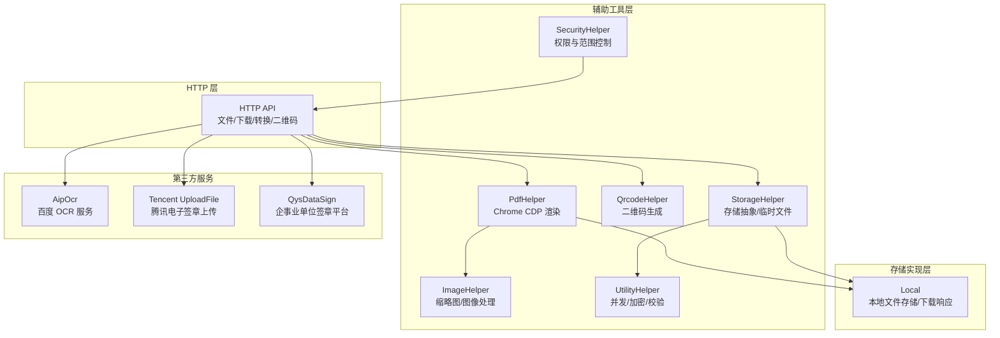
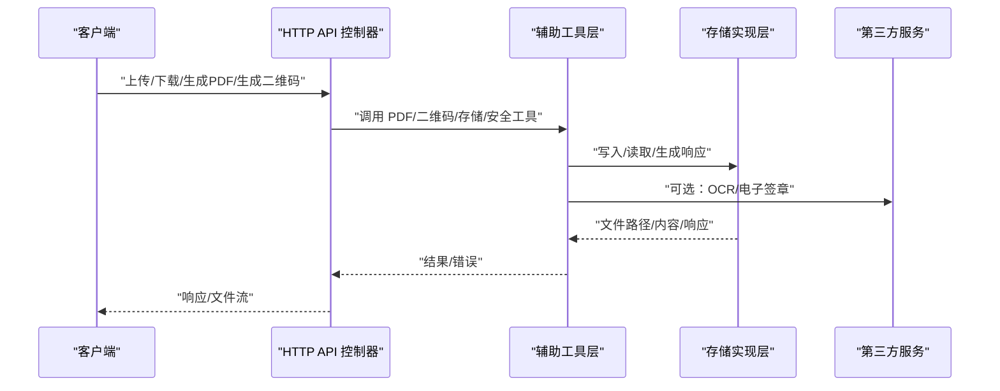
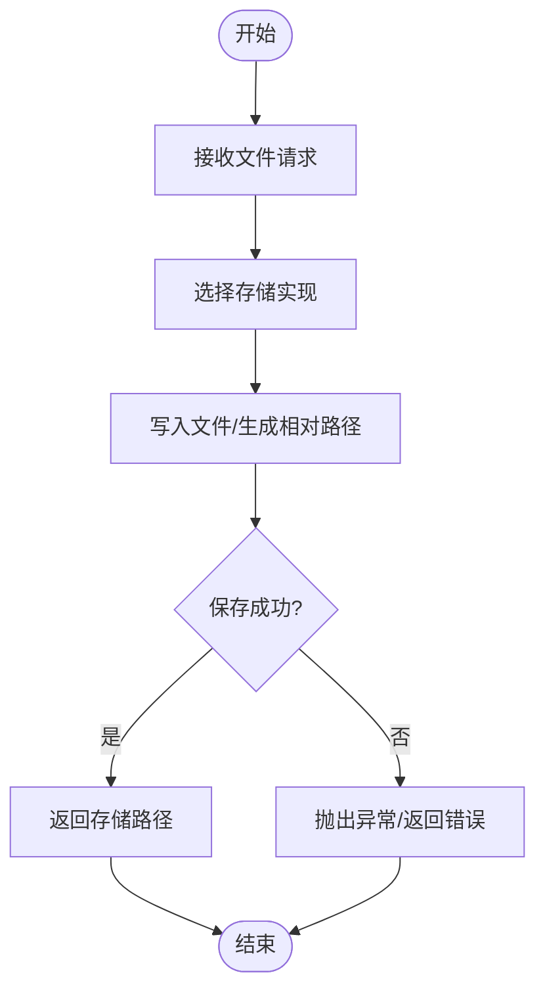
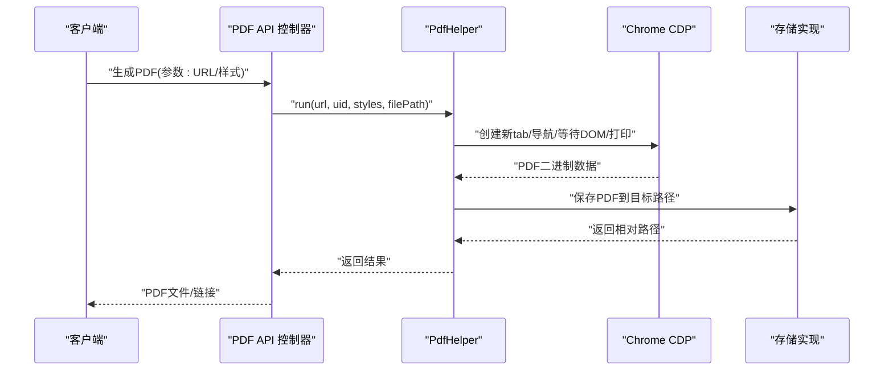
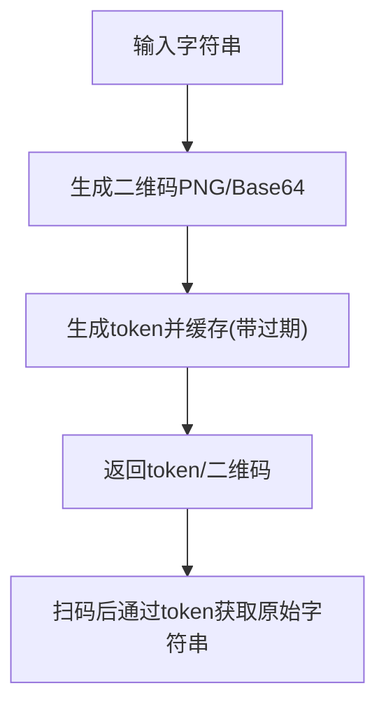
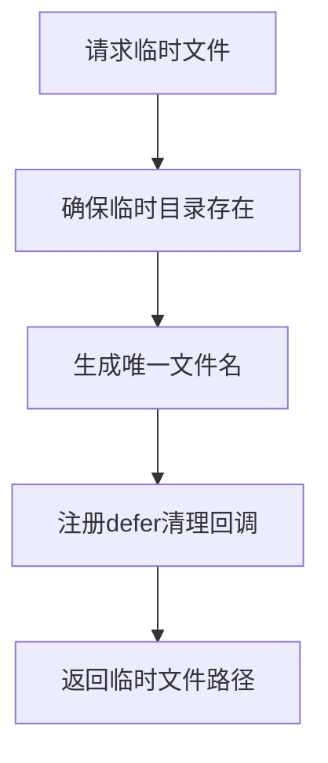
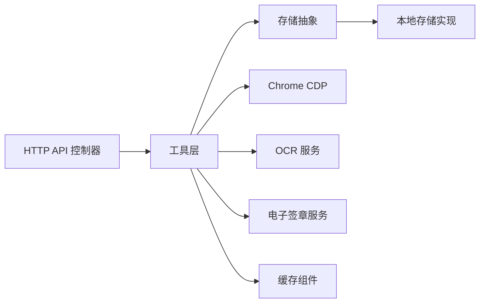

# 文档处理接口

<cite>
**本文引用的文件**
- [process/src/helpers/PdfHelper.php](file://process/src/helpers/PdfHelper.php)
- [process/src/helpers/QrcodeHelper.php](file://process/src/helpers/QrcodeHelper.php)
- [process/src/helpers/StorageHelper.php](file://process/src/helpers/StorageHelper.php)
- [process/src/services/storage/Local.php](file://process/src/services/storage/Local.php)
- [process/src/config/upload.php](file://process/src/config/upload.php)
- [process/src/http/api/File.php](file://process/src/http/api/File.php)
- [process/src/http/api/Pdf.php](file://process/src/http/api/Pdf.php)
- [process/src/http/api/Qrcode.php](file://process/src/http/api/Qrcode.php)
- [process/src/http/open/File.php](file://process/src/http/open/File.php)
- [process/src/http/open/DownloadFile.php](file://process/src/http/open/DownloadFile.php)
- [process/src/http/open/WordPdf.php](file://process/src/http/open/WordPdf.php)
- [process/src/lib/aip/AipOcr.php](file://process/src/lib/aip/AipOcr.php)
- [process/src/services/seal/tencent/UploadFile.php](file://process/src/services/seal/tencent/UploadFile.php)
- [process/src/services/seal/qys/QysDataSign.php](file://process/src/services/seal/qys/QysDataSign.php)
- [process/src/services/task/ExcelImportTask.php](file://process/src/services/task/ExcelImportTask.php)
- [process/src/components/Cache.php](file://process/src/components/Cache.php)
- [process/src/helpers/UtilityHelper.php](file://process/src/helpers/UtilityHelper.php)
- [process/src/helpers/ImageHelper.php](file://process/src/helpers/ImageHelper.php)
- [process/src/helpers/SM4.php](file://process/src/helpers/SM4.php)
- [process/src/helpers/SecurityHelper.php](file://process/src/helpers/SecurityHelper.php)
</cite>

## 目录
1. [引言](#引言)
2. [项目结构](#项目结构)
3. [核心组件](#核心组件)
4. [架构总览](#架构总览)
5. [详细组件分析](#详细组件分析)
6. [依赖关系分析](#依赖关系分析)
7. [性能考虑](#性能考虑)
8. [故障排查指南](#故障排查指南)
9. [结论](#结论)
10. [附录](#附录)

## 引言
本文件面向“文档处理接口”的技术与使用说明，覆盖以下能力：
- 文件接口：上传、下载、存储与管理
- PDF 接口：生成、合并、转换与签名
- 二维码接口：生成、识别与应用
- 临时文件接口：缓存与清理机制
- 安全与合规：格式支持、大小限制、安全检查
- 性能优化与批量处理：并发、内存管理与云存储集成
- 加密与签名：本地与第三方服务集成

## 项目结构
围绕文档处理的关键模块分布如下：
- HTTP 层：对外暴露的 API 控制器，如文件、PDF、二维码等
- 辅助工具层：PDF 渲染、二维码生成、存储抽象、图像处理、安全与通用工具
- 存储实现层：本地文件存储与响应封装
- 第三方服务集成：OCR、电子签章（腾讯云、企事业单位签章平台）

图表来源
- [process/src/http/api/File.php](file://process/src/http/api/File.php)
- [process/src/http/api/Pdf.php](file://process/src/http/api/Pdf.php)
- [process/src/http/api/Qrcode.php](file://process/src/http/api/Qrcode.php)
- [process/src/http/open/File.php](file://process/src/http/open/File.php)
- [process/src/http/open/DownloadFile.php](file://process/src/http/open/DownloadFile.php)
- [process/src/http/open/WordPdf.php](file://process/src/http/open/WordPdf.php)
- [process/src/helpers/PdfHelper.php](file://process/src/helpers/PdfHelper.php)
- [process/src/helpers/QrcodeHelper.php](file://process/src/helpers/QrcodeHelper.php)
- [process/src/helpers/StorageHelper.php](file://process/src/helpers/StorageHelper.php)
- [process/src/services/storage/Local.php](file://process/src/services/storage/Local.php)
- [process/src/lib/aip/AipOcr.php](file://process/src/lib/aip/AipOcr.php)
- [process/src/services/seal/tencent/UploadFile.php](file://process/src/services/seal/tencent/UploadFile.php)
- [process/src/services/seal/qys/QysDataSign.php](file://process/src/services/seal/qys/QysDataSign.php)

章节来源
- [process/src/http/api/File.php](file://process/src/http/api/File.php)
- [process/src/http/api/Pdf.php](file://process/src/http/api/Pdf.php)
- [process/src/http/api/Qrcode.php](file://process/src/http/api/Qrcode.php)
- [process/src/http/open/File.php](file://process/src/http/open/File.php)
- [process/src/http/open/DownloadFile.php](file://process/src/http/open/DownloadFile.php)
- [process/src/http/open/WordPdf.php](file://process/src/http/open/WordPdf.php)
- [process/src/helpers/PdfHelper.php](file://process/src/helpers/PdfHelper.php)
- [process/src/helpers/QrcodeHelper.php](file://process/src/helpers/QrcodeHelper.php)
- [process/src/helpers/StorageHelper.php](file://process/src/helpers/StorageHelper.php)
- [process/src/services/storage/Local.php](file://process/src/services/storage/Local.php)
- [process/src/lib/aip/AipOcr.php](file://process/src/lib/aip/AipOcr.php)
- [process/src/services/seal/tencent/UploadFile.php](file://process/src/services/seal/tencent/UploadFile.php)
- [process/src/services/seal/qys/QysDataSign.php](file://process/src/services/seal/qys/QysDataSign.php)

## 核心组件
- 文件上传与下载
  - 上传：通过 HTTP API 接收文件，调用存储抽象写入本地或其他后端
  - 下载：根据存储路径生成受控访问的响应
- PDF 处理
  - 生成：基于 Chrome DevTools Protocol，将网页渲染为 PDF 并持久化
  - 合并与转换：本地存储层提供 PDF 响应与内容读取
  - 签名：对接第三方电子签章服务
- 二维码
  - 生成：基于库生成 PNG 或 Base64 图像
  - 应用：生成 token 并缓存，便于后续识别与回溯
- 临时文件
  - 缓存：运行时临时目录创建与延迟清理
  - 清理：协程 defer 机制确保生命周期结束后删除

章节来源
- [process/src/helpers/StorageHelper.php](file://process/src/helpers/StorageHelper.php)
- [process/src/services/storage/Local.php](file://process/src/services/storage/Local.php)
- [process/src/helpers/PdfHelper.php](file://process/src/helpers/PdfHelper.php)
- [process/src/helpers/QrcodeHelper.php](file://process/src/helpers/QrcodeHelper.php)

## 架构总览
文档处理接口在 HTTP 层统一入口，内部通过工具层与存储层协作，并可选接入第三方服务。

图表来源
- [process/src/http/api/File.php](file://process/src/http/api/File.php)
- [process/src/http/api/Pdf.php](file://process/src/http/api/Pdf.php)
- [process/src/http/api/Qrcode.php](file://process/src/http/api/Qrcode.php)
- [process/src/helpers/PdfHelper.php](file://process/src/helpers/PdfHelper.php)
- [process/src/helpers/QrcodeHelper.php](file://process/src/helpers/QrcodeHelper.php)
- [process/src/helpers/StorageHelper.php](file://process/src/helpers/StorageHelper.php)
- [process/src/services/storage/Local.php](file://process/src/services/storage/Local.php)
- [process/src/lib/aip/AipOcr.php](file://process/src/lib/aip/AipOcr.php)
- [process/src/services/seal/tencent/UploadFile.php](file://process/src/services/seal/tencent/UploadFile.php)
- [process/src/services/seal/qys/QysDataSign.php](file://process/src/services/seal/qys/QysDataSign.php)

## 详细组件分析

### 文件接口（上传/下载/存储/管理）
- 功能要点
  - 上传：接收文件，选择存储实现，返回相对路径；支持多环境配置
  - 下载：根据存储路径生成受控访问响应；支持缩略图与 PDF 转换响应
  - 管理：存在性检查、读写流、删除
- 关键流程

图表来源
- [process/src/http/api/File.php](file://process/src/http/api/File.php)
- [process/src/helpers/StorageHelper.php](file://process/src/helpers/StorageHelper.php)
- [process/src/services/storage/Local.php](file://process/src/services/storage/Local.php)

- 典型调用链
  - 上传：HTTP API -> 存储抽象 -> 本地存储实现
  - 下载：HTTP API -> 本地存储实现 -> 文件/图片响应
- 安全与格式
  - 支持的扩展名由配置文件定义，不同分类（image/document/media/excel/word/all）可按需启用
  - 下载时可结合安全策略进行访问控制（见安全检查章节）

章节来源
- [process/src/http/api/File.php](file://process/src/http/api/File.php)
- [process/src/http/open/File.php](file://process/src/http/open/File.php)
- [process/src/http/open/DownloadFile.php](file://process/src/http/open/DownloadFile.php)
- [process/src/helpers/StorageHelper.php](file://process/src/helpers/StorageHelper.php)
- [process/src/services/storage/Local.php](file://process/src/services/storage/Local.php)
- [process/src/config/upload.php](file://process/src/config/upload.php)

### PDF 接口（生成/合并/转换/签名）
- 生成
  - 使用 Chrome DevTools Protocol，动态打开页面、等待 DOM 标记、打印为 PDF 并保存
  - 支持纸张尺寸、页边距、方向、背景打印、页眉页脚等样式参数
- 合并与转换
  - 本地存储层提供 PDF 响应与内容读取；可结合命令行工具进行格式转换
- 签名
  - 对接第三方电子签章服务（腾讯云/企事业单位平台），支持上传、下载、业务编号管理

图表来源
- [process/src/http/api/Pdf.php](file://process/src/http/api/Pdf.php)
- [process/src/helpers/PdfHelper.php](file://process/src/helpers/PdfHelper.php)
- [process/src/services/storage/Local.php](file://process/src/services/storage/Local.php)

- 参数与样式
  - 纸张尺寸、方向、缩放、页边距、背景、页眉页脚、CSS 优先等
  - DOM 就绪检测与超时兜底策略
- 第三方签名
  - 上传/下载文档、构造业务编号、调用签章平台接口

章节来源
- [process/src/helpers/PdfHelper.php](file://process/src/helpers/PdfHelper.php)
- [process/src/http/api/Pdf.php](file://process/src/http/api/Pdf.php)
- [process/src/services/seal/tencent/UploadFile.php](file://process/src/services/seal/tencent/UploadFile.php)
- [process/src/services/seal/qys/QysDataSign.php](file://process/src/services/seal/qys/QysDataSign.php)
- [process/src/http/open/WordPdf.php](file://process/src/http/open/WordPdf.php)

### 二维码接口（生成/识别/应用）
- 生成
  - 基于库生成 PNG，支持 Base64 输出
  - 生成 token 并写入缓存，设置过期时间
- 识别与应用
  - 可结合 OCR 服务识别二维码内容（如百度 OCR 的二维码识别接口）
  - 通过 token 回溯原始字符串，实现扫码即用

图表来源
- [process/src/helpers/QrcodeHelper.php](file://process/src/helpers/QrcodeHelper.php)
- [process/src/lib/aip/AipOcr.php](file://process/src/lib/aip/AipOcr.php)

章节来源
- [process/src/helpers/QrcodeHelper.php](file://process/src/helpers/QrcodeHelper.php)
- [process/src/lib/aip/AipOcr.php](file://process/src/lib/aip/AipOcr.php)

### 临时文件接口（缓存与清理）
- 缓存
  - 在运行时临时目录创建唯一文件名，避免冲突
  - 通过协程 defer 注册清理钩子，确保生命周期结束自动删除
- 清理
  - 未使用则删除；失败重试有限次数

图表来源
- [process/src/helpers/StorageHelper.php](file://process/src/helpers/StorageHelper.php)

章节来源
- [process/src/helpers/StorageHelper.php](file://process/src/helpers/StorageHelper.php)

### 安全检查与权限控制
- 设备/来源校验：根据 UA 判断设备类型，白名单 URL 校验
- 权限范围：针对某些参数进行用户身份与部门关系校验，防止越权查询
- 加密与哈希：提供密码哈希、SHA256 校验、对称加密/解密等工具方法

章节来源
- [process/src/helpers/UtilityHelper.php](file://process/src/helpers/UtilityHelper.php)
- [process/src/helpers/SecurityHelper.php](file://process/src/helpers/SecurityHelper.php)

### 批量处理与并发
- 并发执行：提供并行处理工具，限制协程通道容量，统一异常捕获与回调
- Excel 导入：分批写入、存在性检查、扩展名补全等

章节来源
- [process/src/helpers/UtilityHelper.php](file://process/src/helpers/UtilityHelper.php)
- [process/src/services/task/ExcelImportTask.php](file://process/src/services/task/ExcelImportTask.php)

### 云存储与文件加密
- 云存储集成
  - 通过存储抽象接口注入具体实现（默认本地），可替换为其他后端
  - 提供统一的 put/get/getResponse/delete 等能力
- 文件加密
  - 提供 AES-128-ECB 加解密工具；亦可结合国密算法（SM4）进行扩展

章节来源
- [process/src/helpers/StorageHelper.php](file://process/src/helpers/StorageHelper.php)
- [process/src/services/storage/Local.php](file://process/src/services/storage/Local.php)
- [process/src/helpers/SM4.php](file://process/src/helpers/SM4.php)

## 依赖关系分析
- 组件耦合
  - HTTP API 控制器依赖工具层；工具层依赖存储抽象；存储抽象依赖具体实现
  - PDF 渲染依赖 Chrome CDP 服务；二维码依赖第三方库；OCR/签章依赖外部平台
- 外部依赖
  - Chrome DevTools Protocol、Redis（缓存/版本同步）、第三方 OCR/签章服务
- 潜在循环依赖
  - 当前结构以工具层为桥梁，未见明显循环依赖

图表来源
- [process/src/http/api/File.php](file://process/src/http/api/File.php)
- [process/src/helpers/PdfHelper.php](file://process/src/helpers/PdfHelper.php)
- [process/src/helpers/QrcodeHelper.php](file://process/src/helpers/QrcodeHelper.php)
- [process/src/helpers/StorageHelper.php](file://process/src/helpers/StorageHelper.php)
- [process/src/services/storage/Local.php](file://process/src/services/storage/Local.php)
- [process/src/components/Cache.php](file://process/src/components/Cache.php)

## 性能考虑
- 协程与并发
  - 使用通道与屏障控制并发度，避免资源争用
  - 对耗时任务（如 PDF 渲染、OCR）采用异步与超时策略
- 内存管理
  - 提供内存清理与智能缓存清理策略，避免长时间占用
- I/O 与存储
  - 本地存储采用固定目录结构与权限设置；缩略图按需生成并复用
- 缓存与版本
  - 通过共享内存与 Redis 版本同步，定期清理过期对象

章节来源
- [process/src/helpers/UtilityHelper.php](file://process/src/helpers/UtilityHelper.php)
- [process/src/components/Cache.php](file://process/src/components/Cache.php)
- [process/src/services/storage/Local.php](file://process/src/services/storage/Local.php)

## 故障排查指南
- PDF 生成失败
  - 检查 Chrome 服务连通性与端口；确认 DOM 就绪标记是否存在；查看日志与调试开关
- 文件下载异常
  - 校验存储路径是否存在；确认 webUri 前缀与实际部署一致；检查权限与文件是否存在
- 二维码生成失败
  - 检查 token 写入 Redis 是否成功；确认过期时间与键前缀
- OCR/签章失败
  - 校验第三方服务接口与鉴权头；检查网络连通性与超时设置
- 并发/内存问题
  - 观察并发通道是否阻塞；启用内存清理策略；监控缓存命中与清理频率

章节来源
- [process/src/helpers/PdfHelper.php](file://process/src/helpers/PdfHelper.php)
- [process/src/helpers/QrcodeHelper.php](file://process/src/helpers/QrcodeHelper.php)
- [process/src/services/storage/Local.php](file://process/src/services/storage/Local.php)
- [process/src/lib/aip/AipOcr.php](file://process/src/lib/aip/AipOcr.php)
- [process/src/services/seal/tencent/UploadFile.php](file://process/src/services/seal/tencent/UploadFile.php)
- [process/src/services/seal/qys/QysDataSign.php](file://process/src/services/seal/qys/QysDataSign.php)

## 结论
该文档处理接口体系以清晰的分层设计实现了文件、PDF、二维码与第三方签章的完整闭环。通过存储抽象与工具层的解耦，既保证了易用性，也为扩展云存储与更多第三方能力提供了基础。配合并发、缓存与内存管理策略，可在高负载场景下保持稳定与高效。

## 附录

### API 定义与示例（路径指引）
- 文件上传/下载
  - 上传：process/src/http/api/File.php
  - 下载：process/src/http/open/DownloadFile.php
  - 开放文件下载：process/src/http/open/File.php
- PDF 生成/转换
  - PDF 生成：process/src/http/api/Pdf.php
  - Word 转 PDF：process/src/http/open/WordPdf.php
- 二维码
  - 二维码生成：process/src/http/api/Qrcode.php
- OCR 与签章
  - 百度 OCR：process/src/lib/aip/AipOcr.php
  - 腾讯电子签章上传：process/src/services/seal/tencent/UploadFile.php
  - 企事业单位签章下载：process/src/services/seal/qys/QysDataSign.php

章节来源
- [process/src/http/api/File.php](file://process/src/http/api/File.php)
- [process/src/http/open/DownloadFile.php](file://process/src/http/open/DownloadFile.php)
- [process/src/http/open/File.php](file://process/src/http/open/File.php)
- [process/src/http/api/Pdf.php](file://process/src/http/api/Pdf.php)
- [process/src/http/open/WordPdf.php](file://process/src/http/open/WordPdf.php)
- [process/src/http/api/Qrcode.php](file://process/src/http/api/Qrcode.php)
- [process/src/lib/aip/AipOcr.php](file://process/src/lib/aip/AipOcr.php)
- [process/src/services/seal/tencent/UploadFile.php](file://process/src/services/seal/tencent/UploadFile.php)
- [process/src/services/seal/qys/QysDataSign.php](file://process/src/services/seal/qys/QysDataSign.php)