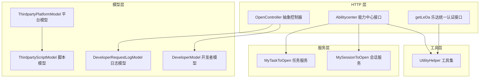
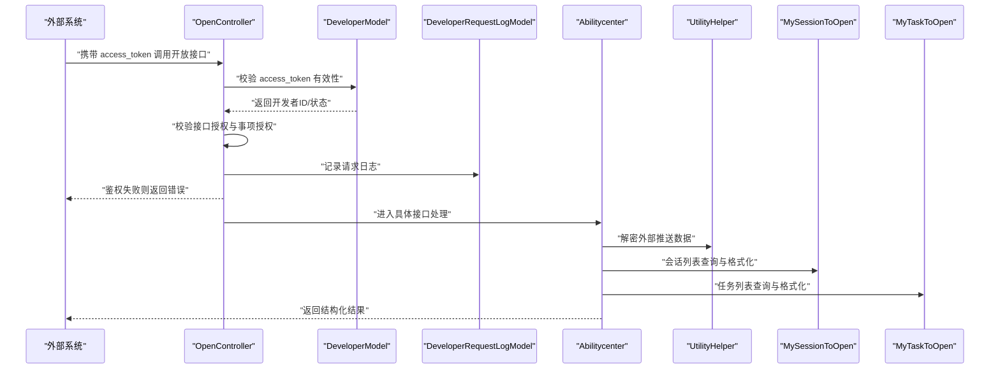
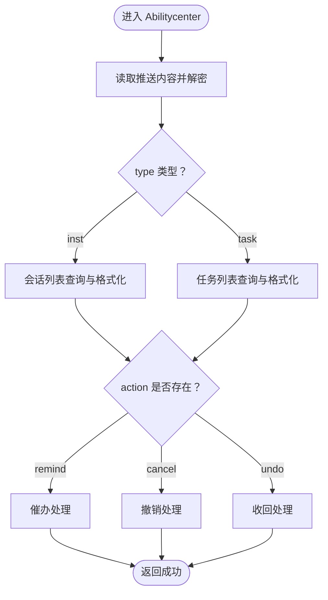
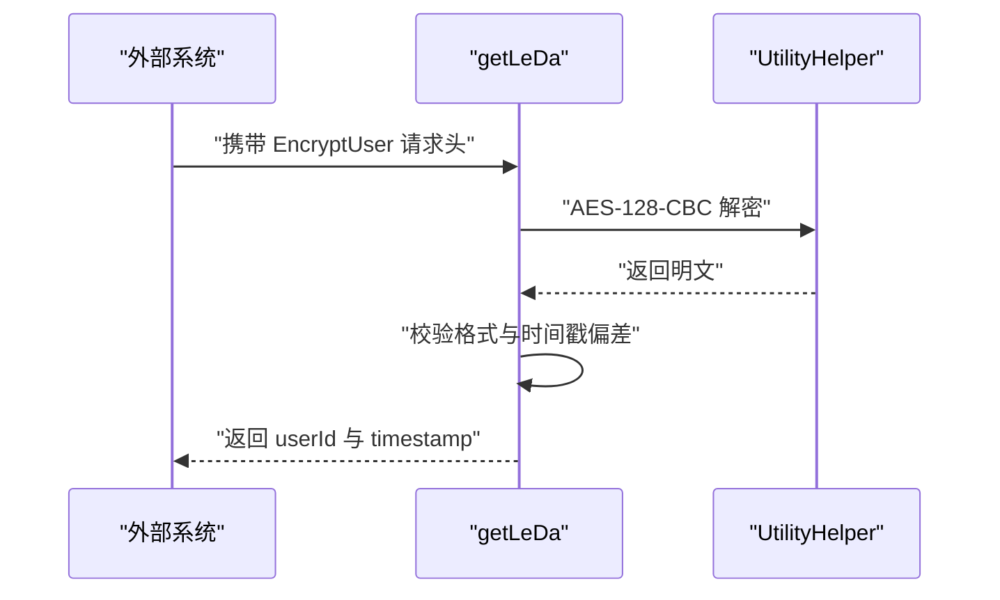
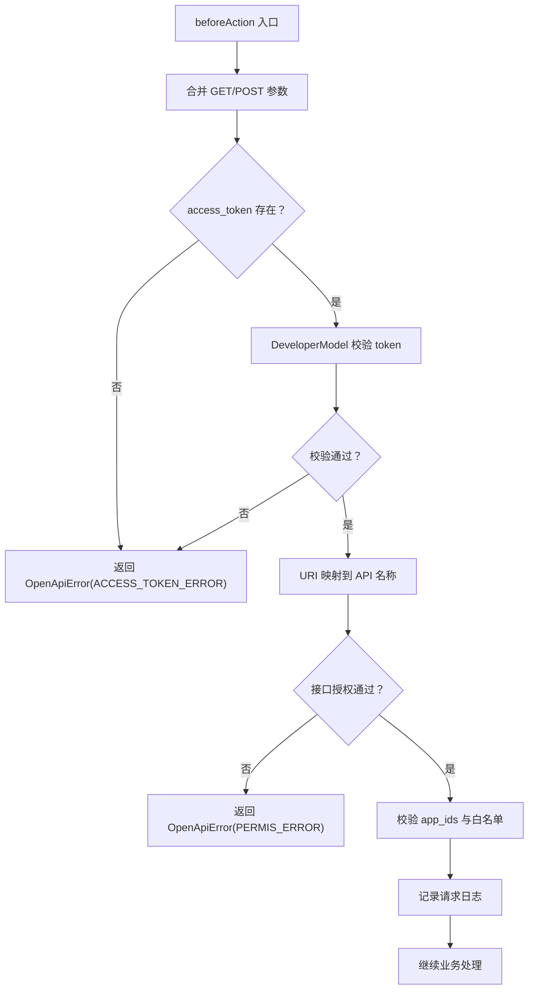
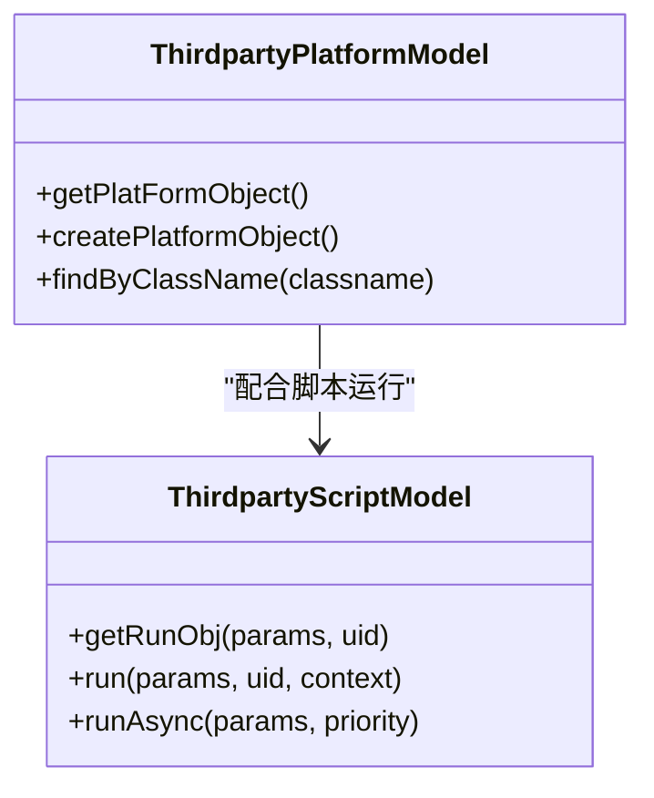
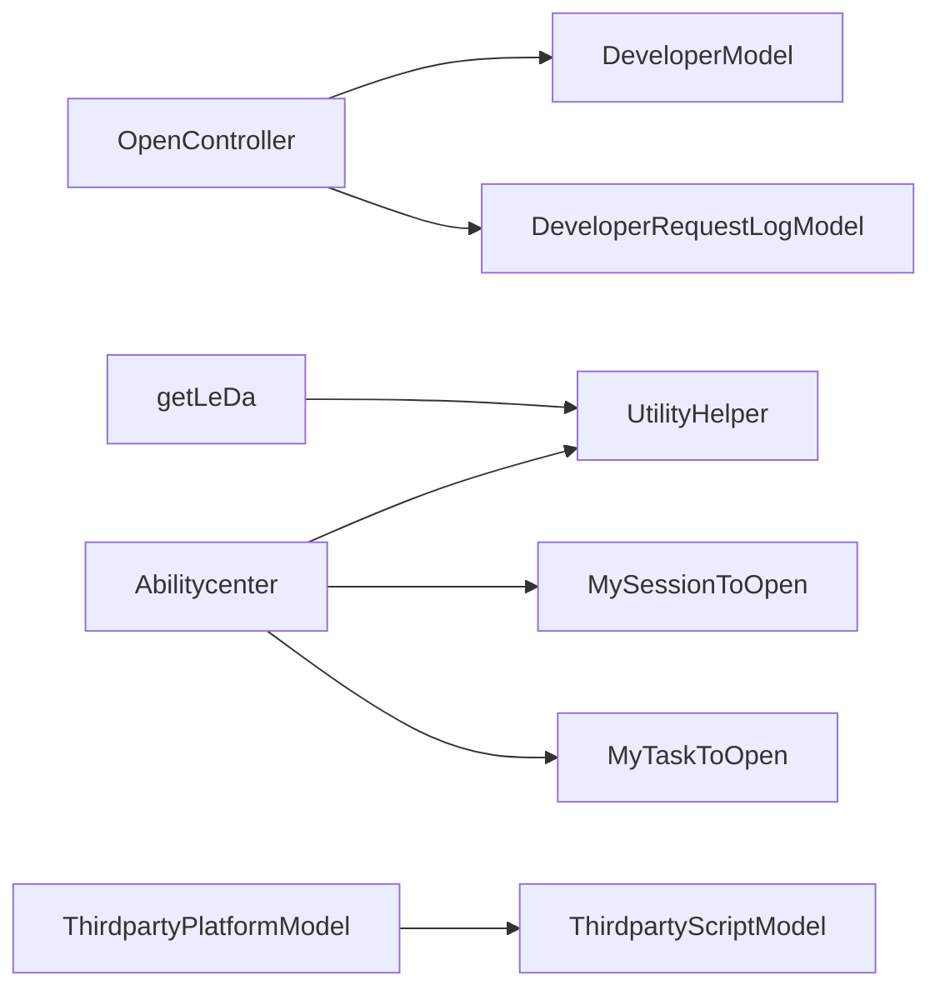

# 第三方集成接口

<cite>
**本文引用的文件**
- [ApiController.php](file://process/src/http/ApiController.php)
- [OpenController.php](file://process/src/http/OpenController.php)
- [Abilitycenter.php](file://process/src/http/api/Abilitycenter.php)
- [getLeDa.php](file://process/src/http/api/getLeDa.php)
- [DeveloperModel.php](file://process/src/models/DeveloperModel.php)
- [DeveloperRequestLogModel.php](file://process/src/models/DeveloperRequestLogModel.php)
- [OpenApiError.php](file://process/src/response/OpenApiError.php)
- [ThirdpartyPlatformModel.php](file://process/src/models/ThirdpartyPlatformModel.php)
- [ThirdpartyScriptModel.php](file://process/src/models/ThirdpartyScriptModel.php)
- [MySessionToOpen.php](file://process/src/services/MySessionToOpen.php)
- [MyTaskToOpen.php](file://process/src/services/MyTaskToOpen.php)
- [UtilityHelper.php](file://process/src/helpers/UtilityHelper.php)
</cite>

## 目录
1. [简介](#简介)
2. [项目结构](#项目结构)
3. [核心组件](#核心组件)
4. [架构总览](#架构总览)
5. [详细组件分析](#详细组件分析)
6. [依赖分析](#依赖分析)
7. [性能考量](#性能考量)
8. [故障排查指南](#故障排查指南)
9. [结论](#结论)
10. [附录](#附录)

## 简介
本文件面向第三方系统对接与集成，聚焦两类关键能力：
- 能力中心接口：为外部系统提供“按钮信息查询”“按钮动作执行”等能力，支持基于加密数据的推送与鉴权。
- 乐达接口：提供统一认证与用户信息解密通道，保障第三方平台在特定场景下的身份识别与安全校验。

文档覆盖对接流程、认证与密钥管理、访问控制、数据格式转换与协议适配、错误处理、调试方法、性能优化与安全注意事项，并给出多系统兼容与扩展性建议。

## 项目结构
第三方集成相关的核心代码位于以下模块：
- HTTP 控制器层：OpenController 抽象控制器负责开放接口的统一鉴权与日志；Abilitycenter 与 getLeDa 为具体开放接口。
- 模型层：DeveloperModel、DeveloperRequestLogModel 提供开发者接入与请求日志能力；ThirdpartyPlatformModel、ThirdpartyScriptModel 提供平台与脚本能力。
- 服务层：MySessionToOpen、MyTaskToOpen 提供会话与任务数据格式化输出。
- 工具层：UtilityHelper 提供加密、解密、设备识别、CIDR 校验等通用工具。



图表来源
- [OpenController.php](file://process/src/http/OpenController.php#L1-L209)
- [Abilitycenter.php](file://process/src/http/api/Abilitycenter.php#L1-L314)
- [getLeDa.php](file://process/src/http/api/getLeDa.php#L1-L74)
- [DeveloperModel.php](file://process/src/models/DeveloperModel.php#L1-L108)
- [DeveloperRequestLogModel.php](file://process/src/models/DeveloperRequestLogModel.php#L1-L86)
- [ThirdpartyPlatformModel.php](file://process/src/models/ThirdpartyPlatformModel.php#L1-L687)
- [ThirdpartyScriptModel.php](file://process/src/models/ThirdpartyScriptModel.php#L1-L92)
- [MySessionToOpen.php](file://process/src/services/MySessionToOpen.php#L1-L364)
- [MyTaskToOpen.php](file://process/src/services/MyTaskToOpen.php#L1-L404)
- [UtilityHelper.php](file://process/src/helpers/UtilityHelper.php#L1-L596)

章节来源
- [OpenController.php](file://process/src/http/OpenController.php#L1-L209)
- [Abilitycenter.php](file://process/src/http/api/Abilitycenter.php#L1-L314)
- [getLeDa.php](file://process/src/http/api/getLeDa.php#L1-L74)

## 核心组件
- 开放接口抽象控制器 OpenController
  - 统一鉴权入口：校验 access_token、接口授权、事项授权、IP/域名白名单等。
  - 请求日志：按 URI 映射到 API 名称，记录请求参数与结果。
- 能力中心接口 Abilitycenter
  - 输入：外部推送的加密数据，使用平台脚本配置的密钥解密。
  - 功能：按钮信息查询（会话/任务）、按钮动作执行（催办、撤销、收回）。
  - 输出：结构化的会话与任务列表，以及操作成功响应。
- 乐达接口 getLeDa
  - 输入：请求头 EncryptUser（十六进制编码的 AES-CBC 密文）。
  - 功能：AES-128-CBC 解密，校验时间戳偏差，返回 userId 与时间戳。
- 开发者模型 DeveloperModel
  - 提供 access_token 生成与校验、白名单与授权列表管理。
- 请求日志模型 DeveloperRequestLogModel
  - 记录开发者 ID、IP、API、请求方式与错误信息，支持补全结果。
- 平台与脚本模型 ThirdpartyPlatformModel / ThirdpartyScriptModel
  - 平台能力枚举与分类，脚本运行与异步队列封装。
- 服务层 MySessionToOpen / MyTaskToOpen
  - 将数据库查询结果格式化为开放接口统一输出结构。
- 工具层 UtilityHelper
  - 加密/解密、设备识别、CIDR 校验、并行处理等。

章节来源
- [OpenController.php](file://process/src/http/OpenController.php#L1-L209)
- [Abilitycenter.php](file://process/src/http/api/Abilitycenter.php#L1-L314)
- [getLeDa.php](file://process/src/http/api/getLeDa.php#L1-L74)
- [DeveloperModel.php](file://process/src/models/DeveloperModel.php#L1-L108)
- [DeveloperRequestLogModel.php](file://process/src/models/DeveloperRequestLogModel.php#L1-L86)
- [ThirdpartyPlatformModel.php](file://process/src/models/ThirdpartyPlatformModel.php#L1-L687)
- [ThirdpartyScriptModel.php](file://process/src/models/ThirdpartyScriptModel.php#L1-L92)
- [MySessionToOpen.php](file://process/src/services/MySessionToOpen.php#L1-L364)
- [MyTaskToOpen.php](file://process/src/services/MyTaskToOpen.php#L1-L404)
- [UtilityHelper.php](file://process/src/helpers/UtilityHelper.php#L1-L596)

## 架构总览
下图展示第三方开放接口的整体交互路径，包括鉴权、数据解密、业务处理与输出。



图表来源
- [OpenController.php](file://process/src/http/OpenController.php#L171-L208)
- [DeveloperModel.php](file://process/src/models/DeveloperModel.php#L96-L107)
- [DeveloperRequestLogModel.php](file://process/src/models/DeveloperRequestLogModel.php#L41-L71)
- [Abilitycenter.php](file://process/src/http/api/Abilitycenter.php#L24-L42)
- [UtilityHelper.php](file://process/src/helpers/UtilityHelper.php#L532-L544)
- [MySessionToOpen.php](file://process/src/services/MySessionToOpen.php#L43-L206)
- [MyTaskToOpen.php](file://process/src/services/MyTaskToOpen.php#L85-L228)

## 详细组件分析

### 能力中心接口（Abilitycenter）
- 输入数据解密
  - 从 ThirdpartyScriptModel 获取运行对象，使用 app_secret 对推送内容进行解密。
- 查询按钮信息
  - 类型 type 支持 inst（会话）与 task（任务），分别调用会话与任务列表服务。
- 执行按钮动作
  - action 支持 remind（催办）、cancel（撤销）、undo（收回），分别进行权限校验与业务处理。
- 输出结构
  - 统一格式化为列表，包含事项基础信息、任务节点、URL、权限开关等字段。



图表来源
- [Abilitycenter.php](file://process/src/http/api/Abilitycenter.php#L24-L42)
- [Abilitycenter.php](file://process/src/http/api/Abilitycenter.php#L45-L137)
- [Abilitycenter.php](file://process/src/http/api/Abilitycenter.php#L141-L314)
- [UtilityHelper.php](file://process/src/helpers/UtilityHelper.php#L532-L544)
- [MySessionToOpen.php](file://process/src/services/MySessionToOpen.php#L43-L206)
- [MyTaskToOpen.php](file://process/src/services/MyTaskToOpen.php#L85-L228)

章节来源
- [Abilitycenter.php](file://process/src/http/api/Abilitycenter.php#L1-L314)
- [MySessionToOpen.php](file://process/src/services/MySessionToOpen.php#L1-L364)
- [MyTaskToOpen.php](file://process/src/services/MyTaskToOpen.php#L1-L404)
- [UtilityHelper.php](file://process/src/helpers/UtilityHelper.php#L532-L544)

### 乐达统一认证接口（getLeDa）
- 输入
  - 请求头 EncryptUser：十六进制编码的 AES-CBC 密文。
- 处理
  - 使用固定密钥与 IV 进行 AES-128-CBC 解密，解析用户信息（用户ID, 时间戳）。
  - 校验时间戳偏差（默认允许 5 分钟窗口）。
- 输出
  - 返回 userId 与解析后的时间戳。



图表来源
- [getLeDa.php](file://process/src/http/api/getLeDa.php#L1-L74)
- [UtilityHelper.php](file://process/src/helpers/UtilityHelper.php#L532-L544)

章节来源
- [getLeDa.php](file://process/src/http/api/getLeDa.php#L1-L74)
- [UtilityHelper.php](file://process/src/helpers/UtilityHelper.php#L532-L544)

### 开放接口鉴权与访问控制（OpenController）
- 鉴权流程
  - 校验 access_token 是否存在与有效。
  - 校验接口授权（apis 字段包含的 API 名称）与事项授权（app_ids）。
  - 记录请求日志，区分 GET/POST。
- 错误处理
  - 使用 OpenApiError 返回标准化错误码与消息。



图表来源
- [OpenController.php](file://process/src/http/OpenController.php#L171-L208)
- [DeveloperModel.php](file://process/src/models/DeveloperModel.php#L96-L107)
- [DeveloperRequestLogModel.php](file://process/src/models/DeveloperRequestLogModel.php#L41-L71)
- [OpenApiError.php](file://process/src/response/OpenApiError.php#L1-L29)

章节来源
- [OpenController.php](file://process/src/http/OpenController.php#L1-L209)
- [DeveloperModel.php](file://process/src/models/DeveloperModel.php#L1-L108)
- [DeveloperRequestLogModel.php](file://process/src/models/DeveloperRequestLogModel.php#L1-L86)
- [OpenApiError.php](file://process/src/response/OpenApiError.php#L1-L29)

### 平台与脚本能力（ThirdpartyPlatformModel / ThirdpartyScriptModel）
- 平台能力
  - 定义平台类型、能力枚举与分类，支持按 classname 查找启用平台对象。
- 脚本能力
  - 通过 method 指向具体脚本类，运行时注入参数，支持异步入队。



图表来源
- [ThirdpartyPlatformModel.php](file://process/src/models/ThirdpartyPlatformModel.php#L445-L465)
- [ThirdpartyScriptModel.php](file://process/src/models/ThirdpartyScriptModel.php#L64-L91)

章节来源
- [ThirdpartyPlatformModel.php](file://process/src/models/ThirdpartyPlatformModel.php#L1-L687)
- [ThirdpartyScriptModel.php](file://process/src/models/ThirdpartyScriptModel.php#L1-L92)

### 数据格式转换与输出（MySessionToOpen / MyTaskToOpen）
- 会话服务 MySessionToOpen
  - 支持按条件筛选、关键字搜索、时间范围过滤、历史关联等，统一格式化输出。
- 任务服务 MyTaskToOpen
  - 支持待办/已办/共享三种查询类型，统一格式化输出，包含 URL、权限开关、标志位等。

```mermaid
classDiagram
class MySessionToOpen {
+list(offset, limit)
+format(list)
+count()
+countRunning()
}
class MyTaskToOpen {
+list(offset, limit)
+format(list)
+count()
}
MySessionToOpen --> "格式化输出"
MyTaskToOpen --> "格式化输出"
```

图表来源
- [MySessionToOpen.php](file://process/src/services/MySessionToOpen.php#L43-L206)
- [MyTaskToOpen.php](file://process/src/services/MyTaskToOpen.php#L85-L228)

章节来源
- [MySessionToOpen.php](file://process/src/services/MySessionToOpen.php#L1-L364)
- [MyTaskToOpen.php](file://process/src/services/MyTaskToOpen.php#L1-L404)

## 依赖分析
- 组件耦合
  - OpenController 依赖 DeveloperModel 与 DeveloperRequestLogModel 实现统一鉴权与日志。
  - Abilitycenter 依赖 UtilityHelper 解密、MySessionToOpen 与 MyTaskToOpen 进行数据格式化。
  - getLeDa 依赖 UtilityHelper 进行解密与校验。
  - ThirdpartyPlatformModel 与 ThirdpartyScriptModel 为平台与脚本运行提供支撑。
- 外部依赖
  - Redis 缓存 token 映射关系。
  - PostgreSQL 数据库存储开发者、请求日志、平台与脚本配置。
- 潜在循环依赖
  - 代码结构采用模型与服务分离，未见明显循环依赖迹象。



图表来源
- [OpenController.php](file://process/src/http/OpenController.php#L1-L209)
- [DeveloperModel.php](file://process/src/models/DeveloperModel.php#L1-L108)
- [DeveloperRequestLogModel.php](file://process/src/models/DeveloperRequestLogModel.php#L1-L86)
- [Abilitycenter.php](file://process/src/http/api/Abilitycenter.php#L1-L314)
- [getLeDa.php](file://process/src/http/api/getLeDa.php#L1-L74)
- [ThirdpartyPlatformModel.php](file://process/src/models/ThirdpartyPlatformModel.php#L1-L687)
- [ThirdpartyScriptModel.php](file://process/src/models/ThirdpartyScriptModel.php#L1-L92)
- [MySessionToOpen.php](file://process/src/services/MySessionToOpen.php#L1-L364)
- [MyTaskToOpen.php](file://process/src/services/MyTaskToOpen.php#L1-L404)
- [UtilityHelper.php](file://process/src/helpers/UtilityHelper.php#L1-L596)

章节来源
- [OpenController.php](file://process/src/http/OpenController.php#L1-L209)
- [Abilitycenter.php](file://process/src/http/api/Abilitycenter.php#L1-L314)
- [getLeDa.php](file://process/src/http/api/getLeDa.php#L1-L74)
- [ThirdpartyPlatformModel.php](file://process/src/models/ThirdpartyPlatformModel.php#L1-L687)
- [ThirdpartyScriptModel.php](file://process/src/models/ThirdpartyScriptModel.php#L1-L92)
- [MySessionToOpen.php](file://process/src/services/MySessionToOpen.php#L1-L364)
- [MyTaskToOpen.php](file://process/src/services/MyTaskToOpen.php#L1-L404)
- [UtilityHelper.php](file://process/src/helpers/UtilityHelper.php#L1-L596)

## 性能考量
- 鉴权与日志
  - access_token 校验基于 Redis，建议合理设置过期时间与缓存命中策略。
  - 请求日志异步落库或批量入库，避免阻塞主流程。
- 数据查询与格式化
  - MySessionToOpen 与 MyTaskToOpen 支持多表关联与条件过滤，建议在高并发场景下：
    - 使用索引覆盖常用查询字段（如 sess_id、uid、created、status）。
    - 对长列表分页与限制单次拉取数量（如会话/任务各限制 100 条）。
- 并行处理
  - UtilityHelper 提供并行处理工具，可在数据聚合阶段使用协程并行提升吞吐。
- 加解密成本
  - AES 解密与 SHA256 签名计算为 CPU 密集型，建议：
    - 在边缘前置缓存热点用户信息。
    - 严格控制请求频率，避免重放攻击导致的重复解密。

[本节为通用性能建议，无需列出章节来源]

## 故障排查指南
- 鉴权失败
  - 确认 access_token 是否传递、是否过期、是否在白名单内。
  - 检查接口授权与事项授权是否包含目标 API 与 app_id。
- 数据解密失败
  - 确认 ThirdpartyScriptModel 中 app_secret 配置正确，且与推送方一致。
  - 检查推送数据是否完整、编码格式是否符合预期。
- 乐达认证失败
  - 检查 EncryptUser 是否存在，密钥与 IV 是否正确。
  - 校验时间戳偏差是否超过 5 分钟。
- 请求日志
  - 通过 DeveloperRequestLogModel 查询失败记录，定位错误原因与参数。

章节来源
- [OpenController.php](file://process/src/http/OpenController.php#L171-L208)
- [DeveloperRequestLogModel.php](file://process/src/models/DeveloperRequestLogModel.php#L41-L71)
- [getLeDa.php](file://process/src/http/api/getLeDa.php#L1-L74)
- [UtilityHelper.php](file://process/src/helpers/UtilityHelper.php#L532-L544)

## 结论
该第三方集成体系通过统一的开放接口控制器与标准化的数据格式化服务，实现了能力中心与乐达认证两大对接场景。依托开发者模型与脚本平台，系统具备良好的扩展性与安全性。建议在生产环境中强化鉴权缓存、优化查询索引、控制请求规模，并完善监控与告警，确保多系统兼容与数据一致性。

[本节为总结性内容，无需列出章节来源]

## 附录

### 集成流程示例（能力中心）
- 准备
  - 在 ThirdpartyScriptModel 中配置推送脚本与 app_secret。
  - 在 DeveloperModel 中为第三方分配 access_token、授权接口与事项。
- 推送与处理
  - 外部系统发送加密数据至 Abilitycenter。
  - 系统解密后根据 type 选择会话或任务列表，再根据 action 执行相应操作。
- 输出
  - 返回统一格式的列表与操作结果。

章节来源
- [Abilitycenter.php](file://process/src/http/api/Abilitycenter.php#L24-L42)
- [ThirdpartyScriptModel.php](file://process/src/models/ThirdpartyScriptModel.php#L64-L91)
- [DeveloperModel.php](file://process/src/models/DeveloperModel.php#L96-L107)

### 集成流程示例（乐达认证）
- 准备
  - 确保外部系统能够构造 EncryptUser 请求头。
- 调用
  - 调用 getLeDa 接口，系统进行 AES 解密与时间戳校验。
- 输出
  - 返回 userId 与 timestamp，用于后续业务处理。

章节来源
- [getLeDa.php](file://process/src/http/api/getLeDa.php#L1-L74)
- [UtilityHelper.php](file://process/src/helpers/UtilityHelper.php#L532-L544)

### 安全考虑
- 密钥管理
  - access_token 与 app_secret 应妥善保管，定期轮换。
  - ThirdpartyScriptModel 的密钥仅在内存中使用，避免持久化明文。
- 访问控制
  - 严格校验接口授权与事项授权，防止越权调用。
  - 白名单 IP/域名策略结合使用，降低风险面。
- 数据保护
  - 敏感字段脱敏输出，避免泄露。
  - 加解密算法与密钥长度满足安全基线要求。

章节来源
- [OpenController.php](file://process/src/http/OpenController.php#L171-L208)
- [DeveloperModel.php](file://process/src/models/DeveloperModel.php#L96-L107)
- [ThirdpartyScriptModel.php](file://process/src/models/ThirdpartyScriptModel.php#L64-L91)
- [UtilityHelper.php](file://process/src/helpers/UtilityHelper.php#L532-L544)

### 协议与数据格式
- 能力中心推送
  - 输入：加密字符串（使用 app_secret 解密）。
  - 输出：统一结构化列表（含事项、任务、URL、权限开关等字段）。
- 乐达认证
  - 输入：请求头 EncryptUser（十六进制编码的 AES-CBC 密文）。
  - 输出：userId 与 timestamp。

章节来源
- [Abilitycenter.php](file://process/src/http/api/Abilitycenter.php#L24-L42)
- [MySessionToOpen.php](file://process/src/services/MySessionToOpen.php#L43-L206)
- [MyTaskToOpen.php](file://process/src/services/MyTaskToOpen.php#L85-L228)
- [getLeDa.php](file://process/src/http/api/getLeDa.php#L1-L74)