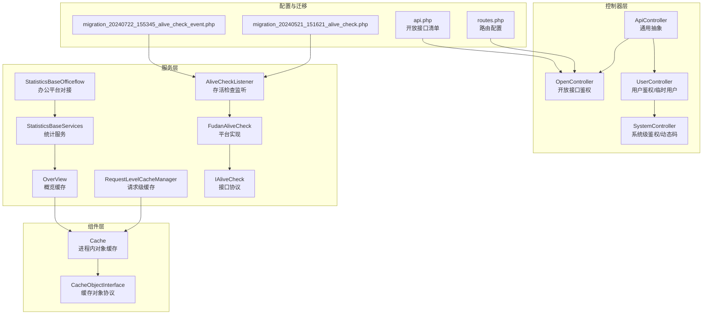
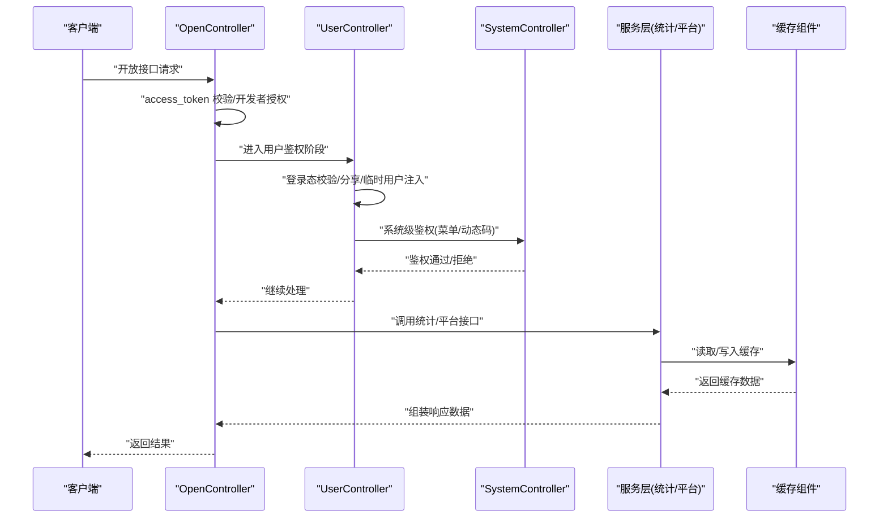
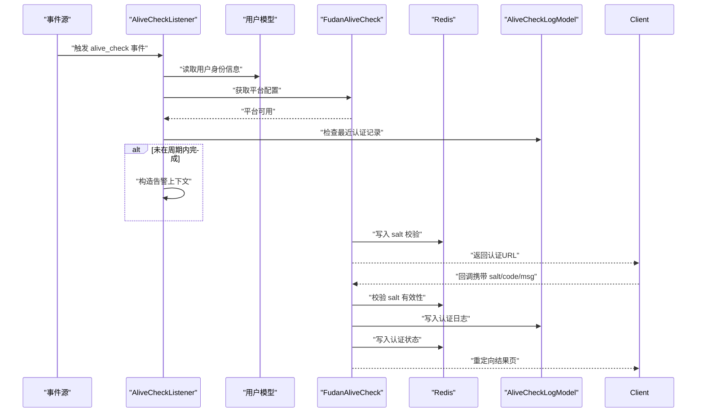
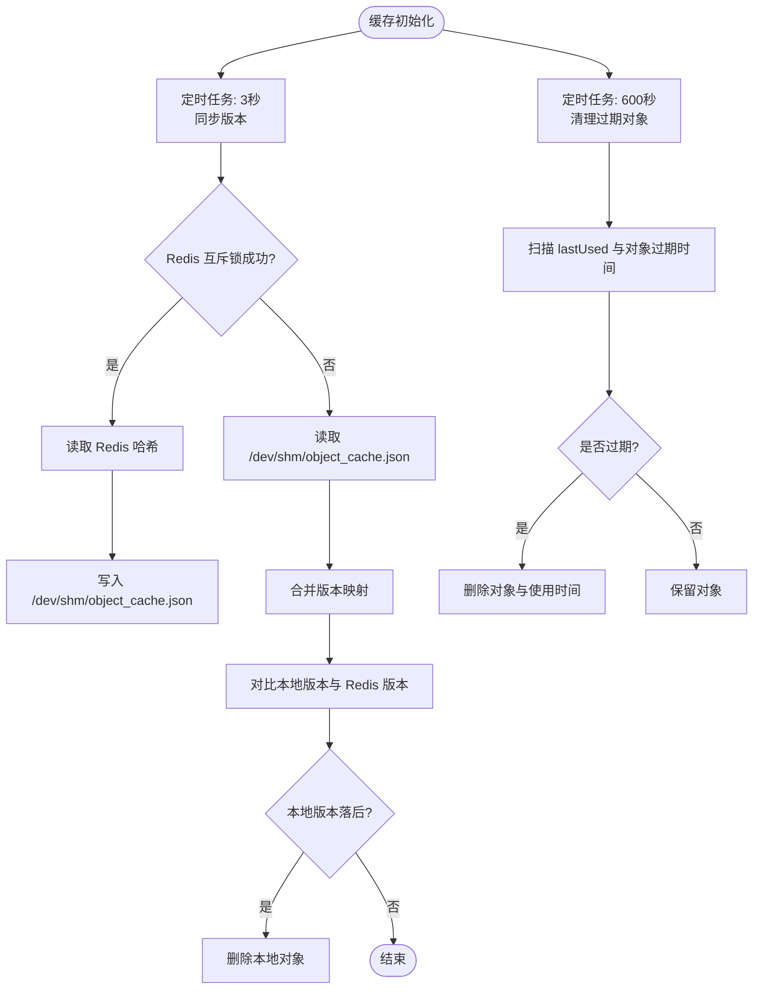
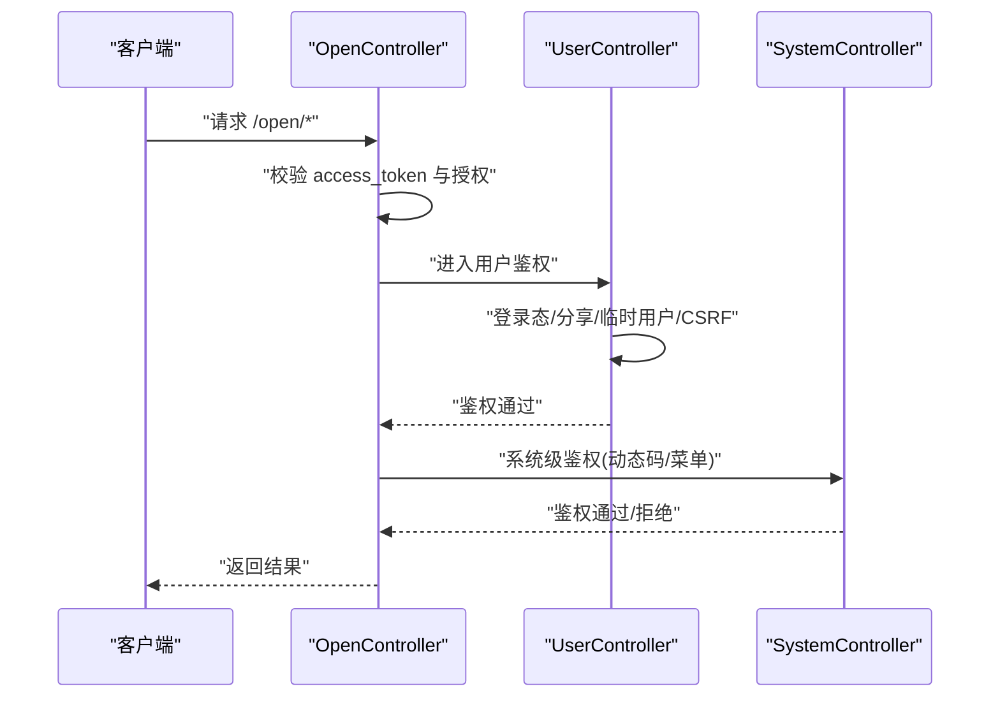
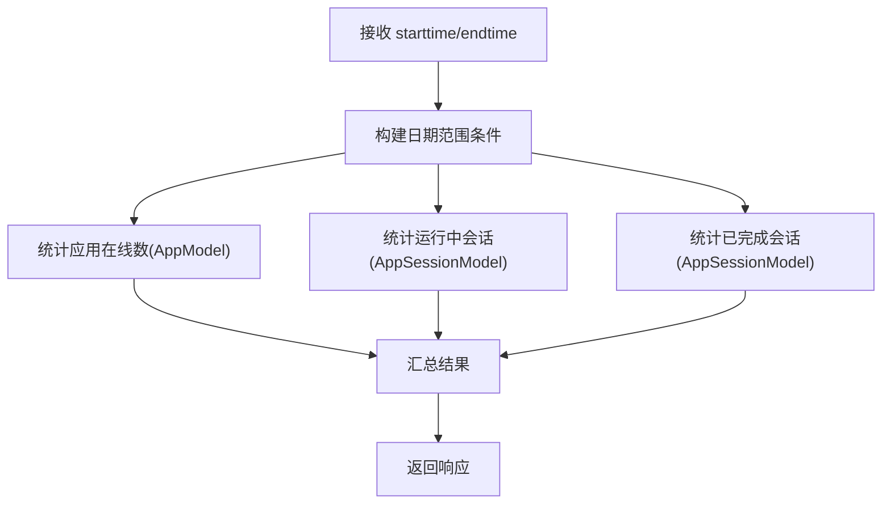
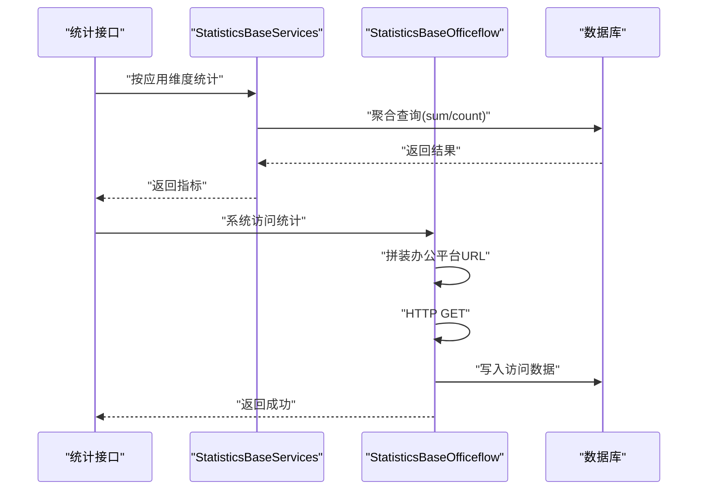
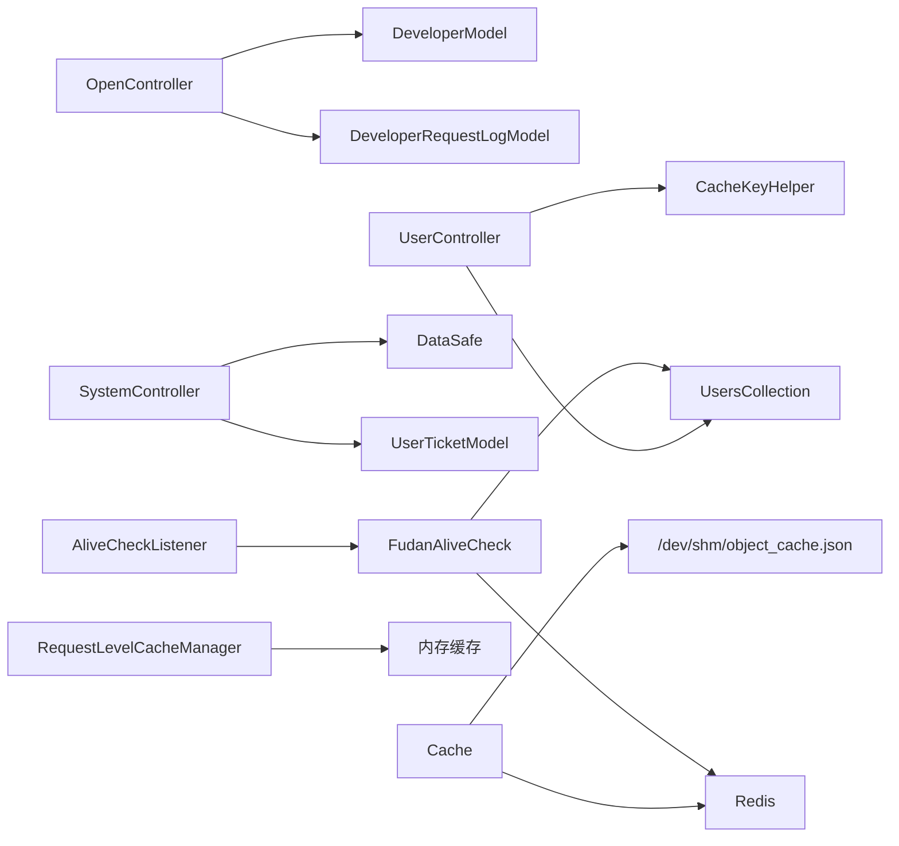

# 系统服务接口

<cite>
**本文引用的文件**
- [ApiController.php](file://process/src/http/ApiController.php)
- [OpenController.php](file://process/src/http/OpenController.php)
- [UserController.php](file://process/src/http/UserController.php)
- [SystemController.php](file://process/src/http/SystemController.php)
- [Cache.php](file://process/src/components/Cache.php)
- [CacheObjectInterface.php](file://process/src/components/CacheObjectInterface.php)
- [RequestLevelCacheManager.php](file://process/src/services/cache/RequestLevelCacheManager.php)
- [OverView.php](file://process/src/services/cache/OverView.php)
- [AliveCheckListener.php](file://process/src/services/listeners/AliveCheckListener.php)
- [FudanAliveCheck.php](file://process/src/services/platform/FudanAliveCheck.php)
- [IAliveCheck.php](file://process/src/services/platform/IAliveCheck.php)
- [migration_20240521_151621_alive_check.php](file://process/src/migrations/migration_20240521_151621_alive_check.php)
- [migration_20240722_155345_alive_check_event.php](file://process/src/migrations/migration_20240722_155345_alive_check_event.php)
- [HomePage.php](file://process_envs/scnu/product/http/api/HomePage.php)
- [StatisticsBaseServices.php](file://process/src/services/StatisticsBaseServices.php)
- [StatisticsBaseOfficeflow.php](file://process/src/services/StatisticsBaseOfficeflow.php)
- [routes.php](file://process/src/config/routes.php)
- [api.php](file://process/src/config/api.php)
- [postgresql.conf](file://process/docker/services/postgres/postgresql.conf)
</cite>

## 目录
1. [简介](#简介)
2. [项目结构](#项目结构)
3. [核心组件](#核心组件)
4. [架构总览](#架构总览)
5. [详细组件分析](#详细组件分析)
6. [依赖关系分析](#依赖关系分析)
7. [性能考量](#性能考量)
8. [故障排查指南](#故障排查指南)
9. [结论](#结论)
10. [附录](#附录)

## 简介
本文件面向系统服务相关 API 接口，围绕以下主题展开：存活检查接口的健康监测与故障告警、缓存接口的缓存管理与清理、通用接口的鉴权与公共方法、调试接口的日志与诊断能力、首页接口的数据聚合与展示、访问统计接口的流量监控与行为分析，并提供系统监控、性能优化与故障排除建议，以及系统维护、容量规划与扩展方案。

## 项目结构
系统采用分层与模块化组织方式：
- 控制器层：系统服务接口由多类控制器抽象与具体实现构成，包括通用控制器、开放接口控制器、用户控制器、系统控制器等。
- 组件层：提供缓存组件与缓存对象接口，支持进程内对象缓存与跨进程版本同步。
- 服务层：封装统计数据聚合、访问统计对接、实名认证平台对接与监听器。
- 配置层：路由与开放接口清单配置。
- 数据迁移：存活检查日志表与事件触发器初始化。

图表来源
- [ApiController.php](file://process/src/http/ApiController.php#L1-L9)
- [OpenController.php](file://process/src/http/OpenController.php#L1-L209)
- [UserController.php](file://process/src/http/UserController.php#L1-L186)
- [SystemController.php](file://process/src/http/SystemController.php#L1-L95)
- [Cache.php](file://process/src/components/Cache.php#L1-L136)
- [CacheObjectInterface.php](file://process/src/components/CacheObjectInterface.php#L1-L8)
- [RequestLevelCacheManager.php](file://process/src/services/cache/RequestLevelCacheManager.php#L102-L136)
- [OverView.php](file://process/src/services/cache/OverView.php#L50-L71)
- [AliveCheckListener.php](file://process/src/services/listeners/AliveCheckListener.php#L1-L38)
- [FudanAliveCheck.php](file://process/src/services/platform/FudanAliveCheck.php#L1-L73)
- [IAliveCheck.php](file://process/src/services/platform/IAliveCheck.php#L1-L14)
- [StatisticsBaseServices.php](file://process/src/services/StatisticsBaseServices.php#L109-L157)
- [StatisticsBaseOfficeflow.php](file://process/src/services/StatisticsBaseOfficeflow.php#L381-L403)
- [routes.php](file://process/src/config/routes.php#L1-L4)
- [api.php](file://process/src/config/api.php#L770-L803)
- [migration_20240521_151621_alive_check.php](file://process/src/migrations/migration_20240521_151621_alive_check.php#L1-L32)
- [migration_20240722_155345_alive_check_event.php](file://process/src/migrations/migration_20240722_155345_alive_check_event.php#L1-L23)

章节来源
- [ApiController.php](file://process/src/http/ApiController.php#L1-L9)
- [OpenController.php](file://process/src/http/OpenController.php#L1-L209)
- [UserController.php](file://process/src/http/UserController.php#L1-L186)
- [SystemController.php](file://process/src/http/SystemController.php#L1-L95)
- [routes.php](file://process/src/config/routes.php#L1-L4)
- [api.php](file://process/src/config/api.php#L770-L803)

## 核心组件
- 通用控制器与鉴权链路
  - ApiController：系统服务接口的通用抽象基类。
  - OpenController：开放接口鉴权与开发者授权校验、请求日志记录。
  - UserController：用户登录校验、分享/临时下载场景用户注入、CSRF 基线防护。
  - SystemController：系统级鉴权、超级管理员放行、菜单权限校验、动态码校验。
- 缓存组件
  - Cache：进程内对象缓存，定时从 Redis 同步版本并清理过期对象；支持全量清理与版本更新。
  - CacheObjectInterface：缓存对象协议，定义版本与过期策略。
  - RequestLevelCacheManager：请求级缓存，支持键过期检测与统计。
  - OverView：概览数据缓存，聚合访问统计结果并设置过期。
- 存活检查与告警
  - AliveCheckListener：监听事件，检查用户是否在周期内完成实名认证，未完成则加入告警上下文。
  - FudanAliveCheck：对接第三方平台的实名认证，生成认证 URL、回调处理、状态查询。
  - IAliveCheck：平台实现协议。
  - 迁移：存活检查日志表与事件触发器初始化。
- 统计与首页
  - StatisticsBaseServices：按应用维度统计访问与业务指标。
  - StatisticsBaseOfficeflow：对接办公平台接口，拉取访问数据并入库。
  - HomePage：环境特定首页接口，按时间窗口统计应用在线数、运行中与已完成会话数。

章节来源
- [ApiController.php](file://process/src/http/ApiController.php#L1-L9)
- [OpenController.php](file://process/src/http/OpenController.php#L1-L209)
- [UserController.php](file://process/src/http/UserController.php#L1-L186)
- [SystemController.php](file://process/src/http/SystemController.php#L1-L95)
- [Cache.php](file://process/src/components/Cache.php#L1-L136)
- [CacheObjectInterface.php](file://process/src/components/CacheObjectInterface.php#L1-L8)
- [RequestLevelCacheManager.php](file://process/src/services/cache/RequestLevelCacheManager.php#L102-L136)
- [OverView.php](file://process/src/services/cache/OverView.php#L50-L71)
- [AliveCheckListener.php](file://process/src/services/listeners/AliveCheckListener.php#L1-L38)
- [FudanAliveCheck.php](file://process/src/services/platform/FudanAliveCheck.php#L1-L73)
- [IAliveCheck.php](file://process/src/services/platform/IAliveCheck.php#L1-L14)
- [migration_20240521_151621_alive_check.php](file://process/src/migrations/migration_20240521_151621_alive_check.php#L1-L32)
- [migration_20240722_155345_alive_check_event.php](file://process/src/migrations/migration_20240722_155345_alive_check_event.php#L1-L23)
- [HomePage.php](file://process_envs/scnu/product/http/api/HomePage.php#L1-L26)
- [StatisticsBaseServices.php](file://process/src/services/StatisticsBaseServices.php#L109-L157)
- [StatisticsBaseOfficeflow.php](file://process/src/services/StatisticsBaseOfficeflow.php#L381-L403)

## 架构总览
系统服务接口通过控制器抽象与鉴权链路统一接入，结合缓存组件与服务层统计能力，形成“鉴权—缓存—统计/平台对接—响应”的闭环。

图表来源
- [OpenController.php](file://process/src/http/OpenController.php#L171-L208)
- [UserController.php](file://process/src/http/UserController.php#L51-L90)
- [SystemController.php](file://process/src/http/SystemController.php#L17-L94)
- [Cache.php](file://process/src/components/Cache.php#L37-L135)
- [StatisticsBaseServices.php](file://process/src/services/StatisticsBaseServices.php#L109-L157)
- [StatisticsBaseOfficeflow.php](file://process/src/services/StatisticsBaseOfficeflow.php#L381-L403)

## 详细组件分析

### 存活检查接口（健康监测与故障告警）
- 功能概述
  - 监听指定事件，检查用户是否在设定周期内完成实名认证；若未完成，将告警信息写入上下文，供后续流程处理。
  - 第三方平台对接：生成认证 URL、回调处理、状态查询。
- 关键流程
  - 事件触发 → 查询平台配置 → 校验最近一次认证记录 → 未通过则加入告警上下文。
  - 平台回调 → 校验参数有效性 → 写入日志与状态缓存 → 返回结果页。

图表来源
- [AliveCheckListener.php](file://process/src/services/listeners/AliveCheckListener.php#L1-L38)
- [FudanAliveCheck.php](file://process/src/services/platform/FudanAliveCheck.php#L1-L73)
- [migration_20240521_151621_alive_check.php](file://process/src/migrations/migration_20240521_151621_alive_check.php#L1-L32)
- [migration_20240722_155345_alive_check_event.php](file://process/src/migrations/migration_20240722_155345_alive_check_event.php#L1-L23)

章节来源
- [AliveCheckListener.php](file://process/src/services/listeners/AliveCheckListener.php#L1-L38)
- [FudanAliveCheck.php](file://process/src/services/platform/FudanAliveCheck.php#L1-L73)
- [IAliveCheck.php](file://process/src/services/platform/IAliveCheck.php#L1-L14)
- [migration_20240521_151621_alive_check.php](file://process/src/migrations/migration_20240521_151621_alive_check.php#L1-L32)
- [migration_20240722_155345_alive_check_event.php](file://process/src/migrations/migration_20240722_155345_alive_check_event.php#L1-L23)

### 缓存接口（缓存管理、清理与监控）
- 进程内对象缓存
  - 定时任务：每 3 秒从 Redis 同步版本，每 600 秒清理过期对象。
  - 版本同步：通过互斥锁确保单进程读取 Redis 并写入共享内存文件，其他进程读取该文件以保持一致性。
  - 清理策略：基于 lastUsed 与对象过期时间阈值清理。
- 请求级缓存
  - 支持键过期检测与统计：返回总键数、过期键数与内存使用。
- 概览缓存
  - 将聚合后的访问统计写入 Redis，设置过期时间，提升首页与统计接口性能。

图表来源
- [Cache.php](file://process/src/components/Cache.php#L21-L135)
- [RequestLevelCacheManager.php](file://process/src/services/cache/RequestLevelCacheManager.php#L102-L136)
- [OverView.php](file://process/src/services/cache/OverView.php#L50-L71)

章节来源
- [Cache.php](file://process/src/components/Cache.php#L1-L136)
- [CacheObjectInterface.php](file://process/src/components/CacheObjectInterface.php#L1-L8)
- [RequestLevelCacheManager.php](file://process/src/services/cache/RequestLevelCacheManager.php#L102-L136)
- [OverView.php](file://process/src/services/cache/OverView.php#L50-L71)

### 通用接口（基础功能与公共方法）
- 开放接口鉴权
  - access_token 校验、开发者授权白名单匹配、按 API 名称记录请求日志。
- 用户鉴权
  - 登录态校验、分享/临时下载场景用户注入、CSRF 基线校验（Host 白名单）。
- 系统鉴权
  - 校验是否为校外用户、动态码校验（UA/IP/时间戳）、超级管理员放行、菜单权限校验。

图表来源
- [OpenController.php](file://process/src/http/OpenController.php#L171-L208)
- [UserController.php](file://process/src/http/UserController.php#L51-L90)
- [SystemController.php](file://process/src/http/SystemController.php#L17-L94)

章节来源
- [OpenController.php](file://process/src/http/OpenController.php#L1-L209)
- [UserController.php](file://process/src/http/UserController.php#L1-L186)
- [SystemController.php](file://process/src/http/SystemController.php#L1-L95)

### 调试接口（日志输出、性能分析与诊断）
- 日志与诊断
  - 存活检查回调中对失败场景写入调试日志，便于定位参数非法或过期问题。
  - 统计服务与办公平台对接处记录请求与响应体，辅助问题定位。
- 性能分析
  - 缓存组件通过共享内存与互斥锁降低 Redis 访问频率，定时清理减少内存占用。
  - 请求级缓存提供过期键统计与内存使用统计，便于容量评估。

章节来源
- [FudanAliveCheck.php](file://process/src/services/platform/FudanAliveCheck.php#L35-L63)
- [StatisticsBaseOfficeflow.php](file://process/src/services/StatisticsBaseOfficeflow.php#L381-L403)
- [RequestLevelCacheManager.php](file://process/src/services/cache/RequestLevelCacheManager.php#L102-L136)
- [Cache.php](file://process/src/components/Cache.php#L95-L135)

### 首页接口（数据聚合与展示）
- 功能概述
  - 按时间窗口统计应用在线数量、运行中会话数、已完成会话数等指标。
  - 环境特定实现示例：SCNU 环境的首页接口按日期范围聚合应用发布与会话状态。
- 处理逻辑
  - 输入时间窗口 → 构建查询条件 → 统计计数 → 返回聚合结果。

图表来源
- [HomePage.php](file://process_envs/scnu/product/http/api/HomePage.php#L1-L26)

章节来源
- [HomePage.php](file://process_envs/scnu/product/http/api/HomePage.php#L1-L26)

### 访问统计接口（流量监控与行为分析）
- 功能概述
  - 应用维度统计年度办件量、访问量等指标。
  - 整站维度统计 PC/Mobile 的访问与点击量。
  - 对接办公平台接口，拉取访问数据并入库，用于后续分析。
- 处理逻辑
  - 统计服务聚合字段求和 → 返回结果。
  - 办公平台对接发起 HTTP 请求 → 解析响应 → 写入数据库。

图表来源
- [StatisticsBaseServices.php](file://process/src/services/StatisticsBaseServices.php#L109-L157)
- [StatisticsBaseOfficeflow.php](file://process/src/services/StatisticsBaseOfficeflow.php#L381-L403)

章节来源
- [StatisticsBaseServices.php](file://process/src/services/StatisticsBaseServices.php#L109-L157)
- [StatisticsBaseOfficeflow.php](file://process/src/services/StatisticsBaseOfficeflow.php#L381-L403)

## 依赖关系分析
- 控制器依赖
  - OpenController 依赖开发者模型与请求日志模型进行鉴权与审计。
  - UserController 依赖用户集合与缓存键助手处理临时下载与分享场景。
  - SystemController 依赖安全配置、票据模型与菜单权限。
- 缓存依赖
  - Cache 依赖 Redis 与共享内存文件进行版本同步与清理。
  - RequestLevelCacheManager 依赖内存数组与过期时间映射。
- 平台与监听
  - AliveCheckListener 依赖平台实现与日志模型。
  - FudanAliveCheck 依赖用户集合与 Redis 进行参数校验与状态持久化。

图表来源
- [OpenController.php](file://process/src/http/OpenController.php#L171-L208)
- [UserController.php](file://process/src/http/UserController.php#L92-L185)
- [SystemController.php](file://process/src/http/SystemController.php#L17-L94)
- [Cache.php](file://process/src/components/Cache.php#L95-L135)
- [RequestLevelCacheManager.php](file://process/src/services/cache/RequestLevelCacheManager.php#L102-L136)
- [AliveCheckListener.php](file://process/src/services/listeners/AliveCheckListener.php#L1-L38)
- [FudanAliveCheck.php](file://process/src/services/platform/FudanAliveCheck.php#L1-L73)

章节来源
- [OpenController.php](file://process/src/http/OpenController.php#L1-L209)
- [UserController.php](file://process/src/http/UserController.php#L1-L186)
- [SystemController.php](file://process/src/http/SystemController.php#L1-L95)
- [Cache.php](file://process/src/components/Cache.php#L1-L136)
- [RequestLevelCacheManager.php](file://process/src/services/cache/RequestLevelCacheManager.php#L102-L136)
- [AliveCheckListener.php](file://process/src/services/listeners/AliveCheckListener.php#L1-L38)
- [FudanAliveCheck.php](file://process/src/services/platform/FudanAliveCheck.php#L1-L73)

## 性能考量
- 缓存策略
  - 使用共享内存与互斥锁降低 Redis 访问频次，定时清理减少内存压力。
  - 对象缓存按版本与过期时间双维度控制，避免脏读。
- 统计查询
  - 聚合查询尽量使用数据库层面的 sum/count，减少应用层计算。
  - 对外接口可引入短期缓存（如概览缓存），降低重复统计成本。
- 日志与诊断
  - 仅在必要路径写入调试日志，避免高频写入影响性能。
  - 利用请求级缓存统计内存使用，定期评估容量。

[本节为通用指导，无需列出章节来源]

## 故障排查指南
- 存活检查失败
  - 现象：回调返回失败或状态异常。
  - 排查：确认 salt 是否过期、Redis 中是否存在对应键、回调参数是否完整。
  - 参考路径：[FudanAliveCheck.php](file://process/src/services/platform/FudanAliveCheck.php#L35-L63)
- 开放接口鉴权失败
  - 现象：返回开发者授权错误或 Token 无效。
  - 排查：核对 access_token、开发者授权白名单、API 名称映射。
  - 参考路径：[OpenController.php](file://process/src/http/OpenController.php#L171-L208)
- 用户登录与 CSRF
  - 现象：未登录或被拦截。
  - 排查：确认登录态、Referer Host 白名单、临时下载 token。
  - 参考路径：[UserController.php](file://process/src/http/UserController.php#L51-L90)
- 缓存不一致
  - 现象：不同进程看到旧对象。
  - 排查：确认互斥锁是否成功、共享内存文件是否更新、版本哈希是否一致。
  - 参考路径：[Cache.php](file://process/src/components/Cache.php#L95-L135)
- 统计数据异常
  - 现象：指标与预期不符。
  - 排查：核对时间窗口、聚合字段、办公平台接口返回。
  - 参考路径：[StatisticsBaseServices.php](file://process/src/services/StatisticsBaseServices.php#L109-L157)、[StatisticsBaseOfficeflow.php](file://process/src/services/StatisticsBaseOfficeflow.php#L381-L403)

章节来源
- [FudanAliveCheck.php](file://process/src/services/platform/FudanAliveCheck.php#L35-L63)
- [OpenController.php](file://process/src/http/OpenController.php#L171-L208)
- [UserController.php](file://process/src/http/UserController.php#L51-L90)
- [Cache.php](file://process/src/components/Cache.php#L95-L135)
- [StatisticsBaseServices.php](file://process/src/services/StatisticsBaseServices.php#L109-L157)
- [StatisticsBaseOfficeflow.php](file://process/src/services/StatisticsBaseOfficeflow.php#L381-L403)

## 结论
系统服务接口通过统一的控制器抽象与鉴权链路，结合缓存与统计能力，实现了从开放接口到系统级鉴权、从对象缓存到概览缓存的多层次支撑。存活检查与平台对接保障了健康监测与告警闭环，首页与访问统计接口提供了数据聚合与监控能力。建议持续完善日志与监控、优化缓存策略与统计查询、加强容量评估与扩展方案设计。

[本节为总结性内容，无需列出章节来源]

## 附录
- 系统监控建议
  - 健康检查：存活检查日志表与事件触发器应纳入监控看板。
  - 缓存监控：关注共享内存文件更新频率、版本哈希一致性、过期键比例。
  - 统计监控：核对办公平台接口可用性与响应延迟。
- 性能优化建议
  - 缓存：合理设置过期时间与清理周期，避免热点键导致频繁重建。
  - 统计：批量聚合与分页查询，避免一次性大查询。
  - 日志：分级日志与采样，避免高频写入。
- 故障排除清单
  - 存活检查：校验回调参数、Redis 键有效期、日志记录。
  - 开放接口：校验 access_token 与授权白名单、API 映射。
  - 用户鉴权：登录态、Referer 白名单、临时下载 token。
  - 缓存：互斥锁、共享内存文件、版本哈希。
  - 统计：时间窗口、聚合字段、外部接口可用性。
- 系统维护与扩展
  - 维护：定期清理过期缓存、核对开放接口清单、更新平台对接配置。
  - 容量规划：根据请求级缓存统计与数据库查询负载评估资源。
  - 扩展：新增平台实现需遵循 IAliveCheck 协议，新增统计维度需复用现有聚合服务。

[本节为通用指导，无需列出章节来源]