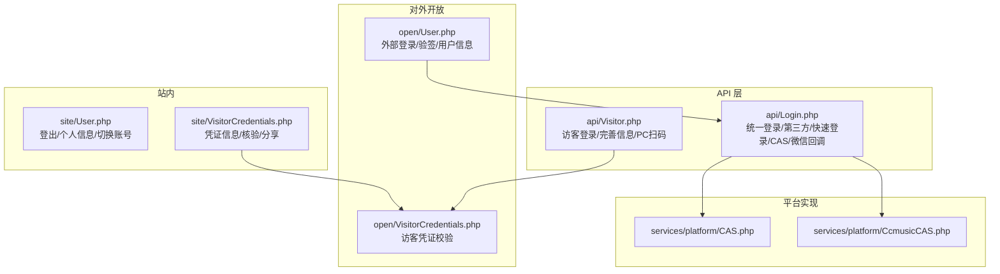
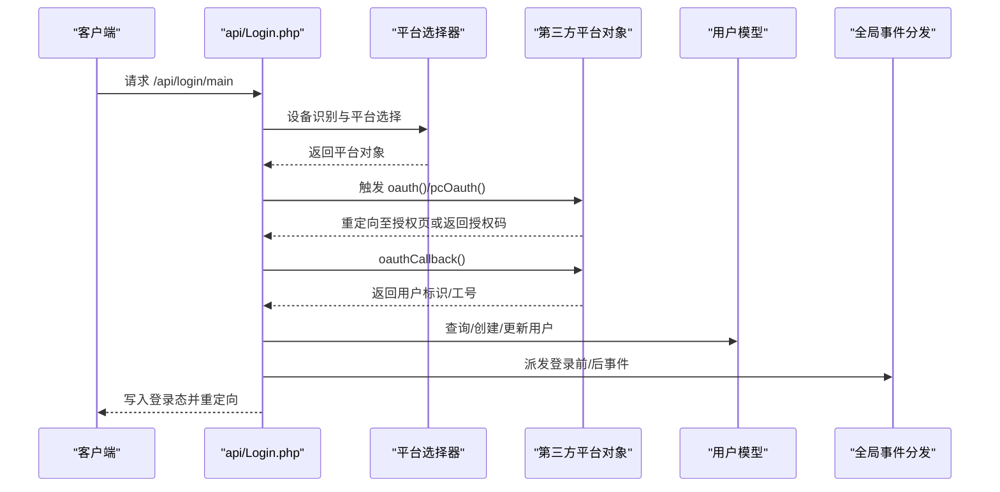
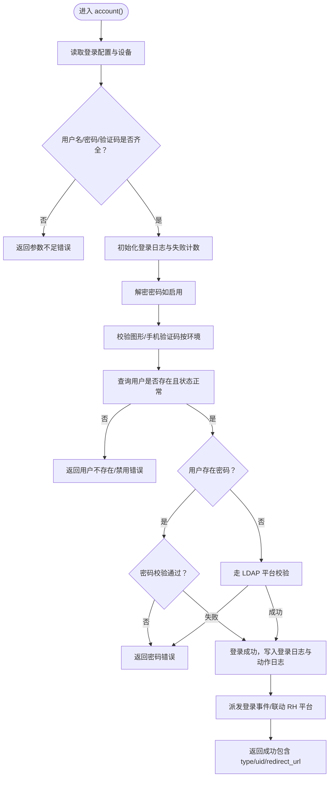
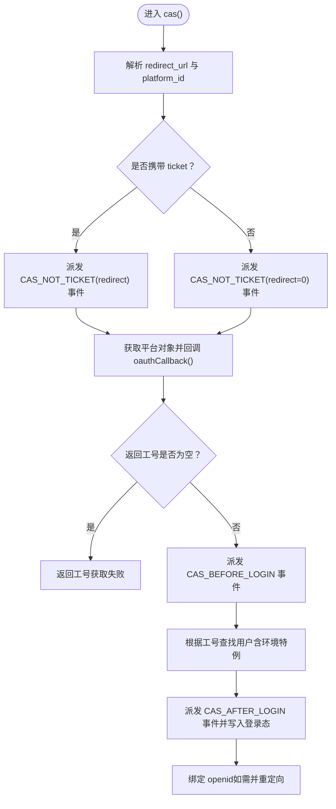
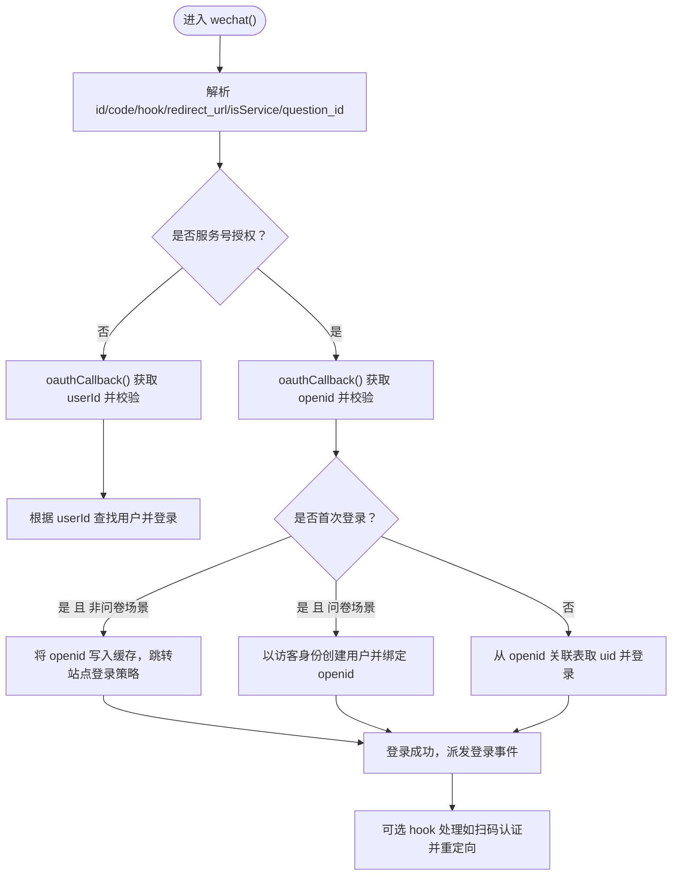
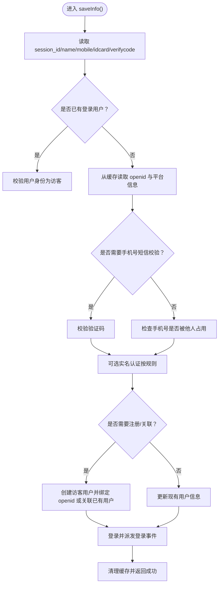
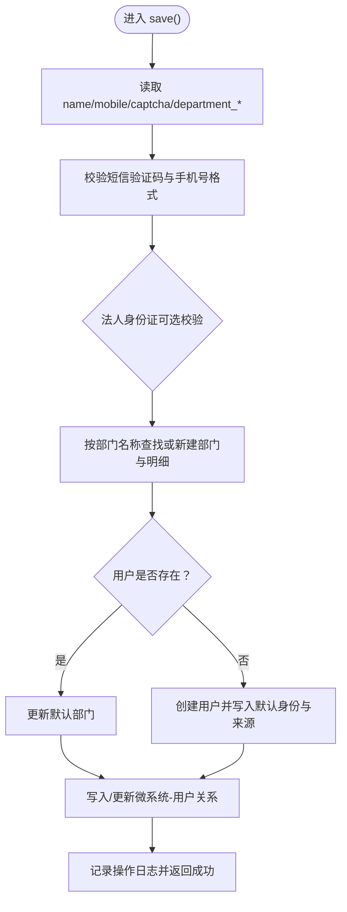
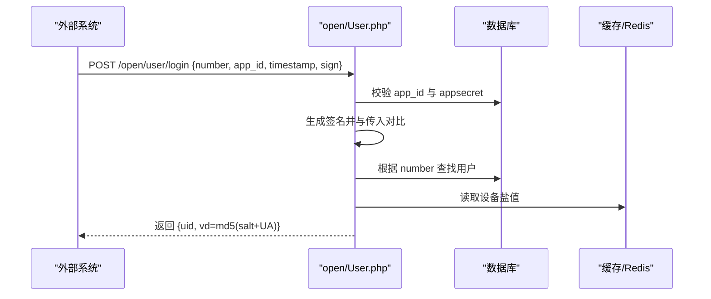
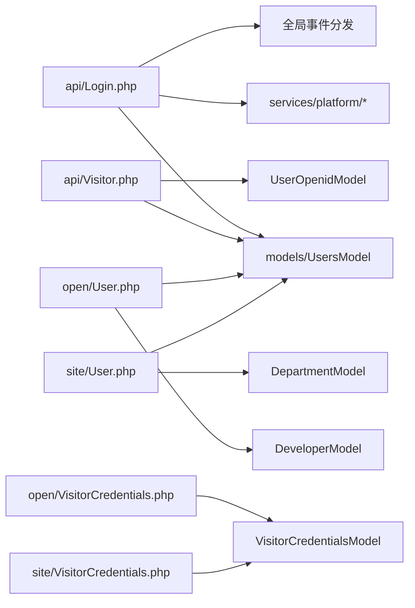

# 身份认证接口

<cite>
**本文引用的文件**
- [process/src/http/api/Login.php](file://process/src/http/api/Login.php)
- [process/src/http/api/Visitor.php](file://process/src/http/api/Visitor.php)
- [process/src/http/api/MicroAppUser.php](file://process/src/http/api/MicroAppUser.php)
- [process/src/http/open/User.php](file://process/src/http/open/User.php)
- [process/src/http/open/VisitorCredentials.php](file://process/src/http/open/VisitorCredentials.php)
- [process/src/http/site/VisitorCredentials.php](file://process/src/http/site/VisitorCredentials.php)
- [process/src/http/site/User.php](file://process/src/http/site/User.php)
- [process/src/services/platform/CAS.php](file://process/src/services/platform/CAS.php)
- [process/src/services/platform/CcmusicCAS.php](file://process/src/services/platform/CcmusicCAS.php)
</cite>

## 目录
1. [简介](#简介)
2. [项目结构](#项目结构)
3. [核心组件](#核心组件)
4. [架构总览](#架构总览)
5. [详细组件分析](#详细组件分析)
6. [依赖分析](#依赖分析)
7. [性能考虑](#性能考虑)
8. [故障排查指南](#故障排查指南)
9. [结论](#结论)
10. [附录](#附录)

## 简介
本文件面向身份认证相关 API 的使用者与维护者，系统化梳理以下能力：
- 登录接口：统一入口、设备识别、第三方 OAuth、CAS 回调、账户密码/短信/邮箱快速登录、二次验证扫码等。
- 访客接口：匿名访问、访客规则、完善信息、PC 扫码授权、回调与登录。
- 微应用用户接口：第三方集成与用户管理，含企业联系人登记、微系统-用户关系维护。
- 令牌与会话：外部登录签名验签、盐值与设备维度的登录态标识。
- 第三方登录支持：CAS、微信企业号/服务号、多高校定制平台、智慧校园等。
- 安全与合规：参数校验、验证码校验、白名单与权限控制、日志与审计。

## 项目结构
围绕认证的关键目录与文件：
- API 登录与访客：process/src/http/api/Login.php、process/src/http/api/Visitor.php
- 微应用用户：process/src/http/api/MicroAppUser.php
- 对外开放接口：process/src/http/open/User.php、process/src/http/open/VisitorCredentials.php
- 站内用户中心：process/src/http/site/User.php、process/src/http/site/VisitorCredentials.php
- CAS 平台实现：process/src/services/platform/CAS.php、process/src/services/platform/CcmusicCAS.php

图表来源
- [process/src/http/api/Login.php](file://process/src/http/api/Login.php#L1-L120)
- [process/src/http/api/Visitor.php](file://process/src/http/api/Visitor.php#L1-L120)
- [process/src/http/open/User.php](file://process/src/http/open/User.php#L1-L120)
- [process/src/http/open/VisitorCredentials.php](file://process/src/http/open/VisitorCredentials.php#L1-L73)
- [process/src/http/site/VisitorCredentials.php](file://process/src/http/site/VisitorCredentials.php#L1-L131)
- [process/src/http/site/User.php](file://process/src/http/site/User.php#L1-L120)
- [process/src/services/platform/CAS.php](file://process/src/services/platform/CAS.php#L1-L200)
- [process/src/services/platform/CcmusicCAS.php](file://process/src/services/platform/CcmusicCAS.php#L1-L200)

章节来源
- [process/src/http/api/Login.php](file://process/src/http/api/Login.php#L1-L200)
- [process/src/http/api/Visitor.php](file://process/src/http/api/Visitor.php#L1-L120)
- [process/src/http/open/User.php](file://process/src/http/open/User.php#L1-L120)
- [process/src/http/open/VisitorCredentials.php](file://process/src/http/open/VisitorCredentials.php#L1-L73)
- [process/src/http/site/VisitorCredentials.php](file://process/src/http/site/VisitorCredentials.php#L1-L131)
- [process/src/http/site/User.php](file://process/src/http/site/User.php#L1-L120)
- [process/src/services/platform/CAS.php](file://process/src/services/platform/CAS.php#L1-L200)
- [process/src/services/platform/CcmusicCAS.php](file://process/src/services/platform/CcmusicCAS.php#L1-L200)

## 核心组件
- 统一登录控制器：负责设备识别、平台选择、OAuth 跳转、回调处理、登录态写入、事件派发、第三方平台联动。
- 访客控制器：提供访客授权入口、PC 扫码授权、完善信息、回调登录、规则校验与实名认证对接。
- 微应用用户控制器：接收企业联系人信息，完成短信验证码校验、用户创建/更新、部门同步、微系统-用户关系建立。
- 对外开放用户控制器：外部系统登录，基于 app_id/appsecret/timestamp/sign 的验签，生成登录态标识。
- 凭证控制器：对外提供访客凭证校验；站内提供凭证信息展示、核验与分享。

章节来源
- [process/src/http/api/Login.php](file://process/src/http/api/Login.php#L1-L200)
- [process/src/http/api/Visitor.php](file://process/src/http/api/Visitor.php#L1-L200)
- [process/src/http/api/MicroAppUser.php](file://process/src/http/api/MicroAppUser.php#L1-L117)
- [process/src/http/open/User.php](file://process/src/http/open/User.php#L1-L120)
- [process/src/http/open/VisitorCredentials.php](file://process/src/http/open/VisitorCredentials.php#L1-L73)
- [process/src/http/site/VisitorCredentials.php](file://process/src/http/site/VisitorCredentials.php#L1-L131)

## 架构总览
认证流程总体分为三段：入口与设备识别、平台与第三方授权、登录态与事件联动。

图表来源
- [process/src/http/api/Login.php](file://process/src/http/api/Login.php#L1-L120)
- [process/src/services/platform/CAS.php](file://process/src/services/platform/CAS.php#L1-L200)

章节来源
- [process/src/http/api/Login.php](file://process/src/http/api/Login.php#L1-L200)

## 详细组件分析

### 统一登录接口（api/Login.php）
- 功能要点
  - 设备识别与平台选择：根据 UA 识别移动端/微信/企业微信/小程序等，选择对应平台对象。
  - 统一入口 main：支持强制 OAuth、微信端强制 OAuth、快速填报场景平台推断。
  - 二次验证扫码：强制授权 hook，扫码后校验票据与用户一致性。
  - 账户密码登录：参数校验、验证码校验、密码错误次数限制、LDAP 校验、登录事件派发、RH 平台联动。
  - 短信登录/快速登录：手机号/邮箱验证码校验、未注册用户快速注册、信息补全。
  - CAS 回调：ticket 参数容错、平台选择、用户查找、重定向拼接、登录事件派发、RH 平台联动。
  - 微信授权回调：服务号/非服务号两种路径，openid 关联与访客处理，登录后 hook。
  - 多平台 OAuth：针对不同高校/机构的定制化回调处理（如北航、华南师、清华系列等）。
  - 密钥接口：提供 RSA 公钥用于前端加密传输密码。
  - 自定义 Header 登录：特定环境从自定义 header 中提取 token 并登录。

- 关键流程图（账户密码登录）

图表来源
- [process/src/http/api/Login.php](file://process/src/http/api/Login.php#L129-L227)

- 关键流程图（CAS 回调）

图表来源
- [process/src/http/api/Login.php](file://process/src/http/api/Login.php#L537-L673)

- 关键流程图（微信授权回调）

图表来源
- [process/src/http/api/Login.php](file://process/src/http/api/Login.php#L695-L800)

章节来源
- [process/src/http/api/Login.php](file://process/src/http/api/Login.php#L1-L800)

### 访客接口（api/Visitor.php）
- 功能要点
  - 访客登录入口：根据设备选择平台，移动端走微信授权，PC 走外部授权页或 PC 授权。
  - PC 授权：生成 session_id，写入缓存，返回授权 URL 与倒计时；轮询状态接口返回 openid 与 flag。
  - 完善信息：访客规则配置驱动，支持姓名/身份证/手机号/短信验证码/实名认证对接。
  - 回调登录：根据 openid 关联或创建访客用户，登录并联动 RH 平台。
  - 重定向路由：根据类型跳转到应用或任务中心访客页面。

- 关键流程图（访客完善信息）

图表来源
- [process/src/http/api/Visitor.php](file://process/src/http/api/Visitor.php#L294-L508)

章节来源
- [process/src/http/api/Visitor.php](file://process/src/http/api/Visitor.php#L1-L508)

### 微应用用户接口（api/MicroAppUser.php）
- 功能要点
  - 申请单位联系人登记：短信验证码校验、手机号格式校验、法人身份证格式校验。
  - 用户创建/更新：若用户已存在仅更新部门，否则创建用户并写入默认身份与来源。
  - 部门与明细：若部门不存在则新建并写入企业信息，必要时回写创建人。
  - 微系统-用户关系：确保微系统与用户的关系记录存在。

- 关键流程图（联系人登记）

图表来源
- [process/src/http/api/MicroAppUser.php](file://process/src/http/api/MicroAppUser.php#L1-L117)

章节来源
- [process/src/http/api/MicroAppUser.php](file://process/src/http/api/MicroAppUser.php#L1-L117)

### 对外开放用户接口（open/User.php）
- 功能要点
  - 外部登录：校验 app_id、时间戳、签名，查找用户并写入登录态，返回 uid 与基于盐值与 UA 的标识。
  - 基础信息与属性：按 number 查询用户基本信息与部门/标签等。
  - 凭证使用记录：查询某用户的印章使用历史并映射到应用。
  - 创建用户：供 4.0 校外用户使用，写入用户并记录日志。
  - 数据大屏访问：按角色过滤公开数据大屏列表。
  - 印章图片同步：触发第三方平台的印章图片同步。

- 关键流程图（外部登录）

图表来源
- [process/src/http/open/User.php](file://process/src/http/open/User.php#L1-L120)

章节来源
- [process/src/http/open/User.php](file://process/src/http/open/User.php#L1-L227)

### 访客凭证接口（open/VisitorCredentials.php 与 site/VisitorCredentials.php）
- 功能要点
  - 对外校验：校验 access_token 与 token，验证有效期与入院信息存在性，记录日志并返回核验结果。
  - 站内核验：校验 token 存在性、有效期、扫描权限、入院信息，记录日志并返回状态。
  - 凭证信息：按 token 返回凭证内容、有效期、插件展示配置等。

章节来源
- [process/src/http/open/VisitorCredentials.php](file://process/src/http/open/VisitorCredentials.php#L1-L73)
- [process/src/http/site/VisitorCredentials.php](file://process/src/http/site/VisitorCredentials.php#L1-L131)

### 站内用户接口（site/User.php）
- 功能要点
  - 登出：根据设备类型选择平台登出，取消微信授权关联，写入登出日志并返回登录页 URL。
  - 绑定身份证/手机号/邮箱：字段权限校验、验证码校验、更新用户信息。
  - 部门与起始部门：查询用户部门列表、设置/获取起始部门。
  - 安全码与二次因子：设置安全码、校验安全码、TOTP 授权明文查看。
  - 切换账号：同身份证下的多个账户切换。
  - 发送短信验证码：按场景发送短信验证码。
  - 修改密码：支持 4.0 平台联动更新。

章节来源
- [process/src/http/site/User.php](file://process/src/http/site/User.php#L1-L200)

## 依赖分析
- 组件耦合
  - api/Login.php 依赖平台选择器与具体平台实现（CAS、微信、各高校定制），并通过事件分发器与全局事件交互。
  - api/Visitor.php 依赖访客平台与 openid 关联模型，结合站点配置与缓存实现 PC 授权与访客登录。
  - open/User.php 依赖开发者模型与签名生成逻辑，依赖用户模型与缓存/Redis 实现登录态标识。
  - site/User.php 依赖用户模型、部门模型、消息与任务模型、安全与二次因子模块。
  - 凭证相关控制器依赖凭证模型、应用模型、会话模型与日志模型。

图表来源
- [process/src/http/api/Login.php](file://process/src/http/api/Login.php#L1-L200)
- [process/src/http/api/Visitor.php](file://process/src/http/api/Visitor.php#L1-L200)
- [process/src/http/open/User.php](file://process/src/http/open/User.php#L1-L120)
- [process/src/http/site/User.php](file://process/src/http/site/User.php#L1-L120)
- [process/src/http/open/VisitorCredentials.php](file://process/src/http/open/VisitorCredentials.php#L1-L73)
- [process/src/http/site/VisitorCredentials.php](file://process/src/http/site/VisitorCredentials.php#L1-L131)

章节来源
- [process/src/http/api/Login.php](file://process/src/http/api/Login.php#L1-L200)
- [process/src/http/api/Visitor.php](file://process/src/http/api/Visitor.php#L1-L200)
- [process/src/http/open/User.php](file://process/src/http/open/User.php#L1-L120)
- [process/src/http/site/User.php](file://process/src/http/site/User.php#L1-L120)
- [process/src/http/open/VisitorCredentials.php](file://process/src/http/open/VisitorCredentials.php#L1-L73)
- [process/src/http/site/VisitorCredentials.php](file://process/src/http/site/VisitorCredentials.php#L1-L131)

## 性能考虑
- 缓存与限流
  - 登录失败次数限制采用 Redis 分钟级计数，避免暴力破解。
  - 访客 PC 授权使用短生命周期缓存存储 openid 与状态，降低数据库压力。
- 事件与异步
  - 登录前后事件派发可能触发外部平台联动（如 RH 平台），建议在事件处理器中使用异步队列或幂等设计。
- 平台选择
  - 设备识别与平台选择应尽量本地化，避免重复网络请求；平台对象可复用或缓存。
- 日志与审计
  - 登录日志与动作日志记录 IP、UA、跳转地址等，便于审计与风控。

## 故障排查指南
- 常见错误与定位
  - 参数不足/非法：检查请求体/查询参数是否完整，确认验证码/手机号/邮箱格式。
  - 密码错误/次数过多：查看失败计数 Redis 键与时间窗口，确认是否触发限制。
  - CAS 回调异常：检查 ticket 参数、平台配置、回调 URL 与重定向拼接。
  - 微信授权异常：区分服务号与非服务号路径，确认 openid 关联与缓存状态。
  - 外部登录验签失败：核对 app_id、timestamp、签名算法与 appsecret。
  - 访客完善信息冲突：手机号被占用时提示联系管理员或解绑。
- 安全建议
  - 使用 HTTPS 传输，敏感参数（密码、验证码）仅在可信通道传输。
  - 对外部接口启用签名验签与 IP 白名单。
  - 对登录/修改密码/切换账号等高风险操作启用二次因子。

章节来源
- [process/src/http/api/Login.php](file://process/src/http/api/Login.php#L129-L227)
- [process/src/http/api/Login.php](file://process/src/http/api/Login.php#L537-L673)
- [process/src/http/api/Login.php](file://process/src/http/api/Login.php#L695-L800)
- [process/src/http/open/User.php](file://process/src/http/open/User.php#L1-L120)
- [process/src/http/api/Visitor.php](file://process/src/http/api/Visitor.php#L294-L508)

## 结论
本认证体系以 api/Login.php 为核心入口，覆盖多终端、多平台与多场景的登录需求；配合 api/Visitor.php 实现访客匿名访问与完善信息闭环；通过 open/User.php 提供外部系统安全接入；借助 site/User.php 与凭证控制器完善站内用户管理与凭证核验。整体设计具备良好的扩展性与安全性，建议在生产环境中结合事件异步化、缓存优化与严格的日志审计持续改进。

## 附录

### API 定义与示例（路径与参数）
- 统一登录入口
  - 路径：/api/login/main
  - 方法：GET/POST
  - 参数：redirect_url、force、wechat_force、question_id（快速填报场景）
  - 响应：重定向至平台授权或登录成功（包含 type/uid/redirect_url）

- 账户密码登录
  - 路径：/api/login/account
  - 方法：POST
  - 参数：username、password、captcha、redirect_url
  - 响应：登录成功（包含 type/uid/redirect_url）

- 短信登录/快速登录
  - 路径：/api/login/sms、/api/login/smsFast、/api/login/emailFast
  - 方法：POST
  - 参数：mobile/code、name/idcard（快速登录）、email/code、redirect_url
  - 响应：登录成功或错误信息

- CAS 回调
  - 路径：/api/login/cas
  - 方法：GET
  - 参数：redirect_url、ticket、platform_id
  - 响应：重定向至目标页面或错误提示

- 微信授权回调
  - 路径：/api/login/wechat
  - 方法：GET
  - 参数：id、code、hook、redirect_url、isService、question_id
  - 响应：重定向至目标页面或错误提示

- 访客登录
  - 路径：/api/visitor/login
  - 方法：GET
  - 参数：redirect_url
  - 响应：重定向至授权页或访客页面

- 访客完善信息
  - 路径：/api/visitor/saveInfo
  - 方法：POST
  - 参数：session_id、name、mobile、idcard、verifycode、idcard_type、relation_id、is_up_idcard
  - 响应：成功或错误信息

- 外部登录
  - 路径：/open/user/login
  - 方法：POST
  - 参数：number、app_id、timestamp、sign
  - 响应：{uid, vd}

- 外部访客凭证校验
  - 路径：/open/visitor_credentials/checkInfo
  - 方法：GET/POST
  - 参数：access_token、token
  - 响应：{status, info, msg}

- 站内访客凭证核验
  - 路径：/site/visitor_credentials/checkInfo
  - 方法：GET/POST
  - 参数：token
  - 响应：{status}

章节来源
- [process/src/http/api/Login.php](file://process/src/http/api/Login.php#L1-L200)
- [process/src/http/api/Login.php](file://process/src/http/api/Login.php#L537-L673)
- [process/src/http/api/Login.php](file://process/src/http/api/Login.php#L695-L800)
- [process/src/http/api/Visitor.php](file://process/src/http/api/Visitor.php#L1-L200)
- [process/src/http/api/Visitor.php](file://process/src/http/api/Visitor.php#L294-L508)
- [process/src/http/open/User.php](file://process/src/http/open/User.php#L1-L120)
- [process/src/http/open/VisitorCredentials.php](file://process/src/http/open/VisitorCredentials.php#L1-L73)
- [process/src/http/site/VisitorCredentials.php](file://process/src/http/site/VisitorCredentials.php#L1-L131)