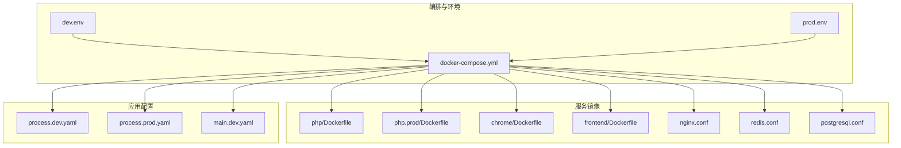
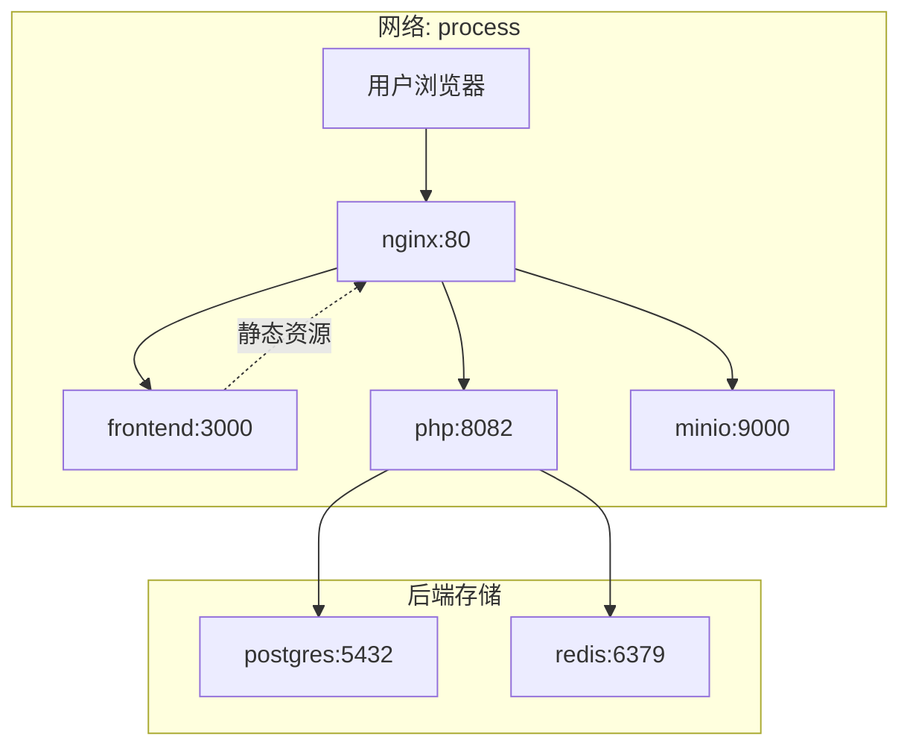
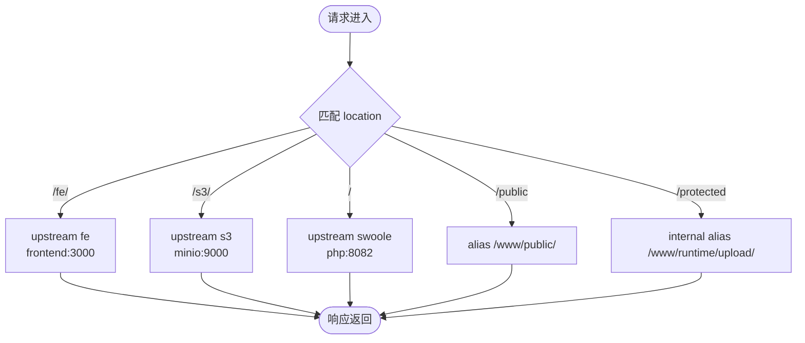
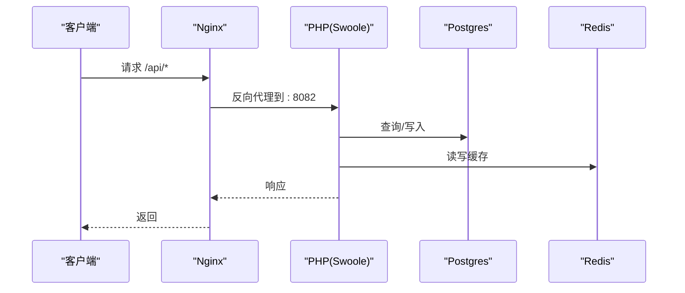
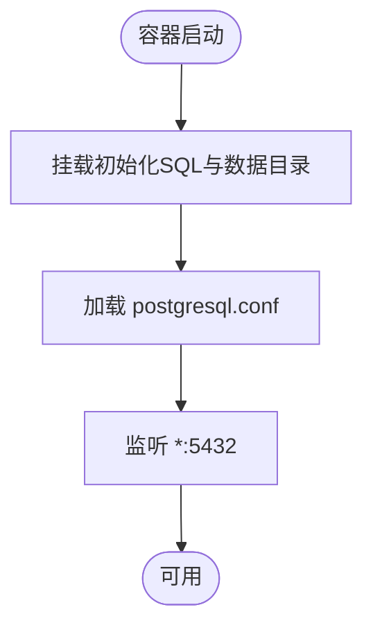
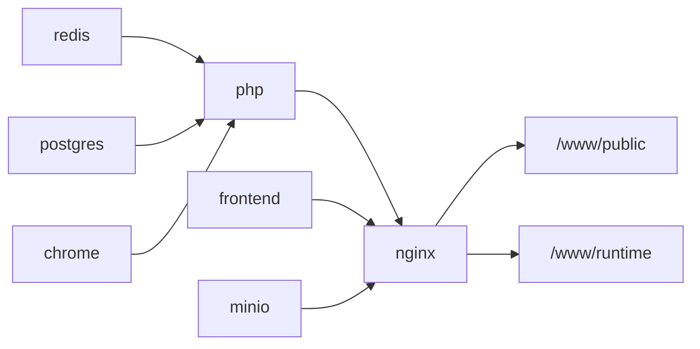

# Docker 部署

<cite>
**本文引用的文件**
- [docker-compose.yml](file://process/docker/docker-compose.yml)
- [dev.env](file://process/docker/dev.env)
- [prod.env](file://process/docker/prod.env)
- [php/Dockerfile](file://process/docker/services/php/Dockerfile)
- [php.prod/Dockerfile](file://process/docker/services/php.prod/Dockerfile)
- [chrome/Dockerfile](file://process/docker/services/chrome/Dockerfile)
- [frontend/Dockerfile](file://process/docker/services/frontend/Dockerfile)
- [nginx.conf](file://process/docker/services/nginx/nginx.conf)
- [php.ini](file://process/docker/services/php/php.ini)
- [php.ini(prod)](file://process/docker/services/php.prod/php.ini)
- [redis.conf](file://process/docker/services/redis/redis.conf)
- [postgresql.conf](file://process/docker/services/postgres/postgresql.conf)
- [process.dev.yaml](file://process/src/config/process.dev.yaml)
- [process.prod.yaml](file://process/src/config/process.prod.yaml)
- [main.dev.yaml](file://process/src/config/main.dev.yaml)
</cite>

## 目录
1. [简介](#简介)
2. [项目结构](#项目结构)
3. [核心组件](#核心组件)
4. [架构总览](#架构总览)
5. [详细组件分析](#详细组件分析)
6. [依赖关系分析](#依赖关系分析)
7. [性能考虑](#性能考虑)
8. [故障排除指南](#故障排除指南)
9. [结论](#结论)
10. [附录](#附录)

## 简介
本文件面向 htdNew 项目的 Docker 部署，系统性阐述容器化架构设计、服务编排与网络配置，对比开发与生产环境差异，说明镜像构建流程、服务发现与负载均衡机制，并给出监控、日志与健康检查建议，以及部署最佳实践、故障排除与性能优化指南。

## 项目结构
- 容器编排与环境配置位于 process/docker 目录，包含 docker-compose 编排文件与两套环境变量文件（开发与生产）。
- 各服务镜像构建脚本位于 process/docker/services 下的对应子目录，包括 PHP、Nginx、Postgres、Redis、Chrome、Frontend。
- 应用配置文件位于 process/src/config，分别提供开发与生产进程配置及通用运行配置。

图表来源
- [docker-compose.yml](file://process/docker/docker-compose.yml#L1-L150)
- [dev.env](file://process/docker/dev.env#L1-L50)
- [prod.env](file://process/docker/prod.env#L1-L46)

章节来源
- [docker-compose.yml](file://process/docker/docker-compose.yml#L1-L150)
- [dev.env](file://process/docker/dev.env#L1-L50)
- [prod.env](file://process/docker/prod.env#L1-L46)

## 核心组件
- Nginx：反向代理与静态资源分发，向上游转发至 PHP（Swoole），并代理 MinIO 对象存储。
- PHP（Swoole）：应用服务，监听 8082 端口，通过 docker-compose 的命令启动主进程。
- Postgres：数据库，初始化脚本挂载至 /docker-entrypoint-initdb.d/database.sql。
- Redis：缓存与队列支持。
- Chrome：Headless 浏览器，用于截图或 PDF 渲染等场景。
- Frontend（PM2 Docker）：前端服务，使用 PM2 在容器内托管。
- MinIO：对象存储，提供 S3 兼容接口，前端直连访问。

章节来源
- [docker-compose.yml](file://process/docker/docker-compose.yml#L1-L150)
- [nginx.conf](file://process/docker/services/nginx/nginx.conf#L1-L127)
- [main.dev.yaml](file://process/src/config/main.dev.yaml#L1-L97)

## 架构总览
下图展示容器间的交互关系与流量走向，包括服务发现、负载均衡与数据卷挂载。

图表来源
- [docker-compose.yml](file://process/docker/docker-compose.yml#L1-L150)
- [nginx.conf](file://process/docker/services/nginx/nginx.conf#L1-L127)
- [main.dev.yaml](file://process/src/config/main.dev.yaml#L1-L97)

## 详细组件分析

### Nginx 组件
- 负载均衡：对后端 PHP、前端、MinIO 分别定义 upstream，实现简单轮询。
- 反向代理：/fe 前缀代理到 frontend；根路径代理到 php；/s3/ 代理到 minio。
- 静态资源：/public 映射到宿主机公共目录；/protected 为受保护上传目录。
- 性能参数：epoll、高并发连接数、open_file_cache、gzip 关闭等。
- 健康检查：可结合 Nginx stub_status 或应用探针。

图表来源
- [nginx.conf](file://process/docker/services/nginx/nginx.conf#L1-L127)

章节来源
- [nginx.conf](file://process/docker/services/nginx/nginx.conf#L1-L127)
- [docker-compose.yml](file://process/docker/docker-compose.yml#L66-L127)

### PHP（Swoole）组件
- 镜像构建：开发镜像与生产镜像分别位于 php 与 php.prod 目录，后者包含 Oracle Instant Client 与额外扩展。
- 运行方式：通过 docker-compose 命令启动主进程，监听 8082 端口。
- 配置差异：开发与生产环境的进程数量、CPU 亲和、日志级别等不同。
- 数据卷：挂载源代码、公共目录、运行时与日志目录，字体目录挂载供渲染使用。

图表来源
- [docker-compose.yml](file://process/docker/docker-compose.yml#L36-L65)
- [main.dev.yaml](file://process/src/config/main.dev.yaml#L1-L97)

章节来源
- [php/Dockerfile](file://process/docker/services/php/Dockerfile#L1-L38)
- [php.prod/Dockerfile](file://process/docker/services/php.prod/Dockerfile#L1-L82)
- [process.dev.yaml](file://process/src/config/process.dev.yaml#L1-L89)
- [process.prod.yaml](file://process/src/config/process.prod.yaml#L1-L80)
- [docker-compose.yml](file://process/docker/docker-compose.yml#L36-L65)

### Postgres 组件
- 初始化：通过挂载 SQL 文件完成首次初始化。
- 配置：大量参数集中于 postgresql.conf，包含连接、内存、WAL、复制、查询规划、日志、统计、自动清理等。
- 环境变量：用户名、密码、时区、PGDATA 等由 docker-compose 注入。

图表来源
- [docker-compose.yml](file://process/docker/docker-compose.yml#L18-L35)
- [postgresql.conf](file://process/docker/services/postgres/postgresql.conf#L1-L644)

章节来源
- [docker-compose.yml](file://process/docker/docker-compose.yml#L18-L35)
- [postgresql.conf](file://process/docker/services/postgres/postgresql.conf#L1-L644)

### Redis 组件
- 配置：开启持久化、最大内存、键空间事件等，日志与数据目录挂载。
- 网络：通过自定义网络与别名提供服务发现。

章节来源
- [redis.conf](file://process/docker/services/redis/redis.conf#L1-L51)
- [docker-compose.yml](file://process/docker/docker-compose.yml#L1-L17)

### Chrome 组件
- 镜像：基于 Alpine，安装 Chromium 并设置无头模式与调试端口。
- 权限：SYS_ADMIN 能力，便于无沙箱运行。
- 字体：共享字体目录以支持中文字体渲染。

章节来源
- [chrome/Dockerfile](file://process/docker/services/chrome/Dockerfile#L1-L12)
- [docker-compose.yml](file://process/docker/docker-compose.yml#L90-L109)

### Frontend（PM2 Docker）组件
- 镜像：基于 PM2 官方镜像，容器内运行 PM2。
- 端口：对外暴露 3000，代理由 Nginx 路由到该上游。
- 数据卷：挂载前端工程目录。

章节来源
- [frontend/Dockerfile](file://process/docker/services/frontend/Dockerfile#L1-L5)
- [docker-compose.yml](file://process/docker/docker-compose.yml#L110-L127)

### MinIO 组件
- 镜像：官方 MinIO。
- 端口：对外暴露 9000，控制台 9001。
- 存储：数据与配置目录挂载到宿主机 runtime。

章节来源
- [docker-compose.yml](file://process/docker/docker-compose.yml#L128-L149)

## 依赖关系分析
- 服务依赖：php 依赖 redis、postgres、chrome；nginx 依赖 php；frontend 与 minio 独立。
- 网络：所有服务加入名为 process 的自定义网络，通过服务名或别名互相访问。
- 数据卷：应用代码、公共目录、运行时与日志目录均挂载，确保开发与生产的可维护性。

图表来源
- [docker-compose.yml](file://process/docker/docker-compose.yml#L1-L150)

章节来源
- [docker-compose.yml](file://process/docker/docker-compose.yml#L1-L150)

## 性能考虑
- Nginx
  - 已启用 epoll、高 worker_connections、open_file_cache，建议根据并发调优 worker 数与缓冲。
  - gzip 当前关闭，如静态资源较多可按需开启。
- PHP
  - 生产镜像使用 Alpine 与精简扩展，减少体积与启动时间。
  - 进程数量与 CPU 亲和在生产配置中明确，建议结合 CPU 核心数与业务峰值调优。
- Postgres
  - shared_buffers、有效索引成本、并行设置等参数可依据内存与负载调整。
  - WAL 与 checkpoint 参数影响写入吞吐与恢复时间，需平衡。
- Redis
  - 最大内存与淘汰策略需结合业务场景设定，避免内存压力导致驱逐风暴。
- MinIO
  - 建议独立存储卷与快照策略，配合对象生命周期管理降低冷数据成本。

章节来源
- [nginx.conf](file://process/docker/services/nginx/nginx.conf#L1-L127)
- [php.prod/Dockerfile](file://process/docker/services/php.prod/Dockerfile#L1-L82)
- [process.prod.yaml](file://process/src/config/process.prod.yaml#L1-L80)
- [postgresql.conf](file://process/docker/services/postgres/postgresql.conf#L1-L644)
- [redis.conf](file://process/docker/services/redis/redis.conf#L1-L51)

## 故障排除指南
- 服务无法访问
  - 检查 docker-compose 端口映射与宿主机占用情况。
  - 确认 Nginx upstream 与容器内部端口一致。
- 数据库初始化失败
  - 核对初始化 SQL 路径与权限，确认数据目录挂载正确。
- PHP 进程未启动
  - 查看容器日志与命令入口，确认源代码与配置文件挂载路径正确。
- 缓存/队列异常
  - 检查 Redis 配置与数据卷挂载，确认最大内存与持久化策略。
- 对象存储不可用
  - 校验 MinIO 端口映射与桶权限，确认应用侧 endpoint 与凭据。

章节来源
- [docker-compose.yml](file://process/docker/docker-compose.yml#L1-L150)
- [main.dev.yaml](file://process/src/config/main.dev.yaml#L1-L97)

## 结论
本部署方案采用多容器协作与自定义网络，结合 Nginx 负载均衡与 PM2 前端托管，形成清晰的服务边界与职责分离。通过 dev/prod 两套环境变量与镜像差异化，兼顾开发效率与生产稳定性。建议在生产环境中进一步完善监控告警、日志聚合与资源配额限制，持续优化数据库与中间件参数以适配业务峰值。

## 附录

### 开发环境 vs 生产环境差异
- 环境变量
  - 开发：端口映射更贴近本地，镜像版本与日志路径偏向调试友好。
  - 生产：端口映射与镜像版本更贴近线上，日志与运行时目录分离。
- PHP 镜像
  - 开发：基础镜像，便于快速迭代。
  - 生产：Alpine 镜像，集成 Oracle 客户端与必要扩展。
- 进程配置
  - 开发：HTTP 进程数量较少，便于调试。
  - 生产：HTTP 进程数量增加并设置 CPU 亲和，提升吞吐。

章节来源
- [dev.env](file://process/docker/dev.env#L1-L50)
- [prod.env](file://process/docker/prod.env#L1-L46)
- [php/Dockerfile](file://process/docker/services/php/Dockerfile#L1-L38)
- [php.prod/Dockerfile](file://process/docker/services/php.prod/Dockerfile#L1-L82)
- [process.dev.yaml](file://process/src/config/process.dev.yaml#L1-L89)
- [process.prod.yaml](file://process/src/config/process.prod.yaml#L1-L80)

### 部署最佳实践
- 使用独立网络与服务别名，避免硬编码 IP。
- 将敏感信息放入环境变量或外部密钥管理，不写死在仓库。
- 为每个服务设置合理的资源限制与重启策略。
- 使用只读挂载与最小权限原则，减少攻击面。
- 对关键数据卷定期备份，制定灾难恢复预案。

### 监控、日志与健康检查建议
- 监控
  - Nginx：启用 stub_status 或接入第三方指标采集。
  - PHP/Postgres/Redis：结合应用埋点与系统指标（CPU、内存、磁盘、网络）。
- 日志
  - Nginx：access 与 error 日志输出到宿主机卷，便于检索。
  - PHP：error_log 指向容器内日志目录，统一收集。
  - Postgres：开启必要的日志项（如慢查询、锁等待）。
- 健康检查
  - Nginx：探测 /nginx_status 或应用探针。
  - PHP：探测 /health 或内部健康接口。
  - 数据库：心跳连接检测。

章节来源
- [nginx.conf](file://process/docker/services/nginx/nginx.conf#L1-L127)
- [php.ini](file://process/docker/services/php/php.ini#L1-L152)
- [php.ini(prod)](file://process/docker/services/php.prod/php.ini#L1-L152)
- [postgresql.conf](file://process/docker/services/postgres/postgresql.conf#L1-L644)