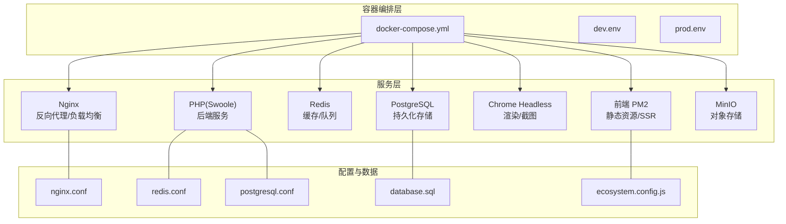
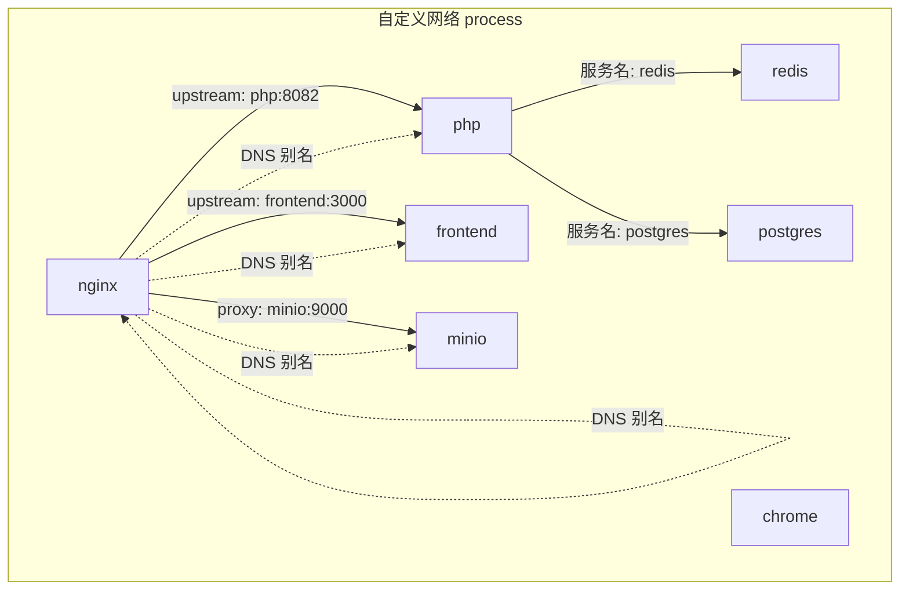
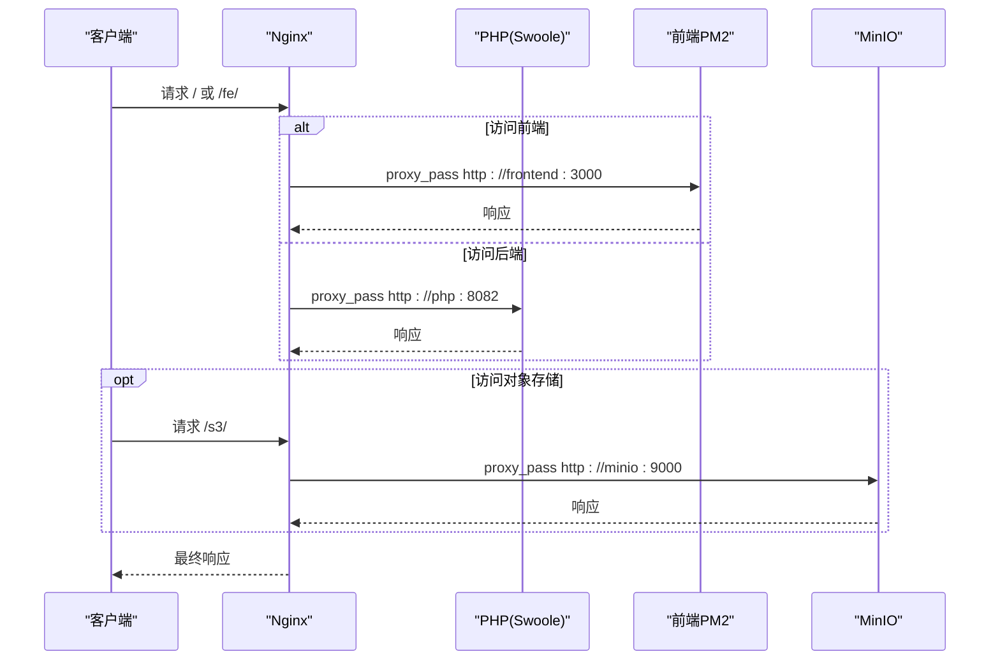
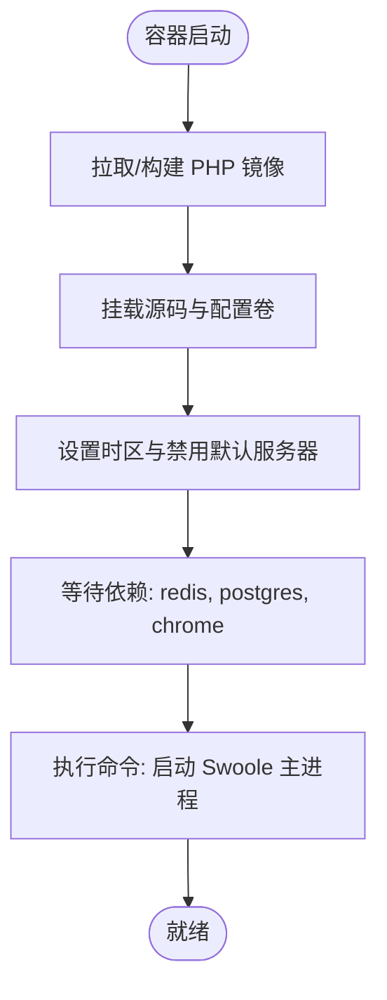
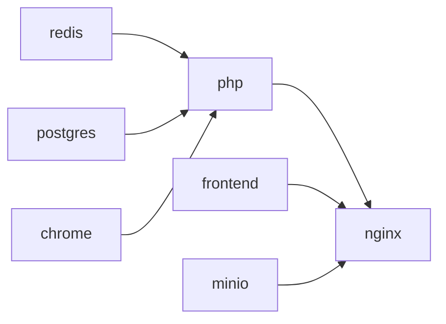

# 容器编排与服务发现

<cite>
**本文引用的文件**
- [docker-compose.yml](file://process/docker/docker-compose.yml)
- [dev.env](file://process/docker/dev.env)
- [prod.env](file://process/docker/prod.env)
- [nginx.conf](file://process/docker/services/nginx/nginx.conf)
- [Dockerfile（PHP 开发）](file://process/docker/services/php/Dockerfile)
- [Dockerfile（PHP 生产）](file://process/docker/services/php.prod/Dockerfile)
- [Dockerfile（Chrome）](file://process/docker/services/chrome/Dockerfile)
- [Dockerfile（前端）](file://process/docker/services/frontend/Dockerfile)
- [redis.conf](file://process/docker/services/redis/redis.conf)
- [postgresql.conf](file://process/docker/services/postgres/postgresql.conf)
- [process.dev.yaml](file://process/src/config/process.dev.yaml)
- [process.prod.yaml](file://process/src/config/process.prod.yaml)
- [database.sql](file://process/docs/sql/database.sql)
- [ecosystem.config.js](file://process/docker/services/frontend/mock/public/ecosystem.config.js)
</cite>

## 目录
1. [简介](#简介)
2. [项目结构](#项目结构)
3. [核心组件](#核心组件)
4. [架构总览](#架构总览)
5. [组件详解](#组件详解)
6. [依赖关系分析](#依赖关系分析)
7. [性能考量](#性能考量)
8. [故障排查指南](#故障排查指南)
9. [结论](#结论)
10. [附录](#附录)

## 简介
本文件围绕 htdNew 项目的容器编排与服务发现展开，系统性梳理 Docker Compose 的服务编排、网络配置、服务依赖关系与容器间通信机制；解释基于 Docker 内置 DNS 的服务发现、网络别名与域名解析；阐述 Nginx 作为反向代理的上游负载均衡与静态资源分发；补充重启策略、资源限制与监控集成建议；最后给出最佳实践、故障排除与性能调优指南。

## 项目结构
htdNew 将容器编排集中在 process/docker 下，通过 docker-compose.yml 统一编排 Redis、PostgreSQL、PHP（Swoole）、Nginx、Chrome Headless、前端 PM2 容器，并通过 dev.env/prod.env 提供环境变量与端口映射差异。Nginx 配置文件集中于 services/nginx/nginx.conf，数据库初始化 SQL 放置于 docs/sql/database.sql。

图示来源
- [docker-compose.yml](file://process/docker/docker-compose.yml#L1-L150)
- [nginx.conf](file://process/docker/services/nginx/nginx.conf#L1-L127)
- [redis.conf](file://process/docker/services/redis/redis.conf#L1-L51)
- [postgresql.conf](file://process/docker/services/postgres/postgresql.conf#L1-L644)
- [database.sql](file://process/docs/sql/database.sql#L1-L800)
- [ecosystem.config.js](file://process/docker/services/frontend/mock/public/ecosystem.config.js#L1-L7)

章节来源
- [docker-compose.yml](file://process/docker/docker-compose.yml#L1-L150)
- [dev.env](file://process/docker/dev.env#L1-L50)
- [prod.env](file://process/docker/prod.env#L1-L46)

## 核心组件
- Nginx：统一入口，负责静态资源、WebSocket 升级、反向代理至 PHP（Swoole）与前端 PM2，并代理 MinIO 对象存储。
- PHP（Swoole）：后端服务，监听 8082 端口，由 Nginx upstream 指向。
- Redis：键值缓存与队列，挂载配置与数据卷，容器内通过别名访问。
- PostgreSQL：关系型数据库，初始化脚本在首次启动时导入，挂载数据与配置卷。
- Chrome Headless：无头浏览器，用于 PDF 渲染与截图，暴露调试端口。
- 前端 PM2：前端静态资源与 SSR 应用，通过 PM2 管理多实例。
- MinIO：对象存储，提供 S3 兼容接口，Nginx 代理 /s3/ 前缀路径。

章节来源
- [docker-compose.yml](file://process/docker/docker-compose.yml#L1-L150)
- [nginx.conf](file://process/docker/services/nginx/nginx.conf#L1-L127)

## 架构总览
下图展示容器间通信与服务发现路径：Nginx 通过 Docker 网络别名访问 php、frontend、minio；php 通过服务名访问 redis 与 postgres；Chrome 与前端独立运行，但共享同一自定义网络。

图示来源
- [docker-compose.yml](file://process/docker/docker-compose.yml#L1-L150)
- [nginx.conf](file://process/docker/services/nginx/nginx.conf#L60-L100)

## 组件详解

### Nginx 反向代理与负载均衡
- 上游定义：Nginx 在 http 块中定义 upstream，分别指向 php:8082、frontend:3000、minio:9000，权重均为 1，实现简单轮询。
- 路由规则：
  - /fe/ 前缀代理至前端服务；
  - / 代理至后端 PHP（Swoole）；
  - /s3/ 代理至 MinIO；
  - / 返回 /fe/ 前端首页；
  - /public 与 /protected 为静态与受保护资源目录。
- WebSocket/升级：通过 map 与 proxy_set_header 实现 HTTP/1.1 与 Upgrade/Connection 的透传。
- 性能参数：worker_processes、worker_connections、open_file_cache 等参数优化并发与文件缓存。

图示来源
- [nginx.conf](file://process/docker/services/nginx/nginx.conf#L58-L106)

章节来源
- [nginx.conf](file://process/docker/services/nginx/nginx.conf#L1-L127)

### PHP（Swoole）服务
- 镜像与构建：开发镜像与生产镜像分别位于 php 与 php.prod 目录，均基于 phpswoole/swoole，按需安装扩展与依赖。
- 端口与命令：容器暴露 8082 端口，命令启动后端主进程，依赖 redis、postgres、chrome。
- 环境变量：时区、禁用默认服务器等。
- 数据卷：挂载源码、public、runtime、log 以及 php.ini。

图示来源
- [docker-compose.yml](file://process/docker/docker-compose.yml#L36-L64)
- [Dockerfile（PHP 开发）](file://process/docker/services/php/Dockerfile#L1-L38)
- [Dockerfile（PHP 生产）](file://process/docker/services/php.prod/Dockerfile#L1-L82)

章节来源
- [docker-compose.yml](file://process/docker/docker-compose.yml#L36-L64)
- [Dockerfile（PHP 开发）](file://process/docker/services/php/Dockerfile#L1-L38)
- [Dockerfile（PHP 生产）](file://process/docker/services/php.prod/Dockerfile#L1-L82)

### Redis 缓存
- 配置：bind、端口、日志、持久化、内存上限等参数集中于 redis.conf。
- 卷：挂载配置与数据目录，容器内通过别名访问。
- 用途：缓存、会话、队列等。

章节来源
- [docker-compose.yml](file://process/docker/docker-compose.yml#L1-L20)
- [redis.conf](file://process/docker/services/redis/redis.conf#L1-L51)

### PostgreSQL 数据库
- 初始化：首次启动将 docker-entrypoint-initdb.d/database.sql 导入，创建业务表结构。
- 配置：通过挂载 postgresql.conf，设置监听地址、连接数、共享缓冲等。
- 卷：数据目录与配置目录挂载，确保持久化。

章节来源
- [docker-compose.yml](file://process/docker/docker-compose.yml#L17-L35)
- [postgresql.conf](file://process/docker/services/postgres/postgresql.conf#L1-L644)
- [database.sql](file://process/docs/sql/database.sql#L1-L800)

### Chrome Headless
- 镜像：基于 Alpine，安装 Chromium，暴露 9222 调试端口。
- 权限：SYS_ADMIN 能力，字体目录挂载。
- 用途：PDF 渲染与截图。

章节来源
- [docker-compose.yml](file://process/docker/docker-compose.yml#L90-L110)
- [Dockerfile（Chrome）](file://process/docker/services/chrome/Dockerfile#L1-L12)

### 前端 PM2
- 镜像：基于 pm2:18-alpine，工作目录 /www。
- 命令：pm2-docker 启动 ecosystem.config.js 中的应用。
- 端口：容器内 3000，宿主机映射 3000。

章节来源
- [docker-compose.yml](file://process/docker/docker-compose.yml#L110-L127)
- [Dockerfile（前端）](file://process/docker/services/frontend/Dockerfile#L1-L5)
- [ecosystem.config.js](file://process/docker/services/frontend/mock/public/ecosystem.config.js#L1-L7)

### MinIO 对象存储
- 镜像：minio/minio，控制台端口 9001，数据端口 9000。
- 命令：server --console-address ':9001' /data。
- Nginx 代理：/s3/ 前缀转发至 MinIO。

章节来源
- [docker-compose.yml](file://process/docker/docker-compose.yml#L128-L149)
- [nginx.conf](file://process/docker/services/nginx/nginx.conf#L96-L100)

## 依赖关系分析
- 服务依赖：
  - php 依赖 redis、postgres、chrome，通过 depends_on 保证启动顺序。
  - nginx 依赖 php，确保后端可用后再对外提供服务。
- 网络与别名：
  - 所有服务加入自定义网络 process，并为部分服务设置别名（如 redis、postgres、php、nginx-process、nginx 域名、chrome、frontend、minio），便于容器内通过服务名访问。
- DNS 解析：
  - Docker Compose 为每个服务生成 DNS 记录，容器可通过服务名或别名解析到容器 IP；Nginx 通过 upstream 使用服务名实现“服务发现”。
- 健康检查：
  - 当前 compose 文件未显式声明 healthcheck；可在后续增强以提升编排可靠性。

图示来源
- [docker-compose.yml](file://process/docker/docker-compose.yml#L1-L150)

章节来源
- [docker-compose.yml](file://process/docker/docker-compose.yml#L1-L150)

## 性能考量
- Nginx 并发与缓存：
  - worker_processes、worker_connections、open_file_cache 等参数直接影响并发与磁盘 IO。
  - gzip 关闭建议按场景开启，减少 CPU；静态资源可结合 CDN。
- PHP（Swoole）进程与亲和：
  - 开发环境：单进程 http。
  - 生产环境：多进程 http，可配置 CPU 亲和，避免上下文切换。
- 数据库：
  - shared_buffers、max_connections、有效 IO 并发等参数影响吞吐。
  - 建议对热点表建立合适索引，定期维护统计信息。
- 缓存：
  - Redis 内存上限与持久化策略需结合业务峰值与恢复要求权衡。
- 对象存储：
  - MinIO 与 Nginx 的代理链路应关注带宽与延迟，必要时引入边缘缓存。

章节来源
- [nginx.conf](file://process/docker/services/nginx/nginx.conf#L1-L127)
- [process.dev.yaml](file://process/src/config/process.dev.yaml#L1-L89)
- [process.prod.yaml](file://process/src/config/process.prod.yaml#L1-L80)
- [postgresql.conf](file://process/docker/services/postgres/postgresql.conf#L1-L644)
- [redis.conf](file://process/docker/services/redis/redis.conf#L1-L51)

## 故障排查指南
- 服务无法启动或启动顺序异常
  - 检查 depends_on 是否满足：php 依赖 redis、postgres、chrome；nginx 依赖 php。
  - 查看对应容器日志：Nginx 错误日志、PHP 进程日志、数据库初始化日志。
- 端口冲突
  - dev.env 与 prod.env 提供不同宿主机端口映射，确认当前使用的 .env 文件与端口占用情况。
- DNS/别名解析失败
  - 确认服务是否在同一网络 process，且别名正确；容器内使用服务名或别名访问。
- Nginx 代理错误
  - 检查 upstream 目标与端口；确认 /fe/、/、/s3/ 路由规则与目标服务可达。
- 数据库初始化失败
  - database.sql 是否存在且可读；PGDATA 路径是否正确挂载。
- MinIO 控制台不可达
  - 确认 9001 端口映射与容器命令；浏览器访问控制台地址。
- Chrome 渲染问题
  - 确认 9222 调试端口可用；字体目录挂载是否正确。

章节来源
- [docker-compose.yml](file://process/docker/docker-compose.yml#L1-L150)
- [dev.env](file://process/docker/dev.env#L1-L50)
- [prod.env](file://process/docker/prod.env#L1-L46)
- [nginx.conf](file://process/docker/services/nginx/nginx.conf#L1-L127)
- [database.sql](file://process/docs/sql/database.sql#L1-L800)

## 结论
htdNew 的容器编排采用单一自定义网络与服务别名实现服务发现，Nginx 作为统一入口承担反向代理与负载均衡职责。通过环境变量区分开发与生产环境，结合上游配置实现灵活路由。建议后续补充健康检查、资源限制与监控集成，以进一步提升稳定性与可观测性。

## 附录

### 环境变量与端口映射要点
- 开发环境（dev.env）
  - Nginx：宿主机 80 -> 容器 80；域名 local.process.campusapp.com.cn。
  - Redis：宿主机 6380 -> 容器 6379。
  - PostgreSQL：宿主机 5555 -> 容器 5432。
  - 前端：宿主机 3000 -> 容器 3000。
- 生产环境（prod.env）
  - Nginx：宿主机 8003 -> 容器 80；域名 process.campusapp.com.cn。
  - Redis：宿主机 6399 -> 容器 6379。
  - 前端：宿主机 3000 -> 容器 3000。

章节来源
- [dev.env](file://process/docker/dev.env#L1-L50)
- [prod.env](file://process/docker/prod.env#L1-L46)

### 重启策略与资源限制建议
- 重启策略：建议为关键服务（如 php、nginx、postgres、redis）配置 restart 策略，保障异常退出后的自动恢复。
- 资源限制：为 php、nginx、postgres、redis 设置内存与 CPU 限制，避免资源争用导致雪崩。
- 监控集成：接入 Prometheus/Grafana 或容器平台自带监控，采集 CPU、内存、磁盘、网络与应用指标。

[本节为通用建议，不直接分析具体文件]