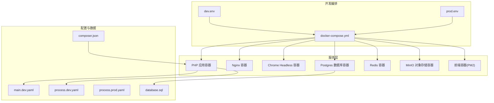
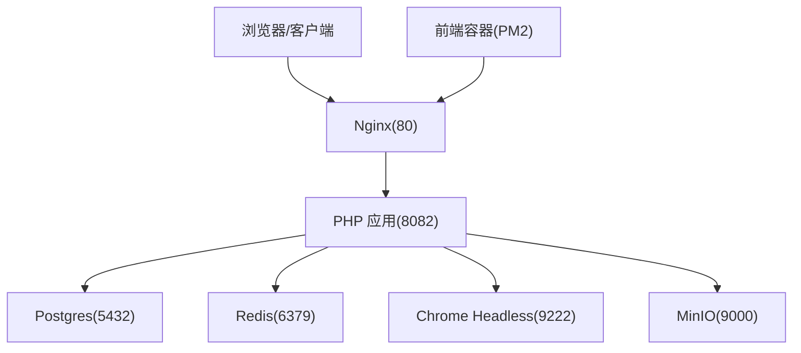
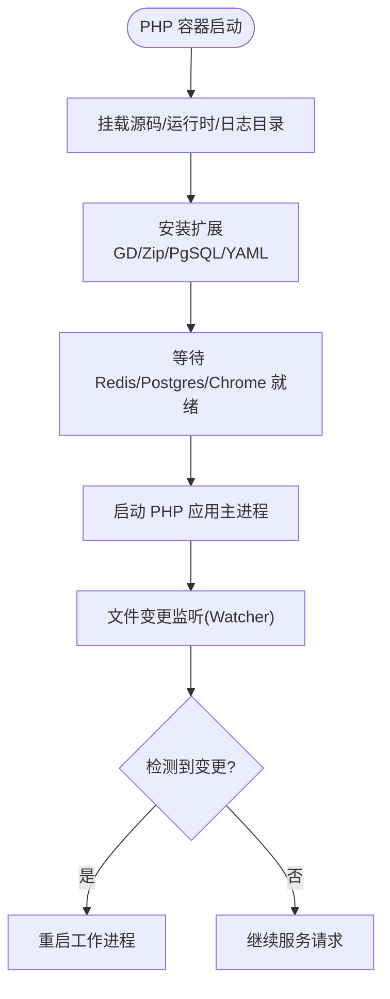
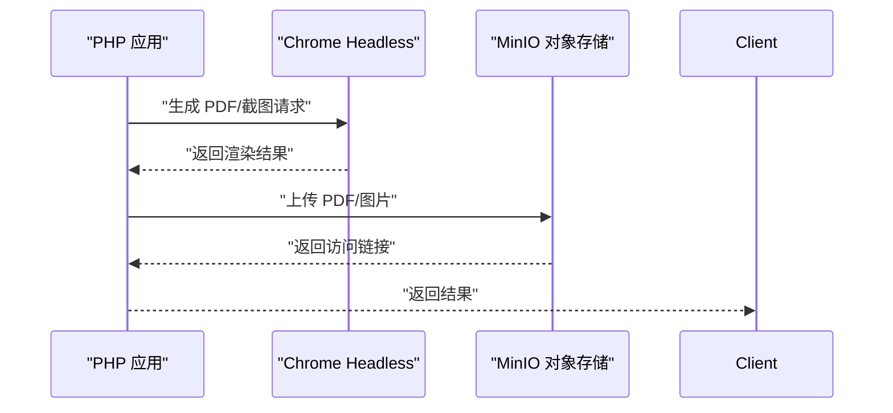
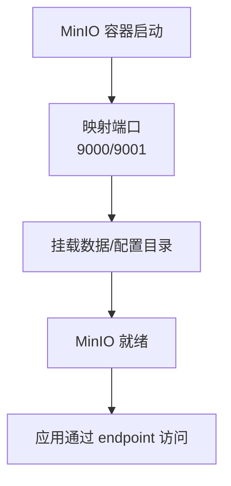
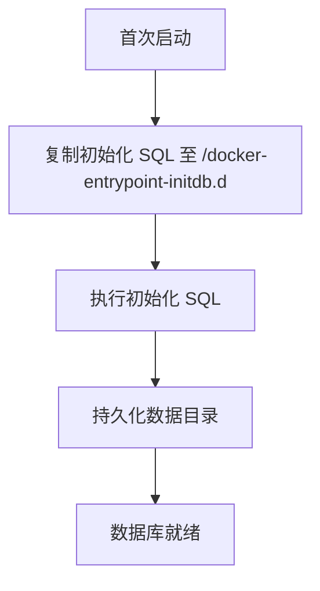
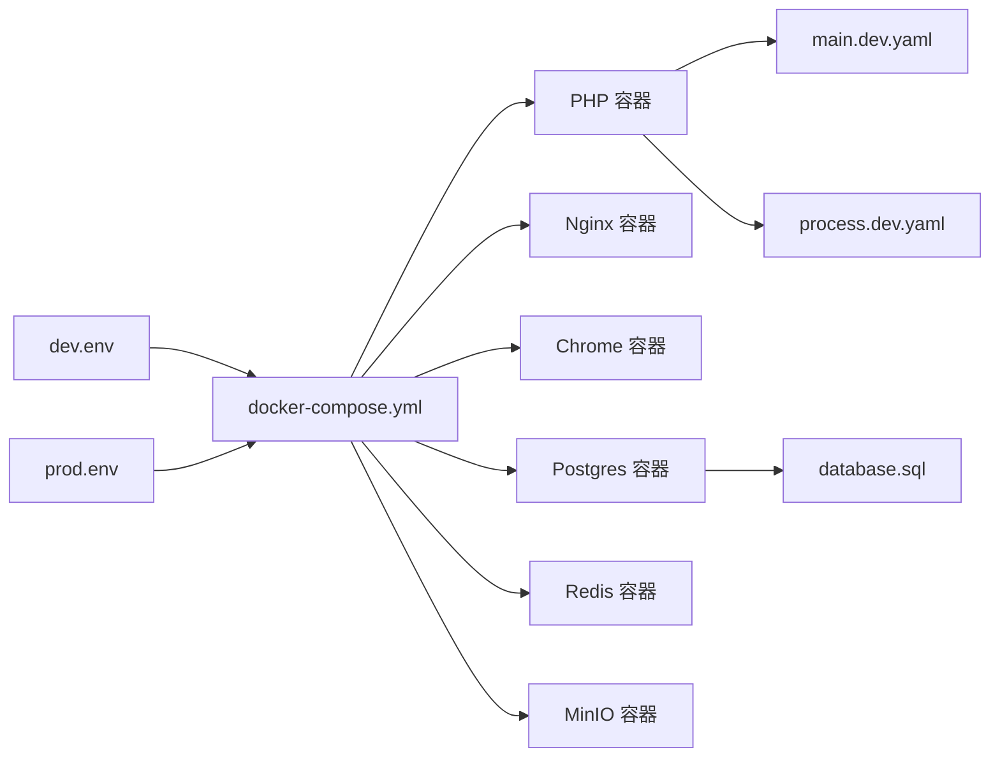

# 开发环境部署

<cite>
**本文引用的文件**
- [docker-compose.yml](file://process/docker/docker-compose.yml)
- [dev.env](file://process/docker/dev.env)
- [prod.env](file://process/docker/prod.env)
- [main.dev.yaml](file://process/src/config/main.dev.yaml)
- [process.dev.yaml](file://process/src/config/process.dev.yaml)
- [process.prod.yaml](file://process/src/config/process.prod.yaml)
- [php Dockerfile（开发）](file://process/docker/services/php/Dockerfile)
- [php Dockerfile（生产）](file://process/docker/services/php.prod/Dockerfile)
- [chrome Dockerfile](file://process/docker/services/chrome/Dockerfile)
- [frontend Dockerfile](file://process/docker/services/frontend/Dockerfile)
- [数据库初始化 SQL](file://process/docs/sql/database.sql)
- [composer.json](file://process/composer.json)
</cite>

## 目录
1. [简介](#简介)
2. [项目结构](#项目结构)
3. [核心组件](#核心组件)
4. [架构总览](#架构总览)
5. [详细组件分析](#详细组件分析)
6. [依赖分析](#依赖分析)
7. [性能考量](#性能考量)
8. [故障排查指南](#故障排查指南)
9. [结论](#结论)
10. [附录](#附录)

## 简介
本文件面向 htdNew 项目的开发环境部署，围绕 Docker 编排、环境变量、本地开发流程展开，系统性说明开发环境与生产环境的差异、配置参数与优化策略，并覆盖 PHP 开发容器、Chrome Headless 浏览器、MinIO 对象存储等服务的配置要点。同时提供开发工具集成、代码热更新与调试配置建议，以及初始化步骤、常见问题与性能优化指南。

## 项目结构
开发环境相关的关键目录与文件：
- process/docker：Docker 编排与环境变量
  - docker-compose.yml：服务编排与网络、卷、端口映射
  - dev.env / prod.env：开发/生产环境变量
  - services：各服务镜像构建上下文
    - php / php.prod：PHP 镜像（开发/生产）
    - chrome：Chrome Headless 镜像
    - frontend：前端 PM2 容器
    - nginx：Nginx 配置
    - postgres / redis：数据库配置
- process/src/config：应用配置（开发/生产）
  - main.dev.yaml：通用配置、数据库、Redis、上传、日志等
  - process.dev.yaml / process.prod.yaml：进程模型与进程数量
- process/docs/sql：PostgreSQL 初始化 SQL
- process/composer.json：PHP 依赖与自动加载

图表来源
- [docker-compose.yml](file://process/docker/docker-compose.yml#L1-L150)
- [dev.env](file://process/docker/dev.env#L1-L50)
- [prod.env](file://process/docker/prod.env#L1-L46)
- [main.dev.yaml](file://process/src/config/main.dev.yaml#L1-L97)
- [process.dev.yaml](file://process/src/config/process.dev.yaml#L1-L89)
- [process.prod.yaml](file://process/src/config/process.prod.yaml#L1-L80)
- [database.sql](file://process/docs/sql/database.sql#L1-L200)
- [composer.json](file://process/composer.json#L1-L70)

章节来源
- [docker-compose.yml](file://process/docker/docker-compose.yml#L1-L150)
- [dev.env](file://process/docker/dev.env#L1-L50)
- [prod.env](file://process/docker/prod.env#L1-L46)

## 核心组件
- PHP 应用容器（开发）
  - 基于指定 PHP Swoole 镜像，安装 GD、Zip、PDO_PGSQL、YAML 等扩展，挂载源码与运行时目录，暴露应用端口，依赖 Redis、Postgres、Chrome。
  - 关键点：容器内时区、字体、GD/Zip/PgSQL/YAML 扩展均已预置；开发模式下启用文件监听与热更新能力。
- Nginx 反向代理
  - 暴露宿主机端口映射到容器内部 80，挂载运行时与公开目录，解析项目域名至 127.0.0.1，便于本地访问。
- Chrome Headless 浏览器
  - 无沙箱、远程调试端口 9222，挂载中文字体目录，满足 PDF 渲染与截图场景。
- Postgres 数据库
  - 首次启动执行初始化 SQL 文件，数据持久化至宿主机目录，容器内配置文件挂载。
- Redis 缓存
  - 挂载配置与数据目录，容器内按配置启动。
- MinIO 对象存储
  - 提供对象存储服务与 Web 控制台，映射数据与配置目录，应用通过 endpoint 访问。
- 前端容器（PM2）
  - 基于 PM2 镜像，挂载前端工程目录，使用 ecosystem.config.js 启动。

章节来源
- [docker-compose.yml](file://process/docker/docker-compose.yml#L36-L149)
- [php Dockerfile（开发）](file://process/docker/services/php/Dockerfile#L1-L38)
- [php Dockerfile（生产）](file://process/docker/services/php.prod/Dockerfile#L1-L82)
- [chrome Dockerfile](file://process/docker/services/chrome/Dockerfile#L1-L12)
- [frontend Dockerfile](file://process/docker/services/frontend/Dockerfile#L1-L5)
- [database.sql](file://process/docs/sql/database.sql#L1-L200)

## 架构总览
开发环境采用多容器协作：Nginx 作为入口，PHP 容器承载业务逻辑，Postgres/Redis 提供数据与缓存，Chrome Headless 支持无头渲染，MinIO 提供对象存储，前端容器负责静态资源与开发服务器。

图表来源
- [docker-compose.yml](file://process/docker/docker-compose.yml#L66-L149)
- [main.dev.yaml](file://process/src/config/main.dev.yaml#L1-L97)

## 详细组件分析

### PHP 开发容器
- 镜像与扩展
  - 基于指定 Swoole PHP 镜像，国内源优化，安装 GD、Zip、PDO_PGSQL、YAML 等扩展，确保图片处理、压缩、数据库与 YAML 解析能力。
- 挂载与端口
  - 挂载源码、公开目录、运行时与日志目录；暴露应用端口；依赖 Redis、Postgres、Chrome。
- 进程模型（开发）
  - 通过进程配置文件定义主进程、HTTP 进程、队列进程、计划任务进程等，开发模式下具备文件变更监听与工作进程自动重启能力。

图表来源
- [php Dockerfile（开发）](file://process/docker/services/php/Dockerfile#L1-L38)
- [process.dev.yaml](file://process/src/config/process.dev.yaml#L1-L89)
- [docker-compose.yml](file://process/docker/docker-compose.yml#L36-L64)

章节来源
- [php Dockerfile（开发）](file://process/docker/services/php/Dockerfile#L1-L38)
- [process.dev.yaml](file://process/src/config/process.dev.yaml#L1-L89)
- [docker-compose.yml](file://process/docker/docker-compose.yml#L36-L64)

### Chrome Headless 浏览器
- 镜像与运行参数
  - 基于 Alpine，安装 Chromium，开启远程调试端口 9222，禁用 GPU 与沙箱，适合无界面渲染与调试。
- 字体支持
  - 挂载中文字体目录，避免渲染缺失字符。
- 使用场景
  - PDF 渲染、截图、自动化测试等。

图表来源
- [chrome Dockerfile](file://process/docker/services/chrome/Dockerfile#L1-L12)
- [main.dev.yaml](file://process/src/config/main.dev.yaml#L50-L60)

章节来源
- [chrome Dockerfile](file://process/docker/services/chrome/Dockerfile#L1-L12)
- [main.dev.yaml](file://process/src/config/main.dev.yaml#L50-L60)

### MinIO 对象存储
- 服务与端口
  - 暴露 9000 端口，控制台端口 9001；挂载数据与配置目录；默认凭据在编排文件中配置。
- 应用配置
  - 上传类指向 AWS 兼容存储，endpoint 指向 MinIO 服务，bucket 名称与密钥在应用配置中设定。

图表来源
- [docker-compose.yml](file://process/docker/docker-compose.yml#L128-L148)
- [main.dev.yaml](file://process/src/config/main.dev.yaml#L50-L60)

章节来源
- [docker-compose.yml](file://process/docker/docker-compose.yml#L128-L148)
- [main.dev.yaml](file://process/src/config/main.dev.yaml#L50-L60)

### PostgreSQL 数据库
- 初始化与持久化
  - 首次启动执行初始化 SQL 文件，数据目录持久化至宿主机；容器内挂载配置文件。
- 连接配置
  - 应用通过服务名连接数据库，账号密码与端口在配置中设定。

图表来源
- [docker-compose.yml](file://process/docker/docker-compose.yml#L17-L35)
- [database.sql](file://process/docs/sql/database.sql#L1-L200)

章节来源
- [docker-compose.yml](file://process/docker/docker-compose.yml#L17-L35)
- [database.sql](file://process/docs/sql/database.sql#L1-L200)

### Redis 缓存
- 配置与持久化
  - 挂载配置与数据目录，容器内按配置启动，应用通过服务名连接。
- 应用配置
  - Redis 地址与端口在应用配置中设定。

章节来源
- [docker-compose.yml](file://process/docker/docker-compose.yml#L1-L17)
- [main.dev.yaml](file://process/src/config/main.dev.yaml#L32-L36)

### 前端容器（PM2）
- 镜像与工作目录
  - 基于 PM2 镜像，工作目录为 /www，挂载前端工程目录，使用 ecosystem.config.js 启动。
- 端口映射
  - 暴露 3000 端口，便于本地开发调试。

章节来源
- [frontend Dockerfile](file://process/docker/services/frontend/Dockerfile#L1-L5)
- [docker-compose.yml](file://process/docker/docker-compose.yml#L110-L127)

### Nginx 反向代理
- 端口与域名
  - 暴露宿主机端口映射到容器内部 80，解析项目域名至 127.0.0.1，便于本地访问。
- 挂载
  - 挂载运行时与公开目录，便于静态资源与日志访问。

章节来源
- [docker-compose.yml](file://process/docker/docker-compose.yml#L66-L90)
- [dev.env](file://process/docker/dev.env#L13-L21)

## 依赖分析
- 服务耦合
  - PHP 依赖 Redis、Postgres、Chrome；Nginx 依赖 PHP；MinIO 为可选依赖（按需启用）。
- 环境变量
  - 开发与生产环境变量分别由 dev.env 与 prod.env 提供，影响镜像版本、端口映射、服务域名、运行时路径等。
- 应用配置
  - main.dev.yaml 决定数据库、Redis、上传、日志等运行参数；process.dev.yaml/ prod.yaml 决定进程模型与数量。

图表来源
- [dev.env](file://process/docker/dev.env#L1-L50)
- [prod.env](file://process/docker/prod.env#L1-L46)
- [docker-compose.yml](file://process/docker/docker-compose.yml#L1-L150)
- [main.dev.yaml](file://process/src/config/main.dev.yaml#L1-L97)
- [process.dev.yaml](file://process/src/config/process.dev.yaml#L1-L89)
- [database.sql](file://process/docs/sql/database.sql#L1-L200)

章节来源
- [dev.env](file://process/docker/dev.env#L1-L50)
- [prod.env](file://process/docker/prod.env#L1-L46)
- [docker-compose.yml](file://process/docker/docker-compose.yml#L1-L150)
- [main.dev.yaml](file://process/src/config/main.dev.yaml#L1-L97)
- [process.dev.yaml](file://process/src/config/process.dev.yaml#L1-L89)
- [process.prod.yaml](file://process/src/config/process.prod.yaml#L1-L80)
- [database.sql](file://process/docs/sql/database.sql#L1-L200)

## 性能考量
- PHP 容器
  - 开发镜像预装常用扩展，减少容器内安装耗时；生产镜像针对 Oracle 客户端做了裁剪与加速准备。
- 数据库
  - 初始化 SQL 已包含常用索引与表结构，建议在开发阶段避免频繁重建数据库；数据目录持久化降低重启成本。
- 缓存
  - Redis 采用挂载配置与数据目录，建议在开发阶段保持数据可复用，避免频繁清空。
- 对象存储
  - MinIO 仅在需要 PDF/图片上传时启用，避免不必要的资源消耗。
- 进程模型
  - 开发模式下进程数量较少，便于调试；生产模式下 HTTP 进程数量与 CPU 亲和度可按 CPU 核心数调整。

章节来源
- [php Dockerfile（开发）](file://process/docker/services/php/Dockerfile#L1-L38)
- [php Dockerfile（生产）](file://process/docker/services/php.prod/Dockerfile#L1-L82)
- [process.dev.yaml](file://process/src/config/process.dev.yaml#L1-L89)
- [process.prod.yaml](file://process/src/config/process.prod.yaml#L1-L80)

## 故障排查指南
- 无法访问应用
  - 检查 Nginx 端口映射与域名解析；确认 PHP 容器已启动并监听应用端口。
- 数据库连接失败
  - 检查 Postgres 初始化 SQL 是否成功执行；确认应用配置中的数据库连接参数与服务名。
- Redis 连接异常
  - 检查 Redis 配置文件与数据目录挂载；确认应用配置中的 Redis 地址与端口。
- Chrome 渲染异常
  - 检查 Chrome 容器日志与远程调试端口；确认字体挂载路径正确。
- MinIO 上传失败
  - 检查 MinIO 控制台端口映射与凭据；确认应用配置中的 endpoint、bucket 与密钥。
- 进程热更新无效
  - 确认开发模式下的文件监听配置已启用；检查宿主机与容器内文件同步。

章节来源
- [docker-compose.yml](file://process/docker/docker-compose.yml#L1-L150)
- [main.dev.yaml](file://process/src/config/main.dev.yaml#L1-L97)
- [process.dev.yaml](file://process/src/config/process.dev.yaml#L1-L89)

## 结论
本开发环境通过 Docker 编排将 PHP、Nginx、Postgres、Redis、Chrome Headless、MinIO、前端容器有机整合，配合开发/生产两套环境变量与应用配置，既满足本地快速迭代，又为后续生产迁移打下基础。建议在开发阶段充分利用文件监听与热更新能力，在生产阶段根据 CPU 与业务规模调整进程数量与亲和性。

## 附录

### 开发环境初始化步骤
- 准备环境变量
  - 复制并编辑 dev.env，确认项目前缀、时区、端口映射、路径等。
- 启动服务
  - 使用 Docker Compose 启动所有服务，等待各容器健康。
- 初始化数据库
  - 首次启动会执行初始化 SQL，创建所需表结构与索引。
- 访问应用
  - 通过 Nginx 暴露的端口访问，域名可在 dev.env 中配置。

章节来源
- [dev.env](file://process/docker/dev.env#L1-L50)
- [docker-compose.yml](file://process/docker/docker-compose.yml#L1-L150)
- [database.sql](file://process/docs/sql/database.sql#L1-L200)

### 开发工具集成与调试
- PHP 调试
  - 利用 Chrome Remote Debugging 端口进行调试；结合 IDE 的 PHP 调试插件。
- 前端调试
  - 前端容器使用 PM2，可通过 ecosystem.config.js 配置开发服务器与热更新。
- 日志与监控
  - 应用日志与运行时目录挂载至宿主机，便于查看与分析。

章节来源
- [docker-compose.yml](file://process/docker/docker-compose.yml#L66-L149)
- [frontend Dockerfile](file://process/docker/services/frontend/Dockerfile#L1-L5)
- [main.dev.yaml](file://process/src/config/main.dev.yaml#L66-L68)

### 开发与生产差异对照
- 镜像版本
  - PHP 开发镜像与生产镜像不同，生产镜像包含 Oracle 客户端相关依赖。
- 端口映射
  - 生产环境 Nginx 外部端口与开发不同，便于区分。
- 进程模型
  - 生产模式下 HTTP 进程数量与 CPU 亲和度更贴近性能优化。
- 应用配置
  - 生产模式下的进程配置文件与开发不同，体现部署策略差异。

章节来源
- [prod.env](file://process/docker/prod.env#L1-L46)
- [php Dockerfile（开发）](file://process/docker/services/php/Dockerfile#L1-L38)
- [php Dockerfile（生产）](file://process/docker/services/php.prod/Dockerfile#L1-L82)
- [process.dev.yaml](file://process/src/config/process.dev.yaml#L1-L89)
- [process.prod.yaml](file://process/src/config/process.prod.yaml#L1-L80)