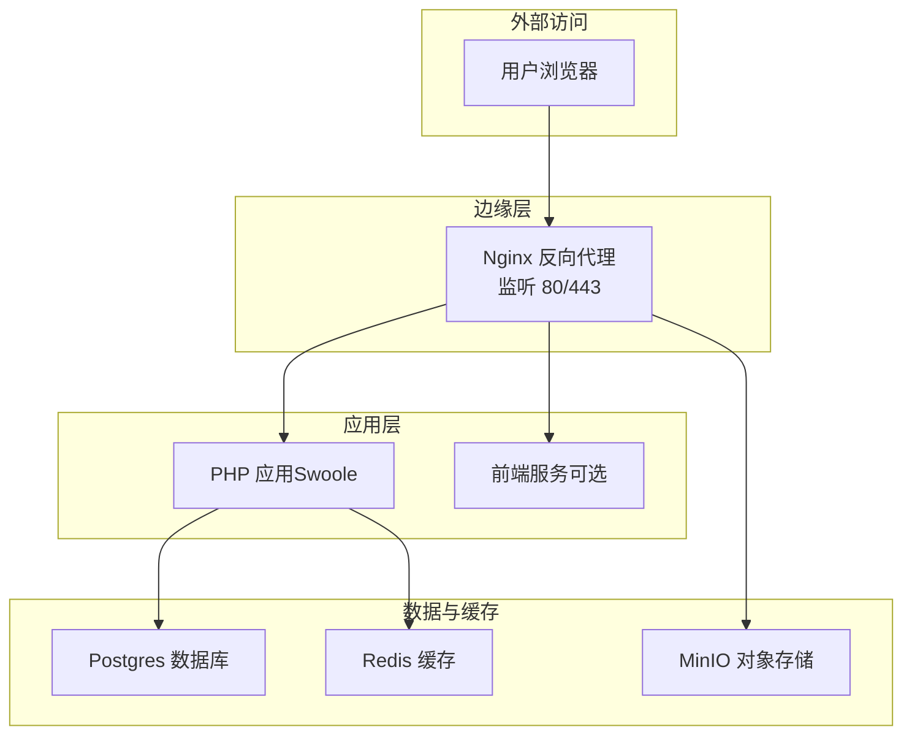
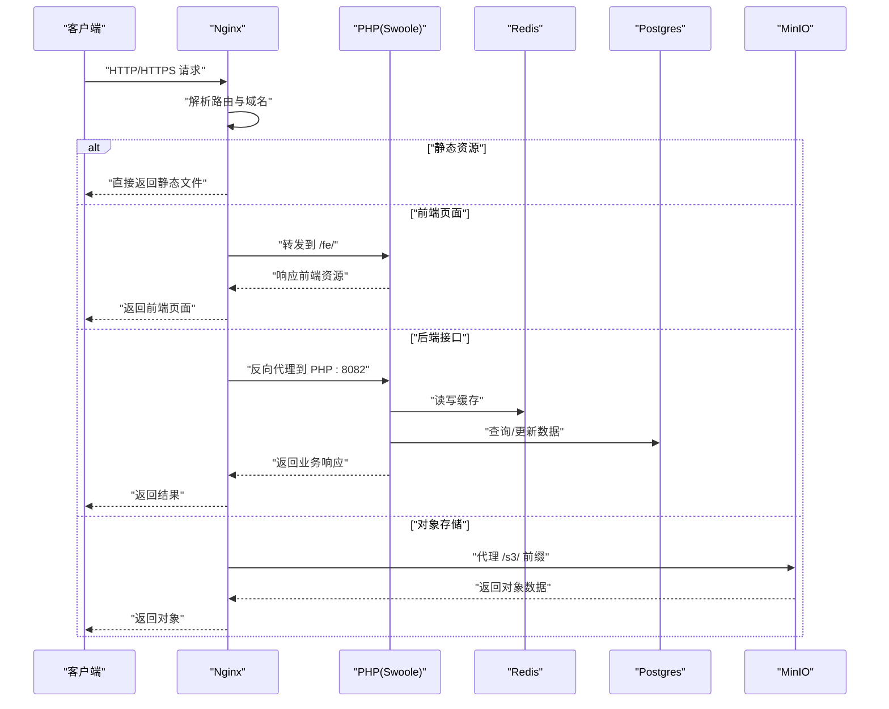
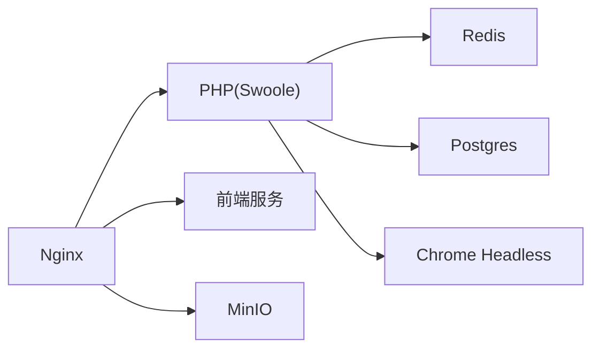

# 生产环境部署

<cite>
**本文引用的文件**
- [docker-compose.yml](file://process/docker/docker-compose.yml)
- [prod.env](file://process/docker/prod.env)
- [dev.env](file://process/docker/dev.env)
- [nginx.conf](file://process/docker/services/nginx/nginx.conf)
- [Dockerfile（php.prod）](file://process/docker/services/php.prod/Dockerfile)
- [postgresql.conf](file://process/docker/services/postgres/postgresql.conf)
- [redis.conf](file://process/docker/services/redis/redis.conf)
</cite>

## 目录
1. [引言](#引言)
2. [项目结构](#项目结构)
3. [核心组件](#核心组件)
4. [架构总览](#架构总览)
5. [详细组件分析](#详细组件分析)
6. [依赖关系分析](#依赖关系分析)
7. [性能考虑](#性能考虑)
8. [故障排查指南](#故障排查指南)
9. [结论](#结论)
10. [附录](#附录)

## 引言
本文件面向 htdNew 项目的生产环境部署，围绕 Docker 编排、Nginx 反向代理与静态资源处理、数据库与缓存、安全加固、性能优化、监控与日志、备份策略以及部署与恢复流程进行系统化说明。目标是帮助运维与开发团队在生产环境中稳定、安全、可扩展地运行系统。

## 项目结构
生产环境采用 Docker Compose 进行编排，核心服务包括：
- Nginx：反向代理与静态资源访问入口
- PHP（基于 Swoole）：应用后端服务
- Postgres：主数据库
- Redis：缓存与会话存储
- Chrome Headless：用于生成 PDF 等无头浏览器任务
- 前端服务（可选）：独立前端容器
- MinIO：对象存储服务，用于公共/受保护资源代理

图表来源
- [docker-compose.yml](file://process/docker/docker-compose.yml#L1-L150)
- [nginx.conf](file://process/docker/services/nginx/nginx.conf#L1-L127)

章节来源
- [docker-compose.yml](file://process/docker/docker-compose.yml#L1-L150)
- [prod.env](file://process/docker/prod.env#L1-L46)

## 核心组件
- Nginx：负责监听、TLS 终止（建议）、静态资源直出、WebSocket 升级、反向代理到 PHP/前端/MinIO。
- PHP（Swoole）：以常驻进程提供高性能 HTTP/WebSocket 服务，挂载源码与运行时目录。
- Postgres：持久化存储，初始化脚本与数据卷分离，支持备份与迁移。
- Redis：键值缓存与会话存储，持久化策略按需开启。
- Chrome Headless：无头浏览器渲染能力，用于 PDF 生成等场景。
- 前端服务（可选）：独立前端容器，通过 Nginx 的 /fe/ 路由转发。
- MinIO：对象存储，Nginx 代理 /s3/ 前缀请求到 MinIO。

章节来源
- [docker-compose.yml](file://process/docker/docker-compose.yml#L1-L150)
- [nginx.conf](file://process/docker/services/nginx/nginx.conf#L1-L127)
- [Dockerfile（php.prod）](file://process/docker/services/php.prod/Dockerfile#L1-L82)
- [postgresql.conf](file://process/docker/services/postgres/postgresql.conf#L1-L644)
- [redis.conf](file://process/docker/services/redis/redis.conf#L1-L51)

## 架构总览
生产环境采用“Nginx + 多后端服务”的分层架构。Nginx 作为统一入口，负责：
- 域名与路径路由
- TLS 终止与证书加载（建议）
- 静态资源直出与缓存
- 反向代理到 PHP（Swoole）、前端服务、MinIO
- WebSocket 升级与长连接透传

图表来源
- [nginx.conf](file://process/docker/services/nginx/nginx.conf#L1-L127)
- [docker-compose.yml](file://process/docker/docker-compose.yml#L1-L150)

## 详细组件分析

### Nginx 反向代理与静态资源
- 监听与上游：
  - 监听 80 端口，上游指向 PHP 容器的 8082 端口。
  - 上游也包含前端服务（可选）与 MinIO。
- 路由规则：
  - /fe/ 转发到前端服务，并启用短期缓存。
  - / 转发到 PHP（Swoole），并透传升级头以支持 WebSocket。
  - /s3/ 转发到 MinIO，并隐藏特定头部以避免泄露内部实现。
  - /public 暴露公开可下载文件；内部路径 /protected 仅允许内部 alias 访问。
- 性能与安全：
  - 打开文件元数据缓存、较大的连接数与缓冲区。
  - 关闭 server tokens，拒绝访问隐藏文件。
  - 提供 /nginx_status 便于健康检查与状态查看。

章节来源
- [nginx.conf](file://process/docker/services/nginx/nginx.conf#L1-L127)
- [docker-compose.yml](file://process/docker/docker-compose.yml#L66-L127)

### PHP（Swoole）服务
- 基础镜像与扩展：
  - 使用带 Swoole 的 PHP 镜像，预装 GD、Zip、OCI、PostgreSQL 扩展，支持 PDF/图片/Oracle 等能力。
  - 通过挂载源码与运行时目录，实现热更新与调试。
- 启动与依赖：
  - 依赖 Redis、Postgres、Chrome，启动命令执行主入口。
  - 暴露 8082 端口给 Nginx 代理。

章节来源
- [Dockerfile（php.prod）](file://process/docker/services/php.prod/Dockerfile#L1-L82)
- [docker-compose.yml](file://process/docker/docker-compose.yml#L36-L65)

### Postgres 数据库
- 运行参数：
  - 允许任意地址监听，最大连接数、共享缓冲、动态共享内存等参数已配置。
  - 支持 SSL 参数预留（如证书、密钥、CA 文件），可用于生产 TLS 终止。
- 初始化与数据：
  - 通过初始化脚本装载数据库结构，数据目录持久化到宿主机。
- 建议：
  - 在生产中启用 SSL，配置 CA/证书/密钥路径与加密套件。
  - 设置强密码与只读用户，限制连接数与超时。

章节来源
- [postgresql.conf](file://process/docker/services/postgres/postgresql.conf#L1-L644)
- [docker-compose.yml](file://process/docker/docker-compose.yml#L18-L35)

### Redis 缓存
- 运行参数：
  - 绑定 0.0.0.0，关闭保护模式（生产建议改为更严格模式）。
  - 设置持久化策略（RDB/AOF）与最大内存阈值。
- 建议：
  - 在生产中启用密码认证、网络隔离与只读从库。
  - 开启 AOF 或混合持久化，降低数据丢失风险。

章节来源
- [redis.conf](file://process/docker/services/redis/redis.conf#L1-L51)
- [docker-compose.yml](file://process/docker/docker-compose.yml#L1-L17)

### Chrome Headless
- 用途：PDF 渲染、截图等无头浏览器任务。
- 权限与卷：具备必要权限并挂载字体目录，确保中文字体可用。
- 建议：限制暴露端口，仅通过容器间网络访问。

章节来源
- [docker-compose.yml](file://process/docker/docker-compose.yml#L90-L109)

### 前端服务（可选）
- 通过 PM2-Docker 管理前端进程，对外暴露 3000 端口。
- Nginx 将 /fe/ 路由转发到该服务，实现前后端分离。

章节来源
- [docker-compose.yml](file://process/docker/docker-compose.yml#L110-L127)

### MinIO 对象存储
- 通过 Nginx 的 /s3/ 路由代理到 MinIO，便于统一域名与 TLS 终止。
- 建议：启用 HTTPS、访问控制与桶策略，定期快照备份。

章节来源
- [docker-compose.yml](file://process/docker/docker-compose.yml#L128-L149)
- [nginx.conf](file://process/docker/services/nginx/nginx.conf#L96-L101)

## 依赖关系分析
- 服务依赖：
  - PHP 依赖 Redis、Postgres、Chrome。
  - Nginx 依赖 PHP（与 MinIO/前端可选）。
- 网络隔离：
  - 所有服务位于同一自定义网络，容器间通过别名通信。
- 环境变量：
  - 生产与开发环境分别使用不同的 env 文件，端口、镜像版本、日志路径等均区分。

图表来源
- [docker-compose.yml](file://process/docker/docker-compose.yml#L1-L150)

章节来源
- [docker-compose.yml](file://process/docker/docker-compose.yml#L1-L150)
- [prod.env](file://process/docker/prod.env#L1-L46)
- [dev.env](file://process/docker/dev.env#L1-L50)

## 性能考虑
- Nginx 层
  - 打开文件元数据缓存、增大 worker 连接数与缓冲区，减少系统调用与上下文切换。
  - 对静态资源启用短期缓存，减轻后端压力。
  - WebSocket 升级头透传，保证长连接稳定。
- PHP 层
  - 使用 Swoole 常驻进程模型，减少进程创建开销。
  - 合理设置运行时内存与超时，避免单实例过载。
- 数据层
  - Postgres：根据并发与数据量调整共享缓冲、工作内存与连接数上限。
  - Redis：合理设置 maxmemory 与淘汰策略，必要时开启 AOF。
- 存储与网络
  - 数据卷与日志卷分离，避免 IO 抖动互相影响。
  - 使用 SSD 与合适的挂载选项提升 IO 性能。

章节来源
- [nginx.conf](file://process/docker/services/nginx/nginx.conf#L1-L127)
- [Dockerfile（php.prod）](file://process/docker/services/php.prod/Dockerfile#L1-L82)
- [postgresql.conf](file://process/docker/services/postgres/postgresql.conf#L1-L644)
- [redis.conf](file://process/docker/services/redis/redis.conf#L1-L51)

## 故障排查指南
- Nginx
  - 查看错误日志与访问日志，确认路由是否命中、静态资源路径是否正确。
  - 使用 /nginx_status 检查连接数与状态。
- PHP
  - 检查容器日志与运行时目录，确认依赖服务可达（Redis、Postgres、Chrome）。
  - 如需调试，临时开启交互式调试或增加日志级别。
- 数据库与缓存
  - Postgres：检查初始化脚本是否成功、数据目录权限与磁盘空间。
  - Redis：检查持久化文件与内存阈值，必要时清理或扩容。
- 对象存储
  - 确认 /s3/ 路由代理正常，MinIO 控制台端口与访问策略配置正确。

章节来源
- [nginx.conf](file://process/docker/services/nginx/nginx.conf#L1-L127)
- [docker-compose.yml](file://process/docker/docker-compose.yml#L1-L150)

## 结论
通过 Nginx 统一入口、Swoole 高性能后端、Postgres/Redis 数据与缓存、MinIO 对象存储与 Chrome Headless 的组合，htdNew 的生产环境具备良好的扩展性与稳定性。建议在上线前完成 TLS 终止、访问控制、日志与监控、备份与恢复演练，确保生产环境安全可靠。

## 附录

### 生产环境部署步骤
- 准备阶段
  - 准备生产环境服务器，安装 Docker 与 Docker Compose。
  - 准备 prod.env，设置镜像版本、端口映射、日志与数据目录。
- 配置与启动
  - 配置 Nginx 证书与 TLS 参数（见“安全加固”）。
  - 启动所有服务，等待初始化脚本完成数据库初始化。
- 验证
  - 访问根路径与 /fe/ 路由，确认静态资源与接口均可访问。
  - 检查 Nginx 状态页与各服务日志。

章节来源
- [prod.env](file://process/docker/prod.env#L1-L46)
- [docker-compose.yml](file://process/docker/docker-compose.yml#L1-L150)
- [nginx.conf](file://process/docker/services/nginx/nginx.conf#L1-L127)

### 安全加固建议
- 网络与访问控制
  - 仅暴露必要端口，其余服务仅对容器网络开放。
  - 使用防火墙策略限制来源 IP，对管理端口（如 MinIO 控制台）做 ACL。
- 认证与授权
  - Redis 启用密码认证，禁用保护模式的宽松配置。
  - Postgres 设置强密码与只读用户，限制连接数与超时。
- TLS 与证书
  - 在 Nginx 中启用 HTTPS，加载证书与私钥，配置加密套件与协议版本。
  - 对 /s3/ 与内部接口启用 TLS，避免明文传输。
- 日志与审计
  - 启用 Postgres 与 Nginx 的详细日志，定期归档与轮转。
  - 对敏感操作与异常事件建立告警。

章节来源
- [redis.conf](file://process/docker/services/redis/redis.conf#L1-L51)
- [postgresql.conf](file://process/docker/services/postgres/postgresql.conf#L1-L644)
- [nginx.conf](file://process/docker/services/nginx/nginx.conf#L1-L127)

### 监控、日志与备份策略
- 监控
  - 使用 Nginx /nginx_status 与容器指标采集（CPU/内存/IO）。
  - 对关键接口埋点与链路追踪，结合日志聚合平台。
- 日志
  - Nginx 错误与访问日志、PHP 运行时日志、Postgres 与 Redis 日志集中收集。
  - 设置日志轮转与保留周期，避免磁盘占满。
- 备份
  - Postgres：逻辑备份（如 pg_dump）与物理备份（数据目录快照）结合。
  - Redis：RDB/AOF 快照与增量备份，异地容灾。
  - MinIO：定期快照与对象版本控制，保留多版本以防误删。
  - 备份数据加密与异地存储，定期演练恢复。

章节来源
- [docker-compose.yml](file://process/docker/docker-compose.yml#L1-L150)
- [nginx.conf](file://process/docker/services/nginx/nginx.conf#L1-L127)
- [postgresql.conf](file://process/docker/services/postgres/postgresql.conf#L1-L644)
- [redis.conf](file://process/docker/services/redis/redis.conf#L1-L51)

### 负载均衡策略
- 应用层
  - 使用 Nginx upstream 负载多个 PHP 实例（横向扩展），配合健康检查。
- 存储层
  - Redis：主从复制与哨兵/集群方案（视规模选择）。
  - Postgres：主从流复制与只读副本，读写分离。
- 对象存储
  - MinIO：多节点集群部署，Nginx 通过 upstream 转发请求。

章节来源
- [nginx.conf](file://process/docker/services/nginx/nginx.conf#L62-L71)
- [docker-compose.yml](file://process/docker/docker-compose.yml#L1-L150)

### 网络隔离与命名
- 自定义网络：所有服务加入名为 process 的网络，容器间通过别名通信。
- 主机名与别名：Nginx 通过 extra_hosts 将域名解析到 127.0.0.1，再由容器内解析转发。

章节来源
- [docker-compose.yml](file://process/docker/docker-compose.yml#L149-L150)