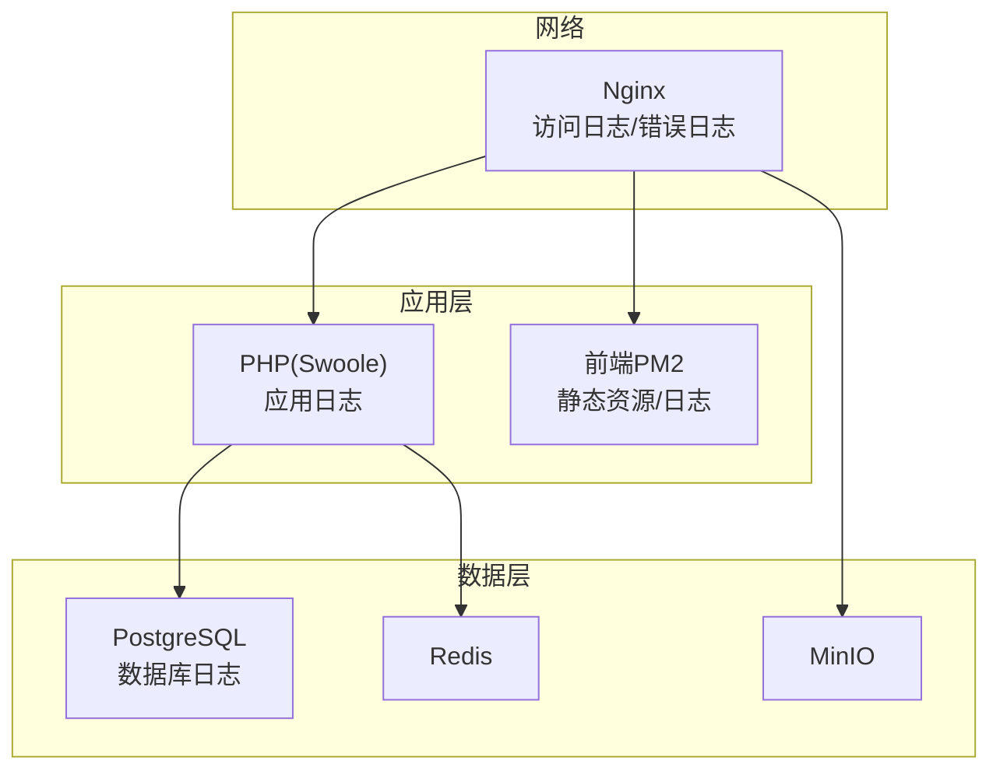
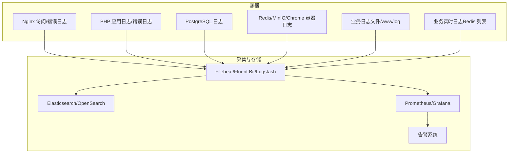
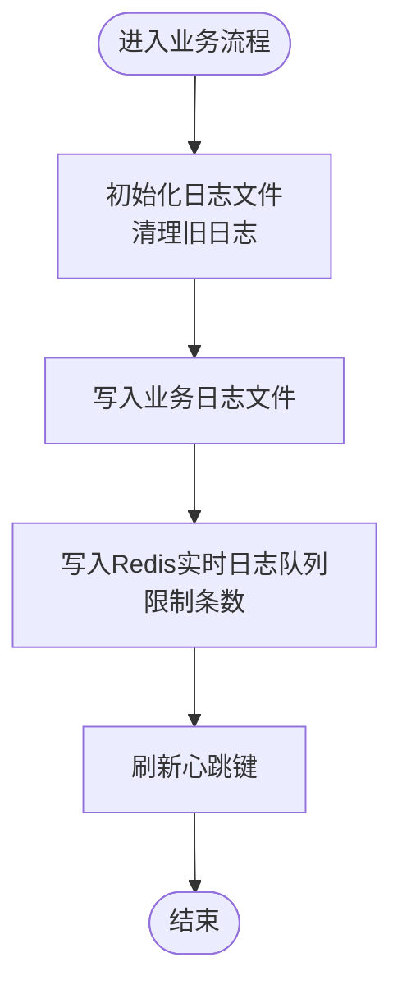
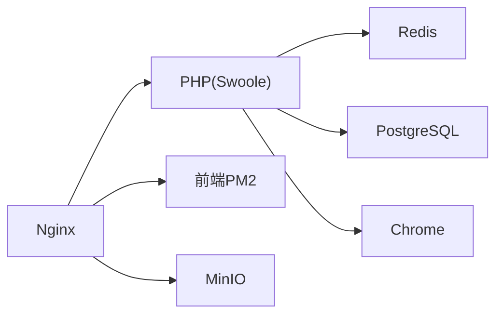

# 监控与日志管理

<cite>
**本文引用的文件**
- [docker-compose.yml](file://process/docker/docker-compose.yml)
- [nginx.conf](file://process/docker/services/nginx/nginx.conf)
- [php.ini](file://process/docker/services/php/php.ini)
- [php.ini（生产）](file://process/docker/services/php/php.prod/php.ini)
- [postgresql.conf](file://process/docker/services/postgres/postgresql.conf)
- [main.dev.yaml](file://process/src/config/main.dev.yaml)
- [process.dev.yaml](file://process/src/config/process.dev.yaml)
- [process.prod.yaml](file://process/src/config/process.prod.yaml)
- [PersonalSyncService.php](file://process/src/services/desktopManage/PersonalSyncService.php)
- [DataTableSync.php](file://process/src/services/task/DataTableSync.php)
- [migration_20240722_155345_alive_check_event.php](file://process/src/migrations/migration_20240722_155345_alive_check_event.php)
- [api.php](file://process/src/config/api.php)
</cite>

## 目录
1. [简介](#简介)
2. [项目结构](#项目结构)
3. [核心组件](#核心组件)
4. [架构总览](#架构总览)
5. [详细组件分析](#详细组件分析)
6. [依赖关系分析](#依赖关系分析)
7. [性能考虑](#性能考虑)
8. [故障排查指南](#故障排查指南)
9. [结论](#结论)
10. [附录](#附录)

## 简介
本文件面向 htdNew 项目的监控与日志管理，覆盖容器监控、Nginx 访问日志与错误日志、应用日志（PHP/Swoole）、数据库日志（PostgreSQL）、系统日志以及容器健康检查、性能指标采集与异常告警建议。同时给出日志轮转、存储管理与远程日志聚合思路，并提供监控仪表板配置与故障诊断、性能分析指南。

## 项目结构
htdNew 使用 Docker Compose 编排多服务：Nginx、PHP（Swoole）、PostgreSQL、Redis、Chrome、MinIO、前端 PM2 容器等。日志路径通过卷挂载集中到宿主机或容器内固定目录，便于统一采集与轮转。

图表来源
- [docker-compose.yml](file://process/docker/docker-compose.yml#L1-L150)
- [nginx.conf](file://process/docker/services/nginx/nginx.conf#L1-L127)

章节来源
- [docker-compose.yml](file://process/docker/docker-compose.yml#L1-L150)

## 核心组件
- 容器编排与日志挂载
  - Nginx 将访问日志与错误日志挂载到容器内固定路径，便于外部采集。
  - PHP 容器将运行时与日志目录挂载到容器外，便于持久化与采集。
  - PostgreSQL 通过卷挂载数据与配置，日志输出位置可由配置文件控制。
- 应用日志
  - PHP 错误日志与业务日志分别落盘；业务侧部分模块具备自定义日志文件与 Redis 实时日志队列能力。
- 中间件日志
  - Redis、MinIO、Chrome 容器的日志可通过 Docker 日志驱动采集。
- 健康检查与可观测性
  - 项目中存在“存活检查”事件迁移脚本，可用于构建健康检查触发链路。

章节来源
- [docker-compose.yml](file://process/docker/docker-compose.yml#L1-L150)
- [nginx.conf](file://process/docker/services/nginx/nginx.conf#L1-L127)
- [php.ini](file://process/docker/services/php/php.ini#L1-L152)
- [php.ini（生产）](file://process/docker/services/php/php.prod/php.ini#L1-L152)
- [postgresql.conf](file://process/docker/services/postgres/postgresql.conf#L348-L400)
- [PersonalSyncService.php](file://process/src/services/desktopManage/PersonalSyncService.php#L506-L607)
- [DataTableSync.php](file://process/src/services/task/DataTableSync.php#L510-L547)
- [migration_20240722_155345_alive_check_event.php](file://process/src/migrations/migration_20240722_155345_alive_check_event.php#L1-L23)

## 架构总览
下图展示日志流经 Nginx、PHP、PostgreSQL、Redis、MinIO 的路径与采集点位，以及业务侧日志落盘与 Redis 实时日志队列的写入路径。

图表来源
- [docker-compose.yml](file://process/docker/docker-compose.yml#L1-L150)
- [nginx.conf](file://process/docker/services/nginx/nginx.conf#L1-L127)
- [php.ini](file://process/docker/services/php/php.ini#L1-L152)
- [postgresql.conf](file://process/docker/services/postgres/postgresql.conf#L348-L400)
- [PersonalSyncService.php](file://process/src/services/desktopManage/PersonalSyncService.php#L506-L607)
- [DataTableSync.php](file://process/src/services/task/DataTableSync.php#L510-L547)

## 详细组件分析

### Nginx 日志配置
- 访问日志与错误日志
  - 访问日志采用 combined 格式并写入容器内固定路径，便于采集。
  - 错误日志单独配置级别，便于快速定位问题。
- 日志格式
  - 提供基础日志格式模板，可根据需要扩展字段。
- 采集建议
  - 使用 Filebeat/Fluent Bit 将容器内日志目录挂载到采集器，结合 Nginx 指标（如 stub_status）接入 Prometheus/Grafana。

章节来源
- [nginx.conf](file://process/docker/services/nginx/nginx.conf#L1-L127)

### PHP/Swoole 应用日志
- 错误日志
  - PHP 错误日志写入临时目录，便于与业务日志分离。
- 业务日志
  - 应用配置中定义了运行时与日志目录，业务侧日志统一落盘到该目录。
  - 部分服务实现了自定义日志文件与 Redis 实时日志队列，支持保留最近若干条日志，便于前端或监控侧实时查看。

图表来源
- [PersonalSyncService.php](file://process/src/services/desktopManage/PersonalSyncService.php#L506-L607)
- [DataTableSync.php](file://process/src/services/task/DataTableSync.php#L510-L547)

章节来源
- [main.dev.yaml](file://process/src/config/main.dev.yaml#L1-L97)
- [process.dev.yaml](file://process/src/config/process.dev.yaml#L1-L89)
- [process.prod.yaml](file://process/src/config/process.prod.yaml#L1-L80)
- [php.ini](file://process/docker/services/php/php.ini#L1-L152)
- [php.ini（生产）](file://process/docker/services/php/php.prod/php.ini#L1-L152)
- [PersonalSyncService.php](file://process/src/services/desktopManage/PersonalSyncService.php#L506-L607)
- [DataTableSync.php](file://process/src/services/task/DataTableSync.php#L510-L547)

### PostgreSQL 日志
- 日志配置
  - 通过配置文件控制日志级别、轮转策略与输出方式，支持按时间或大小轮转。
- 采集建议
  - 将日志目录挂载到采集器，结合数据库指标（如慢查询、连接数）接入监控系统。

章节来源
- [postgresql.conf](file://process/docker/services/postgres/postgresql.conf#L348-L400)

### Redis/MinIO/Chrome 日志
- Redis
  - 通过卷挂载配置与数据目录，日志输出位置可由配置文件控制。
- MinIO
  - 通过命令行参数开启 Web 控制台，日志输出位于容器内固定路径。
- Chrome
  - 容器内日志可通过 Docker 日志驱动采集。

章节来源
- [docker-compose.yml](file://process/docker/docker-compose.yml#L1-L150)

### 健康检查与存活事件
- 存活检查事件
  - 迁移脚本为“存活检查”类型的触发器补充了特定事件，可用于构建健康检查触发链路。
- 建议
  - 结合容器健康检查探针与业务级健康端点，形成多层健康保障。

章节来源
- [migration_20240722_155345_alive_check_event.php](file://process/src/migrations/migration_20240722_155345_alive_check_event.php#L1-L23)

### 性能指标与告警
- 指标采集
  - Nginx 提供状态页面，可用于导出请求量、连接数等指标。
  - PHP/Swoole 可通过扩展或中间件导出自定义指标。
  - PostgreSQL 可通过扩展或运维工具导出关键指标。
- 告警建议
  - 基于阈值与趋势检测建立告警规则，结合邮件/IM 推送通知。

章节来源
- [nginx.conf](file://process/docker/services/nginx/nginx.conf#L1-L127)
- [api.php](file://process/src/config/api.php#L384-L803)

## 依赖关系分析
- 容器依赖
  - PHP 依赖 Redis、PostgreSQL、Chrome；Nginx 依赖 PHP、前端、MinIO。
- 日志依赖
  - Nginx、PHP、PostgreSQL、Redis、MinIO 的日志输出路径由各自配置决定；业务日志通过应用配置与卷挂载统一管理。
- 采集依赖
  - 采集器依赖容器日志目录挂载与网络可达性。

图表来源
- [docker-compose.yml](file://process/docker/docker-compose.yml#L1-L150)

章节来源
- [docker-compose.yml](file://process/docker/docker-compose.yml#L1-L150)

## 性能考虑
- Nginx
  - 已启用高并发参数与缓存配置，建议结合压测评估并发上限与瓶颈。
- PHP
  - 生产环境调整了错误显示与内存限制，建议配合 PHP-FPM/OPcache 优化。
- PostgreSQL
  - 建议根据业务峰值调优连接数、共享缓冲区与日志级别。
- 日志
  - 业务侧日志写入 Redis 列表时注意内存占用与过期策略，避免阻塞主流程。

## 故障排查指南
- Nginx
  - 检查访问/错误日志定位 5xx/4xx 与超时问题；确认上游 Swoole 是否正常响应。
- PHP
  - 查看 PHP 错误日志与业务日志文件；确认运行时与日志目录权限。
- PostgreSQL
  - 检查日志级别与轮转策略；关注慢查询与连接数异常。
- Redis/MinIO/Chrome
  - 通过容器日志定位启动与运行异常；确认卷挂载与端口映射。
- 业务日志
  - 若使用 Redis 实时日志队列，检查列表长度与过期键；确认心跳刷新是否成功。

章节来源
- [nginx.conf](file://process/docker/services/nginx/nginx.conf#L1-L127)
- [php.ini](file://process/docker/services/php/php.ini#L1-L152)
- [postgresql.conf](file://process/docker/services/postgres/postgresql.conf#L348-L400)
- [PersonalSyncService.php](file://process/src/services/desktopManage/PersonalSyncService.php#L506-L607)
- [DataTableSync.php](file://process/src/services/task/DataTableSync.php#L510-L547)

## 结论
htdNew 的日志与监控体系以容器编排为基础，通过 Nginx、PHP、PostgreSQL、Redis、MinIO、Chrome 的日志输出与统一卷挂载，为后续接入采集器与监控系统提供了清晰路径。建议尽快落地日志轮转与远程聚合方案，完善健康检查与性能指标采集，并建立基于阈值与趋势的告警机制，以提升整体可观测性与稳定性。

## 附录
- 日志轮转与存储管理
  - Nginx/PHP/PostgreSQL 均支持按时间/大小轮转；建议结合 logrotate 或容器内置轮转策略，定期归档与清理。
- 远程日志聚合
  - 使用 Filebeat/Fluent Bit 将容器日志目录挂载到采集器，统一发送至 Elasticsearch/OpenSearch 或 Loki。
- 监控仪表板配置
  - 基于 Nginx 状态、PHP 指标、PostgreSQL 指标与业务 Redis 实时日志，构建 Grafana 仪表板。
- 健康检查与告警
  - 结合存活检查事件与容器健康探针，建立多层健康保障；配置 Prometheus 报警规则与告警通道。