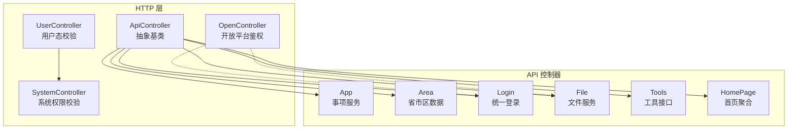
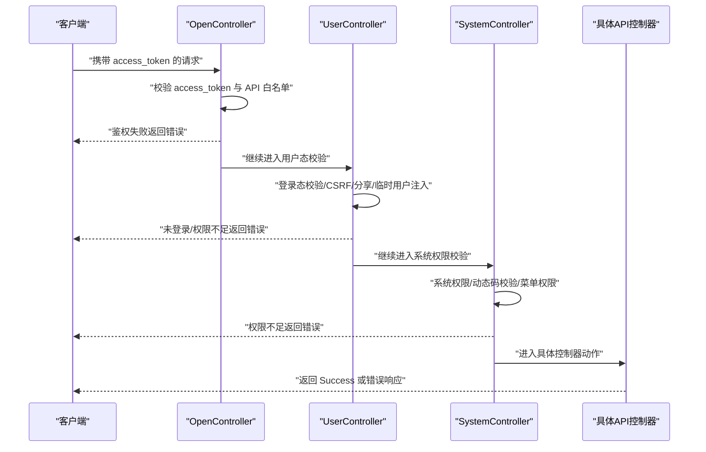
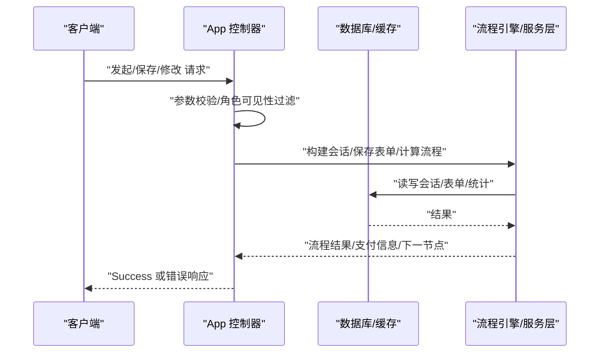
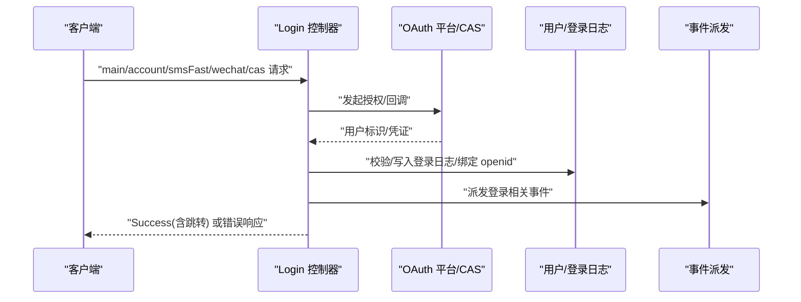
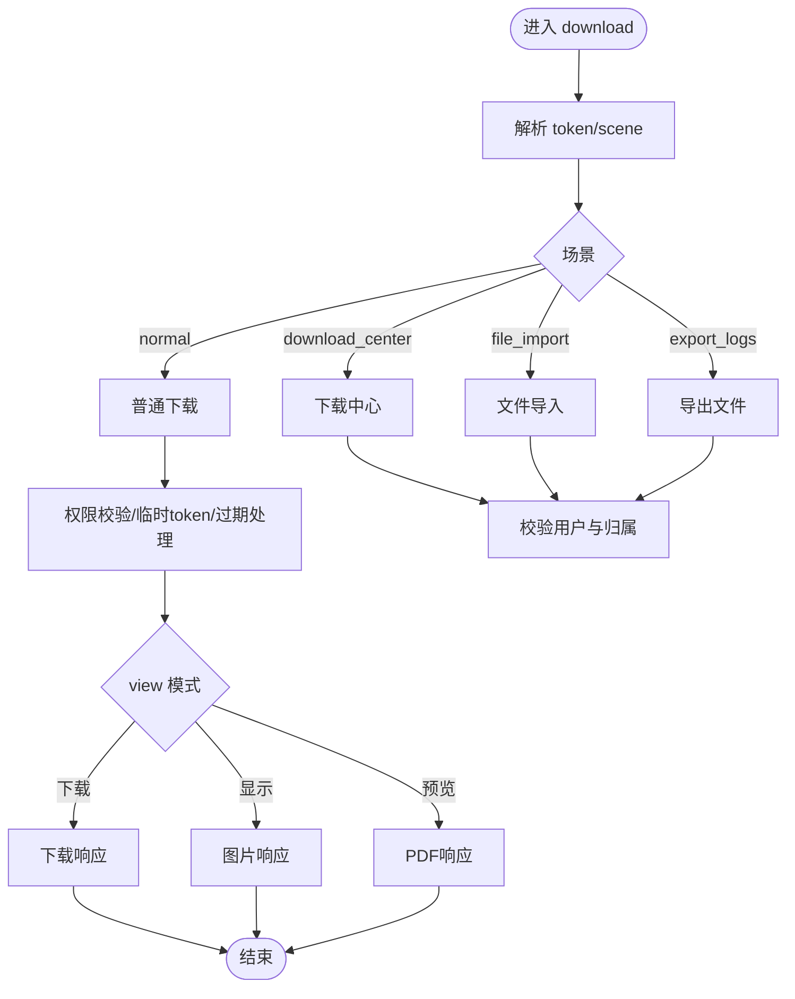
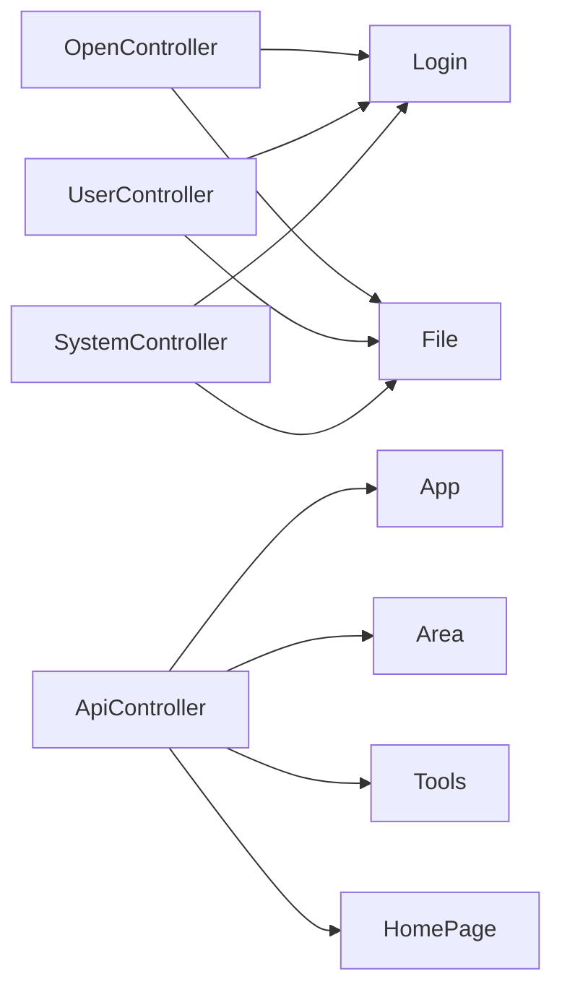

# API 控制器

<cite>
**本文引用的文件**
- [ApiController.php](file://process/src/http/ApiController.php)
- [UserController.php](file://process/src/http/UserController.php)
- [SystemController.php](file://process/src/http/SystemController.php)
- [OpenController.php](file://process/src/http/OpenController.php)
- [App.php](file://process/src/http/api/App.php)
- [Area.php](file://process/src/http/api/Area.php)
- [Login.php](file://process/src/http/api/Login.php)
- [File.php](file://process/src/http/api/File.php)
- [Tools.php](file://process/src/http/api/Tools.php)
- [HomePage.php](file://process/src/http/api/HomePage.php)
- [api.php](file://process/src/config/api.php)
</cite>

## 目录
1. [简介](#简介)
2. [项目结构](#项目结构)
3. [核心组件](#核心组件)
4. [架构总览](#架构总览)
5. [详细组件分析](#详细组件分析)
6. [依赖分析](#依赖分析)
7. [性能考虑](#性能考虑)
8. [故障排查指南](#故障排查指南)
9. [结论](#结论)
10. [附录](#附录)

## 简介
本文件面向 htdNew 项目的 API 控制器体系，系统化梳理 App、Area、Login、File、Tools、HomePage 等核心控制器的设计理念与实现机制，覆盖 RESTful 规范、参数校验、响应格式、错误处理、认证授权、权限控制与安全防护等主题，并给出接口调用示例、参数说明与返回值格式指引，同时总结 API 版本管理、速率限制与性能优化的最佳实践。

## 项目结构
- 控制器基类与继承关系
  - ApiController：所有 API 控制器的抽象基类，统一扩展点。
  - UserController：通用用户态控制器，负责登录态校验、CSRF 基础防护、分享/临时下载用户注入等。
  - SystemController：系统级控制器，继承 UserController，增加系统权限校验与动态码校验。
  - OpenController：开放平台控制器基类，负责开发者接入、access_token 校验、API 权限白名单、请求日志等。
- API 控制器
  - App：事项服务相关接口（列表、详情、发起、保存、修改、OA 工作台、分类热门、节点映射等）。
  - Area：省市区数据配置与重建。
  - Login：统一登录入口、账户密码登录、短信登录、邮箱登录、CAS 回调、微信授权回调、二次验证扫码等。
  - File：文件上传（含分片合并）、下载/显示/预览、权限校验、临时令牌、下载限制与水印等。
  - Tools：调试与辅助工具接口（头部透传、文件校验、统计数据、个人表初始化等）。
  - HomePage：首页聚合数据（组件化返回、关键字搜索、通知公告、热门服务、待办/已处理、收藏、数据总览等）。

图表来源
- [ApiController.php](file://process/src/http/ApiController.php#L1-L9)
- [UserController.php](file://process/src/http/UserController.php#L1-L186)
- [SystemController.php](file://process/src/http/SystemController.php#L1-L95)
- [OpenController.php](file://process/src/http/OpenController.php#L1-L209)
- [App.php](file://process/src/http/api/App.php#L1-L1125)
- [Area.php](file://process/src/http/api/Area.php#L1-L51)
- [Login.php](file://process/src/http/api/Login.php#L1-L1896)
- [File.php](file://process/src/http/api/File.php#L1-L751)
- [Tools.php](file://process/src/http/api/Tools.php#L1-L263)
- [HomePage.php](file://process/src/http/api/HomePage.php#L1-L1159)

章节来源
- [ApiController.php](file://process/src/http/ApiController.php#L1-L9)
- [UserController.php](file://process/src/http/UserController.php#L1-L186)
- [SystemController.php](file://process/src/http/SystemController.php#L1-L95)
- [OpenController.php](file://process/src/http/OpenController.php#L1-L209)

## 核心组件
- ApiController
  - 作为所有 API 控制器的抽象基类，提供统一的扩展点与约定。
- UserController
  - 登录态校验、CSRF 基础防护、分享/临时下载用户注入、统一异常处理。
- SystemController
  - 在 UserController 基础上，增加系统权限校验与动态码校验。
- OpenController
  - 开放平台接入，access_token 校验、API 白名单、日志记录、开发者信息注入。

章节来源
- [ApiController.php](file://process/src/http/ApiController.php#L1-L9)
- [UserController.php](file://process/src/http/UserController.php#L1-L186)
- [SystemController.php](file://process/src/http/SystemController.php#L1-L95)
- [OpenController.php](file://process/src/http/OpenController.php#L1-L209)

## 架构总览
- 请求生命周期
  - OpenController.beforeAction：开放平台鉴权（access_token、API 白名单、app_id 校验、日志记录）。
  - UserController.beforeAction：登录态校验、CSRF 基础防护、分享/临时下载用户注入。
  - SystemController.beforeAction：系统权限校验（校外用户拦截、动态码校验、菜单权限）。
  - 控制器具体动作：执行业务逻辑，返回 Success 或相应错误响应。
- 数据流与事件
  - 文件下载/显示/预览：触发解密事件，支持按场景切换下载/在线预览/图片缩略。
  - 登录流程：多平台 OAuth、CAS 回调、第三方平台登录、事件派发。
  - 事项发起/保存/修改：事务封装、权限校验、流程引擎集成、事件派发。

图表来源
- [OpenController.php](file://process/src/http/OpenController.php#L177-L208)
- [UserController.php](file://process/src/http/UserController.php#L51-L90)
- [SystemController.php](file://process/src/http/SystemController.php#L17-L23)
- [File.php](file://process/src/http/api/File.php#L287-L403)
- [Login.php](file://process/src/http/api/Login.php#L1-L200)

## 详细组件分析

### App 控制器
- 设计理念
  - 以“事项”为中心的服务编排，提供事项列表、详情、发起、保存、修改、OA 工作台、分类热门、节点映射、评分计算等能力。
  - 严格的角色可见性与禁用角色过滤，支持访客模式与登录态差异。
- 核心接口
  - 列表与筛选：支持按部门、分类、身份、关键词、排序等条件筛选；支持模板模式与分类排序。
  - 详情：统计、属性、部门、身份、流程 SVG、访问量统计等。
  - 发起与保存：表单数据校验、步骤动作、临时保存、支付信息、下一节点分配。
  - 修改：支持多种场景（修改、申请人修改），权限校验与表单保存。
  - OA 工作台与分类热门：按分类聚合事项，支持缓存与排序。
  - 节点映射：根据流程模块版本映射用户任务节点。
  - 评分计算：对接第三方平台，按规则计算得分。
- 参数与返回
  - 列表接口支持分页与排序键（最热/最新/最近使用/分类排序），返回 total 与 list。
  - 详情接口返回事项基础信息、统计、属性、流程 SVG、跳转配置等。
  - 发起/保存接口返回会话 ID、下一步节点或支付信息。
  - 修改接口返回空成功。
- 错误处理
  - 未登录、无权限、重复请求、不在服务时间范围、应用未发布等均抛出用户异常或返回错误响应。

图表来源
- [App.php](file://process/src/http/api/App.php#L230-L445)
- [App.php](file://process/src/http/api/App.php#L614-L806)
- [App.php](file://process/src/http/api/App.php#L808-L876)
- [App.php](file://process/src/http/api/App.php#L883-L956)
- [App.php](file://process/src/http/api/App.php#L959-L1010)
- [App.php](file://process/src/http/api/App.php#L1012-L1029)
- [App.php](file://process/src/http/api/App.php#L1031-L1124)

章节来源
- [App.php](file://process/src/http/api/App.php#L1-L1125)

### Area 控制器
- 功能概述
  - 提供省市区数据配置文件的读取与重建能力，支持从 region.json 生成 PHP 数组配置。
- 接口
  - index：返回配置数组。
  - rebuild：读取 region.json，递归构建父子结构，输出 PHP 配置文件。

章节来源
- [Area.php](file://process/src/http/api/Area.php#L1-L51)

### Login 控制器
- 设计理念
  - 统一登录入口，支持多平台 OAuth、CAS 回调、账户密码登录、短信/邮箱快速登录、微信授权回调、二次验证扫码等。
  - 事件驱动：登录前后派发全局事件，便于扩展与审计。
- 核心流程
  - main：根据设备与 redirect_url 决定 OAuth 平台，支持强制 OAuth 与微信端强制 OAuth。
  - account：账户密码登录，参数校验、验证码校验、失败次数限制、登录日志、4.0 平台融合登录。
  - sms/smsFast/emailFast：短信/邮箱登录与快速注册。
  - cas：CAS 回调，异常容错与二次登录处理。
  - wechat：微信授权登录，支持服务号与普通平台，首次登录引导绑定。
  - twoFactor：二次验证扫码，强制授权。
- 参数与返回
  - account：username/password/captcha/redirect_url。
  - smsFast：mobile/code/name/idcard/redirect_url。
  - cas：redirect_url/platform_id/ticket。
  - wechat：id/code/hook/redirect_url/isService/question_id。
  - 返回统一 Success 或错误响应，包含跳转地址与用户标识。

图表来源
- [Login.php](file://process/src/http/api/Login.php#L42-L106)
- [Login.php](file://process/src/http/api/Login.php#L129-L227)
- [Login.php](file://process/src/http/api/Login.php#L305-L363)
- [Login.php](file://process/src/http/api/Login.php#L366-L466)
- [Login.php](file://process/src/http/api/Login.php#L537-L673)
- [Login.php](file://process/src/http/api/Login.php#L695-L799)

章节来源
- [Login.php](file://process/src/http/api/Login.php#L1-L1896)

### File 控制器
- 设计理念
  - 文件上传（单文件/分片合并）、下载/显示/预览、权限校验、临时令牌、下载限制与水印等。
  - 通过事件钩子支持内容解密与属性扩展。
- 核心流程
  - upPiece/merge：分片上传与合并。
  - doUp/createModel：文件校验、压缩、PDF 风险扫描、AI 上传、过期时间设置。
  - down：按场景切换下载/显示/预览，权限校验与过期处理。
  - getTempToken/downloadByToken：临时令牌免密下载。
  - fileLimitation：下载次数限制与 PDF 水印。
- 参数与返回
  - upPiece/merge：keys/file_name。
  - doUp：file_name/src_path/max_size/compress_*。
  - down：token/view/scene/file_name/temporary_user。
  - fileLimitation：sess_id/widget/token/download_limit/is_watermark/watermark_config。
  - 返回 Success 或状态页响应。

图表来源
- [File.php](file://process/src/http/api/File.php#L287-L403)
- [File.php](file://process/src/http/api/File.php#L405-L424)
- [File.php](file://process/src/http/api/File.php#L426-L496)
- [File.php](file://process/src/http/api/File.php#L507-L578)
- [File.php](file://process/src/http/api/File.php#L580-L590)
- [File.php](file://process/src/http/api/File.php#L599-L750)

章节来源
- [File.php](file://process/src/http/api/File.php#L1-L751)

### Tools 控制器
- 功能概述
  - 头部透传、微信/文本文件校验、统计数据、个人表初始化校验等。
- 接口
  - header：返回请求头。
  - mpVerify/txtVerify：静态文件校验返回。
  - statistics：触发统计数据任务。
  - testPersonaltableinit：个人表初始化校验。
- 参数与返回
  - header：无参数，返回请求头。
  - mpVerify/txtVerify：file 路径参数，返回校验值。
  - statistics：tag 参数，返回序列化任务对象。
  - testPersonaltableinit：无参数，返回校验结果。

章节来源
- [Tools.php](file://process/src/http/api/Tools.php#L1-L263)

### HomePage 控制器
- 设计理念
  - 首页组件化聚合，支持待办、申请、已处理、共享已处理、最近办理、消息、专题服务、教师学生、热门服务、通知公告、系统直通车、地址、数据总览、收藏、服务大厅配置、轮播图、关键字、首页配置、二维码、我的评价、我的反馈、我的知会、我的支付、代申请、我的填报等。
- 核心流程
  - details：根据 item 列表动态调用各组件方法，按设备类型兼容。
  - 各组件方法：getTodo/getInst/getTaskFinished/getShareTaskFinished/getRecently/getMessage/getZtfw/getJxf/getHotService/getMessageNotify/getMessageNotifyOa/getXtztv/getAddress/getDataOverview/getFwdt/getVisitorStatus/commentSetting/getFill 等。
- 参数与返回
  - details：item 数组，返回各组件聚合数据。
  - 各组件方法：按需返回 data 与 total。

章节来源
- [HomePage.php](file://process/src/http/api/HomePage.php#L466-L495)
- [HomePage.php](file://process/src/http/api/HomePage.php#L564-L821)
- [HomePage.php](file://process/src/http/api/HomePage.php#L823-L1159)

## 依赖分析
- 控制器间依赖
  - App/Tools/HomePage 均继承 ApiController，复用统一扩展点。
  - Login/File 继承 ApiController，但通过 OpenController 实现开放平台鉴权。
  - UserController/SystemController 提供用户态与系统态的前置校验。
- 外部依赖
  - 第三方平台（OAuth/CAS/AIGC/4.0 平台）通过平台模型与事件派发集成。
  - 存储层：文件存储、Redis 缓存、数据库。
  - 事件系统：全局事件派发器用于登录、文件内容解密、登录到 4.0 平台等。

图表来源
- [OpenController.php](file://process/src/http/OpenController.php#L1-L209)
- [UserController.php](file://process/src/http/UserController.php#L1-L186)
- [SystemController.php](file://process/src/http/SystemController.php#L1-L95)
- [ApiController.php](file://process/src/http/ApiController.php#L1-L9)
- [Login.php](file://process/src/http/api/Login.php#L1-L1896)
- [File.php](file://process/src/http/api/File.php#L1-L751)
- [App.php](file://process/src/http/api/App.php#L1-L1125)
- [Area.php](file://process/src/http/api/Area.php#L1-L51)
- [Tools.php](file://process/src/http/api/Tools.php#L1-L263)
- [HomePage.php](file://process/src/http/api/HomePage.php#L1-L1159)

## 性能考虑
- 缓存策略
  - App 列表与分类热门使用 Redis 缓存，降低查询压力。
  - 首页关键字与热门词采用 Redis 缓存，定时刷新。
- 分页与排序
  - 列表接口使用分页与排序键，避免一次性加载大量数据。
- 事务与一致性
  - 发起/保存/修改等关键流程使用数据库事务，保证一致性。
- 事件与异步
  - 登录到 4.0 平台、文件内容解密等通过事件派发，避免阻塞主流程。
- 速率限制
  - 文件下载限制接口使用 Redis NX EX 控制频率，防止刷取。
- 存储与压缩
  - 图片上传支持压缩，PDF 风险扫描，减少恶意文件风险与存储成本。

[本节为通用指导，无需列出具体文件来源]

## 故障排查指南
- 登录相关
  - 账户密码登录失败：检查验证码、失败次数限制、登录日志。
  - CAS 回调异常：检查 ticket、URL 参数、异常容错与重定向。
  - 微信授权登录：确认 openid 绑定、服务号关注状态、首次登录引导。
- 文件相关
  - 下载权限不足：检查文件保护级别、会话权限、分享/临时用户注入。
  - 分片合并失败：检查 keys 格式、存储可用性、临时文件清理。
  - PDF 水印失败：检查水印配置、源文件路径、临时文件复制。
- 事项相关
  - 发起/保存/修改失败：检查会话互斥、权限校验、流程引擎异常。
  - 列表无数据：检查可见性过滤、禁用角色过滤、访客模式配置。
- 系统权限
  - 校外用户访问受限：检查系统权限配置与动态码校验。
  - 菜单权限不足：检查用户菜单权限与超级管理员判定。

章节来源
- [Login.php](file://process/src/http/api/Login.php#L129-L227)
- [Login.php](file://process/src/http/api/Login.php#L305-L363)
- [Login.php](file://process/src/http/api/Login.php#L366-L466)
- [Login.php](file://process/src/http/api/Login.php#L537-L673)
- [Login.php](file://process/src/http/api/Login.php#L695-L799)
- [File.php](file://process/src/http/api/File.php#L287-L403)
- [File.php](file://process/src/http/api/File.php#L599-L750)
- [App.php](file://process/src/http/api/App.php#L614-L806)
- [SystemController.php](file://process/src/http/SystemController.php#L17-L94)

## 结论
htdNew 项目的 API 控制器体系以清晰的继承层次与职责划分为基础，结合统一的鉴权与前置校验机制，实现了登录态、系统权限、开放平台接入与文件服务等多维度的安全与稳定性保障。通过组件化首页聚合、事件驱动与缓存策略，兼顾了易用性与性能。建议在后续迭代中进一步完善 API 版本管理、速率限制策略与可观测性指标，持续提升系统的可维护性与可扩展性。

[本节为总结性内容，无需列出具体文件来源]

## 附录

### RESTful 设计规范与最佳实践
- 资源命名
  - 使用名词复数形式，如 /api/app/items、/api/file/upload。
- HTTP 方法
  - GET：查询列表与详情；POST：创建/发起；PUT/PATCH：更新；DELETE：删除。
- 状态码
  - 成功：200；创建：201；无内容：204；参数错误：400；未授权：401；权限不足：403；资源不存在：404；服务器错误：500。
- 分页与排序
  - 使用 offset/limit 或 page/size；排序键支持 sort_key/sort_rule。
- 参数校验
  - 必填参数必须校验；类型与范围校验；敏感参数脱敏记录。
- 响应格式
  - 统一 Success 包裹数据，错误使用 TextError 或状态页。
- 版本管理
  - 通过路径或 Header 管理版本，如 /api/v1/...；保持向后兼容。
- 速率限制
  - 基于 IP/用户/接口维度进行限流，使用 Redis 计数与过期控制。
- 日志与追踪
  - 记录请求头、参数摘要、耗时与错误堆栈；为每个请求生成唯一 trace_id。

[本节为通用指导，无需列出具体文件来源]

### 认证授权与安全防护
- 认证
  - 用户态：基于 Cookie/Session 的登录态校验。
  - 开放平台：access_token 校验与 API 白名单。
  - 动态码：UA/IP/时间戳组合校验，防重放与跨域滥用。
- 授权
  - 角色可见性与禁用角色过滤；系统权限（校外用户拦截）；菜单权限与超级管理员判定。
- 安全
  - CSRF 基础防护（Referer 校验与白名单）；敏感操作二次确认；文件风险扫描与水印；临时令牌免密下载。
- 审计
  - 登录日志、操作日志、事件派发，支持回溯与统计。

章节来源
- [OpenController.php](file://process/src/http/OpenController.php#L177-L208)
- [UserController.php](file://process/src/http/UserController.php#L51-L90)
- [SystemController.php](file://process/src/http/SystemController.php#L17-L94)
- [File.php](file://process/src/http/api/File.php#L287-L403)

### 接口调用示例与参数说明
- App 列表
  - 方法：GET /api/app/list
  - 查询参数：offset、limit、sort_key(desc/asc)、departItem、categoryItem、identityItem、name、entrance(visitant)、template
  - 返回：total、list
- App 详情
  - 方法：GET /api/app/detail
  - 查询参数：app_id、sess_id、is_test
  - 返回：事项详情、统计、属性、流程 SVG、跳转配置等
- App 发起/保存
  - 方法：POST /api/app/save
  - 请求体：form_data(step_action,temp_save)、sess_id、app_version_id、quest_id、load_time
  - 返回：id、events、下一步/支付信息/下一节点
- Login 统一入口
  - 方法：GET /api/login/main
  - 查询参数：redirect_url、force、wechat_force
  - 返回：重定向或登录状态
- File 上传/下载
  - 方法：POST /api/file/up
  - 请求体：upfile、max_size、compress_width、compress_height、to_ai、file_deadline_time
  - 返回：name、token
  - 方法：GET /api/file/down
  - 查询参数：token、view(download/show/preview)、scene(normal/download_center/file_import/export_logs)、file_name、temporary_user
  - 返回：文件流或状态页
- HomePage 组件
  - 方法：GET /api/homepage/details
  - 查询参数：item(多个组件名)
  - 返回：各组件聚合数据

章节来源
- [App.php](file://process/src/http/api/App.php#L230-L445)
- [App.php](file://process/src/http/api/App.php#L614-L806)
- [Login.php](file://process/src/http/api/Login.php#L42-L106)
- [File.php](file://process/src/http/api/File.php#L94-L161)
- [File.php](file://process/src/http/api/File.php#L287-L403)
- [HomePage.php](file://process/src/http/api/HomePage.php#L466-L495)

### 开放平台 API 白名单与接入
- 白名单来源：开放平台 API 配置文件，按环境与接口维度管理。
- 接入流程：开发者注册、获取 access_token、按白名单调用接口、日志记录与限额控制。

章节来源
- [OpenController.php](file://process/src/http/OpenController.php#L1-L209)
- [api.php](file://process/src/config/api.php#L1-L913)