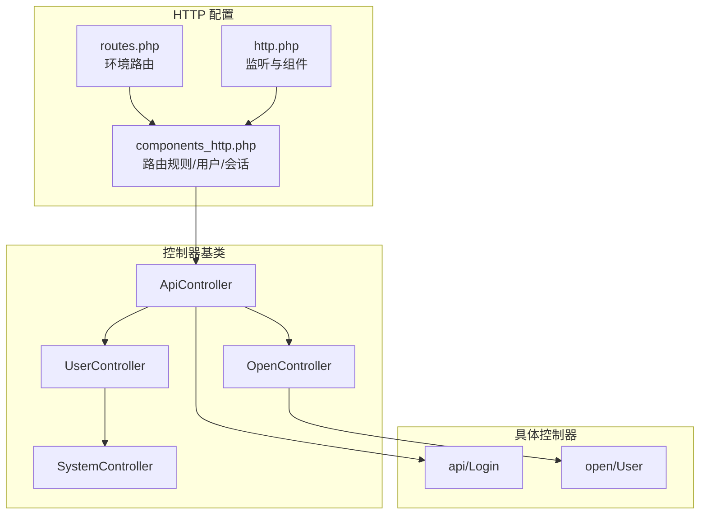
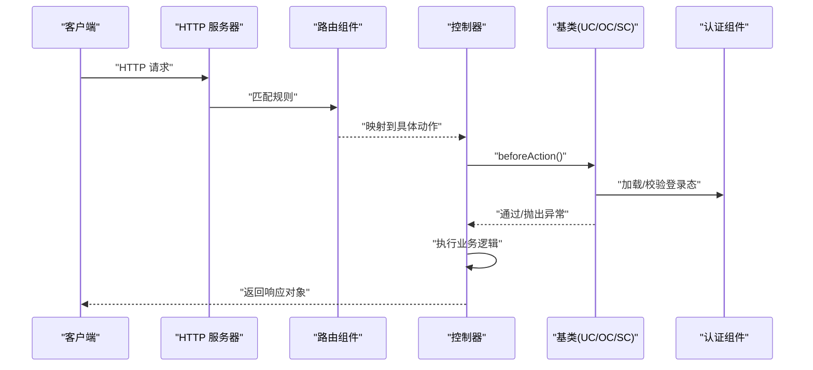
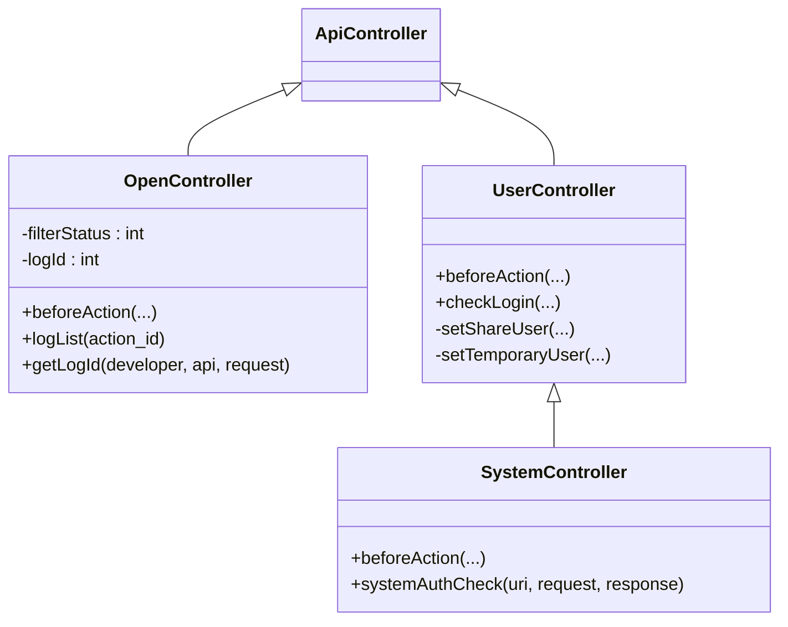
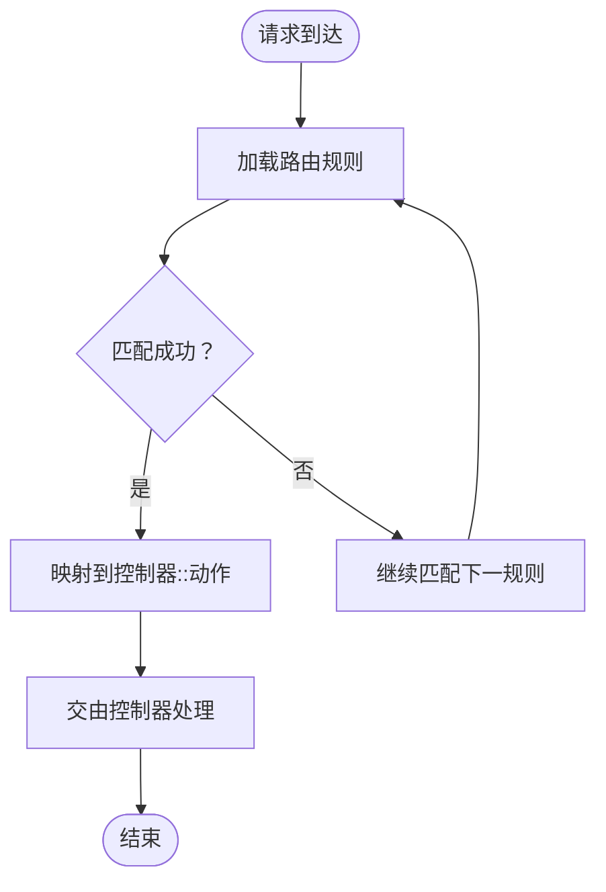
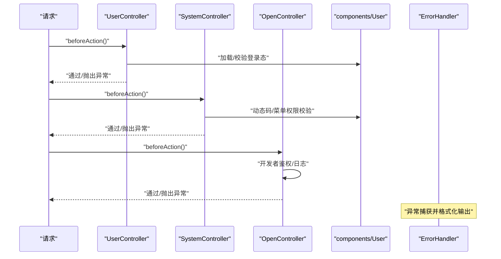
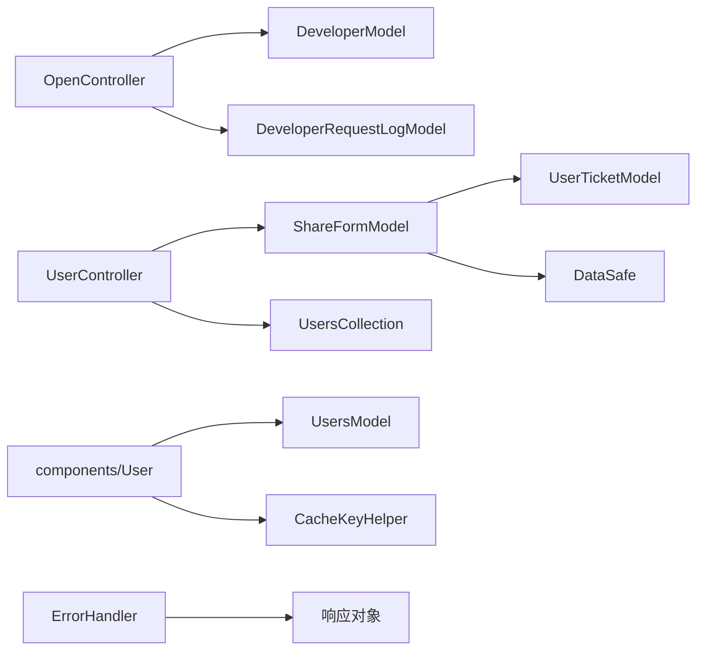

# HTTP 服务层

<cite>
**本文引用的文件**
- [ApiController.php](file://process/src/http/ApiController.php)
- [OpenController.php](file://process/src/http/OpenController.php)
- [UserController.php](file://process/src/http/UserController.php)
- [SystemController.php](file://process/src/http/SystemController.php)
- [Login.php](file://process/src/http/api/Login.php)
- [User.php](file://process/src/http/open/User.php)
- [routes.php](file://process/src/config/routes.php)
- [http.php](file://process/src/config/http.php)
- [components_http.php](file://process/src/config/components_http.php)
- [ErrorHandler.php](file://process/src/components/ErrorHandler.php)
- [User.php](file://process/src/components/User.php)
</cite>

## 目录
1. [简介](#简介)
2. [项目结构](#项目结构)
3. [核心组件](#核心组件)
4. [架构总览](#架构总览)
5. [组件详解](#组件详解)
6. [依赖关系分析](#依赖关系分析)
7. [性能与安全](#性能与安全)
8. [故障排查指南](#故障排查指南)
9. [结论](#结论)
10. [附录：接口与最佳实践](#附录接口与最佳实践)

## 简介
本文件面向 htdNew 项目的 HTTP 服务层，系统化梳理控制器架构设计、路由与中间件处理流程、请求/响应处理管道、RESTful 规范与参数校验、错误处理策略、认证授权、跨域与安全防护，并提供接口调用示例与最佳实践建议。读者无需深入底层即可理解各模块职责与协作方式。

## 项目结构
HTTP 服务层位于 process/src/http 目录，按功能域划分为：
- api：对外统一 API（如登录、工具等）
- open：开放接口（第三方接入）
- system：系统后台管理
- site：站点前端交互（与用户控制器联动）

路由规则由配置驱动，采用正则与命名空间映射，结合环境定制路由文件。

**图表来源**
- [routes.php](file://process/src/config/routes.php#L1-L4)
- [http.php](file://process/src/config/http.php#L1-L27)
- [components_http.php](file://process/src/config/components_http.php#L1-L33)
- [ApiController.php](file://process/src/http/ApiController.php#L1-L9)
- [UserController.php](file://process/src/http/UserController.php#L1-L186)
- [SystemController.php](file://process/src/http/SystemController.php#L1-L95)
- [OpenController.php](file://process/src/http/OpenController.php#L1-L209)
- [Login.php](file://process/src/http/api/Login.php#L1-L800)
- [User.php](file://process/src/http/open/User.php#L1-L227)

**章节来源**
- [routes.php](file://process/src/config/routes.php#L1-L4)
- [http.php](file://process/src/config/http.php#L1-L27)
- [components_http.php](file://process/src/config/components_http.php#L1-L33)

## 核心组件
- 控制器基类
  - ApiController：对外 API 的抽象基类，继承通用控制器框架。
  - OpenController：开放接口基类，内置开发者鉴权、访问日志与权限校验。
  - UserController：用户态基类，负责登录态检查、分享/临时下载场景、CSRF 简易校验。
  - SystemController：系统后台基类，在 UserController 基础上追加动态码/菜单权限校验。
- 认证组件
  - components/User：统一登录态加载、校验、Cookie 颁发与刷新、登出清理、跨平台票据联动。
- 错误处理
  - components/ErrorHandler：数据库异常聚合与系统错误响应。

**章节来源**
- [ApiController.php](file://process/src/http/ApiController.php#L1-L9)
- [OpenController.php](file://process/src/http/OpenController.php#L1-L209)
- [UserController.php](file://process/src/http/UserController.php#L1-L186)
- [SystemController.php](file://process/src/http/SystemController.php#L1-L95)
- [User.php](file://process/src/components/User.php#L1-L429)
- [ErrorHandler.php](file://process/src/components/ErrorHandler.php#L1-L26)

## 架构总览
HTTP 请求从监听层进入，经由路由规则解析到具体控制器动作；控制器在 beforeAction 中完成鉴权与前置校验，随后执行业务逻辑并返回标准化响应对象。

**图表来源**
- [components_http.php](file://process/src/config/components_http.php#L1-L33)
- [UserController.php](file://process/src/http/UserController.php#L51-L90)
- [OpenController.php](file://process/src/http/OpenController.php#L177-L208)
- [SystemController.php](file://process/src/http/SystemController.php#L17-L23)
- [User.php](file://process/src/components/User.php#L100-L155)

## 组件详解

### 控制器架构设计
- ApiController
  - 作为对外 API 的抽象基类，统一继承框架控制器能力。
- OpenController
  - 提供开放接口统一鉴权与日志记录能力，支持 access_token 校验、API 权限白名单校验、app_id 限制与请求日志写入。
- UserController
  - 统一登录态校验、分享/临时下载场景注入、CSRF 简易校验（Referer 白名单）。
- SystemController
  - 在用户态基础上，追加动态码校验、菜单权限与超级管理员放行逻辑。

**图表来源**
- [ApiController.php](file://process/src/http/ApiController.php#L1-L9)
- [OpenController.php](file://process/src/http/OpenController.php#L1-L209)
- [UserController.php](file://process/src/http/UserController.php#L1-L186)
- [SystemController.php](file://process/src/http/SystemController.php#L1-L95)

**章节来源**
- [OpenController.php](file://process/src/http/OpenController.php#L13-L208)
- [UserController.php](file://process/src/http/UserController.php#L22-L186)
- [SystemController.php](file://process/src/http/SystemController.php#L17-L94)

### 路由配置机制
- 路由规则由 components_http.php 中的 route 组件定义，支持：
  - 环境优先级路由（envs/http/*）
  - 通用 http/* 命名空间映射
  - 短链、文件下载、校验文件等特殊路径
  - 自定义路由合并（ENVS_PATH/routes.php）
- 监听与组件由 http.php 提供，包含监听地址、端口、组件合并与错误处理器。

**图表来源**
- [components_http.php](file://process/src/config/components_http.php#L1-L33)
- [routes.php](file://process/src/config/routes.php#L1-L4)
- [http.php](file://process/src/config/http.php#L1-L27)

**章节来源**
- [components_http.php](file://process/src/config/components_http.php#L1-L33)
- [http.php](file://process/src/config/http.php#L1-L27)
- [routes.php](file://process/src/config/routes.php#L1-L4)

### 中间件处理流程与请求/响应管道
- beforeAction：在每个动作执行前统一处理登录态、鉴权、日志与 CSRF 校验。
- 认证组件：components/User 在初始化阶段加载登录态，校验 Cookie 与 Redis Salt，必要时颁发/刷新 Cookie。
- 错误处理：统一由 ErrorHandler 拦截数据库异常并返回系统错误响应。

**图表来源**
- [UserController.php](file://process/src/http/UserController.php#L51-L90)
- [SystemController.php](file://process/src/http/SystemController.php#L17-L94)
- [OpenController.php](file://process/src/http/OpenController.php#L177-L208)
- [User.php](file://process/src/components/User.php#L100-L155)
- [ErrorHandler.php](file://process/src/components/ErrorHandler.php#L1-L26)

**章节来源**
- [UserController.php](file://process/src/http/UserController.php#L51-L90)
- [SystemController.php](file://process/src/http/SystemController.php#L17-L94)
- [OpenController.php](file://process/src/http/OpenController.php#L177-L208)
- [User.php](file://process/src/components/User.php#L100-L155)
- [ErrorHandler.php](file://process/src/components/ErrorHandler.php#L1-L26)

### RESTful API 设计规范与参数校验
- 统一返回：控制器返回标准化响应对象（Success、TextError、OpenApiError 等），避免直接输出原始数据。
- 参数校验：控制器内对必填字段进行显式校验，异常抛出统一异常类型，便于错误处理组件接管。
- 接口分类：
  - open/User：外部登录、用户信息、属性、签章历史、创建用户、数据大屏可见范围等。
  - api/Login：多平台 OAuth、账户密码登录、短信/邮箱快速登录、CAS 回调等。

**章节来源**
- [User.php](file://process/src/http/open/User.php#L1-L227)
- [Login.php](file://process/src/http/api/Login.php#L1-L800)

### 错误处理策略
- 数据库异常：收集 SQL、参数与堆栈至 Redis 队列，统一返回系统错误响应。
- 业务异常：控制器/基类抛出用户异常，由框架或响应对象转换为标准错误输出。
- 统一入口：http.php 注册 error_handler，集中处理异常。

**章节来源**
- [ErrorHandler.php](file://process/src/components/ErrorHandler.php#L1-L26)
- [http.php](file://process/src/config/http.php#L21-L26)

### 认证授权机制
- 登录态加载：components/User 在请求初始化时从 Cookie/Header/Redis 中加载登录态，校验 Cookie 与 Salt。
- Cookie 颁发与刷新：登录成功后颁发 uid/vd/number 等 Cookie，并根据环境配置 SameSite/Secure。
- 动态码校验：SystemController 在启用时对 UA/IP/CK 进行校验，必要时返回 TicketPermit 响应触发二次校验。
- 超级管理员与菜单权限：SystemController 放行超级管理员并校验菜单权限。
- 分享/匿名访问：支持特定 URI 的匿名访问与测试场景模拟。

**章节来源**
- [User.php](file://process/src/components/User.php#L100-L155)
- [User.php](file://process/src/components/User.php#L178-L247)
- [User.php](file://process/src/components/User.php#L273-L284)
- [SystemController.php](file://process/src/http/SystemController.php#L32-L94)
- [UserController.php](file://process/src/http/UserController.php#L22-L50)

### 跨域与安全防护
- CSRF 简易校验：基于 Referer Host 白名单与环境白名单，非 GET 或特定环境可放宽。
- 匿名访问控制：仅对明确允许的 URI 放行匿名访问，并校验应用匿名许可与 IP 白名单。
- 登录态安全：Cookie 加密（vd 与 UA/Salt 绑定）、跨平台票据联动、登出清理 Cookie 与 Redis Salt。

**章节来源**
- [UserController.php](file://process/src/http/UserController.php#L67-L90)
- [User.php](file://process/src/components/User.php#L13-L76)
- [User.php](file://process/src/components/User.php#L141-L151)
- [User.php](file://process/src/components/User.php#L350-L427)

## 依赖关系分析
- 控制器依赖
  - OpenController 依赖开发者模型与请求日志模型，用于鉴权与审计。
  - UserController 依赖用户集合、分享表单模型、临时下载 Token 校验。
  - SystemController 依赖用户票据模型、站点配置与菜单权限。
- 组件依赖
  - components/User 依赖 Cookie/Redis 缓存、设备识别、平台票据。
  - ErrorHandler 依赖 Redis 与响应对象。

**图表来源**
- [OpenController.php](file://process/src/http/OpenController.php#L1-L209)
- [UserController.php](file://process/src/http/UserController.php#L1-L186)
- [SystemController.php](file://process/src/http/SystemController.php#L1-L95)
- [User.php](file://process/src/components/User.php#L1-L429)
- [ErrorHandler.php](file://process/src/components/ErrorHandler.php#L1-L26)

**章节来源**
- [OpenController.php](file://process/src/http/OpenController.php#L1-L209)
- [UserController.php](file://process/src/http/UserController.php#L1-L186)
- [SystemController.php](file://process/src/http/SystemController.php#L1-L95)
- [User.php](file://process/src/components/User.php#L1-L429)
- [ErrorHandler.php](file://process/src/components/ErrorHandler.php#L1-L26)

## 性能与安全
- 性能
  - 基于协程上下文的请求/响应对象复用，减少重复初始化。
  - 登录态校验通过 Redis 快速比对 Salt，避免频繁数据库查询。
- 安全
  - Cookie 安全标志按协议自动调整（SameSite/Secure），降低 XSS/Cookie 劫持风险。
  - 动态码与菜单权限双重校验，限制后台敏感操作。
  - 对开放接口进行签名与白名单校验，防止越权访问。

[本节为通用建议，无需列出具体文件来源]

## 故障排查指南
- 登录失败/被挤下线
  - 检查 Cookie 中 uid/vd 与 Redis Salt 是否一致；确认 UA 变更导致的校验失败。
- 开放接口鉴权失败
  - 确认 access_token 是否存在、开发者是否启用、API 权限白名单是否包含目标接口、app_id 是否在授权范围内。
- CSRF 检测告警
  - 核对 Referer Host 与环境白名单配置，确保前端跳转来源合法。
- 数据库异常
  - 查看 Redis 中 db_error_list 队列，定位最近 SQL 与参数。

**章节来源**
- [User.php](file://process/src/components/User.php#L327-L333)
- [OpenController.php](file://process/src/http/OpenController.php#L177-L208)
- [ErrorHandler.php](file://process/src/components/ErrorHandler.php#L1-L26)

## 结论
htdNew 的 HTTP 服务层以清晰的控制器分层与配置化的路由规则为基础，结合统一的认证组件与错误处理机制，实现了开放接口、用户态与系统后台的差异化鉴权与安全防护。遵循本文档的接口规范与最佳实践，可有效提升系统的稳定性与安全性。

[本节为总结性内容，无需列出具体文件来源]

## 附录：接口与最佳实践

### 接口调用示例（以 open/User 为例）
- 外部登录
  - 方法：POST
  - 路径：/open/user/login
  - 参数要点：app_id、number、timestamp、sign（签名）
  - 返回：成功返回 uid 与校验值，失败返回错误信息
- 获取用户基础信息
  - 方法：GET
  - 路径：/open/user/baseinfo
  - 参数：number
  - 返回：用户基础字段（名称、头像、手机、工号等）
- 获取用户属性（部门/标签）
  - 方法：GET
  - 路径：/open/user/attribute
  - 参数：number
  - 返回：部门名称、标签名称
- 创建用户（4.0 校外）
  - 方法：POST
  - 路径：/open/user/createUser
  - 参数：type、content（含必填字段）
  - 返回：空成功
- 数据大屏可见范围
  - 方法：GET
  - 路径：/open/user/dataScreen
  - 参数：number（可选）
  - 返回：可用数据大屏列表

最佳实践
- 所有开放接口必须进行签名验签，时间戳与盐值组合生成 sign。
- 对敏感接口（如创建用户、签章相关）需严格校验 app_id 与权限白名单。
- 前端统一通过控制器返回的标准响应对象处理结果，避免直接解析原始数据。

**章节来源**
- [User.php](file://process/src/http/open/User.php#L1-L227)