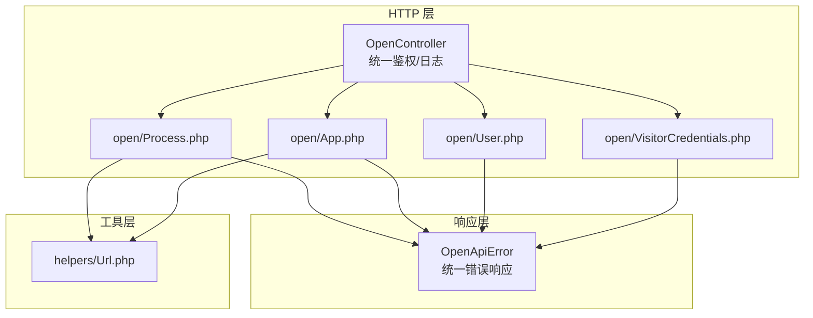
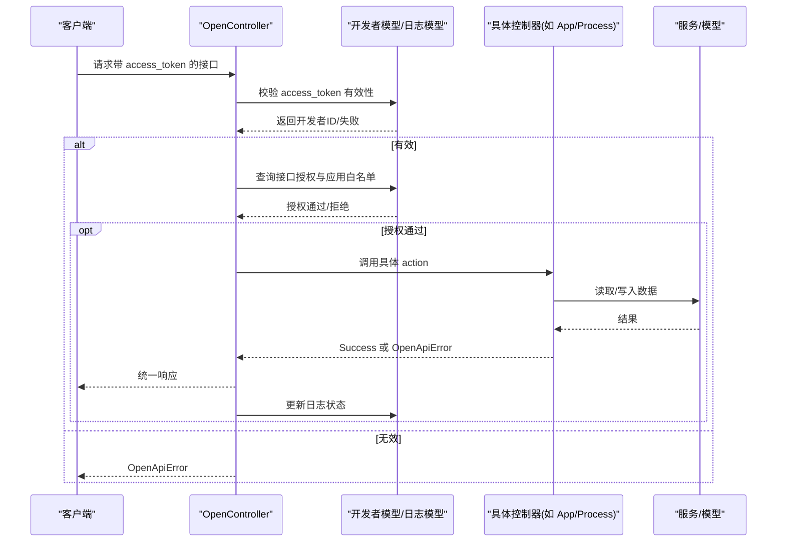
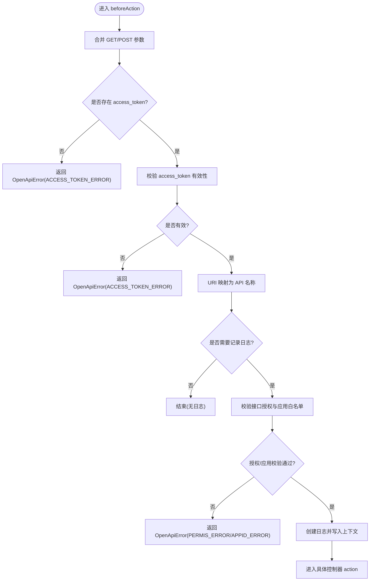
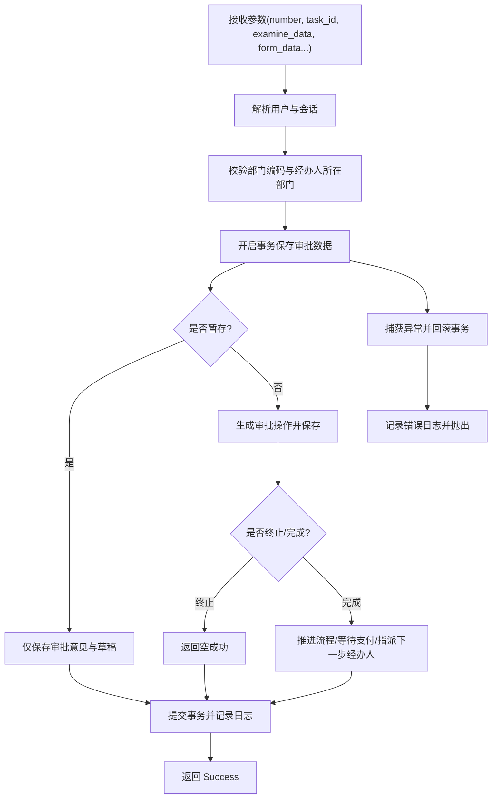
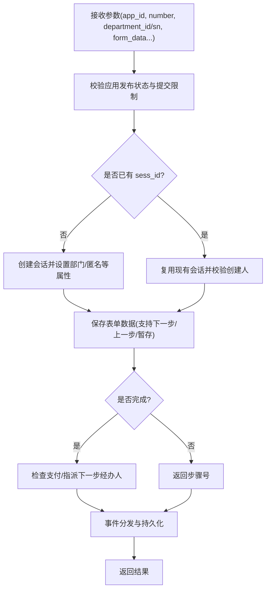
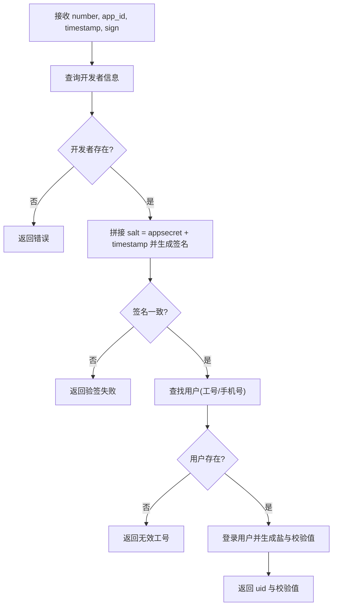
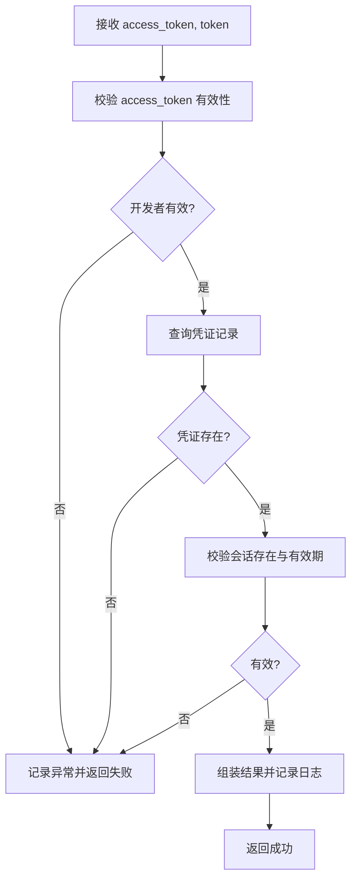
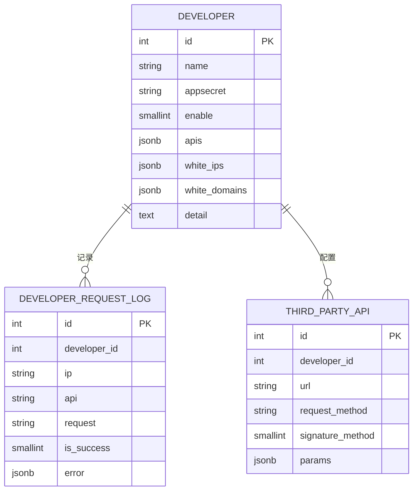

# 开放接口控制器

<cite>
**本文引用的文件**
- [OpenController.php](file://process/src/http/OpenController.php)
- [Process.php](file://process/src/http/open/Process.php)
- [App.php](file://process/src/http/open/App.php)
- [User.php](file://process/src/http/open/User.php)
- [VisitorCredentials.php](file://process/src/http/open/VisitorCredentials.php)
- [OpenApiError.php](file://process/src/response/OpenApiError.php)
- [Url.php](file://process/src/helpers/Url.php)
- [database.sql](file://process/docs/sql/database.sql)
- [routes.php](file://process/src/config/routes.php)
</cite>

## 目录
1. [简介](#简介)
2. [项目结构](#项目结构)
3. [核心组件](#核心组件)
4. [架构总览](#架构总览)
5. [详细组件分析](#详细组件分析)
6. [依赖关系分析](#依赖关系分析)
7. [性能考虑](#性能考虑)
8. [故障排查指南](#故障排查指南)
9. [结论](#结论)
10. [附录](#附录)

## 简介
本文件面向 htdNew 项目的“开放接口控制器”，系统性梳理其设计目标、安全机制、访问控制策略、数据脱敏与第三方集成方式，并给出调用流程、参数传递、响应处理、性能优化、缓存策略与监控告警的最佳实践。重点覆盖以下模块：
- Process：流程相关能力（发起、审批、草稿、日志、会话详情等）
- App：事项相关能力（数据表、表单数据、列表、热门服务、归档、保存与启动等）
- User：用户相关能力（外部登录、基础信息、属性、印章历史、创建用户、数据大屏等）
- Visitor：访客凭证核验
- Url：前端跳转与资源访问辅助工具

## 项目结构
开放接口控制器位于 http/open 目录下，统一继承自 OpenController，后者负责全局的令牌校验、接口授权、应用维度校验与访问日志记录。

图表来源
- [OpenController.php](file://process/src/http/OpenController.php#L1-L209)
- [Process.php](file://process/src/http/open/Process.php#L1-L1219)
- [App.php](file://process/src/http/open/App.php#L1-L1159)
- [User.php](file://process/src/http/open/User.php#L1-L227)
- [VisitorCredentials.php](file://process/src/http/open/VisitorCredentials.php#L1-L73)
- [OpenApiError.php](file://process/src/response/OpenApiError.php#L1-L29)
- [Url.php](file://process/src/helpers/Url.php#L1-L83)

章节来源
- [OpenController.php](file://process/src/http/OpenController.php#L1-L209)
- [routes.php](file://process/src/config/routes.php#L1-L4)

## 核心组件
- OpenController：抽象基类，提供统一的 access_token 校验、接口授权校验、应用维度白名单校验、日志上下文与日志落库。
- 各开放控制器：分别实现具体业务接口，如流程发起/审批、事项数据查询/保存、用户信息查询、访客凭证核验等。
- OpenApiError：统一错误响应格式，便于第三方系统对接与排障。
- Url：提供前端页面与资源访问的统一入口拼装，便于生成分享链接、下载链接等。

章节来源
- [OpenController.php](file://process/src/http/OpenController.php#L1-L209)
- [OpenApiError.php](file://process/src/response/OpenApiError.php#L1-L29)
- [Url.php](file://process/src/helpers/Url.php#L1-L83)

## 架构总览
开放接口整体采用“控制器-服务-模型”分层，OpenController 在 beforeAction 中完成鉴权与日志初始化，各子控制器聚焦业务逻辑，最终统一返回 Success 或 OpenApiError。

图表来源
- [OpenController.php](file://process/src/http/OpenController.php#L177-L208)
- [OpenApiError.php](file://process/src/response/OpenApiError.php#L1-L29)

## 详细组件分析

### OpenController 抽象基类
- 功能要点
  - access_token 校验：从 GET/POST 参数中提取 access_token，调用开发者模型校验。
  - 接口授权校验：通过 URI 映射到 API 名称，再查询开发者授权的 JSONB 字段是否包含该 API。
  - 应用维度校验：若请求携带 app_id，则需与开发者授权的应用白名单交集一致。
  - 日志记录：基于协程上下文维护 API 日志 ID，首次请求创建日志，后续更新成功/失败状态与错误详情。
  - URI 映射：将实际请求路径映射为标准化 API 名称，支持前缀兼容匹配。

- 关键流程图（鉴权与日志）

图表来源
- [OpenController.php](file://process/src/http/OpenController.php#L177-L208)

章节来源
- [OpenController.php](file://process/src/http/OpenController.php#L1-L209)

### Process 控制器
- 主要能力
  - 发起流程：校验发起人、部门、应用发布状态与权限，保存/启动流程，返回 sess_id。
  - 审批流程：校验审批人、部门、任务互斥与权限，保存审批数据与意见，推进流程或终止。
  - 草稿保存/删除：保存多步表单草稿，或删除多步草稿。
  - 流程日志：返回流程审批记录与当前待办节点信息。
  - 会话详情：返回当前会话的事项、节点、操作项与经办人等。
  - 任务量统计：返回某用户的待办数量与跳转链接。
  - 列表监控：支持按条件筛选运行中的流程实例，支持异常状态标记。

- 关键流程图（审批流程）

图表来源
- [Process.php](file://process/src/http/open/Process.php#L155-L271)

章节来源
- [Process.php](file://process/src/http/open/Process.php#L1-L1219)

### App 控制器
- 主要能力
  - 数据表查询：按条件分页查询数据表数据。
  - 表单数据：按权限过滤返回表单数据。
  - 事项列表/全部：支持按身份、分类、名称、类型筛选，返回事项元信息与跳转链接。
  - 热门服务：按访问频次或配置返回热门事项。
  - 归档列表：按关键字、时间范围、状态查询归档数据。
  - 保存与启动：保存多步表单数据，或直接启动流程。
  - 最近事项：返回用户最近使用的事项。
  - 事项详情：返回事项基本信息与版本列表。
  - 字段元信息：返回表单字段描述与可选项。

- 关键流程图（保存与启动）

图表来源
- [App.php](file://process/src/http/open/App.php#L393-L540)

章节来源
- [App.php](file://process/src/http/open/App.php#L1-L1159)

### User 控制器
- 主要能力
  - 外部登录：基于 app_id、timestamp、sign 与 appsecret 验签，成功后返回 uid 与设备盐的 MD5 值。
  - 基础信息：返回用户基础资料与默认部门名称。
  - 用户属性：返回部门与标签信息。
  - 印章历史：返回用户使用印章的历史与对应事项。
  - 创建用户：为校外用户创建账号并记录操作日志。
  - 数据大屏：返回用户可访问的数据大屏列表。

- 关键流程图（外部登录）

图表来源
- [User.php](file://process/src/http/open/User.php#L31-L72)

章节来源
- [User.php](file://process/src/http/open/User.php#L1-L227)

### VisitorCredentials 控制器
- 主要能力
  - 凭证核验：校验 access_token 与 token，验证会话存在性与有效期，记录核验日志并返回状态与内容摘要。
- 关键流程图（凭证核验）

图表来源
- [VisitorCredentials.php](file://process/src/http/open/VisitorCredentials.php#L1-L73)

章节来源
- [VisitorCredentials.php](file://process/src/http/open/VisitorCredentials.php#L1-L73)

### OpenApiError 统一错误响应
- 统一返回结构包含错误码、消息与附加数据，便于第三方系统快速定位问题。

章节来源
- [OpenApiError.php](file://process/src/response/OpenApiError.php#L1-L29)

### Url 辅助工具
- 提供前端页面与资源访问的统一入口拼装，如审批页、填写页、分享页、打印页、凭证页等，便于生成短链与图片/文件下载链接。

章节来源
- [Url.php](file://process/src/helpers/Url.php#L1-L83)

## 依赖关系分析
- OpenController 依赖
  - 开发者模型与请求日志模型：用于 access_token 校验、接口授权与应用白名单校验、日志创建与更新。
  - OpenApiError：统一错误响应。
- 各控制器依赖
  - App/Process/User/VisitorCredentials 控制器各自依赖对应的模型与服务，如用户、部门、应用、流程会话、任务、表单、数据表、附件等。
- 数据模型与表结构
  - developer 表：存储开发者信息、appsecret、启用状态、授权接口列表、白名单等。
  - developer_request_log 表：记录每次开放接口调用的开发者、IP、API 名称、请求方式、成功与否与错误详情。
  - thirdparty_api 表：第三方对接的 API 配置（签名方法、参数等）。

图表来源
- [database.sql](file://process/docs/sql/database.sql#L742-L776)

章节来源
- [database.sql](file://process/docs/sql/database.sql#L742-L776)

## 性能考虑
- 并发与互斥
  - 流程与任务均实现互斥锁（如会话/任务 mutex），避免并发重复提交与竞态。
- 事务与回滚
  - 审批与保存等关键路径使用数据库事务，异常时回滚并记录错误日志。
- 缓存与索引
  - 使用缓存模型与关联查询优化，建议对高频查询字段建立合适索引（如 app_id、status、created 等）。
- 日志与可观测性
  - 统一日志创建与更新，结合 is_success 与 error 字段，便于追踪慢请求与失败原因。
- 分页与排序
  - 列表接口使用分页注解，建议配合数据库索引与 LIMIT/OFFSET 优化。

[本节为通用指导，无需列出具体文件来源]

## 故障排查指南
- 常见错误与定位
  - Token 验证失败：检查 access_token 是否正确、是否过期、是否被禁用。
  - 接口未授权：确认 developer.apis 是否包含该 API 名称。
  - 应用未授权：确认请求 app_id 是否在 developer.app_ids 白名单内。
  - 参数错误：核对 number、app_id、department_sn 等关键参数是否齐全且合法。
  - 并发冲突：查看是否存在 mutex 冲突或任务已被处理。
- 日志定位
  - 查看 developer_request_log 表，结合 is_success 与 error 字段定位失败原因。
- 快速检查清单
  - access_token 是否传入且有效
  - 请求 URI 是否映射到正确的 API 名称
  - app_id 是否在授权白名单内
  - number 对应用户是否存在且正常
  - 会话/任务是否处于可操作状态

章节来源
- [OpenController.php](file://process/src/http/OpenController.php#L177-L208)
- [OpenApiError.php](file://process/src/response/OpenApiError.php#L1-L29)
- [database.sql](file://process/docs/sql/database.sql#L742-L776)

## 结论
开放接口控制器通过 OpenController 实现统一的鉴权、授权与日志体系，结合各业务控制器的职责划分，形成清晰、可扩展、可审计的开放能力矩阵。建议在生产环境中强化 IP/域名白名单、参数校验与限流策略，并持续完善监控告警与日志分析，确保第三方系统的稳定接入与安全运行。

[本节为总结性内容，无需列出具体文件来源]

## 附录

### 调用流程与参数规范（示例）
- 通用参数
  - access_token：开放接口访问令牌
  - app_id：事项 ID（部分接口需要）
  - number：用户工号/学号
  - timestamp/sign：用于外部登录验签（User.login）
- Process
  - 发起流程：app_id、number、department_sn、form_data、step_action 等
  - 审批流程：task_id、number、examine_data、form_data、step_action、two_factor_ticket 等
  - 草稿保存/删除：draf_id、is_multi_step、number 等
- App
  - 数据表查询：id、condition、sort
  - 表单数据：sess_id
  - 事项列表/全部：depart、identity、category、name、type、status、permission 等
  - 归档列表：app_id、keyword、start_time/end_time、finished_start_time/finished_end_time、status
  - 保存/启动：app_id、department_id/sn、form_data、step_action、temp_save、matter_session 等
- User
  - 外部登录：number、app_id、timestamp、sign
  - 基础信息/属性：number
  - 印章历史：number、seal_id
  - 创建用户：content、type
  - 数据大屏：number
- VisitorCredentials
  - checkInfo：access_token、token

[本节为参数概览，具体字段定义以各控制器实现为准]