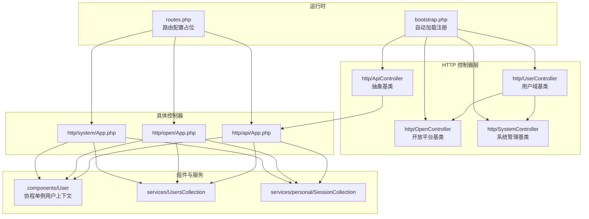
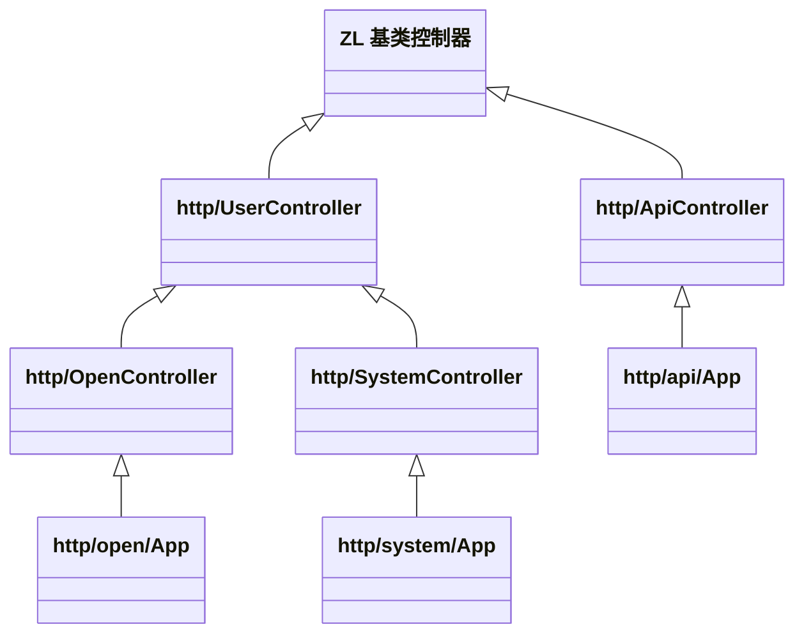
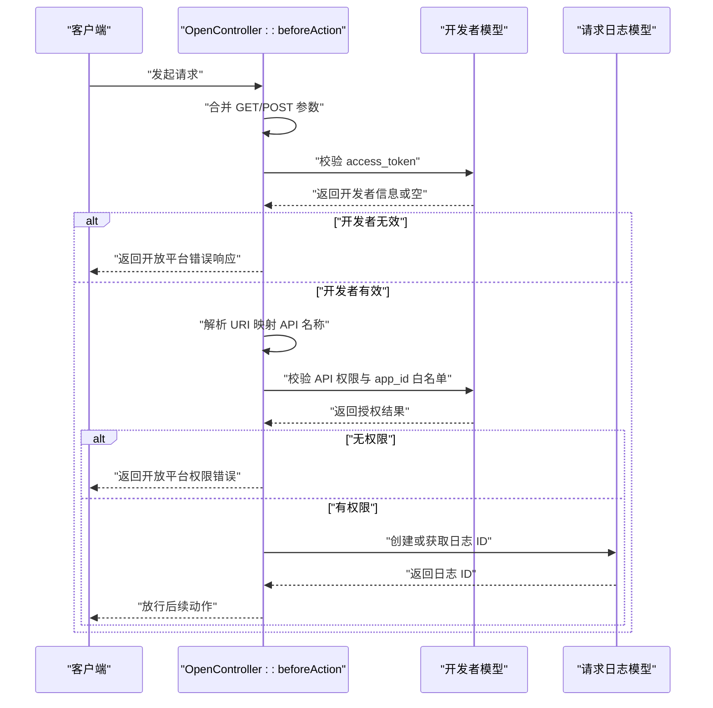
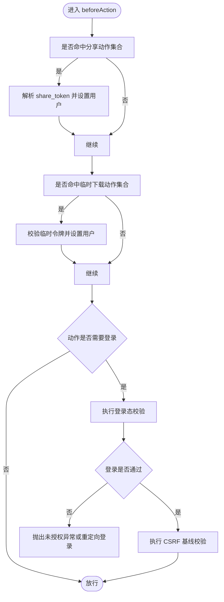
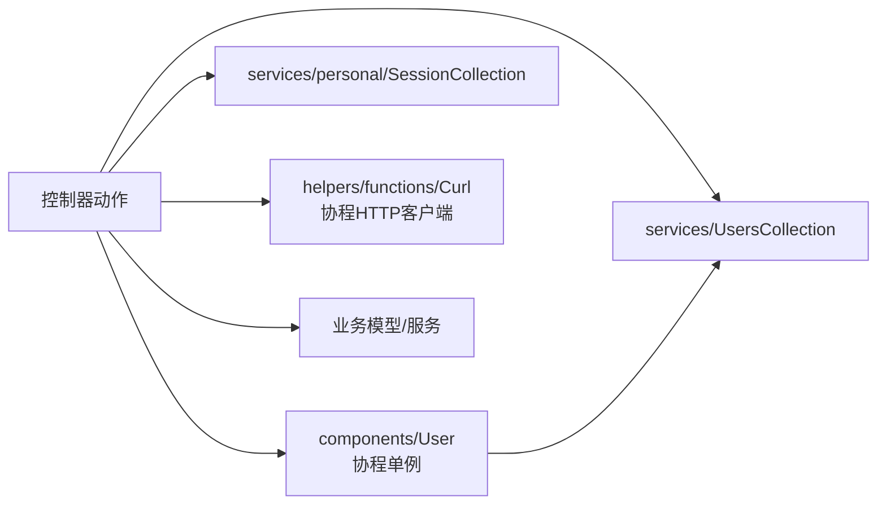
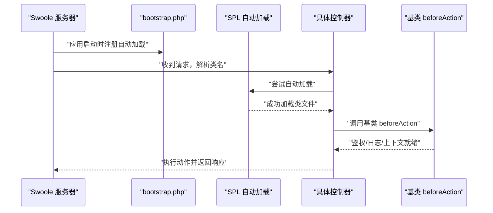
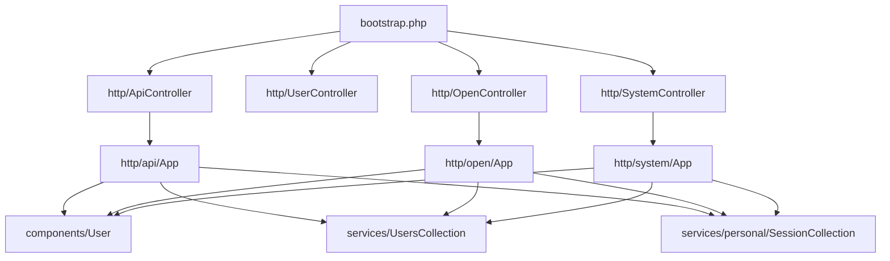

# 控制器架构设计

<cite>
**本文引用的文件**
- [ApiController.php](file://process/src/http/ApiController.php)
- [OpenController.php](file://process/src/http/OpenController.php)
- [SystemController.php](file://process/src/http/SystemController.php)
- [UserController.php](file://process/src/http/UserController.php)
- [bootstrap.php](file://process/src/bootstrap.php)
- [routes.php](file://process/src/config/routes.php)
- [User.php（组件）](file://process/src/components/User.php)
- [UsersCollection.php](file://process/src/services/UsersCollection.php)
- [SessionCollection.php](file://process/src/services/personal/SessionCollection.php)
- [Curl.php](file://process/src/helpers/functions/Curl.php)
- [App.php（API 分组）](file://process/src/http/api/App.php)
- [App.php（Open 分组）](file://process/src/http/open/App.php)
- [App.php（System 分组）](file://process/src/http/system/App.php)
</cite>

## 目录
1. [引言](#引言)
2. [项目结构](#项目结构)
3. [核心组件](#核心组件)
4. [架构总览](#架构总览)
5. [详细组件分析](#详细组件分析)
6. [依赖分析](#依赖分析)
7. [性能考虑](#性能考虑)
8. [故障排查指南](#故障排查指南)
9. [结论](#结论)
10. [附录](#附录)

## 引言
本文件面向 htdNew 项目，系统化梳理 ZL 框架下的控制器架构设计，重点覆盖 ApiController、OpenController、SystemController、UserController 的继承关系与职责分工；解释控制器生命周期中的前置钩子 beforeAction 的执行顺序与职责边界；阐述依赖注入与自动加载机制；说明控制器与组件系统的集成方式；并通过 bootstrap.php 展示初始化与注册路径。最后给出设计模式、最佳实践与扩展指南，帮助开发者在保持一致性的同时进行安全扩展。

## 项目结构
- 控制器位于 http 目录下，按功能域划分为 api、open、system、site 等命名空间，分别对应不同访问域与鉴权策略。
- 控制器基类位于 http 命名空间，向上继承自 ZL 框架的通用控制器基类。
- 自动加载通过 bootstrap.php 注册，支持 vendor、runtime、envs 以及 src 下模块的自动解析。
- 配置文件 routes.php 当前为空，路由注册由各环境或框架层负责。

图表来源
- [ApiController.php](file://process/src/http/ApiController.php#L1-L9)
- [UserController.php](file://process/src/http/UserController.php#L1-L186)
- [OpenController.php](file://process/src/http/OpenController.php#L1-L209)
- [SystemController.php](file://process/src/http/SystemController.php#L1-L95)
- [bootstrap.php](file://process/src/bootstrap.php#L1-L40)
- [routes.php](file://process/src/config/routes.php#L1-L4)
- [User.php（组件）](file://process/src/components/User.php#L1-L200)
- [UsersCollection.php](file://process/src/services/UsersCollection.php#L1-L17)
- [SessionCollection.php](file://process/src/services/personal/SessionCollection.php#L1-L26)
- [App.php（API 分组）](file://process/src/http/api/App.php#L1-L200)
- [App.php（Open 分组）](file://process/src/http/open/App.php#L1-L200)
- [App.php（System 分组）](file://process/src/http/system/App.php#L1-L200)

章节来源
- [bootstrap.php](file://process/src/bootstrap.php#L1-L40)
- [routes.php](file://process/src/config/routes.php#L1-L4)

## 核心组件
- ApiController：API 域抽象基类，提供 API 场景下的通用能力入口，具体控制器如 http/api/App.php 继承之。
- UserController：用户域基类，统一处理登录态校验、分享态与临时用户态、CSRF 基线防护等，具体控制器如 http/site/* 继承之。
- OpenController：开放平台基类，统一处理开发者接入的 token 校验、接口授权白名单、请求日志记录等，具体控制器如 http/open/App.php 继承之。
- SystemController：系统管理域基类，在 UserController 基础上增加系统级权限校验与动态验证码校验等，具体控制器如 http/system/App.php 继承之。

章节来源
- [ApiController.php](file://process/src/http/ApiController.php#L1-L9)
- [UserController.php](file://process/src/http/UserController.php#L1-L186)
- [OpenController.php](file://process/src/http/OpenController.php#L1-L209)
- [SystemController.php](file://process/src/http/SystemController.php#L1-L95)

## 架构总览
控制器继承链从 ZL 基类向下拆分：ApiController → http/api/*；UserController → http/site/*；OpenController → http/open/*；SystemController → http/system/*。各基类通过 beforeAction 提供统一的前置拦截点，形成“鉴权/日志/上下文”的分层控制。

图表来源
- [ApiController.php](file://process/src/http/ApiController.php#L1-L9)
- [UserController.php](file://process/src/http/UserController.php#L1-L186)
- [OpenController.php](file://process/src/http/OpenController.php#L1-L209)
- [SystemController.php](file://process/src/http/SystemController.php#L1-L95)
- [App.php（API 分组）](file://process/src/http/api/App.php#L1-L200)
- [App.php（Open 分组）](file://process/src/http/open/App.php#L1-L200)
- [App.php（System 分组）](file://process/src/http/system/App.php#L1-L200)

## 详细组件分析

### ApiController 基类
- 角色定位：API 域抽象基类，作为 http/api/* 控制器的父类，提供统一的 API 行为入口。
- 设计要点：保持最小职责，将具体业务逻辑下沉至子类；避免在基类中引入过多业务耦合。

章节来源
- [ApiController.php](file://process/src/http/ApiController.php#L1-L9)

### OpenController 基类
- 角色定位：开放平台域基类，面向第三方开发者提供统一的接入鉴权与日志记录能力。
- 关键职责：
  - access_token 校验与开发者授权白名单校验。
  - 接口调用日志记录，支持幂等与失败回写。
  - URI 到内部 API 名称映射，兼容部分学校前缀差异。
- 生命周期：通过 beforeAction 在动作执行前完成鉴权与日志初始化。

图表来源
- [OpenController.php](file://process/src/http/OpenController.php#L1-L209)

章节来源
- [OpenController.php](file://process/src/http/OpenController.php#L1-L209)

### UserController 基类
- 角色定位：用户域基类，统一处理登录态、分享态、临时用户态、CSRF 基线防护等。
- 关键职责：
  - 登录态校验：未登录时抛出未授权异常或重定向登录。
  - 分享态与临时用户态：根据 share_token 或 temporary_user 参数设置用户上下文。
  - CSRF 基线防护：基于 referer 与白名单主机进行简单校验。
- 生命周期：beforeAction 中先处理共享/临时用户设置，再进行登录态校验；CSRF 校验在特定环境与场景下生效。

图表来源
- [UserController.php](file://process/src/http/UserController.php#L1-L186)

章节来源
- [UserController.php](file://process/src/http/UserController.php#L1-L186)

### SystemController 基类
- 角色定位：系统管理域基类，在 UserController 基础上增加系统级权限校验与动态验证码校验。
- 关键职责：
  - 校验当前用户身份是否允许访问系统管理资源。
  - 可选的动态验证码校验，结合 UA/IP/时间戳生成校验键，必要时返回带 ticket 的响应以触发二次校验。
  - 超级管理员与菜单权限兜底校验。
- 生命周期：在父类 beforeAction 完成用户登录态校验后，进一步执行系统级鉴权。

章节来源
- [SystemController.php](file://process/src/http/SystemController.php#L1-L95)

### 控制器与组件系统的集成
- 用户上下文组件：components/User 作为协程单例，封装登录态加载、匿名访问控制、测试态模拟等功能，并通过 user() 辅助函数在控制器中获取。
- 用户集合服务：services/UsersCollection 通过缓存模型统一获取用户对象，减少重复查询。
- 个人会话集合：services/personal/SessionCollection 以协程上下文为作用域缓存个人会话模型实例。
- HTTP 工具：helpers/functions/Curl.php 提供协程 HTTP 客户端封装与调用日志记录，便于控制器内发起内部/外部请求。

图表来源
- [User.php（组件）](file://process/src/components/User.php#L1-L200)
- [UsersCollection.php](file://process/src/services/UsersCollection.php#L1-L17)
- [SessionCollection.php](file://process/src/services/personal/SessionCollection.php#L1-L26)
- [Curl.php](file://process/src/helpers/functions/Curl.php#L1-L66)

章节来源
- [User.php（组件）](file://process/src/components/User.php#L1-L200)
- [UsersCollection.php](file://process/src/services/UsersCollection.php#L1-L17)
- [SessionCollection.php](file://process/src/services/personal/SessionCollection.php#L1-L26)
- [Curl.php](file://process/src/helpers/functions/Curl.php#L1-L66)

### 控制器生命周期与自动加载
- 生命周期：
  - 请求进入后，路由匹配到具体控制器动作。
  - 执行基类 beforeAction（按继承链自底向上），完成鉴权/日志/上下文准备。
  - 执行动作方法，返回响应对象或数据。
- 自动加载：
  - bootstrap.php 注册 SPL 自动加载回调，按命名空间前缀分发：
    - zl 前缀指向 vendor/lifei/zl/src。
    - runtime 前缀指向 RUNTIME_PATH。
    - envs 前缀指向 ENVS_PATH。
    - 默认情况下，若类名首段属于 src 下的目录名，则直接包含该类文件。
  - 该机制确保控制器、组件、服务、模型等均可按需自动加载。

图表来源
- [bootstrap.php](file://process/src/bootstrap.php#L1-L40)
- [App.php（API 分组）](file://process/src/http/api/App.php#L1-L200)
- [App.php（Open 分组）](file://process/src/http/open/App.php#L1-L200)
- [App.php（System 分组）](file://process/src/http/system/App.php#L1-L200)

章节来源
- [bootstrap.php](file://process/src/bootstrap.php#L1-L40)

### 控制器设计模式、最佳实践与扩展指南
- 设计模式
  - 基类-子类模式：通过 ApiController/UserController/OpenController/SystemController 将共性逻辑下沉，子类专注业务。
  - 单例/协程单例：components/User 与 services/* 使用协程单例，避免跨协程污染，提升并发安全性。
  - 前置拦截：统一在 beforeAction 中完成鉴权与上下文准备，保证动作方法简洁。
- 最佳实践
  - 动作方法只做“业务编排”，复杂逻辑下沉到服务层或组件。
  - 对外开放接口优先继承 OpenController，并在 beforeAction 中完善鉴权与日志。
  - 系统管理接口继承 SystemController，确保系统级权限与动态验证码校验。
  - 使用 user()、redis()、db() 等全局辅助函数，避免在控制器中直接构造底层依赖。
  - 对于需要登录的动作，尽量避免在 noLoginMethods 中放行，除非明确的匿名场景。
- 扩展指南
  - 新增控制器：按域选择基类（api/site/open/system），并在 beforeAction 中补充必要的前置校验。
  - 新增鉴权：在对应基类的 beforeAction 中添加校验逻辑，或新增专用基类。
  - 新增自动加载：确保类名符合 bootstrap.php 的命名空间规则，或将类文件置于 src 下对应目录。

章节来源
- [UserController.php](file://process/src/http/UserController.php#L1-L186)
- [OpenController.php](file://process/src/http/OpenController.php#L1-L209)
- [SystemController.php](file://process/src/http/SystemController.php#L1-L95)
- [bootstrap.php](file://process/src/bootstrap.php#L1-L40)

## 依赖分析
- 控制器对基类的依赖：所有具体控制器均依赖其对应的基类，形成清晰的继承链。
- 控制器对组件与服务的依赖：通过 components/User 与 services/* 获取用户上下文、集合缓存与会话实例。
- 自动加载依赖：bootstrap.php 的自动加载规则决定控制器与组件的发现与加载路径。
- 路由配置：routes.php 当前为空，路由注册由框架或环境层负责。

图表来源
- [bootstrap.php](file://process/src/bootstrap.php#L1-L40)
- [ApiController.php](file://process/src/http/ApiController.php#L1-L9)
- [UserController.php](file://process/src/http/UserController.php#L1-L186)
- [OpenController.php](file://process/src/http/OpenController.php#L1-L209)
- [SystemController.php](file://process/src/http/SystemController.php#L1-L95)
- [App.php（API 分组）](file://process/src/http/api/App.php#L1-L200)
- [App.php（Open 分组）](file://process/src/http/open/App.php#L1-L200)
- [App.php（System 分组）](file://process/src/http/system/App.php#L1-L200)
- [User.php（组件）](file://process/src/components/User.php#L1-L200)
- [UsersCollection.php](file://process/src/services/UsersCollection.php#L1-L17)
- [SessionCollection.php](file://process/src/services/personal/SessionCollection.php#L1-L26)

章节来源
- [bootstrap.php](file://process/src/bootstrap.php#L1-L40)
- [routes.php](file://process/src/config/routes.php#L1-L4)

## 性能考虑
- 自动加载：通过命名空间前缀快速定位文件，减少不必要的扫描；建议保持类名与目录结构一致，避免深层嵌套。
- 协程单例：components/User 与 services/* 使用协程单例，降低重复实例化成本，提高并发吞吐。
- 日志与鉴权：OpenController 的日志创建与鉴权检查应尽量轻量化，避免在高频接口中引入阻塞操作。
- HTTP 请求：helpers/functions/Curl.php 提供协程 HTTP 客户端，建议复用连接与合理设置超时，避免频繁建立连接。

## 故障排查指南
- 登录态相关
  - 现象：未登录或登录态失效导致 401。
  - 排查：确认 user() 上下文是否正确初始化；检查 components/User 的 init 流程与匿名访问白名单。
- CSRF 相关
  - 现象：POST 请求被拦截或提示 CSRF。
  - 排查：检查 referer 与白名单主机配置；确认环境变量与 YAML 白名单设置。
- 开放平台鉴权
  - 现象：access_token 无效或无权限。
  - 排查：确认 token 是否过期、API 名称映射是否正确、app_id 是否在授权范围内。
- 系统管理权限
  - 现象：系统管理接口返回权限不足或触发动态验证码。
  - 排查：确认用户身份类型、UA/IP 校验键生成与 cookie 校验；检查菜单权限与超级管理员标识。

章节来源
- [UserController.php](file://process/src/http/UserController.php#L1-L186)
- [OpenController.php](file://process/src/http/OpenController.php#L1-L209)
- [SystemController.php](file://process/src/http/SystemController.php#L1-L95)
- [User.php（组件）](file://process/src/components/User.php#L1-L200)

## 结论
htdNew 项目的控制器架构以 ZL 框架为基础，通过 ApiController、UserController、OpenController、SystemController 形成清晰的分层与职责边界。基类统一前置拦截，子类聚焦业务，配合组件与服务的协程单例模式，既保证了可维护性，又兼顾了性能与并发安全。借助 bootstrap.php 的自动加载机制，系统实现了良好的可扩展性。遵循本文的设计模式与最佳实践，可在不破坏现有架构的前提下进行稳定扩展。

## 附录
- 典型控制器使用参考
  - API 场景：http/api/App.php 继承 ApiController，集中处理应用详情、列表等 API。
  - 开放平台：http/open/App.php 继承 OpenController，集中处理开发者数据查询、表单数据等。
  - 系统管理：http/system/App.php 继承 SystemController，集中处理事项管理、发布状态变更等。
- 路由配置：当前 routes.php 为空，路由注册由框架或环境层负责，建议在相应环境配置文件中补充。

章节来源
- [App.php（API 分组）](file://process/src/http/api/App.php#L1-L200)
- [App.php（Open 分组）](file://process/src/http/open/App.php#L1-L200)
- [App.php（System 分组）](file://process/src/http/system/App.php#L1-L200)
- [routes.php](file://process/src/config/routes.php#L1-L4)