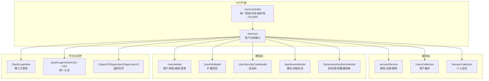
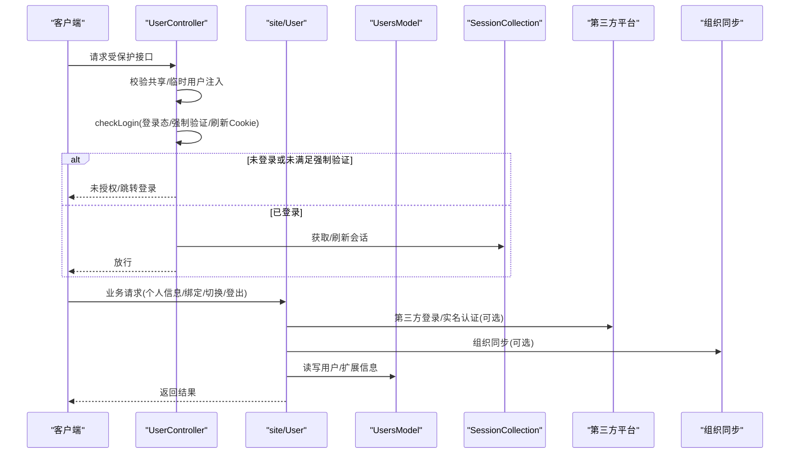
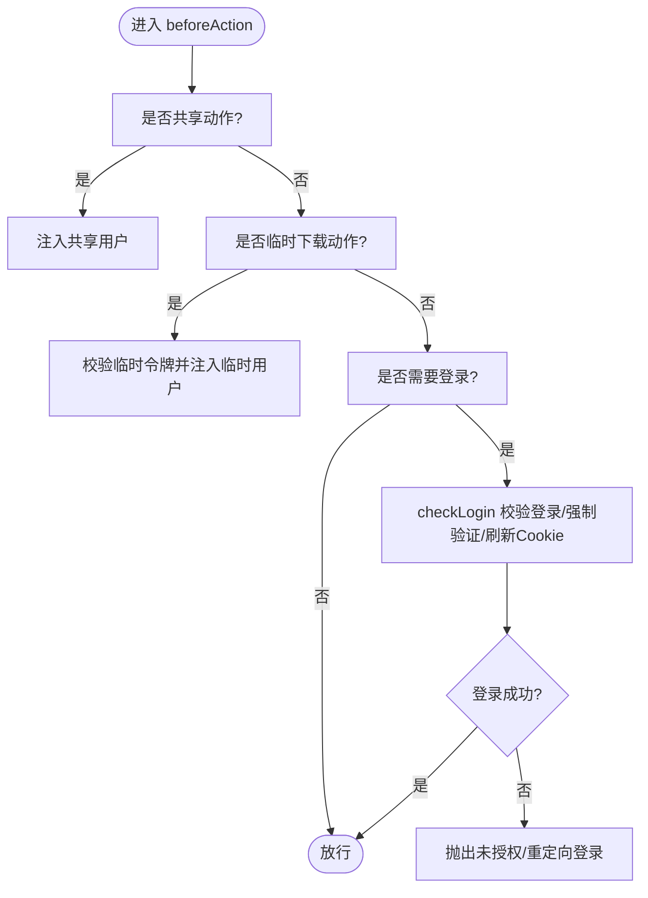
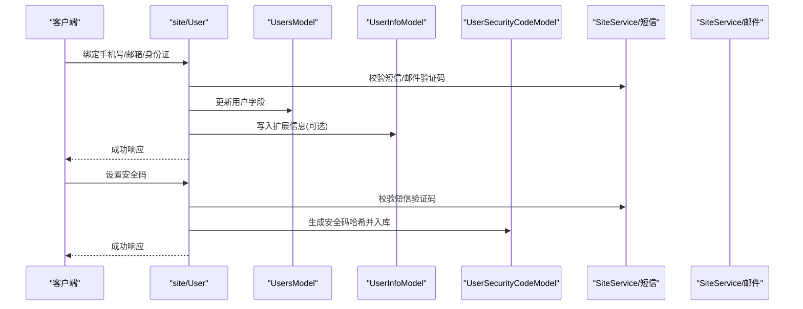
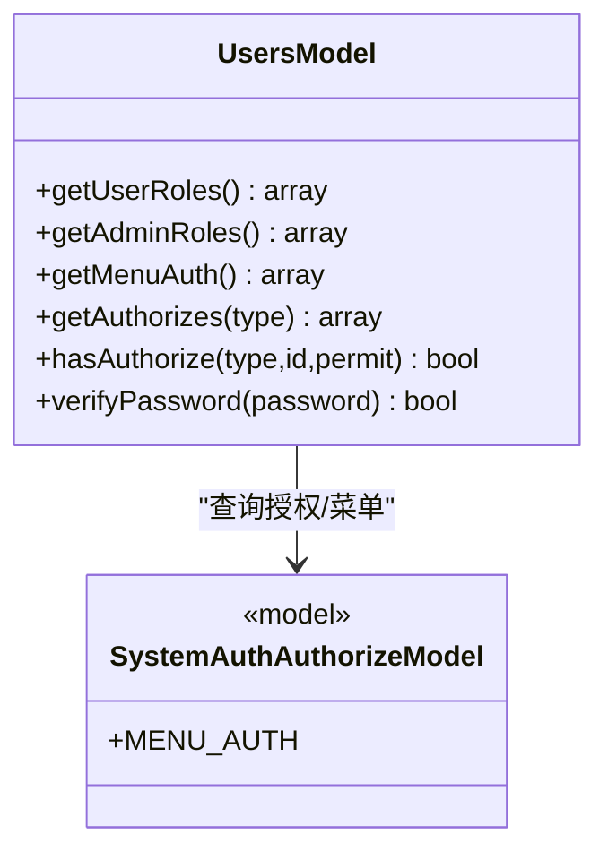
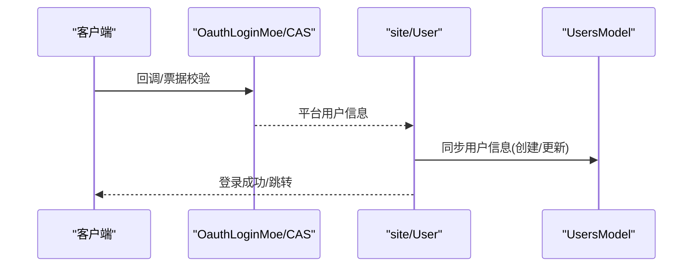
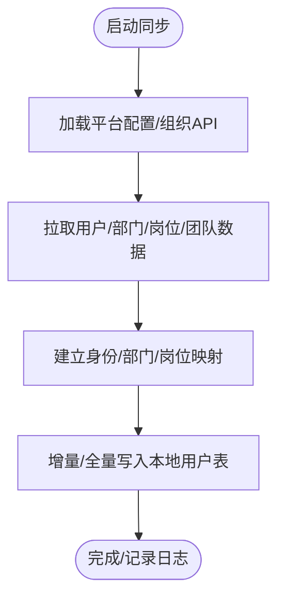
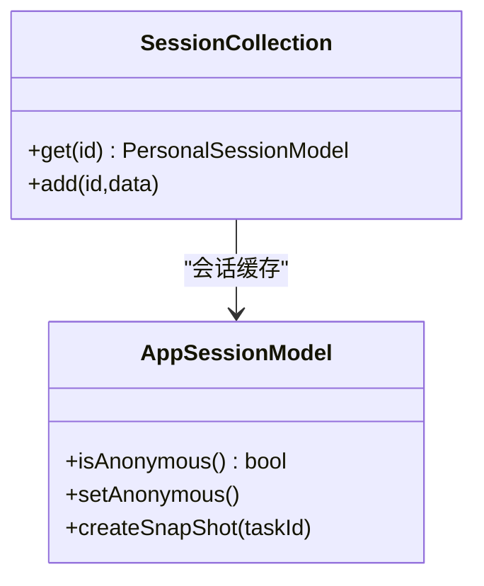
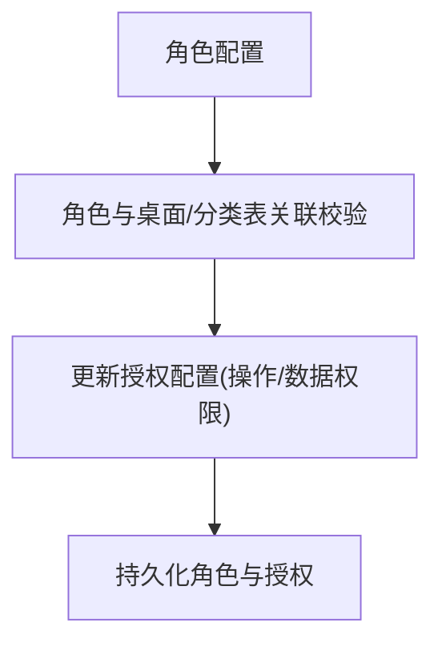
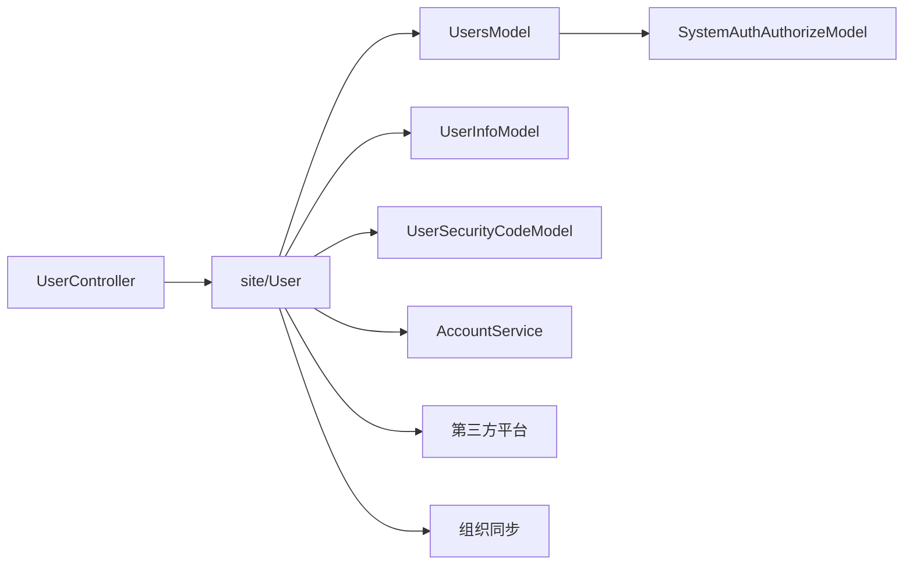

# 用户控制器

<cite>
**本文引用的文件**
- [UserController.php](file://process/src/http/UserController.php)
- [User.php](file://process/src/http/site/User.php)
- [UsersModel.php](file://process/src/models/UsersModel.php)
- [UserInfoModel.php](file://process/src/models/UserInfoModel.php)
- [UserSecurityCodeModel.php](file://process/src/models/UserSecurityCodeModel.php)
- [UsersCollection.php](file://process/src/services/UsersCollection.php)
- [AccountService.php](file://process/src/services/user/AccountService.php)
- [SessionCollection.php](file://process/src/services/personal/SessionCollection.php)
- [AppSessionModel.php](file://process/src/models/AppSessionModel.php)
- [OauthLoginMoe.php](file://process/src/services/platform/OauthLoginMoe.php)
- [OauthLoginVisitorChd.php](file://process/src/services/platform/OauthLoginVisitorChd.php)
- [CAS.php](file://process/src/services/platform/CAS.php)
- [OrganV2.php](file://process/src/services/platform/OrganV2.php)
- [OrganUser.php](file://process/src/services/platform/OrganUser.php)
- [OrganUserV3.php](file://process/src/services/platform/OrganUserV3.php)
- [ProcLogService.php](file://process/src/services/ProcLogService.php)
- [SystemAuthAuthorizeModel.php](file://process/src/models/SystemAuthAuthorizeModel.php)
- [DesktopRoleService.php](file://process/src/services/desktopManage/DesktopRoleService.php)
- [migration_20231114_132815_anonymous.php](file://process/src/migrations/migration_20231114_132815_anonymous.php)
- [migration_20240202_110446_authorize_secure.php](file://process/src/migrations/migration_20240202_110446_authorize_secure.php)
- [migration_20231107_175329_update_authorize.php](file://process/src/migrations/migration_20231107_175329_update_authorize.php)
- [migration_20240627_387643_create_visitor_credentials.php](file://process/src/migrations/migration_20240627_387643_create_visitor_credentials.php)
</cite>

## 目录
1. [简介](#简介)
2. [项目结构](#项目结构)
3. [核心组件](#核心组件)
4. [架构总览](#架构总览)
5. [详细组件分析](#详细组件分析)
6. [依赖分析](#依赖分析)
7. [性能考虑](#性能考虑)
8. [故障排查指南](#故障排查指南)
9. [结论](#结论)
10. [附录](#附录)

## 简介
本文件面向 htdNew 项目的“用户控制器”模块，系统性阐述其在用户管理中的核心职责与实现方式，涵盖用户认证、会话管理、用户信息维护、权限与角色体系、访问控制、用户数据同步、第三方账号绑定、用户行为追踪以及隐私与数据安全合规实践。文档以 UserController 为基础控制器，结合 site/User 控制器的具体实现，配合模型层与服务层组件，形成完整的用户域设计说明。

## 项目结构
用户控制器位于 http 层，作为站点层控制器的基类，统一处理登录态校验、共享访问与临时下载用户注入、CSRF 防护等横切逻辑；具体业务由 site/User 控制器承载，包括登录、登出、个人信息维护、安全码与两步验证、第三方平台登录、用户切换、短信/邮箱绑定、实名认证、以及与权限/角色/授权模型的交互。

图示来源
- [UserController.php](file://process/src/http/UserController.php#L1-L186)
- [User.php](file://process/src/http/site/User.php#L1-L200)
- [UsersModel.php](file://process/src/models/UsersModel.php#L1-L200)
- [UserInfoModel.php](file://process/src/models/UserInfoModel.php#L1-L65)
- [UserSecurityCodeModel.php](file://process/src/models/UserSecurityCodeModel.php#L1-L52)
- [UsersCollection.php](file://process/src/services/UsersCollection.php#L1-L18)
- [SessionCollection.php](file://process/src/services/personal/SessionCollection.php#L1-L26)
- [AppSessionModel.php](file://process/src/models/AppSessionModel.php#L1-L120)
- [SystemAuthAuthorizeModel.php](file://process/src/models/SystemAuthAuthorizeModel.php#L1-L45)
- [OauthLoginMoe.php](file://process/src/services/platform/OauthLoginMoe.php#L39-L74)
- [OauthLoginVisitorChd.php](file://process/src/services/platform/OauthLoginVisitorChd.php#L170-L212)
- [CAS.php](file://process/src/services/platform/CAS.php#L208-L250)
- [OrganV2.php](file://process/src/services/platform/OrganV2.php#L1-L48)
- [OrganUser.php](file://process/src/services/platform/OrganUser.php#L1-L49)
- [OrganUserV3.php](file://process/src/services/platform/OrganUserV3.php#L1-L49)

章节来源
- [UserController.php](file://process/src/http/UserController.php#L1-L186)
- [User.php](file://process/src/http/site/User.php#L1-L200)

## 核心组件
- 统一控制器 UserController
  - 共享访问与临时下载用户注入：通过共享令牌与临时令牌，将访客或临时用户注入到当前会话，实现无登录态下的受限访问。
  - 登录态校验与强制验证：对未登录请求抛出未授权异常；对校外未验证用户按站点配置强制补齐姓名/手机/身份证等信息。
  - CSRF 防护：基于 Referer 白名单与主机匹配进行简单防护，并支持环境开关。
- 站点用户控制器 site/User
  - 登出：支持第三方平台登出与微信 OpenID 解绑，清理本地会话并返回登录页地址。
  - 绑定：手机号/邮箱/身份证绑定，配合短信/邮件验证码校验。
  - 安全与两步验证：安全码设置与校验、TOTP/安全码二次验证授权查看明文。
  - 个人信息：基础信息、部门/岗位/身份、问卷协议与权限展示、收藏应用列表。
  - 用户切换：基于同身份证号的多账户切换。
  - 实名认证：对接平台进行姓名+身份证实名校验。
  - 通知与导航：消息/待办红点、页面引导状态。
- 用户模型 UsersModel
  - 角色体系：公共/登录/成员/身份/团队/部门/岗位/标签等多维角色组合。
  - 授权与菜单：基于授权模型聚合用户角色与管理角色，计算菜单权限与资源授权集合。
  - 密码校验与序列化：提供密码哈希校验与仅序列化 id 的轻量化存储。
- 用户信息服务 AccountService
  - 注册/重置/修改密码、密码强度校验、RSA 密钥对生成与缓存。
  - 同身份证号账户查询与切换、验证码校验。
- 第三方登录与统一认证
  - OauthLoginMoe：从平台获取用户信息并同步到本地用户表。
  - OauthLoginVisitorChd / CAS：票据校验、强制登出标记、会话记录与退出。
- 组织同步
  - OrganV2/OrganUser/OrganUserV3：从组织系统增量/全量拉取用户与部门、岗位、团队等信息，驱动用户数据同步。

章节来源
- [UserController.php](file://process/src/http/UserController.php#L1-L186)
- [User.php](file://process/src/http/site/User.php#L50-L200)
- [UsersModel.php](file://process/src/models/UsersModel.php#L60-L170)
- [AccountService.php](file://process/src/services/user/AccountService.php#L1-L120)

## 架构总览
用户控制器围绕“登录态校验 + 用户信息维护 + 权限与授权 + 第三方与组织同步”的主线展开，形成如下交互：

图示来源
- [UserController.php](file://process/src/http/UserController.php#L50-L186)
- [User.php](file://process/src/http/site/User.php#L50-L200)
- [UsersModel.php](file://process/src/models/UsersModel.php#L250-L360)
- [SessionCollection.php](file://process/src/services/personal/SessionCollection.php#L1-L26)
- [OauthLoginMoe.php](file://process/src/services/platform/OauthLoginMoe.php#L39-L74)
- [OrganV2.php](file://process/src/services/platform/OrganV2.php#L1-L48)

## 详细组件分析

### 统一控制器：登录态与共享/临时用户
- 共享访问
  - 通过共享令牌解析创建者用户并注入当前会话，使匿名或外部访客在限定范围内具备只读能力。
- 临时下载
  - 通过临时用户参数与 Redis 中的临时令牌校验，注入临时用户并一次性使用后失效。
- 登录态校验
  - 对未登录请求直接抛出未授权异常；对特定 URI（如报告视图、签章下载）进行重定向至登录页。
  - 校验校外未验证用户：依据站点配置强制补齐姓名/手机/身份证等必填项。
  - 成功登录后刷新 Cookie 并维持会话。
- CSRF 防护
  - 基于 Referer 主机白名单校验，支持环境开关与调试期注释。

图示来源
- [UserController.php](file://process/src/http/UserController.php#L50-L186)

章节来源
- [UserController.php](file://process/src/http/UserController.php#L50-L186)

### 站点用户控制器：登录、登出与信息维护
- 登出
  - 选择平台对象执行登出（如微信服务号），同时解除 OpenID 绑定，清理本地会话并返回登录页 URL。
- 绑定
  - 手机号/邮箱绑定：校验字段可编辑权限与验证码后更新用户信息。
  - 身份证绑定：校验类型并写入扩展信息。
- 安全与两步验证
  - 安全码设置：短信验证码校验后生成安全码哈希并落库。
  - 安全码校验：用于二次确认敏感操作。
  - TOTP/安全码授权查看明文：通过二次验证后授予明文显示权限。
- 个人信息与权限
  - 基础信息、部门/身份/岗位、问卷协议状态、问卷权限、页面引导状态。
  - 系统权限标识：是否管理员/超级管理员、明文显示授权。
- 用户切换
  - 基于同身份证号的账户列表进行切换，避免使用手机号/身份证作为关联字段。
- 实名认证
  - 优先使用配置的实名平台，否则回落默认平台，进行姓名+身份证校验。
- 通知与导航
  - 未读消息与待办任务统计，页面引导状态持久化。

图示来源
- [User.php](file://process/src/http/site/User.php#L80-L200)
- [User.php](file://process/src/http/site/User.php#L480-L560)
- [User.php](file://process/src/http/site/User.php#L650-L720)
- [User.php](file://process/src/http/site/User.php#L770-L800)
- [UsersModel.php](file://process/src/models/UsersModel.php#L250-L360)
- [UserInfoModel.php](file://process/src/models/UserInfoModel.php#L1-L65)
- [UserSecurityCodeModel.php](file://process/src/models/UserSecurityCodeModel.php#L1-L52)

章节来源
- [User.php](file://process/src/http/site/User.php#L80-L200)
- [User.php](file://process/src/http/site/User.php#L480-L560)
- [User.php](file://process/src/http/site/User.php#L650-L720)
- [User.php](file://process/src/http/site/User.php#L770-L800)

### 用户模型与权限/角色体系
- 角色生成
  - 公共/登录/成员/用户自身/身份/团队/部门/岗位/标签等多维角色组合，用于授权与菜单判定。
- 管理角色
  - 基于用户在“用户中心/部门中心/报表/岗位/专题”等模块的管理范围，生成管理角色集合。
- 授权与菜单
  - 聚合用户角色与管理角色，查询授权模型，得到菜单权限与资源授权集合。
  - 提供按类型/权限名查询授权资源 ID 的方法，支持“全部授权”与“继承父级授权”的语义。
- 菜单权限校验
  - 超级管理员直接放行；普通用户通过角色与授权模型进行交集判定。
- 密码校验与序列化
  - 提供密码哈希校验方法；仅序列化 id，避免大对象跨进程传递。

图示来源
- [UsersModel.php](file://process/src/models/UsersModel.php#L360-L740)
- [SystemAuthAuthorizeModel.php](file://process/src/models/SystemAuthAuthorizeModel.php#L1-L45)

章节来源
- [UsersModel.php](file://process/src/models/UsersModel.php#L360-L740)
- [SystemAuthAuthorizeModel.php](file://process/src/models/SystemAuthAuthorizeModel.php#L1-L45)

### 第三方登录与统一认证
- OauthLoginMoe
  - 从平台获取用户信息（学工号/手机号/姓名等），若本地不存在则创建用户并设置来源类型为“同步”。
- OauthLoginVisitorChd / CAS
  - 票据校验、强制登出标记、会话记录与退出流程，确保与平台侧会话一致性。
- 登出联动
  - 登出时根据平台对象执行平台侧登出，并清理本地绑定信息。

图示来源
- [OauthLoginMoe.php](file://process/src/services/platform/OauthLoginMoe.php#L39-L74)
- [OauthLoginVisitorChd.php](file://process/src/services/platform/OauthLoginVisitorChd.php#L170-L212)
- [CAS.php](file://process/src/services/platform/CAS.php#L208-L250)
- [User.php](file://process/src/http/site/User.php#L50-L90)

章节来源
- [OauthLoginMoe.php](file://process/src/services/platform/OauthLoginMoe.php#L39-L74)
- [OauthLoginVisitorChd.php](file://process/src/services/platform/OauthLoginVisitorChd.php#L170-L212)
- [CAS.php](file://process/src/services/platform/CAS.php#L208-L250)
- [User.php](file://process/src/http/site/User.php#L50-L90)

### 用户数据同步与组织集成
- OrganV2/OrganUser/OrganUserV3
  - 从组织系统拉取用户、部门、岗位、团队等信息，建立映射关系并增量/全量同步至本地用户表。
- 同步触发与日志
  - 通过命令行或定时任务触发，记录同步过程与结果，便于审计与排障。

图示来源
- [OrganV2.php](file://process/src/services/platform/OrganV2.php#L1-L48)
- [OrganUser.php](file://process/src/services/platform/OrganUser.php#L1-L49)
- [OrganUserV3.php](file://process/src/services/platform/OrganUserV3.php#L1-L49)

章节来源
- [OrganV2.php](file://process/src/services/platform/OrganV2.php#L1-L48)
- [OrganUser.php](file://process/src/services/platform/OrganUser.php#L1-L49)
- [OrganUserV3.php](file://process/src/services/platform/OrganUserV3.php#L1-L49)

### 会话生命周期与匿名会话
- 个人会话
  - SessionCollection 提供按 ID 获取/缓存个人会话模型的能力，支持多实例缓存。
- 匿名会话与流程
  - AppSessionModel 支持匿名发起与匿名用户标识，流程状态与快照管理，保证匿名场景下的流程可控。
- 访客凭证
  - migration 创建访客凭证表与日志表，支撑匿名访问与审计。

图示来源
- [SessionCollection.php](file://process/src/services/personal/SessionCollection.php#L1-L26)
- [AppSessionModel.php](file://process/src/models/AppSessionModel.php#L120-L220)
- [migration_20240627_387643_create_visitor_credentials.php](file://process/src/migrations/migration_20240627_387643_create_visitor_credentials.php#L1-L42)

章节来源
- [SessionCollection.php](file://process/src/services/personal/SessionCollection.php#L1-L26)
- [AppSessionModel.php](file://process/src/models/AppSessionModel.php#L120-L220)
- [migration_20240627_387643_create_visitor_credentials.php](file://process/src/migrations/migration_20240627_387643_create_visitor_credentials.php#L1-L42)

### 权限与角色管理最佳实践
- 授权模型
  - SystemAuthAuthorizeModel 定义授权类型、资源范围与额外参数，支持“静默授权类型”与“创作者继承”等策略。
- 角色配置
  - DesktopRoleService 提供角色与桌面/分类表的关联校验与权限配置入口，确保角色与资源在同一桌面内生效。
- 授权迁移
  - migration_20240202_110446_authorize_secure 与 migration_20231107_175329_update_authorize 体现授权模型演进与修复历史。

图示来源
- [SystemAuthAuthorizeModel.php](file://process/src/models/SystemAuthAuthorizeModel.php#L1-L45)
- [DesktopRoleService.php](file://process/src/services/desktopManage/DesktopRoleService.php#L597-L632)
- [migration_20240202_110446_authorize_secure.php](file://process/src/migrations/migration_20240202_110446_authorize_secure.php#L1-L33)
- [migration_20231107_175329_update_authorize.php](file://process/src/migrations/migration_20231107_175329_update_authorize.php#L1-L19)

章节来源
- [SystemAuthAuthorizeModel.php](file://process/src/models/SystemAuthAuthorizeModel.php#L1-L45)
- [DesktopRoleService.php](file://process/src/services/desktopManage/DesktopRoleService.php#L597-L632)
- [migration_20240202_110446_authorize_secure.php](file://process/src/migrations/migration_20240202_110446_authorize_secure.php#L1-L33)
- [migration_20231107_175329_update_authorize.php](file://process/src/migrations/migration_20231107_175329_update_authorize.php#L1-L19)

## 依赖分析
- 组件耦合
  - UserController 依赖 UsersCollection 与 ShareFormModel/临时令牌模型，向上游提供统一登录态校验。
  - site/User 依赖 UsersModel/UserInfoModel/UserSecurityCodeModel、AccountService、平台登录组件与组织同步服务。
  - UsersModel 依赖授权模型与菜单定义，向下提供权限判定与角色聚合。
- 外部依赖
  - 第三方平台登录与统一认证（CAS/OAuth）。
  - 组织系统 API，用于用户/部门/岗位/团队同步。
- 潜在循环
  - 控制器与服务层之间采用单向依赖，模型层与服务层之间通过静态方法/工具类交互，未见明显循环。

图示来源
- [UserController.php](file://process/src/http/UserController.php#L1-L186)
- [User.php](file://process/src/http/site/User.php#L1-L200)
- [UsersModel.php](file://process/src/models/UsersModel.php#L1-L200)
- [SystemAuthAuthorizeModel.php](file://process/src/models/SystemAuthAuthorizeModel.php#L1-L45)

章节来源
- [UserController.php](file://process/src/http/UserController.php#L1-L186)
- [User.php](file://process/src/http/site/User.php#L1-L200)
- [UsersModel.php](file://process/src/models/UsersModel.php#L1-L200)

## 性能考虑
- 缓存与序列化
  - UsersModel 仅序列化 id，降低跨进程传输成本；UserInfoModel 与 UsersModel 在保存后清理前端缓存，避免脏读。
- 角色与授权缓存
  - UsersModel 在协程上下文中缓存授权结果，减少重复查询；授权刷新通过上下文标志触发。
- 会话缓存
  - SessionCollection 使用协程单例缓存个人会话模型，减少重复实例化。
- 数据同步
  - 组织同步采用分页拉取与映射构建，避免一次性大批量写入造成阻塞。

章节来源
- [UsersModel.php](file://process/src/models/UsersModel.php#L250-L360)
- [UsersModel.php](file://process/src/models/UsersModel.php#L650-L700)
- [SessionCollection.php](file://process/src/services/personal/SessionCollection.php#L1-L26)
- [OrganV2.php](file://process/src/services/platform/OrganV2.php#L1-L48)

## 故障排查指南
- 登录失败/未授权
  - 检查共享/临时令牌是否有效；确认 URI 是否命中重定向逻辑；核对强制验证配置。
- CSRF 拦截
  - 核对 Referer 主机与白名单配置；确认环境开关状态。
- 安全码/两步验证
  - 确认短信验证码是否正确；检查安全码是否已设置；核对 TOTP/安全码二次验证流程。
- 第三方登录
  - 核对平台回调/票据校验是否成功；关注强制登出标记与会话记录。
- 组织同步
  - 检查平台配置与 API 可达性；确认身份映射关系；查看同步日志与错误信息。
- 行为追踪
  - 使用 ProcLogService 输出用户信息与操作摘要，辅助审计与问题定位。

章节来源
- [UserController.php](file://process/src/http/UserController.php#L50-L186)
- [User.php](file://process/src/http/site/User.php#L480-L560)
- [OauthLoginVisitorChd.php](file://process/src/services/platform/OauthLoginVisitorChd.php#L170-L212)
- [CAS.php](file://process/src/services/platform/CAS.php#L208-L250)
- [ProcLogService.php](file://process/src/services/ProcLogService.php#L589-L611)

## 结论
用户控制器以 UserController 为基座，结合 site/User 的具体业务实现，构建了覆盖登录态校验、共享/临时访问、信息维护、安全与两步验证、第三方登录与统一认证、组织同步、权限与角色体系、匿名会话与流程、行为追踪与审计的完整闭环。通过模型层的角色/授权聚合与服务层的密码/密钥/同步工具，系统在保障安全性的同时兼顾易用性与可扩展性。

## 附录
- 匿名会话与访客凭证
  - AppSessionModel 支持匿名标识；migration_20231114_132815_anonymous 为会话表增加匿名字段；migration_20240627_387643_create_visitor_credentials 新增访客凭证与日志表，支撑匿名访问与审计。

章节来源
- [AppSessionModel.php](file://process/src/models/AppSessionModel.php#L120-L220)
- [migration_20231114_132815_anonymous.php](file://process/src/migrations/migration_20231114_132815_anonymous.php#L1-L18)
- [migration_20240627_387643_create_visitor_credentials.php](file://process/src/migrations/migration_20240627_387643_create_visitor_credentials.php#L1-L42)