# 系统管理控制器

<cite>
**本文引用的文件**
- [SystemController.php](file://process/src/http/SystemController.php)
- [permits.php](file://process/src/config/permits.php)
- [App.php](file://process/src/http/system/App.php)
- [AppTemplate.php](file://process/src/http/system/AppTemplate.php)
- [DataTable.php](file://process/src/http/system/DataTable.php)
- [Department.php](file://process/src/http/system/Department.php)
- [User.php](file://process/src/http/system/User.php)
- [Site.php](file://process/src/http/system/Site.php)
- [SiteService.php](file://process/src/services/SiteService.php)
- [ActionLogModel.php](file://process/src/models/ActionLogModel.php)
- [ActionLogService.php](file://process/src/services/ActionLogService.php)
- [BackUpService.php](file://process/src/services/BackUpService.php)
- [BackUpModel.php](file://process/src/models/BackUpModel.php)
- [DataTableBackupModel.php](file://process/src/models/DataTableBackupModel.php)
- [database.sql](file://process/docs/sql/database.sql)
- [Process.php](file://process/src/http/open/Process.php)
</cite>

## 目录
1. [引言](#引言)
2. [项目结构](#项目结构)
3. [核心组件](#核心组件)
4. [架构总览](#架构总览)
5. [详细组件分析](#详细组件分析)
6. [依赖分析](#依赖分析)
7. [性能考虑](#性能考虑)
8. [故障排查指南](#故障排查指南)
9. [结论](#结论)

## 引言
本文件面向 htdNew 项目的“系统管理控制器”，系统性梳理其功能边界与权限体系，覆盖 App、AppTemplate、DataTable、Department、User 等系统管理接口，并深入说明系统配置管理、用户权限控制、数据字典维护、系统监控、日志审计与数据备份恢复机制。文档同时提供操作流程设计、权限验证与操作记录要点，以及安全与性能优化、故障排查的实用建议。

## 项目结构
系统管理控制器位于 http/system 目录，采用“继承自 SystemController 的受控控制器”模式，统一前置鉴权与动态口令校验；权限映射集中于 config/permits.php，按 URI 精确到通配符级别；业务服务集中在 services 与 models 层，配合 SiteService 实现站点配置持久化与合并读取。

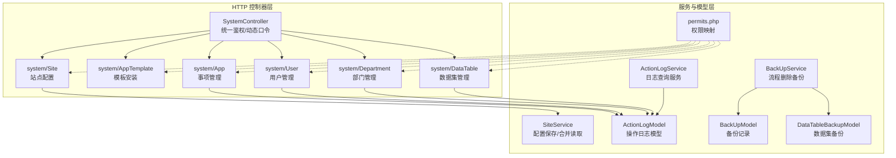

图表来源
- [SystemController.php](file://process/src/http/SystemController.php#L1-L95)
- [permits.php](file://process/src/config/permits.php#L1-L200)
- [App.php](file://process/src/http/system/App.php#L1-L200)
- [AppTemplate.php](file://process/src/http/system/AppTemplate.php#L1-L104)
- [DataTable.php](file://process/src/http/system/DataTable.php#L1-L120)
- [Department.php](file://process/src/http/system/Department.php#L1-L120)
- [User.php](file://process/src/http/system/User.php#L1-L120)
- [Site.php](file://process/src/http/system/Site.php#L48-L87)
- [SiteService.php](file://process/src/services/SiteService.php#L148-L190)
- [ActionLogModel.php](file://process/src/models/ActionLogModel.php#L1-L90)
- [ActionLogService.php](file://process/src/services/ActionLogService.php#L79-L101)
- [BackUpService.php](file://process/src/services/BackUpService.php#L1-L128)
- [BackUpModel.php](file://process/src/models/BackUpModel.php#L1-L76)
- [DataTableBackupModel.php](file://process/src/models/DataTableBackupModel.php#L1-L24)

章节来源
- [SystemController.php](file://process/src/http/SystemController.php#L1-L95)
- [permits.php](file://process/src/config/permits.php#L1-L200)

## 核心组件
- SystemController：系统控制器基类，负责统一鉴权与动态口令校验，拦截非授权访问与越权请求。
- App：事项管理控制器，提供事项创建、状态变更、列表检索、导出、视图配置、克隆等能力，并记录操作日志。
- AppTemplate：事项模板控制器，提供模板标签、列表、详情与安装能力。
- DataTable：数据集管理控制器，提供数据集列表、字段信息、导出维度信息、默认数据集设置等。
- Department：部门管理控制器，提供带授权信息的部门树、导出、部门编辑、详情、根部门名称配置等。
- User：用户管理控制器，提供用户列表、外部用户列表、回收站、新增、保存、字段设置、搜索、标签用户变更等。
- Site：站点配置控制器，提供配置保存与操作日志记录。
- SiteService：站点配置服务，负责配置合并读取、字段合法性校验、安全令牌校验、AI配置同步等。
- ActionLogModel/ActionLogService：操作日志模型与查询服务，支撑审计与追踪。
- BackUpService/BackUpModel/DataTableBackupModel：备份服务与模型，支撑流程实例删除后的全量备份与恢复。

章节来源
- [SystemController.php](file://process/src/http/SystemController.php#L1-L95)
- [App.php](file://process/src/http/system/App.php#L1-L200)
- [AppTemplate.php](file://process/src/http/system/AppTemplate.php#L1-L104)
- [DataTable.php](file://process/src/http/system/DataTable.php#L1-L120)
- [Department.php](file://process/src/http/system/Department.php#L1-L120)
- [User.php](file://process/src/http/system/User.php#L1-L120)
- [Site.php](file://process/src/http/system/Site.php#L48-L87)
- [SiteService.php](file://process/src/services/SiteService.php#L148-L190)
- [ActionLogModel.php](file://process/src/models/ActionLogModel.php#L1-L90)
- [ActionLogService.php](file://process/src/services/ActionLogService.php#L79-L101)
- [BackUpService.php](file://process/src/services/BackUpService.php#L1-L128)
- [BackUpModel.php](file://process/src/models/BackUpModel.php#L1-L76)
- [DataTableBackupModel.php](file://process/src/models/DataTableBackupModel.php#L1-L24)

## 架构总览
系统管理控制器遵循“控制器-服务-模型”的分层架构，权限由 permits.php 映射到具体 URI，控制器在 beforeAction 中调用 systemAuthCheck 完成身份与权限校验，必要时启用动态口令校验（TOTP/UA/IP 校验），随后进入业务逻辑并记录操作日志。

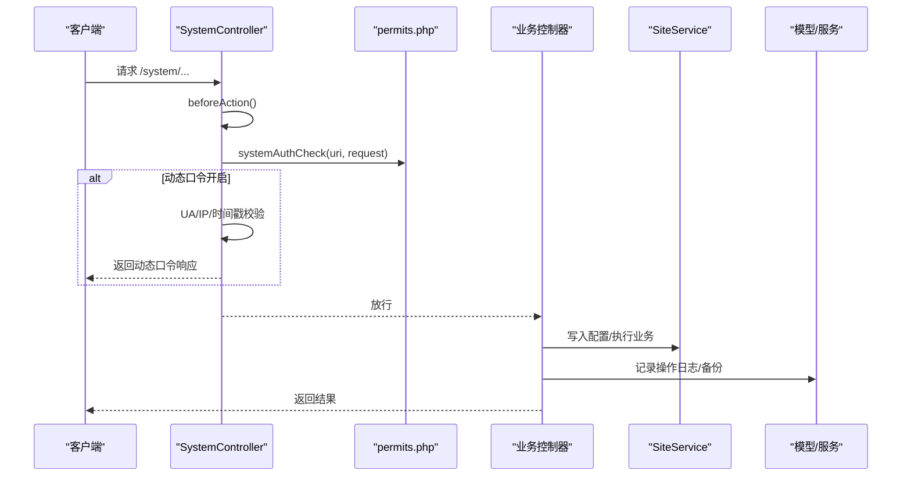

图表来源
- [SystemController.php](file://process/src/http/SystemController.php#L17-L93)
- [permits.php](file://process/src/config/permits.php#L1-L200)
- [Site.php](file://process/src/http/system/Site.php#L48-L87)
- [SiteService.php](file://process/src/services/SiteService.php#L148-L190)
- [ActionLogModel.php](file://process/src/models/ActionLogModel.php#L80-L90)
- [BackUpService.php](file://process/src/services/BackUpService.php#L99-L128)

## 详细组件分析

### 系统控制器基类 SystemController
- 统一鉴权：在 beforeAction 中调用 systemAuthCheck，拒绝校外用户访问，支持动态口令校验（UA/IP/时间戳），超管与菜单授权放行。
- 动态口令：当配置开启时，从 Cookie/UA/IP 提取关键因子生成缓存键，校验失败返回 TicketPermit 响应，提示重新认证。
- 菜单与授权：若非超管且无菜单授权，则抛出认证错误。

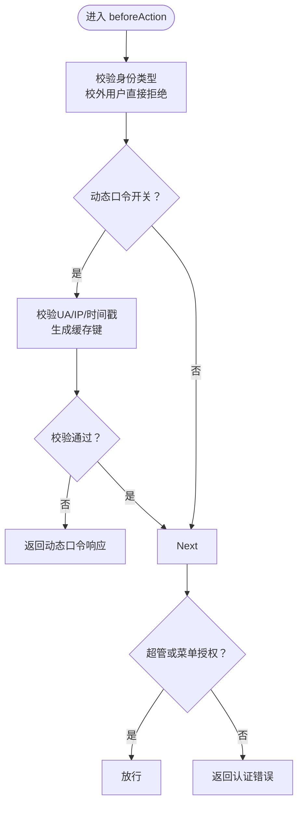

图表来源
- [SystemController.php](file://process/src/http/SystemController.php#L17-L93)

章节来源
- [SystemController.php](file://process/src/http/SystemController.php#L17-L93)

### 事项管理 App
- 列表与筛选：支持按名称、部门、状态、类型、大厅显示等条件筛选，非超管仅能查看授权范围内的事项。
- 发布校验：发布前校验是否存在表单数据组件但缺少审核节点或个人数据触发器，避免数据链路缺失。
- 导出：支持导出事项清单，包含版本数量、统计数据等字段。
- 视图配置：设置公共页面视图时自动为事项默认数据集补齐使用字段。
- 克隆：支持克隆事项及其版本、模块、流程节点等，第三方事项仅克隆事项表。
- 操作日志：对发布、取消发布、删除等关键操作记录。

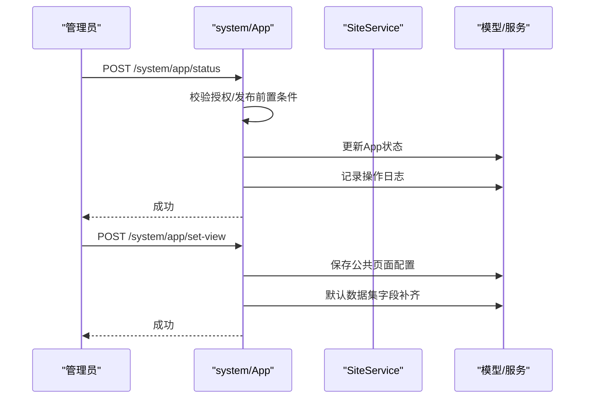

图表来源
- [App.php](file://process/src/http/system/App.php#L166-L201)
- [App.php](file://process/src/http/system/App.php#L630-L655)
- [App.php](file://process/src/http/system/App.php#L657-L800)
- [ActionLogModel.php](file://process/src/models/ActionLogModel.php#L80-L90)

章节来源
- [App.php](file://process/src/http/system/App.php#L118-L201)
- [App.php](file://process/src/http/system/App.php#L308-L510)
- [App.php](file://process/src/http/system/App.php#L630-L655)
- [App.php](file://process/src/http/system/App.php#L657-L800)

### 事项模板 AppTemplate
- 模板标签与列表：支持按关键词、标签、分类等筛选。
- 安装流程：校验模板详情与模块信息，支持“遇到错误继续安装”模式，安装成功后通知模板中心。
- 详情展示：返回模板名称、标签、模块结构等。

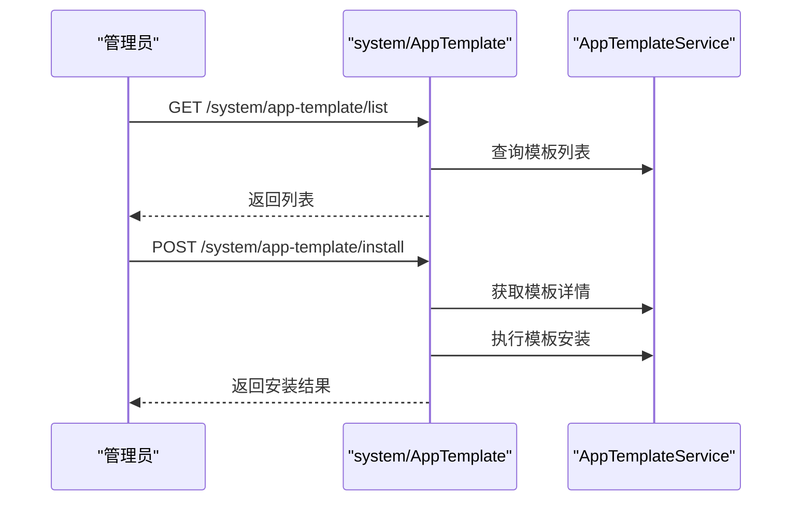

图表来源
- [AppTemplate.php](file://process/src/http/system/AppTemplate.php#L1-L104)

章节来源
- [AppTemplate.php](file://process/src/http/system/AppTemplate.php#L1-L104)

### 数据集管理 DataTable
- 列表与筛选：支持按名称、部门、事项、创建人、状态等条件筛选，支持导出维度信息。
- 字段查询：返回所有数据集及其字段元信息。
- 导出维度：输出维度ID、名称、字段、类型、权限、码表等信息，便于治理与审计。

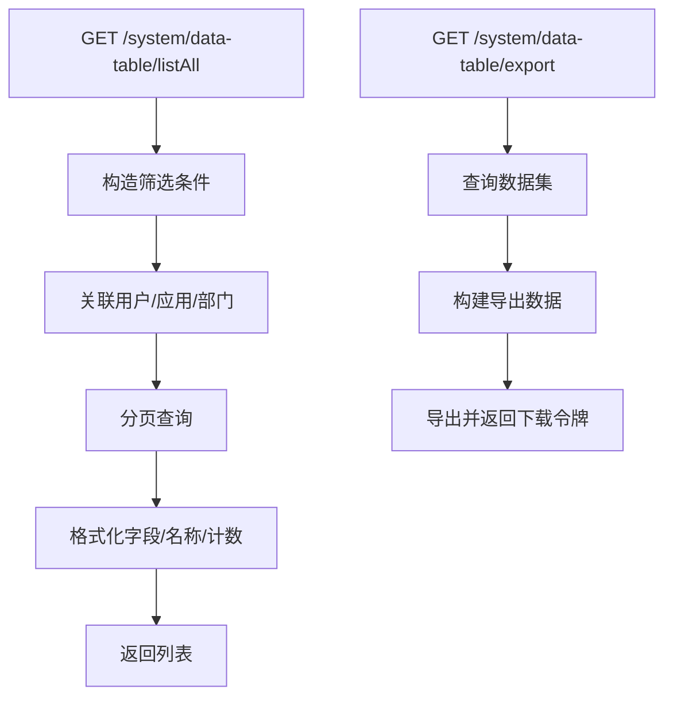

图表来源
- [DataTable.php](file://process/src/http/system/DataTable.php#L56-L130)
- [DataTable.php](file://process/src/http/system/DataTable.php#L132-L184)
- [DataTable.php](file://process/src/http/system/DataTable.php#L186-L241)

章节来源
- [DataTable.php](file://process/src/http/system/DataTable.php#L56-L130)
- [DataTable.php](file://process/src/http/system/DataTable.php#L132-L184)
- [DataTable.php](file://process/src/http/system/DataTable.php#L186-L241)

### 部门管理 Department
- 授权树：根据当前用户权限生成带授权信息的部门树，支持状态筛选。
- 导出：支持导出部门列表与岗位人员明细。
- 编辑：支持新增/编辑部门、批量调整子部门状态、根部门名称配置。
- 缓存状态：提供部门缓存状态读取/设置接口。

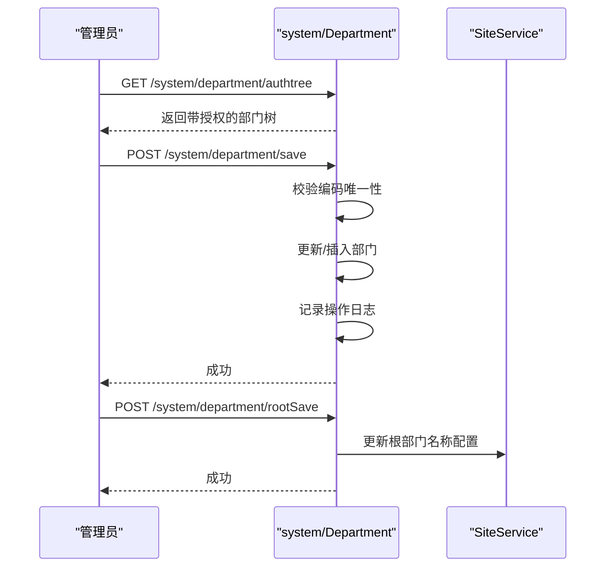

图表来源
- [Department.php](file://process/src/http/system/Department.php#L24-L73)
- [Department.php](file://process/src/http/system/Department.php#L80-L120)
- [Department.php](file://process/src/http/system/Department.php#L142-L190)
- [Department.php](file://process/src/http/system/Department.php#L229-L246)
- [SiteService.php](file://process/src/services/SiteService.php#L148-L190)

章节来源
- [Department.php](file://process/src/http/system/Department.php#L24-L73)
- [Department.php](file://process/src/http/system/Department.php#L80-L120)
- [Department.php](file://process/src/http/system/Department.php#L142-L190)
- [Department.php](file://process/src/http/system/Department.php#L229-L246)

### 用户管理 User
- 列表与筛选：支持按关键字、身份类型/标识、部门等条件筛选，非超管仅能查看授权范围内的用户。
- 外部用户与回收站：分别提供外部用户列表与回收站列表，均受菜单权限约束。
- 新增/保存：对必填字段进行校验，保存后记录操作日志。
- 字段设置：支持获取/保存用户字段展示配置。
- 标签用户变更：支持按条件批量变更标签用户并记录日志。

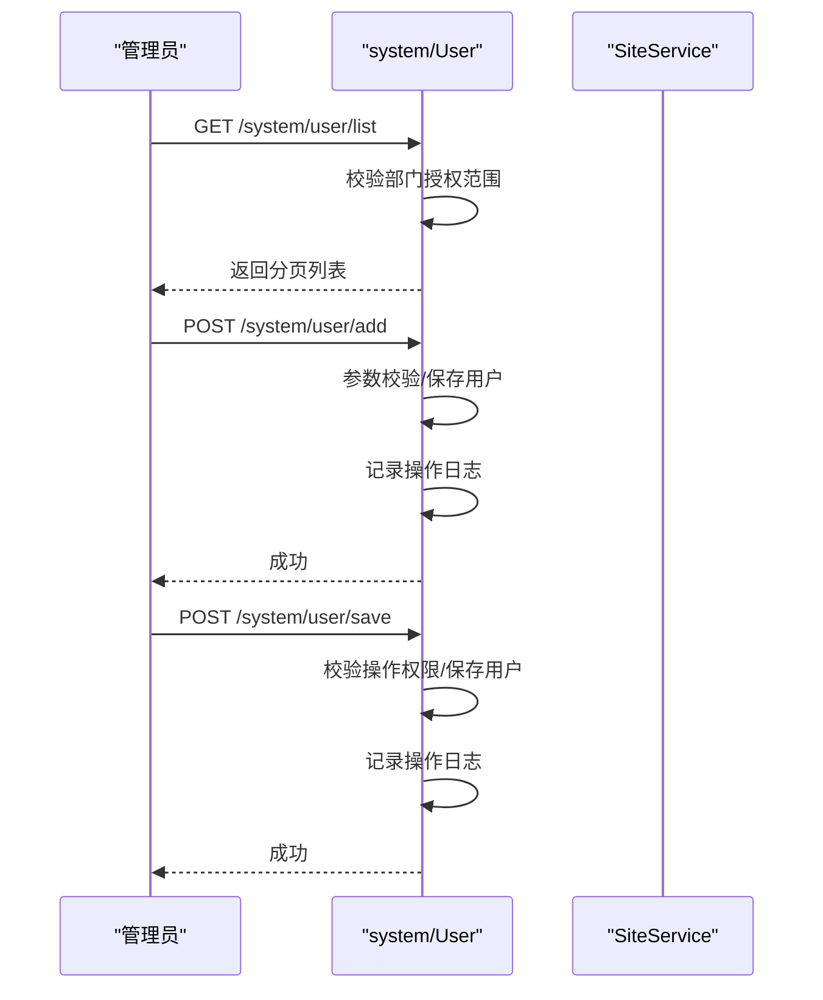

图表来源
- [User.php](file://process/src/http/system/User.php#L40-L160)
- [User.php](file://process/src/http/system/User.php#L162-L264)
- [User.php](file://process/src/http/system/User.php#L266-L335)
- [User.php](file://process/src/http/system/User.php#L338-L466)
- [User.php](file://process/src/http/system/User.php#L468-L515)
- [User.php](file://process/src/http/system/User.php#L590-L632)
- [User.php](file://process/src/http/system/User.php#L634-L700)
- [User.php](file://process/src/http/system/User.php#L702-L777)

章节来源
- [User.php](file://process/src/http/system/User.php#L40-L160)
- [User.php](file://process/src/http/system/User.php#L162-L264)
- [User.php](file://process/src/http/system/User.php#L266-L335)
- [User.php](file://process/src/http/system/User.php#L338-L466)
- [User.php](file://process/src/http/system/User.php#L468-L515)
- [User.php](file://process/src/http/system/User.php#L590-L632)
- [User.php](file://process/src/http/system/User.php#L634-L700)
- [User.php](file://process/src/http/system/User.php#L702-L777)

### 站点配置 Site
- 配置保存：校验配置类型是否受支持，调用 SiteService 完成合并写入与缓存清理，并记录操作日志（含 IP、UA、配置类型与详情）。
- 安全策略：SiteService 在保存安全令牌配置时执行严格校验与字段清理，确保配置合法。

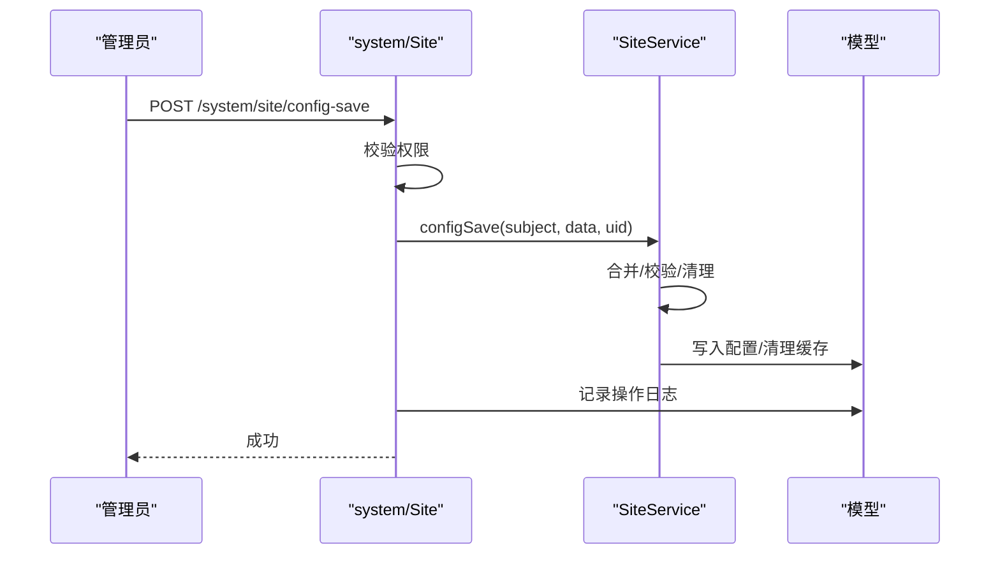

图表来源
- [Site.php](file://process/src/http/system/Site.php#L48-L87)
- [SiteService.php](file://process/src/services/SiteService.php#L148-L190)
- [ActionLogModel.php](file://process/src/models/ActionLogModel.php#L80-L90)

章节来源
- [Site.php](file://process/src/http/system/Site.php#L48-L87)
- [SiteService.php](file://process/src/services/SiteService.php#L148-L190)

### 日志审计与系统监控
- 操作日志：各控制器在关键操作后调用 ActionLogModel::addLog 记录模型、类型、详情等，ActionLogService 提供分页查询与关联用户/部门信息。
- 流程监控：开放接口支持运营监控中止/完成等操作，需具备相应权限。

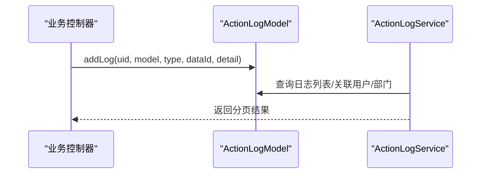

图表来源
- [ActionLogModel.php](file://process/src/models/ActionLogModel.php#L80-L90)
- [ActionLogService.php](file://process/src/services/ActionLogService.php#L79-L101)
- [Process.php](file://process/src/http/open/Process.php#L960-L1004)

章节来源
- [ActionLogModel.php](file://process/src/models/ActionLogModel.php#L1-L90)
- [ActionLogService.php](file://process/src/services/ActionLogService.php#L79-L101)
- [Process.php](file://process/src/http/open/Process.php#L960-L1004)

### 数据备份与恢复
- 流程删除备份：BackUpService.processDelete 收集流程相关表数据，写入 BackUpModel，支持后续恢复。
- 实例删除备份：BackUpService.clearTestSessions 清理测试会话并触发删除事件。
- 备份恢复：BackUpModel.reback 将备份内容回写相关表并标记已恢复。

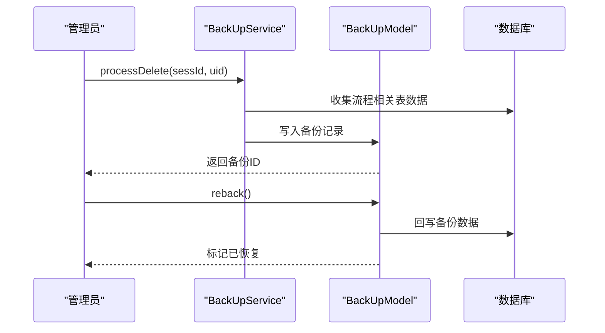

图表来源
- [BackUpService.php](file://process/src/services/BackUpService.php#L99-L128)
- [BackUpModel.php](file://process/src/models/BackUpModel.php#L46-L76)
- [database.sql](file://process/docs/sql/database.sql#L1800-L1817)

章节来源
- [BackUpService.php](file://process/src/services/BackUpService.php#L1-L128)
- [BackUpModel.php](file://process/src/models/BackUpModel.php#L1-L76)
- [database.sql](file://process/docs/sql/database.sql#L1800-L1817)

## 依赖分析
- 权限映射：permits.php 将 URI 与权限标识（如 matterCenter.matterManage、userCenter.userManage 等）绑定，控制器在 systemAuthCheck 中依据用户菜单与授权进行放行或拒绝。
- 动态口令：SystemController 在开启时通过 UA/IP/时间戳生成缓存键并校验，失败返回 TicketPermit。
- 配置管理：SiteService 负责配置合并、字段校验与安全令牌校验，确保配置一致性与安全性。
- 日志与审计：ActionLogModel/ActionLogService 提供统一的日志记录与查询能力。
- 备份恢复：BackUpService/BackUpModel/DataTableBackupModel 形成闭环，保障数据可追溯与可恢复。

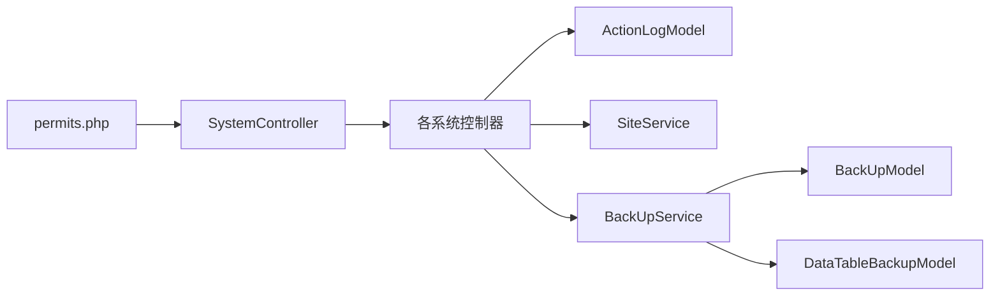

图表来源
- [permits.php](file://process/src/config/permits.php#L1-L200)
- [SystemController.php](file://process/src/http/SystemController.php#L17-L93)
- [ActionLogModel.php](file://process/src/models/ActionLogModel.php#L1-L90)
- [BackUpService.php](file://process/src/services/BackUpService.php#L1-L128)
- [BackUpModel.php](file://process/src/models/BackUpModel.php#L1-L76)
- [DataTableBackupModel.php](file://process/src/models/DataTableBackupModel.php#L1-L24)

章节来源
- [permits.php](file://process/src/config/permits.php#L1-L200)
- [SystemController.php](file://process/src/http/SystemController.php#L17-L93)

## 性能考虑
- 分页与筛选：列表接口普遍使用分页注解与多维 where 条件，建议结合索引与合理筛选减少全表扫描。
- 缓存与延迟：App 控制器在新建/更新授权后设置上下文以降低缓存延迟带来的权限不一致问题。
- 导出与批量：导出与批量操作建议异步执行并提供进度反馈，避免阻塞主线程。
- 日志与备份：高频日志与备份写入建议落盘策略优化与批量提交，降低 IO 压力。

## 故障排查指南
- 权限不足/认证失败
  - 确认 permits.php 中 URI 权限映射是否正确。
  - 若开启动态口令，检查 UA/IP/时间戳参数与缓存键生成逻辑。
  - 章节来源
    - [SystemController.php](file://process/src/http/SystemController.php#L17-L93)
    - [permits.php](file://process/src/config/permits.php#L1-L200)

- 发布失败或前置条件不满足
  - 检查事项是否包含数据组件但缺少审核节点或个人数据触发器。
  - 章节来源
    - [App.php](file://process/src/http/system/App.php#L166-L201)

- 导出异常
  - 确认导出数据为空时的兜底处理与文件存储路径。
  - 章节来源
    - [DataTable.php](file://process/src/http/system/DataTable.php#L186-L241)

- 配置保存失败
  - 检查 SiteService 的字段校验与合并逻辑，确认 subject 与 field 合法。
  - 章节来源
    - [SiteService.php](file://process/src/services/SiteService.php#L148-L190)

- 备份恢复异常
  - 检查备份记录是否已标记恢复、相关表是否可回写。
  - 章节来源
    - [BackUpModel.php](file://process/src/models/BackUpModel.php#L46-L76)
    - [BackUpService.php](file://process/src/services/BackUpService.php#L99-L128)

## 结论
系统管理控制器围绕“统一鉴权、细粒度权限、可观测审计、可恢复备份”展开，通过 permits.php 的权限映射与 SystemController 的前置校验，确保后台接口的安全可控；SiteService 提供安全可靠的配置管理；ActionLog 与 BackUp 体系完善了审计与数据保护能力。建议在生产环境中持续优化分页与导出性能，强化动态口令与安全配置的合规性检查，并定期演练备份恢复流程以提升系统韧性。