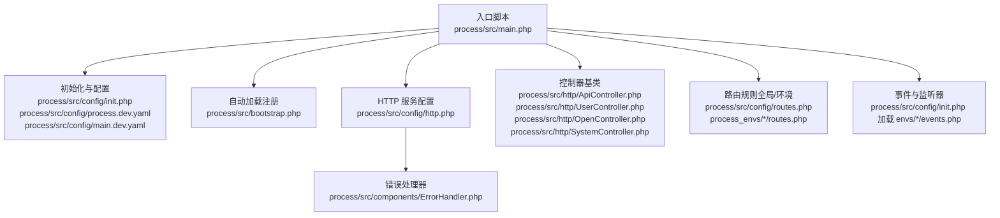
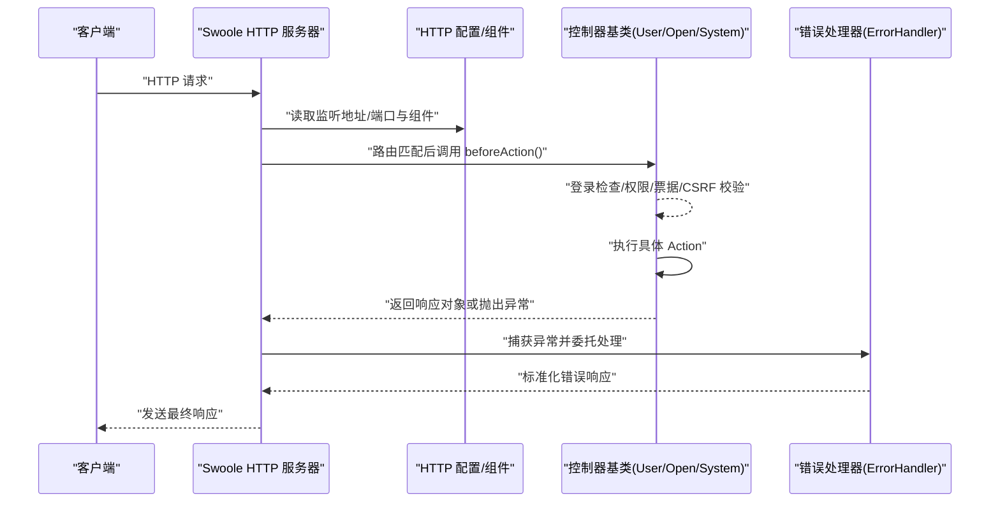
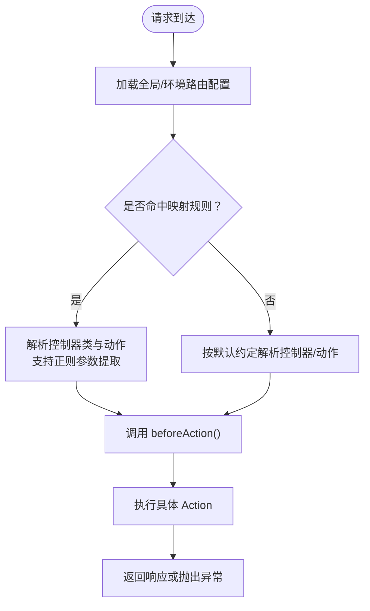
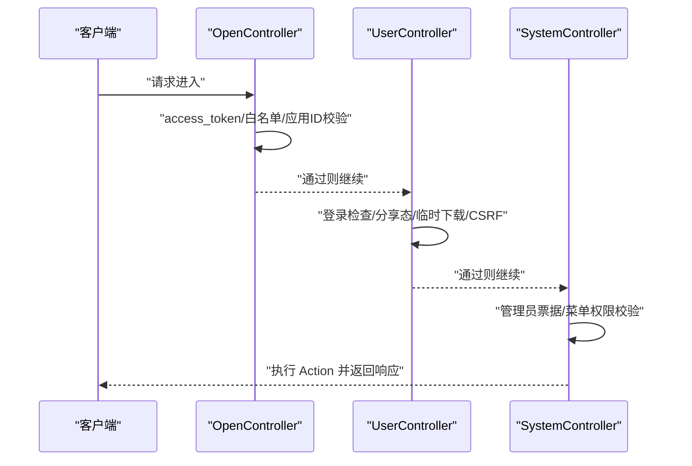
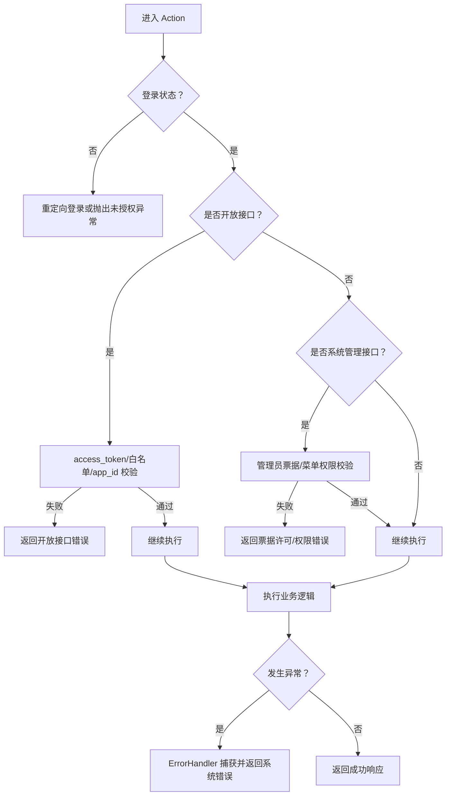
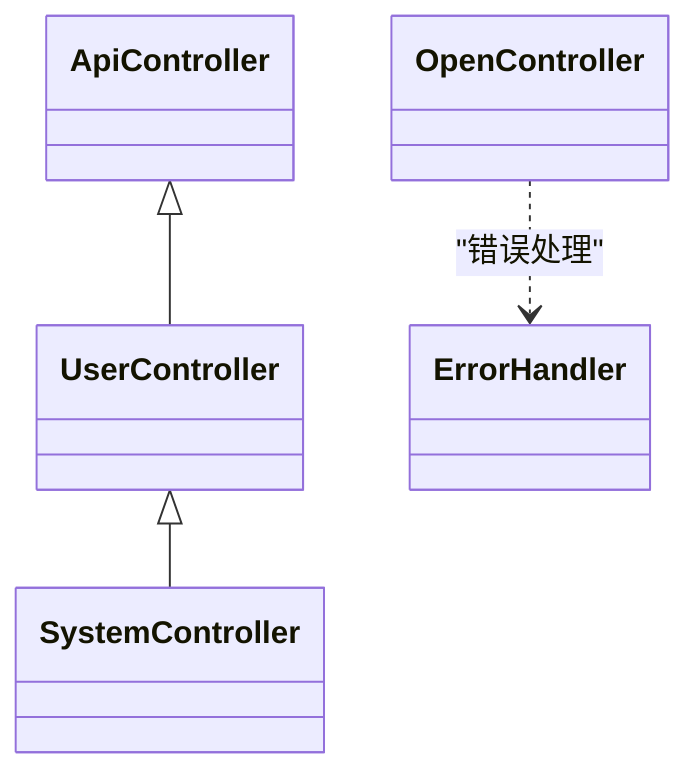

# 路由与中间件

<cite>
**本文引用的文件**
- [process\src\main.php](file://process\src\main.php)
- [process\src\bootstrap.php](file://process\src\bootstrap.php)
- [process\src\config\http.php](file://process\src\config\http.php)
- [process\src\config\init.php](file://process\src\config\init.php)
- [process\src\config\process.dev.yaml](file://process\src\config/process.dev.yaml)
- [process\src\config\main.dev.yaml](file://process\src\config/main.dev.yaml)
- [process\src\http\ApiController.php](file://process\src\http\ApiController.php)
- [process\src\http\UserController.php](file://process\src\http\UserController.php)
- [process\src\http\OpenController.php](file://process\src\http\OpenController.php)
- [process\src\http\SystemController.php](file://process\src\http\SystemController.php)
- [process\src\components\ErrorHandler.php](file://process\src\components\ErrorHandler.php)
- [process\src\config\routes.php](file://process\src\config\routes.php)
- [process_envs\sdu\product\routes.php](file://process_envs\sdu\product\routes.php)
- [process_envs\sysu_test\test\routes.php](file://process_envs\sysu_test\test\routes.php)
- [process_envs\cufe\product\routes.php](file://process_envs\cufe\product\routes.php)
- [process_envs\gmc\product\routes.php](file://process_envs\gmc\product\routes.php)
- [process_envs\cupl\product\routes.php](file://process_envs\cupl\product\routes.php)
- [process_envs\ruc\product\routes.php](file://process_envs\ruc\product\routes.php)
- [process_envs\muc\product\listeners\GetOfficeflowUrlListener.php](file://process_envs\muc\product\listeners\GetOfficeflowUrlListener.php)
- [process\src\config\permits.php](file://process\src\config\permits.php)
</cite>

## 目录
1. [引言](#引言)
2. [项目结构](#项目结构)
3. [核心组件](#核心组件)
4. [架构总览](#架构总览)
5. [详细组件分析](#详细组件分析)
6. [依赖关系分析](#依赖关系分析)
7. [性能考虑](#性能考虑)
8. [故障排查指南](#故障排查指南)
9. [结论](#结论)
10. [附录](#附录)

## 引言
本文件围绕 htdNew 项目的“路由与中间件”主题，系统性梳理其路由配置机制、URL 规则匹配、请求分发流程、中间件执行顺序、请求拦截与响应处理、路由参数提取、请求验证与异常处理策略，并结合项目中的 CORS/跨域、请求限流与安全防护实践给出优化建议与监控告警思路。文档同时提供可视化图示，帮助读者快速理解系统在不同环境下的路由与中间件行为。

## 项目结构
htdNew 采用基于 Swoole 的协程化 HTTP 服务，入口脚本负责加载配置、注册自动加载器并启动主进程；HTTP 服务配置通过 YAML 与 PHP 配置文件组合；控制器层抽象出 API、用户、开放接口与系统控制等基类，分别承担鉴权、权限与安全校验等职责；路由规则可通过全局与环境级 routes.php 文件进行扩展映射。

图表来源
- [process\src\main.php](file://process\src\main.php#L1-L25)
- [process\src\config\init.php](file://process\src\config\init.php#L1-L48)
- [process\src\config\process.dev.yaml](file://process\src\config/process.dev.yaml#L1-L88)
- [process\src\config\main.dev.yaml](file://process\src\config/main.dev.yaml#L1-L54)
- [process\src\bootstrap.php](file://process\src\bootstrap.php#L1-L40)
- [process\src\config\http.php](file://process\src\config\http.php#L1-L27)
- [process\src\components\ErrorHandler.php](file://process\src\components\ErrorHandler.php#L1-L26)
- [process\src\http\ApiController.php](file://process\src\http\ApiController.php#L1-L9)
- [process\src\http\UserController.php](file://process\src\http\UserController.php#L1-L186)
- [process\src\http\OpenController.php](file://process\src\http\OpenController.php#L1-L209)
- [process\src\http\SystemController.php](file://process\src\http\SystemController.php#L1-L95)
- [process\src\config\routes.php](file://process\src\config\routes.php#L1-L4)
- [process_envs\sdu\product\routes.php](file://process_envs\sdu\product\routes.php#L1-L12)

章节来源
- [process\src\main.php](file://process\src\main.php#L1-L25)
- [process\src\bootstrap.php](file://process\src\bootstrap.php#L1-L40)
- [process\src\config\http.php](file://process\src\config\http.php#L1-L27)
- [process\src\config\init.php](file://process\src\config\init.php#L1-L48)
- [process\src\config\process.dev.yaml](file://process\src\config/process.dev.yaml#L1-L88)
- [process\src\config\main.dev.yaml](file://process\src\config/main.dev.yaml#L1-L54)

## 核心组件
- 自动加载与入口
  - 入口脚本加载 Composer 自动加载器、启用 Swoole 协程、设置默认 HTTP Handler，并引入引导文件完成类自动加载注册。
  - 引导文件根据命名空间前缀与项目目录结构动态定位并加载类文件，支持 vendor、runtime、envs 等路径策略。
- HTTP 服务配置
  - HTTP 服务配置从 YAML 中读取监听地址与端口，并合并组件配置；错误处理统一交由 ErrorHandler。
- 控制器基类与中间件式拦截
  - ApiController：API 控制器基类。
  - UserController：提供 beforeAction 拦截，实现分享态、临时下载用户注入、登录检查、CSRF 简单校验等。
  - OpenController：开放接口控制器，提供 access_token 校验、接口白名单校验、请求日志记录等。
  - SystemController：系统管理控制器，在 UserController 基础上增加管理员票据校验与菜单权限校验。
- 错误处理
  - ErrorHandler 将数据库异常写入 Redis 队列并返回系统错误响应，便于集中监控与告警。

章节来源
- [process\src\main.php](file://process\src\main.php#L1-L25)
- [process\src\bootstrap.php](file://process\src\bootstrap.php#L1-L40)
- [process\src\config\http.php](file://process\src\config\http.php#L1-L27)
- [process\src\components\ErrorHandler.php](file://process\src\components\ErrorHandler.php#L1-L26)
- [process\src\http\ApiController.php](file://process\src\http\ApiController.php#L1-L9)
- [process\src\http\UserController.php](file://process\src\http\UserController.php#L1-L186)
- [process\src\http\OpenController.php](file://process\src\http\OpenController.php#L1-L209)
- [process\src\http\SystemController.php](file://process\src\http\SystemController.php#L1-L95)

## 架构总览
下图展示从请求进入 HTTP 服务到控制器执行、再到响应返回的整体流程，以及中间件式拦截点与错误处理位置。

图表来源
- [process\src\config\http.php](file://process\src\config\http.php#L1-L27)
- [process\src\components\ErrorHandler.php](file://process\src\components\ErrorHandler.php#L1-L26)
- [process\src\http\UserController.php](file://process\src\http\UserController.php#L1-L186)
- [process\src\http\OpenController.php](file://process\src\http\OpenController.php#L1-L209)
- [process\src\http\SystemController.php](file://process\src\http\SystemController.php#L1-L95)

## 详细组件分析

### 路由配置机制与 URL 规则匹配
- 全局与环境级路由
  - 全局路由文件位于 process/src/config/routes.php，当前为空数组，表示默认不进行额外映射。
  - 各环境可在 process_envs/<customer>/<env>/product/routes.php 定义自定义路由映射，如将 /x/index 映射到特定控制器动作，支持正则参数提取与动态替换。
- URL 匹配与请求分发
  - 项目通过控制器基类与 beforeAction 实现“中间件式”的请求拦截与分发前置逻辑，而非传统 MVC 路由表驱动。因此，URL 与控制器方法的对应关系主要体现在控制器命名与动作方法上，配合 beforeAction 完成鉴权与参数注入。
- 路由参数提取
  - 环境级 routes.php 支持正则表达式参数，如 /x/(\w+)，并在映射目标中以 $1 形式引用，用于动态定位控制器动作。

图表来源
- [process\src\config\routes.php](file://process\src\config\routes.php#L1-L4)
- [process_envs\sdu\product\routes.php](file://process_envs\sdu\product\routes.php#L1-L12)
- [process_envs\sysu_test\test\routes.php](file://process_envs\sysu_test\test\routes.php#L1-L9)
- [process_envs\cufe\product\routes.php](file://process_envs\cufe\product\routes.php#L1-L11)
- [process_envs\gmc\product\routes.php](file://process_envs\gmc\product\routes.php#L1-L11)
- [process_envs\cupl\product\routes.php](file://process_envs\cupl\product\routes.php#L1-L11)
- [process_envs\ruc\product\routes.php](file://process_envs\ruc\product\routes.php#L1-L11)

章节来源
- [process\src\config\routes.php](file://process\src\config\routes.php#L1-L4)
- [process_envs\sdu\product\routes.php](file://process_envs\sdu\product\routes.php#L1-L12)
- [process_envs\sysu_test\test\routes.php](file://process_envs\sysu_test\test\routes.php#L1-L9)
- [process_envs\cufe\product\routes.php](file://process_envs\cufe\product\routes.php#L1-L11)
- [process_envs\gmc\product\routes.php](file://process_envs\gmc\product\routes.php#L1-L11)
- [process_envs\cupl\product\routes.php](file://process_envs\cupl\product\routes.php#L1-L11)
- [process_envs\ruc\product\routes.php](file://process_envs\ruc\product\routes.php#L1-L11)

### 中间件执行顺序与请求拦截
- 执行顺序
  1) OpenController::beforeAction：开放接口鉴权（access_token、接口白名单、应用 ID 校验、请求日志）。
  2) UserController::beforeAction：登录检查、分享态与临时下载用户注入、CSRF 简单校验。
  3) SystemController::beforeAction：管理员票据校验与菜单权限校验。
- 请求拦截与响应处理
  - 在拦截阶段，若校验失败会直接返回错误响应或抛出异常；成功则继续执行具体 Action。
  - 错误处理统一由 ErrorHandler 捕获并输出系统错误响应，数据库异常会写入 Redis 队列以便监控。

图表来源
- [process\src\http\OpenController.php](file://process\src\http\OpenController.php#L1-L209)
- [process\src\http\UserController.php](file://process\src\http\UserController.php#L1-L186)
- [process\src\http\SystemController.php](file://process\src\http\SystemController.php#L1-L95)

章节来源
- [process\src\http\OpenController.php](file://process\src\http\OpenController.php#L1-L209)
- [process\src\http\UserController.php](file://process\src\http\UserController.php#L1-L186)
- [process\src\http\SystemController.php](file://process\src\http\SystemController.php#L1-L95)

### 请求验证与异常处理策略
- 登录与权限
  - UserController::checkLogin：未登录时根据不同场景重定向至登录页或抛出未授权异常；对校外未验证用户在开启强制验证时进行信息完整性校验。
  - SystemController::systemAuthCheck：管理员票据校验失败时返回带票据许可响应；超级管理员与有菜单权限的用户放行。
- CSRF 保护
  - UserController 对 POST 请求进行 Referer 校验，结合白名单主机配置进行宽松或严格校验。
- 开放接口鉴权
  - OpenController::beforeAction：access_token 缺失或无效直接返回开放接口错误；接口白名单与 app_id 校验失败返回相应错误；记录请求日志。
- 异常处理
  - ErrorHandler：捕获数据库异常并写入 Redis 队列，随后返回系统错误响应；其他异常同样返回系统错误响应。

图表来源
- [process\src\http\UserController.php](file://process\src\http\UserController.php#L1-L186)
- [process\src\http\SystemController.php](file://process\src\http\SystemController.php#L1-L95)
- [process\src\http\OpenController.php](file://process\src\http\OpenController.php#L1-L209)
- [process\src\components\ErrorHandler.php](file://process\src\components\ErrorHandler.php#L1-L26)

章节来源
- [process\src\http\UserController.php](file://process\src\http\UserController.php#L1-L186)
- [process\src\http\SystemController.php](file://process\src\http\SystemController.php#L1-L95)
- [process\src\http\OpenController.php](file://process\src\http\OpenController.php#L1-L209)
- [process\src\components\ErrorHandler.php](file://process\src\components\ErrorHandler.php#L1-L26)

### CORS 跨域处理、请求限流与安全防护
- CORS 跨域
  - 项目未在仓库中发现显式的 CORS 中间件或响应头设置逻辑。建议在 HTTP 层统一添加 CORS 中间件，按环境配置允许的来源、方法与头部，并对预检请求进行快速放行。
- 请求限流
  - 仓库未提供内置限流中间件。建议在 OpenController 或更底层的中间件层加入基于 IP/接口维度的限流策略（如漏斗/令牌桶），并结合 Redis 计数与过期策略实现。
- 安全防护
  - CSRF：UserController 已对 POST 请求进行 Referer 校验与白名单配置，建议在环境配置中完善白名单列表并根据需要启用更严格的校验。
  - 权限与票据：SystemController 的管理员票据校验与菜单权限校验提供了强约束，建议结合 permits.php 的权限映射进一步细化到具体 URI 的权限控制。
  - 敏感信息：建议对日志与错误响应进行脱敏处理，避免泄露敏感参数。

章节来源
- [process\src\http\UserController.php](file://process\src\http\UserController.php#L1-L186)
- [process\src\http\SystemController.php](file://process\src\http\SystemController.php#L1-L95)
- [process\src\config\permits.php](file://process\src\config\permits.php#L370-L385)

### 路由参数提取、请求验证与异常处理实践要点
- 参数提取
  - 环境级 routes.php 支持正则参数，映射目标中使用 $1 等占位符动态定位控制器动作，适合短路径别名与参数化路由。
- 请求验证
  - 在 OpenController 与 UserController 的 beforeAction 中完成鉴权与校验，确保在业务逻辑之前拦截非法请求。
- 异常处理
  - 使用 ErrorHandler 统一处理系统错误，数据库异常写入 Redis 队列，便于集中监控与告警。

章节来源
- [process_envs\sdu\product\routes.php](file://process_envs\sdu\product\routes.php#L1-L12)
- [process\src\http\OpenController.php](file://process\src\http\OpenController.php#L1-L209)
- [process\src\http\UserController.php](file://process\src\http\UserController.php#L1-L186)
- [process\src\components\ErrorHandler.php](file://process\src\components\ErrorHandler.php#L1-L26)

## 依赖关系分析
- 组件耦合
  - 控制器基类之间存在继承关系：ApiController 为基础，UserController 扩展之，SystemController 再扩展 UserController；OpenController 独立于用户体系但共享基类能力。
  - 错误处理与 HTTP 配置通过配置文件合并，形成统一的错误处理入口。
- 外部依赖
  - Swoole 协程运行时、YAML 解析、Redis、数据库连接等作为外部依赖参与运行时行为。
- 事件与监听器
  - 初始化阶段会加载 envs/*/events.php 并注册监听器，可用于动态修改请求 URI 等场景（如示例中的 GetOfficeflowUrlListener）。

图表来源
- [process\src\http\ApiController.php](file://process\src\http\ApiController.php#L1-L9)
- [process\src\http\UserController.php](file://process\src\http\UserController.php#L1-L186)
- [process\src\http\OpenController.php](file://process\src\http\OpenController.php#L1-L209)
- [process\src\http\SystemController.php](file://process\src\http\SystemController.php#L1-L95)
- [process\src\components\ErrorHandler.php](file://process\src\components\ErrorHandler.php#L1-L26)

章节来源
- [process\src\http\ApiController.php](file://process\src\http\ApiController.php#L1-L9)
- [process\src\http\UserController.php](file://process\src\http\UserController.php#L1-L186)
- [process\src\http\OpenController.php](file://process\src\http\OpenController.php#L1-L209)
- [process\src\http\SystemController.php](file://process\src\http\SystemController.php#L1-L95)
- [process\src\components\ErrorHandler.php](file://process\src\components\ErrorHandler.php#L1-L26)
- [process\src\config\init.php](file://process\src\config\init.php#L1-L48)
- [process_envs\muc\product\listeners\GetOfficeflowUrlListener.php](file://process_envs\muc\product\listeners\GetOfficeflowUrlListener.php#L1-L11)

## 性能考虑
- 协程化与 I/O
  - 入口脚本启用 Swoole 协程与默认 HTTP Handler，有助于提升并发与 I/O 密集型场景性能。
- 路由与中间件
  - 采用控制器基类 + beforeAction 的中间件式拦截，减少重复逻辑，有利于统一性能与安全策略。
- 缓存策略
  - 建议在控制器层对热点数据使用 Redis 缓存，结合 CacheKeyHelper 生成稳定键值，降低数据库压力。
- 监控与告警
  - 数据库异常写入 Redis 队列，建议接入监控系统定期拉取并告警；同时对慢查询、错误率与响应时间建立指标。

章节来源
- [process\src\main.php](file://process\src\main.php#L1-L25)
- [process\src\components\ErrorHandler.php](file://process\src\components\ErrorHandler.php#L1-L26)

## 故障排查指南
- 登录与权限相关问题
  - 若出现未授权或重定向登录，检查 UserController::checkLogin 的登录状态与重定向逻辑，确认用户身份与强制验证配置。
  - 管理员票据校验失败时，确认 SystemController 的票据生成与校验流程，以及 Cookie 前缀与环境变量。
- 开放接口鉴权失败
  - 检查 OpenController::beforeAction 的 access_token、接口白名单与 app_id 校验逻辑，确认开发者信息与接口授权范围。
- CSRF 校验失败
  - 核对 UserController 的 Referer 校验与白名单配置，确保前端来源与白名单一致。
- 数据库异常
  - 查看 Redis 队列中的错误条目，定位 SQL 与参数，结合日志进行修复。
- 事件与监听器
  - 若请求 URI 被动态修改，检查 envs/*/events.php 是否正确注册监听器并执行。

章节来源
- [process\src\http\UserController.php](file://process\src\http\UserController.php#L1-L186)
- [process\src\http\SystemController.php](file://process\src\http\SystemController.php#L1-L95)
- [process\src\http\OpenController.php](file://process\src\http\OpenController.php#L1-L209)
- [process\src\components\ErrorHandler.php](file://process\src\components\ErrorHandler.php#L1-L26)
- [process\src\config\init.php](file://process\src\config\init.php#L1-L48)
- [process_envs\muc\product\listeners\GetOfficeflowUrlListener.php](file://process_envs\muc\product\listeners\GetOfficeflowUrlListener.php#L1-L11)

## 结论
htdNew 项目的路由与中间件以“控制器基类 + beforeAction”的中间件式拦截为核心，结合环境级路由映射与统一错误处理，实现了灵活、可扩展且易于维护的请求处理链路。建议在现有基础上补充 CORS、限流与更细粒度的安全策略，并完善监控与告警体系，以进一步提升系统的安全性与稳定性。

## 附录
- 关键配置项参考
  - HTTP 监听与端口：来自 YAML 配置文件，由 HTTP 配置文件读取并应用。
  - 项目主机与路径：在初始化阶段定义，供控制器与中间件使用。
  - 权限映射：通过 permits.php 对具体 URI 进行权限控制，建议与控制器拦截逻辑协同使用。

章节来源
- [process\src\config\http.php](file://process\src\config\http.php#L1-L27)
- [process\src\config\init.php](file://process\src\config\init.php#L1-L48)
- [process\src\config\main.dev.yaml](file://process\src\config/main.dev.yaml#L1-L54)
- [process\src\config\permits.php](file://process\src\config\permits.php#L370-L385)