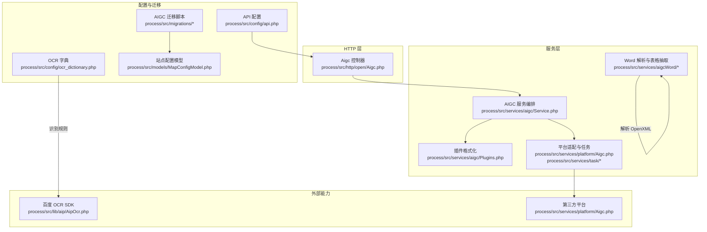
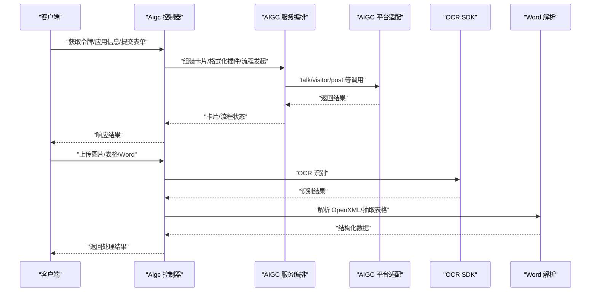
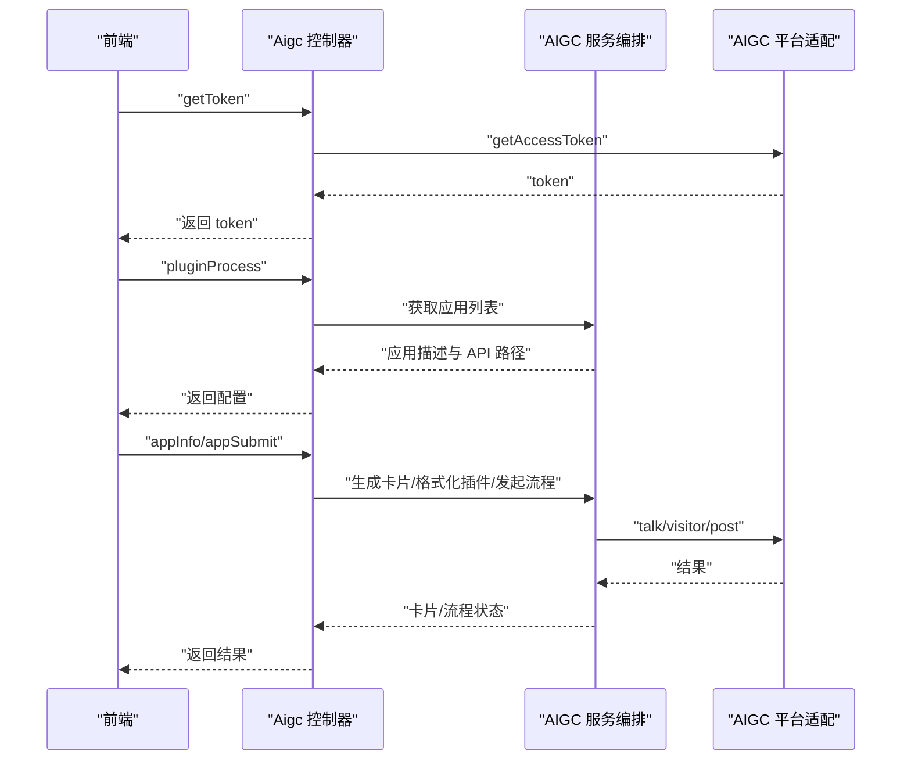
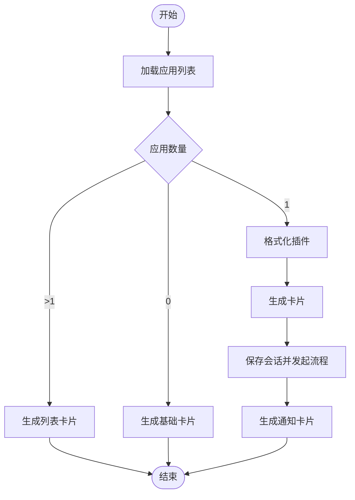
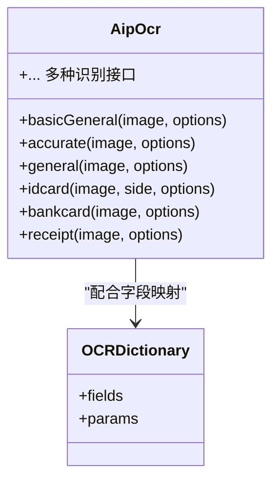
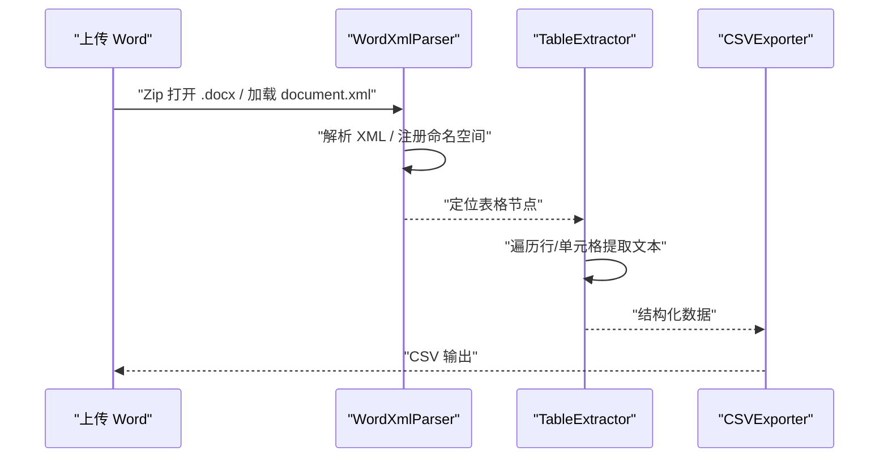
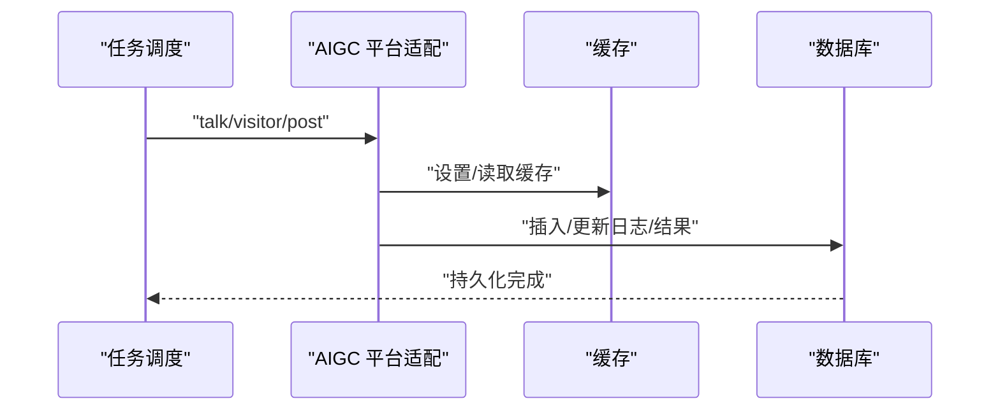
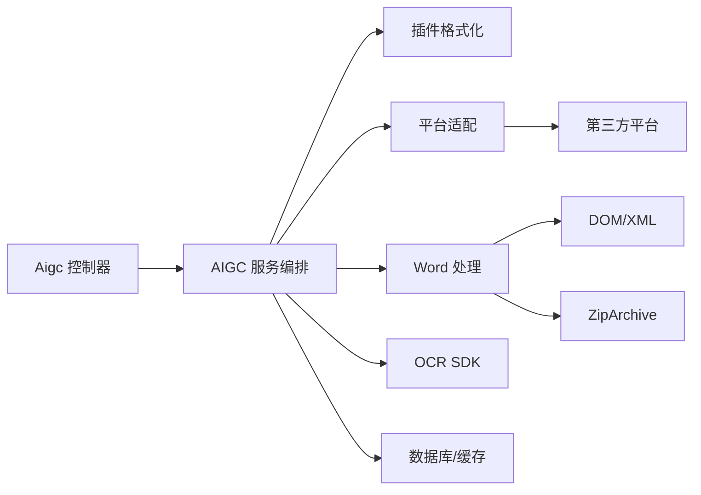

# AI 服务

<cite>
**本文引用的文件**
- [process/src/http/open/Aigc.php](file://process/src/http/open/Aigc.php)
- [process/src/services/aigc/Service.php](file://process/src/services/aigc/Service.php)
- [process/src/services/aigc/Plugins.php](file://process/src/services/aigc/Plugins.php)
- [process/src/lib/aip/AipOcr.php](file://process/src/lib/aip/AipOcr.php)
- [process/src/config/ocr_dictionary.php](file://process/src/config/ocr_dictionary.php)
- [process/src/services/aigcWord/WordXmlParser.php](file://process/src/services/aigcWord/WordXmlParser.php)
- [process/src/services/aigcWord/TableExtractor.php](file://process/src/services/aigcWord/TableExtractor.php)
- [process/src/services/aigcWord/TableInfo.php](file://process/src/services/aigcWord/TableInfo.php)
- [process/src/services/aigcWord/CellExtractor.php](file://process/src/services/aigcWord/CellExtractor.php)
- [process/src/services/aigcWord/Cell/CellInfo.php](file://process/src/services/aigcWord/Cell/CellInfo.php)
- [process/src/services/aigcWord/Cell/CellPBody.php](file://process/src/services/aigcWord/Cell/CellPBody.php)
- [process/src/services/aigcWord/Cell/CellRBody.php](file://process/src/services/aigcWord/Cell/CellRBody.php)
- [process/src/services/aigcWord/CSVExporter.php](file://process/src/services/aigcWord/CSVExporter.php)
- [process/src/services/platform/Aigc.php](file://process/src/services/platform/Aigc.php)
- [process/src/services/task/Aigc.php](file://process/src/services/task/Aigc.php)
- [process/src/services/task/AigcPushV2.php](file://process/src/services/task/AigcPushV2.php)
- [process/src/services/task/AiApprove.php](file://process/src/services/task/AiApprove.php)
- [process/src/models/MapConfigModel.php](file://process/src/models/MapConfigModel.php)
- [process/src/migrations/migration_20250212_153554_aigc_intelligence_agent.php](file://process/src/migrations/migration_20250212_153554_aigc_intelligence_agent.php)
- [process/src/migrations/migration_20250302_aigc.php](file://process/src/migrations/migration_20250302_aigc.php)
- [process/src/config/api.php](file://process/src/config/api.php)
</cite>

## 目录
1. [简介](#简介)
2. [项目结构](#项目结构)
3. [核心组件](#核心组件)
4. [架构总览](#架构总览)
5. [详细组件分析](#详细组件分析)
6. [依赖关系分析](#依赖关系分析)
7. [性能考虑](#性能考虑)
8. [故障排查指南](#故障排查指南)
9. [结论](#结论)
10. [附录](#附录)

## 简介
本文件面向 htdNew 项目的 AI 服务，系统化梳理人工智能模型集成、AIGC 内容生成、Word 文档处理与 OCR 技术应用。重点覆盖以下方面：
- AI 模型管理与调用机制：通过第三方平台抽象统一接入，支持对话、访客问答、知识检索与智能推送等能力。
- AIGC 内容生成：提供智能体应用列表、卡片化交互、表单联动与流程发起能力。
- OCR 技术应用：封装百度 OCR SDK，覆盖通用识别、身份证、银行卡、票据、表格、医疗票据等多场景。
- Word 文档处理：基于 OpenXML 解析与表格抽取，支持单元格级信息提取与 CSV 导出。
- 接口设计与参数配置：统一开放接口、认证与鉴权、插件化卡片协议。
- 性能监控与扩展开发：定时任务、日志与缓存、迁移脚本与配置项。

## 项目结构
AI 服务主要分布在以下模块：
- HTTP 层：开放接口控制器，提供令牌获取、智能体应用与流程卡片对接。
- 服务层：AIGC 服务编排、插件格式化、Word 文档解析与表格抽取、平台适配与任务调度。
- 配置与迁移：OCR 字典、站点配置、AIGC 智能体迁移与定时任务配置。
- 第三方平台适配：统一 AIGC 平台访问器，封装 talk/visitor/post 等调用。

图表来源
- [process/src/http/open/Aigc.php](file://process/src/http/open/Aigc.php#L1-L338)
- [process/src/services/aigc/Service.php](file://process/src/services/aigc/Service.php#L1-L235)
- [process/src/services/aigc/Plugins.php](file://process/src/services/aigc/Plugins.php#L1-L282)
- [process/src/services/aigcWord/WordXmlParser.php](file://process/src/services/aigcWord/WordXmlParser.php#L1-L218)
- [process/src/services/platform/Aigc.php](file://process/src/services/platform/Aigc.php#L1-L200)
- [process/src/services/task/Aigc.php](file://process/src/services/task/Aigc.php#L1-L32)
- [process/src/services/task/AigcPushV2.php](file://process/src/services/task/AigcPushV2.php#L1-L46)
- [process/src/services/task/AiApprove.php](file://process/src/services/task/AiApprove.php#L1-L34)
- [process/src/config/ocr_dictionary.php](file://process/src/config/ocr_dictionary.php#L1-L188)
- [process/src/lib/aip/AipOcr.php](file://process/src/lib/aip/AipOcr.php#L1-L800)
- [process/src/models/MapConfigModel.php](file://process/src/models/MapConfigModel.php#L1734-L1757)
- [process/src/migrations/migration_20250212_153554_aigc_intelligence_agent.php](file://process/src/migrations/migration_20250212_153554_aigc_intelligence_agent.php#L1-L356)
- [process/src/migrations/migration_20250302_aigc.php](file://process/src/migrations/migration_20250302_aigc.php#L1-L38)
- [process/src/config/api.php](file://process/src/config/api.php#L731-L773)

章节来源
- [process/src/http/open/Aigc.php](file://process/src/http/open/Aigc.php#L1-L338)
- [process/src/services/aigc/Service.php](file://process/src/services/aigc/Service.php#L1-L235)
- [process/src/services/aigc/Plugins.php](file://process/src/services/aigc/Plugins.php#L1-L282)
- [process/src/services/aigcWord/WordXmlParser.php](file://process/src/services/aigcWord/WordXmlParser.php#L1-L218)
- [process/src/services/platform/Aigc.php](file://process/src/services/platform/Aigc.php#L1-L200)
- [process/src/services/task/Aigc.php](file://process/src/services/task/Aigc.php#L1-L32)
- [process/src/services/task/AigcPushV2.php](file://process/src/services/task/AigcPushV2.php#L1-L46)
- [process/src/services/task/AiApprove.php](file://process/src/services/task/AiApprove.php#L1-L34)
- [process/src/config/ocr_dictionary.php](file://process/src/config/ocr_dictionary.php#L1-L188)
- [process/src/lib/aip/AipOcr.php](file://process/src/lib/aip/AipOcr.php#L1-L800)
- [process/src/models/MapConfigModel.php](file://process/src/models/MapConfigModel.php#L1734-L1757)
- [process/src/migrations/migration_20250212_153554_aigc_intelligence_agent.php](file://process/src/migrations/migration_20250212_153554_aigc_intelligence_agent.php#L1-L356)
- [process/src/migrations/migration_20250302_aigc.php](file://process/src/migrations/migration_20250302_aigc.php#L1-L38)
- [process/src/config/api.php](file://process/src/config/api.php#L731-L773)

## 核心组件
- Aigc 控制器：提供令牌获取、智能体应用描述与流程卡片对接接口，支撑前端卡片化交互。
- AIGC 服务编排：负责应用列表组装、卡片生成、插件格式化、流程提交与通知卡片。
- 插件格式化：将表单组件转换为大模型可理解的字段结构，支持输入框、日期、下拉、单选、多选等。
- Word 文档处理：基于 Zip + DOM 解析 OpenXML，抽取表格与单元格信息，支持导出 CSV。
- OCR 识别：封装百度 OCR SDK，覆盖通用识别、身份证、银行卡、票据、表格、医疗票据等。
- 平台适配与任务：统一 AIGC 平台访问器，封装 talk/visitor/post 等调用；任务调度支持知识库推送、访客问答、审批辅助等。
- 配置与迁移：OCR 字典、站点配置、AIGC 智能体迁移与定时任务。

章节来源
- [process/src/http/open/Aigc.php](file://process/src/http/open/Aigc.php#L1-L338)
- [process/src/services/aigc/Service.php](file://process/src/services/aigc/Service.php#L1-L235)
- [process/src/services/aigc/Plugins.php](file://process/src/services/aigc/Plugins.php#L1-L282)
- [process/src/services/aigcWord/WordXmlParser.php](file://process/src/services/aigcWord/WordXmlParser.php#L1-L218)
- [process/src/lib/aip/AipOcr.php](file://process/src/lib/aip/AipOcr.php#L1-L800)
- [process/src/config/ocr_dictionary.php](file://process/src/config/ocr_dictionary.php#L1-L188)
- [process/src/services/platform/Aigc.php](file://process/src/services/platform/Aigc.php#L1-L200)
- [process/src/services/task/Aigc.php](file://process/src/services/task/Aigc.php#L1-L32)
- [process/src/services/task/AigcPushV2.php](file://process/src/services/task/AigcPushV2.php#L1-L46)
- [process/src/services/task/AiApprove.php](file://process/src/services/task/AiApprove.php#L1-L34)
- [process/src/models/MapConfigModel.php](file://process/src/models/MapConfigModel.php#L1734-L1757)
- [process/src/migrations/migration_20250212_153554_aigc_intelligence_agent.php](file://process/src/migrations/migration_20250212_153554_aigc_intelligence_agent.php#L1-L356)
- [process/src/migrations/migration_20250302_aigc.php](file://process/src/migrations/migration_20250302_aigc.php#L1-L38)

## 架构总览
AI 服务整体采用“HTTP 控制器 → 服务编排 → 平台适配/任务调度 → 外部能力”的分层架构。Aigc 控制器对外暴露统一接口，内部通过 AIGC 服务编排卡片与流程，借助平台适配器调用第三方大模型能力，并结合 OCR 与 Word 处理完成内容生成与结构化解析。

图表来源
- [process/src/http/open/Aigc.php](file://process/src/http/open/Aigc.php#L1-L338)
- [process/src/services/aigc/Service.php](file://process/src/services/aigc/Service.php#L1-L235)
- [process/src/services/platform/Aigc.php](file://process/src/services/platform/Aigc.php#L1-L200)
- [process/src/lib/aip/AipOcr.php](file://process/src/lib/aip/AipOcr.php#L1-L800)
- [process/src/services/aigcWord/WordXmlParser.php](file://process/src/services/aigcWord/WordXmlParser.php#L1-L218)

## 详细组件分析

### Aigc 控制器与接口设计
- 令牌获取：通过平台适配器获取第三方令牌，供前端鉴权。
- 智能体应用描述：返回应用列表与 API 路径，支持前端卡片化展示与交互。
- 应用信息与提交：根据应用与表单配置生成卡片，支持表单数据合并与流程发起。
- 数据卡片：返回表格型数据卡片，便于展示结构化结果。

图表来源
- [process/src/http/open/Aigc.php](file://process/src/http/open/Aigc.php#L1-L338)
- [process/src/services/aigc/Service.php](file://process/src/services/aigc/Service.php#L1-L235)
- [process/src/services/platform/Aigc.php](file://process/src/services/platform/Aigc.php#L1-L200)

章节来源
- [process/src/http/open/Aigc.php](file://process/src/http/open/Aigc.php#L1-L338)

### AIGC 服务编排与插件格式化
- 应用列表与卡片生成：根据应用状态与权限筛选，生成卡片或通用列表卡片。
- 插件格式化：将表单组件映射为大模型可理解的字段结构，支持输入、日期、下拉、单选、多选等。
- 流程提交：合并启动数据与用户填写，保存会话并发起流程，返回通知卡片。

图表来源
- [process/src/services/aigc/Service.php](file://process/src/services/aigc/Service.php#L1-L235)
- [process/src/services/aigc/Plugins.php](file://process/src/services/aigc/Plugins.php#L1-L282)

章节来源
- [process/src/services/aigc/Service.php](file://process/src/services/aigc/Service.php#L1-L235)
- [process/src/services/aigc/Plugins.php](file://process/src/services/aigc/Plugins.php#L1-L282)

### OCR 技术应用
- 百度 OCR SDK：封装通用识别、高精度识别、表格识别、身份证、银行卡、票据、医疗票据、二维码、手写体等多种接口。
- OCR 字典：定义不同票据类型的字段映射与参数说明，便于统一识别结果结构化。

图表来源
- [process/src/lib/aip/AipOcr.php](file://process/src/lib/aip/AipOcr.php#L1-L800)
- [process/src/config/ocr_dictionary.php](file://process/src/config/ocr_dictionary.php#L1-L188)

章节来源
- [process/src/lib/aip/AipOcr.php](file://process/src/lib/aip/AipOcr.php#L1-L800)
- [process/src/config/ocr_dictionary.php](file://process/src/config/ocr_dictionary.php#L1-L188)

### Word 文档处理与表格抽取
- OpenXML 解析：从 .docx 中提取 document.xml，注册命名空间，定位表格节点。
- 表格抽取：遍历表格行与单元格，提取文本内容，支持导出为二维数组或 CSV。
- 单元格建模：CellInfo/CellPBody/CellRBody 组件化描述段落与运行体，便于复杂表格结构处理。

图表来源
- [process/src/services/aigcWord/WordXmlParser.php](file://process/src/services/aigcWord/WordXmlParser.php#L1-L218)
- [process/src/services/aigcWord/TableExtractor.php](file://process/src/services/aigcWord/TableExtractor.php#L1-L200)
- [process/src/services/aigcWord/TableInfo.php](file://process/src/services/aigcWord/TableInfo.php#L1-L200)
- [process/src/services/aigcWord/CellExtractor.php](file://process/src/services/aigcWord/CellExtractor.php#L1-L200)
- [process/src/services/aigcWord/Cell/CellInfo.php](file://process/src/services/aigcWord/Cell/CellInfo.php#L1-L200)
- [process/src/services/aigcWord/Cell/CellPBody.php](file://process/src/services/aigcWord/Cell/CellPBody.php#L1-L200)
- [process/src/services/aigcWord/Cell/CellRBody.php](file://process/src/services/aigcWord/Cell/CellRBody.php#L1-L200)
- [process/src/services/aigcWord/CSVExporter.php](file://process/src/services/aigcWord/CSVExporter.php#L1-L200)

章节来源
- [process/src/services/aigcWord/WordXmlParser.php](file://process/src/services/aigcWord/WordXmlParser.php#L1-L218)
- [process/src/services/aigcWord/TableExtractor.php](file://process/src/services/aigcWord/TableExtractor.php#L1-L200)
- [process/src/services/aigcWord/TableInfo.php](file://process/src/services/aigcWord/TableInfo.php#L1-L200)
- [process/src/services/aigcWord/CellExtractor.php](file://process/src/services/aigcWord/CellExtractor.php#L1-L200)
- [process/src/services/aigcWord/Cell/CellInfo.php](file://process/src/services/aigcWord/Cell/CellInfo.php#L1-L200)
- [process/src/services/aigcWord/Cell/CellPBody.php](file://process/src/services/aigcWord/Cell/CellPBody.php#L1-L200)
- [process/src/services/aigcWord/Cell/CellRBody.php](file://process/src/services/aigcWord/Cell/CellRBody.php#L1-L200)
- [process/src/services/aigcWord/CSVExporter.php](file://process/src/services/aigcWord/CSVExporter.php#L1-L200)

### 平台适配与任务调度
- 平台适配：统一 talk/visitor/post 等调用，支持缓存与令牌管理。
- 任务调度：Aigc/AigcPushV2/AiApprove 等任务，分别负责对话结果缓存、知识库推送与审批辅助。

图表来源
- [process/src/services/platform/Aigc.php](file://process/src/services/platform/Aigc.php#L1-L200)
- [process/src/services/task/Aigc.php](file://process/src/services/task/Aigc.php#L1-L32)
- [process/src/services/task/AigcPushV2.php](file://process/src/services/task/AigcPushV2.php#L1-L46)
- [process/src/services/task/AiApprove.php](file://process/src/services/task/AiApprove.php#L1-L34)

章节来源
- [process/src/services/platform/Aigc.php](file://process/src/services/platform/Aigc.php#L1-L200)
- [process/src/services/task/Aigc.php](file://process/src/services/task/Aigc.php#L1-L32)
- [process/src/services/task/AigcPushV2.php](file://process/src/services/task/AigcPushV2.php#L1-L46)
- [process/src/services/task/AiApprove.php](file://process/src/services/task/AiApprove.php#L1-L34)

### 站点配置与迁移
- 站点配置：MapConfigModel 支持 AIGC 门户配置与智能体应用展示位配置。
- 迁移脚本：初始化定时任务、第三方平台配置、AIGC 日志表与推荐内容等。

章节来源
- [process/src/models/MapConfigModel.php](file://process/src/models/MapConfigModel.php#L1734-L1757)
- [process/src/migrations/migration_20250212_153554_aigc_intelligence_agent.php](file://process/src/migrations/migration_20250212_153554_aigc_intelligence_agent.php#L1-L356)
- [process/src/migrations/migration_20250302_aigc.php](file://process/src/migrations/migration_20250302_aigc.php#L1-L38)

## 依赖关系分析
- 控制器依赖服务编排与平台适配，服务编排依赖插件格式化与模型调用。
- Word 处理依赖 DOM 与 ZipArchive，OCR 依赖百度 SDK。
- 配置与迁移脚本贯穿站点配置与平台初始化。

图表来源
- [process/src/http/open/Aigc.php](file://process/src/http/open/Aigc.php#L1-L338)
- [process/src/services/aigc/Service.php](file://process/src/services/aigc/Service.php#L1-L235)
- [process/src/services/aigc/Plugins.php](file://process/src/services/aigc/Plugins.php#L1-L282)
- [process/src/services/aigcWord/WordXmlParser.php](file://process/src/services/aigcWord/WordXmlParser.php#L1-L218)
- [process/src/lib/aip/AipOcr.php](file://process/src/lib/aip/AipOcr.php#L1-L800)
- [process/src/services/platform/Aigc.php](file://process/src/services/platform/Aigc.php#L1-L200)

## 性能考虑
- 缓存策略：对话结果通过缓存键存储，减少重复调用与第三方平台压力。
- 异步任务：知识库推送与检测通过定时任务异步执行，避免阻塞主流程。
- 解析优化：Word 解析时注册命名空间并尝试多种 XPath 查询，提升表格定位成功率。
- OCR 参数：根据场景选择识别精度与接口，平衡速度与准确率。

章节来源
- [process/src/services/task/Aigc.php](file://process/src/services/task/Aigc.php#L1-L32)
- [process/src/services/aigcWord/WordXmlParser.php](file://process/src/services/aigcWord/WordXmlParser.php#L1-L218)
- [process/src/lib/aip/AipOcr.php](file://process/src/lib/aip/AipOcr.php#L1-L800)

## 故障排查指南
- 令牌获取失败：检查平台适配器配置与第三方平台可用性。
- 应用信息为空：确认应用状态、权限与可见范围。
- 表单提交异常：查看流程发起异常日志，关注出口/经办人缺失提示。
- OCR 识别失败：检查图片质量、接口参数与网络连通性。
- Word 解析异常：确认 .docx 文件完整性与命名空间注册，必要时启用调试输出。

章节来源
- [process/src/http/open/Aigc.php](file://process/src/http/open/Aigc.php#L1-L338)
- [process/src/services/platform/Aigc.php](file://process/src/services/platform/Aigc.php#L1-L200)
- [process/src/services/aigcWord/WordXmlParser.php](file://process/src/services/aigcWord/WordXmlParser.php#L1-L218)
- [process/src/lib/aip/AipOcr.php](file://process/src/lib/aip/AipOcr.php#L1-L800)

## 结论
htdNew 的 AI 服务以“卡片化交互 + 平台适配 + OCR/Word 处理”为核心，实现了从模型调用到内容生成与结构化解析的完整链路。通过统一的接口设计与任务调度，既满足了智能体应用与流程审批的业务需求，也为 OCR 与文档处理提供了可扩展的技术基座。

## 附录
- 接口与配置参考路径
  - [process/src/config/api.php](file://process/src/config/api.php#L731-L773)
  - [process/src/http/open/Aigc.php](file://process/src/http/open/Aigc.php#L1-L338)
  - [process/src/services/aigc/Service.php](file://process/src/services/aigc/Service.php#L1-L235)
  - [process/src/services/aigc/Plugins.php](file://process/src/services/aigc/Plugins.php#L1-L282)
  - [process/src/lib/aip/AipOcr.php](file://process/src/lib/aip/AipOcr.php#L1-L800)
  - [process/src/config/ocr_dictionary.php](file://process/src/config/ocr_dictionary.php#L1-L188)
  - [process/src/services/aigcWord/WordXmlParser.php](file://process/src/services/aigcWord/WordXmlParser.php#L1-L218)
  - [process/src/services/platform/Aigc.php](file://process/src/services/platform/Aigc.php#L1-L200)
  - [process/src/services/task/Aigc.php](file://process/src/services/task/Aigc.php#L1-L32)
  - [process/src/services/task/AigcPushV2.php](file://process/src/services/task/AigcPushV2.php#L1-L46)
  - [process/src/services/task/AiApprove.php](file://process/src/services/task/AiApprove.php#L1-L34)
  - [process/src/models/MapConfigModel.php](file://process/src/models/MapConfigModel.php#L1734-L1757)
  - [process/src/migrations/migration_20250212_153554_aigc_intelligence_agent.php](file://process/src/migrations/migration_20250212_153554_aigc_intelligence_agent.php#L1-L356)
  - [process/src/migrations/migration_20250302_aigc.php](file://process/src/migrations/migration_20250302_aigc.php#L1-L38)