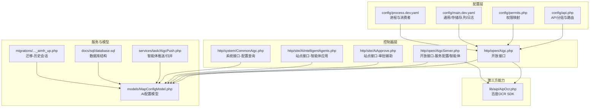
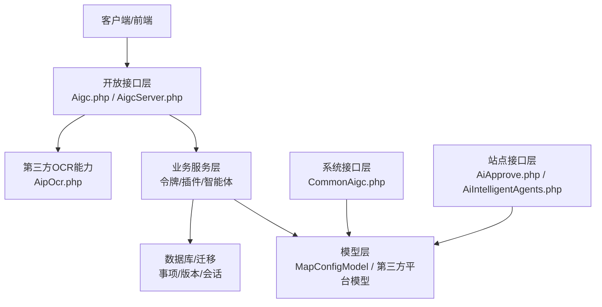
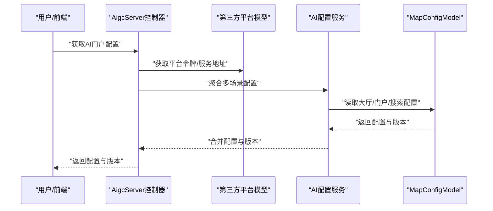
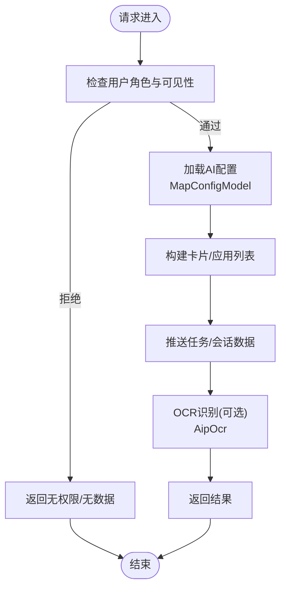
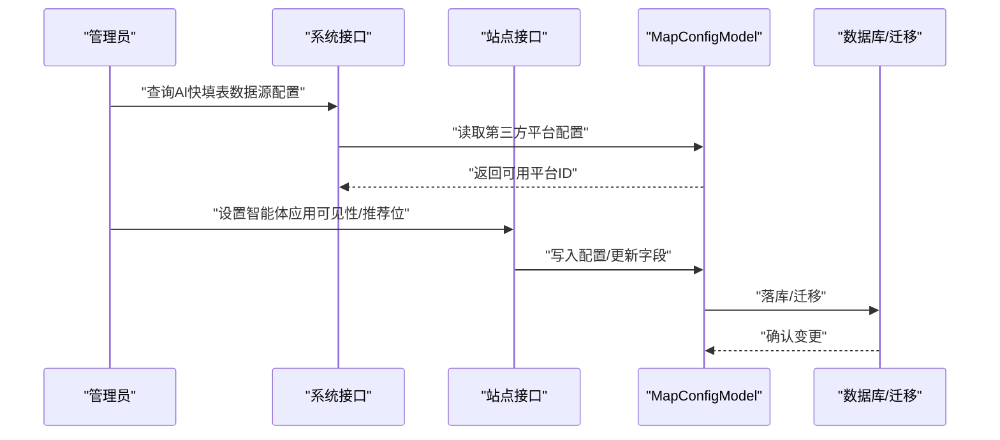
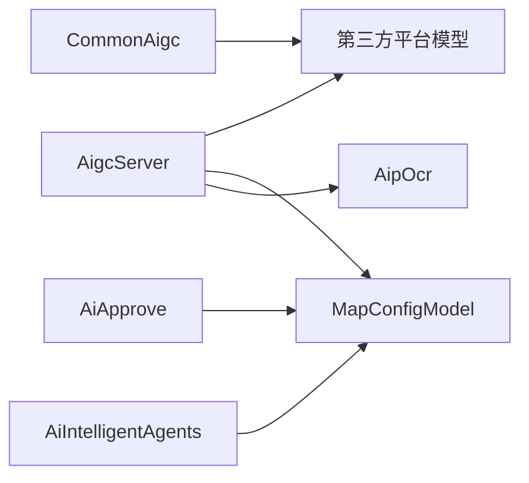

# AI 服务集成

<cite>
**本文引用的文件**
- [process\src\config\api.php](file://process\src\config\api.php)
- [process\src\config\permits.php](file://process\src\config\permits.php)
- [process\src\config\main.dev.yaml](file://process\src\config\main.dev.yaml)
- [process\src\config\process.dev.yaml](file://process\src\config\process.dev.yaml)
- [process\src\http\open\Aigc.php](file://process\src\http\open\Aigc.php)
- [process\src\http\open\AigcServer.php](file://process\src\http\open\AigcServer.php)
- [process\src\http\site\AiApprove.php](file://process\src\http\site\AiApprove.php)
- [process\src\http\site\AiIntelligentAgents.php](file://process\src\http\site\AiIntelligentAgents.php)
- [process\src\http\system\CommonAigc.php](file://process\src\http\system\CommonAigc.php)
- [process\src\lib\aip\AipOcr.php](file://process\src\lib\aip\AipOcr.php)
- [process\src\models\MapConfigModel.php](file://process\src\models\MapConfigModel.php)
- [process\src\migrations\migration_20251105_132157_aimh_up.php](file://process\src\migrations\migration_20251105_132157_aimh_up.php)
- [process\docs\sql\database.sql](file://process\docs\sql\database.sql)
- [process\src\services\task\AigcPush.php](file://process\src\services\task\AigcPush.php)
</cite>

## 目录
1. [简介](#简介)
2. [项目结构](#项目结构)
3. [核心组件](#核心组件)
4. [架构总览](#架构总览)
5. [组件详解](#组件详解)
6. [依赖关系分析](#依赖关系分析)
7. [性能考量](#性能考量)
8. [故障排查指南](#故障排查指南)
9. [结论](#结论)
10. [附录](#附录)

## 简介
本文件面向 htdNew 项目中的 AI 服务集成，系统化梳理多类 AI 能力（智能体、OCR、审批辅助等）的统一接口设计、服务发现与调用链路、配置与版本管理、灰度策略、异常处理与监控告警，并提供最佳实践与优化建议。重点覆盖以下方面：
- 统一接口与路由：开放接口、站点接口、系统接口的职责划分与协作方式
- 服务发现与负载均衡：基于第三方平台模型与令牌管理的外部服务对接
- 数据流与业务集成：从门户配置、智能体应用到审批辅助的数据流转
- 配置与版本：MapConfigModel 的多场景配置、迁移脚本与数据库结构
- 灰度与发布：基于角色可见性与推荐位的灰度策略
- 性能与稳定性：并发消费者、缓存与错误处理

## 项目结构
AI 服务相关代码主要分布在如下模块：
- 配置层：API 分组、权限映射、运行时与进程配置
- 控制器层：开放接口、站点接口、系统接口
- 服务与模型层：第三方平台抽象、AI 配置模型、迁移与数据库结构
- 第三方能力：百度 AIP OCR SDK

图表来源
- [process\src\config\api.php](file://process\src\config\api.php#L731-L773)
- [process\src\config\permits.php](file://process\src\config\permits.php#L289-L371)
- [process\src\config\main.dev.yaml](file://process\src\config\main.dev.yaml#L1-L97)
- [process\src\config\process.dev.yaml](file://process\src\config\process.dev.yaml#L1-L89)
- [process\src\http\open\Aigc.php](file://process\src\http\open\Aigc.php#L1-L200)
- [process\src\http\open\AigcServer.php](file://process\src\http\open\AigcServer.php#L1-L185)
- [process\src\http\site\AiApprove.php](file://process\src\http\site\AiApprove.php#L1-L200)
- [process\src\http\site\AiIntelligentAgents.php](file://process\src\http\site\AiIntelligentAgents.php#L1-L155)
- [process\src\http\system\CommonAigc.php](file://process\src\http\system\CommonAigc.php#L1-L31)
- [process\src\lib\aip\AipOcr.php](file://process\src\lib\aip\AipOcr.php#L1-L2872)
- [process\src\models\MapConfigModel.php](file://process\src\models\MapConfigModel.php#L1276-L2079)
- [process\src\migrations\migration_20251105_132157_aimh_up.php](file://process\src\migrations\migration_20251105_132157_aimh_up.php#L1-L38)
- [process\docs\sql\database.sql](file://process\docs\sql\database.sql#L35-L73)
- [process\src\services\task\AigcPush.php](file://process\src\services\task\AigcPush.php#L239-L261)

章节来源
- [process\src\config\api.php](file://process\src\config\api.php#L731-L773)
- [process\src\config\permits.php](file://process\src\config\permits.php#L289-L371)
- [process\src\config\main.dev.yaml](file://process\src\config\main.dev.yaml#L1-L97)
- [process\src\config\process.dev.yaml](file://process\src\config\process.dev.yaml#L1-L89)

## 核心组件
- 统一接口与路由
  - 开放接口：提供智能体、插件、令牌等能力，面向第三方系统与前端调用
  - 站点接口：面向内部业务，如审批辅助、智能体应用列表
  - 系统接口：面向后台管理，如 AI 快填表数据源配置
- 服务发现与令牌
  - 通过第三方平台模型获取访问令牌与服务地址，实现服务发现与鉴权
- 配置与版本
  - MapConfigModel 定义多场景 AI 配置（大厅、门户、智能搜索等），支持版本聚合
  - 迁移脚本新增 AI 历史会话表，支撑灰度与审计
- 数据库与模型
  - 数据库结构定义事项、版本、管理员配置等表；迁移脚本扩展 AI 相关表结构

章节来源
- [process\src\http\open\Aigc.php](file://process\src\http\open\Aigc.php#L1-L200)
- [process\src\http\open\AigcServer.php](file://process\src\http\open\AigcServer.php#L1-L185)
- [process\src\http\site\AiApprove.php](file://process\src\http\site\AiApprove.php#L1-L200)
- [process\src\http\site\AiIntelligentAgents.php](file://process\src\http\site\AiIntelligentAgents.php#L1-L155)
- [process\src\http\system\CommonAigc.php](file://process\src\http\system\CommonAigc.php#L1-L31)
- [process\src\models\MapConfigModel.php](file://process\src\models\MapConfigModel.php#L1276-L2079)
- [process\src\migrations\migration_20251105_132157_aimh_up.php](file://process\src\migrations\migration_20251105_132157_aimh_up.php#L1-L38)
- [process\docs\sql\database.sql](file://process\docs\sql\database.sql#L35-L73)

## 架构总览
AI 服务集成采用“控制器-服务-模型-第三方平台”的分层架构，围绕统一接口与配置中心实现跨服务协同。

图表来源
- [process\src\http\open\Aigc.php](file://process\src\http\open\Aigc.php#L1-L200)
- [process\src\http\open\AigcServer.php](file://process\src\http\open\AigcServer.php#L1-L185)
- [process\src\http\system\CommonAigc.php](file://process\src\http\system\CommonAigc.php#L1-L31)
- [process\src\http\site\AiApprove.php](file://process\src\http\site\AiApprove.php#L1-L200)
- [process\src\http\site\AiIntelligentAgents.php](file://process\src\http\site\AiIntelligentAgents.php#L1-L155)
- [process\src\models\MapConfigModel.php](file://process\src\models\MapConfigModel.php#L1276-L2079)
- [process\src\lib\aip\AipOcr.php](file://process\src\lib\aip\AipOcr.php#L1-L2872)
- [process\docs\sql\database.sql](file://process\docs\sql\database.sql#L35-L73)

## 组件详解

### 统一接口设计与服务发现
- 接口分层
  - 开放接口：提供令牌获取、插件描述、流程信息与提交等能力，便于外部系统集成
  - 站点接口：面向内部用户，提供审批辅助与智能体应用列表
  - 系统接口：提供后台配置查询，如 AI 快填表数据源开关
- 服务发现与鉴权
  - 通过第三方平台模型获取访问令牌与服务地址，实现服务发现与鉴权
  - 支持不同场景下的可见性控制与角色过滤

图表来源
- [process\src\http\open\AigcServer.php](file://process\src\http\open\AigcServer.php#L123-L184)
- [process\src\models\MapConfigModel.php](file://process\src\models\MapConfigModel.php#L1276-L1779)

章节来源
- [process\src\http\open\Aigc.php](file://process\src\http\open\Aigc.php#L1-L200)
- [process\src\http\open\AigcServer.php](file://process\src\http\open\AigcServer.php#L1-L185)
- [process\src\http\system\CommonAigc.php](file://process\src\http\system\CommonAigc.php#L1-L31)

### 数据流与业务集成
- 门户配置与智能体应用
  - AigcServer 提供智能体应用分类与列表查询，并结合可见性角色过滤
  - MapConfigModel 提供多场景配置（大厅、门户、智能搜索等），并支持版本聚合
- 审批辅助与任务联动
  - AiApprove 提供待处理/已完成任务列表、任务详情、问题缓存与保存等能力
  - 与任务中心联动，确保任务存在性与状态一致性
- OCR 能力接入
  - AipOcr 提供多种 OCR 识别能力，作为 AI 能力的前置处理

图表来源
- [process\src\http\open\AigcServer.php](file://process\src\http\open\AigcServer.php#L72-L121)
- [process\src\http\site\AiApprove.php](file://process\src\http\site\AiApprove.php#L1-L200)
- [process\src\lib\aip\AipOcr.php](file://process\src\lib\aip\AipOcr.php#L1-L2872)
- [process\src\models\MapConfigModel.php](file://process\src\models\MapConfigModel.php#L1276-L1779)

章节来源
- [process\src\http\site\AiIntelligentAgents.php](file://process\src\http\site\AiIntelligentAgents.php#L1-L155)
- [process\src\http\site\AiApprove.php](file://process\src\http\site\AiApprove.php#L1-L200)
- [process\src\lib\aip\AipOcr.php](file://process\src\lib\aip\AipOcr.php#L1-L2872)

### 配置管理、版本控制与灰度发布
- 配置模型
  - MapConfigModel 定义多场景配置键（大厅、门户、智能搜索等），并支持字段级开关与展示
- 版本聚合
  - AigcServer 在返回配置时对更新时间进行聚合，形成统一版本号，便于前端缓存与增量更新
- 灰度策略
  - 基于可见性角色与推荐位字段，实现灰度发布与逐步放开
  - AigcPush 负责智能体应用的推送与归并，支持按名称与类型进行差异化处理

图表来源
- [process\src\http\system\CommonAigc.php](file://process\src\http\system\CommonAigc.php#L1-L31)
- [process\src\http\site\AiIntelligentAgents.php](file://process\src\http\site\AiIntelligentAgents.php#L1-L155)
- [process\src\models\MapConfigModel.php](file://process\src\models\MapConfigModel.php#L1276-L1779)
- [process\docs\sql\database.sql](file://process\docs\sql\database.sql#L35-L73)
- [process\src\migrations\migration_20251105_132157_aimh_up.php](file://process\src\migrations\migration_20251105_132157_aimh_up.php#L1-L38)

章节来源
- [process\src\models\MapConfigModel.php](file://process\src\models\MapConfigModel.php#L1276-L2079)
- [process\src\services\task\AigcPush.php](file://process\src\services\task\AigcPush.php#L239-L261)

### 异常处理与监控告警
- 异常处理
  - 控制器层对第三方调用异常进行捕获并转换为用户可理解的错误响应
  - 站点接口对任务不存在、状态不一致等情况进行过滤与清理
- 监控与日志
  - 运行时配置包含日志级别与上传存储配置，便于问题定位
  - 进程配置支持多进程与消费者数量，保障高并发下的稳定性

章节来源
- [process\src\http\open\AigcServer.php](file://process\src\http\open\AigcServer.php#L23-L34)
- [process\src\http\site\AiApprove.php](file://process\src\http\site\AiApprove.php#L142-L172)
- [process\src\config\main.dev.yaml](file://process\src\config\main.dev.yaml#L66-L73)
- [process\src\config\process.dev.yaml](file://process\src\config\process.dev.yaml#L55-L89)

## 依赖关系分析
- 控制器依赖
  - AigcServer 依赖第三方平台模型与 MapConfigModel 实现配置聚合
  - AiApprove 依赖任务中心与模型层实现审批辅助
- 模型与迁移
  - MapConfigModel 与数据库结构及迁移脚本共同维护 AI 配置与历史会话
- 第三方能力
  - AipOcr 作为 OCR 能力提供者，被业务流程可选调用

图表来源
- [process\src\http\open\AigcServer.php](file://process\src\http\open\AigcServer.php#L1-L185)
- [process\src\http\site\AiApprove.php](file://process\src\http\site\AiApprove.php#L1-L200)
- [process\src\http\site\AiIntelligentAgents.php](file://process\src\http\site\AiIntelligentAgents.php#L1-L155)
- [process\src\http\system\CommonAigc.php](file://process\src\http\system\CommonAigc.php#L1-L31)
- [process\src\models\MapConfigModel.php](file://process\src\models\MapConfigModel.php#L1276-L1779)
- [process\src\lib\aip\AipOcr.php](file://process\src\lib\aip\AipOcr.php#L1-L2872)

章节来源
- [process\src\http\open\Aigc.php](file://process\src\http\open\Aigc.php#L1-L200)
- [process\src\http\open\AigcServer.php](file://process\src\http\open\AigcServer.php#L1-L185)
- [process\src\http\site\AiApprove.php](file://process\src\http\site\AiApprove.php#L1-L200)
- [process\src\http\site\AiIntelligentAgents.php](file://process\src\http\site\AiIntelligentAgents.php#L1-L155)
- [process\src\http\system\CommonAigc.php](file://process\src\http\system\CommonAigc.php#L1-L31)
- [process\src\models\MapConfigModel.php](file://process\src\models\MapConfigModel.php#L1276-L1779)
- [process\src\lib\aip\AipOcr.php](file://process\src\lib\aip\AipOcr.php#L1-L2872)

## 性能考量
- 并发与消费者
  - 进程配置支持多进程与消费者数量，建议根据 CPU 核心数与业务峰值合理分配
- 缓存与会话
  - 使用 Redis 缓存问题与会话数据，减少重复计算与 IO
  - 新增 AI 历史会话表，支持会话检索与审计
- 日志与监控
  - 设置合适的日志级别，避免生产环境产生过多 I/O
  - 对关键接口进行埋点与告警，结合版本聚合实现增量更新

章节来源
- [process\src\config\process.dev.yaml](file://process\src\config\process.dev.yaml#L55-L89)
- [process\src\config\main.dev.yaml](file://process\src\config\main.dev.yaml#L66-L73)
- [process\src\migrations\migration_20251105_132157_aimh_up.php](file://process\src\migrations\migration_20251105_132157_aimh_up.php#L1-L38)

## 故障排查指南
- 常见问题
  - 用户不存在或被禁用：检查用户编号与状态，确保可见性角色匹配
  - 任务不存在或状态不一致：清理无效任务并重试
  - OCR 识别失败：确认图片格式与大小限制，检查第三方服务可用性
- 排查步骤
  - 查看日志级别与输出路径，定位异常堆栈
  - 核对第三方平台模型配置与令牌有效性
  - 检查数据库表结构与迁移是否完成

章节来源
- [process\src\http\open\Aigc.php](file://process\src\http\open\Aigc.php#L146-L170)
- [process\src\http\site\AiApprove.php](file://process\src\http\site\AiApprove.php#L142-L172)
- [process\src\config\main.dev.yaml](file://process\src\config\main.dev.yaml#L66-L73)
- [process\docs\sql\database.sql](file://process\docs\sql\database.sql#L35-L73)

## 结论
htdNew 项目的 AI 服务集成通过清晰的接口分层、统一的配置模型与第三方平台抽象，实现了智能体应用、OCR 识别与审批辅助等能力的协同。借助 MapConfigModel 的多场景配置与版本聚合、AigcPush 的灰度策略以及迁移脚本的演进，系统具备良好的可扩展性与可维护性。建议在生产环境中进一步完善监控告警、缓存策略与并发治理，以提升整体性能与稳定性。

## 附录
- API 分组与路由
  - 参考开放接口中的令牌、插件与智能体相关路由
- 权限映射
  - 系统接口中针对 AI 智能体管理与配置的权限映射
- 运行时与进程
  - 通用配置、日志级别、队列消费者与进程数量

章节来源
- [process\src\config\api.php](file://process\src\config\api.php#L731-L773)
- [process\src\config\permits.php](file://process\src\config\permits.php#L311-L371)
- [process\src\config\main.dev.yaml](file://process\src\config\main.dev.yaml#L1-L97)
- [process\src\config\process.dev.yaml](file://process\src\config\process.dev.yaml#L1-L89)