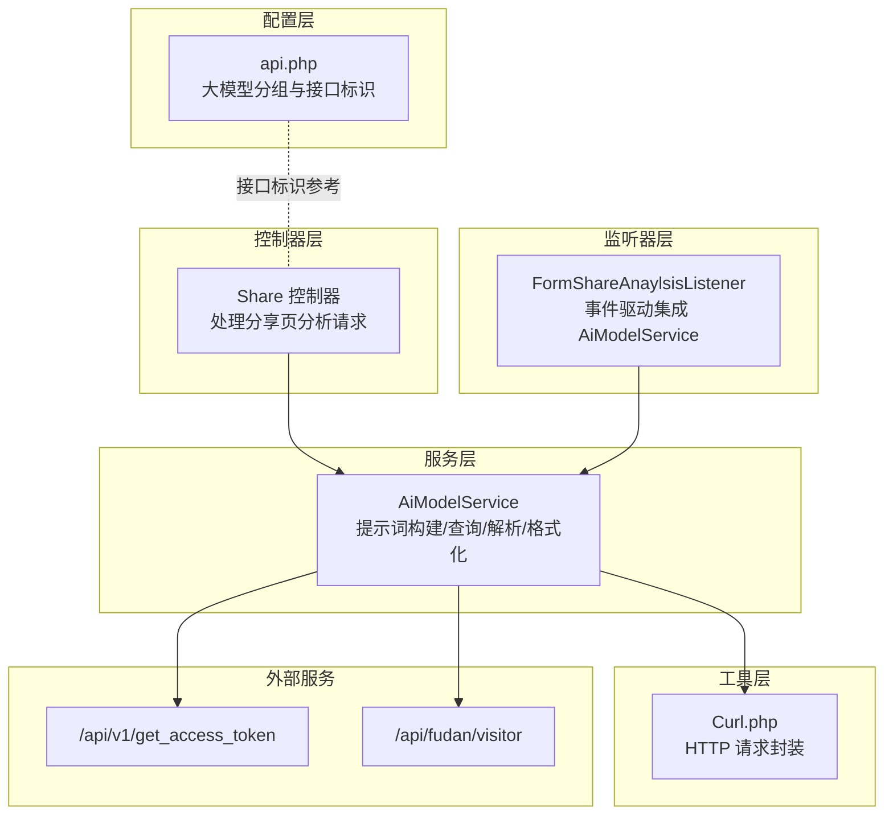
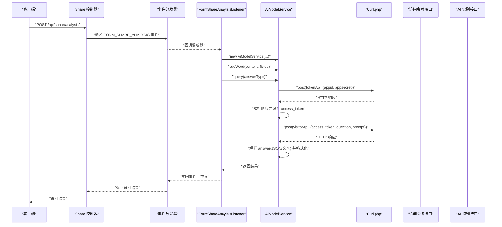
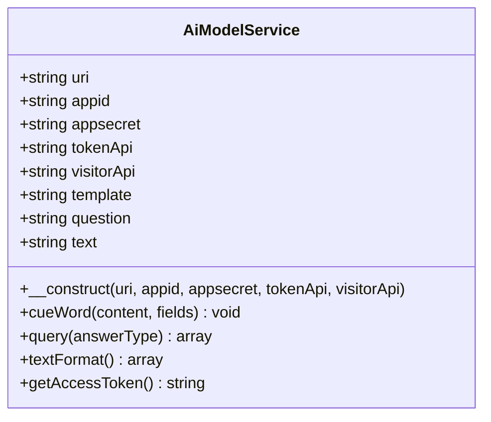
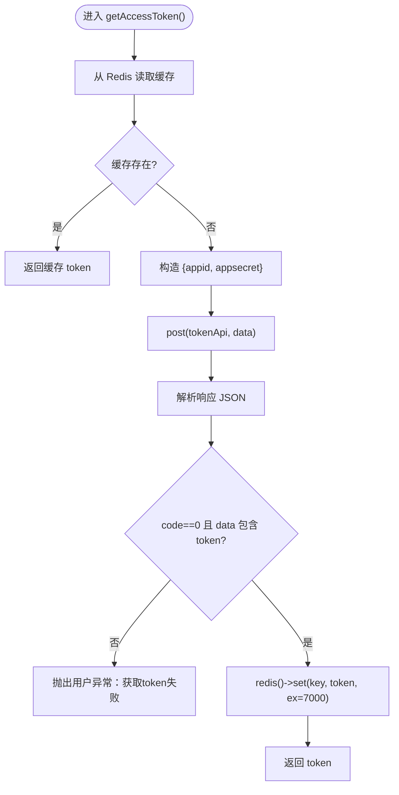
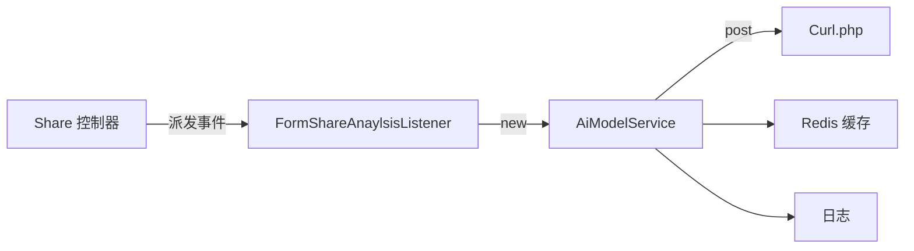

# AI 模型管理

<cite>
**本文引用的文件**
- [AiModelService.php](file://process/src/services/AiModelService.php)
- [Share.php](file://process/src/http/api/Share.php)
- [FormShareAnaylsisListener.php](file://process_envs/fudan/product/listeners/FormShareAnaylsisListener.php)
- [TokenService.php](file://process/src/services/api/TokenService.php)
- [api.php](file://process/src/config/api.php)
- [Curl.php](file://process/src/helpers/functions/Curl.php)
</cite>

## 目录
1. [引言](#引言)
2. [项目结构](#项目结构)
3. [核心组件](#核心组件)
4. [架构总览](#架构总览)
5. [详细组件分析](#详细组件分析)
6. [依赖分析](#依赖分析)
7. [性能考虑](#性能考虑)
8. [故障排查指南](#故障排查指南)
9. [结论](#结论)
10. [附录](#附录)

## 引言
本文件面向 htdNew 项目的 AI 模型管理能力，系统性梳理 AiModelService 的设计与实现，覆盖访问令牌管理、模型接口调用、数据解析与格式化等关键环节。文档同时给出模型查询流程的时序图、提示词构建与响应解析的流程图，并总结访问令牌获取策略、错误处理机制与性能优化建议，最后提供最佳实践与扩展开发指南，帮助开发者在不同学校或业务场景下快速集成与定制。

## 项目结构
与 AI 模型管理直接相关的代码分布在以下模块：
- 服务层：AiModelService 提供提示词构建、访问令牌获取、模型查询与结果解析/格式化能力
- 控制器层：Share 控制器提供对外接口入口，触发 AI 识别流程
- 监听器层：以 FormShareAnaylsisListener 为例，演示如何在事件驱动场景中使用 AiModelService
- 配置层：api.php 中定义了“大模型”分组与“获取token”接口标识
- 工具层：Curl.php 封装 HTTP 请求，被 AiModelService 使用



图表来源
- [Share.php](file://process/src/http/api/Share.php#L290-L308)
- [AiModelService.php](file://process/src/services/AiModelService.php#L29-L36)
- [FormShareAnaylsisListener.php](file://process_envs/fudan/product/listeners/FormShareAnaylsisListener.php#L21-L31)
- [api.php](file://process/src/config/api.php#L755-L766)
- [Curl.php](file://process/src/helpers/functions/Curl.php#L42-L42)

章节来源
- [Share.php](file://process/src/http/api/Share.php#L290-L308)
- [AiModelService.php](file://process/src/services/AiModelService.php#L29-L36)
- [FormShareAnaylsisListener.php](file://process_envs/fudan/product/listeners/FormShareAnaylsisListener.php#L21-L31)
- [api.php](file://process/src/config/api.php#L755-L766)
- [Curl.php](file://process/src/helpers/functions/Curl.php#L42-L42)

## 核心组件
- AiModelService：封装 AI 模型服务的完整生命周期，包括构造参数、提示词构建、访问令牌缓存、模型查询、响应解析与数据格式化
- Share 控制器：对外暴露分析接口，接收内容与字段映射，触发事件分发，最终返回识别结果
- FormShareAnaylsisListener：以监听器形式接入 AiModelService，完成提示词生成与模型查询
- TokenService：提供通用第三方访问令牌获取能力（重试、缓存、有效期处理），可作为 AiModelService 的替代方案或参考实现
- api.php：声明“大模型”分组与“获取token”接口标识，便于统一管理与路由

章节来源
- [AiModelService.php](file://process/src/services/AiModelService.php#L8-L28)
- [Share.php](file://process/src/http/api/Share.php#L290-L308)
- [FormShareAnaylsisListener.php](file://process_envs/fudan/product/listeners/FormShareAnaylsisListener.php#L21-L31)
- [TokenService.php](file://process/src/services/api/TokenService.php#L1-L32)
- [api.php](file://process/src/config/api.php#L755-L766)

## 架构总览
AiModelService 的整体调用链路如下：
- 控制器接收请求，准备内容与字段映射
- 触发事件，监听器构造 AiModelService 实例
- AiModelService 构建提示词，获取访问令牌，调用模型接口
- 解析响应，提取 JSON 结果或文本片段，进行格式化输出



图表来源
- [Share.php](file://process/src/http/api/Share.php#L290-L308)
- [FormShareAnaylsisListener.php](file://process_envs/fudan/product/listeners/FormShareAnaylsisListener.php#L21-L31)
- [AiModelService.php](file://process/src/services/AiModelService.php#L60-L121)
- [Curl.php](file://process/src/helpers/functions/Curl.php#L42-L42)

## 详细组件分析

### AiModelService 类设计与实现
- 构造函数参数
  - uri：AI 服务基础地址
  - appid/appsecret：鉴权凭据
  - tokenApi：访问令牌接口相对路径
  - visitorApi：AI 识别接口相对路径
- 关键职责
  - 提示词构建：根据输入内容与字段映射生成结构化提示
  - 访问令牌获取与缓存：基于 Redis 缓存 access_token，默认缓存 7000 秒
  - 模型查询：向识别接口发送请求，解析响应并返回结构化结果
  - 数据解析与格式化：支持 JSON 片段抽取与文本行解析



图表来源
- [AiModelService.php](file://process/src/services/AiModelService.php#L29-L36)
- [AiModelService.php](file://process/src/services/AiModelService.php#L41-L55)
- [AiModelService.php](file://process/src/services/AiModelService.php#L60-L121)
- [AiModelService.php](file://process/src/services/AiModelService.php#L123-L152)
- [AiModelService.php](file://process/src/services/AiModelService.php#L157-L186)

章节来源
- [AiModelService.php](file://process/src/services/AiModelService.php#L29-L36)
- [AiModelService.php](file://process/src/services/AiModelService.php#L41-L55)
- [AiModelService.php](file://process/src/services/AiModelService.php#L60-L121)
- [AiModelService.php](file://process/src/services/AiModelService.php#L123-L152)
- [AiModelService.php](file://process/src/services/AiModelService.php#L157-L186)

### 模型查询流程（提示词构建 → 请求发送 → 响应解析 → 数据格式化）
- 提示词构建
  - 将字段映射转换为“键表示名称”的映射串，拼接成结构化提示
  - 对特定字段进行过滤（如“序号”“前往校区”）
- 请求发送
  - 通过 Curl.php 封装的 post 方法发送 multipart/form-data 请求
  - 自动携带 access_token 与 question/prompt
- 响应解析
  - 校验 code 与 data，失败抛出用户异常
  - JSON 模式：从 answer 中抽取代码块内的 JSON，清洗转义字符，确保结果为数组并去除无效项
  - 文本模式：从 answer 中匹配 data: {"text": "..."} 片段，提取 text 字段
- 数据格式化
  - 将原始文本按换行拆分，再按逗号分隔，组装为键值对数组

```mermaid
flowchart TD
Start(["进入 query(answerType)"]) --> CheckQ["question 是否为空?"]
CheckQ --> |是| ReturnEmpty["返回空结果"]
CheckQ --> |否| BuildHeader["构建请求头 Content-Type: multipart/form-data"]
BuildHeader --> FetchToken["getAccessToken()"]
FetchToken --> PostReq["post(visitorApi, {access_token, question, prompt})"]
PostReq --> ParseResp["解析响应 JSON"]
ParseResp --> Valid{"code==0 且 data 存在?"}
Valid --> |否| ThrowErr["抛出用户异常：数据解析失败"]
Valid --> |是| AnswerSel{"answerType == 'json'?"}
AnswerSel --> |是| JsonMode["抽取
```json...``` 内容<br/>清洗转义字符<br/>确保为数组<br/>过滤无效值"]
    AnswerSel -->|否| TextMode["抽取 data: {\"text\": \"...\"}<br/>提取 text"]
    JsonMode --> ReturnJson["返回 {query, body, str, result}"]
    TextMode --> ReturnText["返回文本结果"]
```

图表来源
- [AiModelService.php](file://process/src/services/AiModelService.php#L60-L121)
- [AiModelService.php](file://process/src/services/AiModelService.php#L123-L152)

章节来源
- [AiModelService.php](file://process/src/services/AiModelService.php#L60-L121)
- [AiModelService.php](file://process/src/services/AiModelService.php#L123-L152)

### 访问令牌获取策略与缓存机制
- 缓存键：基于 appid 的固定前缀
- 获取流程：若缓存命中则直接返回；未命中则调用 tokenApi，解析响应中的 access_token 并设置过期时间为 7000 秒
- 失败处理：当响应非成功或缺少 token 时抛出用户异常



图表来源
- [AiModelService.php](file://process/src/services/AiModelService.php#L157-L186)

章节来源
- [AiModelService.php](file://process/src/services/AiModelService.php#L157-L186)

### 与 TokenService 的对比与选择
- TokenService 提供更完善的通用令牌获取能力，包括：
  - 失败重试（最多 3 次，间隔 1 秒）
  - 1 分钟内禁止重试的冷却机制
  - 基于响应有效期动态计算缓存时间（有效期 - 5 秒）
  - 统一的日志记录与交互日志更新
- AiModelService 当前采用自定义缓存策略（固定 7000 秒），实现简洁但缺少重试与冷却控制
- 建议：在需要高可靠性的场景优先使用 TokenService；若仅需简单场景，AiModelService 已满足需求

章节来源
- [TokenService.php](file://process/src/services/api/TokenService.php#L1-L32)
- [TokenService.php](file://process/src/services/api/TokenService.php#L45-L65)
- [TokenService.php](file://process/src/services/api/TokenService.php#L82-L143)
- [TokenService.php](file://process/src/services/api/TokenService.php#L111-L121)

### API 接口集成与配置
- “大模型”分组与“获取token”接口标识在配置文件中定义，便于统一管理与路由
- AiModelService 通过构造函数注入的 uri 与 tokenApi/visitorApi 进行接口集成

章节来源
- [api.php](file://process/src/config/api.php#L755-L766)
- [AiModelService.php](file://process/src/services/AiModelService.php#L29-L36)

## 依赖分析
- AiModelService 依赖
  - Redis：令牌缓存与重试冷却
  - Curl.php：HTTP 请求封装
  - 日志：调试与问题定位
- 控制器与监听器
  - Share 控制器负责请求入口与事件派发
  - 监听器负责具体业务集成与 AiModelService 调用



图表来源
- [Share.php](file://process/src/http/api/Share.php#L290-L308)
- [FormShareAnaylsisListener.php](file://process_envs/fudan/product/listeners/FormShareAnaylsisListener.php#L21-L31)
- [AiModelService.php](file://process/src/services/AiModelService.php#L60-L121)
- [Curl.php](file://process/src/helpers/functions/Curl.php#L42-L42)

章节来源
- [Share.php](file://process/src/http/api/Share.php#L290-L308)
- [FormShareAnaylsisListener.php](file://process_envs/fudan/product/listeners/FormShareAnaylsisListener.php#L21-L31)
- [AiModelService.php](file://process/src/services/AiModelService.php#L60-L121)
- [Curl.php](file://process/src/helpers/functions/Curl.php#L42-L42)

## 性能考虑
- 令牌缓存
  - AiModelService 默认缓存 7000 秒，减少频繁请求 token 的开销
  - 若外部接口有效期较短，建议结合 TokenService 的动态缓存策略，避免过期导致的二次请求
- 请求头与负载
  - 使用 multipart/form-data 传输，注意字段大小与编码，避免超长文本引发内存压力
- 响应解析
  - JSON 抽取阶段对字符串进行多次替换与正则匹配，建议在上游控制输入规模与格式一致性
- 并发与限流
  - 在高并发场景下，建议引入队列或限流策略，避免 AI 服务瞬时拥塞

## 故障排查指南
- 常见错误与定位
  - 访问令牌获取失败：检查 appid/appsecret 是否正确，tokenApi 响应是否包含 access_token
  - 模型查询失败：检查 visitorApi 返回的 code 与 data，确认 question 是否已构建
  - JSON 解析失败：确认 answer 中是否存在 ```json...``` 片段，以及转义字符是否被正确清洗
- 日志与异常
  - 使用调试日志输出 body 与解析后的结果，便于快速定位问题
  - 用户异常会中断流程，需在上层捕获并反馈给调用方
- 建议排查步骤
  - 校验构造参数（uri/tokenApi/visitorApi）与配置文件一致
  - 检查 Redis 缓存是否正常，必要时清理缓存后重试
  - 降低输入复杂度，逐步缩小问题范围

章节来源
- [AiModelService.php](file://process/src/services/AiModelService.php#L74-L83)
- [AiModelService.php](file://process/src/services/AiModelService.php#L84-L111)
- [AiModelService.php](file://process/src/services/AiModelService.php#L173-L183)

## 结论
AiModelService 以简洁的接口实现了提示词构建、令牌缓存、模型查询与结果解析的闭环，适合在事件驱动与控制器入口场景中快速集成。对于需要更强健壮性的场景，可参考 TokenService 的重试与动态缓存策略。通过规范化的配置与日志体系，能够有效提升可维护性与可观测性。

## 附录

### 最佳实践
- 参数管理
  - 将 uri、tokenApi、visitorApi、appid、appsecret 放置于配置中心或环境变量，避免硬编码
- 错误处理
  - 在控制器与监听器层统一捕获用户异常，返回友好的错误信息
- 缓存策略
  - 优先使用 TokenService 的动态缓存与重试机制，确保稳定性
- 输入治理
  - 对输入内容进行预处理，剔除无关字符，保持字段映射清晰
- 监控与日志
  - 记录关键链路日志（请求参数、响应状态、解析耗时），便于问题追踪

### 扩展开发指南
- 新增字段映射
  - 在 cueWord 中扩展字段过滤与映射规则，适配更多业务表单
- 多模型适配
  - 通过构造函数注入不同的 visitorApi，支持多模型切换
- 结果增强
  - 在 query 中扩展 answerType，支持流式输出或其他格式
- 事件集成
  - 在监听器中加入更多上下文信息（如用户身份、业务 ID），便于后续审计与追踪