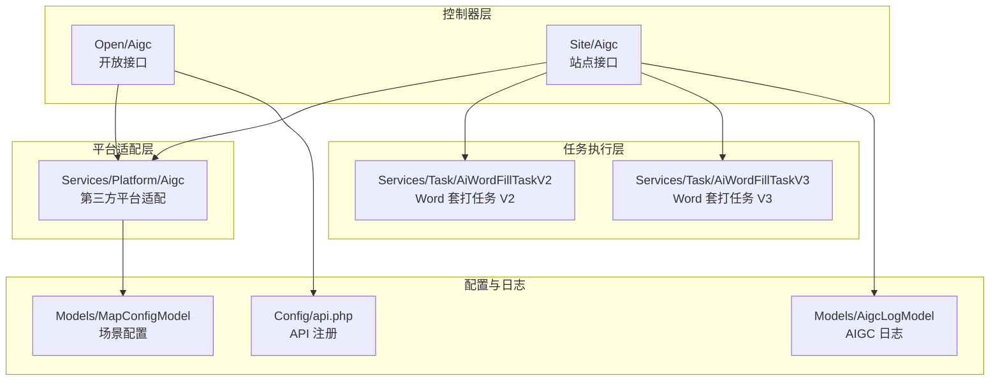
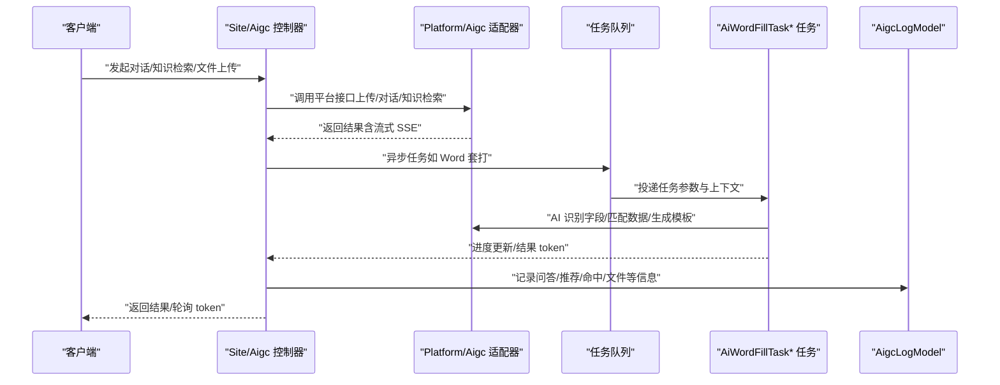
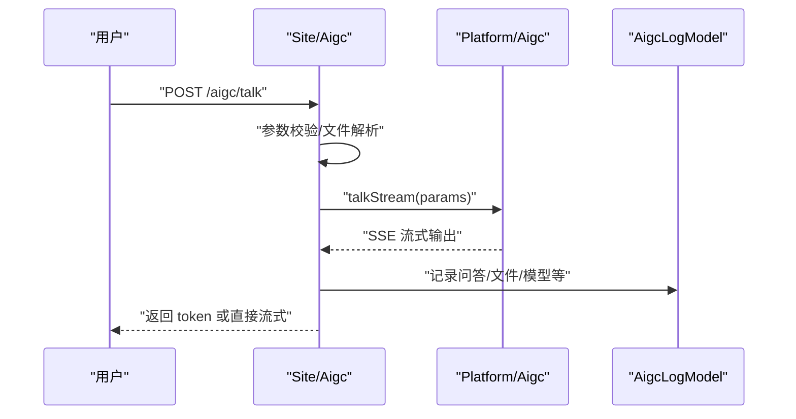
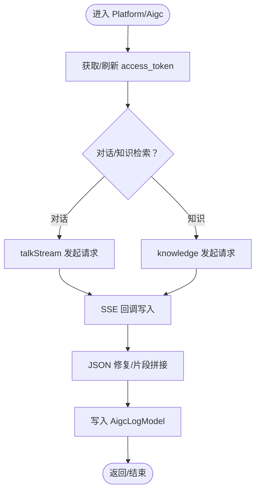
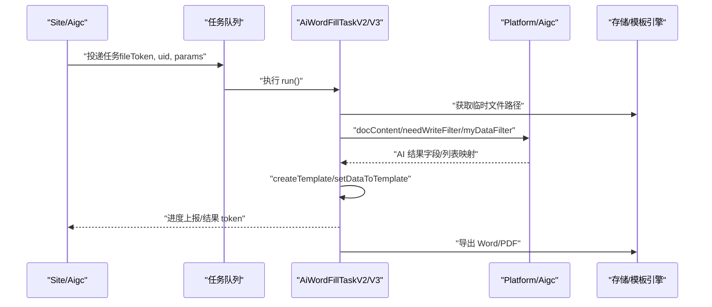
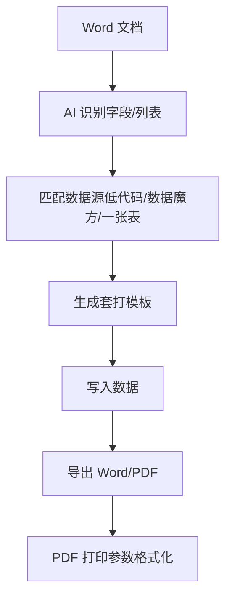
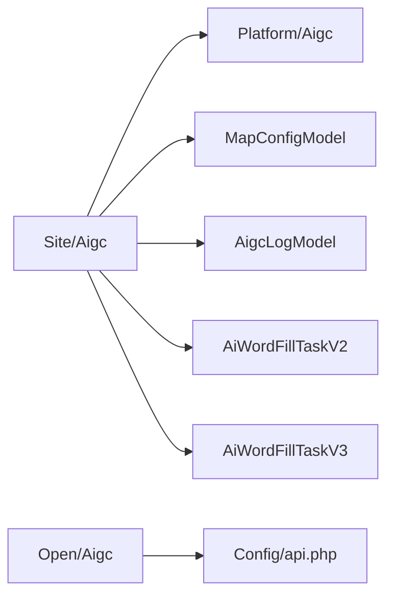

# AIGC 内容生成

<cite>
**本文引用的文件**
- [process/src/http/open/Aigc.php](file://process/src/http/open/Aigc.php)
- [process/src/http/site/Aigc.php](file://process/src/http/site/Aigc.php)
- [process/src/services/platform/Aigc.php](file://process/src/services/platform/Aigc.php)
- [process/src/services/task/AiWordFillTaskV2.php](file://process/src/services/task/AiWordFillTaskV2.php)
- [process/src/services/task/AiWordFillTaskV3.php](file://process/src/services/task/AiWordFillTaskV3.php)
- [process/src/models/MapConfigModel.php](file://process/src/models/MapConfigModel.php)
- [process/src/models/AigcLogModel.php](file://process/src/models/AigcLogModel.php)
- [process/src/config/api.php](file://process/src/config/api.php)
- [process_envs/nju/product/listeners/CustomFormPrinting.php](file://process_envs/nju/product/listeners/CustomFormPrinting.php)
- [process_envs/moeassets/product/listeners/CustomFormPrinting.php](file://process_envs/moeassets/product/listeners/CustomFormPrinting.php)
- [process/src/helpers/PdfHelper.php](file://process/src/helpers/PdfHelper.php)
- [process/src/http/site/Questionnaire.php](file://process/src/http/site/Questionnaire.php)
</cite>

## 目录
1. [引言](#引言)
2. [项目结构](#项目结构)
3. [核心组件](#核心组件)
4. [架构总览](#架构总览)
5. [详细组件分析](#详细组件分析)
6. [依赖分析](#依赖分析)
7. [性能考虑](#性能考虑)
8. [故障排查指南](#故障排查指南)
9. [结论](#结论)
10. [附录](#附录)

## 引言
本文件面向 htdNew 项目的 AIGC 内容生成系统，系统以“智麟 AI 助手”为第三方大模型平台，提供多形态内容生成与应用集成能力，涵盖：
- 对话式问答与知识检索（含流式输出）
- 智能搜索与事项推荐
- 智能审批辅助与规则抽取
- 智能填表与 Word 文档套打
- 问卷自动生成与模板管理
- 日志与质量控制、参数调优、性能监控

系统通过统一的平台适配层对接第三方 AIGC 能力，结合站点控制器与任务队列，实现高并发、可扩展的内容生成与应用集成。

## 项目结构
围绕 AIGC 的核心模块分布如下：
- 控制器层：开放接口与站点接口分别提供对外访问与内部业务入口
- 平台适配层：封装第三方 AIGC 平台的上传、对话、知识检索、模型列表等能力
- 任务执行层：异步任务队列驱动 Word 套打、数据匹配与模板生成
- 配置与日志：集中管理各场景配置、日志模型与 API 注册

图表来源
- [process/src/http/open/Aigc.php](file://process/src/http/open/Aigc.php#L1-L120)
- [process/src/http/site/Aigc.php](file://process/src/http/site/Aigc.php#L1-L120)
- [process/src/services/platform/Aigc.php](file://process/src/services/platform/Aigc.php#L1-L120)
- [process/src/services/task/AiWordFillTaskV2.php](file://process/src/services/task/AiWordFillTaskV2.php#L1-L120)
- [process/src/services/task/AiWordFillTaskV3.php](file://process/src/services/task/AiWordFillTaskV3.php#L1-L120)
- [process/src/models/MapConfigModel.php](file://process/src/models/MapConfigModel.php#L1200-L1760)
- [process/src/models/AigcLogModel.php](file://process/src/models/AigcLogModel.php#L1-L59)
- [process/src/config/api.php](file://process/src/config/api.php#L731-L773)

章节来源
- [process/src/http/open/Aigc.php](file://process/src/http/open/Aigc.php#L1-L120)
- [process/src/http/site/Aigc.php](file://process/src/http/site/Aigc.php#L1-L120)
- [process/src/services/platform/Aigc.php](file://process/src/services/platform/Aigc.php#L1-L120)
- [process/src/services/task/AiWordFillTaskV2.php](file://process/src/services/task/AiWordFillTaskV2.php#L1-L120)
- [process/src/services/task/AiWordFillTaskV3.php](file://process/src/services/task/AiWordFillTaskV3.php#L1-L120)
- [process/src/models/MapConfigModel.php](file://process/src/models/MapConfigModel.php#L1200-L1760)
- [process/src/models/AigcLogModel.php](file://process/src/models/AigcLogModel.php#L1-L59)
- [process/src/config/api.php](file://process/src/config/api.php#L731-L773)

## 核心组件
- 站点 AIGC 控制器：提供访客对话、文件上传、知识检索、智能搜索、日志查询、反馈标签、问卷搜索等功能；支持流式对话与异步任务结果轮询。
- 平台适配器：封装第三方 AIGC 平台的访问令牌、上传、对话、知识检索、模型列表、深度检索等接口，统一输出格式并记录日志。
- Word 套打任务：基于 AI 识别 Word 字段、匹配数据源、生成模板并写入数据，支持进度上报与取消控制。
- 配置模型：集中管理不同场景（如智能搜索、智能填写、智能审批、门户配置等）的开关、模型、提示词与界面参数。
- 日志模型：记录问答、推荐、命中、文件、问题 ID 等信息，支撑质量评估与回溯。

章节来源
- [process/src/http/site/Aigc.php](file://process/src/http/site/Aigc.php#L120-L320)
- [process/src/services/platform/Aigc.php](file://process/src/services/platform/Aigc.php#L120-L260)
- [process/src/services/task/AiWordFillTaskV2.php](file://process/src/services/task/AiWordFillTaskV2.php#L120-L260)
- [process/src/models/MapConfigModel.php](file://process/src/models/MapConfigModel.php#L1611-L1760)
- [process/src/models/AigcLogModel.php](file://process/src/models/AigcLogModel.php#L1-L59)

## 架构总览
系统采用“控制器-平台适配-任务队列-模板引擎”的分层架构，结合配置中心与日志体系，形成可扩展的内容生成与应用集成闭环。

图表来源
- [process/src/http/site/Aigc.php](file://process/src/http/site/Aigc.php#L147-L222)
- [process/src/services/platform/Aigc.php](file://process/src/services/platform/Aigc.php#L255-L478)
- [process/src/services/task/AiWordFillTaskV2.php](file://process/src/services/task/AiWordFillTaskV2.php#L62-L141)
- [process/src/models/AigcLogModel.php](file://process/src/models/AigcLogModel.php#L1-L59)

## 详细组件分析

### 组件一：站点 AIGC 控制器（Site/Aigc）
职责与能力
- 访客对话：支持字典映射、限频、流式输出
- 文件上传：支持分类与 OCR 图片识别
- 知识检索：支持历史对话、R1 模式切换
- 深度检索：智能搜索与“一句话办事”场景，支持提问重写与模型选择
- 日志查询：按用户与类型查询上下文
- 反馈标签与保存：对接平台反馈接口
- 应用搜索：融合低代码与第三方平台应用，支持权限过滤与终端跳转

关键流程
- 对话流程：参数校验 → 文件解析（可选）→ 模型配置 → 流式/异步处理 → 结果缓存 → 返回 token
- 知识检索流程：参数校验 → 平台调用 → 流式输出 → 日志入库 → 返回 log_id
- 深度检索流程：权限过滤 → 多源应用聚合 → 权限与场景配置 → 提问重写 → 模型选择 → 流式输出

图表来源
- [process/src/http/site/Aigc.php](file://process/src/http/site/Aigc.php#L147-L222)
- [process/src/services/platform/Aigc.php](file://process/src/services/platform/Aigc.php#L323-L478)
- [process/src/models/AigcLogModel.php](file://process/src/models/AigcLogModel.php#L1-L59)

章节来源
- [process/src/http/site/Aigc.php](file://process/src/http/site/Aigc.php#L120-L320)
- [process/src/http/site/Aigc.php](file://process/src/http/site/Aigc.php#L320-L547)
- [process/src/http/site/Aigc.php](file://process/src/http/site/Aigc.php#L548-L712)

### 组件二：平台适配器（Platform/Aigc）
职责与能力
- 访客对话与模型直连
- 文件上传与文档内容提取
- 知识检索与深度检索（SSE 流式）
- 模型列表与组合列表
- 访问令牌注册与缓存
- JSON 修复与日志记录

关键流程
- 令牌获取：首次注册并缓存，后续复用
- 对话流式：设置 SSE 头 → 发起请求 → 回调写入 → 错误包装 → 日志入库
- 知识检索：SSE 接收 → 推荐应用解析 → 答案累积 → 日志入库

图表来源
- [process/src/services/platform/Aigc.php](file://process/src/services/platform/Aigc.php#L294-L478)
- [process/src/models/AigcLogModel.php](file://process/src/models/AigcLogModel.php#L1-L59)

章节来源
- [process/src/services/platform/Aigc.php](file://process/src/services/platform/Aigc.php#L1-L120)
- [process/src/services/platform/Aigc.php](file://process/src/services/platform/Aigc.php#L120-L260)
- [process/src/services/platform/Aigc.php](file://process/src/services/platform/Aigc.php#L255-L478)

### 组件三：Word 套打任务（AiWordFillTaskV2/V3）
职责与能力
- 任务生命周期：排队结束 → 上传文件 → 识别字段 → XML 补全 → 生成模板 → 写入数据 → 成功/错误
- 数据来源：低代码数据集、数据魔方、一张表
- 进度上报：Redis 缓存进度与状态
- 取消控制：基于 Redis 标记判断用户取消

关键流程
- 字段识别：AI 识别 Word 中需填写字段与列表区域
- 数据匹配：AI 对比字段与数据源，生成映射
- 模板生成：根据识别结果生成套打模板
- 数据写入：将匹配数据写入模板并导出

图表来源
- [process/src/services/task/AiWordFillTaskV2.php](file://process/src/services/task/AiWordFillTaskV2.php#L62-L141)
- [process/src/services/task/AiWordFillTaskV2.php](file://process/src/services/task/AiWordFillTaskV2.php#L220-L314)
- [process/src/services/task/AiWordFillTaskV2.php](file://process/src/services/task/AiWordFillTaskV2.php#L1732-L1918)
- [process/src/services/task/AiWordFillTaskV3.php](file://process/src/services/task/AiWordFillTaskV3.php#L62-L141)

章节来源
- [process/src/services/task/AiWordFillTaskV2.php](file://process/src/services/task/AiWordFillTaskV2.php#L1-L200)
- [process/src/services/task/AiWordFillTaskV2.php](file://process/src/services/task/AiWordFillTaskV2.php#L220-L314)
- [process/src/services/task/AiWordFillTaskV2.php](file://process/src/services/task/AiWordFillTaskV2.php#L1732-L1918)
- [process/src/services/task/AiWordFillTaskV3.php](file://process/src/services/task/AiWordFillTaskV3.php#L1-L200)

### 组件四：配置与日志
- 配置模型：集中管理智能搜索、智能填写、智能审批、门户配置、问卷创建等场景的开关、模型、提示词与界面参数
- 日志模型：记录问答、推荐、命中、文件、问题 ID 等，支持点赞/踩与上下文查询

章节来源
- [process/src/models/MapConfigModel.php](file://process/src/models/MapConfigModel.php#L1200-L1760)
- [process/src/models/AigcLogModel.php](file://process/src/models/AigcLogModel.php#L1-L59)

### 组件五：与 Word 文档处理的集成
- 套打流程：AI 识别字段 → 匹配数据 → 生成模板 → 写入数据 → 导出 Word/PDF
- 重复表格处理：监听器对协作区块进行重复表格块提取与清理
- PDF 打印参数：统一格式化打印参数（方向、缩放、页尺寸、页眉页脚等）

图表来源
- [process/src/services/task/AiWordFillTaskV2.php](file://process/src/services/task/AiWordFillTaskV2.php#L120-L141)
- [process_envs/nju/product/listeners/CustomFormPrinting.php](file://process_envs/nju/product/listeners/CustomFormPrinting.php#L43-L95)
- [process_envs/moeassets/product/listeners/CustomFormPrinting.php](file://process_envs/moeassets/product/listeners/CustomFormPrinting.php#L43-L95)
- [process/src/helpers/PdfHelper.php](file://process/src/helpers/PdfHelper.php#L243-L277)

章节来源
- [process_envs/nju/product/listeners/CustomFormPrinting.php](file://process_envs/nju/product/listeners/CustomFormPrinting.php#L43-L95)
- [process_envs/moeassets/product/listeners/CustomFormPrinting.php](file://process_envs/moeassets/product/listeners/CustomFormPrinting.php#L43-L95)
- [process/src/helpers/PdfHelper.php](file://process/src/helpers/PdfHelper.php#L243-L277)

### 组件六：问卷自动生成与模板管理
- 问卷生成策略：基于用户输入与文件内容，识别题目与控件，输出标准化控件对象数组
- 模板管理：支持上传文件提示信息、模型选择与占位提示
- 输出规范：严格约束输出格式、过滤描述性文本、选项生成权限与通用规则

章节来源
- [process/src/http/site/Questionnaire.php](file://process/src/http/site/Questionnaire.php#L2125-L2199)
- [process/src/models/MapConfigModel.php](file://process/src/models/MapConfigModel.php#L1684-L1691)

## 依赖分析
- 控制器依赖平台适配器与配置模型，通过统一接口调用第三方能力
- 任务队列依赖任务类与平台适配器，实现异步处理与进度上报
- 日志模型贯穿对话、知识检索与套打任务，提供质量追踪与回溯
- API 注册集中管理开放接口，便于统一接入与文档化

图表来源
- [process/src/http/site/Aigc.php](file://process/src/http/site/Aigc.php#L1-L120)
- [process/src/services/platform/Aigc.php](file://process/src/services/platform/Aigc.php#L1-L120)
- [process/src/models/MapConfigModel.php](file://process/src/models/MapConfigModel.php#L1200-L1760)
- [process/src/models/AigcLogModel.php](file://process/src/models/AigcLogModel.php#L1-L59)
- [process/src/http/open/Aigc.php](file://process/src/http/open/Aigc.php#L1-L120)
- [process/src/config/api.php](file://process/src/config/api.php#L731-L773)

章节来源
- [process/src/http/site/Aigc.php](file://process/src/http/site/Aigc.php#L1-L120)
- [process/src/http/open/Aigc.php](file://process/src/http/open/Aigc.php#L1-L120)
- [process/src/config/api.php](file://process/src/config/api.php#L731-L773)

## 性能考虑
- 流式输出：SSE 流式传输降低等待时间，适合长文本生成与知识检索
- 异步任务：套打任务通过队列异步执行，避免阻塞主线程
- 进度上报：Redis 缓存进度与状态，支持取消与重试
- 模型选择：按环境与场景配置模型，避免跨环境模型不兼容导致的性能波动
- PDF 打印参数：统一格式化打印参数，减少渲染差异带来的性能损耗

## 故障排查指南
- 访客对话/知识检索失败
  - 检查平台访问令牌是否获取成功与缓存状态
  - 查看流式回调中错误包装与日志记录
- 套打任务异常
  - 检查文件类型与临时路径
  - 查看任务进度上报与取消标记
  - 核对数据源配置与字段映射
- 日志查询
  - 使用用户维度与类型过滤，结合上下文限制查询
  - 关注点赞/踩与命中状态，辅助质量评估

章节来源
- [process/src/services/platform/Aigc.php](file://process/src/services/platform/Aigc.php#L294-L478)
- [process/src/services/task/AiWordFillTaskV2.php](file://process/src/services/task/AiWordFillTaskV2.php#L141-L200)
- [process/src/http/site/Aigc.php](file://process/src/http/site/Aigc.php#L268-L287)

## 结论
htdNew 的 AIGC 内容生成系统通过清晰的分层架构与统一的平台适配，实现了从对话问答、知识检索到 Word 套打与问卷生成的完整链路。依托配置中心与日志体系，系统具备良好的可扩展性与可观测性，能够满足高校场景下的多样化内容生成与应用集成需求。

## 附录

### AIGC 服务配置选项（节选）
- 智能搜索与门户配置
  - hall_module、question_rewrite、question_rewrite_content、module_intent_judgment、intelligent_service_* 等
- 智能填写
  - fill_in_module、fill_in_enable、fill_in_enable_apps、fill_in_tips_enable、fill_in_tips_content
- 智能审批
  - examine_enable、examine_ai_module、examine_infer_mode、examine_result_sort、examine_suggestion_enable
- 门户配置
  - ai_service_hall_width、intelligent_service_title、welcome_message、footer_hint、display_side 等
- 问卷创建
  - ai_question、ai_question_model、ai_question_placeholder、upload_file_text

章节来源
- [process/src/models/MapConfigModel.php](file://process/src/models/MapConfigModel.php#L1611-L1760)
- [process/src/models/MapConfigModel.php](file://process/src/models/MapConfigModel.php#L1684-L1691)

### AIGC 服务扩展接口
- 开放接口注册：包含智能体应用分类、应用列表、AI 门户配置、获取 token 等
- 平台接口：上传、对话、知识检索、模型列表、深度检索、反馈标签与保存等

章节来源
- [process/src/config/api.php](file://process/src/config/api.php#L731-L773)
- [process/src/services/platform/Aigc.php](file://process/src/services/platform/Aigc.php#L54-L120)