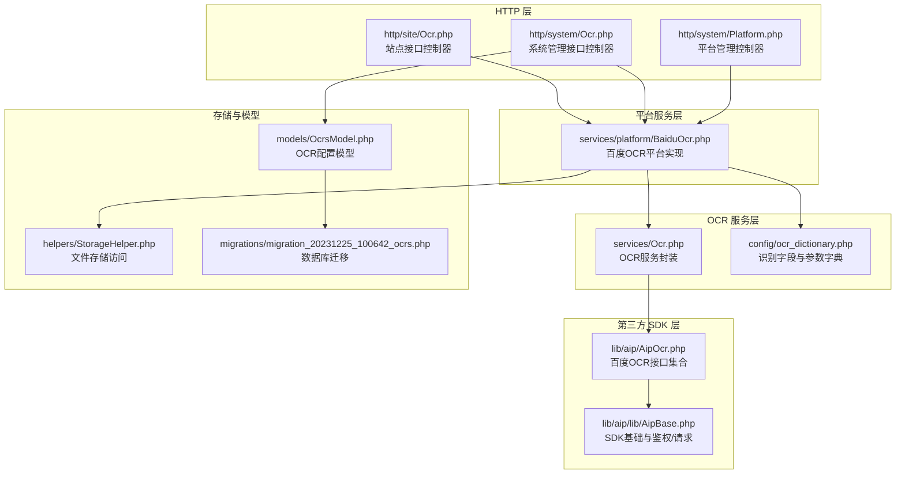
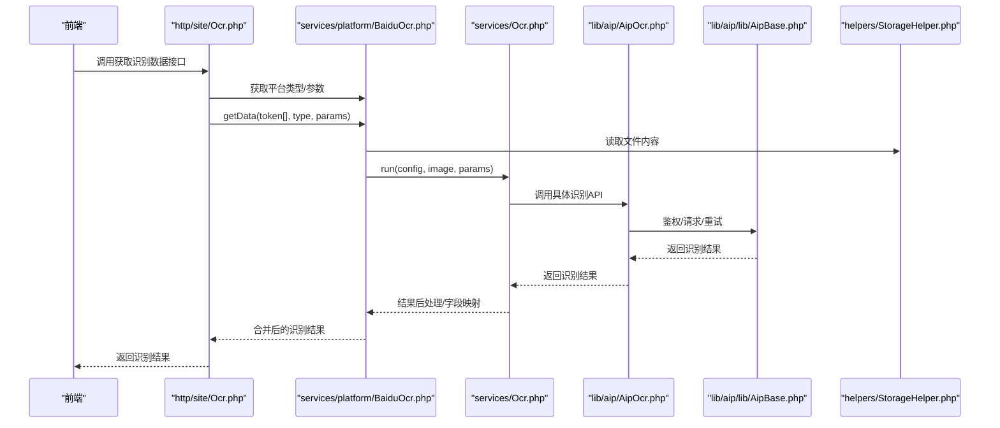
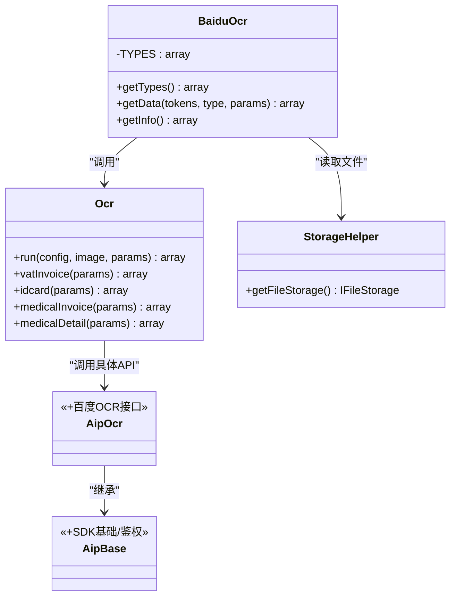
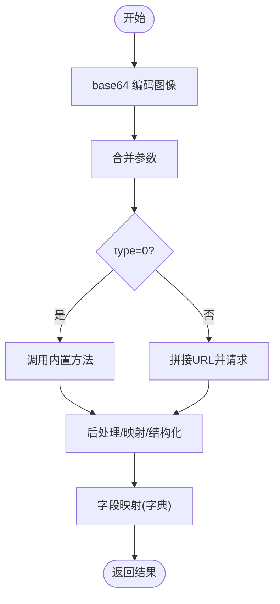
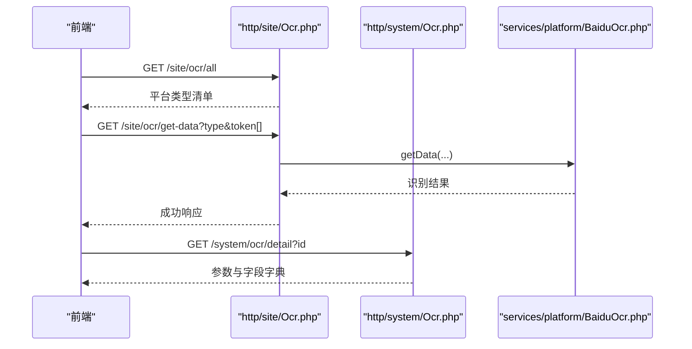
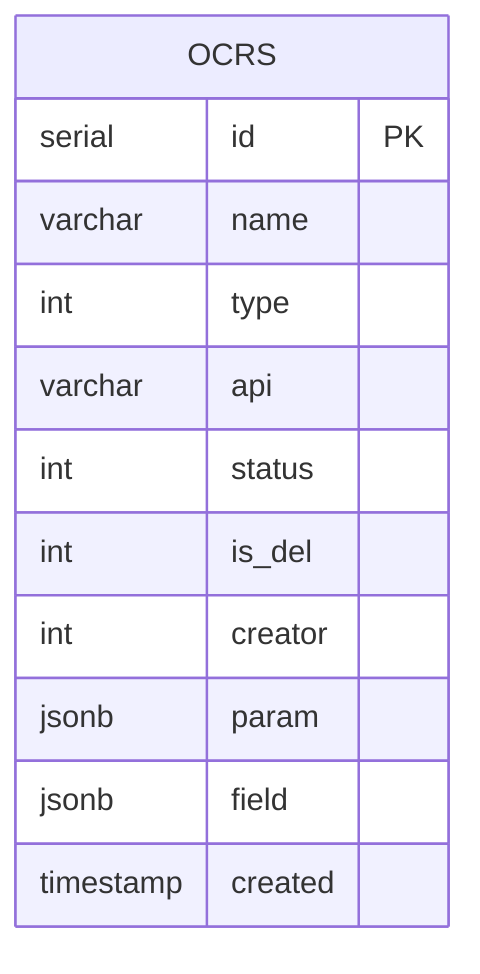
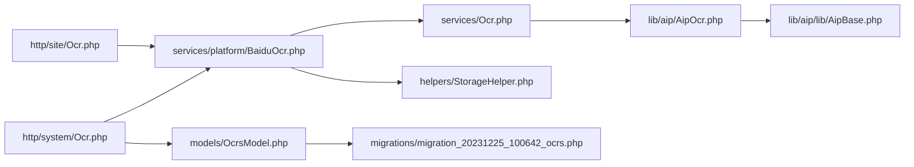

# OCR 文字识别

<cite>
**本文引用的文件**
- [services/Ocr.php](file://process/src/services/Ocr.php)
- [lib/aip/AipOcr.php](file://process/src/lib/aip/AipOcr.php)
- [lib/aip/lib/AipBase.php](file://process/src/lib/aip/lib/AipBase.php)
- [services/platform/BaiduOcr.php](file://process/src/services/platform/BaiduOcr.php)
- [http/site/Ocr.php](file://process/src/http/site/Ocr.php)
- [http/system/Ocr.php](file://process/src/http/system/Ocr.php)
- [helpers/StorageHelper.php](file://process/src/helpers/StorageHelper.php)
- [config/ocr_dictionary.php](file://process/src/config/ocr_dictionary.php)
- [migrations/migration_20231225_100642_ocrs.php](file://process/src/migrations/migration_20231225_100642_ocrs.php)
- [models/OcrsModel.php](file://process/src/models/OcrsModel.php)
- [http/system/Platform.php](file://process/src/http/system/Platform.php)
</cite>

## 目录
1. [引言](#引言)
2. [项目结构](#项目结构)
3. [核心组件](#核心组件)
4. [架构总览](#架构总览)
5. [详细组件分析](#详细组件分析)
6. [依赖关系分析](#依赖关系分析)
7. [性能考虑](#性能考虑)
8. [故障排查指南](#故障排查指南)
9. [结论](#结论)
10. [附录](#附录)

## 引言
本文件面向 htdNew 项目中的 OCR 文字识别系统，系统基于百度智能云 OCR 能力，提供发票、身份证、医疗票据等结构化识别与后处理能力，并通过统一平台抽象实现多平台接入与扩展。本文将从 OCR 在文档处理中的应用出发，系统阐述图像预处理、文字区域检测、字符识别与结果后处理的流程与实现要点，解释接口设计、参数配置、性能调优、最佳实践、错误处理与扩展开发方法。

## 项目结构
OCR 子系统由“HTTP 控制器层 → 平台服务层 → OCR 服务层 → 第三方 SDK 层”构成，配合配置字典与数据库迁移，形成可配置、可扩展、可维护的识别体系。

图表来源
- [http/site/Ocr.php](file://process/src/http/site/Ocr.php#L1-L71)
- [http/system/Ocr.php](file://process/src/http/system/Ocr.php#L1-L103)
- [http/system/Platform.php](file://process/src/http/system/Platform.php#L1-L634)
- [services/platform/BaiduOcr.php](file://process/src/services/platform/BaiduOcr.php#L1-L282)
- [services/Ocr.php](file://process/src/services/Ocr.php#L1-L291)
- [lib/aip/AipOcr.php](file://process/src/lib/aip/AipOcr.php#L1-L200)
- [lib/aip/lib/AipBase.php](file://process/src/lib/aip/lib/AipBase.php#L1-L200)
- [helpers/StorageHelper.php](file://process/src/helpers/StorageHelper.php#L1-L49)
- [config/ocr_dictionary.php](file://process/src/config/ocr_dictionary.php#L1-L188)
- [models/OcrsModel.php](file://process/src/models/OcrsModel.php#L1-L44)
- [migrations/migration_20231225_100642_ocrs.php](file://process/src/migrations/migration_20231225_100642_ocrs.php#L1-L71)

章节来源
- [http/site/Ocr.php](file://process/src/http/site/Ocr.php#L1-L71)
- [http/system/Ocr.php](file://process/src/http/system/Ocr.php#L1-L103)
- [services/platform/BaiduOcr.php](file://process/src/services/platform/BaiduOcr.php#L1-L282)
- [services/Ocr.php](file://process/src/services/Ocr.php#L1-L291)
- [lib/aip/AipOcr.php](file://process/src/lib/aip/AipOcr.php#L1-L200)
- [lib/aip/lib/AipBase.php](file://process/src/lib/aip/lib/AipBase.php#L1-L200)
- [helpers/StorageHelper.php](file://process/src/helpers/StorageHelper.php#L1-L49)
- [config/ocr_dictionary.php](file://process/src/config/ocr_dictionary.php#L1-L188)
- [models/OcrsModel.php](file://process/src/models/OcrsModel.php#L1-L44)
- [migrations/migration_20231225_100642_ocrs.php](file://process/src/migrations/migration_20231225_100642_ocrs.php#L1-L71)

## 核心组件
- 平台适配层：统一抽象第三方 OCR 平台能力，当前实现为百度 OCR，负责类型枚举、参数校验、批量识别与结果聚合。
- OCR 服务层：封装具体识别 API 的调用与结果后处理，包括发票、身份证、医疗票据等结构化解析与字段映射。
- HTTP 接口层：站点接口用于前端调用识别，系统接口用于平台配置与类型详情查询。
- 配置与字典：通过 JSON 字段与参数字典描述识别字段与参数范围，便于前端展示与校验。
- 存储与迁移：文件存储访问与 OCR 配置表迁移，支撑识别资源与配置持久化。

章节来源
- [services/platform/BaiduOcr.php](file://process/src/services/platform/BaiduOcr.php#L1-L282)
- [services/Ocr.php](file://process/src/services/Ocr.php#L1-L291)
- [http/site/Ocr.php](file://process/src/http/site/Ocr.php#L1-L71)
- [http/system/Ocr.php](file://process/src/http/system/Ocr.php#L1-L103)
- [config/ocr_dictionary.php](file://process/src/config/ocr_dictionary.php#L1-L188)
- [migrations/migration_20231225_100642_ocrs.php](file://process/src/migrations/migration_20231225_100642_ocrs.php#L1-L71)

## 架构总览
OCR 识别流程从 HTTP 接口进入，经平台服务选择对应识别类型，读取文件内容，调用 OCR 服务封装的 API，再对结果进行后处理与聚合，最终返回给前端。

图表来源
- [http/site/Ocr.php](file://process/src/http/site/Ocr.php#L1-L71)
- [services/platform/BaiduOcr.php](file://process/src/services/platform/BaiduOcr.php#L223-L264)
- [services/Ocr.php](file://process/src/services/Ocr.php#L1-L291)
- [lib/aip/AipOcr.php](file://process/src/lib/aip/AipOcr.php#L1-L200)
- [lib/aip/lib/AipBase.php](file://process/src/lib/aip/lib/AipBase.php#L135-L175)
- [helpers/StorageHelper.php](file://process/src/helpers/StorageHelper.php#L1-L49)

## 详细组件分析

### 平台适配层：BaiduOcr
- 职责
  - 维护识别类型清单与参数字典，支持前端展示与校验。
  - 读取文件内容，调用 OCR 服务执行识别。
  - 对多张图片识别结果进行聚合，补充发票号等上下文字段。
- 关键点
  - 类型枚举：增值税发票、身份证、医疗发票、医疗费用明细等。
  - 参数字典：每个类型的参数字段、取值范围、中文含义与映射。
  - 批量处理：遍历 token 列表，逐个识别并合并结果。
  - 上下文补充：将发票号等字段透传至明细数组，保证结构一致性。

图表来源
- [services/platform/BaiduOcr.php](file://process/src/services/platform/BaiduOcr.php#L1-L282)
- [services/Ocr.php](file://process/src/services/Ocr.php#L1-L291)
- [lib/aip/AipOcr.php](file://process/src/lib/aip/AipOcr.php#L1-L200)
- [lib/aip/lib/AipBase.php](file://process/src/lib/aip/lib/AipBase.php#L1-L200)
- [helpers/StorageHelper.php](file://process/src/helpers/StorageHelper.php#L1-L49)

章节来源
- [services/platform/BaiduOcr.php](file://process/src/services/platform/BaiduOcr.php#L218-L264)

### OCR 服务层：Ocr
- 职责
  - 统一入口 run(config, image, params)，根据 type 决定走内置方法还是自定义 URL。
  - 提供多种识别场景的后处理逻辑：增值税发票、身份证、医疗发票、医疗费用明细。
  - 对识别结果进行字段清洗、映射与结构化输出。
- 关键点
  - 通用流程：base64 编码图像，合并参数，调用对应 API。
  - 结果后处理：发票日期格式化、字段映射、明细表结构化、重复字段合并。
  - 字典驱动：通过配置字典对字段值进行映射（如风险类型、方向、状态等）。

图表来源
- [services/Ocr.php](file://process/src/services/Ocr.php#L1-L291)
- [config/ocr_dictionary.php](file://process/src/config/ocr_dictionary.php#L1-L188)

章节来源
- [services/Ocr.php](file://process/src/services/Ocr.php#L1-L291)
- [config/ocr_dictionary.php](file://process/src/config/ocr_dictionary.php#L1-L188)

### HTTP 接口层
- 站点接口
  - 获取识别类型：all() 返回平台类型清单。
  - 获取识别数据：getData() 读取 token 列表，调用平台 getData()，返回识别结果。
  - 类型详情：detail() 返回指定类型的参数与字段字典。
- 系统接口
  - 列表查询：按状态、类型、关键词筛选 OCR 配置。
  - 详情查询：返回配置的参数与字段字典，兼容自定义配置。

图表来源
- [http/site/Ocr.php](file://process/src/http/site/Ocr.php#L1-L71)
- [http/system/Ocr.php](file://process/src/http/system/Ocr.php#L1-L103)
- [services/platform/BaiduOcr.php](file://process/src/services/platform/BaiduOcr.php#L223-L264)

章节来源
- [http/site/Ocr.php](file://process/src/http/site/Ocr.php#L1-L71)
- [http/system/Ocr.php](file://process/src/http/system/Ocr.php#L1-L103)

### 数据模型与配置
- OCR 配置表：记录识别接口名称、类型、API 地址、状态、创建者、参数与字段 JSON。
- 迁移脚本：初始化表结构并插入默认识别类型（增值税发票、身份证、医疗发票、医疗费用明细）。

图表来源
- [migrations/migration_20231225_100642_ocrs.php](file://process/src/migrations/migration_20231225_100642_ocrs.php#L1-L71)
- [models/OcrsModel.php](file://process/src/models/OcrsModel.php#L1-L44)

章节来源
- [migrations/migration_20231225_100642_ocrs.php](file://process/src/migrations/migration_20231225_100642_ocrs.php#L1-L71)
- [models/OcrsModel.php](file://process/src/models/OcrsModel.php#L1-L44)

## 依赖关系分析
- 组件耦合
  - 平台层与服务层松耦合：平台层只依赖服务层的 run 接口与内置方法。
  - 服务层与 SDK 层紧耦合：直接调用百度 OCR 接口集合。
  - HTTP 层与平台层弱耦合：通过平台模型与反射获取平台信息。
- 外部依赖
  - 百度智能云 SDK：鉴权、请求、重试与错误处理。
  - 文件存储：统一的文件读取接口，支持本地或其他存储后端。
- 循环依赖
  - 未发现循环依赖，层次清晰。

图表来源
- [http/site/Ocr.php](file://process/src/http/site/Ocr.php#L1-L71)
- [http/system/Ocr.php](file://process/src/http/system/Ocr.php#L1-L103)
- [services/platform/BaiduOcr.php](file://process/src/services/platform/BaiduOcr.php#L1-L282)
- [services/Ocr.php](file://process/src/services/Ocr.php#L1-L291)
- [lib/aip/AipOcr.php](file://process/src/lib/aip/AipOcr.php#L1-L200)
- [lib/aip/lib/AipBase.php](file://process/src/lib/aip/lib/AipBase.php#L1-L200)
- [helpers/StorageHelper.php](file://process/src/helpers/StorageHelper.php#L1-L49)
- [models/OcrsModel.php](file://process/src/models/OcrsModel.php#L1-L44)
- [migrations/migration_20231225_100642_ocrs.php](file://process/src/migrations/migration_20231225_100642_ocrs.php#L1-L71)

## 性能考虑
- 并发与重试
  - SDK 支持并发请求与自动重试，当令牌过期时会重新鉴权并重试一次，提升稳定性。
- 批量处理
  - 平台层对多张图片进行顺序识别，建议在上层控制并发度，避免第三方接口限流。
- 图像预处理
  - 建议在调用前进行裁剪、旋转校正、对比度增强等预处理，以提高识别准确率。
- 结果聚合
  - 对明细表进行一次性合并，减少后续处理成本；注意内存占用与大数据量场景的分批处理策略。

章节来源
- [lib/aip/lib/AipBase.php](file://process/src/lib/aip/lib/AipBase.php#L135-L175)
- [services/platform/BaiduOcr.php](file://process/src/services/platform/BaiduOcr.php#L223-L264)

## 故障排查指南
- 常见错误
  - 未配置 OCR 平台：站点接口会在未设置平台时报错，需在系统平台管理中完成配置。
  - 未知类型：传入的 type 不在平台类型清单中，需检查类型名称或平台配置。
  - 附件不存在：根据 token 无法找到文件，需确认上传与 token 有效性。
  - SDK 连接超时或读取超时：检查网络与代理配置，适当增大超时阈值。
- 定位步骤
  - 校验 HTTP 接口参数与平台配置。
  - 查看平台层 getData 的异常抛出点与返回信息。
  - 检查 SDK 鉴权与请求流程，关注错误码与重试机制。
- 建议
  - 记录请求与响应日志，定位问题接口与参数。
  - 对高频错误（如令牌过期）增加幂等与重试策略。

章节来源
- [http/site/Ocr.php](file://process/src/http/site/Ocr.php#L27-L71)
- [services/platform/BaiduOcr.php](file://process/src/services/platform/BaiduOcr.php#L223-L264)
- [lib/aip/lib/AipBase.php](file://process/src/lib/aip/lib/AipBase.php#L135-L175)

## 结论
htdNew 项目的 OCR 子系统通过平台抽象与服务封装，实现了对百度 OCR 的统一接入与多类型识别能力。系统具备良好的可配置性与扩展性，能够满足发票、身份证、医疗票据等常见文档的结构化识别需求。通过参数字典与后处理逻辑，系统在准确性与易用性之间取得平衡。建议在生产环境中结合图像预处理、合理的并发控制与完善的日志监控，持续优化识别效果与稳定性。

## 附录

### OCR 识别算法原理与准确率优化
- 算法原理
  - 通用识别：基于深度神经网络的文字检测与识别，支持中英文与多语言混合文本。
  - 高精度识别：针对复杂场景（倾斜、遮挡、模糊）优化，提升准确率但耗时更长。
  - 位置信息识别：同时输出文字位置框，便于后续排版与结构化提取。
- 准确率优化建议
  - 图像预处理：裁剪、旋转校正、对比度/亮度调整、去噪。
  - 识别参数：根据场景选择通用/高精度/含位置识别；必要时开启方向检测与风险识别。
  - 结果后处理：利用字段字典进行映射与清洗，减少歧义字段影响。

[本节为概念性说明，不直接分析具体文件]

### 多语言支持
- 百度 OCR 支持多语言识别，可通过语言类型参数选择不同语种组合。
- 在系统中可通过参数字典扩展语言类型选项，前端展示与校验由字典驱动。

[本节为概念性说明，不直接分析具体文件]

### 接口设计与参数配置
- 站点接口
  - 获取类型：返回平台类型清单，包含类型标识、名称与参数字典。
  - 获取数据：接收 type、token 数组与 params，返回识别结果。
  - 类型详情：返回指定类型的参数与字段字典。
- 系统接口
  - 列表：按状态、类型、关键词筛选 OCR 配置。
  - 详情：返回配置的参数与字段字典，支持自定义配置覆盖。

章节来源
- [http/site/Ocr.php](file://process/src/http/site/Ocr.php#L1-L71)
- [http/system/Ocr.php](file://process/src/http/system/Ocr.php#L1-L103)

### 性能调优与最佳实践
- 调优要点
  - 合理设置连接与套接字超时，避免长时间阻塞。
  - 控制批量识别并发度，避免触发第三方限流。
  - 使用缓存与预热策略，降低鉴权与初始化开销。
- 最佳实践
  - 在调用前进行图像预处理，提升识别质量。
  - 对识别结果进行二次校验与规则过滤，减少误判。
  - 分批处理大批量任务，结合进度与错误重试机制。

章节来源
- [lib/aip/lib/AipBase.php](file://process/src/lib/aip/lib/AipBase.php#L90-L116)
- [services/platform/BaiduOcr.php](file://process/src/services/platform/BaiduOcr.php#L223-L264)

### 错误处理与扩展开发
- 错误处理
  - 平台层对缺失附件、未知类型等情况进行明确报错。
  - SDK 层对连接/读取超时与令牌过期进行捕获与重试。
- 扩展开发
  - 新增平台：实现平台接口与 getInfo，注册类型与参数字典。
  - 新增识别类型：在服务层新增方法并完善后处理逻辑，更新字典与迁移。
  - 存储扩展：通过存储助手切换不同存储后端，保持接口一致。

章节来源
- [http/system/Platform.php](file://process/src/http/system/Platform.php#L1-L634)
- [services/platform/BaiduOcr.php](file://process/src/services/platform/BaiduOcr.php#L1-L282)
- [services/Ocr.php](file://process/src/services/Ocr.php#L1-L291)
- [lib/aip/lib/AipBase.php](file://process/src/lib/aip/lib/AipBase.php#L160-L175)