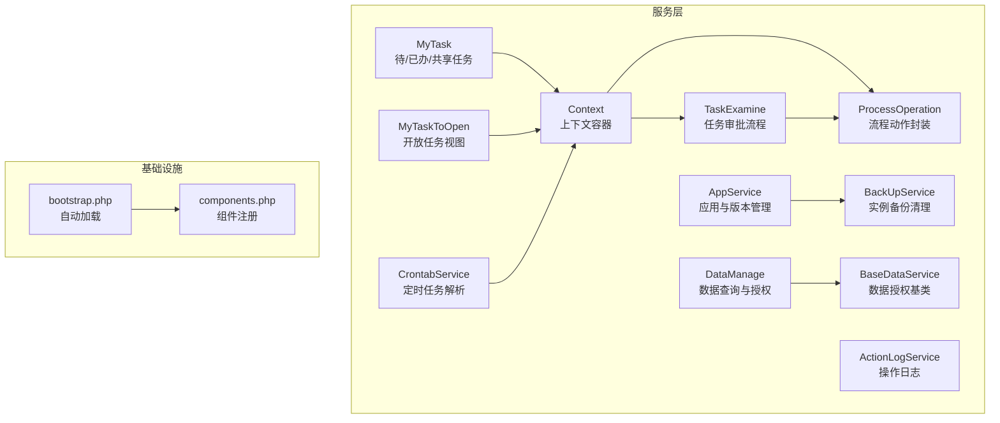
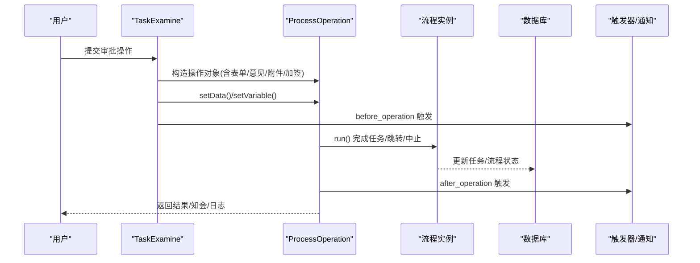
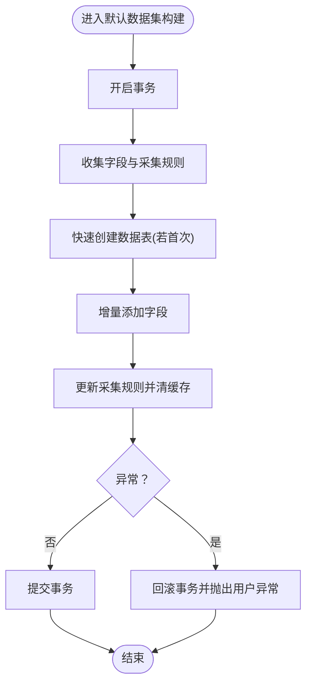
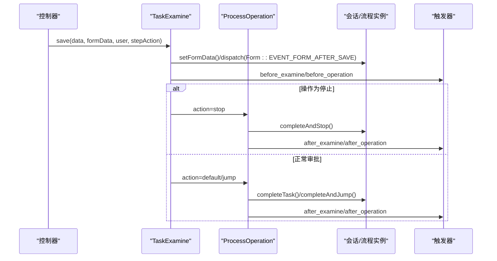
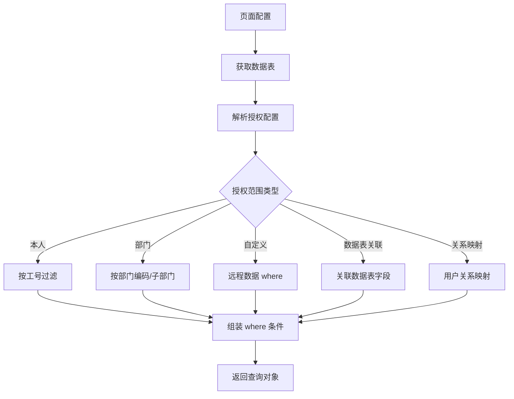
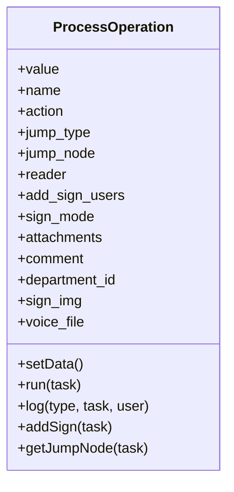
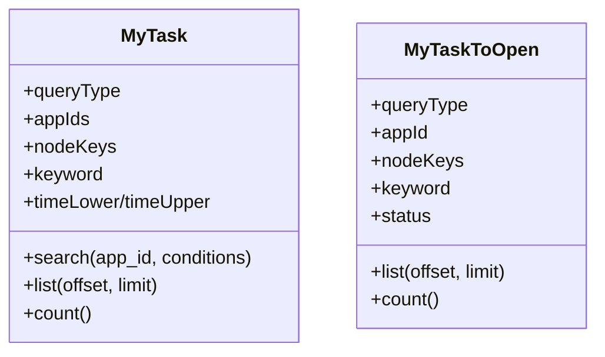
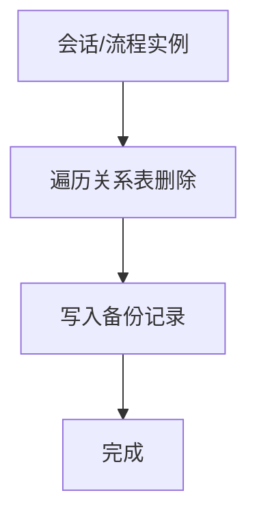
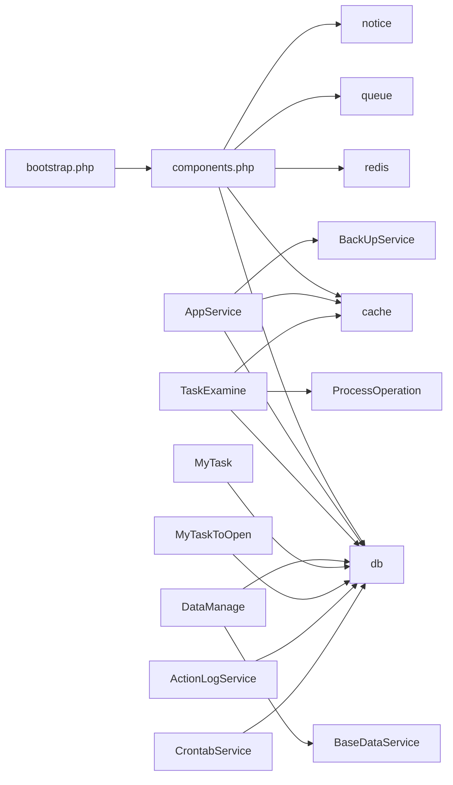

# 业务服务层

<cite>
**本文引用的文件**
- [bootstrap.php](file://process/src/bootstrap.php)
- [components.php](file://process/src/config/components.php)
- [AppService.php](file://process/src/services/AppService.php)
- [TaskExamine.php](file://process/src/services/TaskExamine.php)
- [DataManage.php](file://process/src/services/DataManage.php)
- [BaseDataService.php](file://process/src/services/BaseDataService.php)
- [Context.php](file://process/src/services/Context.php)
- [ProcessOperation.php](file://process/src/services/ProcessOperation.php)
- [BackUpService.php](file://process/src/services/BackUpService.php)
- [ActionLogService.php](file://process/src/services/ActionLogService.php)
- [MyTask.php](file://process/src/services/MyTask.php)
- [MyTaskToOpen.php](file://process/src/services/MyTaskToOpen.php)
- [CrontabService.php](file://process/src/services/CrontabService.php)
</cite>

## 目录
1. [引言](#引言)
2. [项目结构](#项目结构)
3. [核心组件](#核心组件)
4. [架构总览](#架构总览)
5. [详细组件分析](#详细组件分析)
6. [依赖分析](#依赖分析)
7. [性能考量](#性能考量)
8. [故障排查指南](#故障排查指南)
9. [结论](#结论)
10. [附录](#附录)

## 引言
本文件面向 htdNew 项目的业务服务层，系统化梳理服务架构设计、服务间通信机制与事务管理策略，覆盖应用服务的应用管理、任务审核服务的审批流程、数据管理服务的数据操作与平台服务的通用能力。文档同时阐述服务组合模式、依赖注入与错误处理机制，并给出服务监控、性能优化与扩展性设计建议，以及业务服务开发指南与最佳实践。

## 项目结构
业务服务层位于 process/src/services 目录，围绕“应用管理、流程审批、数据访问、任务列表、备份与审计、计划任务”等维度组织。框架通过自动加载与组件配置实现服务发现与依赖注入，配合上下文对象在流程中传递运行期变量。

图表来源
- [bootstrap.php](file://process/src/bootstrap.php#L1-L40)
- [components.php](file://process/src/config/components.php#L1-L34)
- [AppService.php](file://process/src/services/AppService.php#L1-L120)
- [TaskExamine.php](file://process/src/services/TaskExamine.php#L1-L120)
- [DataManage.php](file://process/src/services/DataManage.php#L1-L60)
- [BaseDataService.php](file://process/src/services/BaseDataService.php#L1-L120)
- [ProcessOperation.php](file://process/src/services/ProcessOperation.php#L1-L120)
- [MyTask.php](file://process/src/services/MyTask.php#L1-L120)
- [MyTaskToOpen.php](file://process/src/services/MyTaskToOpen.php#L1-L120)
- [BackUpService.php](file://process/src/services/BackUpService.php#L1-L80)
- [ActionLogService.php](file://process/src/services/ActionLogService.php#L1-L80)
- [CrontabService.php](file://process/src/services/CrontabService.php#L1-L60)
- [Context.php](file://process/src/services/Context.php#L1-L60)

章节来源
- [bootstrap.php](file://process/src/bootstrap.php#L1-L40)
- [components.php](file://process/src/config/components.php#L1-L34)

## 核心组件
- 应用服务 AppService：负责事项创建、版本发布、模块与流程/表单配置保存、默认数据集初始化与采集规则更新；涉及事务控制与审计日志。
- 任务审核 TaskExamine：封装审批保存、获取审批人、执行审批动作、加签与跳转等流程操作；通过触发器与上下文驱动。
- 数据管理 DataManage：基于页面绑定的数据表与授权配置，构造查询条件，支持分类过滤与自定义范围。
- 数据授权基类 BaseDataService：统一处理部门/本人/自定义/按数据表关联等多种授权范围，支持桌面场景差异。
- 流程动作 ProcessOperation：封装审批动作（默认/跳转/中止）、二次验证、知会、加签、日志记录与触发器派发。
- 任务列表 MyTask / MyTaskToOpen：分别面向内部与开放场景的任务查询、格式化与排序，支持多种筛选与状态标志。
- 备份清理 BackUpService：按流程实例关系表进行级联清理与备份，保障测试流程安全回滚。
- 操作日志 ActionLogService：对数据表的增删改查进行结构化日志记录与检索。
- 定时任务 CrontabService：解析 crontab 字符串，匹配当前时间粒度。

章节来源
- [AppService.php](file://process/src/services/AppService.php#L1-L120)
- [TaskExamine.php](file://process/src/services/TaskExamine.php#L1-L120)
- [DataManage.php](file://process/src/services/DataManage.php#L1-L60)
- [BaseDataService.php](file://process/src/services/BaseDataService.php#L1-L120)
- [ProcessOperation.php](file://process/src/services/ProcessOperation.php#L1-L120)
- [MyTask.php](file://process/src/services/MyTask.php#L1-L120)
- [MyTaskToOpen.php](file://process/src/services/MyTaskToOpen.php#L1-L120)
- [BackUpService.php](file://process/src/services/BackUpService.php#L1-L80)
- [ActionLogService.php](file://process/src/services/ActionLogService.php#L1-L80)
- [CrontabService.php](file://process/src/services/CrontabService.php#L1-L60)

## 架构总览
服务层采用“职责清晰、边界明确”的分层设计：
- 服务编排：AppService、TaskExamine、DataManage 等作为业务编排者，协调模型与引擎。
- 触发器与上下文：通过 Context 传递变量，结合 TriggerModel 的事件派发，实现前后置钩子与幂等处理。
- 事务与一致性：关键路径（如默认数据集构建）显式开启事务，异常即回滚。
- 组件注入：components.php 定义 db/cache/redis/queue/notice 等组件，bootstrap.php 提供命名空间自动加载。

图表来源
- [TaskExamine.php](file://process/src/services/TaskExamine.php#L120-L210)
- [ProcessOperation.php](file://process/src/services/ProcessOperation.php#L230-L310)

章节来源
- [TaskExamine.php](file://process/src/services/TaskExamine.php#L120-L210)
- [ProcessOperation.php](file://process/src/services/ProcessOperation.php#L230-L310)

## 详细组件分析

### 应用服务 AppService
- 关键能力
  - 事项创建与属性保存、状态与 flags 管理、审计日志记录。
  - 版本发布与启用、模块与流程/表单配置保存、节点变更校验与兼容处理。
  - 数据组件锁定与表单插件绑定、默认数据集初始化与字段采集规则更新。
  - 事务控制：默认数据集构建在事务内执行，异常回滚并抛出用户异常。
- 事务管理
  - 在默认数据集构建入口显式开启事务，成功提交，失败回滚并包装为用户异常。
- 错误处理
  - 对输入参数、流程完整性（开始/结束节点）、节点变更影响等进行严格校验，不符合条件抛出用户异常。
- 性能与扩展
  - 使用缓存与批量查询减少数据库往返；默认数据集构建按需增量更新字段。

图表来源
- [AppService.php](file://process/src/services/AppService.php#L480-L532)

章节来源
- [AppService.php](file://process/src/services/AppService.php#L1-L120)
- [AppService.php](file://process/src/services/AppService.php#L380-L532)

### 任务审核服务 TaskExamine
- 关键能力
  - 审批保存：根据节点场景与表单授权，保存表单数据、多步表单状态、临时保存操作。
  - 审批执行：设置变量、获取审批人、执行动作、跳过后续任务、创建快照、清理代理与共享。
  - 操作构造：从请求数据解析操作配置，支持二次验证、加签、知会、评论与附件。
- 服务间通信
  - 通过 Context 注入当前操作、任务、会话等上下文，触发 before/after operation 事件。
  - 与 ProcessOperation 协作完成任务完成、跳转、中止等动作。
- 错误处理
  - 对部门参数、加签人员重复等进行前置校验，抛出用户异常。

图表来源
- [TaskExamine.php](file://process/src/services/TaskExamine.php#L50-L140)
- [ProcessOperation.php](file://process/src/services/ProcessOperation.php#L230-L310)

章节来源
- [TaskExamine.php](file://process/src/services/TaskExamine.php#L1-L120)
- [TaskExamine.php](file://process/src/services/TaskExamine.php#L120-L210)
- [ProcessOperation.php](file://process/src/services/ProcessOperation.php#L1-L120)

### 数据管理服务 DataManage 与授权基类 BaseDataService
- 关键能力
  - 页面绑定数据表与授权配置解析，动态拼装 where 条件。
  - 支持分类过滤、自定义范围、按关系/部门/本人/数据表关联等授权方式。
- 授权策略
  - BaseDataService 提供统一授权解析：部门（含子部门）、本人、自定义 where、按数据表字段关联等。
  - 桌面场景提供独立格式化逻辑，支持“本人添加范围”与 OR 组合。
- 性能建议
  - 合理利用缓存与索引；对大数据量场景建议分页与投影字段。

图表来源
- [DataManage.php](file://process/src/services/DataManage.php#L1-L60)
- [BaseDataService.php](file://process/src/services/BaseDataService.php#L1-L120)

章节来源
- [DataManage.php](file://process/src/services/DataManage.php#L1-L93)
- [BaseDataService.php](file://process/src/services/BaseDataService.php#L1-L220)

### 流程动作 ProcessOperation
- 关键能力
  - 操作配置解析、二次验证、加签（并行/会后）、知会、日志记录、触发器派发。
  - 支持跳转类型（父子执行/顶级执行），并维护来源节点以便回跳。
- 事务与异步
  - 二次验证通过后，于事务成功回调中清理票据，确保一致性。

图表来源
- [ProcessOperation.php](file://process/src/services/ProcessOperation.php#L1-L200)

章节来源
- [ProcessOperation.php](file://process/src/services/ProcessOperation.php#L1-L200)

### 任务列表服务 MyTask / MyTaskToOpen
- 关键能力
  - 多种查询类型（待办/已办/共享/委托），支持关键词、时间范围、部门、岗位、节点键等筛选。
  - 格式化输出包含任务状态、节点信息、审批人、URL、标志位等。
  - 开放场景（MyTaskToOpen）支持全局事件开关与公开查询。
- 性能建议
  - 合理使用左连接与投影字段；对高频查询建立必要索引。

图表来源
- [MyTask.php](file://process/src/services/MyTask.php#L1-L120)
- [MyTaskToOpen.php](file://process/src/services/MyTaskToOpen.php#L1-L120)

章节来源
- [MyTask.php](file://process/src/services/MyTask.php#L1-L200)
- [MyTaskToOpen.php](file://process/src/services/MyTaskToOpen.php#L1-L200)

### 备份清理 BackUpService
- 关键能力
  - 按流程实例关系表进行级联删除与备份，支持测试流程清理与默认数据集联动清理。
  - 通过事件在删除前触发，保证上下游一致性。

图表来源
- [BackUpService.php](file://process/src/services/BackUpService.php#L70-L128)

章节来源
- [BackUpService.php](file://process/src/services/BackUpService.php#L1-L128)

### 操作日志 ActionLogService
- 关键能力
  - 对数据表的增删改查进行结构化日志记录，支持按模型/关键字/时间范围检索。
- 实践建议
  - 对大表写入日志时注意异步化与批量落库，避免阻塞主流程。

章节来源
- [ActionLogService.php](file://process/src/services/ActionLogService.php#L1-L170)

### 定时任务 CrontabService
- 关键能力
  - 解析 crontab 字符串，按分/时/日/月/周粒度匹配当前时间，支持“,”“/”“-”等语法。
- 实践建议
  - 结合计划任务调度器定期扫描，避免跨天/跨月边界误差。

章节来源
- [CrontabService.php](file://process/src/services/CrontabService.php#L1-L84)

## 依赖分析
- 自动加载与组件注入
  - bootstrap.php 基于命名空间与目录约定实现自动加载；components.php 注册 db/cache/redis/queue/notice 等组件，供服务层按需使用。
- 服务间耦合
  - TaskExamine 与 ProcessOperation 强耦合（动作执行）；AppService 与 BackUpService 存在流程实例清理协作；DataManage 依赖 BaseDataService 的授权解析。
- 外部依赖
  - 数据库（db）、缓存（cache/redis）、队列（queue）、通知（notice）等通过组件配置注入。

图表来源
- [bootstrap.php](file://process/src/bootstrap.php#L1-L40)
- [components.php](file://process/src/config/components.php#L1-L34)
- [AppService.php](file://process/src/services/AppService.php#L1-L120)
- [TaskExamine.php](file://process/src/services/TaskExamine.php#L1-L120)
- [DataManage.php](file://process/src/services/DataManage.php#L1-L60)
- [BaseDataService.php](file://process/src/services/BaseDataService.php#L1-L120)
- [ProcessOperation.php](file://process/src/services/ProcessOperation.php#L1-L120)
- [MyTask.php](file://process/src/services/MyTask.php#L1-L120)
- [MyTaskToOpen.php](file://process/src/services/MyTaskToOpen.php#L1-L120)
- [ActionLogService.php](file://process/src/services/ActionLogService.php#L1-L80)
- [CrontabService.php](file://process/src/services/CrontabService.php#L1-L60)

章节来源
- [bootstrap.php](file://process/src/bootstrap.php#L1-L40)
- [components.php](file://process/src/config/components.php#L1-L34)

## 性能考量
- 查询优化
  - 合理使用投影字段与分页；对高频筛选字段建立索引；避免 N+1 查询（如任务列表中会话与用户信息按需拉取）。
- 缓存策略
  - 利用缓存组件与模型缓存接口（如 getCache）降低热点查询开销；默认数据集构建后及时清缓存，避免脏读。
- 事务与锁
  - 关键路径显式开启事务，缩短事务持有时间；对并发写入场景使用乐观锁或唯一约束。
- 日志与监控
  - 对耗时操作记录慢日志；对审批链路的关键节点埋点统计；对定时任务执行时间与成功率进行监控。

## 故障排查指南
- 审批失败/重复加签
  - 检查加签人员是否已在审批人/加签人列表；确认节点配置与审批人计算逻辑。
- 流程节点变更导致实例异常
  - AppService 在流程节点删除时进行保护校验，避免删除已产生实例的环节；必要时清理测试会话。
- 数据查询越权
  - 检查页面授权配置与 BaseDataService 的授权范围解析；确认部门/本人/自定义/数据表关联等分支是否正确。
- 事务未生效
  - 确认默认数据集构建是否在事务内执行；异常是否被包装为用户异常导致前端误解。
- 通知/触发器未触发
  - 检查 Context 是否正确注入；before/after operation 事件是否按节点键正确派发。

章节来源
- [TaskExamine.php](file://process/src/services/TaskExamine.php#L200-L266)
- [AppService.php](file://process/src/services/AppService.php#L160-L220)
- [BaseDataService.php](file://process/src/services/BaseDataService.php#L1-L120)
- [ProcessOperation.php](file://process/src/services/ProcessOperation.php#L230-L310)

## 结论
htdNew 业务服务层以清晰的职责划分与强健的事务/触发器机制支撑复杂流程与数据操作。通过组件化与上下文传递，服务间协作高效且可扩展。建议在高并发与大数据场景下进一步完善缓存、索引与异步化策略，并持续完善监控与告警体系，确保系统稳定性与可观测性。

## 附录
- 业务服务开发指南与最佳实践
  - 服务职责单一：每个服务聚焦一个领域，避免“上帝对象”。
  - 显式事务：对关键写入路径使用事务，异常即回滚。
  - 上下文传递：通过 Context 传递变量与上下文，避免全局状态。
  - 触发器幂等：before/after 触发器应具备幂等性，避免重复执行副作用。
  - 授权最小化：遵循 BaseDataService 的授权策略，确保数据访问最小权限。
  - 日志与审计：对敏感操作与关键路径记录结构化日志，便于追踪与审计。
  - 性能优先：合理使用缓存、索引与分页，避免 N+1 查询与长事务。