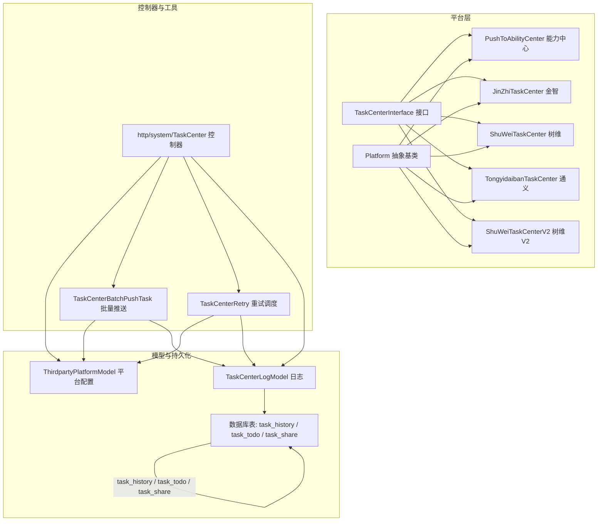
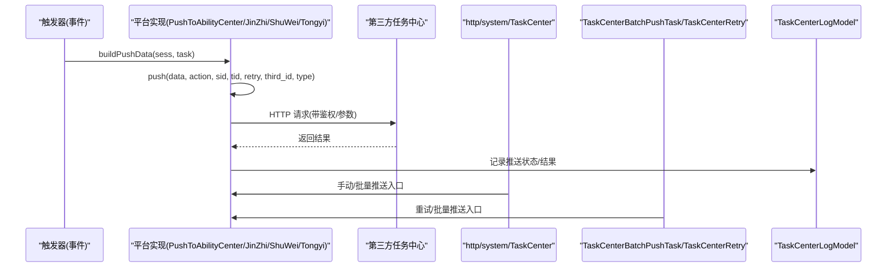
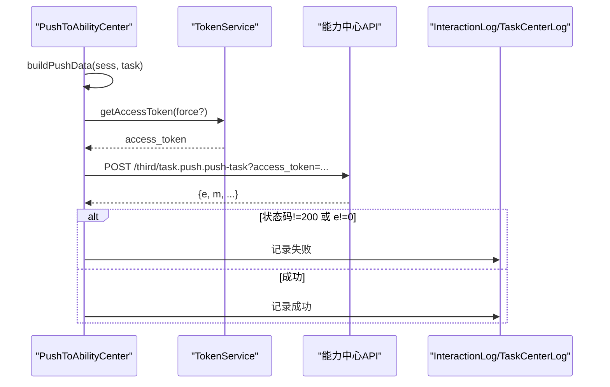
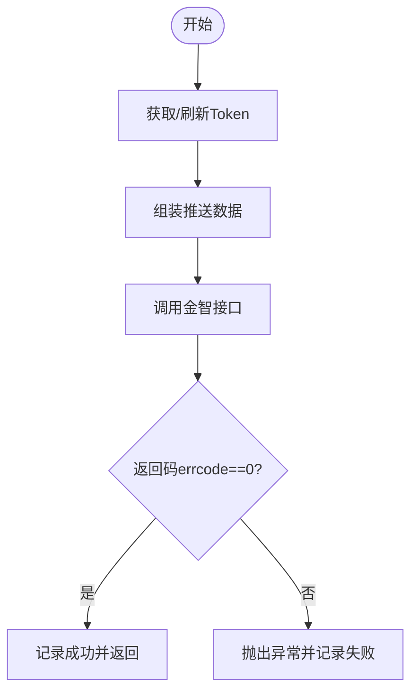
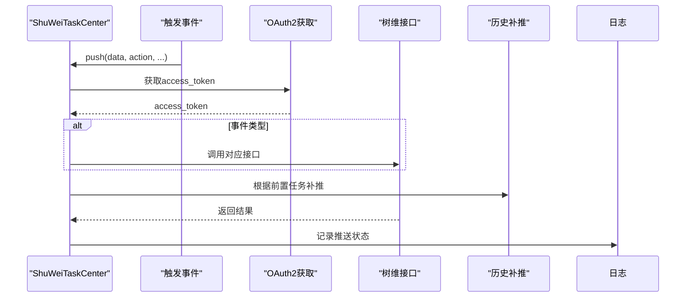
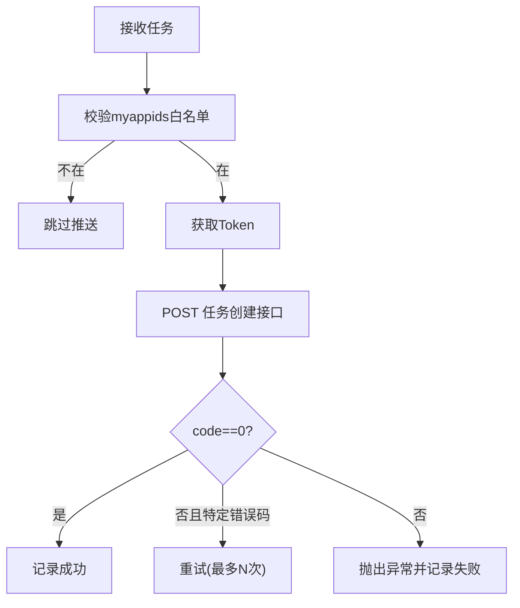
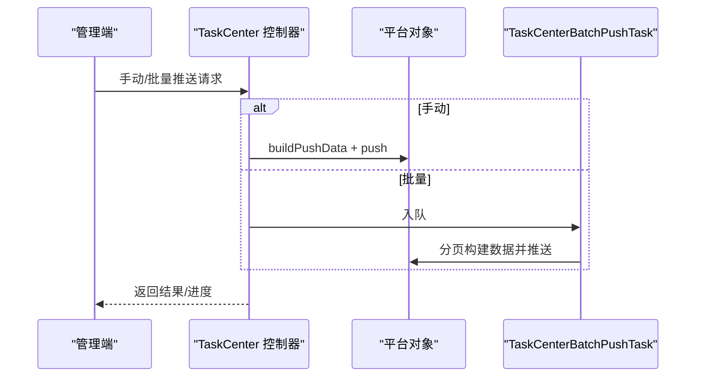
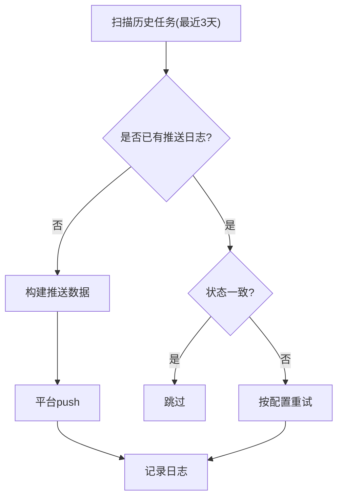
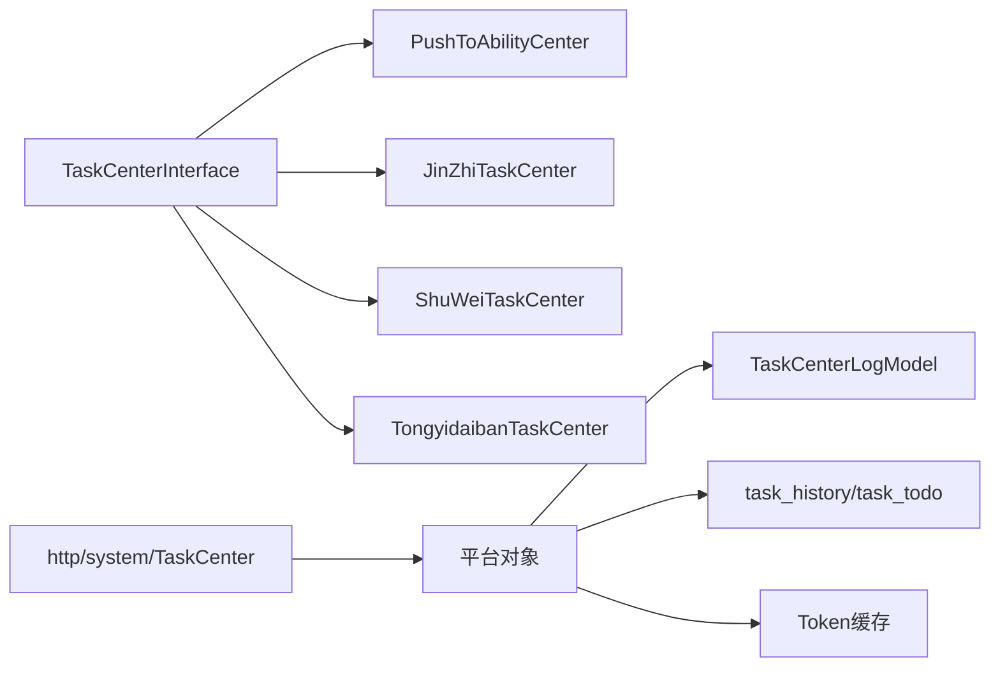
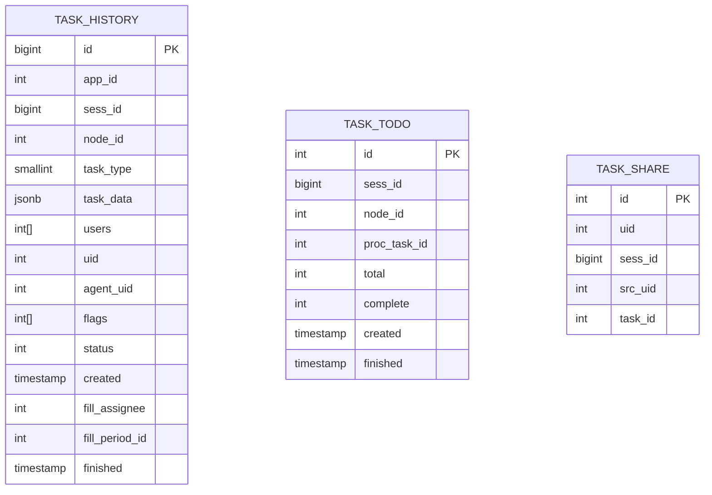

# 任务中心服务

<cite>
**本文引用的文件**
- [process/src/services/platform/TaskCenterInterface.php](file://process/src/services/platform/TaskCenterInterface.php)
- [process/src/services/platform/PushToAbilityCenter.php](file://process/src/services/platform/PushToAbilityCenter.php)
- [process/src/services/platform/JinZhiTaskCenter.php](file://process/src/services/platform/JinZhiTaskCenter.php)
- [process/src/services/platform/ShuWeiTaskCenter.php](file://process/src/services/platform/ShuWeiTaskCenter.php)
- [process/src/services/platform/TongyidaibanTaskCenter.php](file://process/src/services/platform/TongyidaibanTaskCenter.php)
- [process/src/services/platform/ShuWeiTaskCenterV2.php](file://process/src/services/platform/ShuWeiTaskCenterV2.php)
- [process/src/services/platform/Platform.php](file://process/src/services/platform/Platform.php)
- [process/src/models/TaskCenterLogModel.php](file://process/src/models/TaskCenterLogModel.php)
- [process/src/models/ThirdpartyPlatformModel.php](file://process/src/models/ThirdpartyPlatformModel.php)
- [process/src/services/task/TaskCenterBatchPushTask.php](file://process/src/services/task/TaskCenterBatchPushTask.php)
- [process/src/services/task/TaskCenterRetry.php](file://process/src/services/task/TaskCenterRetry.php)
- [process/src/http/system/TaskCenter.php](file://process/src/http/system/TaskCenter.php)
- [process/docs/sql/database.sql](file://process/docs/sql/database.sql)
- [process/src/migrations/migration_20250730_102435_personal_v2.php](file://process/src/migrations/migration_20250730_102435_personal_v2.php)
- [process/src/http/site/Task.php](file://process/src/http/site/Task.php)
- [process_envs/gzucm/product/listeners/PushCreateFillTaskListener.php](file://process_envs/gzucm/product/listeners/PushCreateFillTaskListener.php)
- [process_envs/tmmu/product/listeners/PushFinishArchiveDelDataListener.php](file://process_envs/tmmu/product/listeners/PushFinishArchiveDelDataListener.php)
- [process_envs/cugb/product/commands/Demo.php](file://process_envs/cugb/product/commands/Demo.php)
- [process_envs/cppu/product/task/UserTask.php](file://process_envs/cppu/product/task/UserTask.php)
</cite>

## 目录
1. [简介](#简介)
2. [项目结构](#项目结构)
3. [核心组件](#核心组件)
4. [架构总览](#架构总览)
5. [详细组件分析](#详细组件分析)
6. [依赖关系分析](#依赖关系分析)
7. [性能考量](#性能考量)
8. [故障排查指南](#故障排查指南)
9. [结论](#结论)
10. [附录](#附录)

## 简介
本文件面向 htdNew 项目的“任务中心服务”，系统性梳理任务推送机制、多任务中心集成与任务同步策略，覆盖能力中心推送、金智任务中心、通义代办任务中心、数信任务中心、智慧任务中心以及各高校任务中心的集成方案。文档重点阐述：
- 任务推送策略与触发链路
- 数据同步机制与状态跟踪
- 接口设计、参数传递与异常处理
- 性能优化建议与扩展开发指南

## 项目结构
任务中心服务围绕“平台抽象 + 多实现 + 控制器 + 日志模型 + 批量/重试工具”的结构组织，形成可插拔、可配置、可观测的任务中心集成体系。

图表来源
- [process/src/services/platform/TaskCenterInterface.php](file://process/src/services/platform/TaskCenterInterface.php#L1-L34)
- [process/src/services/platform/Platform.php](file://process/src/services/platform/Platform.php)
- [process/src/services/platform/PushToAbilityCenter.php](file://process/src/services/platform/PushToAbilityCenter.php#L1-L323)
- [process/src/services/platform/JinZhiTaskCenter.php](file://process/src/services/platform/JinZhiTaskCenter.php#L1-L383)
- [process/src/services/platform/ShuWeiTaskCenter.php](file://process/src/services/platform/ShuWeiTaskCenter.php#L1-L800)
- [process/src/services/platform/TongyidaibanTaskCenter.php](file://process/src/services/platform/TongyidaibanTaskCenter.php#L1-L240)
- [process/src/http/system/TaskCenter.php](file://process/src/http/system/TaskCenter.php#L1-L861)
- [process/src/models/TaskCenterLogModel.php](file://process/src/models/TaskCenterLogModel.php#L1-L74)
- [process/docs/sql/database.sql](file://process/docs/sql/database.sql#L335-L368)

章节来源
- [process/src/services/platform/TaskCenterInterface.php](file://process/src/services/platform/TaskCenterInterface.php#L1-L34)
- [process/src/http/system/TaskCenter.php](file://process/src/http/system/TaskCenter.php#L1-L861)

## 核心组件
- 平台接口与抽象基类
  - TaskCenterInterface：统一定义 push 与 buildPushData 的契约，约束 action/sid/tid/retry/third_id/type 等参数。
  - Platform：提供通用能力（如 Token 获取、HTTP 请求封装等），各具体平台继承该基类实现差异化逻辑。
- 具体平台实现
  - 能力中心（PushToAbilityCenter）：统一构建实例/任务数据，调用第三方任务推送接口，记录交互日志与任务中心日志。
  - 金智任务中心（JinZhiTaskCenter）：提供 token 获取、任务发起/修改/删除、实例删除等接口封装。
  - 树维任务中心（ShuWeiTaskCenter）：OAuth2 获取 token，按事件类型（接收、审批完成、终止、催办、转办等）推送不同接口，支持历史任务补推。
  - 通义代办任务中心（TongyidaibanTaskCenter）：基于 Token 的统一推送，带重试与幂等控制。
  - 树维任务中心 V2（ShuWeiTaskCenterV2）：与 V1 类似，提供更细粒度的事务类型与消息通道配置。
- 控制器与工具
  - http/system/TaskCenter：平台管理、手动/批量推送、日志查询、变更记录、触发器创建等。
  - TaskCenterBatchPushTask：按条件分页批量推送，支持第三方平台对象动态解析与替换。
  - TaskCenterRetry：定时扫描历史任务，对未推送或失败的任务进行重试与状态校验。
- 模型与持久化
  - TaskCenterLogModel：记录每次推送的 sess_id/task_id/third_id/push_status/type/data/result 等。
  - ThirdpartyPlatformModel：平台配置、反射生成对象、兼容“融合平台”替换逻辑。
  - 数据库表：task_history、task_todo、task_share 等，支撑任务状态与历史记录。

章节来源
- [process/src/services/platform/TaskCenterInterface.php](file://process/src/services/platform/TaskCenterInterface.php#L1-L34)
- [process/src/services/platform/Platform.php](file://process/src/services/platform/Platform.php)
- [process/src/services/platform/PushToAbilityCenter.php](file://process/src/services/platform/PushToAbilityCenter.php#L1-L323)
- [process/src/services/platform/JinZhiTaskCenter.php](file://process/src/services/platform/JinZhiTaskCenter.php#L1-L383)
- [process/src/services/platform/ShuWeiTaskCenter.php](file://process/src/services/platform/ShuWeiTaskCenter.php#L1-L800)
- [process/src/services/platform/TongyidaibanTaskCenter.php](file://process/src/services/platform/TongyidaibanTaskCenter.php#L1-L240)
- [process/src/http/system/TaskCenter.php](file://process/src/http/system/TaskCenter.php#L1-L861)
- [process/src/models/TaskCenterLogModel.php](file://process/src/models/TaskCenterLogModel.php#L1-L74)
- [process/src/models/ThirdpartyPlatformModel.php](file://process/src/models/ThirdpartyPlatformModel.php#L659-L686)
- [process/docs/sql/database.sql](file://process/docs/sql/database.sql#L335-L368)

## 架构总览
任务中心服务采用“事件驱动 + 平台抽象 + 统一日志 + 批量/重试”的整体架构。核心流程如下：

图表来源
- [process/src/services/platform/PushToAbilityCenter.php](file://process/src/services/platform/PushToAbilityCenter.php#L194-L266)
- [process/src/services/platform/ShuWeiTaskCenter.php](file://process/src/services/platform/ShuWeiTaskCenter.php#L300-L409)
- [process/src/services/platform/JinZhiTaskCenter.php](file://process/src/services/platform/JinZhiTaskCenter.php#L174-L383)
- [process/src/services/platform/TongyidaibanTaskCenter.php](file://process/src/services/platform/TongyidaibanTaskCenter.php#L126-L239)
- [process/src/http/system/TaskCenter.php](file://process/src/http/system/TaskCenter.php#L610-L740)
- [process/src/services/task/TaskCenterBatchPushTask.php](file://process/src/services/task/TaskCenterBatchPushTask.php#L85-L169)
- [process/src/services/task/TaskCenterRetry.php](file://process/src/services/task/TaskCenterRetry.php#L1-L223)
- [process/src/models/TaskCenterLogModel.php](file://process/src/models/TaskCenterLogModel.php#L1-L74)

## 详细组件分析

### 能力中心推送（PushToAbilityCenter）
- 职责
  - 构建实例与任务数据，统一映射状态与 URL。
  - 通过 Token 获取与 API 调用，向能力中心推送任务。
  - 记录交互日志与任务中心日志，支持失败重试标记。
- 关键点
  - 会话状态映射：进行中/终止/完成/驳回/撤销 → 0/1/2/3/4。
  - 任务状态映射：未申领/已办 → 0/3。
  - URL 与 Header：Content-Type: application/json，携带 access_token。
  - 异常处理：状态码非 200 或返回 e!=0 时记录失败，捕获异常并落库。
- 适用场景
  - 独立部署任务中心，统一推送协议。

图表来源
- [process/src/services/platform/PushToAbilityCenter.php](file://process/src/services/platform/PushToAbilityCenter.php#L69-L192)
- [process/src/services/platform/PushToAbilityCenter.php](file://process/src/services/platform/PushToAbilityCenter.php#L194-L266)

章节来源
- [process/src/services/platform/PushToAbilityCenter.php](file://process/src/services/platform/PushToAbilityCenter.php#L1-L323)

### 金智任务中心（JinZhiTaskCenter）
- 职责
  - 提供 token 获取与多接口封装：任务发起/修改/删除、实例删除、发起即结束。
  - 统一请求封装与错误处理，记录推送记录。
- 关键点
  - token 缓存：Redis 缓存，过期前刷新。
  - 接口幂等：通过返回码 errcode 判断。
  - 场景编码 sceneCode：用于区分业务场景。
- 适用场景
  - 高校定制化任务中心对接，支持“发起即结束”等特殊流程。

图表来源
- [process/src/services/platform/JinZhiTaskCenter.php](file://process/src/services/platform/JinZhiTaskCenter.php#L151-L383)

章节来源
- [process/src/services/platform/JinZhiTaskCenter.php](file://process/src/services/platform/JinZhiTaskCenter.php#L1-L383)

### 树维任务中心（ShuWeiTaskCenter）
- 职责
  - OAuth2 获取 access_token，按事件类型调用不同接口：新增事务、任务完成、转办、催办、终止、删除、恢复等。
  - 历史任务补推：对前置任务完成进行补推，处理“任务不存在”等异常。
- 关键点
  - 事件分支：after_examine/after_end/change_assignee/remind_task/task_abort/receive/manual 等。
  - 补推逻辑：根据 task_history 与 proc_log 回溯前置任务，逐条补推。
  - 错误码处理：针对特定错误码进行二次创建或重试。
- 适用场景
  - 事务型任务中心，支持复杂流程与历史补推。

图表来源
- [process/src/services/platform/ShuWeiTaskCenter.php](file://process/src/services/platform/ShuWeiTaskCenter.php#L300-L409)
- [process/src/services/platform/ShuWeiTaskCenter.php](file://process/src/services/platform/ShuWeiTaskCenter.php#L195-L298)

章节来源
- [process/src/services/platform/ShuWeiTaskCenter.php](file://process/src/services/platform/ShuWeiTaskCenter.php#L1-L800)

### 通义代办任务中心（TongyidaibanTaskCenter）
- 职责
  - 基于 Token 的统一推送，支持按 app_id 白名单过滤。
  - 内置重试机制：对特定错误码进行有限次重试。
- 关键点
  - 白名单 myappids：仅推送指定应用的任务。
  - 重试策略：特定错误码 + 指数退避（示例中固定休眠）。
- 适用场景
  - 多应用统一待办聚合，按应用维度控制推送范围。

图表来源
- [process/src/services/platform/TongyidaibanTaskCenter.php](file://process/src/services/platform/TongyidaibanTaskCenter.php#L126-L239)

章节来源
- [process/src/services/platform/TongyidaibanTaskCenter.php](file://process/src/services/platform/TongyidaibanTaskCenter.php#L1-L240)

### 树维任务中心 V2（ShuWeiTaskCenterV2）
- 职责
  - 在 V2 中进一步细化事务类型与消息通道配置，适配更复杂的业务形态。
- 关键点
  - 与 V1 类似，但参数与接口细节有所调整，适合新版本树维平台。
- 适用场景
  - 需要更细粒度事务类型与消息通道控制的高校任务中心。

章节来源
- [process/src/services/platform/ShuWeiTaskCenterV2.php](file://process/src/services/platform/ShuWeiTaskCenterV2.php)

### 控制器与平台管理（http/system/TaskCenter）
- 职责
  - 平台列表/详情/保存/启用/停用/删除、手动/批量推送、日志查询、变更记录、触发器创建。
- 关键点
  - 通过 ThirdpartyPlatformModel 反射生成平台对象，兼容“融合平台”替换逻辑。
  - 批量推送使用队列异步执行，带功能锁防止并发冲突。
  - 手动推送直接调用平台 push，记录失败日志。
- 适用场景
  - 运维侧统一管理任务中心平台与推送行为。

图表来源
- [process/src/http/system/TaskCenter.php](file://process/src/http/system/TaskCenter.php#L610-L740)
- [process/src/services/task/TaskCenterBatchPushTask.php](file://process/src/services/task/TaskCenterBatchPushTask.php#L85-L169)
- [process/src/models/ThirdpartyPlatformModel.php](file://process/src/models/ThirdpartyPlatformModel.php#L659-L686)

章节来源
- [process/src/http/system/TaskCenter.php](file://process/src/http/system/TaskCenter.php#L1-L861)
- [process/src/models/ThirdpartyPlatformModel.php](file://process/src/models/ThirdpartyPlatformModel.php#L659-L686)

### 批量与重试工具
- TaskCenterBatchPushTask
  - 分页拉取任务历史，逐条构建数据并推送，避免内存溢出。
  - 通过 ThirdpartyPlatformModel::createRhObj 兼容“融合平台”替换。
- TaskCenterRetry
  - 定时扫描最近三天的历史任务，对未推送或失败的任务进行重试。
  - 依据配置的重试次数与时间间隔控制重试节奏。

图表来源
- [process/src/services/task/TaskCenterRetry.php](file://process/src/services/task/TaskCenterRetry.php#L1-L223)
- [process/src/services/task/TaskCenterBatchPushTask.php](file://process/src/services/task/TaskCenterBatchPushTask.php#L85-L169)

章节来源
- [process/src/services/task/TaskCenterRetry.php](file://process/src/services/task/TaskCenterRetry.php#L1-L223)
- [process/src/services/task/TaskCenterBatchPushTask.php](file://process/src/services/task/TaskCenterBatchPushTask.php#L1-L169)

### 各高校任务中心集成示例
- 高州医科大学（gzucm）
  - 监听器在任务创建/完成时整合实例与任务数据并推送至能力中心。
- 天津工业大学（tmmu）
  - 监听器在任务完成/归档时推送，统一 buildPushData 结构。
- 中国地质大学（cugb）
  - 命令中根据会话状态映射任务状态，辅助批量/手动推送。
- 长沙理工大学（cppu）
  - 高校自有任务中心实现，提供应用编码、密钥与接口路径常量。

章节来源
- [process_envs/gzucm/product/listeners/PushCreateFillTaskListener.php](file://process_envs/gzucm/product/listeners/PushCreateFillTaskListener.php#L122-L155)
- [process_envs/tmmu/product/listeners/PushFinishArchiveDelDataListener.php](file://process_envs/tmmu/product/listeners/PushFinishArchiveDelDataListener.php#L93-L117)
- [process_envs/cugb/product/commands/Demo.php](file://process_envs/cugb/product/commands/Demo.php#L108-L139)
- [process_envs/cppu/product/task/UserTask.php](file://process_envs/cppu/product/task/UserTask.php#L1-L39)

## 依赖关系分析
- 组件耦合
  - 平台实现依赖 TaskCenterInterface，保证统一契约。
  - 控制器依赖 ThirdpartyPlatformModel 进行对象生成与替换。
  - 日志模型贯穿所有推送路径，形成闭环追踪。
- 外部依赖
  - HTTP 客户端（post/get）、Redis 缓存、数据库（task_history/task_todo）。
- 潜在风险
  - 平台间差异导致的参数与接口差异，需在 buildPushData 与 push 中严格区分。
  - 批量/重试任务可能造成数据库压力，应结合分页与限流策略。

图表来源
- [process/src/services/platform/TaskCenterInterface.php](file://process/src/services/platform/TaskCenterInterface.php#L1-L34)
- [process/src/http/system/TaskCenter.php](file://process/src/http/system/TaskCenter.php#L1-L861)
- [process/src/models/TaskCenterLogModel.php](file://process/src/models/TaskCenterLogModel.php#L1-L74)

章节来源
- [process/src/services/platform/TaskCenterInterface.php](file://process/src/services/platform/TaskCenterInterface.php#L1-L34)
- [process/src/http/system/TaskCenter.php](file://process/src/http/system/TaskCenter.php#L1-L861)

## 性能考量
- 分页与限流
  - 批量推送采用分页（如每页 30 条）降低内存占用与网络压力。
  - 批量任务设置功能锁，避免并发冲突。
- Token 管理
  - Redis 缓存 token，过期前刷新，减少重复获取开销。
- 历史补推
  - 树维 V1/V2 的历史补推需注意幂等与异常处理，避免重复推送。
- 数据库索引
  - task_history/task_todo 建有索引，提升查询效率；个人任务表亦有相应索引。

章节来源
- [process/src/services/task/TaskCenterBatchPushTask.php](file://process/src/services/task/TaskCenterBatchPushTask.php#L105-L136)
- [process/src/services/platform/ShuWeiTaskCenter.php](file://process/src/services/platform/ShuWeiTaskCenter.php#L204-L298)
- [process/docs/sql/database.sql](file://process/docs/sql/database.sql#L335-L368)
- [process/src/migrations/migration_20250730_102435_personal_v2.php](file://process/src/migrations/migration_20250730_102435_personal_v2.php#L123-L148)

## 故障排查指南
- 常见问题定位
  - 推送失败：检查 TaskCenterLogModel 的 push_status 与 result 字段，确认第三方返回码与消息。
  - Token 失效：确认 Redis 缓存是否命中，或强制刷新。
  - 历史补推异常：关注树维接口返回的 errorIds，必要时先创建再完成。
- 控制器辅助
  - 使用“返回错误”接口根据日志 ID 获取失败详情。
  - 查看“日志列表”筛选 third_id、时间范围、任务状态等。
- 重试策略
  - TaskCenterRetry 按配置的重试次数与时间间隔进行重试，避免频繁重试造成压力。

章节来源
- [process/src/http/system/TaskCenter.php](file://process/src/http/system/TaskCenter.php#L473-L561)
- [process/src/services/task/TaskCenterRetry.php](file://process/src/services/task/TaskCenterRetry.php#L1-L223)
- [process/src/models/TaskCenterLogModel.php](file://process/src/models/TaskCenterLogModel.php#L1-L74)

## 结论
任务中心服务通过“平台抽象 + 多实现 + 统一日志 + 批量/重试工具”的架构，实现了对多任务中心平台的统一接入与可观测管理。能力中心、金智、树维、通义等平台在参数映射、鉴权方式与接口细节上各有差异，但均遵循统一的 push/buildPushData 契约，配合控制器与工具链，能够高效完成任务推送、状态同步与异常恢复。

## 附录
- 数据模型概览（节选）

图表来源
- [process/docs/sql/database.sql](file://process/docs/sql/database.sql#L335-L368)
- [process/src/migrations/migration_20250730_102435_personal_v2.php](file://process/src/migrations/migration_20250730_102435_personal_v2.php#L123-L148)