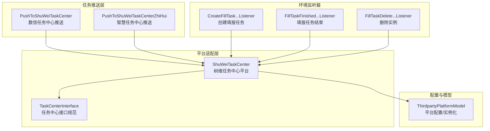
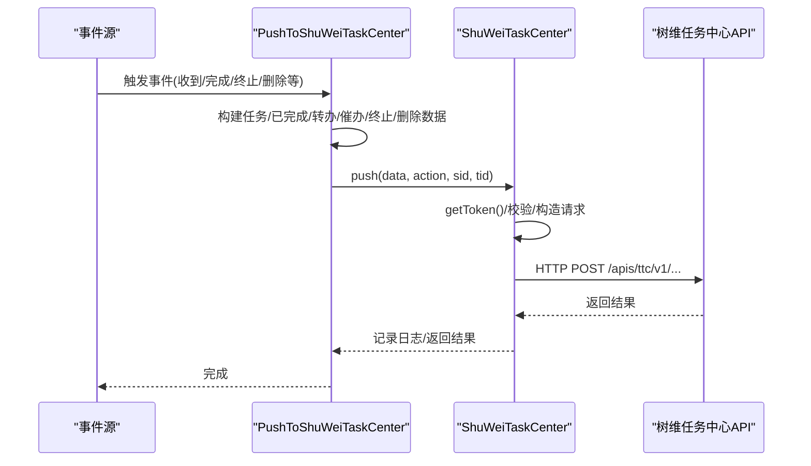
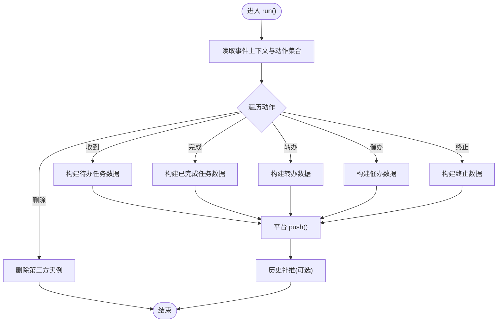
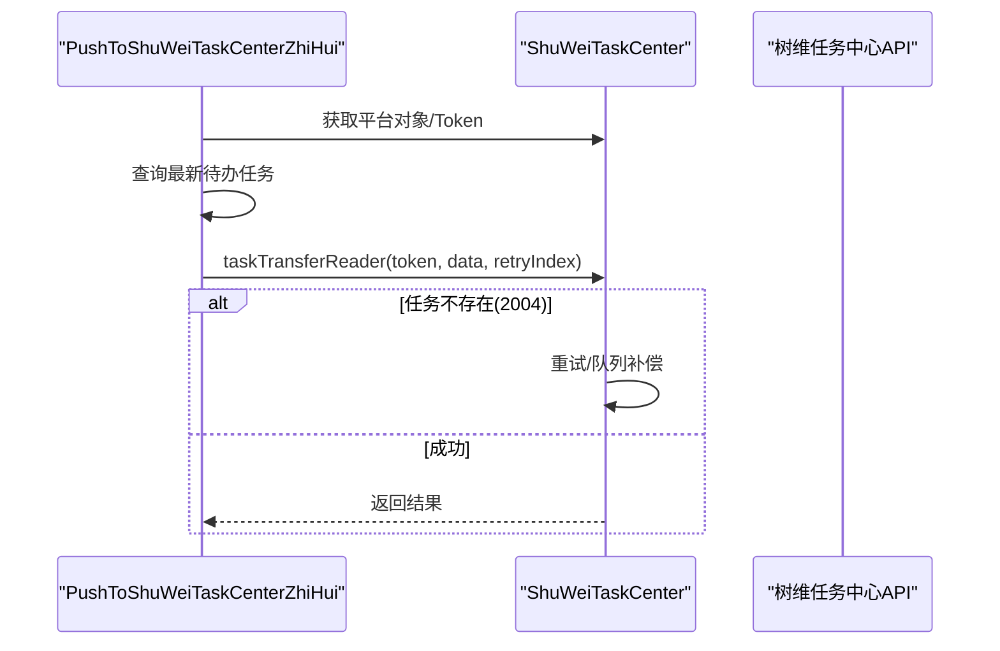
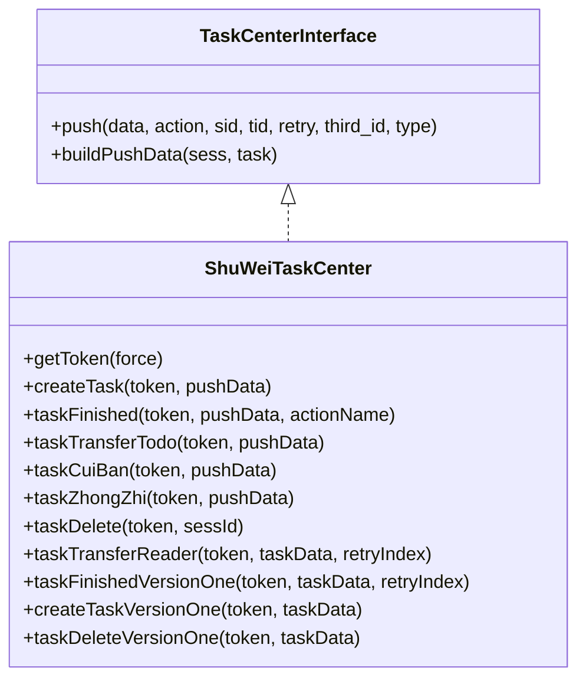
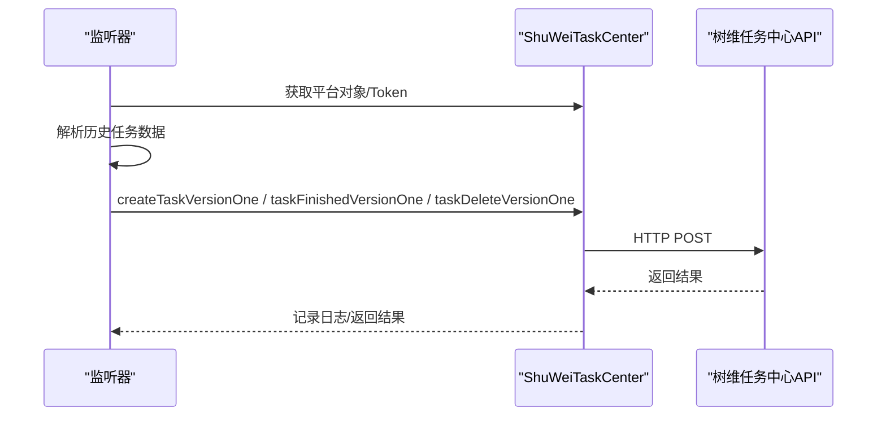
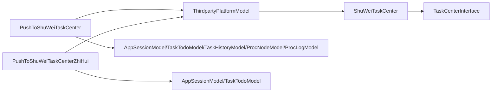

# 数信任务中心集成

<cite>
**本文引用的文件**
- [PushToShuWeiTaskCenter.php](file://process/src/services/task/PushToShuWeiTaskCenter.php)
- [PushToShuWeiTaskCenterZhiHui.php](file://process/src/services/task/PushToShuWeiTaskCenterZhiHui.php)
- [ShuWeiTaskCenter.php](file://process/src/services/platform/ShuWeiTaskCenter.php)
- [TaskCenterInterface.php](file://process/src/services/platform/TaskCenterInterface.php)
- [ThirdpartyPlatformModel.php](file://process/src/models/ThirdpartyPlatformModel.php)
- [CreateFillTaskPushToShuWeiTaskCenterListeners.php](file://process_envs/xjtu/product/listeners/CreateFillTaskPushToShuWeiTaskCenterListeners.php)
- [FillTaskDeletePushToShuWeiTaskCenter.php](file://process_envs/xjtu/product/listeners/FillTaskDeletePushToShuWeiTaskCenter.php)
- [FillTaskFinishedPushToShuWeiTaskCenterListeners.php](file://process_envs/xjtu/product/listeners/FillTaskFinishedPushToShuWeiTaskCenterListeners.php)
</cite>

## 目录
1. [引言](#引言)
2. [项目结构](#项目结构)
3. [核心组件](#核心组件)
4. [架构总览](#架构总览)
5. [详细组件分析](#详细组件分析)
6. [依赖关系分析](#依赖关系分析)
7. [性能与可靠性](#性能与可靠性)
8. [故障排除指南](#故障排除指南)
9. [结论](#结论)
10. [附录](#附录)

## 引言
本文件面向 htdNew 项目中“数信任务中心”与“智慧任务中心”的集成实现，围绕 PushToShuWeiTaskCenter 与 PushToShuWeiTaskCenterZhiHui 两类推送组件，系统阐述任务数据映射、API 调用流程、状态同步与重推策略，并对比数信与智慧两类任务中心接口差异、认证机制与数据格式要求。同时给出配置管理、异常处理与性能优化建议，以及最佳实践与故障排除指引。

## 项目结构
- 任务推送入口与平台适配位于 process/src/services/task 与 process/src/services/platform。
- 任务中心平台抽象接口位于 process/src/services/platform/TaskCenterInterface.php。
- 平台配置与实例化位于 process/src/models/ThirdpartyPlatformModel.php。
- 部分环境特定监听器位于 process_envs/xjtu/product/listeners，用于补充填报类任务的创建、结束与删除推送。

图表来源
- [PushToShuWeiTaskCenter.php](file://process/src/services/task/PushToShuWeiTaskCenter.php#L720-L818)
- [PushToShuWeiTaskCenterZhiHui.php](file://process/src/services/task/PushToShuWeiTaskCenterZhiHui.php#L35-L55)
- [ShuWeiTaskCenter.php](file://process/src/services/platform/ShuWeiTaskCenter.php#L300-L409)
- [TaskCenterInterface.php](file://process/src/services/platform/TaskCenterInterface.php#L1-L34)
- [ThirdpartyPlatformModel.php](file://process/src/models/ThirdpartyPlatformModel.php#L445-L466)
- [CreateFillTaskPushToShuWeiTaskCenterListeners.php](file://process_envs/xjtu/product/listeners/CreateFillTaskPushToShuWeiTaskCenterListeners.php#L100-L140)
- [FillTaskFinishedPushToShuWeiTaskCenterListeners.php](file://process_envs/xjtu/product/listeners/FillTaskFinishedPushToShuWeiTaskCenterListeners.php#L110-L139)
- [FillTaskDeletePushToShuWeiTaskCenter.php](file://process_envs/xjtu/product/listeners/FillTaskDeletePushToShuWeiTaskCenter.php#L118-L131)

章节来源
- [PushToShuWeiTaskCenter.php](file://process/src/services/task/PushToShuWeiTaskCenter.php#L720-L818)
- [PushToShuWeiTaskCenterZhiHui.php](file://process/src/services/task/PushToShuWeiTaskCenterZhiHui.php#L35-L55)
- [ShuWeiTaskCenter.php](file://process/src/services/platform/ShuWeiTaskCenter.php#L300-L409)
- [TaskCenterInterface.php](file://process/src/services/platform/TaskCenterInterface.php#L1-L34)
- [ThirdpartyPlatformModel.php](file://process/src/models/ThirdpartyPlatformModel.php#L445-L466)
- [CreateFillTaskPushToShuWeiTaskCenterListeners.php](file://process_envs/xjtu/product/listeners/CreateFillTaskPushToShuWeiTaskCenterListeners.php#L100-L140)
- [FillTaskFinishedPushToShuWeiTaskCenterListeners.php](file://process_envs/xjtu/product/listeners/FillTaskFinishedPushToShuWeiTaskCenterListeners.php#L110-L139)
- [FillTaskDeletePushToShuWeiTaskCenter.php](file://process_envs/xjtu/product/listeners/FillTaskDeletePushToShuWeiTaskCenter.php#L118-L131)

## 核心组件
- PushToShuWeiTaskCenter（数信任务中心）
  - 负责将流程实例与任务事件映射为树维任务中心所需的数据结构，并通过平台对象调用相应 API。
  - 支持事件：发起、收到、变更审批人、催办、审批完成、终止、实例删除等。
  - 提供构建任务、已完成任务、转办、催办、终止、删除、开始/结束等数据方法。
- PushToShuWeiTaskCenterZhiHui（智慧任务中心）
  - 面向“转阅/知会”场景，将任务转阅读者信息封装为智慧任务中心数据并调用对应接口。
  - 支持重试与队列补偿。
- ShuWeiTaskCenter（树维任务中心平台）
  - 实现任务中心接口规范，负责 Token 获取、HTTP 请求、各类任务 API 的封装与错误处理。
  - 提供创建任务、任务完成、转办、催办、终止、删除、版本一接口等。
  - 内置历史任务补推与幂等控制。
- ThirdpartyPlatformModel（平台配置）
  - 提供平台对象实例化、能力分类、配置字段与融合平台替换逻辑。

章节来源
- [PushToShuWeiTaskCenter.php](file://process/src/services/task/PushToShuWeiTaskCenter.php#L686-L818)
- [PushToShuWeiTaskCenterZhiHui.php](file://process/src/services/task/PushToShuWeiTaskCenterZhiHui.php#L35-L55)
- [ShuWeiTaskCenter.php](file://process/src/services/platform/ShuWeiTaskCenter.php#L300-L409)
- [ThirdpartyPlatformModel.php](file://process/src/models/ThirdpartyPlatformModel.php#L445-L466)

## 架构总览
数信与智慧两类任务中心的集成采用“事件驱动 + 平台适配 + 统一接口”的架构模式：
- 事件源触发：流程引擎事件（如收到、审批完成、终止、删除等）。
- 任务侧适配：PushToShuWeiTaskCenter 将事件映射为树维任务中心数据；PushToShuWeiTaskCenterZhiHui 专门处理智慧任务中心的转阅/知会。
- 平台适配：ShuWeiTaskCenter 统一封装 Token、HTTP 请求、各 API 路径与数据格式。
- 配置与实例化：ThirdpartyPlatformModel 负责平台配置加载与对象实例化。

图表来源
- [PushToShuWeiTaskCenter.php](file://process/src/services/task/PushToShuWeiTaskCenter.php#L720-L818)
- [ShuWeiTaskCenter.php](file://process/src/services/platform/ShuWeiTaskCenter.php#L300-L409)

## 详细组件分析

### PushToShuWeiTaskCenter（数信任务中心）
- 功能特性
  - 事件映射：支持发起、收到、变更审批人、催办、审批完成、终止、实例删除等事件。
  - 数据构建：按事件类型分别构建“待办任务”、“已完成任务”、“转办”、“催办”、“终止”、“删除”、“开始/结束”等数据。
  - 历史补推：对历史已完成任务进行逐条补推，确保状态一致性。
  - 幂等控制：通过 Redis 缓存键避免重复推送。
- 关键流程
  - 初始化：读取平台配置，创建平台对象。
  - 事件循环：遍历事件名，按动作分支构建数据并调用平台 push。
  - 平台调用：委托平台对象执行具体 API 请求。
- 异常处理
  - 捕获用户异常并抛出，便于上层记录与告警。
- 性能要点
  - 使用协程休眠与缓存键控制，降低重复推送成本。
  - 历史补推按任务逐条推送，避免一次性大批量请求。

图表来源
- [PushToShuWeiTaskCenter.php](file://process/src/services/task/PushToShuWeiTaskCenter.php#L720-L818)

章节来源
- [PushToShuWeiTaskCenter.php](file://process/src/services/task/PushToShuWeiTaskCenter.php#L720-L818)

### PushToShuWeiTaskCenterZhiHui（智慧任务中心）
- 功能特性
  - 专用于“转阅/知会”场景，将任务转阅读者信息封装为智慧任务中心数据。
  - 支持重试与队列补偿（当目标任务不存在时，通过队列再次投递）。
- 关键流程
  - 获取平台对象与 Token。
  - 查询最新待办任务，组装转阅数据。
  - 调用 taskTransferReader 接口；若出现“任务不存在”，进行重试与队列补偿。

图表来源
- [PushToShuWeiTaskCenterZhiHui.php](file://process/src/services/task/PushToShuWeiTaskCenterZhiHui.php#L35-L55)
- [ShuWeiTaskCenter.php](file://process/src/services/platform/ShuWeiTaskCenter.php#L983-L1041)

章节来源
- [PushToShuWeiTaskCenterZhiHui.php](file://process/src/services/task/PushToShuWeiTaskCenterZhiHui.php#L35-L55)
- [ShuWeiTaskCenter.php](file://process/src/services/platform/ShuWeiTaskCenter.php#L983-L1041)

### ShuWeiTaskCenter（树维任务中心平台）
- 接口规范
  - 实现 TaskCenterInterface，提供 push 与 buildPushData 两个核心方法。
- 认证机制
  - OAuth2：通过 tokenHost 获取 access_token，缓存于 Redis，带过期时间。
- API 路径与动作
  - 创建任务、任务完成、转办、转阅、转阅已读、催办、终止、删除、开始/结束等。
- 数据格式
  - 统一 JSON 结构，包含 appId、taskId、handlers/initiator、nodeId/nodeName、urls、action 等字段。
- 错误处理与重试
  - 对“任务不存在”等错误码进行识别与重试；必要时重建任务后再完成。
  - 记录推送日志与结果，便于审计与排障。

图表来源
- [TaskCenterInterface.php](file://process/src/services/platform/TaskCenterInterface.php#L1-L34)
- [ShuWeiTaskCenter.php](file://process/src/services/platform/ShuWeiTaskCenter.php#L300-L409)

章节来源
- [TaskCenterInterface.php](file://process/src/services/platform/TaskCenterInterface.php#L1-L34)
- [ShuWeiTaskCenter.php](file://process/src/services/platform/ShuWeiTaskCenter.php#L300-L409)

### 环境监听器（补充场景）
- 创建填报任务监听器：针对“填报类任务”批量创建任务。
- 填报任务结束监听器：针对“填报类任务”批量完成任务。
- 删除实例监听器：针对“删除实例”批量删除任务。

图表来源
- [CreateFillTaskPushToShuWeiTaskCenterListeners.php](file://process_envs/xjtu/product/listeners/CreateFillTaskPushToShuWeiTaskCenterListeners.php#L100-L140)
- [FillTaskFinishedPushToShuWeiTaskCenterListeners.php](file://process_envs/xjtu/product/listeners/FillTaskFinishedPushToShuWeiTaskCenterListeners.php#L110-L139)
- [FillTaskDeletePushToShuWeiTaskCenter.php](file://process_envs/xjtu/product/listeners/FillTaskDeletePushToShuWeiTaskCenter.php#L118-L131)

章节来源
- [CreateFillTaskPushToShuWeiTaskCenterListeners.php](file://process_envs/xjtu/product/listeners/CreateFillTaskPushToShuWeiTaskCenterListeners.php#L100-L140)
- [FillTaskFinishedPushToShuWeiTaskCenterListeners.php](file://process_envs/xjtu/product/listeners/FillTaskFinishedPushToShuWeiTaskCenterListeners.php#L110-L139)
- [FillTaskDeletePushToShuWeiTaskCenter.php](file://process_envs/xjtu/product/listeners/FillTaskDeletePushToShuWeiTaskCenter.php#L118-L131)

## 依赖关系分析
- PushToShuWeiTaskCenter 依赖：
  - 平台对象：ThirdpartyPlatformModel -> ShuWeiTaskCenter
  - 事件模型：TriggerModel、AppSessionModel、TaskTodoModel、TaskHistoryModel、ProcNodeModel、ProcLogModel
  - 工具与辅助：Url、UsersCollection、CacheKeyHelper、YamlHelper、Queue、Logger
- PushToShuWeiTaskCenterZhiHui 依赖：
  - 平台对象：ThirdpartyPlatformModel -> ShuWeiTaskCenter
  - 任务模型：AppSessionModel、TaskTodoModel
  - 队列：Queue（用于重推补偿）

图表来源
- [PushToShuWeiTaskCenter.php](file://process/src/services/task/PushToShuWeiTaskCenter.php#L720-L818)
- [PushToShuWeiTaskCenterZhiHui.php](file://process/src/services/task/PushToShuWeiTaskCenterZhiHui.php#L35-L55)
- [ThirdpartyPlatformModel.php](file://process/src/models/ThirdpartyPlatformModel.php#L445-L466)
- [ShuWeiTaskCenter.php](file://process/src/services/platform/ShuWeiTaskCenter.php#L300-L409)
- [TaskCenterInterface.php](file://process/src/services/platform/TaskCenterInterface.php#L1-L34)

章节来源
- [PushToShuWeiTaskCenter.php](file://process/src/services/task/PushToShuWeiTaskCenter.php#L720-L818)
- [PushToShuWeiTaskCenterZhiHui.php](file://process/src/services/task/PushToShuWeiTaskCenterZhiHui.php#L35-L55)
- [ThirdpartyPlatformModel.php](file://process/src/models/ThirdpartyPlatformModel.php#L445-L466)
- [ShuWeiTaskCenter.php](file://process/src/services/platform/ShuWeiTaskCenter.php#L300-L409)
- [TaskCenterInterface.php](file://process/src/services/platform/TaskCenterInterface.php#L1-L34)

## 性能与可靠性
- Token 管理
  - 通过 Redis 缓存 access_token，减少频繁鉴权开销；到期前适当减小过期时间以避免临界问题。
- 幂等与去重
  - 使用 Redis 缓存键标记已处理任务，避免重复推送。
- 历史补推
  - 对历史已完成任务逐条补推，确保状态一致；对“任务不存在”错误进行重试与重建。
- 队列补偿
  - 智慧任务中心转阅失败时，通过队列延迟重试，提升成功率。
- 日志与审计
  - 统一记录推送日志、请求 URL、请求体、响应体与状态，便于定位问题。

章节来源
- [ShuWeiTaskCenter.php](file://process/src/services/platform/ShuWeiTaskCenter.php#L300-L409)
- [ShuWeiTaskCenter.php](file://process/src/services/platform/ShuWeiTaskCenter.php#L983-L1041)
- [ShuWeiTaskCenter.php](file://process/src/services/platform/ShuWeiTaskCenter.php#L1534-L1601)

## 故障排除指南
- 常见错误与处理
  - “任务不存在（2004）”：平台内置重试与重建逻辑；若多次失败，检查任务历史与实例状态。
  - “已结束/重复处理”：平台对已处理任务进行幂等保护，避免重复推送。
  - “接口请求失败”：检查 tokenHost/taskHost、网络连通性与超时设置。
- 排查步骤
  - 查看任务中心日志与推送记录，确认请求 URL、请求体与响应体。
  - 核对平台配置（clientId、clientSecret、scope、transactionId、appId、isUseThirdAppId）。
  - 验证事件上下文与数据构建是否正确（实例状态、节点信息、URL 生成）。
- 建议
  - 在测试环境先行验证，逐步扩大范围。
  - 对高并发场景增加限流与重试退避策略。

章节来源
- [ShuWeiTaskCenter.php](file://process/src/services/platform/ShuWeiTaskCenter.php#L300-L409)
- [ShuWeiTaskCenter.php](file://process/src/services/platform/ShuWeiTaskCenter.php#L983-L1041)
- [ShuWeiTaskCenter.php](file://process/src/services/platform/ShuWeiTaskCenter.php#L1534-L1601)

## 结论
本集成方案通过统一的平台适配层与事件驱动机制，实现了数信与智慧两类任务中心的稳定对接。数信侧覆盖全流程事件与历史补推，智慧侧聚焦转阅/知会场景与重试补偿。平台层提供完善的认证、数据映射与错误处理能力，结合日志与幂等控制，满足生产环境的可靠性与可观测性需求。

## 附录

### 数信与智慧任务中心接口差异与数据格式
- 认证机制
  - 数信/智慧均使用 OAuth2 获取 access_token，通过 Authorization 头传递。
- API 路径
  - 数信：/apis/ttc/v1/transaction/poa/{addTransaction,taskHandle,taskComplaint,taskCirculated,newCirculatedRead,taskCuiBanNew,taskTerminate,transDeleted,transRecover}
  - 智慧：taskTransferReader、taskTransferRead 等专用接口（由平台封装）。
- 数据字段
  - 数信：appId、taskId、handlers/initiator、nodeId/nodeName、urls、action、transactionId、createTime 等。
  - 智慧：appId、taskId、handlers/creator、circulatedPer/readTime 等。
- 事件映射
  - 数信：收到/完成/转办/催办/终止/删除/结束等。
  - 智慧：转阅/知会/已读等。

章节来源
- [ShuWeiTaskCenter.php](file://process/src/services/platform/ShuWeiTaskCenter.php#L141-L176)
- [ShuWeiTaskCenter.php](file://process/src/services/platform/ShuWeiTaskCenter.php#L702-L853)
- [ShuWeiTaskCenter.php](file://process/src/services/platform/ShuWeiTaskCenter.php#L863-L940)
- [ShuWeiTaskCenter.php](file://process/src/services/platform/ShuWeiTaskCenter.php#L983-L1041)
- [ShuWeiTaskCenter.php](file://process/src/services/platform/ShuWeiTaskCenter.php#L1085-L1144)
- [ShuWeiTaskCenter.php](file://process/src/services/platform/ShuWeiTaskCenter.php#L1146-L1206)
- [ShuWeiTaskCenter.php](file://process/src/services/platform/ShuWeiTaskCenter.php#L1208-L1266)
- [ShuWeiTaskCenter.php](file://process/src/services/platform/ShuWeiTaskCenter.php#L1275-L1300)
- [ShuWeiTaskCenter.php](file://process/src/services/platform/ShuWeiTaskCenter.php#L1308-L1434)
- [ShuWeiTaskCenter.php](file://process/src/services/platform/ShuWeiTaskCenter.php#L1445-L1527)