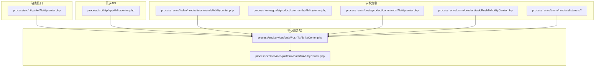
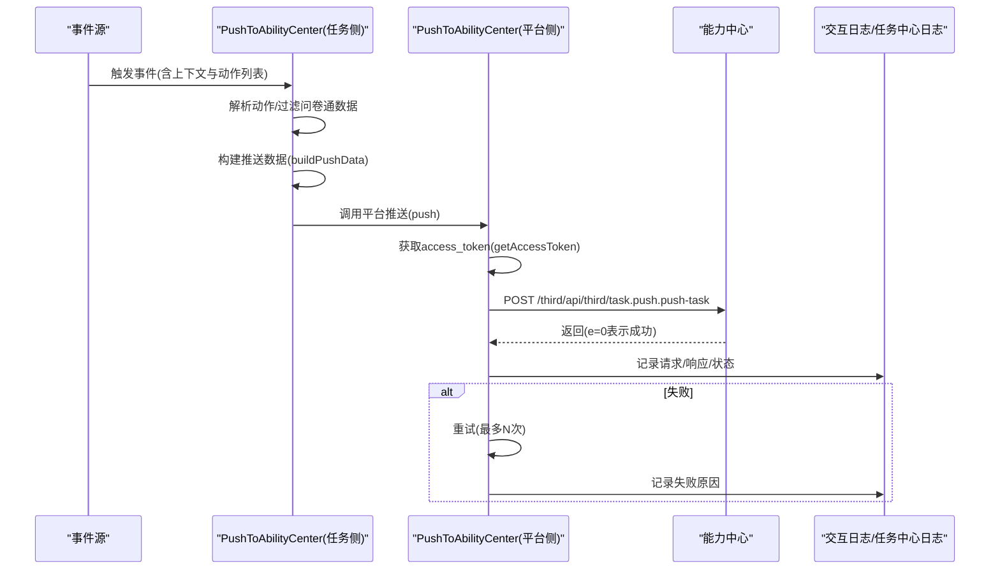
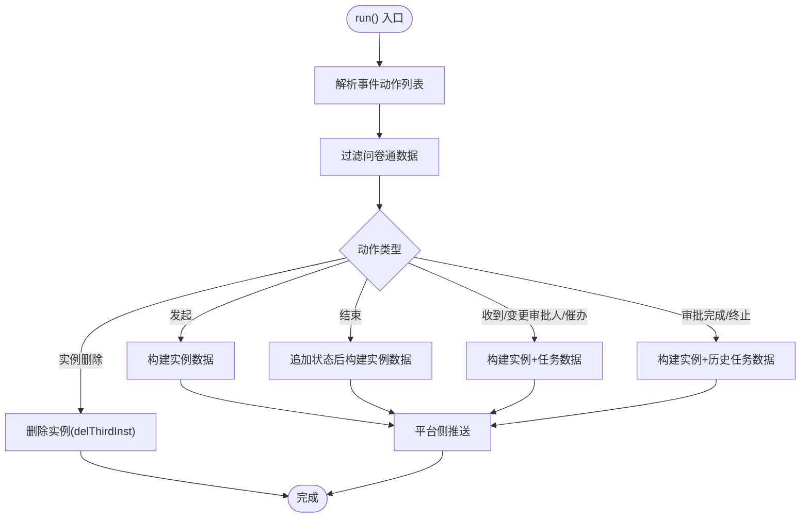
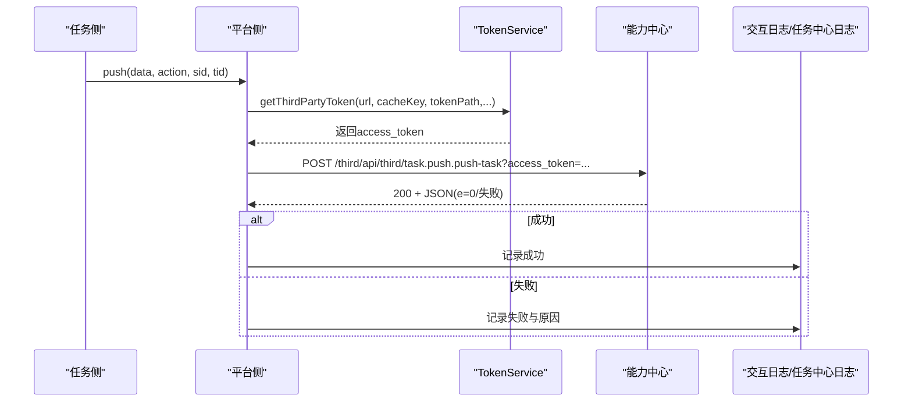
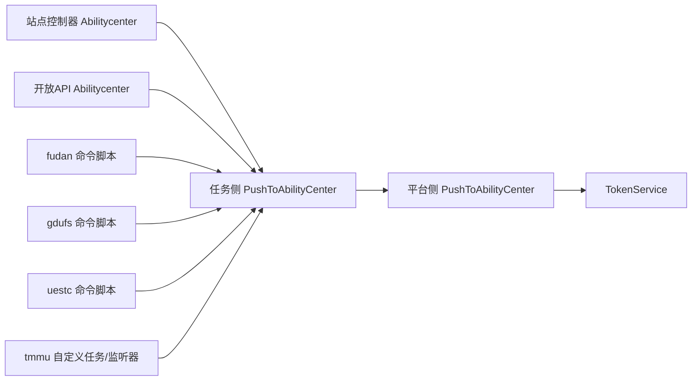

# 能力中心集成

<cite>
**本文引用的文件**
- [process/src/services/task/PushToAbilityCenter.php](file://process/src/services/task/PushToAbilityCenter.php)
- [process/src/services/platform/PushToAbilityCenter.php](file://process/src/services/platform/PushToAbilityCenter.php)
- [process/src/http/site/Abilitycenter.php](file://process/src/http/site/Abilitycenter.php)
- [process/src/http/api/Abilitycenter.php](file://process/src/http/api/Abilitycenter.php)
- [process_envs/fudan/product/commands/Abilitycenter.php](file://process_envs/fudan/product/commands/Abilitycenter.php)
- [process_envs/gdufs/product/commands/Abilitycenter.php](file://process_envs/gdufs/product/commands/Abilitycenter.php)
- [process_envs/uestc/product/commands/Abilitycenter.php](file://process_envs/uestc/product/commands/Abilitycenter.php)
- [process_envs/tmmu/product/task/PushToAbilityCenter.php](file://process_envs/tmmu/product/task/PushToAbilityCenter.php)
- [process_envs/tmmu/product/listeners/PushCreateFillTaskListener.php](file://process_envs/tmmu/product/listeners/PushCreateFillTaskListener.php)
- [process_envs/tmmu/product/listeners/PushFinishFillTaskListener.php](file://process_envs/tmmu/product/listeners/PushFinishFillTaskListener.php)
- [process_envs/tmmu/product/listeners/PushFinishArchiveDelDataListener.php](file://process_envs/tmmu/product/listeners/PushFinishArchiveDelDataListener.php)
- [process_envs/tmmu/product/listeners/PushAppsToAbilityCenterListener.php](file://process_envs/tmmu/product/listeners/PushAppsToAbilityCenterListener.php)
</cite>

## 目录
1. [引言](#引言)
2. [项目结构](#项目结构)
3. [核心组件](#核心组件)
4. [架构总览](#架构总览)
5. [详细组件分析](#详细组件分析)
6. [依赖关系分析](#依赖关系分析)
7. [性能考虑](#性能考虑)
8. [故障排除指南](#故障排除指南)
9. [结论](#结论)
10. [附录](#附录)

## 引言
本文件面向 htdNew 项目的能力中心集成，系统性阐述“能力中心推送服务”的实现机制、接口规范与集成策略。重点围绕 PushToAbilityCenter 类的工作原理展开，覆盖任务数据转换、API 调用流程、错误处理与重试、不同学校的定制化集成方案（如北航、复旦、哈理工等），并给出最佳实践、性能优化建议与故障排除指南。

## 项目结构
能力中心相关代码主要分布在以下位置：
- 核心服务层：统一的任务推送抽象与平台实现
- 站点控制器：面向管理端的触发与查询接口
- API 控制器：面向外部能力中心的开放接口与安全校验
- 学校定制化：各校命令脚本、监听器与特定逻辑

图示来源
- [process/src/services/task/PushToAbilityCenter.php](file://process/src/services/task/PushToAbilityCenter.php#L1-L291)
- [process/src/services/platform/PushToAbilityCenter.php](file://process/src/services/platform/PushToAbilityCenter.php#L1-L323)
- [process/src/http/site/Abilitycenter.php](file://process/src/http/site/Abilitycenter.php#L1-L203)
- [process/src/http/api/Abilitycenter.php](file://process/src/http/api/Abilitycenter.php#L1-L314)
- [process_envs/fudan/product/commands/Abilitycenter.php](file://process_envs/fudan/product/commands/Abilitycenter.php#L1-L165)
- [process_envs/gdufs/product/commands/Abilitycenter.php](file://process_envs/gdufs/product/commands/Abilitycenter.php#L1-L179)
- [process_envs/uestc/product/commands/Abilitycenter.php](file://process_envs/uestc/product/commands/Abilitycenter.php#L1-L185)
- [process_envs/tmmu/product/task/PushToAbilityCenter.php](file://process_envs/tmmu/product/task/PushToAbilityCenter.php#L1-L334)
- [process_envs/tmmu/product/listeners/PushCreateFillTaskListener.php](file://process_envs/tmmu/product/listeners/PushCreateFillTaskListener.php#L1-L157)
- [process_envs/tmmu/product/listeners/PushFinishFillTaskListener.php](file://process_envs/tmmu/product/listeners/PushFinishFillTaskListener.php#L1-L121)
- [process_envs/tmmu/product/listeners/PushFinishArchiveDelDataListener.php](file://process_envs/tmmu/product/listeners/PushFinishArchiveDelDataListener.php#L1-L118)
- [process_envs/tmmu/product/listeners/PushAppsToAbilityCenterListener.php](file://process_envs/tmmu/product/listeners/PushAppsToAbilityCenterListener.php#L1-L27)

章节来源
- [process/src/services/task/PushToAbilityCenter.php](file://process/src/services/task/PushToAbilityCenter.php#L1-L291)
- [process/src/services/platform/PushToAbilityCenter.php](file://process/src/services/platform/PushToAbilityCenter.php#L1-L323)
- [process/src/http/site/Abilitycenter.php](file://process/src/http/site/Abilitycenter.php#L1-L203)
- [process/src/http/api/Abilitycenter.php](file://process/src/http/api/Abilitycenter.php#L1-L314)

## 核心组件
- PushToAbilityCenter（任务侧）：负责接收事件上下文、按动作类型构建推送数据、调用平台实现进行推送、处理删除实例等。
- PushToAbilityCenter（平台侧）：封装与能力中心的交互细节，包括获取令牌、构造请求、记录交互日志、处理响应与异常、删除实例等。
- 站点控制器 Abilitycenter：提供手动触发推送、查询我的发起/待办等能力。
- API 控制器 Abilitycenter：提供对外接口，包含数据解密、权限校验、按钮动作处理等。
- 学校定制脚本与监听器：针对不同学校（如复旦、广外、西科、哈理工）提供差异化的参数、URL、状态映射与回调处理。

章节来源
- [process/src/services/task/PushToAbilityCenter.php](file://process/src/services/task/PushToAbilityCenter.php#L25-L291)
- [process/src/services/platform/PushToAbilityCenter.php](file://process/src/services/platform/PushToAbilityCenter.php#L26-L323)
- [process/src/http/site/Abilitycenter.php](file://process/src/http/site/Abilitycenter.php#L40-L203)
- [process/src/http/api/Abilitycenter.php](file://process/src/http/api/Abilitycenter.php#L1-L314)

## 架构总览
能力中心推送的整体流程如下：

图示来源
- [process/src/services/task/PushToAbilityCenter.php](file://process/src/services/task/PushToAbilityCenter.php#L67-L165)
- [process/src/services/platform/PushToAbilityCenter.php](file://process/src/services/platform/PushToAbilityCenter.php#L194-L266)

## 详细组件分析

### PushToAbilityCenter（任务侧）
职责与流程要点：
- 初始化：从第三方平台配置加载 host/app_id/app_secret。
- 事件解析：根据事件名称拆分出动作前缀，支持多级事件命名空间。
- 数据过滤：跳过问卷通应用产生的实例/任务，避免冗余推送。
- 动作分支：依据事件类型（发起、结束、收到、变更审批人、催办、审批完成、终止、实例删除）分别构建实例与任务数据。
- 推送入口：委托平台侧执行实际网络请求，并记录交互日志。
- 删除实例：调用平台侧删除接口，记录删除日志。

图示来源
- [process/src/services/task/PushToAbilityCenter.php](file://process/src/services/task/PushToAbilityCenter.php#L67-L165)
- [process/src/services/task/PushToAbilityCenter.php](file://process/src/services/task/PushToAbilityCenter.php#L192-L212)

章节来源
- [process/src/services/task/PushToAbilityCenter.php](file://process/src/services/task/PushToAbilityCenter.php#L25-L291)

### PushToAbilityCenter（平台侧）
职责与流程要点：
- 构建推送数据：将实例与任务信息标准化为能力中心所需字段，包含状态映射、节点信息、表单链接等；部分学校（如广外）对特定应用附加隐藏头部参数。
- 获取令牌：通过 TokenService 从能力中心获取 access_token，并缓存到指定键路径。
- 发送请求：构造 URL 与 JSON 请求体，发送 POST；记录请求/响应与状态。
- 错误处理：状态码非 200 或返回 e!=0 时，记录失败原因并可重试；异常捕获后同样记录。
- 删除实例：调用能力中心删除接口，记录删除日志与结果。

图示来源
- [process/src/services/platform/PushToAbilityCenter.php](file://process/src/services/platform/PushToAbilityCenter.php#L194-L266)
- [process/src/services/platform/PushToAbilityCenter.php](file://process/src/services/platform/PushToAbilityCenter.php#L268-L280)

章节来源
- [process/src/services/platform/PushToAbilityCenter.php](file://process/src/services/platform/PushToAbilityCenter.php#L1-L323)

### 站点接口（Abilitycenter）
- 手动推送：根据 sess_id 查询实例与任务，逐条构建并推送。
- 我发起/待办：基于 RemoteData 配置动态组装能力中心查询参数，调用任务侧 getMyLaunch/getMyTodo。
- 权限控制：仅超级管理员可触发推送。

章节来源
- [process/src/http/site/Abilitycenter.php](file://process/src/http/site/Abilitycenter.php#L40-L203)

### 开放API（Abilitycenter）
- 数据解密：在 beforeAction 中使用 app_secret 对请求体进行解密，得到原始业务数据。
- 按钮信息：根据 type(inst/task) 返回实例或任务列表。
- 按钮动作：支持催办、撤销、收回等动作，内部进行权限校验与业务处理。

章节来源
- [process/src/http/api/Abilitycenter.php](file://process/src/http/api/Abilitycenter.php#L1-L314)

### 学校定制化集成

#### 北航（fudan）
- 提供批量推送与同步脚本，支持按时间段筛选实例与任务，循环构建并推送。
- 支持统计耗时与计数，便于评估性能与覆盖率。

章节来源
- [process_envs/fudan/product/commands/Abilitycenter.php](file://process_envs/fudan/product/commands/Abilitycenter.php#L44-L165)

#### 复旦（fudan）
- 站点控制器中对特定环境限制“我的发起/待办”功能，仅在指定环境生效。
- 通过 RemoteData 配置动态注入能力中心参数，统一构建查询与推送。

章节来源
- [process/src/http/site/Abilitycenter.php](file://process/src/http/site/Abilitycenter.php#L93-L146)

#### 广外（gdufs）
- 提供任务同步、实例删除、演示脚本等，支持对缺失或异常任务进行修复与清理。
- 在构建实例/任务数据时，对特定应用附加隐藏头部参数以适配前端展示。

章节来源
- [process_envs/gdufs/product/commands/Abilitycenter.php](file://process_envs/gdufs/product/commands/Abilitycenter.php#L1-L179)
- [process/src/services/platform/PushToAbilityCenter.php](file://process/src/services/platform/PushToAbilityCenter.php#L135-L140)
- [process/src/services/platform/PushToAbilityCenter.php](file://process/src/services/platform/PushToAbilityCenter.php#L179-L185)

#### 西科（uestc）
- 提供任务同步与演示脚本，支持直接调用能力中心开放接口查询第三方任务号。
- 通过命令行脚本对比本地任务与能力中心任务，辅助对账与修复。

章节来源
- [process_envs/uestc/product/commands/Abilitycenter.php](file://process_envs/uestc/product/commands/Abilitycenter.php#L1-L185)

#### 哈理工（tmmu）
- 自定义任务侧实现：独立的 ACCESS_TOKEN_URL/TASK_URL、Redis 缓存令牌、事务后回调写入重推表。
- 监听器集成：针对“创建/完成/归档删除”等事件，构建特殊数据并推送至能力中心。
- 监听器还支持推送应用信息，便于能力中心侧应用注册与联动。

章节来源
- [process_envs/tmmu/product/task/PushToAbilityCenter.php](file://process_envs/tmmu/product/task/PushToAbilityCenter.php#L1-L334)
- [process_envs/tmmu/product/listeners/PushCreateFillTaskListener.php](file://process_envs/tmmu/product/listeners/PushCreateFillTaskListener.php#L1-L157)
- [process_envs/tmmu/product/listeners/PushFinishFillTaskListener.php](file://process_envs/tmmu/product/listeners/PushFinishFillTaskListener.php#L1-L121)
- [process_envs/tmmu/product/listeners/PushFinishArchiveDelDataListener.php](file://process_envs/tmmu/product/listeners/PushFinishArchiveDelDataListener.php#L1-L118)
- [process_envs/tmmu/product/listeners/PushAppsToAbilityCenterListener.php](file://process_envs/tmmu/product/listeners/PushAppsToAbilityCenterListener.php#L1-L27)

## 依赖关系分析
- 任务侧依赖平台侧：通过平台侧统一的 buildPushData/push/delThirdInst 实现能力中心交互。
- 平台侧依赖 TokenService：集中管理令牌获取与缓存。
- 站点与API控制器依赖第三方脚本模型：通过 ThirdpartyScriptModel 获取运行对象，确保配置一致。
- 学校定制脚本与监听器：通过 YamlHelper 读取 abilitycenter 配置，实现差异化行为。

图示来源
- [process/src/services/task/PushToAbilityCenter.php](file://process/src/services/task/PushToAbilityCenter.php#L192-L212)
- [process/src/services/platform/PushToAbilityCenter.php](file://process/src/services/platform/PushToAbilityCenter.php#L268-L280)
- [process/src/http/site/Abilitycenter.php](file://process/src/http/site/Abilitycenter.php#L73-L118)
- [process/src/http/api/Abilitycenter.php](file://process/src/http/api/Abilitycenter.php#L28-L42)
- [process_envs/fudan/product/commands/Abilitycenter.php](file://process_envs/fudan/product/commands/Abilitycenter.php#L78-L110)
- [process_envs/gdufs/product/commands/Abilitycenter.php](file://process_envs/gdufs/product/commands/Abilitycenter.php#L31-L89)
- [process_envs/uestc/product/commands/Abilitycenter.php](file://process_envs/uestc/product/commands/Abilitycenter.php#L31-L74)
- [process_envs/tmmu/product/task/PushToAbilityCenter.php](file://process_envs/tmmu/product/task/PushToAbilityCenter.php#L134-L153)

章节来源
- [process/src/services/task/PushToAbilityCenter.php](file://process/src/services/task/PushToAbilityCenter.php#L1-L291)
- [process/src/services/platform/PushToAbilityCenter.php](file://process/src/services/platform/PushToAbilityCenter.php#L1-L323)
- [process/src/http/site/Abilitycenter.php](file://process/src/http/site/Abilitycenter.php#L1-L203)
- [process/src/http/api/Abilitycenter.php](file://process/src/http/api/Abilitycenter.php#L1-L314)

## 性能考虑
- 令牌缓存：平台侧通过 TokenService 缓存 access_token，减少频繁获取令牌带来的网络开销。
- 批量推送：站点控制器与学校脚本支持按实例与任务批量构建与推送，降低重复查询成本。
- 重试机制：平台侧对非 200 或返回码异常进行有限次数重试，提升稳定性。
- 日志与可观测性：交互日志与任务中心日志记录请求/响应与状态，便于定位性能瓶颈与失败原因。
- 学校定制优化：哈理工通过 Redis 缓存令牌与事务后回调写入重推表，减少重复推送与失败影响面。

章节来源
- [process/src/services/platform/PushToAbilityCenter.php](file://process/src/services/platform/PushToAbilityCenter.php#L268-L280)
- [process/src/http/site/Abilitycenter.php](file://process/src/http/site/Abilitycenter.php#L40-L92)
- [process_envs/fudan/product/commands/Abilitycenter.php](file://process_envs/fudan/product/commands/Abilitycenter.php#L112-L165)
- [process_envs/tmmu/product/task/PushToAbilityCenter.php](file://process_envs/tmmu/product/task/PushToAbilityCenter.php#L134-L153)

## 故障排除指南
- 未配置平台信息：初始化阶段若未找到第三方平台配置，会记录调试日志并抛出用户异常。
- 令牌获取失败：平台侧 getAccessToken 失败时，交互日志会记录错误消息；必要时可强制刷新令牌。
- 接口状态异常：当响应状态码非 200 或返回 e!=0 时，交互日志会记录失败原因；平台侧具备有限次数重试。
- 学校定制差异：广外对特定应用附加隐藏头部参数；哈理工通过 Redis 缓存令牌并写入重推表，便于后续补推。
- 监听器异常：哈理工监听器在未找到 abilitycenter 配置时会抛出用户异常，需检查 YAML 配置。

章节来源
- [process/src/services/task/PushToAbilityCenter.php](file://process/src/services/task/PushToAbilityCenter.php#L54-L65)
- [process/src/services/platform/PushToAbilityCenter.php](file://process/src/services/platform/PushToAbilityCenter.php#L212-L266)
- [process_envs/gdufs/product/commands/Abilitycenter.php](file://process_envs/gdufs/product/commands/Abilitycenter.php#L130-L179)
- [process_envs/tmmu/product/task/PushToAbilityCenter.php](file://process_envs/tmmu/product/task/PushToAbilityCenter.php#L134-L153)
- [process_envs/tmmu/product/listeners/PushCreateFillTaskListener.php](file://process_envs/tmmu/product/listeners/PushCreateFillTaskListener.php#L120-L131)

## 结论
能力中心集成在 htdNew 中采用“任务侧抽象 + 平台侧实现 + 学校定制”的分层设计，既保证了通用性，又兼顾了不同学校的差异化需求。通过统一的数据转换、令牌管理与日志体系，实现了稳定可靠的跨系统推送与回调处理。建议在生产环境中结合令牌缓存、批量推送与重试策略，持续优化性能与可靠性。

## 附录

### 数据格式与字段约定（平台侧构建）
- 实例数据 inst_data
  - inst_id：实例 ID
  - app_id：应用 ID
  - creator：创建人工号
  - created/finished：创建/完成时间
  - percent：进度百分比
  - status：状态（进行中/终止/完成/驳回/撤销）
  - node_id/node_name：当前节点 ID 与名称（结束时固定为“结束”）
  - name/form_url_view/form_mobile_url_view/process_pic_url/process_log_url/app_name：表单与流程可视化链接
- 任务数据 task_data
  - app_id/inst_id/task_id：应用/实例/任务 ID
  - node_id/node_name：节点 ID 与名称
  - status：状态（未申领/进行中/已驳回/完成/已撤销）
  - created/finished：创建/完成时间
  - form_url/form_url_view/form_mobile_url/form_mobile_url_view：审批链接
  - number/spr_number：经办人工号/审批人工号
  - task_name/is_urge：任务名称与是否催办标记

章节来源
- [process/src/services/platform/PushToAbilityCenter.php](file://process/src/services/platform/PushToAbilityCenter.php#L69-L192)

### 接口规范与认证
- 获取令牌
  - 方法：GET
  - URL：/third/api/third/third.base.getToken?appid={app_id}&appsecret={app_secret}
- 推送任务
  - 方法：POST
  - URL：/third/api/third/task.push.push-task?access_token={access_token}
  - 请求体：包含 inst_data 与 task_data 的 JSON
- 删除实例
  - 方法：GET
  - URL：/third/api/third/task.push.del-inst?access_token={access_token}&inst_id={inst_id}
- 开放API
  - 请求体：使用 app_secret 解密后的原始数据
  - 权限：仅超级管理员可触发站点推送；按钮动作包含权限校验

章节来源
- [process/src/services/platform/PushToAbilityCenter.php](file://process/src/services/platform/PushToAbilityCenter.php#L48-L52)
- [process/src/services/platform/PushToAbilityCenter.php](file://process/src/services/platform/PushToAbilityCenter.php#L268-L280)
- [process/src/http/site/Abilitycenter.php](file://process/src/http/site/Abilitycenter.php#L40-L92)
- [process/src/http/api/Abilitycenter.php](file://process/src/http/api/Abilitycenter.php#L28-L42)

### 最佳实践
- 统一配置管理：通过 ThirdpartyScriptModel 与 RemoteData 配置，确保所有环境一致。
- 状态映射一致性：严格遵循平台侧状态映射规则，避免能力中心显示异常。
- 令牌缓存与刷新：合理设置缓存过期时间，必要时强制刷新令牌。
- 重试与补偿：对失败请求进行有限次数重试，并记录到重推表以便后续补偿。
- 监控与告警：利用交互日志与任务中心日志，建立失败率与延迟的监控指标。

章节来源
- [process/src/services/platform/PushToAbilityCenter.php](file://process/src/services/platform/PushToAbilityCenter.php#L212-L266)
- [process_envs/tmmu/product/task/PushToAbilityCenter.php](file://process_envs/tmmu/product/task/PushToAbilityCenter.php#L322-L334)