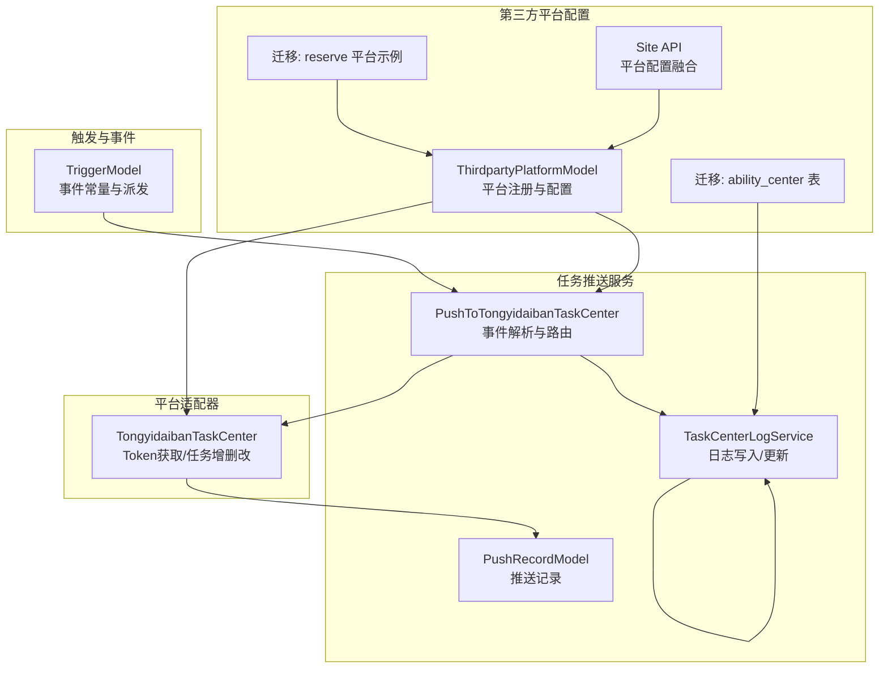
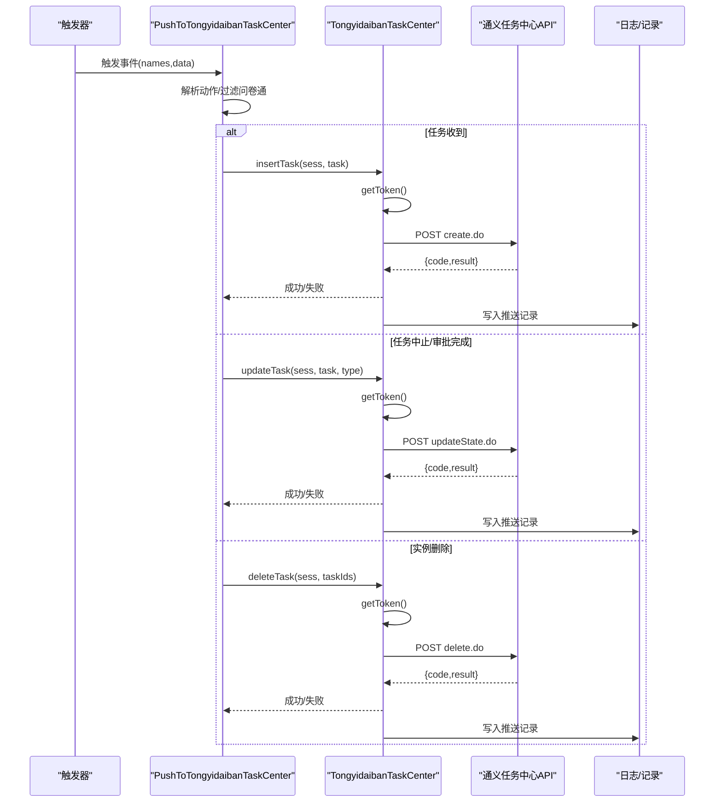
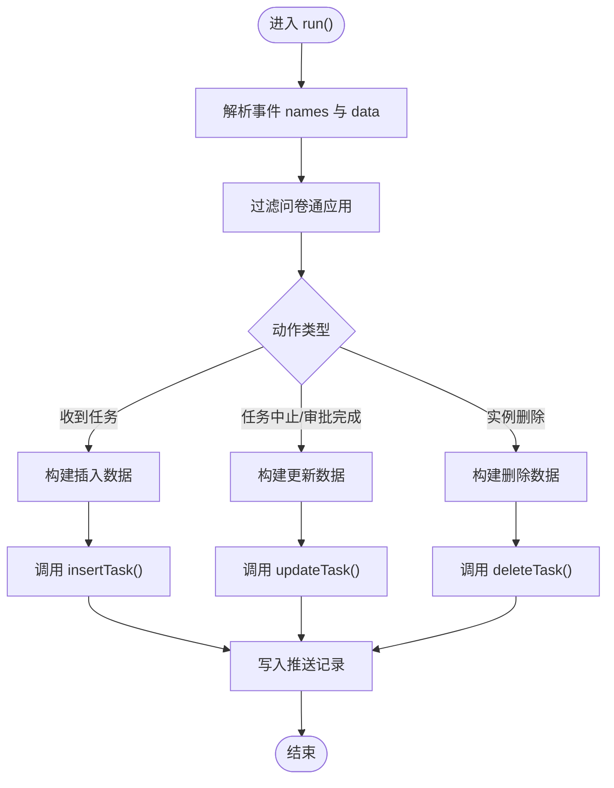
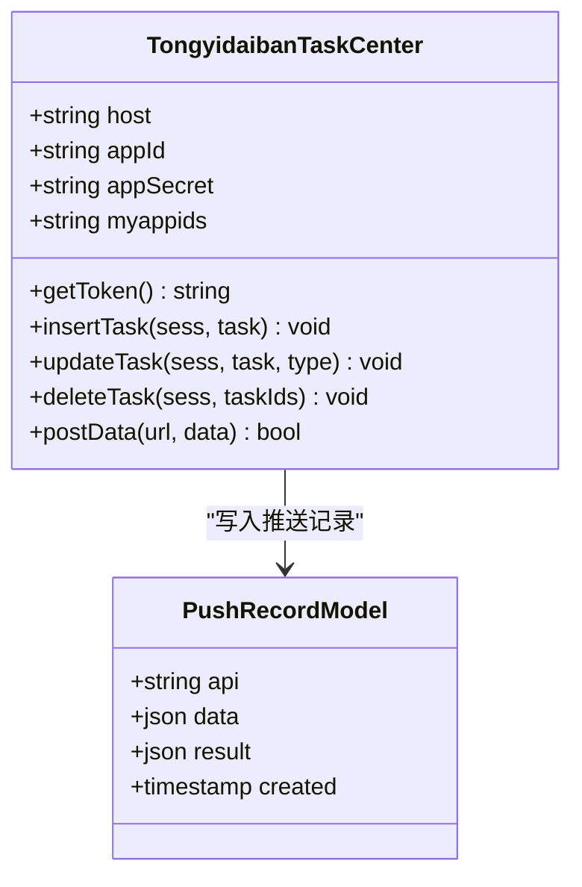
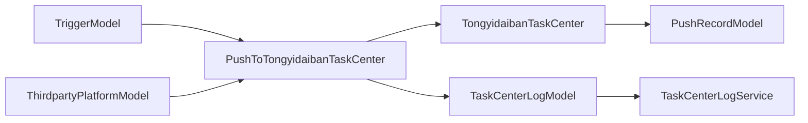

# 通义代办任务中心集成

<cite>
**本文引用的文件**
- [PushToTongyidaibanTaskCenter.php](file://process/src/services/task/PushToTongyidaibanTaskCenter.php)
- [TongyidaibanTaskCenter.php](file://process/src/services/platform/TongyidaibanTaskCenter.php)
- [TriggerModel.php](file://process/src/models/TriggerModel.php)
- [PushRecordModel.php](file://process/src/models/PushRecordModel.php)
- [TaskCenterLogModel.php](file://process/src/models/TaskCenterLogModel.php)
- [TaskCenterLogService.php](file://process/src/services/taskCenter/TaskCenterLogService.php)
- [PushCreateFillTaskListener.php（tmmu）](file://process_envs/tmmu/product/listeners/PushCreateFillTaskListener.php)
- [PushFinishFillTaskListener.php（tmmu）](file://process_envs/tmmu/product/listeners/PushFinishFillTaskListener.php)
- [ThirdpartyPlatformModel.php](file://process/src/models/ThirdpartyPlatformModel.php)
- [migration_20240307_221250_create_push_task_to_ability_center.php](file://process/src/migrations/migration_20240307_221250_create_push_task_to_ability_center.php)
- [migration_20240811_100331_platform_reserve.php](file://process/src/migrations/migration_20240811_100331_platform_reserve.php)
- [Site.php](file://process/src/http/api/Site.php)
</cite>

## 目录
1. [引言](#引言)
2. [项目结构](#项目结构)
3. [核心组件](#核心组件)
4. [架构总览](#架构总览)
5. [详细组件分析](#详细组件分析)
6. [依赖关系分析](#依赖关系分析)
7. [性能考虑](#性能考虑)
8. [故障排查指南](#故障排查指南)
9. [结论](#结论)
10. [附录](#附录)

## 引言
本文件面向 htdNew 项目，系统化阐述通义代办任务中心的集成方案与实现机制。重点覆盖以下方面：
- PushToTongyidaibanTaskCenter 类的工作原理：事件解析、任务数据转换、API 接口调用与响应处理。
- 通义代办任务中心的数据格式规范、认证流程与任务同步机制。
- 集成配置参数、错误处理与重试策略。
- 开发与运维建议，帮助团队快速落地与稳定运行。

## 项目结构
通义代办任务中心集成涉及“触发器事件 -> 任务推送服务 -> 第三方平台适配器 -> 对外 API”的完整链路，并配套日志与记录模型支撑可观测性与排障。

图示来源
- [PushToTongyidaibanTaskCenter.php](file://process/src/services/task/PushToTongyidaibanTaskCenter.php#L160-L238)
- [TongyidaibanTaskCenter.php](file://process/src/services/platform/TongyidaibanTaskCenter.php#L104-L238)
- [TriggerModel.php](file://process/src/models/TriggerModel.php#L53-L86)
- [PushRecordModel.php](file://process/src/models/PushRecordModel.php#L1-L26)
- [TaskCenterLogModel.php](file://process/src/models/TaskCenterLogModel.php#L1-L74)
- [TaskCenterLogService.php](file://process/src/services/taskCenter/TaskCenterLogService.php#L1-L78)
- [ThirdpartyPlatformModel.php](file://process/src/models/ThirdpartyPlatformModel.php#L1-L46)
- [migration_20240307_221250_create_push_task_to_ability_center.php](file://process/src/migrations/migration_20240307_221250_create_push_task_to_ability_center.php#L1-L36)
- [migration_20240811_100331_platform_reserve.php](file://process/src/migrations/migration_20240811_100331_platform_reserve.php#L1-L25)
- [Site.php](file://process/src/http/api/Site.php#L281-L314)

章节来源
- [PushToTongyidaibanTaskCenter.php](file://process/src/services/task/PushToTongyidaibanTaskCenter.php#L1-L239)
- [TongyidaibanTaskCenter.php](file://process/src/services/platform/TongyidaibanTaskCenter.php#L1-L240)
- [TriggerModel.php](file://process/src/models/TriggerModel.php#L1-L185)
- [ThirdpartyPlatformModel.php](file://process/src/models/ThirdpartyPlatformModel.php#L1-L46)

## 核心组件
- PushToTongyidaibanTaskCenter：负责接收触发器事件，解析动作，按事件类型构建数据并调用平台适配器执行任务创建/更新/删除等操作。
- TongyidaibanTaskCenter：平台适配器，封装 Token 获取与对外 API 调用，内置重试与错误处理。
- TriggerModel：事件常量与事件路径解析工具，支撑事件路由与扩展。
- 日志与记录模型：PushRecordModel 记录每次 API 请求与响应；TaskCenterLogModel/TaskCenterLogService 提供任务中心推送的持久化与重试状态管理。
- 第三方平台配置：ThirdpartyPlatformModel 统一注册平台配置；Site API 将平台配置融合到前端或系统侧。

章节来源
- [PushToTongyidaibanTaskCenter.php](file://process/src/services/task/PushToTongyidaibanTaskCenter.php#L160-L238)
- [TongyidaibanTaskCenter.php](file://process/src/services/platform/TongyidaibanTaskCenter.php#L104-L238)
- [TriggerModel.php](file://process/src/models/TriggerModel.php#L53-L86)
- [PushRecordModel.php](file://process/src/models/PushRecordModel.php#L1-L26)
- [TaskCenterLogModel.php](file://process/src/models/TaskCenterLogModel.php#L1-L74)
- [TaskCenterLogService.php](file://process/src/services/taskCenter/TaskCenterLogService.php#L1-L78)
- [ThirdpartyPlatformModel.php](file://process/src/models/ThirdpartyPlatformModel.php#L1-L46)
- [Site.php](file://process/src/http/api/Site.php#L281-L314)

## 架构总览
通义代办任务中心的集成采用“事件驱动 + 平台适配器 + 统一日志”的架构模式，确保可扩展、可观测与可维护。

图示来源
- [PushToTongyidaibanTaskCenter.php](file://process/src/services/task/PushToTongyidaibanTaskCenter.php#L160-L238)
- [TongyidaibanTaskCenter.php](file://process/src/services/platform/TongyidaibanTaskCenter.php#L104-L238)
- [PushRecordModel.php](file://process/src/models/PushRecordModel.php#L1-L26)

## 详细组件分析

### PushToTongyidaibanTaskCenter 类工作原理
- 事件解析与路由
  - 从事件上下文提取 names 与 data，按点号拆分事件路径，提取根动作名，支持多层事件路径。
  - 过滤问卷通应用，避免不必要的推送。
- 数据构建
  - 针对“收到任务”事件，调用平台适配器 insertTask 构建任务创建数据。
  - 针对“任务中止/审批完成”，调用 updateTask 构建任务状态变更数据。
  - 针对“实例删除”，通过备份数据回溯任务 ID 列表，调用 deleteTask 执行删除。
- 执行与日志
  - 使用只读主库策略保证一致性。
  - 将每次 API 请求与响应写入 PushRecordModel，便于审计与重放。

图示来源
- [PushToTongyidaibanTaskCenter.php](file://process/src/services/task/PushToTongyidaibanTaskCenter.php#L160-L238)
- [PushRecordModel.php](file://process/src/models/PushRecordModel.php#L1-L26)

章节来源
- [PushToTongyidaibanTaskCenter.php](file://process/src/services/task/PushToTongyidaibanTaskCenter.php#L1-L239)

### TongyidaibanTaskCenter 类工作原理
- 认证流程
  - 通过 host、appId、appSecret 拼接 Token 接口 URL，发送 JSON 请求获取 Token。
  - Token 缓存于适配器内部，后续请求头携带 Token 调用业务接口。
- 任务数据转换与 API 调用
  - insertTask：组装标题、发起人、时间、流程节点、链接等字段，逐个接收人循环调用创建接口。
  - updateTask：根据类型设置状态（中止/完成），逐个接收人循环调用更新接口。
  - deleteTask：基于实例回溯的任务 ID 列表，逐个调用删除接口。
- 响应处理与重试
  - 对每次请求记录 API、请求体与响应体。
  - 当返回特定错误码且未达最大重试次数时进行指数退避式重试；其他错误抛出异常。

图示来源
- [TongyidaibanTaskCenter.php](file://process/src/services/platform/TongyidaibanTaskCenter.php#L104-L238)
- [PushRecordModel.php](file://process/src/models/PushRecordModel.php#L1-L26)

章节来源
- [TongyidaibanTaskCenter.php](file://process/src/services/platform/TongyidaibanTaskCenter.php#L1-L240)

### 事件与动作常量
- 事件常量定义了系统内通用的动作语义，如“收到任务”“任务中止”“审批完成”“实例删除”等。
- PushToTongyidaibanTaskCenter 依据这些常量进行分支处理，确保与流程引擎事件保持一致。

章节来源
- [TriggerModel.php](file://process/src/models/TriggerModel.php#L53-L86)
- [PushToTongyidaibanTaskCenter.php](file://process/src/services/task/PushToTongyidaibanTaskCenter.php#L190-L231)

### 通义代办任务中心数据格式规范
- Token 获取
  - 请求体：appId、appKey
  - 响应体：包含 code 与 data（Token）
- 任务创建
  - 必填字段：appId、title、senderNo、senderName、sendTime、affairType、processName、state、updateTime、pcUrl、mobileUrl
  - 每个 receiverNo 对应一条待办记录，affairId 由 taskId 与接收人工号拼接
- 任务更新
  - 必填字段：appId、affairId、state、updateTime
  - state：-1 表示中止，1 表示完成
- 任务删除
  - 必填字段：appId、affairId、deleteTime

章节来源
- [TongyidaibanTaskCenter.php](file://process/src/services/platform/TongyidaibanTaskCenter.php#L126-L192)

### 认证流程与任务同步机制
- 认证：每次业务请求前调用 getToken，将 Token 注入请求头。
- 同步：针对每条待办接收人分别调用创建/更新/删除接口，确保多接收人场景的一致性。
- 过滤：可通过 myappids 控制需要推送的应用 ID 列表，避免无关应用的推送。

章节来源
- [TongyidaibanTaskCenter.php](file://process/src/services/platform/TongyidaibanTaskCenter.php#L104-L192)

### 配置参数
- 平台配置
  - ThirdpartyPlatformModel 中注册“统一待办任务中心”，包含 host、appId、appSecret 等字段。
  - Site API 将平台配置融合到系统侧，供前端或其它模块使用。
- 应用白名单
  - myappids：逗号分隔的应用 ID 列表，仅在匹配时才推送。
- 迁移与预留
  - 提供 ability_center 相关迁移示例，便于扩展。
  - 提供 reserve 平台迁移示例，展示如何注册第三方平台配置。

章节来源
- [ThirdpartyPlatformModel.php](file://process/src/models/ThirdpartyPlatformModel.php#L1-L46)
- [Site.php](file://process/src/http/api/Site.php#L281-L314)
- [TongyidaibanTaskCenter.php](file://process/src/services/platform/TongyidaibanTaskCenter.php#L41-L47)
- [migration_20240307_221250_create_push_task_to_ability_center.php](file://process/src/migrations/migration_20240307_221250_create_push_task_to_ability_center.php#L1-L36)
- [migration_20240811_100331_platform_reserve.php](file://process/src/migrations/migration_20240811_100331_platform_reserve.php#L1-L25)

### 错误处理与重试策略
- 通用错误
  - 当响应缺少 code 字段或 code 非 0 时抛出异常，提示联系管理员。
- 重试策略
  - 针对特定错误码且未达最大重试次数时进行重试，重试间隔固定延迟。
  - 最终若仍失败则抛出异常，确保上层感知。
- 日志与记录
  - PushRecordModel 记录每次请求与响应，便于审计与重放。
  - TaskCenterLogModel/TaskCenterLogService 记录任务中心推送状态、重试次数与失败时间，支持后续治理。

章节来源
- [TongyidaibanTaskCenter.php](file://process/src/services/platform/TongyidaibanTaskCenter.php#L194-L238)
- [PushRecordModel.php](file://process/src/models/PushRecordModel.php#L1-L26)
- [TaskCenterLogModel.php](file://process/src/models/TaskCenterLogModel.php#L1-L74)
- [TaskCenterLogService.php](file://process/src/services/taskCenter/TaskCenterLogService.php#L1-L78)

### 通义代办任务中心集成的开发指南与运维建议
- 开发指南
  - 在 ThirdpartyPlatformModel 中注册平台配置，确保 host、appId、appSecret 正确。
  - 使用 PushToTongyidaibanTaskCenter.run() 作为入口，按事件类型扩展数据构建逻辑。
  - 对于多接收人场景，确保循环调用与幂等性设计。
- 运维建议
  - 关注 Token 获取失败与特定错误码的告警，结合重试策略与日志定位问题。
  - 定期清理/归档 PushRecordModel 与 TaskCenterLogModel，避免数据膨胀。
  - 通过 myappids 精准控制推送范围，降低外部系统压力。

章节来源
- [ThirdpartyPlatformModel.php](file://process/src/models/ThirdpartyPlatformModel.php#L1-L46)
- [PushToTongyidaibanTaskCenter.php](file://process/src/services/task/PushToTongyidaibanTaskCenter.php#L160-L238)
- [TongyidaibanTaskCenter.php](file://process/src/services/platform/TongyidaibanTaskCenter.php#L104-L238)

## 依赖关系分析
- 组件耦合
  - PushToTongyidaibanTaskCenter 依赖 TriggerModel 的事件常量与上下文数据。
  - 依赖 ThirdpartyPlatformModel 获取平台实例，进而调用 TongyidaibanTaskCenter。
  - 依赖 PushRecordModel 与 TaskCenterLogModel/TaskCenterLogService 进行可观测性与治理。
- 外部依赖
  - 通义任务中心 API：Token 获取与任务创建/更新/删除接口。
- 潜在风险
  - 事件路径解析与动作映射需与流程引擎保持一致，避免误判。
  - Token 生命周期与缓存策略需与平台约定一致，防止过期导致批量失败。

图示来源
- [TriggerModel.php](file://process/src/models/TriggerModel.php#L53-L86)
- [PushToTongyidaibanTaskCenter.php](file://process/src/services/task/PushToTongyidaibanTaskCenter.php#L160-L238)
- [ThirdpartyPlatformModel.php](file://process/src/models/ThirdpartyPlatformModel.php#L1-L46)
- [TongyidaibanTaskCenter.php](file://process/src/services/platform/TongyidaibanTaskCenter.php#L104-L238)
- [PushRecordModel.php](file://process/src/models/PushRecordModel.php#L1-L26)
- [TaskCenterLogModel.php](file://process/src/models/TaskCenterLogModel.php#L1-L74)
- [TaskCenterLogService.php](file://process/src/services/taskCenter/TaskCenterLogService.php#L1-L78)

## 性能考虑
- 并发与限流
  - 针对多接收人的任务，建议在适配器层增加并发限制与速率控制，避免对外部 API 形成瞬时冲击。
- 缓存与复用
  - Token 获取成本较高，建议在适配器内实现短时缓存并在即将过期时预刷新。
- 日志与存储
  - PushRecordModel 与 TaskCenterLogModel 数据量较大，建议定期归档与分区策略，降低查询成本。

## 故障排查指南
- 常见问题定位
  - Token 获取失败：检查 host、appId、appSecret 是否正确，查看响应码与消息。
  - 任务创建/更新/删除失败：核对必填字段与 affairId 格式，确认接收人编号是否存在。
  - 重试无效：确认特定错误码是否触发重试，检查最大重试次数与延迟策略。
- 日志与记录
  - 通过 PushRecordModel 定位具体请求与响应，辅助复现与回放。
  - 通过 TaskCenterLogModel/TaskCenterLogService 查看重试次数、失败时间与当前状态，制定修复与补偿策略。

章节来源
- [TongyidaibanTaskCenter.php](file://process/src/services/platform/TongyidaibanTaskCenter.php#L194-L238)
- [PushRecordModel.php](file://process/src/models/PushRecordModel.php#L1-L26)
- [TaskCenterLogModel.php](file://process/src/models/TaskCenterLogModel.php#L1-L74)
- [TaskCenterLogService.php](file://process/src/services/taskCenter/TaskCenterLogService.php#L1-L78)

## 结论
通义代办任务中心集成通过事件驱动与平台适配器实现了高内聚、低耦合的任务推送体系。借助完善的日志与记录模型，系统具备良好的可观测性与可维护性。建议在生产环境中严格校验配置、完善重试与告警策略，并持续优化并发与缓存策略，以保障大规模场景下的稳定性与性能。

## 附录
- 监听器示例（tmmu 环境）
  - PushCreateFillTaskListener 与 PushFinishFillTaskListener 展示了如何将实例与任务数据整合并通过能力中心工具推送，可作为通义任务中心推送的参考实现之一。

章节来源
- [PushCreateFillTaskListener.php（tmmu）](file://process_envs/tmmu/product/listeners/PushCreateFillTaskListener.php#L123-L156)
- [PushFinishFillTaskListener.php（tmmu）](file://process_envs/tmmu/product/listeners/PushFinishFillTaskListener.php#L88-L120)