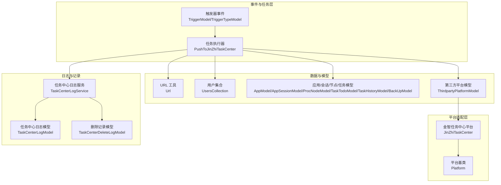
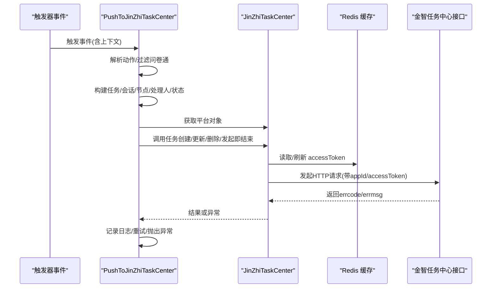
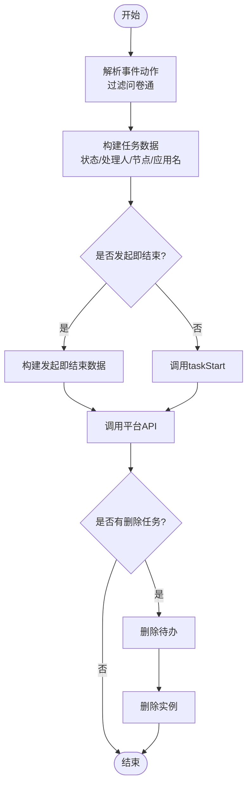
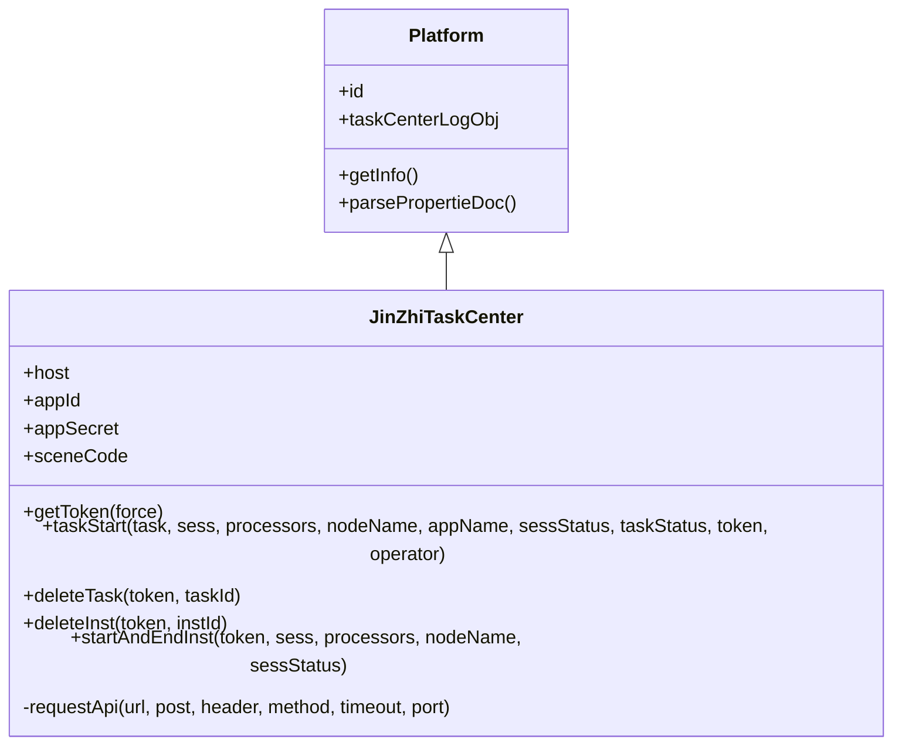
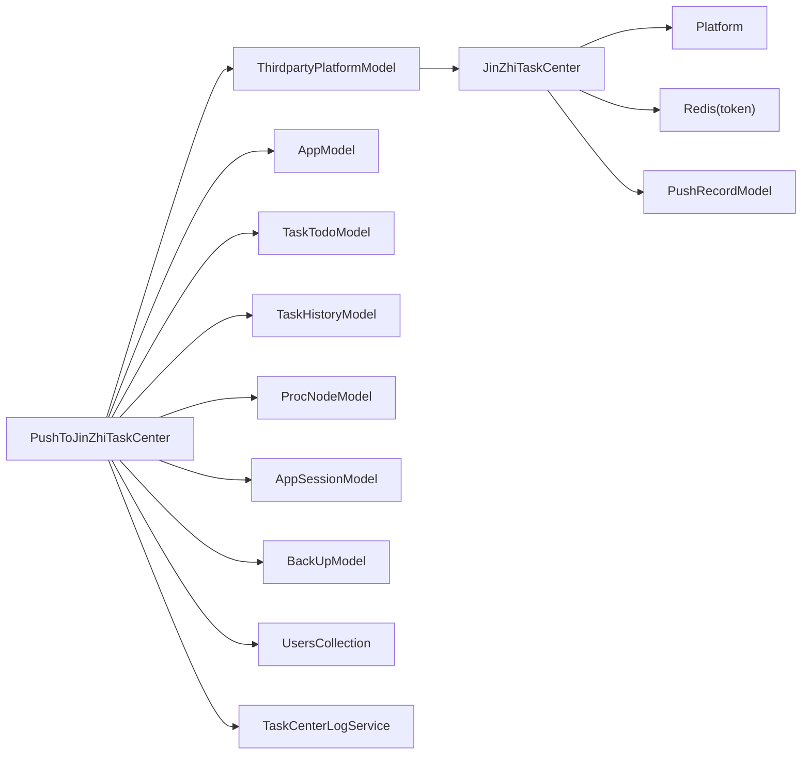

# 金智任务中心集成

<cite>
**本文引用的文件**
- [JinZhiTaskCenter.php](file://process/src/services/platform/JinZhiTaskCenter.php)
- [PushToJinZhiTaskCenter.php](file://process/src/services/task/PushToJinZhiTaskCenter.php)
- [Platform.php](file://process/src/services/platform/Platform.php)
- [ThirdpartyPlatformModel.php](file://process/src/models/ThirdpartyPlatformModel.php)
- [TaskCenterLogService.php](file://process/src/services/taskCenter/TaskCenterLogService.php)
- [TaskCenterLogModel.php](file://process/src/models/TaskCenterLogModel.php)
- [TaskCenterDeleteLogModel.php](file://process/src/models/TaskCenterDeleteLogModel.php)
- [Task.php](file://process/src/http/open/Task.php)
- [Url.php](file://process/src/helpers/Url.php)
- [UsersCollection.php](file://process/src/services/UsersCollection.php)
- [AppModel.php](file://process/src/models/AppModel.php)
- [TaskTodoModel.php](file://process/src/models/TaskTodoModel.php)
- [TaskHistoryModel.php](file://process/src/models/TaskHistoryModel.php)
- [ProcNodeModel.php](file://process/src/models/ProcNodeModel.php)
- [AppSessionModel.php](file://process/src/models/AppSessionModel.php)
- [BackUpModel.php](file://process/src/models/BackUpModel.php)
- [TriggerModel.php](file://process/src/models/TriggerModel.php)
- [TriggerTypeModel.php](file://process/src/models/TriggerTypeModel.php)
- [ProcLogModel.php](file://process/src/models/ProcLogModel.php)
- [PushRecordModel.php](file://process/src/models/PushRecordModel.php)
- [Cache.php](file://process/src/components/Cache.php)
- [redis.conf](file://process/docker/services/redis/redis.conf)
</cite>

## 目录
1. [引言](#引言)
2. [项目结构](#项目结构)
3. [核心组件](#核心组件)
4. [架构总览](#架构总览)
5. [详细组件分析](#详细组件分析)
6. [依赖关系分析](#依赖关系分析)
7. [性能考量](#性能考量)
8. [故障排查指南](#故障排查指南)
9. [结论](#结论)
10. [附录](#附录)

## 引言
本文件面向 htdNew 项目中“金智任务中心”集成，系统化阐述任务中心推送服务的实现机制与接口规范，覆盖 PushToJinZhiTaskCenter 类的功能特性、任务数据映射、API 调用流程与响应处理、金智任务中心的数据格式要求、认证机制与任务状态同步策略，以及集成配置、参数设置与异常处理机制。同时提供性能优化建议与常见问题解决方案，帮助开发者与运维人员高效落地与稳定运行。

## 项目结构
围绕金智任务中心集成的关键文件组织如下：
- 平台适配层：JinZhiTaskCenter 平台类负责与金智任务中心交互，封装认证、请求与数据格式转换。
- 任务推送执行层：PushToJinZhiTaskCenter 任务类负责从事件上下文抽取数据、构建推送数据、调用平台方法并处理删除与发起即结束等特殊场景。
- 平台注册与反射：ThirdpartyPlatformModel 提供平台对象创建与属性解析，便于后台管理界面动态渲染配置表单。
- 日志与记录：TaskCenterLogService/Model 与 TaskCenterDeleteLogModel 记录推送过程与结果，支撑可观测性与重试策略。
- URL 与用户信息：Url 帮助生成查看链接；UsersCollection 提供统一用户编号查询；AppModel、TaskTodoModel、TaskHistoryModel、ProcNodeModel、AppSessionModel、BackUpModel 等模型提供数据来源。
- 基类与通用能力：Platform 抽象基类提供平台信息与通用属性解析能力；Swoole 协程 HTTP 客户端用于平台侧 API 调用。

图表来源
- [PushToJinZhiTaskCenter.php](file://process/src/services/task/PushToJinZhiTaskCenter.php#L295-L416)
- [JinZhiTaskCenter.php](file://process/src/services/platform/JinZhiTaskCenter.php#L1-L383)
- [Platform.php](file://process/src/services/platform/Platform.php#L1-L93)
- [ThirdpartyPlatformModel.php](file://process/src/models/ThirdpartyPlatformModel.php#L414-L457)
- [TaskCenterLogService.php](file://process/src/services/taskCenter/TaskCenterLogService.php#L1-L78)
- [TaskCenterLogModel.php](file://process/src/models/TaskCenterLogModel.php#L1-L43)
- [TaskCenterDeleteLogModel.php](file://process/src/models/TaskCenterDeleteLogModel.php#L1-L44)
- [Url.php](file://process/src/helpers/Url.php#L24-L82)
- [UsersCollection.php](file://process/src/services/UsersCollection.php)
- [AppModel.php](file://process/src/models/AppModel.php)
- [TaskTodoModel.php](file://process/src/models/TaskTodoModel.php)
- [TaskHistoryModel.php](file://process/src/models/TaskHistoryModel.php)
- [ProcNodeModel.php](file://process/src/models/ProcNodeModel.php)
- [AppSessionModel.php](file://process/src/models/AppSessionModel.php)
- [BackUpModel.php](file://process/src/models/BackUpModel.php)
- [TriggerModel.php](file://process/src/models/TriggerModel.php)
- [TriggerTypeModel.php](file://process/src/models/TriggerTypeModel.php)

章节来源
- [PushToJinZhiTaskCenter.php](file://process/src/services/task/PushToJinZhiTaskCenter.php#L295-L416)
- [JinZhiTaskCenter.php](file://process/src/services/platform/JinZhiTaskCenter.php#L1-L383)
- [Platform.php](file://process/src/services/platform/Platform.php#L1-L93)
- [ThirdpartyPlatformModel.php](file://process/src/models/ThirdpartyPlatformModel.php#L414-L457)

## 核心组件
- PushToJinZhiTaskCenter（任务执行器）
  - 功能：根据触发器事件，从上下文中抽取会话、任务、操作者等信息，构建符合金智任务中心的数据结构，调用平台类完成任务创建、更新、删除与发起即结束推送。
  - 关键点：事件过滤（如问卷通跳过）、动作解析（action.xxx.x）、数据构建（任务/会话/节点/处理人/状态）、删除与发起即结束场景处理、日志记录与异常抛出。
- JinZhiTaskCenter（平台适配器）
  - 功能：封装与金智任务中心的交互，包括获取 accessToken、任务创建/更新、待办删除、实例删除、发起即结束推送，以及统一的 HTTP 请求与错误处理。
  - 关键点：基于 Swoole 协程 HTTP 客户端的请求封装、Redis 缓存 token、严格校验返回码与 errcode。
- 平台基类 Platform
  - 功能：提供平台信息模板、属性解析（含表单类型、选项、必填等），作为所有平台类的抽象基类。
- 第三方平台模型 ThirdpartyPlatformModel
  - 功能：平台对象创建与属性反射，支持后台动态配置与表单渲染。
- 日志与记录
  - TaskCenterLogService/Model：记录每次推送的上下文、状态、结果与重试次数。
  - TaskCenterDeleteLogModel：记录删除类推送的结果与重试次数。

章节来源
- [PushToJinZhiTaskCenter.php](file://process/src/services/task/PushToJinZhiTaskCenter.php#L1-L417)
- [JinZhiTaskCenter.php](file://process/src/services/platform/JinZhiTaskCenter.php#L1-L383)
- [Platform.php](file://process/src/services/platform/Platform.php#L1-L93)
- [ThirdpartyPlatformModel.php](file://process/src/models/ThirdpartyPlatformModel.php#L414-L457)
- [TaskCenterLogService.php](file://process/src/services/taskCenter/TaskCenterLogService.php#L1-L78)
- [TaskCenterLogModel.php](file://process/src/models/TaskCenterLogModel.php#L1-L43)
- [TaskCenterDeleteLogModel.php](file://process/src/models/TaskCenterDeleteLogModel.php#L1-L44)

## 架构总览
金智任务中心集成采用“事件驱动 + 平台适配”的架构模式：
- 事件源：触发器事件（如接收任务、审批完成、实例终止、实例删除等）。
- 任务执行器：解析事件，构建推送数据，调用平台适配器。
- 平台适配器：统一认证与请求封装，对接金智任务中心 API。
- 数据与工具：模型与工具类提供数据来源与链接生成。
- 日志与记录：贯穿推送全流程，保障可观测性与可恢复性。

图表来源
- [PushToJinZhiTaskCenter.php](file://process/src/services/task/PushToJinZhiTaskCenter.php#L295-L416)
- [JinZhiTaskCenter.php](file://process/src/services/platform/JinZhiTaskCenter.php#L118-L171)
- [TaskCenterLogService.php](file://process/src/services/taskCenter/TaskCenterLogService.php#L1-L78)

## 详细组件分析

### PushToJinZhiTaskCenter（任务执行器）
- 事件过滤与动作解析
  - 支持 action.xxx.x 的事件命名空间，提取主动作名；对问卷通类型事件直接跳过，避免无意义推送。
- 数据构建
  - 会话状态映射：进行中/完成/中止/撤销等映射为金智任务中心的会话状态字符串。
  - 任务状态映射：初始化映射为进行中，否则映射为完成。
  - 处理人列表：通过用户编号构造处理器数组。
  - 应用名称：多语言/数组/对象形式的名称解析，优先中文。
  - 节点名称：从流程节点模型缓存获取。
  - 特殊场景：
    - 发起即结束：构建“事项结束”节点与完成态。
    - 实例删除：从备份数据中提取待删除任务ID列表。
- API 调用
  - 通过 ThirdpartyPlatformModel 获取平台对象与 token。
  - 条件调用：发起即结束走 startAndEndInst；其他场景走 taskStart。
  - 删除场景：逐条删除待办，再删除实例。
- 异常处理
  - 捕获 UserException 并向上抛出，确保事件处理链路可见。

图表来源
- [PushToJinZhiTaskCenter.php](file://process/src/services/task/PushToJinZhiTaskCenter.php#L295-L416)

章节来源
- [PushToJinZhiTaskCenter.php](file://process/src/services/task/PushToJinZhiTaskCenter.php#L1-L417)

### JinZhiTaskCenter（平台适配器）
- 认证与 Token
  - 通过 host、appId、appSecret 调用 accessToken 接口获取 token，并缓存至 Redis，键名固定，过期时间合理。
- API 请求封装
  - 使用 Swoole 协程 HTTP 客户端发起请求，自动设置超时、方法、头部与数据体。
  - 统一记录请求与响应到 PushRecordModel，便于审计与排障。
- 任务相关接口
  - 任务创建/更新：根据 operator（insert/update）构造 insertModel/updateModel，填充 taskId、sceneCode、subject、priority、taskType、initiator、processors、urls、nodeId/nodeName、applicationModel 等。
  - 待办删除：按 taskId 删除。
  - 实例删除：按 processInstanceId 删除。
  - 发起即结束：新增 processInstance 记录，包含发起人、主题、处理人、节点、状态与链接。
- 错误处理
  - 非 200 状态码抛出 UserException；errcode 非 0 同样抛出 UserException，保证上层感知。

图表来源
- [Platform.php](file://process/src/services/platform/Platform.php#L1-L93)
- [JinZhiTaskCenter.php](file://process/src/services/platform/JinZhiTaskCenter.php#L1-L383)

章节来源
- [JinZhiTaskCenter.php](file://process/src/services/platform/JinZhiTaskCenter.php#L1-L383)

### 平台注册与配置
- ThirdpartyPlatformModel
  - 通过 className 查找平台配置并创建平台对象；支持后台动态配置与属性解析。
- 平台信息
  - getInfo 返回平台名称、能力（任务中心）、分类（任务中心）、环境限制等，供后台管理界面使用。

章节来源
- [ThirdpartyPlatformModel.php](file://process/src/models/ThirdpartyPlatformModel.php#L414-L457)
- [JinZhiTaskCenter.php](file://process/src/services/platform/JinZhiTaskCenter.php#L85-L99)

### 数据映射与接口规范
- 任务创建/更新（taskStart）
  - 输入：task、sess、processors、nodeName、appName、sessStatus、taskStatus、token、operator。
  - 输出：errcode=0 成功，否则抛出异常。
  - 关键字段：taskId、sceneCode、subject、priority、taskType、initiatorType/initiatorId、processors、urls、applicationModel.processInstanceStatus/nodeId/nodeName/serviceName 等。
- 待办删除（deleteTask）
  - 输入：token、taskId。
  - 输出：errcode=0 成功。
- 实例删除（deleteInst）
  - 输入：token、processInstanceId。
  - 输出：errcode=0 成功。
- 发起即结束（startAndEndInst）
  - 输入：token、sess、processors、nodeName、sessStatus。
  - 输出：errcode=0 成功。

章节来源
- [JinZhiTaskCenter.php](file://process/src/services/platform/JinZhiTaskCenter.php#L174-L373)

### 任务状态同步策略
- 会话状态映射
  - 进行中 → RUNNING；完成/撤销 → COMPLETE；中止 → ABORT；驳回/草稿 → 依据具体规则映射。
- 任务状态映射
  - 初始化 → RUNNING；完成/终止 → COMPLETE。
- URL 生成
  - 使用 Url 工具生成 PC/H5 查看链接，区分待办与申请视图。

章节来源
- [PushToJinZhiTaskCenter.php](file://process/src/services/task/PushToJinZhiTaskCenter.php#L80-L184)
- [Url.php](file://process/src/helpers/Url.php#L24-L82)

### 集成配置与参数设置
- 平台配置项
  - host：金智任务中心域名。
  - appId/appSecret：开发者凭证。
  - sceneCode：业务场景编码（用于任务创建）。
- 配置入口
  - 通过 ThirdpartyPlatformModel::findByClassName 获取平台配置并创建对象；平台属性解析用于后台表单渲染。

章节来源
- [JinZhiTaskCenter.php](file://process/src/services/platform/JinZhiTaskCenter.php#L24-L47)
- [ThirdpartyPlatformModel.php](file://process/src/models/ThirdpartyPlatformModel.php#L414-L457)

### 异常处理机制
- 平台侧
  - 非 200 状态码或 errcode 非 0 抛出 UserException。
- 任务执行器
  - 捕获 UserException 并向上抛出，确保事件处理链路可见。
- 日志记录
  - TaskCenterLogService 在推送前写入“重试中”，在完成后更新状态、重试次数与失败时间；若结果为空或仍为重试中则标记失败。

章节来源
- [JinZhiTaskCenter.php](file://process/src/services/platform/JinZhiTaskCenter.php#L136-L149)
- [PushToJinZhiTaskCenter.php](file://process/src/services/task/PushToJinZhiTaskCenter.php#L411-L415)
- [TaskCenterLogService.php](file://process/src/services/taskCenter/TaskCenterLogService.php#L1-L78)

## 依赖关系分析
- PushToJinZhiTaskCenter 依赖
  - 事件模型：TriggerModel/TriggerTypeModel。
  - 平台模型：ThirdpartyPlatformModel。
  - 平台适配器：JinZhiTaskCenter。
  - 数据模型：AppModel、TaskTodoModel、TaskHistoryModel、ProcNodeModel、AppSessionModel、BackUpModel。
  - 工具：Url、UsersCollection。
  - 日志：TaskCenterLogService。
- JinZhiTaskCenter 依赖
  - 平台基类：Platform。
  - 工具：Url、UsersCollection。
  - 记录：PushRecordModel。
  - 缓存：Redis（token）。

图表来源
- [PushToJinZhiTaskCenter.php](file://process/src/services/task/PushToJinZhiTaskCenter.php#L1-L417)
- [JinZhiTaskCenter.php](file://process/src/services/platform/JinZhiTaskCenter.php#L1-L383)
- [Platform.php](file://process/src/services/platform/Platform.php#L1-L93)
- [ThirdpartyPlatformModel.php](file://process/src/models/ThirdpartyPlatformModel.php#L414-L457)

章节来源
- [PushToJinZhiTaskCenter.php](file://process/src/services/task/PushToJinZhiTaskCenter.php#L1-L417)
- [JinZhiTaskCenter.php](file://process/src/services/platform/JinZhiTaskCenter.php#L1-L383)

## 性能考量
- Token 缓存
  - 使用 Redis 缓存 accessToken，减少重复获取开销；注意过期时间与强制刷新策略。
- 并发与协程
  - 平台侧使用 Swoole 协程 HTTP 客户端，提升并发请求效率。
- 对象缓存与共享内存
  - 全局对象缓存组件通过共享内存与 Redis 版本同步，降低跨进程对象重建成本。
- Redis 配置
  - 内存上限、持久化策略与键空间通知可根据实际负载调整，确保高并发下的稳定性。

章节来源
- [JinZhiTaskCenter.php](file://process/src/services/platform/JinZhiTaskCenter.php#L156-L171)
- [Cache.php](file://process/src/components/Cache.php#L1-L135)
- [redis.conf](file://process/docker/services/redis/redis.conf#L1-L50)

## 故障排查指南
- 常见问题
  - token 获取失败：检查 host、appId、appSecret 配置；确认 Redis 可用；查看 PushRecordModel 中的请求与响应。
  - 接口返回 errcode 非 0：核对 taskId、sceneCode、processors 等关键字段；检查 URL 生成是否正确。
  - 任务未推送：确认事件是否为问卷通类型被跳过；检查 TaskCenterLogModel 中 push_status 与 retry_count。
  - 删除未生效：确认删除任务 ID 列表是否正确提取；检查删除顺序（先待办后实例）。
- 排查步骤
  - 查看 TaskCenterLogService/Model 与 TaskCenterDeleteLogModel 的记录，定位失败阶段。
  - 检查 PushRecordModel 中的请求体与响应体，复现接口调用。
  - 核对 Redis 中 token 是否存在且未过期。
- 建议
  - 在开发环境开启更详细的日志输出，结合前端或平台侧日志交叉验证。
  - 对高频失败场景增加重试与告警联动，避免雪崩效应。

章节来源
- [TaskCenterLogService.php](file://process/src/services/taskCenter/TaskCenterLogService.php#L1-L78)
- [TaskCenterLogModel.php](file://process/src/models/TaskCenterLogModel.php#L1-L43)
- [TaskCenterDeleteLogModel.php](file://process/src/models/TaskCenterDeleteLogModel.php#L1-L44)
- [PushRecordModel.php](file://process/src/models/PushRecordModel.php)
- [JinZhiTaskCenter.php](file://process/src/services/platform/JinZhiTaskCenter.php#L118-L171)

## 结论
金智任务中心集成为 htdNew 提供了标准化、可扩展的任务推送能力。通过 PushToJinZhiTaskCenter 与 JinZhiTaskCenter 的清晰分工，配合完善的日志与异常处理机制，能够在复杂流程场景下稳定地将任务状态同步至金智任务中心。建议在生产环境中强化缓存与并发控制，完善监控与告警，持续优化数据映射与 URL 生成策略，以获得更好的用户体验与系统稳定性。

## 附录
- 关键接口与字段
  - 任务创建/更新：taskId、sceneCode、subject、priority、taskType、initiatorType/initiatorId、processors、urls、applicationModel.processInstanceStatus/nodeId/nodeName/serviceName。
  - 待办删除：taskId。
  - 实例删除：processInstanceId。
  - 发起即结束：processInstanceId、initiatorType、initiatorId、subject、processors、nodeName、processInstanceStatus、urls、createTime。
- 配置项
  - host、appId、appSecret、sceneCode。
- 相关模型与工具
  - AppModel、TaskTodoModel、TaskHistoryModel、ProcNodeModel、AppSessionModel、BackUpModel、Url、UsersCollection、ThirdpartyPlatformModel、TaskCenterLogService/Model、TaskCenterDeleteLogModel、PushRecordModel。