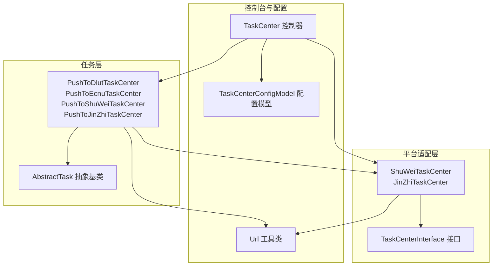
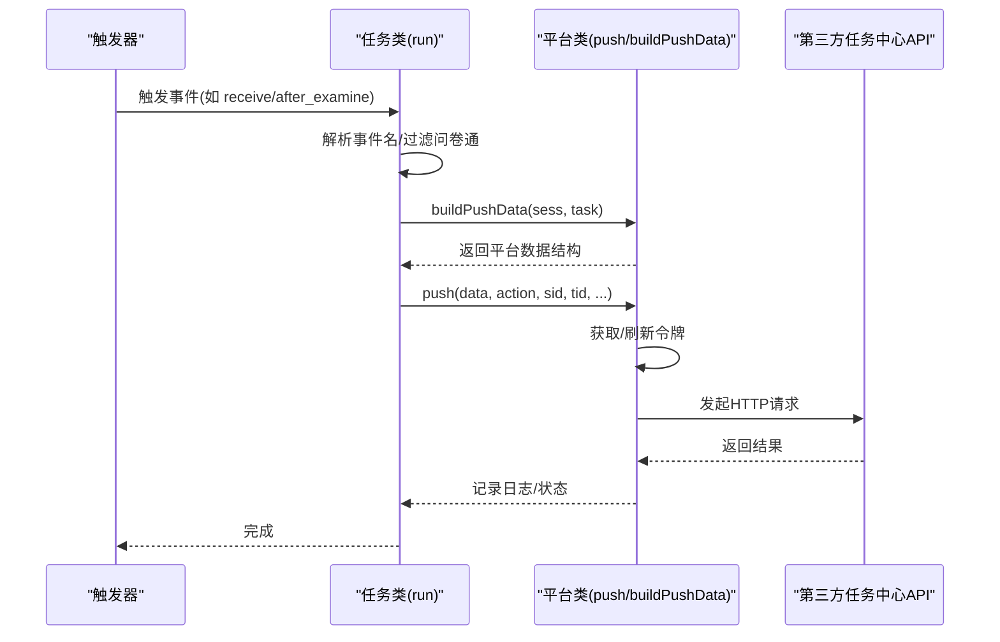
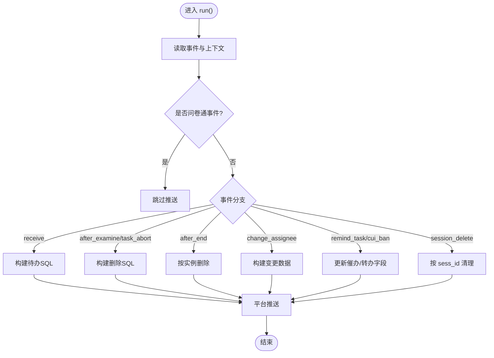
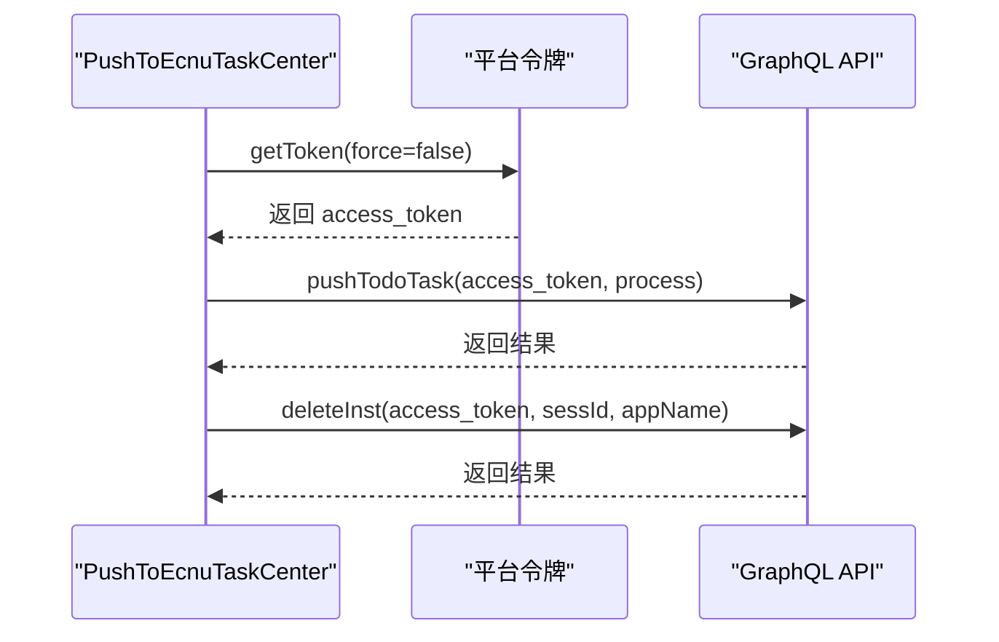
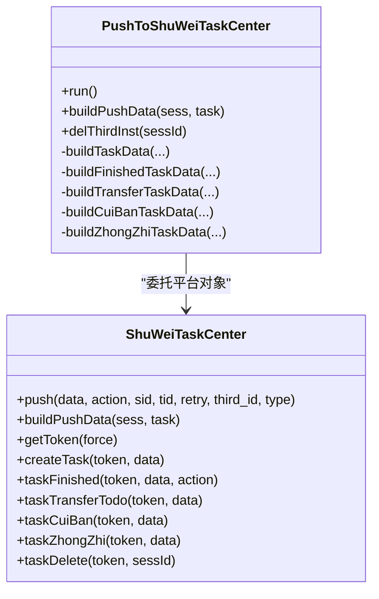
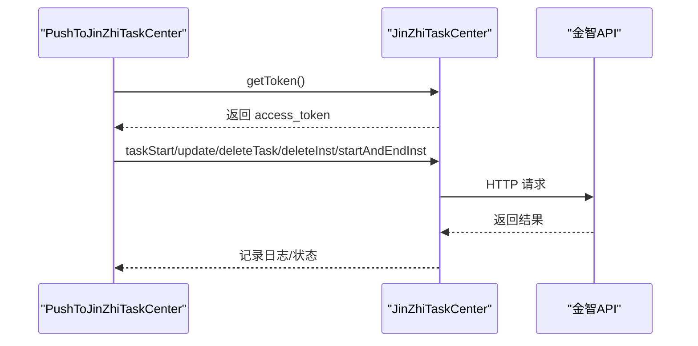
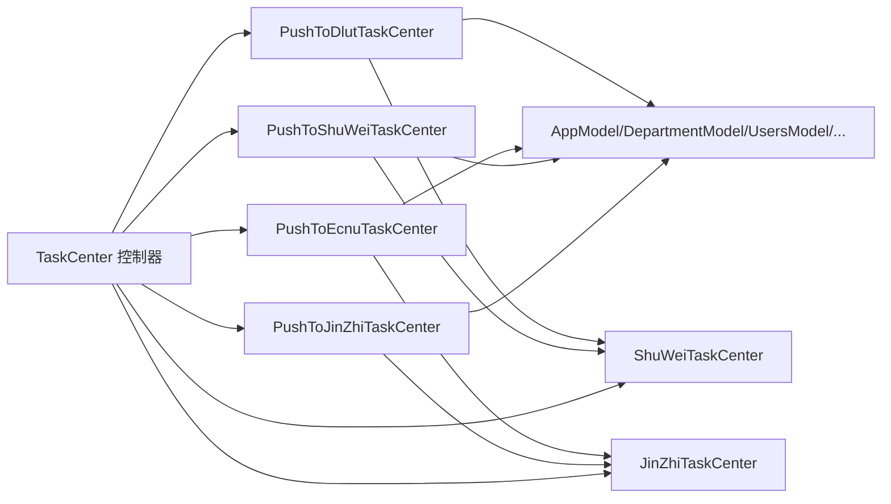

# 高校任务中心集成

<cite>
**本文引用的文件**
- [PushToDlutTaskCenter.php](file://process/src/services/task/PushToDlutTaskCenter.php)
- [PushToEcnuTaskCenter.php](file://process/src/services/task/PushToEcnuTaskCenter.php)
- [PushToShuWeiTaskCenter.php](file://process/src/services/task/PushToShuWeiTaskCenter.php)
- [PushToJinZhiTaskCenter.php](file://process/src/services/task/PushToJinZhiTaskCenter.php)
- [AbstractTask.php](file://process/src/services/task/AbstractTask.php)
- [TaskCenterInterface.php](file://process/src/services/platform/TaskCenterInterface.php)
- [ShuWeiTaskCenter.php](file://process/src/services/platform/ShuWeiTaskCenter.php)
- [JinZhiTaskCenter.php](file://process/src/services/platform/JinZhiTaskCenter.php)
- [TaskCenter.php](file://process/src/http/system/TaskCenter.php)
- [TaskCenterConfigModel.php](file://process/src/models/TaskCenterConfigModel.php)
- [Url.php](file://process/src/helpers/Url.php)
</cite>

## 目录
1. [引言](#引言)
2. [项目结构](#项目结构)
3. [核心组件](#核心组件)
4. [架构总览](#架构总览)
5. [详细组件分析](#详细组件分析)
6. [依赖关系分析](#依赖关系分析)
7. [性能与可靠性](#性能与可靠性)
8. [故障排查指南](#故障排查指南)
9. [结论](#结论)
10. [附录](#附录)

## 引言
本文件面向 htdNew 项目中“高校任务中心集成”的实现与运维，系统性梳理任务中心推送服务的通用机制、不同高校（如大连理工大学、华东师范大学、金智、树维等）的集成策略与差异、数据格式与参数适配、异常处理与重试机制，并提供扩展开发与维护建议。读者可据此快速理解从流程事件到第三方任务中心的完整链路，以及如何为新的高校或平台接入。

## 项目结构
- 任务中心集成采用“任务类 + 平台适配层 + 控制台管理 + 日志与配置”的分层设计：
  - 任务类：位于 services/task，按高校/平台命名，统一继承抽象基类，封装事件驱动的构建与推送逻辑。
  - 平台适配层：位于 services/platform，实现统一接口，封装第三方平台的认证、请求、数据映射与回调处理。
  - 控制台管理：位于 http/system，提供平台配置、触发器创建、手动/批量推送、日志查询等功能。
  - 配置与日志：models 提供配置模型与日志模型，辅助统一管理推送行为与可观测性。

图表来源
- [PushToDlutTaskCenter.php](file://process/src/services/task/PushToDlutTaskCenter.php#L1-L294)
- [PushToEcnuTaskCenter.php](file://process/src/services/task/PushToEcnuTaskCenter.php#L1-L573)
- [PushToShuWeiTaskCenter.php](file://process/src/services/task/PushToShuWeiTaskCenter.php#L1-L818)
- [PushToJinZhiTaskCenter.php](file://process/src/services/task/PushToJinZhiTaskCenter.php#L1-L417)
- [AbstractTask.php](file://process/src/services/task/AbstractTask.php#L1-L30)
- [TaskCenterInterface.php](file://process/src/services/platform/TaskCenterInterface.php#L1-L34)
- [ShuWeiTaskCenter.php](file://process/src/services/platform/ShuWeiTaskCenter.php#L1-L800)
- [JinZhiTaskCenter.php](file://process/src/services/platform/JinZhiTaskCenter.php#L1-L383)
- [TaskCenter.php](file://process/src/http/system/TaskCenter.php#L1-L861)
- [TaskCenterConfigModel.php](file://process/src/models/TaskCenterConfigModel.php#L1-L62)
- [Url.php](file://process/src/helpers/Url.php#L7-L22)

章节来源
- [TaskCenter.php](file://process/src/http/system/TaskCenter.php#L1-L200)
- [TaskCenterConfigModel.php](file://process/src/models/TaskCenterConfigModel.php#L1-L62)

## 核心组件
- 任务抽象基类
  - 规范任务生命周期与序列化行为，子类需实现 run()。
  - 参考路径：[AbstractTask.php](file://process/src/services/task/AbstractTask.php#L1-L30)

- 平台适配接口
  - 统一 push/buildPushData 签名，约束平台实现。
  - 参考路径：[TaskCenterInterface.php](file://process/src/services/platform/TaskCenterInterface.php#L1-L34)

- 平台实现（示例）
  - ShuWeiTaskCenter：OAuth2 授权、多动作路由、历史补推、日志与删除记录。
    - 参考路径：[ShuWeiTaskCenter.php](file://process/src/services/platform/ShuWeiTaskCenter.php#L1-L800)
  - JinZhiTaskCenter：令牌获取、任务创建/修改/删除、发起即结束实例、统一请求封装。
    - 参考路径：[JinZhiTaskCenter.php](file://process/src/services/platform/JinZhiTaskCenter.php#L1-L383)

- 任务类（示例）
  - PushToDlutTaskCenter：基于 SQL 的待办/通知表操作，支持催办/转办更新。
    - 参考路径：[PushToDlutTaskCenter.php](file://process/src/services/task/PushToDlutTaskCenter.php#L1-L294)
  - PushToEcnuTaskCenter：GraphQL 接口推送、OAuth2 令牌缓存、多任务聚合。
    - 参考路径：[PushToEcnuTaskCenter.php](file://process/src/services/task/PushToEcnuTaskCenter.php#L1-L573)
  - PushToShuWeiTaskCenter：平台对象注入、构建推送数据、事件分支处理、历史补推。
    - 参考路径：[PushToShuWeiTaskCenter.php](file://process/src/services/task/PushToShuWeiTaskCenter.php#L1-L818)
  - PushToJinZhiTaskCenter：令牌驱动、任务/实例 CRUD、发起即结束处理。
    - 参考路径：[PushToJinZhiTaskCenter.php](file://process/src/services/task/PushToJinZhiTaskCenter.php#L1-L417)

章节来源
- [AbstractTask.php](file://process/src/services/task/AbstractTask.php#L1-L30)
- [TaskCenterInterface.php](file://process/src/services/platform/TaskCenterInterface.php#L1-L34)
- [ShuWeiTaskCenter.php](file://process/src/services/platform/ShuWeiTaskCenter.php#L1-L800)
- [JinZhiTaskCenter.php](file://process/src/services/platform/JinZhiTaskCenter.php#L1-L383)
- [PushToDlutTaskCenter.php](file://process/src/services/task/PushToDlutTaskCenter.php#L1-L294)
- [PushToEcnuTaskCenter.php](file://process/src/services/task/PushToEcnuTaskCenter.php#L1-L573)
- [PushToShuWeiTaskCenter.php](file://process/src/services/task/PushToShuWeiTaskCenter.php#L1-L818)
- [PushToJinZhiTaskCenter.php](file://process/src/services/task/PushToJinZhiTaskCenter.php#L1-L417)

## 架构总览
- 事件驱动：系统通过全局触发器在 after_start/after_end/receive/after_examine/task_abort/session_delete 等事件点触发任务类 run()。
- 数据构建：任务类根据上下文构建目标平台所需的数据结构；平台类负责认证与调用第三方 API。
- 控制台管理：提供平台配置、触发器创建、手动/批量推送、日志查询与变更记录。
- 可观测性：统一记录推送日志、删除日志、推送记录，便于问题定位与审计。

图表来源
- [TaskCenter.php](file://process/src/http/system/TaskCenter.php#L588-L740)
- [PushToShuWeiTaskCenter.php](file://process/src/services/task/PushToShuWeiTaskCenter.php#L726-L818)
- [ShuWeiTaskCenter.php](file://process/src/services/platform/ShuWeiTaskCenter.php#L300-L410)
- [JinZhiTaskCenter.php](file://process/src/services/platform/JinZhiTaskCenter.php#L156-L383)

章节来源
- [TaskCenter.php](file://process/src/http/system/TaskCenter.php#L588-L740)

## 详细组件分析

### 大连理工大学任务中心（PushToDlutTaskCenter）
- 功能特性
  - 基于本地数据库的待办/通知表操作，支持插入、更新、删除。
  - 支持催办/转办更新字段。
  - 事件分支覆盖 after_start/after_end/receive/change_assignee/after_examine/task_abort/session_delete。
  - 问卷通事件跳过推送。
- 数据构建
  - 构建待办插入语句与消息通知语句，生成 sys_id 关联。
  - 删除时根据 sess_id 或 sess_id_task_id 匹配清理。
- 参数与适配
  - 通过平台对象统一推送入口，third_id 作为平台标识。
- 异常处理
  - 捕获用户异常并抛出，保证任务失败可见。

图表来源
- [PushToDlutTaskCenter.php](file://process/src/services/task/PushToDlutTaskCenter.php#L196-L294)

章节来源
- [PushToDlutTaskCenter.php](file://process/src/services/task/PushToDlutTaskCenter.php#L1-L294)

### 华东师范大学任务中心（PushToEcnuTaskCenter）
- 功能特性
  - OAuth2 令牌缓存与刷新。
  - GraphQL 接口推送，支持待办任务与实例删除。
  - 多任务聚合构建，支持历史任务补推。
  - 问卷通事件跳过。
- 数据构建
  - 构建 ProcessInput 与 TaskInput，含应用、部门、实例状态、任务列表等。
  - 支持按实例删除（deleteProcess）。
- 参数与适配
  - host/client_id/client_secret/scope/grant_type 等配置项。
  - URL 与 GraphQL 变量按毫秒时间戳构造。
- 异常处理
  - HTTP 状态码非 200 抛出用户异常，便于控制台感知。

图表来源
- [PushToEcnuTaskCenter.php](file://process/src/services/task/PushToEcnuTaskCenter.php#L107-L256)
- [PushToEcnuTaskCenter.php](file://process/src/services/task/PushToEcnuTaskCenter.php#L258-L573)

章节来源
- [PushToEcnuTaskCenter.php](file://process/src/services/task/PushToEcnuTaskCenter.php#L1-L573)

### 树维任务中心（PushToShuWeiTaskCenter + ShuWeiTaskCenter）
- 功能特性
  - OAuth2 授权（client_credentials），令牌缓存与刷新。
  - 多动作路由：创建任务、任务完成、转办、催办、终止、删除、恢复等。
  - 历史补推：针对上一节点任务完成进行补推，处理“任务不存在”等异常。
  - 日志与删除日志：统一记录推送结果与删除结果。
- 数据构建
  - buildPushData 将实例与任务信息映射为平台数据结构，含节点、URL、人员、状态等。
  - 历史补推时逐条构造 previousTaskId/handleOpinions/handleStatus 等字段。
- 参数与适配
  - tokenHost/taskHost/clientId/clientSecret/scope/appId/transactionId 等。
  - send_msg/channels 可选消息参数。
- 异常处理
  - HTTP 非 200 或第三方返回 errorIds 时标记失败；对“任务不存在”做二次创建再推送。

图表来源
- [PushToShuWeiTaskCenter.php](file://process/src/services/task/PushToShuWeiTaskCenter.php#L1-L818)
- [ShuWeiTaskCenter.php](file://process/src/services/platform/ShuWeiTaskCenter.php#L1-L800)

章节来源
- [PushToShuWeiTaskCenter.php](file://process/src/services/task/PushToShuWeiTaskCenter.php#L1-L818)
- [ShuWeiTaskCenter.php](file://process/src/services/platform/ShuWeiTaskCenter.php#L1-L800)

### 金智任务中心（PushToJinZhiTaskCenter + JinZhiTaskCenter）
- 功能特性
  - 令牌获取（GET /token/gateway/accessToken），缓存过期时间计算。
  - 任务创建/修改、待办删除、实例删除、发起即结束实例。
  - 统一请求封装，记录推送记录。
- 数据构建
  - 任务/实例状态映射（RUNNING/CANCEL/ABORT/COMPLETE 等）。
  - 发起即结束场景构建专用数据结构。
- 参数与适配
  - host/appId/appSecret/sceneCode 等。
- 异常处理
  - 令牌/接口失败抛出用户异常；接口返回 errcode 非 0 抛出异常。

图表来源
- [PushToJinZhiTaskCenter.php](file://process/src/services/task/PushToJinZhiTaskCenter.php#L295-L417)
- [JinZhiTaskCenter.php](file://process/src/services/platform/JinZhiTaskCenter.php#L156-L383)

章节来源
- [PushToJinZhiTaskCenter.php](file://process/src/services/task/PushToJinZhiTaskCenter.php#L1-L417)
- [JinZhiTaskCenter.php](file://process/src/services/platform/JinZhiTaskCenter.php#L1-L383)

### 通用集成模式与参数适配
- 通用模式
  - 事件过滤：统一跳过问卷通事件。
  - 数据构建：任务类 buildPushData → 平台类 push。
  - 平台鉴权：OAuth2/令牌缓存；失败统一抛出用户异常。
  - 历史补推：针对上一节点完成进行补推，处理“任务不存在”等边界。
- 参数适配
  - URL 与 GraphQL/REST 路径差异。
  - 令牌获取方式与过期策略差异。
  - 数据结构字段映射（应用/部门/节点/URL/人员/状态）。
- 异常处理
  - HTTP 非 200、第三方返回错误码、令牌获取失败均视为失败并记录日志。

章节来源
- [PushToEcnuTaskCenter.php](file://process/src/services/task/PushToEcnuTaskCenter.php#L60-L133)
- [ShuWeiTaskCenter.php](file://process/src/services/platform/ShuWeiTaskCenter.php#L300-L410)
- [JinZhiTaskCenter.php](file://process/src/services/platform/JinZhiTaskCenter.php#L156-L383)

## 依赖关系分析
- 任务类依赖
  - 任务类依赖平台适配类（通过平台对象或直接调用平台类）。
  - 任务类依赖模型与工具类（AppModel/DepartmentModel/UsersModel/ProcNodeModel/Url 等）。
- 平台适配类依赖
  - 平台类依赖 Redis 缓存令牌、HTTP 客户端、日志与推送记录模型。
- 控制台依赖
  - 控制台负责创建/编辑平台、创建全局触发器、手动/批量推送、日志查询与变更记录。

图表来源
- [PushToDlutTaskCenter.php](file://process/src/services/task/PushToDlutTaskCenter.php#L1-L294)
- [PushToEcnuTaskCenter.php](file://process/src/services/task/PushToEcnuTaskCenter.php#L1-L573)
- [PushToShuWeiTaskCenter.php](file://process/src/services/task/PushToShuWeiTaskCenter.php#L1-L818)
- [PushToJinZhiTaskCenter.php](file://process/src/services/task/PushToJinZhiTaskCenter.php#L1-L417)
- [ShuWeiTaskCenter.php](file://process/src/services/platform/ShuWeiTaskCenter.php#L1-L800)
- [JinZhiTaskCenter.php](file://process/src/services/platform/JinZhiTaskCenter.php#L1-L383)
- [TaskCenter.php](file://process/src/http/system/TaskCenter.php#L588-L740)

章节来源
- [TaskCenter.php](file://process/src/http/system/TaskCenter.php#L588-L740)

## 性能与可靠性
- 令牌缓存
  - Redis 缓存 OAuth2 令牌，减少重复请求；注意过期时间与刷新策略。
- 历史补推
  - 针对上一节点完成进行补推，避免漏推；使用 Redis Key 去重。
- 日志与可观测性
  - 统一记录推送日志、删除日志与推送记录，便于问题定位。
- 批量推送
  - 控制台提供批量手动推送入口，加入队列异步处理，避免阻塞。

章节来源
- [ShuWeiTaskCenter.php](file://process/src/services/platform/ShuWeiTaskCenter.php#L300-L410)
- [JinZhiTaskCenter.php](file://process/src/services/platform/JinZhiTaskCenter.php#L156-L383)
- [TaskCenter.php](file://process/src/http/system/TaskCenter.php#L669-L740)

## 故障排查指南
- 常见问题
  - 令牌获取失败：检查 host、clientId、clientSecret、scope 配置。
  - HTTP 非 200：检查网络、证书、超时设置。
  - 第三方返回错误码：根据返回码定位具体原因（如“任务不存在”触发补推）。
  - 问卷通事件未推送：确认问卷通标识过滤逻辑。
- 定位手段
  - 查看任务中心日志列表与详情，核对推送状态与结果。
  - 使用手动推送功能验证单条数据。
  - 检查推送记录与日志记录，确认请求 URL、请求体与响应体。
- 处理建议
  - 对“任务不存在”类错误进行二次创建再推送。
  - 对历史补推增加幂等保护（Redis Key 去重）。

章节来源
- [TaskCenter.php](file://process/src/http/system/TaskCenter.php#L472-L561)
- [ShuWeiTaskCenter.php](file://process/src/services/platform/ShuWeiTaskCenter.php#L204-L298)

## 结论
htdNew 的高校任务中心集成为“任务类 + 平台适配层 + 控制台管理 + 日志配置”的清晰分层架构。不同高校/平台通过统一接口与事件驱动实现差异化对接，具备良好的扩展性与可观测性。建议在新增高校或平台时，遵循现有模式：先实现平台类（认证与请求），再实现任务类（事件分支与数据构建），并通过控制台完成配置与测试。

## 附录
- URL 常量（任务中心页面链接）
  - 示例：查看、审批、打印、再次发起、流程日志等。
  - 参考路径：[Url.php](file://process/src/helpers/Url.php#L7-L22)
- 配置项参考
  - 任务中心推送配置：重试次数与重试间隔。
  - 参考路径：[TaskCenterConfigModel.php](file://process/src/models/TaskCenterConfigModel.php#L1-L62)

章节来源
- [Url.php](file://process/src/helpers/Url.php#L7-L22)
- [TaskCenterConfigModel.php](file://process/src/models/TaskCenterConfigModel.php#L1-L62)