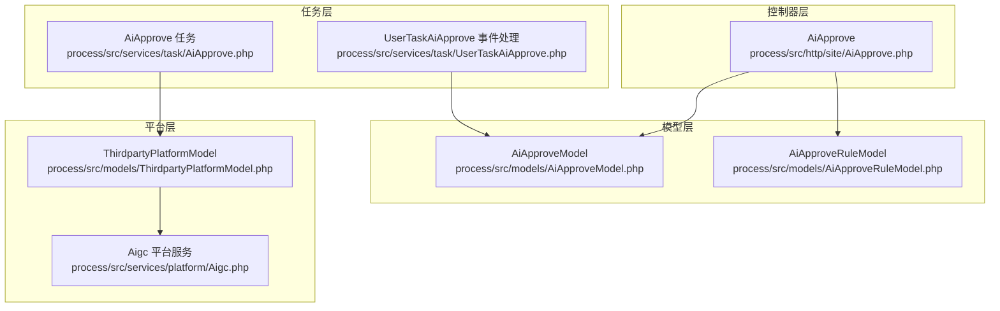
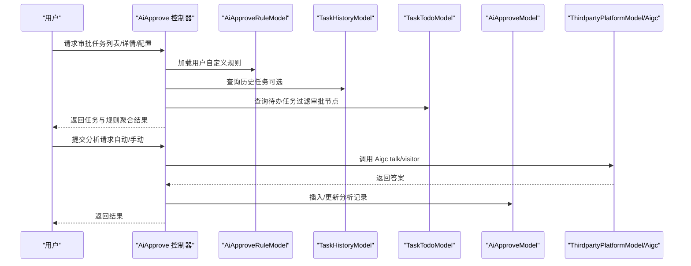
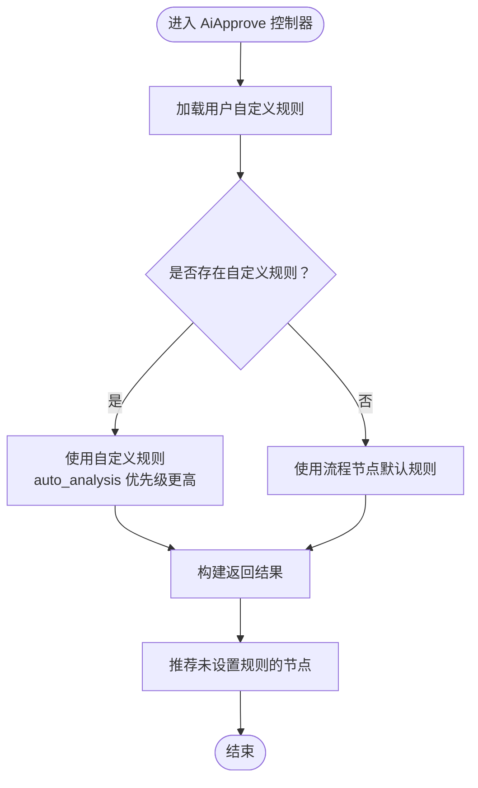
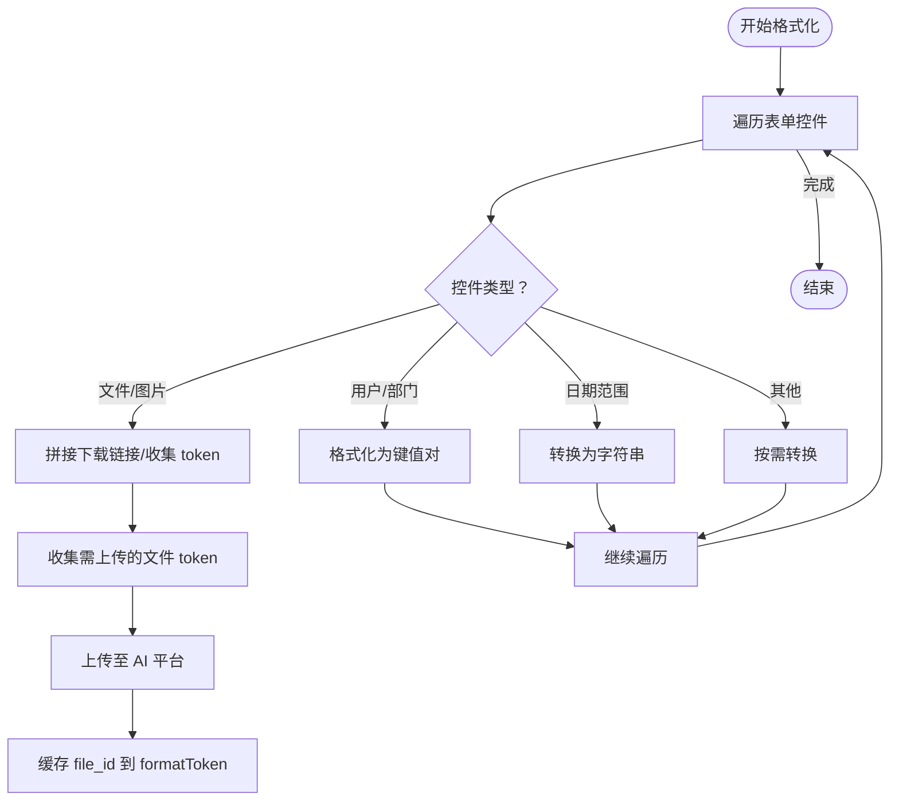
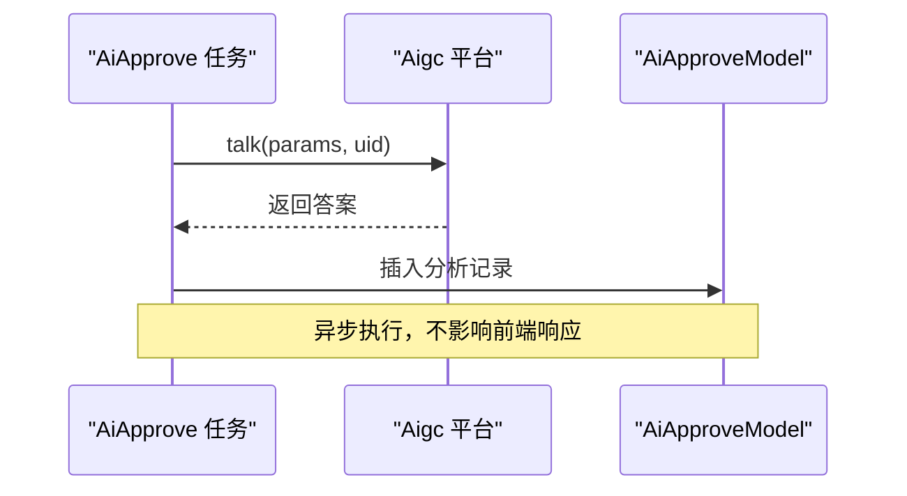
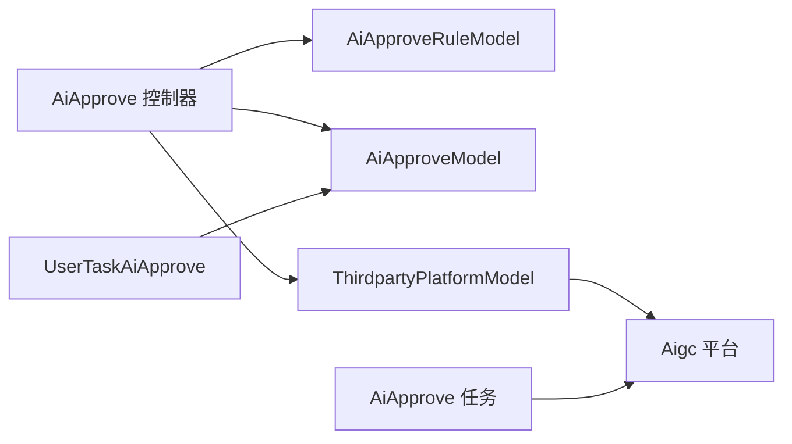

# AI智能审批

<cite>
**本文引用的文件**
- [process/src/http/site/AiApprove.php](file://process/src/http/site/AiApprove.php)
- [process/src/services/task/AiApprove.php](file://process/src/services/task/AiApprove.php)
- [process/src/services/task/UserTaskAiApprove.php](file://process/src/services/task/UserTaskAiApprove.php)
- [process/src/models/AiApproveModel.php](file://process/src/models/AiApproveModel.php)
- [process/src/models/AiApproveRuleModel.php](file://process/src/models/AiApproveRuleModel.php)
- [process/src/services/platform/Aigc.php](file://process/src/services/platform/Aigc.php)
- [process/src/models/ThirdpartyPlatformModel.php](file://process/src/models/ThirdpartyPlatformModel.php)
- [process/src/helpers/CacheKeyHelper.php](file://process/src/helpers/CacheKeyHelper.php)
</cite>

## 目录
1. [引言](#引言)
2. [项目结构](#项目结构)
3. [核心组件](#核心组件)
4. [架构总览](#架构总览)
5. [详细组件分析](#详细组件分析)
6. [依赖关系分析](#依赖关系分析)
7. [性能考虑](#性能考虑)
8. [故障排查指南](#故障排查指南)
9. [结论](#结论)
10. [附录](#附录)

## 引言
本文件面向 htdNew 项目的 AI 智能审批能力，系统性阐述其“智能审批规则配置—审批决策算法—审批结果处理”的完整闭环。重点覆盖 AiApprove 类的实现原理（规则匹配、智能决策逻辑、流程自动化）、AI 审批规则的配置方式与条件设置、审批结果评估与可追溯性设计，并给出性能优化策略、准确性提升方法以及扩展接口与第三方 AI 服务集成指南。

## 项目结构
AI 智能审批涉及前端控制器、业务模型、第三方平台适配与任务编排四个层面：
- 控制器层：负责对外接口、参数校验、聚合查询与返回
- 模型层：负责规则持久化、表单数据格式化、附件上传与清理
- 平台层：封装第三方 AI 服务（如 Aigc），提供统一调用入口
- 任务层：在流程事件触发时进行状态迁移与结果落库

图表来源
- [process/src/http/site/AiApprove.php](file://process/src/http/site/AiApprove.php#L1-L659)
- [process/src/models/AiApproveModel.php](file://process/src/models/AiApproveModel.php#L1-L386)
- [process/src/models/AiApproveRuleModel.php](file://process/src/models/AiApproveRuleModel.php#L1-L219)
- [process/src/services/platform/Aigc.php](file://process/src/services/platform/Aigc.php#L1-L800)
- [process/src/models/ThirdpartyPlatformModel.php](file://process/src/models/ThirdpartyPlatformModel.php#L1-L687)
- [process/src/services/task/AiApprove.php](file://process/src/services/task/AiApprove.php#L1-L34)
- [process/src/services/task/UserTaskAiApprove.php](file://process/src/services/task/UserTaskAiApprove.php#L1-L80)

章节来源
- [process/src/http/site/AiApprove.php](file://process/src/http/site/AiApprove.php#L1-L659)
- [process/src/models/AiApproveModel.php](file://process/src/models/AiApproveModel.php#L1-L386)
- [process/src/models/AiApproveRuleModel.php](file://process/src/models/AiApproveRuleModel.php#L1-L219)
- [process/src/services/platform/Aigc.php](file://process/src/services/platform/Aigc.php#L1-L800)
- [process/src/models/ThirdpartyPlatformModel.php](file://process/src/models/ThirdpartyPlatformModel.php#L1-L687)
- [process/src/services/task/AiApprove.php](file://process/src/services/task/AiApprove.php#L1-L34)
- [process/src/services/task/UserTaskAiApprove.php](file://process/src/services/task/UserTaskAiApprove.php#L1-L80)

## 核心组件
- AiApprove 控制器：提供审批任务列表、详情、配置、推荐、规则状态检查等接口；负责将“支持智能审批的事项/节点”与“用户自定义规则/默认规则”进行聚合展示与下发。
- AiApproveModel：维护“智能审批分析记录”，负责表单数据格式化、附件上传至 AI 平台、根据节点规则清理历史分析结果、统计任务数与提醒规则变更。
- AiApproveRuleModel：维护“智能审批规则”，负责从流程节点配置中提取默认规则、按用户维度加载规则并格式化输出。
- 第三方平台适配：通过 ThirdpartyPlatformModel 统一获取 Aigc 平台对象，封装访问令牌、文件上传、对话问答等能力。
- 任务编排：AiApprove 任务在后台异步执行，调用 Aigc 平台生成答案并落库；UserTaskAiApprove 在流程事件（变更审批人、审批完成、任务中止、会话删除）发生时进行状态迁移与清理。

章节来源
- [process/src/http/site/AiApprove.php](file://process/src/http/site/AiApprove.php#L1-L659)
- [process/src/models/AiApproveModel.php](file://process/src/models/AiApproveModel.php#L1-L386)
- [process/src/models/AiApproveRuleModel.php](file://process/src/models/AiApproveRuleModel.php#L1-L219)
- [process/src/services/platform/Aigc.php](file://process/src/services/platform/Aigc.php#L1-L800)
- [process/src/models/ThirdpartyPlatformModel.php](file://process/src/models/ThirdpartyPlatformModel.php#L1-L687)
- [process/src/services/task/AiApprove.php](file://process/src/services/task/AiApprove.php#L1-L34)
- [process/src/services/task/UserTaskAiApprove.php](file://process/src/services/task/UserTaskAiApprove.php#L1-L80)

## 架构总览
AI 智能审批以“规则驱动 + 平台服务 + 流程事件联动”的方式工作：
- 规则来源：流程节点默认规则（aiExamineRule/aiExamineMainInfo）与用户自定义规则（AiApproveRuleModel）
- 决策触发：支持自动分析（auto_analysis）与手动触发两种模式
- 结果落库：调用 Aigc 平台生成答案，AiApproveModel 记录问题与答案，状态区分“待处理/已处理”
- 事件联动：流程关键事件触发时，AiApproveModel 状态迁移或清理，保证数据一致性与可追溯性

图表来源
- [process/src/http/site/AiApprove.php](file://process/src/http/site/AiApprove.php#L1-L659)
- [process/src/models/AiApproveRuleModel.php](file://process/src/models/AiApproveRuleModel.php#L1-L219)
- [process/src/models/AiApproveModel.php](file://process/src/models/AiApproveModel.php#L1-L386)
- [process/src/models/ThirdpartyPlatformModel.php](file://process/src/models/ThirdpartyPlatformModel.php#L1-L687)
- [process/src/services/platform/Aigc.php](file://process/src/services/platform/Aigc.php#L1-L800)

## 详细组件分析

### AiApprove 控制器：规则匹配与流程自动化
- 规则聚合与优先级
  - 优先使用用户自定义规则（AiApproveRuleModel），若未配置则回退到流程节点默认规则（aiExamineRule/aiExamineMainInfo）
  - auto_analysis 字段控制是否启用自动分析：2 表示关闭，1 表示开启，0 表示使用默认配置
- 任务筛选与推荐
  - 支持按 task_id/app_id/node_id 查询当前任务对应的规则
  - 推荐未设置规则的节点，结合缓存避免重复推荐
- 审批流程自动化
  - 在“变更审批人/审批完成/任务中止/会话删除”等事件发生时，AiApproveModel 状态迁移或清理，确保分析结果与流程状态一致

图表来源
- [process/src/http/site/AiApprove.php](file://process/src/http/site/AiApprove.php#L235-L658)
- [process/src/models/AiApproveRuleModel.php](file://process/src/models/AiApproveRuleModel.php#L1-L219)

章节来源
- [process/src/http/site/AiApprove.php](file://process/src/http/site/AiApprove.php#L1-L659)

### AiApproveModel：表单数据格式化与附件上传
- 表单数据格式化
  - 针对多种表单控件（下拉/单选/多选/日期/文件/图片/用户/部门等）进行标准化输出，便于 AI 理解
  - 附件控件可按 file_key 指定参与 AI 分析，支持将文件上传至 AI 平台
- 附件上传与清理
  - 上传成功后将 file_id 缓存于 formatToken，供后续对话使用
  - 当规则更新或节点变更时，AiApproveModel::removeByNodeId 清理对应节点的待处理分析结果，并向用户推送规则更新提醒
- 任务统计与可见性
  - 统计用户在“启用且未禁用”的节点上的待办数量，用于界面展示

图表来源
- [process/src/models/AiApproveModel.php](file://process/src/models/AiApproveModel.php#L129-L383)

章节来源
- [process/src/models/AiApproveModel.php](file://process/src/models/AiApproveModel.php#L1-L386)

### AiApproveRuleModel：规则来源与格式化
- 规则来源
  - 默认规则：从流程节点配置中读取 aiExamineRule/aiExamineMainInfo，并结合全局开关 examine_enable/examine_default_all_apps
  - 自定义规则：用户在 AiApproveRuleModel 中维护，支持按 app_id/node_id 维度开启/关闭与自动分析
- 输出格式
  - 统一输出 app_id/node_id/node_key/node_name/rule/keynote/status/auto_analysis/file_key 等字段，便于前端渲染与控制器聚合

章节来源
- [process/src/models/AiApproveRuleModel.php](file://process/src/models/AiApproveRuleModel.php#L1-L219)

### 第三方平台适配：Aigc 服务
- 访问令牌与注册
  - 通过 getAccessToken 获取/注册通用令牌，支持按环境与账号类型区分
- 对话与文件能力
  - talk/visitor：问答接口，支持带文件 ID 的对话
  - upload：文件上传，支持 PDF OCR 等场景
- 流式输出与日志
  - talkStream 支持 SSE 流式输出，便于前端实时展示
  - AigcLogModel 记录问答与文件信息，便于审计与复盘

章节来源
- [process/src/services/platform/Aigc.php](file://process/src/services/platform/Aigc.php#L1-L800)
- [process/src/models/ThirdpartyPlatformModel.php](file://process/src/models/ThirdpartyPlatformModel.php#L1-L687)

### 任务编排：异步分析与事件联动
- 异步分析
  - AiApprove 任务在后台执行，调用 Aigc 平台生成答案并写入 AiApproveModel
- 事件联动
  - 变更审批人：清理旧审批人的待处理分析
  - 审批完成/中止：将对应任务的分析状态置为“已处理”
  - 会话删除：清理该会话下所有待处理分析

图表来源
- [process/src/services/task/AiApprove.php](file://process/src/services/task/AiApprove.php#L1-L34)
- [process/src/services/platform/Aigc.php](file://process/src/services/platform/Aigc.php#L1-L800)
- [process/src/models/AiApproveModel.php](file://process/src/models/AiApproveModel.php#L1-L386)

章节来源
- [process/src/services/task/AiApprove.php](file://process/src/services/task/AiApprove.php#L1-L34)
- [process/src/services/task/UserTaskAiApprove.php](file://process/src/services/task/UserTaskAiApprove.php#L1-L80)

## 依赖关系分析
- 控制器依赖模型与第三方平台
  - AiApprove 控制器依赖 AiApproveModel/AiApproveRuleModel 查询与聚合
  - 依赖 ThirdpartyPlatformModel 获取 Aigc 平台实例
- 模型间耦合
  - AiApproveModel 依赖 ProcNodeModel/AppModel/TaskTodoModel/TaskHistoryModel 等进行节点与任务上下文判断
  - AiApproveRuleModel 依赖 SiteService/MapConfigModel 获取全局开关与默认规则
- 任务与事件
  - UserTaskAiApprove 依赖 TriggerTypeModel 与 TaskHistoryModel/TaskTodoModel 进行状态迁移

图表来源
- [process/src/http/site/AiApprove.php](file://process/src/http/site/AiApprove.php#L1-L659)
- [process/src/models/AiApproveModel.php](file://process/src/models/AiApproveModel.php#L1-L386)
- [process/src/models/AiApproveRuleModel.php](file://process/src/models/AiApproveRuleModel.php#L1-L219)
- [process/src/models/ThirdpartyPlatformModel.php](file://process/src/models/ThirdpartyPlatformModel.php#L1-L687)
- [process/src/services/platform/Aigc.php](file://process/src/services/platform/Aigc.php#L1-L800)
- [process/src/services/task/UserTaskAiApprove.php](file://process/src/services/task/UserTaskAiApprove.php#L1-L80)

章节来源
- [process/src/http/site/AiApprove.php](file://process/src/http/site/AiApprove.php#L1-L659)
- [process/src/models/AiApproveModel.php](file://process/src/models/AiApproveModel.php#L1-L386)
- [process/src/models/AiApproveRuleModel.php](file://process/src/models/AiApproveRuleModel.php#L1-L219)
- [process/src/models/ThirdpartyPlatformModel.php](file://process/src/models/ThirdpartyPlatformModel.php#L1-L687)
- [process/src/services/platform/Aigc.php](file://process/src/services/platform/Aigc.php#L1-L800)
- [process/src/services/task/UserTaskAiApprove.php](file://process/src/services/task/UserTaskAiApprove.php#L1-L80)

## 性能考虑
- 减少无效请求
  - 使用缓存键 getAiApproveNotRecommend 与 getAiApproveRuleUpStateSet，避免重复推荐与频繁提醒
- 批量查询与排序
  - 控制器侧对任务与规则采用批量查询与多字段排序，降低数据库压力
- 附件上传优化
  - AiApproveModel 在上传前过滤空文件，减少无效 IO；上传成功后缓存 file_id，避免重复上传
- 流式输出
  - Aigc 平台 talkStream 支持 SSE，前端可逐步渲染，改善用户体验

章节来源
- [process/src/helpers/CacheKeyHelper.php](file://process/src/helpers/CacheKeyHelper.php#L540-L552)
- [process/src/models/AiApproveModel.php](file://process/src/models/AiApproveModel.php#L347-L383)
- [process/src/services/platform/Aigc.php](file://process/src/services/platform/Aigc.php#L323-L478)

## 故障排查指南
- AI 令牌与平台配置
  - 若获取令牌失败，检查 ThirdpartyPlatformModel 中 Aigc 平台的 host/appid/appsecret 配置
- 问答异常
  - 查看 Aigc 平台返回码与错误信息，必要时开启流式输出日志定位
- 附件上传失败
  - 检查文件 token 是否有效、存储路径是否存在、网络连通性
- 规则更新未生效
  - 确认 AiApproveModel::removeByNodeId 是否被调用清理了对应节点的待处理分析
  - 检查缓存键 getAiApproveRuleUpStateSet 是否正确推送提醒

章节来源
- [process/src/models/ThirdpartyPlatformModel.php](file://process/src/models/ThirdpartyPlatformModel.php#L433-L443)
- [process/src/services/platform/Aigc.php](file://process/src/services/platform/Aigc.php#L294-L321)
- [process/src/models/AiApproveModel.php](file://process/src/models/AiApproveModel.php#L266-L310)
- [process/src/helpers/CacheKeyHelper.php](file://process/src/helpers/CacheKeyHelper.php#L540-L552)

## 结论
htdNew 的 AI 智能审批以“规则驱动 + 平台服务 + 事件联动”为核心，形成从规则配置、数据格式化、AI 对话到结果落库与流程状态同步的完整闭环。通过合理的缓存与流式输出策略，系统在可用性与性能上取得平衡；通过事件编排保障了审批结果与流程状态的一致性与可追溯性。

## 附录

### AI 审批规则配置与条件设置
- 规则来源与优先级
  - 用户自定义规则优先；若无自定义规则，则使用流程节点默认规则
  - auto_analysis 控制自动分析开关
- 重点信息与附件
  - keynote 用于强调关键字段
  - file_key 指定参与 AI 分析的附件控件
- 默认规则与全局开关
  - examine_enable/examine_default_all_apps 等全局开关影响默认规则启用范围

章节来源
- [process/src/models/AiApproveRuleModel.php](file://process/src/models/AiApproveRuleModel.php#L147-L219)
- [process/src/http/site/AiApprove.php](file://process/src/http/site/AiApprove.php#L292-L471)

### 审批结果评估与可追溯性
- 审批结果落库
  - AiApproveModel 记录问题与答案，状态区分“待处理/已处理”
- 事件联动
  - 变更审批人/审批完成/任务中止/会话删除等事件触发状态迁移或清理
- 日志与审计
  - AigcLogModel 记录问答与文件信息，便于审计与复盘

章节来源
- [process/src/models/AiApproveModel.php](file://process/src/models/AiApproveModel.php#L1-L128)
- [process/src/services/task/UserTaskAiApprove.php](file://process/src/services/task/UserTaskAiApprove.php#L1-L80)
- [process/src/services/platform/Aigc.php](file://process/src/services/platform/Aigc.php#L398-L478)

### 性能优化策略
- 缓存键使用
  - getAiApproveNotRecommend：避免重复推荐
  - getAiApproveRuleUpStateSet：规则更新提醒
- 批量与分页
  - 控制器侧对任务与规则采用批量查询与分页
- 附件上传
  - 过滤空文件、缓存 file_id、避免重复上传

章节来源
- [process/src/helpers/CacheKeyHelper.php](file://process/src/helpers/CacheKeyHelper.php#L540-L552)
- [process/src/models/AiApproveModel.php](file://process/src/models/AiApproveModel.php#L347-L383)
- [process/src/http/site/AiApprove.php](file://process/src/http/site/AiApprove.php#L1-L200)

### 准确性提升方法
- 规则细化
  - 使用 keynote 强调关键字段，使用 file_key 指定重要附件
- 模型选择
  - 根据环境选择合适的大模型（如 Qwen2.5-32B-Instruct/qwen-max）
- 流式输出与反馈
  - 使用 talkStream 实时展示回答，结合反馈标签完善模型输出

章节来源
- [process/src/services/platform/Aigc.php](file://process/src/services/platform/Aigc.php#L323-L478)

### 扩展接口与第三方 AI 服务集成
- 平台接入
  - 通过 ThirdpartyPlatformModel::getAigcPlatform 获取平台实例，统一调用访问令牌、上传与问答接口
- 自定义平台
  - 可新增平台类，遵循 Platform 基类规范，实现统一的 talk/upload 等方法
- 事件扩展
  - 在 UserTaskAiApprove 中增加新的事件分支，实现更多状态联动

章节来源
- [process/src/models/ThirdpartyPlatformModel.php](file://process/src/models/ThirdpartyPlatformModel.php#L433-L443)
- [process/src/services/platform/Aigc.php](file://process/src/services/platform/Aigc.php#L1-L200)
- [process/src/services/task/UserTaskAiApprove.php](file://process/src/services/task/UserTaskAiApprove.php#L1-L80)