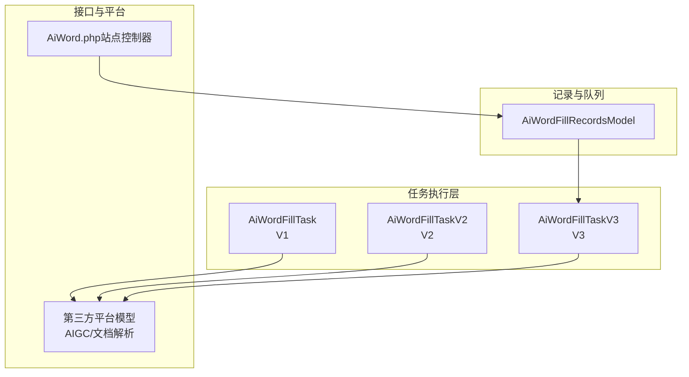
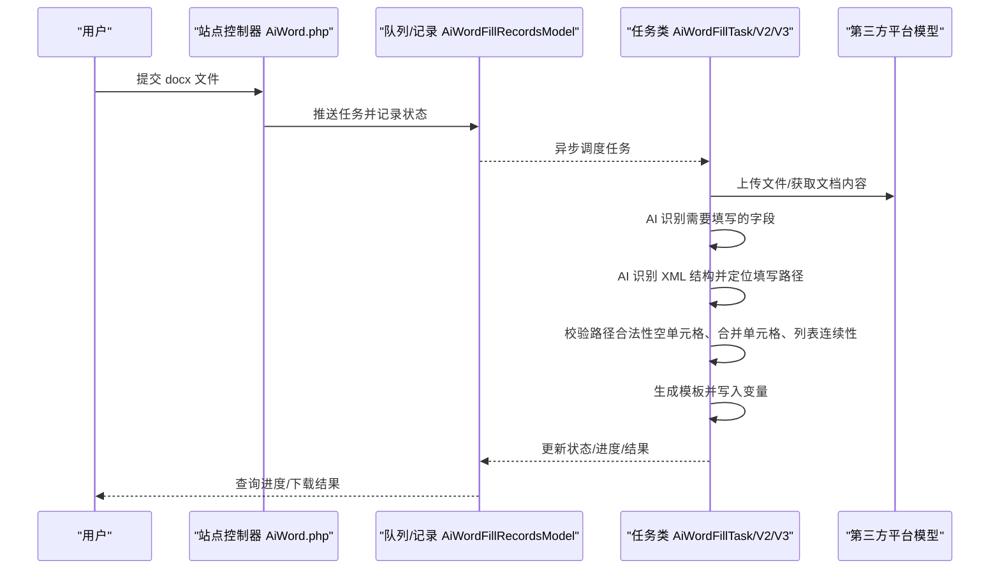
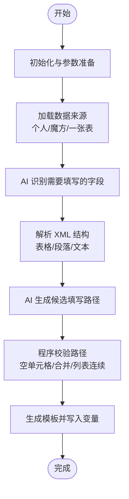
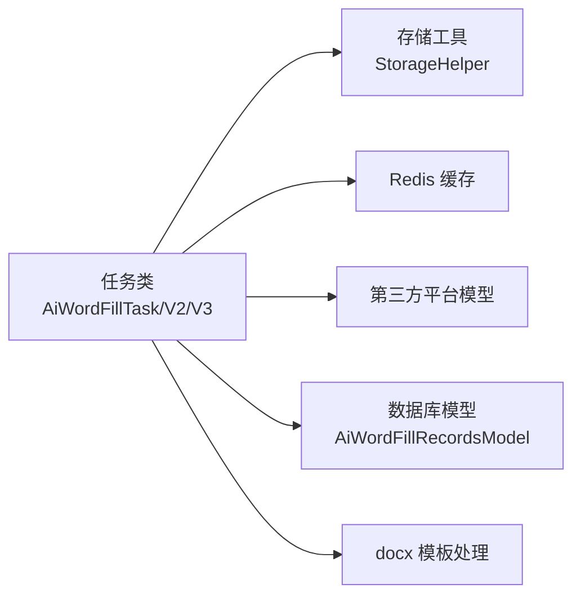

# Word文档智能填单

<cite>
**本文档引用的文件**
- [AiWordFillTask.php](file://process/src/services/task/AiWordFillTask.php)
- [AiWordFillTaskV2.php](file://process/src/services/task/AiWordFillTaskV2.php)
- [AiWordFillTaskV3.php](file://process/src/services/task/AiWordFillTaskV3.php)
- [AiWordFillRecordsModel.php](file://process/src/models/AiWordFillRecordsModel.php)
- [AiWord.php](file://process/src/http/site/AiWord.php)
</cite>

## 目录
1. [简介](#简介)
2. [项目结构](#项目结构)
3. [核心组件](#核心组件)
4. [架构总览](#架构总览)
5. [详细组件分析](#详细组件分析)
6. [依赖分析](#依赖分析)
7. [性能考量](#性能考量)
8. [故障排查指南](#故障排查指南)
9. [结论](#结论)
10. [附录](#附录)

## 简介
本文件面向 htdNew 项目的 Word 文档智能填单能力，系统性阐述从“模板解析—数据提取—智能填充—生成文档”的全流程机制，重点解析 AiWordFillTask 系列类的实现细节、演进历程与质量保障策略。文档覆盖多版本智能填单的差异、性能优化点、数据验证与质量控制、支持的文档格式、配置选项、自定义模板开发方法以及第三方文档处理服务的集成方式。

## 项目结构
围绕 Word 智能填单的关键代码位于以下模块：
- 任务执行层：AiWordFillTask/AiWordFillTaskV2/AiWordFillTaskV3
- 记录与队列：AiWordFillRecordsModel
- 前端接口：AiWord.php（站点控制器）
- 第三方平台：通过平台模型对接外部 AIGC/文档解析服务

图表来源
- [AiWordFillTask.php](file://process/src/services/task/AiWordFillTask.php#L1-L120)
- [AiWordFillTaskV2.php](file://process/src/services/task/AiWordFillTaskV2.php#L1-L120)
- [AiWordFillTaskV3.php](file://process/src/services/task/AiWordFillTaskV3.php#L1-L120)
- [AiWordFillRecordsModel.php](file://process/src/models/AiWordFillRecordsModel.php#L52-L108)
- [AiWord.php](file://process/src/http/site/AiWord.php#L363-L395)

章节来源
- [AiWordFillTask.php](file://process/src/services/task/AiWordFillTask.php#L1-L120)
- [AiWordFillTaskV2.php](file://process/src/services/task/AiWordFillTaskV2.php#L1-L120)
- [AiWordFillTaskV3.php](file://process/src/services/task/AiWordFillTaskV3.php#L1-L120)
- [AiWordFillRecordsModel.php](file://process/src/models/AiWordFillRecordsModel.php#L52-L108)
- [AiWord.php](file://process/src/http/site/AiWord.php#L363-L395)

## 核心组件
- AiWordFillTask/AiWordFillTaskV2/AiWordFillTaskV3：负责 Word 模板处理、数据提取、智能填充与最终文档生成的完整流程。
- AiWordFillRecordsModel：维护任务状态、进度与结果，支持排队、重试与取消。
- 第三方平台模型：封装上传、文档解析、结构化问答等能力，驱动 AI 辅助识别与路径定位。
- 站点控制器 AiWord.php：对外提供触发入口与进度查询接口。

章节来源
- [AiWordFillTask.php](file://process/src/services/task/AiWordFillTask.php#L1-L120)
- [AiWordFillTaskV2.php](file://process/src/services/task/AiWordFillTaskV2.php#L1-L120)
- [AiWordFillTaskV3.php](file://process/src/services/task/AiWordFillTaskV3.php#L1-L120)
- [AiWordFillRecordsModel.php](file://process/src/models/AiWordFillRecordsModel.php#L1-L47)

## 架构总览
智能填单的整体流程分为四个阶段：初始化与参数准备、AI辅助字段识别、AI辅助 XML 结构补全、模板生成与写入。V3 版本在 V2 的基础上进一步强化了字段识别、路径校验与列表数据的批量处理能力。

图表来源
- [AiWordFillRecordsModel.php](file://process/src/models/AiWordFillRecordsModel.php#L52-L108)
- [AiWordFillTask.php](file://process/src/services/task/AiWordFillTask.php#L62-L141)
- [AiWordFillTaskV2.php](file://process/src/services/task/AiWordFillTaskV2.php#L62-L141)
- [AiWordFillTaskV3.php](file://process/src/services/task/AiWordFillTaskV3.php#L62-L141)

## 详细组件分析

### AiWordFillTask 系列类（V1/V2/V3）核心机制
- 初始化与参数准备
  - 读取文件、校验扩展名为 docx、加载临时路径、读取 AI 平台文件 ID。
  - 设置环境变量（当前日期、用户姓名/工号等），并记录初始进度。
- 数据来源与字段抽取
  - 支持三种数据来源：低代码个人数据集、数据魔方、一张表；按来源拉取结构化数据。
  - 通过 AI 对文档内容进行字段识别，形成“需要填写的字段清单”。
- XML 结构解析与路径定位
  - 解压 docx，读取 document.xml，使用 XPath 提取表格/段落/文本层级结构，生成简化路径。
  - 通过 AI 对比“需要填写的字段”与 XML 结构，输出候选填写路径。
- 路径校验与模板生成
  - 校验候选路径是否为空单元格、是否跨越列表记录、是否命中合并单元格等。
  - 将变量写入模板（普通字段与列表字段分别处理），生成最终 docx。
- 进度与状态管理
  - 通过 Redis 缓存与数据库记录实时反馈进度与状态，支持取消与重试。

图表来源
- [AiWordFillTask.php](file://process/src/services/task/AiWordFillTask.php#L62-L141)
- [AiWordFillTaskV2.php](file://process/src/services/task/AiWordFillTaskV2.php#L62-L141)
- [AiWordFillTaskV3.php](file://process/src/services/task/AiWordFillTaskV3.php#L62-L141)

章节来源
- [AiWordFillTask.php](file://process/src/services/task/AiWordFillTask.php#L62-L141)
- [AiWordFillTaskV2.php](file://process/src/services/task/AiWordFillTaskV2.php#L62-L141)
- [AiWordFillTaskV3.php](file://process/src/services/task/AiWordFillTaskV3.php#L62-L141)

### 多版本演进与性能改进
- V1（AiWordFillTask）
  - 采用流式问答与分页处理，逐步抽取字段与路径；路径校验较为基础。
  - 适合通用场景，但对复杂列表与合并单元格的处理较弱。
- V2（AiWordFillTaskV2）
  - 明确区分“普通字段”与“列表字段”，分别进行路径定位与校验。
  - 引入段落级 XML 结构解析，提升多处填写一致性。
  - 列表字段支持表头定位与连续性校验，减少人工修正成本。
- V3（AiWordFillTaskV3）
  - 强化字段识别与路径校验：对列表字段自动推导最大宽度、校正单一文本单元格写入位置。
  - 引入“重复字段整合”逻辑，避免重复数据导致的错位。
  - 对“时间字段识别与倒序排序”进行强约束，确保列表数据的时序正确性。
  - 优化分页与并发：按字段/列表分块处理，降低单次请求压力。
  - 性能优化点：减少不必要的 DOM/XPath 遍历次数，缓存中间结构，避免重复解析。

章节来源
- [AiWordFillTask.php](file://process/src/services/task/AiWordFillTask.php#L858-L1141)
- [AiWordFillTaskV2.php](file://process/src/services/task/AiWordFillTaskV2.php#L870-L1314)
- [AiWordFillTaskV3.php](file://process/src/services/task/AiWordFillTaskV3.php#L996-L1476)

### 数据提取与字段映射
- 数据来源
  - 低代码个人数据集：按用户维度拉取基本信息与列表数据，字段含义映射为中文。
  - 数据魔方/一张表：从第三方平台获取结构化数据，字段名替换为中文含义。
- 字段映射
  - 通过 AI 对“文档字段”与“数据表字段”进行语义匹配，输出“字段类型（文本/列表）+ 填写路径 + 变量引用”。
  - 列表字段支持“表头路径 + 多行连续写入”，并自动计算行号。

章节来源
- [AiWordFillTask.php](file://process/src/services/task/AiWordFillTask.php#L220-L358)
- [AiWordFillTaskV2.php](file://process/src/services/task/AiWordFillTaskV2.php#L272-L413)
- [AiWordFillTaskV3.php](file://process/src/services/task/AiWordFillTaskV3.php#L262-L443)

### 智能填充算法与路径校验
- 路径生成
  - 通过 AI 将“需要填写的字段”与 XML 结构进行语义对齐，输出候选路径。
- 路径校验
  - 空单元格校验：仅允许向空单元格写入（序号字段除外）。
  - 合并单元格处理：跳过合并区域，避免破坏结构。
  - 列表连续性：确保列表记录按序连续写入，不跨行拆分。
  - 单一文本单元格优化：在多列场景下，将变量写入“内容最多的一列”，提升可读性。
- 变量写入
  - 普通字段：直接替换占位变量。
  - 列表字段：按记录数复制路径，逐行写入对应字段。

章节来源
- [AiWordFillTask.php](file://process/src/services/task/AiWordFillTask.php#L1039-L1141)
- [AiWordFillTaskV2.php](file://process/src/services/task/AiWordFillTaskV2.php#L1213-L1314)
- [AiWordFillTaskV3.php](file://process/src/services/task/AiWordFillTaskV3.php#L1347-L1476)

### 文档生成与输出
- 模板生成
  - 解压 docx，读取 document.xml，构建替换映射（普通字段与列表字段）。
  - 使用 XMLReader/XMLWriter 流式写回，避免一次性加载大文件导致内存峰值。
- 输出结果
  - 生成新的 docx 文件，返回文件 token 供下载与后续处理。

章节来源
- [AiWordFillTask.php](file://process/src/services/task/AiWordFillTask.php#L1271-L1355)
- [AiWordFillTaskV2.php](file://process/src/services/task/AiWordFillTaskV2.php#L1490-L1510)
- [AiWordFillTaskV3.php](file://process/src/services/task/AiWordFillTaskV3.php#L1500-L1520)

### 进度与状态管理
- 任务记录
  - 记录任务状态（排队/进行中/成功/失败/取消）、进度百分比与中间结果。
- 队列与排队
  - 使用 Redis ZSET 维护排队序列，支持查询排队位置与清理超时任务。
- 取消机制
  - 通过 Redis 键检测用户取消信号，及时终止任务。

章节来源
- [AiWordFillRecordsModel.php](file://process/src/models/AiWordFillRecordsModel.php#L1-L47)
- [AiWordFillRecordsModel.php](file://process/src/models/AiWordFillRecordsModel.php#L110-L154)
- [AiWordFillTask.php](file://process/src/services/task/AiWordFillTask.php#L156-L166)
- [AiWordFillTaskV2.php](file://process/src/services/task/AiWordFillTaskV2.php#L156-L166)
- [AiWordFillTaskV3.php](file://process/src/services/task/AiWordFillTaskV3.php#L156-L166)

## 依赖分析
- 组件耦合
  - 任务类依赖第三方平台模型进行文件上传与文档解析；依赖存储工具获取临时文件路径；依赖 Redis 缓存进度与取消标记。
- 外部依赖
  - 第三方 AIGC 平台：提供上传、文档解析、结构化问答能力。
  - PHPWord 模板处理器：用于 docx 的读取与写回（在部分实现中使用 XMLReader/XMLWriter 替代以提升性能）。
- 循环依赖
  - 未见循环依赖迹象；任务类与模型间为单向调用。

图表来源
- [AiWordFillTask.php](file://process/src/services/task/AiWordFillTask.php#L1-L120)
- [AiWordFillTaskV2.php](file://process/src/services/task/AiWordFillTaskV2.php#L1-L120)
- [AiWordFillTaskV3.php](file://process/src/services/task/AiWordFillTaskV3.php#L1-L120)
- [AiWordFillRecordsModel.php](file://process/src/models/AiWordFillRecordsModel.php#L1-L47)

章节来源
- [AiWordFillTask.php](file://process/src/services/task/AiWordFillTask.php#L1-L120)
- [AiWordFillTaskV2.php](file://process/src/services/task/AiWordFillTaskV2.php#L1-L120)
- [AiWordFillTaskV3.php](file://process/src/services/task/AiWordFillTaskV3.php#L1-L120)
- [AiWordFillRecordsModel.php](file://process/src/models/AiWordFillRecordsModel.php#L1-L47)

## 性能考量
- I/O 与内存
  - 使用 ZipArchive 与 XMLReader/XMLWriter 流式处理，避免一次性加载整个 docx，降低内存峰值。
- 分页与并发
  - 对字段与列表数据进行分块处理，减少单次 AI 请求体量，提升吞吐。
- 路径校验优化
  - 通过预过滤（空行/合并单元格）与缓存中间结构，减少重复遍历。
- 并发与队列
  - 使用队列异步执行，Redis 维护排队序列，避免阻塞前端请求。

章节来源
- [AiWordFillTask.php](file://process/src/services/task/AiWordFillTask.php#L888-L1037)
- [AiWordFillTaskV2.php](file://process/src/services/task/AiWordFillTaskV2.php#L903-L1100)
- [AiWordFillTaskV3.php](file://process/src/services/task/AiWordFillTaskV3.php#L1025-L1100)
- [AiWordFillRecordsModel.php](file://process/src/models/AiWordFillRecordsModel.php#L110-L154)

## 故障排查指南
- 常见错误与处理
  - 文件类型错误：仅支持 docx，若扩展名不符将抛出异常。
  - AI 平台文件 ID 缺失：上传至 AI 平台失败时需重新上传。
  - 未识别到字段/路径：检查文档结构与字段清单，必要时调整提示词或扩大数据来源范围。
  - 路径冲突/非空单元格：确保目标单元格为空或为序号字段；合并单元格会被跳过。
- 进度查询与取消
  - 通过 Redis 缓存键查看进度；若用户取消，任务会在下次检查点退出。
- 日志与结果
  - 任务状态与结果持久化至数据库，便于问题追溯与重试。

章节来源
- [AiWordFillTask.php](file://process/src/services/task/AiWordFillTask.php#L72-L77)
- [AiWordFillTaskV2.php](file://process/src/services/task/AiWordFillTaskV2.php#L72-L77)
- [AiWordFillTaskV3.php](file://process/src/services/task/AiWordFillTaskV3.php#L72-L77)
- [AiWordFillRecordsModel.php](file://process/src/models/AiWordFillRecordsModel.php#L1-L47)

## 结论
AiWordFillTask 系列通过“AI 识别 + 结构化解析 + 程序校验 + 流式写入”的闭环，实现了高可靠、高性能的 Word 智能填单能力。V3 在字段识别、路径校验与列表处理方面进行了系统性增强，显著提升了填单质量与用户体验。配合完善的进度与状态管理、队列与取消机制，整体方案具备良好的可运维性与扩展性。

## 附录

### 文档格式支持
- 支持格式：docx（基于 Open XML 的 Word 文档）
- 不支持格式：xls/xlsx、ppt/pptx 等非文本结构化文档

章节来源
- [AiWordFillTask.php](file://process/src/services/task/AiWordFillTask.php#L72-L77)
- [AiWordFillTaskV2.php](file://process/src/services/task/AiWordFillTaskV2.php#L72-L77)
- [AiWordFillTaskV3.php](file://process/src/services/task/AiWordFillTaskV3.php#L72-L77)

### 数据验证与质量控制
- 字段类型校验：严格区分“文本字段”与“列表字段”，避免混用。
- 路径合法性：仅允许写入空单元格（序号字段除外），禁止跨行与拆分记录。
- 列表连续性：确保列表记录连续写入，避免破坏表格结构。
- 合并单元格：自动跳过合并区域，防止覆盖。
- 单元格内容优化：在多列场景下，将变量写入内容最多的单元格，提升可读性。

章节来源
- [AiWordFillTask.php](file://process/src/services/task/AiWordFillTask.php#L1039-L1141)
- [AiWordFillTaskV2.php](file://process/src/services/task/AiWordFillTaskV2.php#L1213-L1314)
- [AiWordFillTaskV3.php](file://process/src/services/task/AiWordFillTaskV3.php#L1347-L1476)

### 配置选项与自定义模板开发
- 配置项
  - AI 模型名称：用于指定问答模型。
  - 数据来源：可切换为“低代码个人数据集/数据魔方/一张表”。
  - 环境变量：当前年份/月份/日/日期、用户姓名/工号等。
- 自定义模板开发
  - 在模板中使用占位变量（如 ${user_field##姓名}、${user_list##论文##0##论文名称}）。
  - 列表字段建议在表头处预留“占位行”，以便 AI 正确定位起始写入行。
  - 避免在模板中使用合并单元格作为数据写入目标，或确保其为序号字段。

章节来源
- [AiWordFillTask.php](file://process/src/services/task/AiWordFillTask.php#L82-L111)
- [AiWordFillTaskV2.php](file://process/src/services/task/AiWordFillTaskV2.php#L82-L111)
- [AiWordFillTaskV3.php](file://process/src/services/task/AiWordFillTaskV3.php#L82-L111)

### 第三方文档处理服务集成指南
- 集成要点
  - 通过第三方平台模型封装上传、文档解析与结构化问答接口。
  - 任务类仅负责编排流程与参数组织，不直接依赖具体平台实现。
- 常见平台适配
  - 上传接口：接收本地临时文件路径与文件名。
  - 文档解析：返回简化后的 XML 结构或纯文本内容。
  - 结构化问答：按固定提示词格式返回 JSON 结果。

章节来源
- [AiWordFillTask.php](file://process/src/services/task/AiWordFillTask.php#L205-L219)
- [AiWordFillTaskV2.php](file://process/src/services/task/AiWordFillTaskV2.php#L205-L219)
- [AiWordFillTaskV3.php](file://process/src/services/task/AiWordFillTaskV3.php#L205-L219)