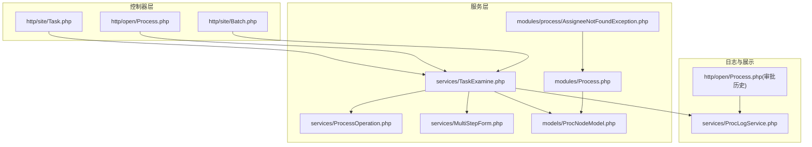
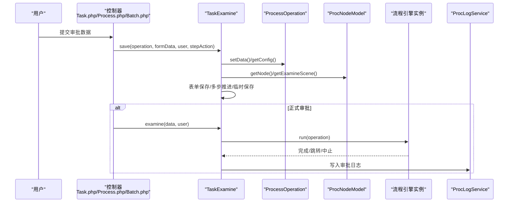
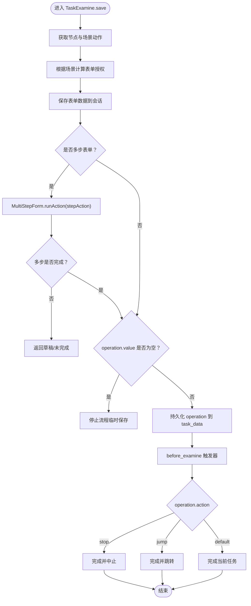
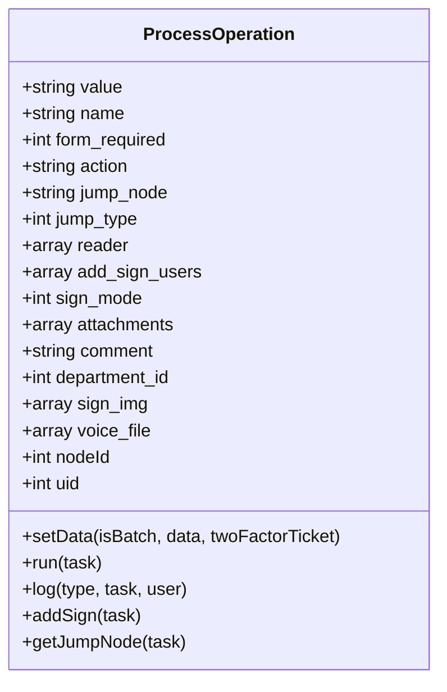
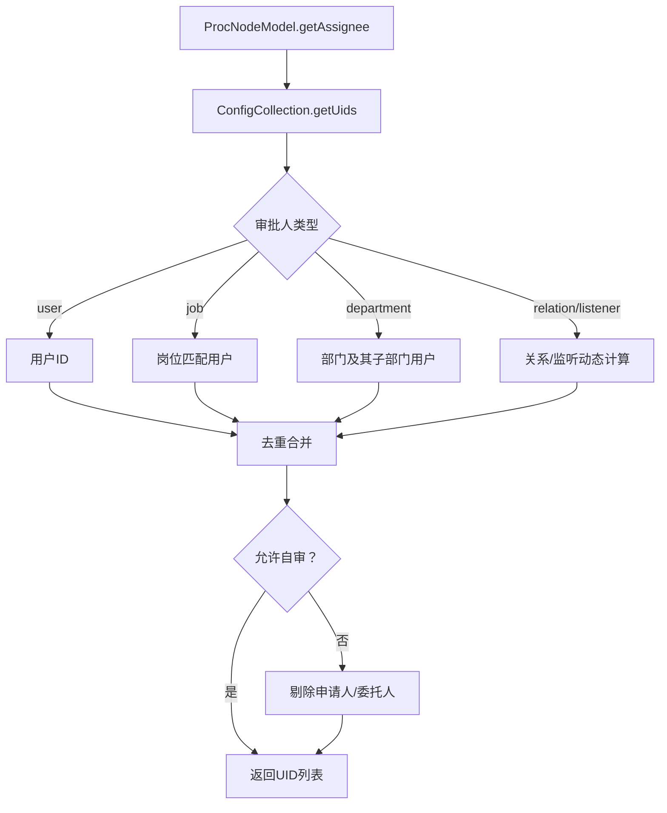
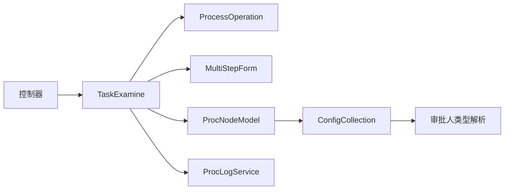

# 人工审批

<cite>
**本文引用的文件**
- [TaskExamine.php](file://process/src/services/TaskExamine.php)
- [ProcessOperation.php](file://process/src/services/ProcessOperation.php)
- [MultiStepForm.php](file://process/src/services/MultiStepForm.php)
- [ProcNodeModel.php](file://process/src/models/ProcNodeModel.php)
- [Process.php](file://process/src/modules/process/AssigneeNotFoundException.php)
- [Process.php](file://process/src/modules/Process.php)
- [Task.php](file://process/src/http/site/Task.php)
- [Process.php](file://process/src/http/open/Process.php)
- [Batch.php](file://process/src/http/site/Batch.php)
- [ProcLogService.php](file://process/src/services/ProcLogService.php)
- [AppCommonApprovalDataSource.php](file://process_envs/buaa/product/task/AppCommonApprovalDataSource.php)
</cite>

## 目录
1. [简介](#简介)
2. [项目结构](#项目结构)
3. [核心组件](#核心组件)
4. [架构总览](#架构总览)
5. [详细组件分析](#详细组件分析)
6. [依赖分析](#依赖分析)
7. [性能考量](#性能考量)
8. [故障排查指南](#故障排查指南)
9. [结论](#结论)
10. [附录](#附录)

## 简介
本文件面向 htdNew 项目的人工审批能力，系统性梳理从“表单保存、审批操作处理、审批人分配、审批历史记录”到“多步表单、批量审批、加签”的全流程实现与扩展点。重点围绕 TaskExamine 类的人工审批实现机制，阐述审批操作的创建、表单数据验证、审批状态更新与流程推进；同时覆盖权限校验、审批人选择算法、异常处理、配置项与性能优化建议，并给出扩展开发指引。

## 项目结构
人工审批涉及的关键模块与文件分布如下：
- 服务层
  - 审批主流程：TaskExamine
  - 审批操作封装：ProcessOperation
  - 多步表单控制：MultiStepForm
  - 审批人配置解析与选择：ProcNodeModel、assignee 配置集合
- 控制器层
  - 单任务审批入口：http/site/Task.php
  - 打开接口审批入口：http/open/Process.php
  - 批量审批入口：http/site/Batch.php
- 日志与展示
  - 审批历史列表与评论：services/ProcLogService.php
  - 审批历史开放接口：http/open/Process.php
- 异常与规则
  - 审批人缺失异常：modules/process/AssigneeNotFoundException.php
  - 审批人选择限制：modules/Process.php

图表来源
- [Task.php](file://process/src/http/site/Task.php#L144-L174)
- [Process.php](file://process/src/http/open/Process.php#L166-L192)
- [Batch.php](file://process/src/http/site/Batch.php#L357-L384)
- [TaskExamine.php](file://process/src/services/TaskExamine.php#L53-L142)
- [ProcessOperation.php](file://process/src/services/ProcessOperation.php#L232-L304)
- [MultiStepForm.php](file://process/src/services/MultiStepForm.php#L28-L90)
- [ProcNodeModel.php](file://process/src/models/ProcNodeModel.php#L161-L178)
- [Process.php](file://process/src/modules/process/AssigneeNotFoundException.php#L1-L24)
- [Process.php](file://process/src/modules/Process.php#L134-L155)
- [ProcLogService.php](file://process/src/services/ProcLogService.php#L294-L408)
- [Process.php](file://process/src/http/open/Process.php#L380-L412)

章节来源
- [Task.php](file://process/src/http/site/Task.php#L144-L174)
- [Process.php](file://process/src/http/open/Process.php#L166-L192)
- [Batch.php](file://process/src/http/site/Batch.php#L357-L384)

## 核心组件
- TaskExamine：封装人工审批的保存、校验、推进与历史记录，负责多步表单推进、临时保存、委托审批、加签等。
- ProcessOperation：封装审批操作的元数据与行为（默认/跳转/中止）、日志记录、加签执行、变量注入等。
- MultiStepForm：多步表单的步骤推进、上一步/下一步、草稿保存、完成判定。
- ProcNodeModel：节点配置访问、审批人配置对象获取、节点场景动作解析。
- modules/Process：审批人选择限制与上下文记录（如会签/顺序会签）。
- http/site/Task.php：单任务审批入口，组装 Operation 并调用 TaskExamine.save/examine。
- http/open/Process.php：开放接口审批入口与审批历史列表。
- http/site/Batch.php：批量审批入口，Excel 导入审批动作、跳转节点、意见与部门编码。
- services/ProcLogService.php：审批历史列表格式化、评论可见范围控制、加签/回执等日志聚合。

章节来源
- [TaskExamine.php](file://process/src/services/TaskExamine.php#L53-L142)
- [ProcessOperation.php](file://process/src/services/ProcessOperation.php#L108-L158)
- [MultiStepForm.php](file://process/src/services/MultiStepForm.php#L28-L90)
- [ProcNodeModel.php](file://process/src/models/ProcNodeModel.php#L161-L178)
- [Process.php](file://process/src/modules/Process.php#L134-L155)
- [Task.php](file://process/src/http/site/Task.php#L144-L174)
- [Process.php](file://process/src/http/open/Process.php#L380-L412)
- [Batch.php](file://process/src/http/site/Batch.php#L1169-L1812)
- [ProcLogService.php](file://process/src/services/ProcLogService.php#L294-L408)

## 架构总览
人工审批从“用户提交审批数据”开始，经过“表单保存与校验、审批操作构建、审批人分配、流程推进与日志记录”，最终形成“审批历史与后续任务”。

图表来源
- [Task.php](file://process/src/http/site/Task.php#L144-L174)
- [TaskExamine.php](file://process/src/services/TaskExamine.php#L53-L142)
- [ProcessOperation.php](file://process/src/services/ProcessOperation.php#L232-L304)
- [ProcNodeModel.php](file://process/src/models/ProcNodeModel.php#L161-L178)
- [ProcLogService.php](file://process/src/services/ProcLogService.php#L294-L408)

## 详细组件分析

### TaskExamine：人工审批主流程
- 表单保存与多步推进
  - 依据节点场景动作与表单授权，按需取消表单必填，保存各表单数据至会话；多步表单通过 MultiStepForm 推进步骤并标记完成状态。
- 审批操作持久化
  - 将 operation 序列化写入 task_data，设置 agent_uid（若存在），更新 TaskHistoryModel。
- 审批前置/后置触发器
  - 在动作前触发器幂等前提下，设置变量并派发 before_examine 触发事件；动作后派发 after_examine 触发事件。
- 终止/跳转/默认推进
  - 根据 operation.action 分支：ACTION_STOP 中止流程并通知；ACTION_JUMP 完成并跳转到目标节点；默认完成当前任务。
- 加签与知会
  - 支持加签并行/后续模式，记录加签人员与位置；支持知会人员添加。
- 临时保存与草稿
  - 生成临时操作，仅保存表单数据，不推进流程。
- 批量审批支持
  - 批量场景下对“手写签批”控件进行追加合并，避免覆盖。

图表来源
- [TaskExamine.php](file://process/src/services/TaskExamine.php#L53-L142)
- [MultiStepForm.php](file://process/src/services/MultiStepForm.php#L28-L90)
- [ProcessOperation.php](file://process/src/services/ProcessOperation.php#L232-L304)

章节来源
- [TaskExamine.php](file://process/src/services/TaskExamine.php#L53-L142)
- [TaskExamine.php](file://process/src/services/TaskExamine.php#L144-L211)
- [TaskExamine.php](file://process/src/services/TaskExamine.php#L218-L266)

### ProcessOperation：审批操作封装
- 数据绑定与校验
  - 从节点配置加载操作配置，校验“审批意见必填”“二次验证”“跳转节点合法性”等。
- 变量接口
  - 支持变量表达式解析（如 currproc.assignee、department 等）。
- 执行与日志
  - run() 根据 action 完成任务、跳转或中止，并写入 ProcLogModel；支持加签并行/后续模式。
- 附加能力
  - 知会人员添加、手写签批图片/语音文件、加签人员列表等。

图表来源
- [ProcessOperation.php](file://process/src/services/ProcessOperation.php#L108-L158)
- [ProcessOperation.php](file://process/src/services/ProcessOperation.php#L232-L304)
- [ProcessOperation.php](file://process/src/services/ProcessOperation.php#L337-L375)

章节来源
- [ProcessOperation.php](file://process/src/services/ProcessOperation.php#L108-L158)
- [ProcessOperation.php](file://process/src/services/ProcessOperation.php#L232-L304)
- [ProcessOperation.php](file://process/src/services/ProcessOperation.php#L337-L375)

### MultiStepForm：多步表单处理
- 步骤推进
  - STEP_ACTION_NEXT/STEP_ACTION_PREV/STEP_ACTION_DRAFT；当到达最后一步时标记 finished。
- 条件渲染
  - 基于上下文表达式评估，决定某步包含哪些表单。
- 草稿与完成
  - 草稿不推进步骤；完成后更新 task.step 并标记 finished。

章节来源
- [MultiStepForm.php](file://process/src/services/MultiStepForm.php#L28-L90)
- [MultiStepForm.php](file://process/src/services/MultiStepForm.php#L92-L124)

### 审批人分配与权限校验
- 审批人选择算法
  - ProcNodeModel.getAssignee() 通过 ConfigCollection 解析多种审批人类型（岗位、部门、用户、关系监听等），去重合并；支持禁止自审配置。
- 选择限制与上下文
  - modules/Process 对会签/顺序会签场景记录选择的审批人；对最小/最大人数限制进行校验。
- 异常处理
  - AssigneeNotFoundException 在无法找到审批人时抛出，返回友好提示。

图表来源
- [ProcNodeModel.php](file://process/src/models/ProcNodeModel.php#L161-L178)
- [Process.php](file://process/src/modules/Process.php#L134-L155)
- [Process.php](file://process/src/modules/process/AssigneeNotFoundException.php#L1-L24)

章节来源
- [ProcNodeModel.php](file://process/src/models/ProcNodeModel.php#L161-L178)
- [Process.php](file://process/src/modules/Process.php#L134-L155)
- [Process.php](file://process/src/modules/process/AssigneeNotFoundException.php#L1-L24)

### 批量审批与加签
- 批量审批
  - Excel 导入审批动作、跳转节点、意见与部门编码；校验动作名称与跳转节点有效性；对“手写签批”控件进行追加合并。
- 加签
  - 支持并行/后续两种模式；记录加签人员与位置，必要时向流程实例追加实例；在日志中区分加签类型。

章节来源
- [Batch.php](file://process/src/http/site/Batch.php#L357-L384)
- [Batch.php](file://process/src/http/site/Batch.php#L1169-L1812)
- [ProcessOperation.php](file://process/src/services/ProcessOperation.php#L337-L375)

### 审批历史记录与展示
- 历史列表
  - ProcLogService.format/logsListFormatV2 输出审批历史，支持排序、加签/回执映射、评论可见范围控制。
- 开放接口
  - http/open/Process.php 提供审批历史列表与倒序开关。

章节来源
- [ProcLogService.php](file://process/src/services/ProcLogService.php#L294-L408)
- [Process.php](file://process/src/http/open/Process.php#L380-L412)

## 依赖分析
- 组件耦合
  - TaskExamine 依赖 ProcessOperation、MultiStepForm、ProcNodeModel、TaskHistoryModel、TriggerModel 等；与流程引擎交互通过 ProcNodeModel.getAssigneeObjects 与流程实例。
- 关键依赖链
  - 控制器 → TaskExamine → ProcessOperation/ProcNodeModel → 流程引擎 → 日志与通知。
- 外部集成
  - 批量审批通过 Excel 导入；审批历史通过 ProcLogService 聚合；加签通过 NodeAddSignUsersModel 记录。

图表来源
- [TaskExamine.php](file://process/src/services/TaskExamine.php#L53-L142)
- [ProcessOperation.php](file://process/src/services/ProcessOperation.php#L232-L304)
- [MultiStepForm.php](file://process/src/services/MultiStepForm.php#L28-L90)
- [ProcNodeModel.php](file://process/src/models/ProcNodeModel.php#L161-L178)

章节来源
- [TaskExamine.php](file://process/src/services/TaskExamine.php#L53-L142)
- [ProcessOperation.php](file://process/src/services/ProcessOperation.php#L232-L304)
- [MultiStepForm.php](file://process/src/services/MultiStepForm.php#L28-L90)
- [ProcNodeModel.php](file://process/src/models/ProcNodeModel.php#L161-L178)

## 性能考量
- 多步表单
  - 使用步骤级表单 ID 缓存，减少重复计算；仅在必要时推进步骤。
- 审批人解析
  - ConfigCollection.getUids 去重合并；静态解析路径（如 depart/job/team）可直接查询数据库，减少上下文依赖。
- 日志与评论
  - ProcLogService 对评论可见范围进行条件过滤，避免不必要的数据传输。
- 批量审批
  - Excel 导入采用分批处理与错误收集，避免单次事务过大；对“手写签批”控件采用追加合并，降低写冲突。

[本节为通用指导，无需列出具体文件来源]

## 故障排查指南
- “无法找到审批人”
  - 检查节点审批人配置类型与值是否有效；确认 ConfigCollection 是否支持该类型；查看 AssigneeNotFoundException 的响应信息。
- “审批人数量不合法”
  - 检查节点 show_assignee 的 min/max 配置；确认 modules/Process 的选择限制逻辑。
- “跳转节点无效”
  - 校验 ProcessOperation.setData 中 jump_nodes 配置与传入 jump_node 是否一致。
- “二次验证失败”
  - 确认 isBatch 场景不允许二次验证；检查 twoFactorTicket 是否有效且在事务成功后清理。
- “批量审批意见/动作错误”
  - 检查 Batch.php 的 Excel 列定义与错误收集逻辑；核对 opnameToValue 映射与节点动作配置。

章节来源
- [Process.php](file://process/src/modules/process/AssigneeNotFoundException.php#L1-L24)
- [Process.php](file://process/src/modules/Process.php#L134-L155)
- [ProcessOperation.php](file://process/src/services/ProcessOperation.php#L108-L158)
- [Batch.php](file://process/src/http/site/Batch.php#L1169-L1812)

## 结论
TaskExamine 将“表单保存、审批操作、审批人分配、流程推进、历史记录”整合为统一的人工审批主流程；配合 ProcessOperation 的操作封装、MultiStepForm 的多步控制、ProcNodeModel 的审批人解析与 modules/Process 的选择限制，构成完整的审批闭环。通过批量审批与加签扩展，满足复杂组织场景下的审批需求。建议在生产环境中关注日志与评论可见性、审批人配置与二次验证策略，以提升稳定性与合规性。

[本节为总结性内容，无需列出具体文件来源]

## 附录

### 人工审批配置选项（节点侧）
- 审批人配置
  - 支持 user、job、department、team/tag、relation_job、relation_user、listener、form 等类型；可通过 ProcNodeModel.config.assignee 配置。
- 自审开关
  - allow_self_examine 控制是否允许自审。
- 会签/顺序会签
  - 通过节点配置与 modules/Process 的上下文记录，控制审批人选择与任务创建顺序。
- 多步表单
  - steps 配置每步包含的表单与条件表达式；MultiStepForm 根据上下文评估并推进。
- 批量审批
  - 通过 http/site/Batch.php 导入 Excel，支持动作、跳转节点、意见与部门编码；对“手写签批”控件追加合并。

章节来源
- [ProcNodeModel.php](file://process/src/models/ProcNodeModel.php#L161-L178)
- [Process.php](file://process/src/modules/Process.php#L134-L155)
- [MultiStepForm.php](file://process/src/services/MultiStepForm.php#L28-L90)
- [Batch.php](file://process/src/http/site/Batch.php#L357-L384)

### 扩展开发指南
- 新增审批人类型
  - 在 services/assignee 下新增类型类，继承 AbstractConfig 并实现 getUids/allowSetBatchAssignee/getBatchAssignee。
- 新增审批动作
  - 在 ProcNodeModel 的节点配置中新增操作 value 与 action/jump_nodes/comment 等字段；确保 ProcessOperation.getConfig 能解析。
- 新增审批前置/后置触发器
  - 在 TriggerModel 的事件命名空间下注册 before_examine/after_examine 或节点级事件，TaskExamine 会在相应阶段派发。
- 批量审批扩展
  - 在 Batch.php 增加新的 Excel 列与校验逻辑；在 TaskExamine.appendHandSign 中处理新控件追加。

章节来源
- [TaskExamine.php](file://process/src/services/TaskExamine.php#L144-L211)
- [ProcessOperation.php](file://process/src/services/ProcessOperation.php#L232-L304)
- [Batch.php](file://process/src/http/site/Batch.php#L1169-L1812)