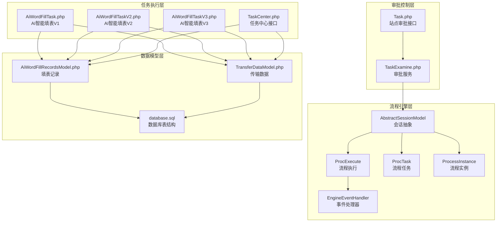
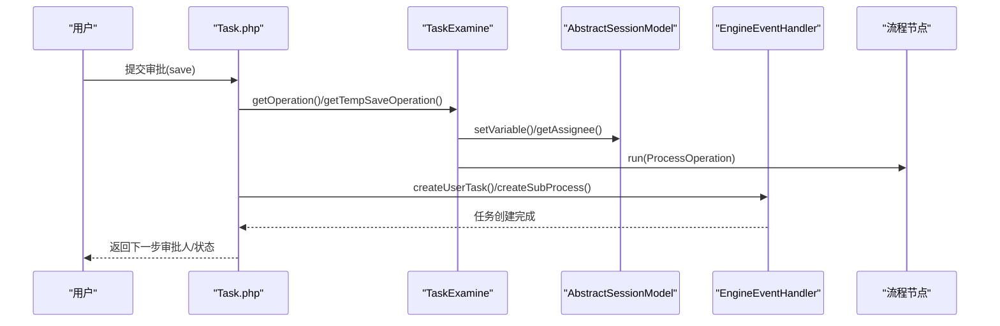
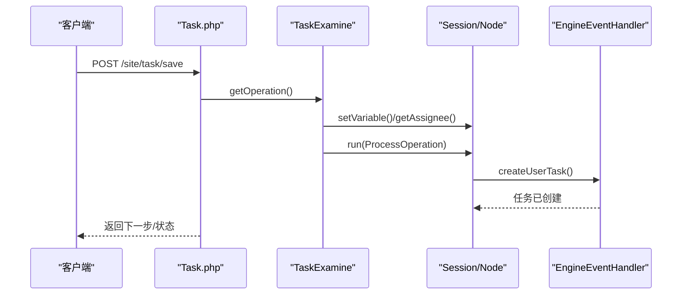
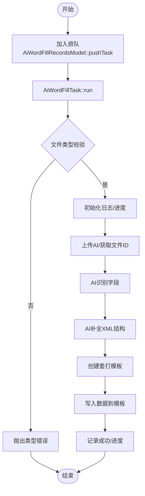
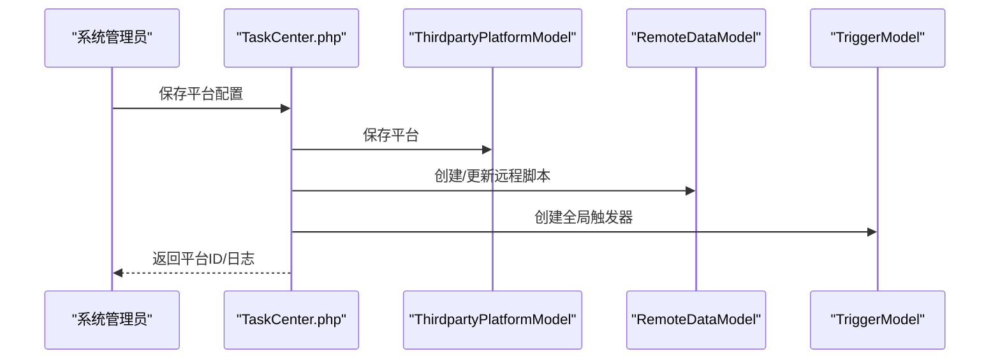
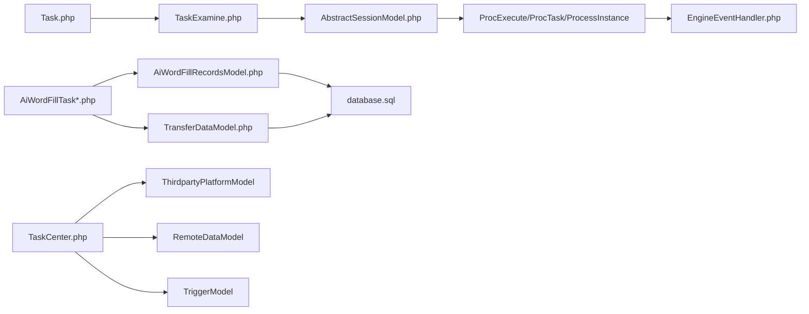

# 任务审批服务

<cite>
**本文引用的文件**
- [AiWordFillTask.php](file://process/src/services/task/AiWordFillTask.php)
- [AiWordFillTaskV2.php](file://process/src/services/task/AiWordFillTaskV2.php)
- [AiWordFillTaskV3.php](file://process/src/services/task/AiWordFillTaskV3.php)
- [AiWordFillRecordsModel.php](file://process/src/models/AiWordFillRecordsModel.php)
- [TransferDataModel.php](file://process/src/models/TransferDataModel.php)
- [Task.php](file://process/src/http/site/Task.php)
- [TaskExamine.php](file://process/src/services/TaskExamine.php)
- [TaskCenter.php](file://process/src/http/system/TaskCenter.php)
- [ProcExecute.php](file://process/src/engine/ProcExecute.php)
- [ProcTask.php](file://process/src/engine/ProcTask.php)
- [ProcessInstance.php](file://process/src/engine/ProcessInstance.php)
- [AbstractSessionModel.php](file://process/src/models/AbstractSessionModel.php)
- [EngineEventHandler.php](file://process/src/modules/process/EngineEventHandler.php)
- [database.sql](file://process/docs/sql/database.sql)
- [api.php](file://process/src/config/api.php)
- [permits.php](file://process/src/config/permits.php)
- [OpenController.php](file://process/src/http/OpenController.php)
</cite>

## 目录
1. [引言](#引言)
2. [项目结构](#项目结构)
3. [核心组件](#核心组件)
4. [架构总览](#架构总览)
5. [详细组件分析](#详细组件分析)
6. [依赖关系分析](#依赖关系分析)
7. [性能考量](#性能考量)
8. [故障排查指南](#故障排查指南)
9. [结论](#结论)
10. [附录](#附录)

## 引言
本文件面向 htdNew 项目的任务审批服务，系统性梳理人工审批、AI 自动审批、Word 文档智能填充以及用户审批任务管理的实现与扩展。文档覆盖审批流程设计、规则配置、状态管理、接口定义、参数传递与异常处理机制，并提供性能优化建议与扩展开发指南，帮助开发者快速理解与迭代该能力。

## 项目结构
任务审批服务由“流程引擎层”“审批控制层”“任务执行层”“数据模型层”“第三方平台对接层”构成，围绕流程会话（Session）、任务（Task）、审批操作（Operation）与外部平台（如 AI 助手、任务中心）协同工作。

图示来源
- [ProcExecute.php](file://process/src/engine/ProcExecute.php#L1-L11)
- [ProcTask.php](file://process/src/engine/ProcTask.php#L1-L11)
- [ProcessInstance.php](file://process/src/engine/ProcessInstance.php#L1-L11)
- [AbstractSessionModel.php](file://process/src/models/AbstractSessionModel.php#L42-L72)
- [EngineEventHandler.php](file://process/src/modules/process/EngineEventHandler.php#L82-L121)
- [Task.php](file://process/src/http/site/Task.php#L111-L205)
- [TaskExamine.php](file://process/src/services/TaskExamine.php#L53-L143)
- [AiWordFillTask.php](file://process/src/services/task/AiWordFillTask.php#L62-L154)
- [AiWordFillTaskV2.php](file://process/src/services/task/AiWordFillTaskV2.php#L62-L154)
- [AiWordFillTaskV3.php](file://process/src/services/task/AiWordFillTaskV3.php#L62-L154)
- [AiWordFillRecordsModel.php](file://process/src/models/AiWordFillRecordsModel.php#L52-L108)
- [TransferDataModel.php](file://process/src/models/TransferDataModel.php#L1-L75)
- [database.sql](file://process/docs/sql/database.sql#L172-L310)

章节来源
- [ProcExecute.php](file://process/src/engine/ProcExecute.php#L1-L11)
- [ProcTask.php](file://process/src/engine/ProcTask.php#L1-L11)
- [ProcessInstance.php](file://process/src/engine/ProcessInstance.php#L1-L11)
- [AbstractSessionModel.php](file://process/src/models/AbstractSessionModel.php#L42-L72)
- [EngineEventHandler.php](file://process/src/modules/process/EngineEventHandler.php#L82-L121)
- [Task.php](file://process/src/http/site/Task.php#L111-L205)
- [TaskExamine.php](file://process/src/services/TaskExamine.php#L53-L143)
- [AiWordFillTask.php](file://process/src/services/task/AiWordFillTask.php#L62-L154)
- [AiWordFillTaskV2.php](file://process/src/services/task/AiWordFillTaskV2.php#L62-L154)
- [AiWordFillTaskV3.php](file://process/src/services/task/AiWordFillTaskV3.php#L62-L154)
- [AiWordFillRecordsModel.php](file://process/src/models/AiWordFillRecordsModel.php#L52-L108)
- [TransferDataModel.php](file://process/src/models/TransferDataModel.php#L1-L75)
- [database.sql](file://process/docs/sql/database.sql#L172-L310)

## 核心组件
- 流程引擎与会话
  - 引擎类：ProcExecute、ProcTask、ProcessInstance 作为流程执行与任务载体，承载流程状态与节点流转。
  - 会话抽象：AbstractSessionModel 提供运行时审批人解析、变量读取、快照与节点上下文管理。
  - 事件处理器：EngineEventHandler 负责在流程节点创建任务、结束会话状态更新等。

- 审批控制与操作
  - Task 控制器：提供审批列表、保存审批、审批、撤销、移交、加签、下一条等接口；封装参数校验、权限校验、并发互斥、表单保存与流程推进。
  - TaskExamine 服务：封装审批操作的前置/后置事件、环境变量设置、审批人变更、跳转与终止逻辑。

- AI 智能填表
  - AiWordFillTask/V2/V3：负责排队、文件校验、AI 字段识别、XML 结构补全、模板创建与数据填充，支持取消、进度与结果记录。
  - AiWordFillRecordsModel/TransferDataModel：记录填表状态、进度、结果与任务中心关联。

- 任务中心对接
  - TaskCenter 控制器：平台管理、日志查询、手动/批量推送、变更记录、远程脚本与全局触发器配置。

章节来源
- [AbstractSessionModel.php](file://process/src/models/AbstractSessionModel.php#L42-L72)
- [EngineEventHandler.php](file://process/src/modules/process/EngineEventHandler.php#L82-L121)
- [Task.php](file://process/src/http/site/Task.php#L111-L205)
- [TaskExamine.php](file://process/src/services/TaskExamine.php#L53-L143)
- [AiWordFillTask.php](file://process/src/services/task/AiWordFillTask.php#L62-L154)
- [AiWordFillTaskV2.php](file://process/src/services/task/AiWordFillTaskV2.php#L62-L154)
- [AiWordFillTaskV3.php](file://process/src/services/task/AiWordFillTaskV3.php#L62-L154)
- [AiWordFillRecordsModel.php](file://process/src/models/AiWordFillRecordsModel.php#L52-L108)
- [TransferDataModel.php](file://process/src/models/TransferDataModel.php#L1-L75)
- [TaskCenter.php](file://process/src/http/system/TaskCenter.php#L1-L120)

## 架构总览
审批服务采用“控制器-服务-模型-引擎”的分层架构，配合队列异步执行 AI 填表任务，通过流程引擎驱动审批节点与审批人决策，同时通过任务中心对接第三方平台。

图示来源
- [Task.php](file://process/src/http/site/Task.php#L111-L205)
- [TaskExamine.php](file://process/src/services/TaskExamine.php#L53-L143)
- [AbstractSessionModel.php](file://process/src/models/AbstractSessionModel.php#L42-L72)
- [EngineEventHandler.php](file://process/src/modules/process/EngineEventHandler.php#L82-L121)

## 详细组件分析

### 人工审批流程
- 接口与参数
  - 审批保存接口：接收 task_id、examine_data（含部门、意见、动作值、附加参数）、form_data、step_action 等，返回下一步审批人或停止标志。
  - 审批执行接口：接收 task_id、data（含可选 assignee），执行审批动作并推进流程。
- 处理逻辑
  - 参数校验与权限校验，避免并发冲突与重复处理。
  - 通过 TaskExamine 构造 ProcessOperation，设置环境变量与审批人，触发 before_operation 事件，执行动作（同意/驳回/跳转/终止），创建任务快照与消息忽略。
  - 若为加签/移交/签名等特殊场景，维护历史与通知事件。
- 异常处理
  - 未找到合适出口、审批人缺失、流程挂起/暂停、任务被他人锁定等均抛出明确错误。

图示来源
- [Task.php](file://process/src/http/site/Task.php#L111-L205)
- [TaskExamine.php](file://process/src/services/TaskExamine.php#L169-L211)
- [EngineEventHandler.php](file://process/src/modules/process/EngineEventHandler.php#L93-L112)

章节来源
- [Task.php](file://process/src/http/site/Task.php#L111-L205)
- [TaskExamine.php](file://process/src/services/TaskExamine.php#L169-L211)
- [EngineEventHandler.php](file://process/src/modules/process/EngineEventHandler.php#L93-L112)

### AI 自动审批与智能填表
- 任务入口与排队
  - AiWordFillRecordsModel::pushTask 推送 AI 填表任务，写入任务中心记录与填表记录，加入 Redis 排队列表，异步执行 V3 任务。
- 填表流程
  - 文件校验（docx）、AI 模型配置与数据源选择（低代码/数据魔方/一张表）、环境变量注入（当前年月日、用户姓名/工号）。
  - 步骤：上传 AI -> 识别字段 -> XML 补全 -> 创建模板 -> 套打填充 -> 成功/错误记录与进度缓存。
  - 支持取消：轮询 Redis 取消键，及时退出。
- 状态与进度
  - 状态：排队中、进行中、成功、失败、取消；进度通过 Redis 缓存与日志模型持久化。
- 错误处理
  - 文件类型错误、AI 解析失败、数据为空、用户取消等均记录错误并更新状态。

图示来源
- [AiWordFillRecordsModel.php](file://process/src/models/AiWordFillRecordsModel.php#L52-L108)
- [AiWordFillTask.php](file://process/src/services/task/AiWordFillTask.php#L62-L154)
- [AiWordFillTask.php](file://process/src/services/task/AiWordFillTask.php#L206-L358)
- [AiWordFillTask.php](file://process/src/services/task/AiWordFillTask.php#L360-L419)

章节来源
- [AiWordFillRecordsModel.php](file://process/src/models/AiWordFillRecordsModel.php#L52-L108)
- [AiWordFillTask.php](file://process/src/services/task/AiWordFillTask.php#L62-L154)
- [AiWordFillTask.php](file://process/src/services/task/AiWordFillTask.php#L206-L419)

### 任务中心对接与第三方平台
- 平台管理
  - 列表/详情/保存/停用/删除第三方平台，创建远程脚本与全局触发器，记录变更日志。
- 日志与推送
  - 查询任务中心日志、手动/批量推送任务到第三方平台，记录推送状态与错误信息。
- 权限与路由
  - 系统菜单权限校验，防止越权访问；开放接口路由集中于 OpenController。

图示来源
- [TaskCenter.php](file://process/src/http/system/TaskCenter.php#L128-L214)
- [TaskCenter.php](file://process/src/http/system/TaskCenter.php#L565-L606)

章节来源
- [TaskCenter.php](file://process/src/http/system/TaskCenter.php#L128-L214)
- [TaskCenter.php](file://process/src/http/system/TaskCenter.php#L565-L606)
- [OpenController.php](file://process/src/http/OpenController.php#L74-L92)
- [permits.php](file://process/src/config/permits.php#L107-L329)

### 审批规则配置与状态管理
- 规则配置
  - 流程节点动作（同意/驳回/跳转/终止）与跳转节点映射在升级适配中统一转换，支持条件表达式与提示配置。
  - 环境变量：proc.{node_key}.operation/name/comment/name_comment/time 与审批人信息等。
- 状态管理
  - 会话状态：运行中/完成/终止/挂起等；任务状态：待办/已办/撤销/草稿等。
  - 审批日志与变量表支撑审计与动态意见。

章节来源
- [upgrade4to5/App.php](file://process/src/services/upgrade4to5/App.php#L1107-L1142)
- [upgrade4to5/App.php](file://process/src/services/upgrade4to5/App.php#L1340-L1383)
- [ConstVariable.php](file://process/src/services/ConstVariable.php#L208-L237)
- [database.sql](file://process/docs/sql/database.sql#L269-L310)

## 依赖关系分析
- 组件耦合
  - Task 控制器依赖 TaskExamine 与模型层；TaskExamine 依赖会话与流程节点；流程节点依赖引擎与事件处理器。
  - AI 填表任务依赖文件存储、AI 平台、Redis 进度缓存与日志模型。
  - 任务中心依赖第三方平台模型、远程脚本与全局触发器。
- 外部依赖
  - Redis：排队、进度、取消控制。
  - 存储：文件内容路径获取。
  - 第三方平台：AI 助手、任务中心平台。

图示来源
- [Task.php](file://process/src/http/site/Task.php#L111-L205)
- [TaskExamine.php](file://process/src/services/TaskExamine.php#L53-L143)
- [AbstractSessionModel.php](file://process/src/models/AbstractSessionModel.php#L42-L72)
- [EngineEventHandler.php](file://process/src/modules/process/EngineEventHandler.php#L82-L121)
- [AiWordFillTask.php](file://process/src/services/task/AiWordFillTask.php#L62-L154)
- [AiWordFillRecordsModel.php](file://process/src/models/AiWordFillRecordsModel.php#L52-L108)
- [TransferDataModel.php](file://process/src/models/TransferDataModel.php#L1-L75)
- [TaskCenter.php](file://process/src/http/system/TaskCenter.php#L128-L214)

章节来源
- [Task.php](file://process/src/http/site/Task.php#L111-L205)
- [TaskExamine.php](file://process/src/services/TaskExamine.php#L53-L143)
- [AbstractSessionModel.php](file://process/src/models/AbstractSessionModel.php#L42-L72)
- [EngineEventHandler.php](file://process/src/modules/process/EngineEventHandler.php#L82-L121)
- [AiWordFillTask.php](file://process/src/services/task/AiWordFillTask.php#L62-L154)
- [AiWordFillRecordsModel.php](file://process/src/models/AiWordFillRecordsModel.php#L52-L108)
- [TransferDataModel.php](file://process/src/models/TransferDataModel.php#L1-L75)
- [TaskCenter.php](file://process/src/http/system/TaskCenter.php#L128-L214)

## 性能考量
- 异步与排队
  - AI 填表通过队列异步执行，避免阻塞主线程；排队使用有序集合，支持位置查询与超时清理。
- 内存与 I/O
  - 填表任务中临时文件与 XML 处理需注意内存峰值；建议限制列表数据条数与字段数量，按块分页调用 AI。
- 并发与锁
  - 审批接口采用互斥锁与会话锁，避免重复提交；任务中心批量推送加分布式锁，防止并发冲突。
- 缓存与持久化
  - 进度与状态通过 Redis 缓存，日志模型落库；建议定期清理过期排队项与错误日志。

[本节为通用指导，无需列出具体文件来源]

## 故障排查指南
- 审批失败
  - 检查 examine_data 参数完整性与部门 ID；确认会话状态非挂起/暂停；查看 before_operation 事件是否抛错。
- 审批人缺失
  - 确认节点审批人策略与运行时合并逻辑；检查会话变量与上下文。
- AI 填表异常
  - 校验 docx 文件与 AI 文件 ID；查看 AI 识别/补全阶段日志；确认取消键未被设置。
- 任务中心推送失败
  - 查看日志详情与错误信息；确认平台配置、远程脚本与触发器状态；必要时手动重推。

章节来源
- [Task.php](file://process/src/http/site/Task.php#L227-L364)
- [TaskExamine.php](file://process/src/services/TaskExamine.php#L169-L211)
- [AiWordFillTask.php](file://process/src/services/task/AiWordFillTask.php#L141-L154)
- [TaskCenter.php](file://process/src/http/system/TaskCenter.php#L611-L667)

## 结论
任务审批服务以流程引擎为核心，结合人工审批与 AI 智能填表，形成“可配置、可观测、可扩展”的审批体系。通过严格的参数校验、事件驱动与状态机管理，保障流程稳定与可追溯；借助任务中心与队列机制，实现与第三方平台的高效集成与异步处理。

[本节为总结性内容，无需列出具体文件来源]

## 附录

### 接口与参数清单（审批）
- 审批保存（POST /site/task/save）
  - 参数：task_id、examine_data（department_id、comment、value、params）、form_data、step_action、temp_save、two_factor_ticket
  - 返回：stop、assignee、step 或 payment 信息
- 审批执行（POST /site/task/examine）
  - 参数：task_id、data（可选 assignee）、seal_scnu_sms_code 等
  - 返回：空成功或错误
- 撤销（POST /site/task/undo）
  - 参数：task_id
  - 返回：空成功或错误
- 代处理（POST /site/task/deliver）
  - 参数：task_id、uid、examine_data
  - 返回：空成功或错误
- 加签（POST /site/task/addSign）
  - 参数：task_id、uid（数组）、examine_data、sign_mode
  - 返回：空成功或错误
- 签名（POST /site/task/sign）
  - 参数：task_id、examine_data、form_data
  - 返回：空成功或错误
- 下一条（GET /site/task/next）
  - 返回：下一个可处理任务

章节来源
- [Task.php](file://process/src/http/site/Task.php#L111-L205)
- [Task.php](file://process/src/http/site/Task.php#L227-L364)
- [Task.php](file://process/src/http/site/Task.php#L366-L480)
- [Task.php](file://process/src/http/site/Task.php#L482-L747)
- [Task.php](file://process/src/http/site/Task.php#L749-L800)

### 接口与参数清单（任务中心）
- 列表/详情/保存/停用/删除平台
- 日志列表/详情
- 手动/批量推送
- 变更记录列表/详情/新增

章节来源
- [TaskCenter.php](file://process/src/http/system/TaskCenter.php#L1-L120)
- [TaskCenter.php](file://process/src/http/system/TaskCenter.php#L128-L214)
- [TaskCenter.php](file://process/src/http/system/TaskCenter.php#L476-L561)
- [TaskCenter.php](file://process/src/http/system/TaskCenter.php#L611-L740)

### 审批规则与变量
- 节点动作与跳转映射、条件表达式与提示配置
- 环境变量键：proc.{node_key}.operation/name/comment/name_comment/time、proc.{node_key}.assignee/assignee.name

章节来源
- [upgrade4to5/App.php](file://process/src/services/upgrade4to5/App.php#L1107-L1142)
- [ConstVariable.php](file://process/src/services/ConstVariable.php#L208-L237)

### 数据模型要点
- 会话表、流程变量表、流程日志表、用户默认部门表等
- 填表记录与传输数据类型枚举与状态

章节来源
- [database.sql](file://process/docs/sql/database.sql#L172-L310)
- [AiWordFillRecordsModel.php](file://process/src/models/AiWordFillRecordsModel.php#L1-L37)
- [TransferDataModel.php](file://process/src/models/TransferDataModel.php#L1-L75)