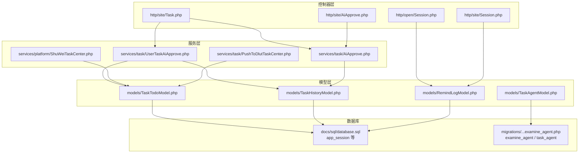
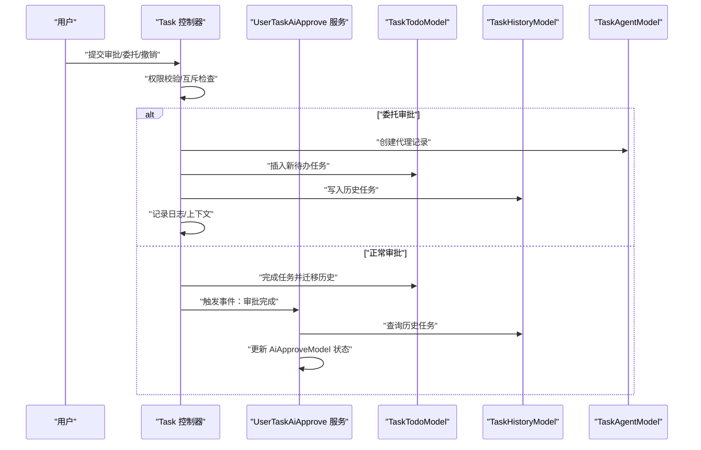
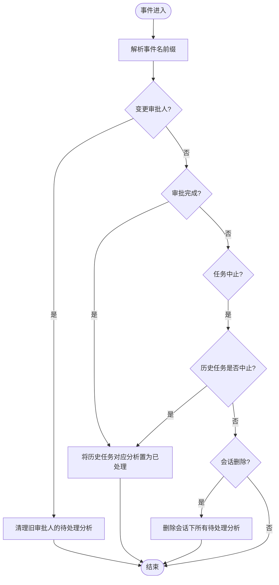
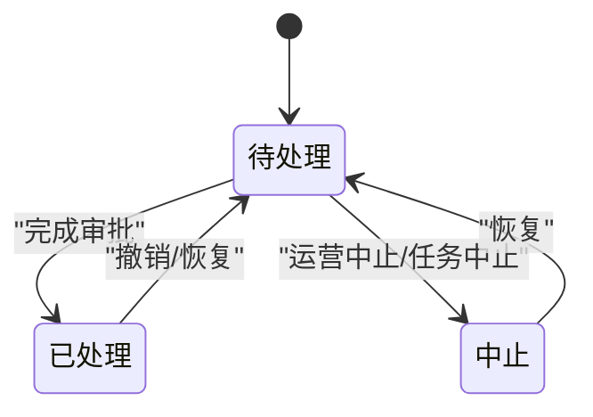
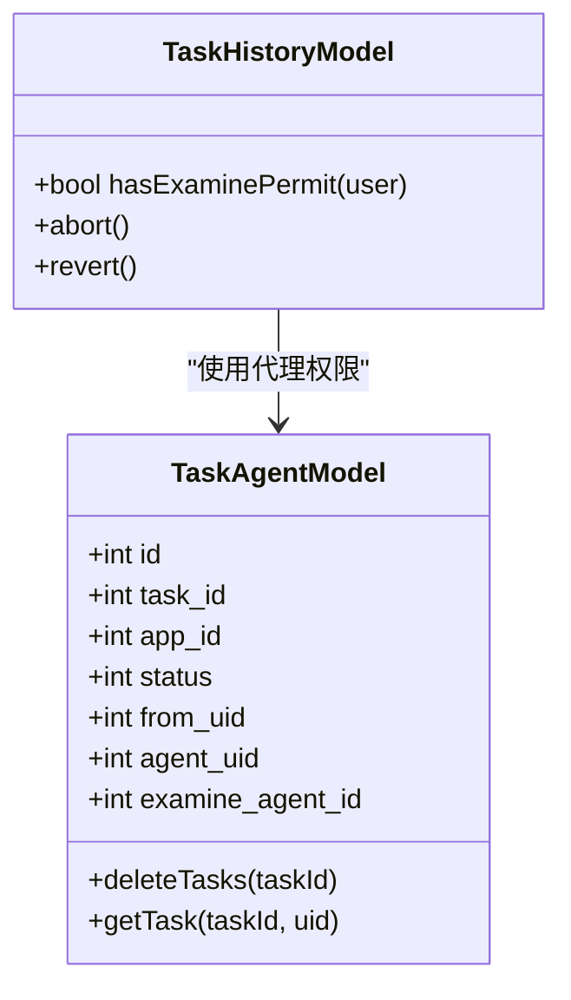
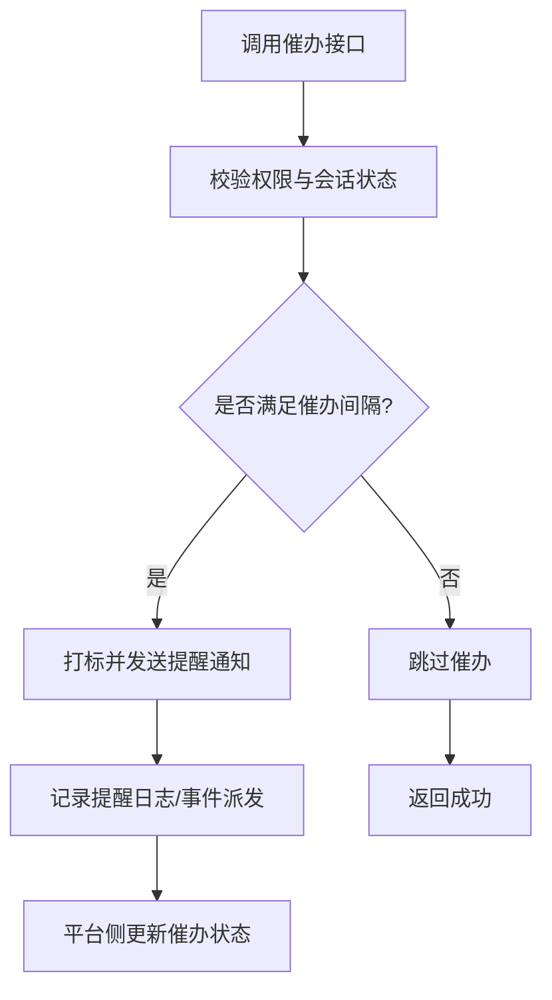
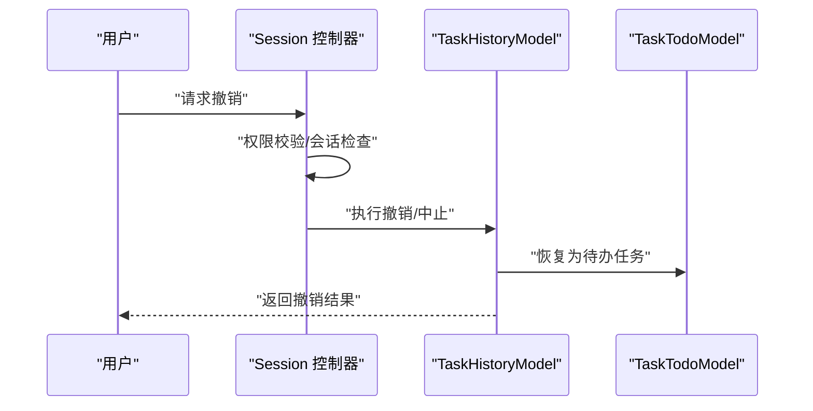
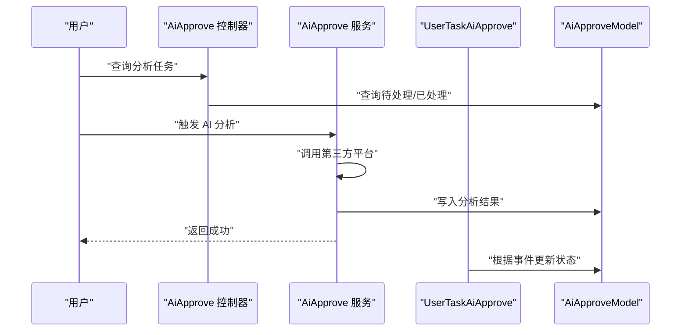
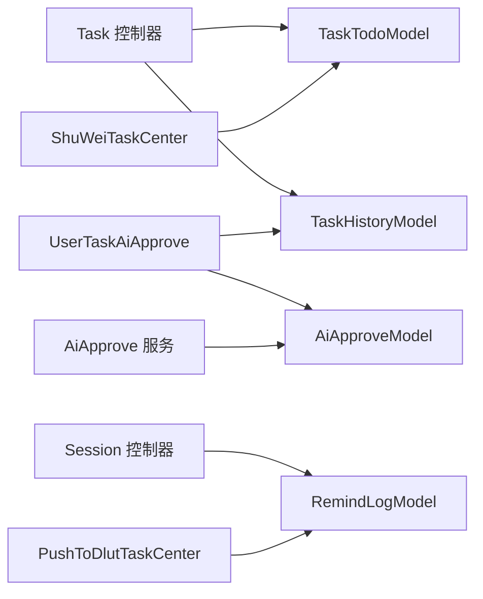

# 用户审批任务管理

<cite>
**本文引用的文件**
- [UserTaskAiApprove.php](file://process/src/services/task/UserTaskAiApprove.php)
- [AiApprove.php](file://process/src/services/task/AiApprove.php)
- [AiApprove.php](file://process/src/http/site/AiApprove.php)
- [Task.php](file://process/src/http/site/Task.php)
- [TaskAgentModel.php](file://process/src/models/TaskAgentModel.php)
- [TaskTodoModel.php](file://process/src/models/TaskTodoModel.php)
- [TaskHistoryModel.php](file://process/src/models/TaskHistoryModel.php)
- [Session.php](file://process/src/http/open/Session.php)
- [Session.php](file://process/src/http/site/Session.php)
- [RemindLogModel.php](file://process/src/models/RemindLogModel.php)
- [migration_20250609_104735_examine_agent.php](file://process/src/migrations/migration_20250609_104735_examine_agent.php)
- [ShuWeiTaskCenter.php](file://process/src/services/platform/ShuWeiTaskCenter.php)
- [PushToDlutTaskCenter.php](file://process/src/services/task/PushToDlutTaskCenter.php)
- [database.sql](file://process/docs/sql/database.sql)
</cite>

## 目录
1. [引言](#引言)
2. [项目结构](#项目结构)
3. [核心组件](#核心组件)
4. [架构总览](#架构总览)
5. [详细组件分析](#详细组件分析)
6. [依赖分析](#依赖分析)
7. [性能考虑](#性能考虑)
8. [故障排查指南](#故障排查指南)
9. [结论](#结论)
10. [附录](#附录)

## 引言
本文件围绕 htdNew 项目中的“用户审批任务管理”能力，系统性梳理审批任务的生命周期与关键实现：从任务创建、委托审批、任务代理与历史记录，到智能审批分析、任务提醒与超时处理、任务撤销与恢复等。重点解析 UserTaskAiApprove 类的事件驱动机制、审批任务的分配与状态流转、代理审批的管理策略与权限校验，并提供配置项、性能监控与扩展开发建议。

## 项目结构
审批相关能力主要分布在以下模块：
- 服务层：任务事件处理器、AI 审批服务、平台对接
- 控制器层：站点与开放接口的审批操作入口
- 模型层：任务待办、任务历史、任务代理、提醒日志等
- 平台对接：任务中心推送、代理开关、催办策略
- 数据库：会话、任务、代理、提醒等表结构

图表来源
- [Task.php](file://process/src/http/site/Task.php#L204-L446)
- [AiApprove.php](file://process/src/http/site/AiApprove.php#L1-L100)
- [Session.php](file://process/src/http/open/Session.php#L120-L154)
- [Session.php](file://process/src/http/site/Session.php#L192-L224)
- [UserTaskAiApprove.php](file://process/src/services/task/UserTaskAiApprove.php#L1-L80)
- [AiApprove.php](file://process/src/services/task/AiApprove.php#L1-L34)
- [ShuWeiTaskCenter.php](file://process/src/services/platform/ShuWeiTaskCenter.php#L762-L786)
- [PushToDlutTaskCenter.php](file://process/src/services/task/PushToDlutTaskCenter.php#L142-L169)
- [TaskTodoModel.php](file://process/src/models/TaskTodoModel.php#L1-L200)
- [TaskHistoryModel.php](file://process/src/models/TaskHistoryModel.php#L1-L200)
- [TaskAgentModel.php](file://process/src/models/TaskAgentModel.php#L1-L47)
- [RemindLogModel.php](file://process/src/models/RemindLogModel.php#L55-L78)
- [database.sql](file://process/docs/sql/database.sql#L172-L201)
- [migration_20250609_104735_examine_agent.php](file://process/src/migrations/migration_20250609_104735_examine_agent.php#L1-L34)

章节来源
- [Task.php](file://process/src/http/site/Task.php#L204-L446)
- [AiApprove.php](file://process/src/http/site/AiApprove.php#L1-L100)
- [Session.php](file://process/src/http/open/Session.php#L120-L154)
- [Session.php](file://process/src/http/site/Session.php#L192-L224)
- [UserTaskAiApprove.php](file://process/src/services/task/UserTaskAiApprove.php#L1-L80)
- [AiApprove.php](file://process/src/services/task/AiApprove.php#L1-L34)
- [TaskTodoModel.php](file://process/src/models/TaskTodoModel.php#L1-L200)
- [TaskHistoryModel.php](file://process/src/models/TaskHistoryModel.php#L1-L200)
- [TaskAgentModel.php](file://process/src/models/TaskAgentModel.php#L1-L47)
- [RemindLogModel.php](file://process/src/models/RemindLogModel.php#L55-L78)
- [database.sql](file://process/docs/sql/database.sql#L172-L201)
- [migration_20250609_104735_examine_agent.php](file://process/src/migrations/migration_20250609_104735_examine_agent.php#L1-L34)

## 核心组件
- UserTaskAiApprove：基于触发事件对智能审批分析任务进行状态迁移（变更审批人、审批完成、任务中止、会话删除等），确保分析结果与真实任务状态一致。
- AiApprove（服务）：调用第三方平台生成 AI 审批结果并落库，形成“待处理/已处理”的分析任务。
- Task（控制器）：审批主流程入口，负责权限校验、并发互斥、委托审批、日志与上下文传播。
- TaskTodoModel/TaskHistoryModel：待办/历史任务的数据结构与状态机，支持完成、中止、撤销、代理等操作。
- TaskAgentModel：任务代理的持久化与清理，支持按任务删除代理记录。
- Session（控制器）：统一的催办与撤销入口，结合提醒日志与权限控制。
- 平台对接：任务中心推送、代理开关、催办 SQL 处理等。

章节来源
- [UserTaskAiApprove.php](file://process/src/services/task/UserTaskAiApprove.php#L1-L80)
- [AiApprove.php](file://process/src/services/task/AiApprove.php#L1-L34)
- [Task.php](file://process/src/http/site/Task.php#L204-L446)
- [TaskTodoModel.php](file://process/src/models/TaskTodoModel.php#L1-L200)
- [TaskHistoryModel.php](file://process/src/models/TaskHistoryModel.php#L1-L200)
- [TaskAgentModel.php](file://process/src/models/TaskAgentModel.php#L1-L47)
- [Session.php](file://process/src/http/site/Session.php#L192-L224)

## 架构总览
审批任务管理采用“事件驱动 + 模型状态机 + 控制器编排”的分层架构：
- 事件驱动：UserTaskAiApprove 根据触发事件对 AiApproveModel 进行状态更新，保证分析任务与真实任务一致。
- 模型状态机：TaskTodoModel/TaskHistoryModel 维护任务状态与标志位，完成时迁移至历史表并清理待办。
- 控制器编排：Task 控制器负责权限、并发、委托、日志与上下文；Session 控制器负责催办与撤销。
- 平台对接：将任务推送到外部任务中心，支持代理开关与催办策略。

图表来源
- [Task.php](file://process/src/http/site/Task.php#L204-L446)
- [UserTaskAiApprove.php](file://process/src/services/task/UserTaskAiApprove.php#L1-L80)
- [TaskAgentModel.php](file://process/src/models/TaskAgentModel.php#L1-L47)
- [TaskTodoModel.php](file://process/src/models/TaskTodoModel.php#L148-L200)
- [TaskHistoryModel.php](file://process/src/models/TaskHistoryModel.php#L100-L169)

## 详细组件分析

### UserTaskAiApprove 类实现原理
- 事件分发：根据事件名前缀区分动作（变更审批人、审批完成、任务中止、会话删除等）。
- 变更审批人：当审批人变更时，清理该任务对应的 AiApproveModel 待处理记录，避免脏数据。
- 审批完成：将对应的历史任务状态更新为“已处理”，并与引擎事件保持一致。
- 任务中止：当历史任务状态为中止时，同步更新 AiApproveModel 状态，保证分析结果一致性。
- 会话删除：删除会话下所有“待处理”的 AiApproveModel 记录，防止遗留数据。

图表来源
- [UserTaskAiApprove.php](file://process/src/services/task/UserTaskAiApprove.php#L1-L80)

章节来源
- [UserTaskAiApprove.php](file://process/src/services/task/UserTaskAiApprove.php#L1-L80)

### 审批任务生命周期与状态跟踪
- 任务创建：Task 控制器在审批场景中插入新的待办任务，同时写入历史任务，记录上下文与附件。
- 权限与并发：检查会话互斥、任务是否已完成、是否有审批权限、流程是否挂起、是否处于加签中、互斥锁是否被占用。
- 完成与迁移：完成任务时更新状态为完成，迁移至历史表并删除待办记录；必要时清除代理记录。
- 中止与撤销：历史任务支持中止与撤销，中止会清理待办与代理；撤销会将任务恢复到待办状态并重置代理状态。

图表来源
- [Task.php](file://process/src/http/site/Task.php#L204-L446)
- [TaskTodoModel.php](file://process/src/models/TaskTodoModel.php#L148-L200)
- [TaskHistoryModel.php](file://process/src/models/TaskHistoryModel.php#L100-L169)

章节来源
- [Task.php](file://process/src/http/site/Task.php#L204-L446)
- [TaskTodoModel.php](file://process/src/models/TaskTodoModel.php#L1-L200)
- [TaskHistoryModel.php](file://process/src/models/TaskHistoryModel.php#L1-L200)

### 委托审批与代理管理
- 代理记录：examine_agent 表记录委托配置，task_agent 表记录具体任务代理关系。
- 权限校验：TaskHistoryModel.hasExaminePermit 支持 agent_uid 直接审批。
- 完成清理：TaskAgentModel.deleteTasks 在任务完成后移除初始化的代理记录。
- 平台代理开关：ShuWeiTaskCenter.php 提供 canDelegate 字段，用于控制是否允许代理。

图表来源
- [TaskAgentModel.php](file://process/src/models/TaskAgentModel.php#L1-L47)
- [TaskHistoryModel.php](file://process/src/models/TaskHistoryModel.php#L70-L120)
- [migration_20250609_104735_examine_agent.php](file://process/src/migrations/migration_20250609_104735_examine_agent.php#L1-L34)
- [ShuWeiTaskCenter.php](file://process/src/services/platform/ShuWeiTaskCenter.php#L762-L786)

章节来源
- [TaskAgentModel.php](file://process/src/models/TaskAgentModel.php#L1-L47)
- [TaskHistoryModel.php](file://process/src/models/TaskHistoryModel.php#L70-L120)
- [migration_20250609_104735_examine_agent.php](file://process/src/migrations/migration_20250609_104735_examine_agent.php#L1-L34)
- [ShuWeiTaskCenter.php](file://process/src/services/platform/ShuWeiTaskCenter.php#L762-L786)

### 任务提醒通知与催办策略
- 触发入口：Session 控制器在站点与开放接口分别提供催办接口，校验权限与时间间隔。
- 时间控制：RemindLogModel 根据节点配置的间隔单位与数量判断是否可再次催办。
- 平台催办：PushToDlutTaskCenter.php 提供催办 SQL 生成，更新消息提醒时间与状态。

图表来源
- [Session.php](file://process/src/http/site/Session.php#L192-L224)
- [Session.php](file://process/src/http/open/Session.php#L120-L154)
- [RemindLogModel.php](file://process/src/models/RemindLogModel.php#L55-L78)
- [PushToDlutTaskCenter.php](file://process/src/services/task/PushToDlutTaskCenter.php#L142-L169)

章节来源
- [Session.php](file://process/src/http/site/Session.php#L192-L224)
- [Session.php](file://process/src/http/open/Session.php#L120-L154)
- [RemindLogModel.php](file://process/src/models/RemindLogModel.php#L55-L78)
- [PushToDlutTaskCenter.php](file://process/src/services/task/PushToDlutTaskCenter.php#L142-L169)

### 任务撤销与恢复
- 撤销：Session 控制器提供撤销入口，校验权限与会话状态，执行撤销逻辑。
- 恢复：TaskHistoryModel.revert 将历史任务恢复为待办，重置状态与代理，派发接收事件。

图表来源
- [Session.php](file://process/src/http/site/Session.php#L192-L224)
- [TaskHistoryModel.php](file://process/src/models/TaskHistoryModel.php#L131-L169)
- [TaskTodoModel.php](file://process/src/models/TaskTodoModel.php#L148-L200)

章节来源
- [Session.php](file://process/src/http/site/Session.php#L192-L224)
- [TaskHistoryModel.php](file://process/src/models/TaskHistoryModel.php#L131-L169)

### 智能审批分析任务管理
- AI 任务生成：AiApprove 服务调用第三方平台生成结果并写入 AiApproveModel。
- 列表与详情：AiApprove 控制器提供分析任务列表、统计与单条详情查询，联动任务中心任务列表。
- 事件联动：UserTaskAiApprove 在审批完成、变更审批人、任务中止、会话删除等事件下更新 AiApproveModel 状态。

图表来源
- [AiApprove.php](file://process/src/http/site/AiApprove.php#L1-L100)
- [AiApprove.php](file://process/src/services/task/AiApprove.php#L1-L34)
- [UserTaskAiApprove.php](file://process/src/services/task/UserTaskAiApprove.php#L1-L80)

章节来源
- [AiApprove.php](file://process/src/http/site/AiApprove.php#L1-L100)
- [AiApprove.php](file://process/src/services/task/AiApprove.php#L1-L34)
- [UserTaskAiApprove.php](file://process/src/services/task/UserTaskAiApprove.php#L1-L80)

## 依赖分析
- 控制器依赖模型：Task 控制器强依赖 TaskTodoModel/TaskHistoryModel 的状态机与权限方法；Session 控制器依赖 RemindLogModel 与权限校验。
- 服务依赖：UserTaskAiApprove 依赖 AiApproveModel 与 TaskHistoryModel；AiApprove 服务依赖第三方平台与 AiApproveModel。
- 平台对接：ShuWeiTaskCenter.php 提供 canDelegate 与操作按钮类型；PushToDlutTaskCenter.php 提供催办 SQL 生成。
- 数据库：app_session、task_agent、examine_agent、task_history、task_todo、remind_log 等表支撑审批全链路。

图表来源
- [Task.php](file://process/src/http/site/Task.php#L204-L446)
- [UserTaskAiApprove.php](file://process/src/services/task/UserTaskAiApprove.php#L1-L80)
- [AiApprove.php](file://process/src/services/task/AiApprove.php#L1-L34)
- [Session.php](file://process/src/http/site/Session.php#L192-L224)
- [ShuWeiTaskCenter.php](file://process/src/services/platform/ShuWeiTaskCenter.php#L762-L786)
- [PushToDlutTaskCenter.php](file://process/src/services/task/PushToDlutTaskCenter.php#L142-L169)

章节来源
- [Task.php](file://process/src/http/site/Task.php#L204-L446)
- [UserTaskAiApprove.php](file://process/src/services/task/UserTaskAiApprove.php#L1-L80)
- [AiApprove.php](file://process/src/services/task/AiApprove.php#L1-L34)
- [Session.php](file://process/src/http/site/Session.php#L192-L224)
- [ShuWeiTaskCenter.php](file://process/src/services/platform/ShuWeiTaskCenter.php#L762-L786)
- [PushToDlutTaskCenter.php](file://process/src/services/task/PushToDlutTaskCenter.php#L142-L169)

## 性能考虑
- 互斥锁：TaskTodoModel 使用分布式锁保护任务互斥，避免并发冲突与重复处理。
- 缓存与索引：数据库层面为会话、代理、任务等建立索引，减少查询成本。
- 事件驱动：通过事件驱动更新 AiApproveModel，降低耦合与重复扫描。
- 平台推送：催办与提醒采用批量 SQL 更新，减少多次往返。

章节来源
- [TaskTodoModel.php](file://process/src/models/TaskTodoModel.php#L148-L163)
- [database.sql](file://process/docs/sql/database.sql#L172-L201)
- [migration_20250609_104735_examine_agent.php](file://process/src/migrations/migration_20250609_104735_examine_agent.php#L1-L34)
- [PushToDlutTaskCenter.php](file://process/src/services/task/PushToDlutTaskCenter.php#L142-L169)

## 故障排查指南
- 权限不足：检查 Task 控制器的权限校验与 TaskHistoryModel.hasExaminePermit。
- 并发冲突：查看 TaskTodoModel.getMutex 是否被占用；适当延长互斥锁有效期。
- 催办无效：确认 RemindLogModel 的间隔配置与当前时间是否满足再次催办条件。
- 代理异常：核对 examine_agent 与 task_agent 表记录，任务完成后是否清理代理。
- AI 分析未更新：检查 UserTaskAiApprove 的事件名前缀与 AiApproveModel 状态字段映射。

章节来源
- [Task.php](file://process/src/http/site/Task.php#L204-L225)
- [TaskHistoryModel.php](file://process/src/models/TaskHistoryModel.php#L70-L120)
- [TaskTodoModel.php](file://process/src/models/TaskTodoModel.php#L148-L163)
- [RemindLogModel.php](file://process/src/models/RemindLogModel.php#L55-L78)
- [TaskAgentModel.php](file://process/src/models/TaskAgentModel.php#L1-L47)
- [UserTaskAiApprove.php](file://process/src/services/task/UserTaskAiApprove.php#L1-L80)

## 结论
htdNew 的审批任务管理以事件驱动为核心，结合严格的权限与并发控制、完善的代理与历史状态机，以及平台化的提醒与推送能力，形成了稳定可扩展的审批闭环。UserTaskAiApprove 作为关键事件处理器，确保了智能审批分析与真实任务状态的一致性。

## 附录

### 配置选项与最佳实践
- 代理开关：通过平台对接的 canDelegate 控制是否允许代理。
- 催办间隔：RemindLogModel 基于节点配置的 interval_unit 与 interval 决定可催办窗口。
- 互斥锁：TaskTodoModel.getMutex 默认 600 秒，可根据业务压力调整。
- 测试数据：TaskTodoModel.is_test 与 TaskHistoryModel.is_test 影响测试用户权限。

章节来源
- [ShuWeiTaskCenter.php](file://process/src/services/platform/ShuWeiTaskCenter.php#L762-L786)
- [RemindLogModel.php](file://process/src/models/RemindLogModel.php#L55-L78)
- [TaskTodoModel.php](file://process/src/models/TaskTodoModel.php#L148-L163)

### 扩展开发指南
- 新增事件：在 UserTaskAiApprove 中新增事件分支，维护 AiApproveModel 状态一致性。
- 自定义代理策略：扩展 examine_agent 表字段或引入新的代理规则表，配合 TaskAgentModel 的查询与清理方法。
- 平台对接：参考 ShuWeiTaskCenter.php 与 PushToDlutTaskCenter.php 的模式，新增平台适配器。
- 性能优化：对高频查询建立复合索引，合理拆分大事务，使用事件驱动替代轮询。

章节来源
- [UserTaskAiApprove.php](file://process/src/services/task/UserTaskAiApprove.php#L1-L80)
- [TaskAgentModel.php](file://process/src/models/TaskAgentModel.php#L1-L47)
- [ShuWeiTaskCenter.php](file://process/src/services/platform/ShuWeiTaskCenter.php#L762-L786)
- [PushToDlutTaskCenter.php](file://process/src/services/task/PushToDlutTaskCenter.php#L142-L169)