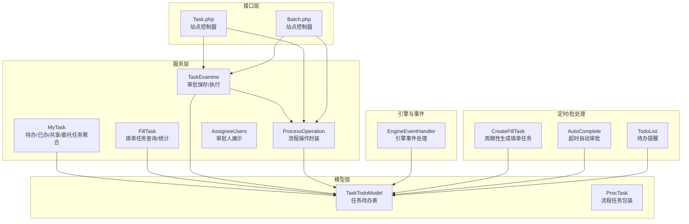
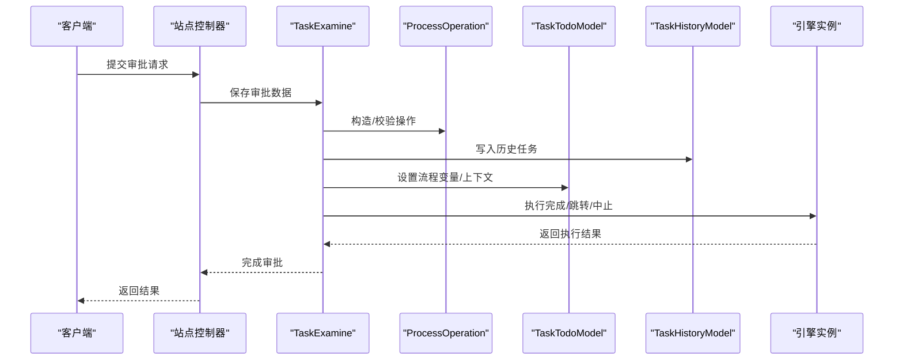
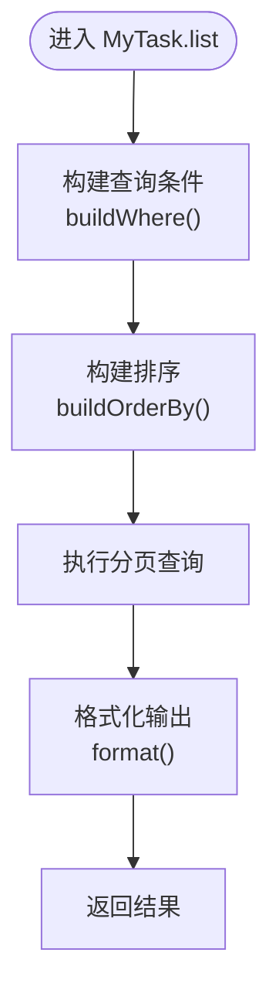
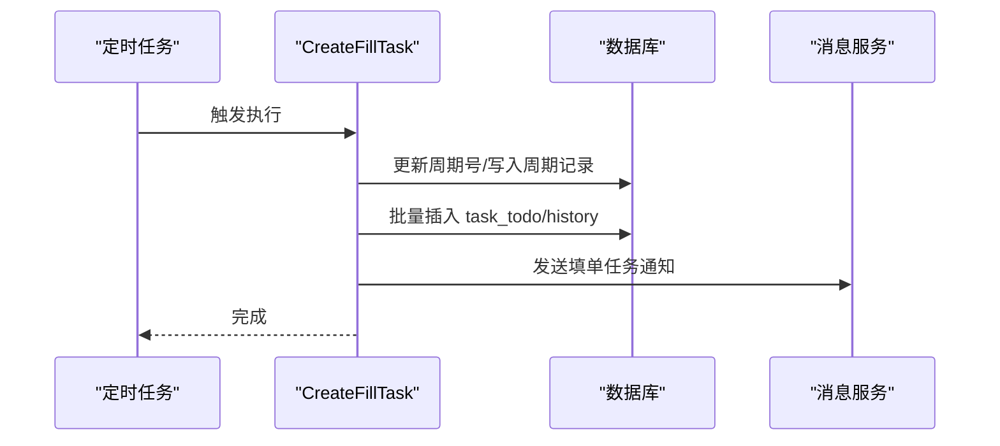
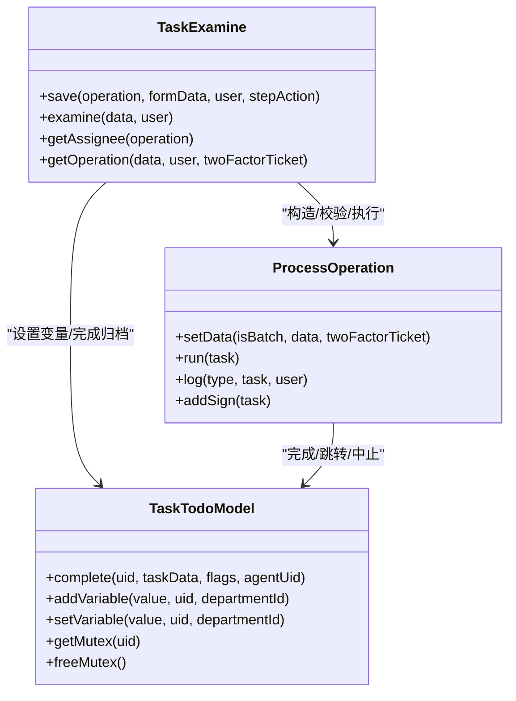
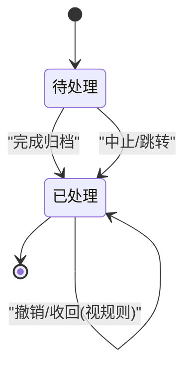
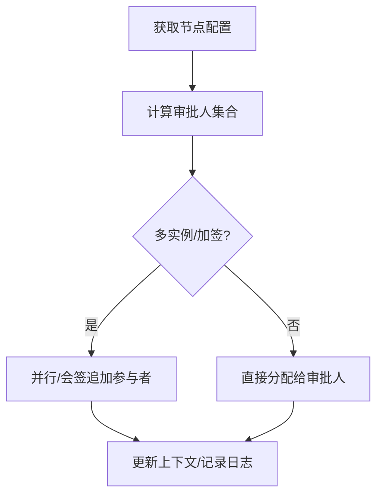
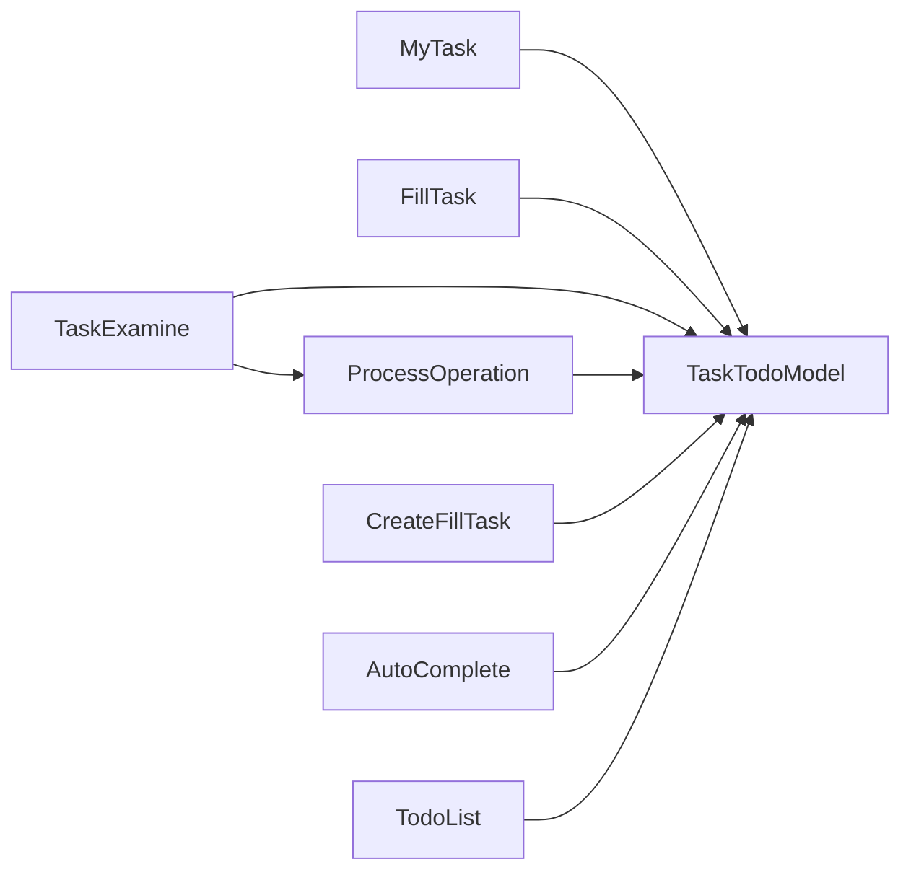

# 任务服务

<cite>
**本文引用的文件**
- [process/src/services/MyTask.php](file://process/src/services/MyTask.php)
- [process/src/services/FillTask.php](file://process/src/services/FillTask.php)
- [process/src/services/TaskExamine.php](file://process/src/services/TaskExamine.php)
- [process/src/services/ProcessOperation.php](file://process/src/services/ProcessOperation.php)
- [process/src/models/TaskTodoModel.php](file://process/src/models/TaskTodoModel.php)
- [process/src/engine/ProcTask.php](file://process/src/engine/ProcTask.php)
- [process/src/modules/process/EngineEventHandler.php](file://process/src/modules/process/EngineEventHandler.php)
- [process/src/services/task/CreateFillTask.php](file://process/src/services/task/CreateFillTask.php)
- [process/src/services/task/AutoComplete.php](file://process/src/services/task/AutoComplete.php)
- [process/src/services/task/TodoList.php](file://process/src/services/task/TodoList.php)
- [process/src/services/assignee/AssigneeUsers.php](file://process/src/services/assignee/AssigneeUsers.php)
- [process/src/http/site/Task.php](file://process/src/http/site/Task.php)
- [process/src/http/site/Batch.php](file://process/src/http/site/Batch.php)
</cite>

## 目录
1. [引言](#引言)
2. [项目结构](#项目结构)
3. [核心组件](#核心组件)
4. [架构总览](#架构总览)
5. [详细组件分析](#详细组件分析)
6. [依赖分析](#依赖分析)
7. [性能考量](#性能考量)
8. [故障排查指南](#故障排查指南)
9. [结论](#结论)
10. [附录](#附录)

## 引言
本文件面向 htdNew 项目的任务服务，系统性梳理任务生命周期管理、审批流程与任务分配机制，覆盖任务审批、填单任务、待办任务管理与开放接口任务处理。文档从架构、数据流、处理逻辑、接口设计、参数传递、异常处理到性能优化与扩展开发给出完整说明，帮助开发者快速理解并高效扩展任务服务能力。

## 项目结构
任务服务位于 process/src 下，围绕“待办/已办/共享/委托”任务聚合查询（MyTask）、“填单任务”（FillTask）、“审批操作”（TaskExamine/ProcessOperation）、“任务模型”（TaskTodoModel）以及“引擎事件处理”（EngineEventHandler）等模块协同工作；另有定时/批处理任务（CreateFillTask、AutoComplete、TodoList）与站点控制器（Task.php、Batch.php）提供对外接口入口。

图表来源
- [process/src/services/MyTask.php](file://process/src/services/MyTask.php#L1-L617)
- [process/src/services/FillTask.php](file://process/src/services/FillTask.php#L1-L379)
- [process/src/services/TaskExamine.php](file://process/src/services/TaskExamine.php#L1-L266)
- [process/src/services/ProcessOperation.php](file://process/src/services/ProcessOperation.php#L1-L375)
- [process/src/models/TaskTodoModel.php](file://process/src/models/TaskTodoModel.php#L1-L288)
- [process/src/engine/ProcTask.php](file://process/src/engine/ProcTask.php#L1-L11)
- [process/src/modules/process/EngineEventHandler.php](file://process/src/modules/process/EngineEventHandler.php#L46-L121)
- [process/src/services/task/CreateFillTask.php](file://process/src/services/task/CreateFillTask.php#L1-L199)
- [process/src/services/task/AutoComplete.php](file://process/src/services/task/AutoComplete.php#L1-L62)
- [process/src/services/task/TodoList.php](file://process/src/services/task/TodoList.php#L1-L34)
- [process/src/http/site/Task.php](file://process/src/http/site/Task.php#L410-L446)
- [process/src/http/site/Batch.php](file://process/src/http/site/Batch.php#L271-L305)

章节来源
- [process/src/services/MyTask.php](file://process/src/services/MyTask.php#L1-L617)
- [process/src/services/FillTask.php](file://process/src/services/FillTask.php#L1-L379)
- [process/src/services/TaskExamine.php](file://process/src/services/TaskExamine.php#L1-L266)
- [process/src/services/ProcessOperation.php](file://process/src/services/ProcessOperation.php#L1-L375)
- [process/src/models/TaskTodoModel.php](file://process/src/models/TaskTodoModel.php#L1-L288)
- [process/src/engine/ProcTask.php](file://process/src/engine/ProcTask.php#L1-L11)
- [process/src/modules/process/EngineEventHandler.php](file://process/src/modules/process/EngineEventHandler.php#L46-L121)
- [process/src/services/task/CreateFillTask.php](file://process/src/services/task/CreateFillTask.php#L1-L199)
- [process/src/services/task/AutoComplete.php](file://process/src/services/task/AutoComplete.php#L1-L62)
- [process/src/services/task/TodoList.php](file://process/src/services/task/TodoList.php#L1-L34)
- [process/src/http/site/Task.php](file://process/src/http/site/Task.php#L410-L446)
- [process/src/http/site/Batch.php](file://process/src/http/site/Batch.php#L271-L305)

## 核心组件
- 待办/已办/共享/委托任务聚合（MyTask）
  - 支持多维度筛选（事项、节点、时间、关键字、审批人/岗位、测试态等），统一格式化输出，含任务标记、加签/移交信息、AI审批规则状态等。
- 填单任务（FillTask）
  - 周期性生成填单任务、按周期统计、按用户/部门过滤、授权校验、动态字段查询与格式化输出。
- 审批操作（TaskExamine + ProcessOperation）
  - 保存审批数据、设置流程变量、触发前后置事件、执行跳转/中止、知会、加签、日志记录。
- 任务模型（TaskTodoModel）
  - 任务状态/标志位、加锁互斥、完成归档、撤销/回收控制、跳转、委托代理校验等。
- 引擎事件处理（EngineEventHandler）
  - 任务中止、结束、创建用户任务、多实例运行时分配人等。
- 定时/批处理任务
  - CreateFillTask：周期生成填单任务并派发消息。
  - AutoComplete：超时自动审批（随机审批人）。
  - TodoList：统计待办并推送提醒。
- 接口控制器
  - Task.php：任务移交、完成等站点接口。
  - Batch.php：批量审批入口。

章节来源
- [process/src/services/MyTask.php](file://process/src/services/MyTask.php#L1-L617)
- [process/src/services/FillTask.php](file://process/src/services/FillTask.php#L1-L379)
- [process/src/services/TaskExamine.php](file://process/src/services/TaskExamine.php#L1-L266)
- [process/src/services/ProcessOperation.php](file://process/src/services/ProcessOperation.php#L1-L375)
- [process/src/models/TaskTodoModel.php](file://process/src/models/TaskTodoModel.php#L1-L288)
- [process/src/modules/process/EngineEventHandler.php](file://process/src/modules/process/EngineEventHandler.php#L46-L121)
- [process/src/services/task/CreateFillTask.php](file://process/src/services/task/CreateFillTask.php#L1-L199)
- [process/src/services/task/AutoComplete.php](file://process/src/services/task/AutoComplete.php#L1-L62)
- [process/src/services/task/TodoList.php](file://process/src/services/task/TodoList.php#L1-L34)
- [process/src/http/site/Task.php](file://process/src/http/site/Task.php#L410-L446)
- [process/src/http/site/Batch.php](file://process/src/http/site/Batch.php#L271-L305)

## 架构总览
任务服务以“服务层 + 模型层 + 引擎事件 + 定时批处理 + 接口层”的分层架构组织，围绕 TaskTodoModel 为核心进行任务状态流转与历史归档，配合 ProcessOperation/TaskExamine 实现审批动作与流程推进，MyTask/FillTask 提供查询与统计能力，定时任务保障填单任务的自动化生成与提醒。

图表来源
- [process/src/services/TaskExamine.php](file://process/src/services/TaskExamine.php#L1-L266)
- [process/src/services/ProcessOperation.php](file://process/src/services/ProcessOperation.php#L1-L375)
- [process/src/models/TaskTodoModel.php](file://process/src/models/TaskTodoModel.php#L1-L288)

## 详细组件分析

### 待办/已办/共享/委托任务聚合（MyTask）
- 查询类型与排序
  - 支持待办、已办、共享、委托待办/已办，多种排序方式（接收时间、自定义排序、完成时间）。
- 关键筛选条件
  - 事项/节点、时间范围（开始/自定义/处理）、关键字（名称/学工号/姓名）、发起人关键字、审批人/岗位、测试态。
- 输出格式化
  - 统一返回任务基础信息、节点/事项元数据、参与人列表（支持匿名）、加签/移交/标记信息、AI审批规则状态、已读标记等。
- 性能要点
  - 使用延迟 join、按需关联 app_session/users，避免冗余字段查询；对关键词搜索进行索引友好构建。

图表来源
- [process/src/services/MyTask.php](file://process/src/services/MyTask.php#L118-L149)
- [process/src/services/MyTask.php](file://process/src/services/MyTask.php#L338-L515)
- [process/src/services/MyTask.php](file://process/src/services/MyTask.php#L516-L585)

章节来源
- [process/src/services/MyTask.php](file://process/src/services/MyTask.php#L1-L617)

### 填单任务（FillTask）
- 周期性生成
  - CreateFillTask 周期扫描已发布填单，计算下一个周期并批量插入 task_todo/history，派发事件与消息通知。
- 查询与统计
  - 支持按周期、任务/会话状态、部门/用户过滤、授权校验、动态字段条件；提供统计汇总。
- 输出与扩展
  - 支持将数据表字段拼接到结果，便于报表/导出场景。

图表来源
- [process/src/services/task/CreateFillTask.php](file://process/src/services/task/CreateFillTask.php#L1-L199)
- [process/src/services/FillTask.php](file://process/src/services/FillTask.php#L1-L379)

章节来源
- [process/src/services/task/CreateFillTask.php](file://process/src/services/task/CreateFillTask.php#L1-L199)
- [process/src/services/FillTask.php](file://process/src/services/FillTask.php#L1-L379)

### 审批流程与任务分配（TaskExamine + ProcessOperation）
- 审批保存
  - 根据步骤配置与表单授权，保存表单数据至会话，设置流程变量，触发前置事件。
- 审批执行
  - 根据操作类型（默认/跳转/中止）推进引擎，记录日志、知会、加签处理、触发后置事件。
- 任务分配
  - 引擎根据节点配置与运行时上下文计算下一环节审批人；支持多实例、会签/并行加签等复杂场景。
- 异常与安全
  - 二次验证、必填校验、跳转节点合法性、加签人员去重与冲突检测。

图表来源
- [process/src/services/TaskExamine.php](file://process/src/services/TaskExamine.php#L1-L266)
- [process/src/services/ProcessOperation.php](file://process/src/services/ProcessOperation.php#L1-L375)
- [process/src/models/TaskTodoModel.php](file://process/src/models/TaskTodoModel.php#L1-L288)

章节来源
- [process/src/services/TaskExamine.php](file://process/src/services/TaskExamine.php#L1-L266)
- [process/src/services/ProcessOperation.php](file://process/src/services/ProcessOperation.php#L1-L375)
- [process/src/models/TaskTodoModel.php](file://process/src/models/TaskTodoModel.php#L1-L288)

### 任务生命周期与状态流转
- 生命周期阶段
  - 创建：引擎事件 createUserTask 或 CreateFillTask 生成 task_todo。
  - 处理：TaskExamine.save 设置流程变量，ProcessOperation.run 推进引擎。
  - 归档：TaskTodoModel.complete 将任务写入 task_history 并删除 task_todo。
  - 结束：引擎事件 end 设置会话状态，清理委托与消息。
- 状态与标志位
  - 状态：INIT/VALIDATE/COMPLETE/LOCK/SUSPEND。
  - 标志位：催办、驳回、超时、异常、重报、禁止收回、节点标记、加签/会签标记等。
- 回收/撤销
  - 完成后依据节点配置与快照判断是否允许撤销/收回。

图表来源
- [process/src/models/TaskTodoModel.php](file://process/src/models/TaskTodoModel.php#L164-L211)
- [process/src/modules/process/EngineEventHandler.php](file://process/src/modules/process/EngineEventHandler.php#L75-L91)

章节来源
- [process/src/models/TaskTodoModel.php](file://process/src/models/TaskTodoModel.php#L1-L288)
- [process/src/modules/process/EngineEventHandler.php](file://process/src/modules/process/EngineEventHandler.php#L46-L121)

### 任务分配机制
- 分配策略
  - 引擎根据节点配置与运行时上下文计算审批人；支持关系/岗位/团队/部门等多维来源。
- 多实例与加签
  - 会签/并行加签时，ProcessOperation.addSign 在引擎实例上追加参与者，并记录加签信息。
- 代理与共享
  - 通过 TaskTodoModel.hasExaminePermit 与 TaskAgentModel 支持委托审批；共享任务在查询侧做映射。

图表来源
- [process/src/services/ProcessOperation.php](file://process/src/services/ProcessOperation.php#L337-L375)
- [process/src/services/assignee/AssigneeUsers.php](file://process/src/services/assignee/AssigneeUsers.php#L1-L54)
- [process/src/models/TaskTodoModel.php](file://process/src/models/TaskTodoModel.php#L213-L226)

章节来源
- [process/src/services/ProcessOperation.php](file://process/src/services/ProcessOperation.php#L1-L375)
- [process/src/services/assignee/AssigneeUsers.php](file://process/src/services/assignee/AssigneeUsers.php#L1-L54)
- [process/src/models/TaskTodoModel.php](file://process/src/models/TaskTodoModel.php#L1-L288)

### 审批规则与智能审批
- AI 审批规则
  - MyTask.getApproveRule 依据节点配置与用户自定义规则返回状态，用于前端展示与后续处理策略。
- 已分析任务转为已处理
  - 完成审批后，AiApproveModel 状态更新，实现智能审批闭环。

章节来源
- [process/src/services/MyTask.php](file://process/src/services/MyTask.php#L595-L616)
- [process/src/models/TaskTodoModel.php](file://process/src/models/TaskTodoModel.php#L193-L211)

### 开放接口任务处理（站点控制器）
- 单任务处理（Task.php）
  - 支持任务移交、完成归档、日志记录、评论与附件持久化、消息通知等。
- 批量处理（Batch.php）
  - 根据查询结果批量生成任务，支持条件筛选、表单数据与审批数据提交。

章节来源
- [process/src/http/site/Task.php](file://process/src/http/site/Task.php#L410-L446)
- [process/src/http/site/Batch.php](file://process/src/http/site/Batch.php#L271-L305)

## 依赖分析
- 低耦合高内聚
  - MyTask/FillTask 仅依赖模型层与服务层工具，不直接耦合引擎；TaskExamine/ProcessOperation 专注审批动作与流程推进。
- 关键依赖链
  - TaskExamine → ProcessOperation → TaskTodoModel → 引擎实例 → 日志/消息/事件。
  - CreateFillTask → 模型层（周期/填单）→ 事件/消息。
- 外部集成
  - 消息通知、Redis/数据库、定时任务调度等。

图表来源
- [process/src/services/MyTask.php](file://process/src/services/MyTask.php#L1-L617)
- [process/src/services/FillTask.php](file://process/src/services/FillTask.php#L1-L379)
- [process/src/services/TaskExamine.php](file://process/src/services/TaskExamine.php#L1-L266)
- [process/src/services/ProcessOperation.php](file://process/src/services/ProcessOperation.php#L1-L375)
- [process/src/models/TaskTodoModel.php](file://process/src/models/TaskTodoModel.php#L1-L288)
- [process/src/services/task/CreateFillTask.php](file://process/src/services/task/CreateFillTask.php#L1-L199)
- [process/src/services/task/AutoComplete.php](file://process/src/services/task/AutoComplete.php#L1-L62)
- [process/src/services/task/TodoList.php](file://process/src/services/task/TodoList.php#L1-L34)

章节来源
- [process/src/services/MyTask.php](file://process/src/services/MyTask.php#L1-L617)
- [process/src/services/FillTask.php](file://process/src/services/FillTask.php#L1-L379)
- [process/src/services/TaskExamine.php](file://process/src/services/TaskExamine.php#L1-L266)
- [process/src/services/ProcessOperation.php](file://process/src/services/ProcessOperation.php#L1-L375)
- [process/src/models/TaskTodoModel.php](file://process/src/models/TaskTodoModel.php#L1-L288)
- [process/src/services/task/CreateFillTask.php](file://process/src/services/task/CreateFillTask.php#L1-L199)
- [process/src/services/task/AutoComplete.php](file://process/src/services/task/AutoComplete.php#L1-L62)
- [process/src/services/task/TodoList.php](file://process/src/services/task/TodoList.php#L1-L34)

## 性能考量
- 查询优化
  - MyTask：延迟 join、按需关联、避免冗余字段；使用索引友好的条件构建（如时间范围、关键字匹配）。
  - FillTask：动态字段查询仅连接所需数据表，分页与缓存键控制。
- 批量写入
  - CreateFillTask：批量插入 task_todo/history，减少事务次数；分块处理超时任务标志位更新。
- 并发与锁
  - TaskTodoModel：任务互斥锁（Redis）避免并发完成同一任务；AutoComplete 使用会话级锁。
- 事件与消息
  - 异步通知与事务后回调，降低阻塞；TodoList 并发统计与发送。
- 建议
  - 对高频查询建立合适索引；对长事务拆分；对超大批次分片处理；对热点任务增加缓存。

[本节为通用指导，无需列出章节来源]

## 故障排查指南
- 审批失败
  - 检查 ProcessOperation.setData 的配置校验（必填、二次验证、跳转节点合法性）。
  - 查看 TaskExamine.save 前置事件是否抛错；确认流程变量设置是否成功。
- 任务未完成/状态异常
  - 核查 TaskTodoModel.complete 是否执行；检查 flags（超时/异常/禁止收回）影响。
  - 确认引擎实例推进是否成功（完成/跳转/中止）。
- 填单任务缺失
  - 检查 CreateFillTask 执行状态与锁；确认周期号递增与插入是否成功；核对授权与部门/用户过滤条件。
- 批量审批问题
  - 核对 Batch.php 条件查询结果与提交数据；关注 AutoComplete 的事务回滚日志。

章节来源
- [process/src/services/ProcessOperation.php](file://process/src/services/ProcessOperation.php#L108-L159)
- [process/src/services/TaskExamine.php](file://process/src/services/TaskExamine.php#L119-L138)
- [process/src/models/TaskTodoModel.php](file://process/src/models/TaskTodoModel.php#L164-L211)
- [process/src/services/task/CreateFillTask.php](file://process/src/services/task/CreateFillTask.php#L22-L45)
- [process/src/services/task/AutoComplete.php](file://process/src/services/task/AutoComplete.php#L21-L61)

## 结论
任务服务通过清晰的分层设计与完善的生命周期管理，实现了从任务生成、审批推进到归档与统计的全链路能力。依托引擎事件与流程操作封装，系统具备良好的可扩展性与稳定性。建议在生产环境中重点关注查询索引、批量写入与并发锁策略，持续优化性能与可靠性。

[本节为总结性内容，无需列出章节来源]

## 附录

### 接口设计与参数传递（概要）
- 审批接口（站点控制器）
  - 提交参数：操作值、部门 ID、审批意见、附件、加签人员、跳转节点等。
  - 返回：审批结果与日志 ID。
- 批量审批接口
  - 输入：查询条件、表单数据、审批数据、审批人列表。
  - 输出：批量任务 ID 与总数。
- 填单任务接口
  - 输入：填单 ID、周期号、状态、部门/用户过滤、动态字段条件。
  - 输出：任务列表、统计与格式化数据。

章节来源
- [process/src/http/site/Task.php](file://process/src/http/site/Task.php#L410-L446)
- [process/src/http/site/Batch.php](file://process/src/http/site/Batch.php#L271-L305)
- [process/src/services/FillTask.php](file://process/src/services/FillTask.php#L57-L97)

### 异常处理机制
- 参数校验
  - 缺少必要字段、二次验证失败、跳转节点非法、加签人员冲突等均抛出用户异常。
- 事务与回滚
  - AutoComplete 使用事务包裹，失败自动回滚并记录错误堆栈。
- 事件幂等
  - 前置事件要求幂等，避免重复执行导致副作用。

章节来源
- [process/src/services/ProcessOperation.php](file://process/src/services/ProcessOperation.php#L117-L159)
- [process/src/services/task/AutoComplete.php](file://process/src/services/task/AutoComplete.php#L31-L59)
- [process/src/services/TaskExamine.php](file://process/src/services/TaskExamine.php#L119-L138)