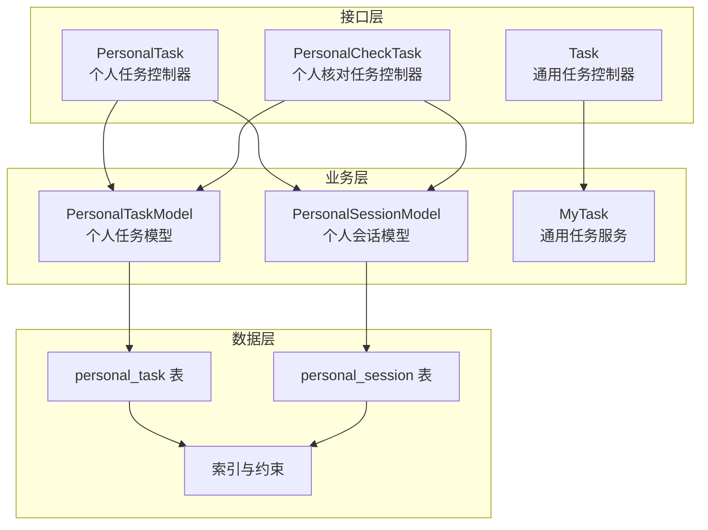
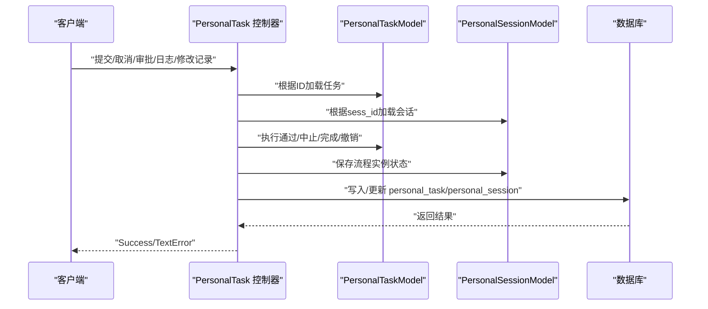
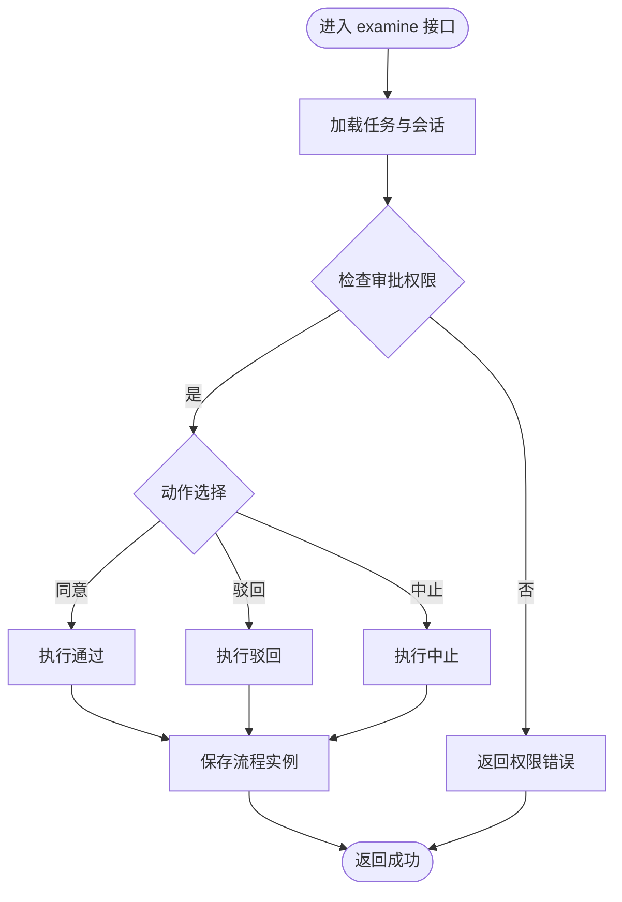
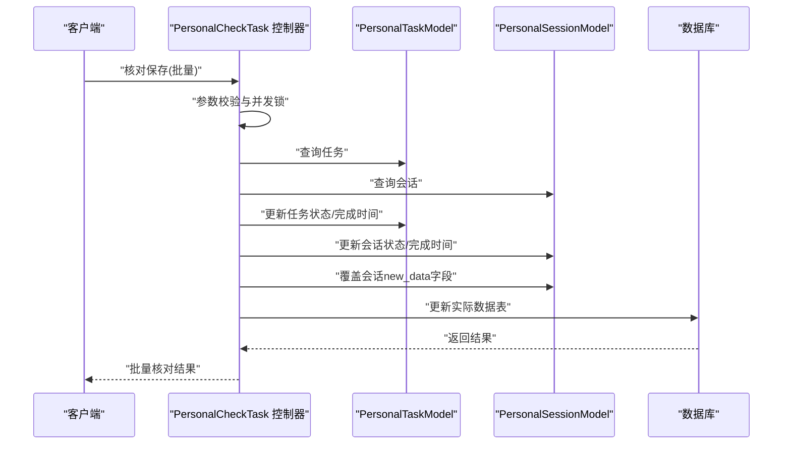
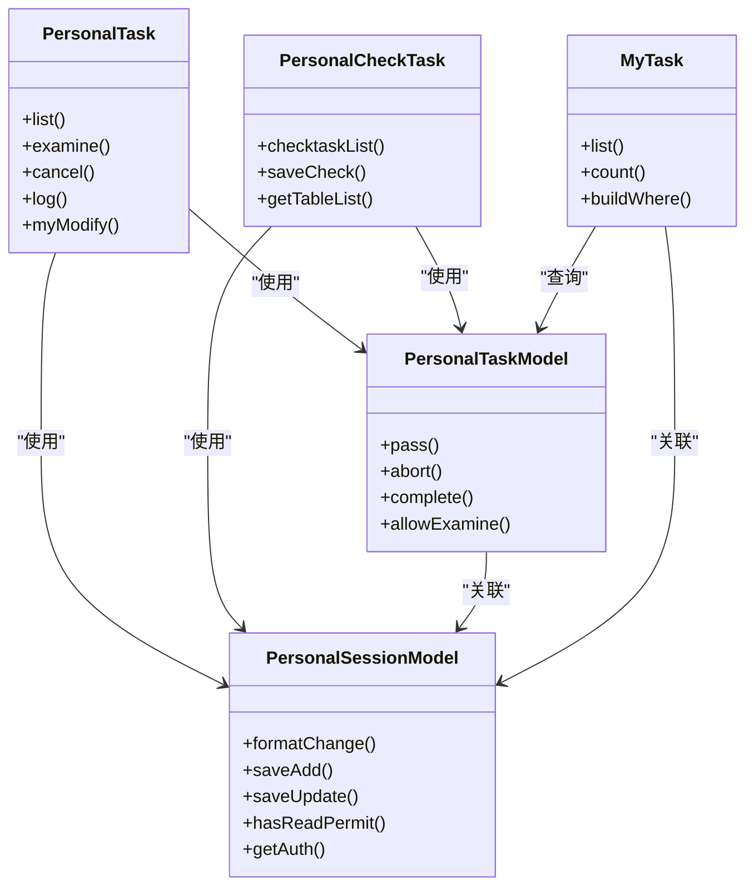

# 个人任务服务

<cite>
**本文引用的文件**
- [PersonalTask.php](file://process/src/http/site/PersonalTask.php)
- [PersonalTaskModel.php](file://process/src/models/PersonalTaskModel.php)
- [PersonalSessionModel.php](file://process/src/models/PersonalSessionModel.php)
- [PersonalCheckTask.php](file://process/src/http/site/PersonalCheckTask.php)
- [MyTask.php](file://process/src/services/MyTask.php)
- [Task.php](file://process/src/http/site/Task.php)
- [database.sql](file://process/docs/sql/database.sql)
- [migration_20250730_102435_personal_v2.php](file://process/src/migrations/migration_20250730_102435_personal_v2.php)
</cite>

## 目录
1. [简介](#简介)
2. [项目结构](#项目结构)
3. [核心组件](#核心组件)
4. [架构总览](#架构总览)
5. [详细组件分析](#详细组件分析)
6. [依赖关系分析](#依赖关系分析)
7. [性能考量](#性能考量)
8. [故障排查指南](#故障排查指南)
9. [结论](#结论)
10. [附录](#附录)

## 简介
本文件系统化梳理 htdNew 项目中的“个人任务服务”，围绕个人任务的查询、状态管理、任务完成与取消等核心能力，阐述其与待办任务、历史任务、共享任务以及委托任务的关系与数据流转，并给出权限控制、过滤与排序机制、接口规范、参数说明与错误处理策略，帮助开发者与使用者快速理解与正确使用该服务。

## 项目结构
个人任务服务主要由三层构成：
- 接口层：HTTP 控制器负责接收请求、参数校验、调用服务与返回响应。
- 业务层：模型与服务类封装任务状态、流程引擎交互、会话与数据变更持久化。
- 数据层：数据库表 personal_task、personal_session 以及相关索引与迁移脚本支撑任务与会话数据。

图表来源
- [PersonalTask.php](file://process/src/http/site/PersonalTask.php#L1-L1252)
- [PersonalCheckTask.php](file://process/src/http/site/PersonalCheckTask.php#L1-L637)
- [Task.php](file://process/src/http/site/Task.php#L1-L57)
- [PersonalTaskModel.php](file://process/src/models/PersonalTaskModel.php#L1-L179)
- [PersonalSessionModel.php](file://process/src/models/PersonalSessionModel.php#L1-L558)
- [MyTask.php](file://process/src/services/MyTask.php#L1-L617)
- [database.sql](file://process/docs/sql/database.sql#L335-L368)
- [migration_20250730_102435_personal_v2.php](file://process/src/migrations/migration_20250730_102435_personal_v2.php#L123-L148)

章节来源
- [PersonalTask.php](file://process/src/http/site/PersonalTask.php#L1-L1252)
- [PersonalTaskModel.php](file://process/src/models/PersonalTaskModel.php#L1-L179)
- [PersonalSessionModel.php](file://process/src/models/PersonalSessionModel.php#L1-L558)
- [PersonalCheckTask.php](file://process/src/http/site/PersonalCheckTask.php#L1-L637)
- [MyTask.php](file://process/src/services/MyTask.php#L1-L617)
- [Task.php](file://process/src/http/site/Task.php#L1-L57)
- [database.sql](file://process/docs/sql/database.sql#L335-L368)
- [migration_20250730_102435_personal_v2.php](file://process/src/migrations/migration_20250730_102435_personal_v2.php#L123-L148)

## 核心组件
- 个人任务控制器 PersonalTask：提供个人任务的查询、审批、核对、取消、日志、修改记录等接口。
- 个人核对任务控制器 PersonalCheckTask：提供个人核对任务的列表、核对保存、表清单等接口。
- 个人任务模型 PersonalTaskModel：封装任务状态、动作、通过/中止/完成、会话关联等。
- 个人会话模型 PersonalSessionModel：封装会话状态、数据变更、流程实例、权限与认证等。
- 通用任务服务 MyTask：封装待办/已办/共享/委托任务的查询、过滤、排序与格式化输出。
- 数据库与迁移：personal_task、personal_session 表及其索引、字段演进。

章节来源
- [PersonalTask.php](file://process/src/http/site/PersonalTask.php#L1-L1252)
- [PersonalCheckTask.php](file://process/src/http/site/PersonalCheckTask.php#L1-L637)
- [PersonalTaskModel.php](file://process/src/models/PersonalTaskModel.php#L1-L179)
- [PersonalSessionModel.php](file://process/src/models/PersonalSessionModel.php#L1-L558)
- [MyTask.php](file://process/src/services/MyTask.php#L1-L617)

## 架构总览
个人任务服务围绕“任务-会话-数据表”的关系展开：
- 个人任务 personal_task 与个人会话 personal_session 通过 sess_id 关联。
- 个人会话 personal_session 记录数据变更（新增/修改/删除）与流程实例状态。
- 个人核对任务 PersonalCheckTask 专门处理“核对”类型的任务，支持批量核对保存与表清单构建。
- 通用任务服务 MyTask 提供更广泛的待办/已办/共享/委托任务查询能力，便于与个人任务形成互补。

图表来源
- [PersonalTask.php](file://process/src/http/site/PersonalTask.php#L217-L332)
- [PersonalTaskModel.php](file://process/src/models/PersonalTaskModel.php#L119-L137)
- [PersonalSessionModel.php](file://process/src/models/PersonalSessionModel.php#L101-L107)

## 详细组件分析

### 个人任务控制器 PersonalTask
- 查询与分页：支持按数据表、用户关键字、部门、时间范围、操作类型、来源、会话状态、应用等条件过滤；支持“提交时间/创建时间”两种时间类型。
- 审批动作：支持“同意/驳回/中止”，并联动流程引擎完成任务完成或流程中止。
- 取消：仅限任务发起人可取消，取消后若存在表单数据，会同步清理表单中的对应行。
- 日志：聚合任务历史与待办，输出审批链路与状态变化。
- 修改记录：支持“我的修改”计数、列表、详情、驳回后的重新发起逻辑。
- 权限控制：会话读取权限、审批权限、超级用户豁免等。

图表来源
- [PersonalTask.php](file://process/src/http/site/PersonalTask.php#L217-L302)
- [PersonalTaskModel.php](file://process/src/models/PersonalTaskModel.php#L119-L137)

章节来源
- [PersonalTask.php](file://process/src/http/site/PersonalTask.php#L694-L831)
- [PersonalTask.php](file://process/src/http/site/PersonalTask.php#L217-L332)
- [PersonalTask.php](file://process/src/http/site/PersonalTask.php#L511-L602)
- [PersonalTask.php](file://process/src/http/site/PersonalTask.php#L837-L1043)

### 个人核对任务控制器 PersonalCheckTask
- 列表：支持按状态（待核对/已核对）、时间类型（创建/完成）、表ID筛选、关键词搜索等。
- 核对保存：支持单个或批量核对，采用分布式锁防并发，按字段覆盖会话中的新数据并更新实际数据表。
- 表清单：按任务关联的会话统计去重后的数据表清单，支持关键词过滤。

图表来源
- [PersonalCheckTask.php](file://process/src/http/site/PersonalCheckTask.php#L237-L301)
- [PersonalCheckTask.php](file://process/src/http/site/PersonalCheckTask.php#L511-L603)

章节来源
- [PersonalCheckTask.php](file://process/src/http/site/PersonalCheckTask.php#L21-L115)
- [PersonalCheckTask.php](file://process/src/http/site/PersonalCheckTask.php#L117-L231)
- [PersonalCheckTask.php](file://process/src/http/site/PersonalCheckTask.php#L237-L301)
- [PersonalCheckTask.php](file://process/src/http/site/PersonalCheckTask.php#L504-L603)

### 个人任务模型 PersonalTaskModel
- 任务类型：核对任务、审核任务。
- 状态：进行中、已完成、已中止、已驳回。
- 动作：同意、驳回、中止、待办、撤销。
- 关键方法：通过 pass、中止 abort、完成 complete、会话关联 getSession、权限校验 allowExamine。
- 统计：按数据表ID统计待办数量。

章节来源
- [PersonalTaskModel.php](file://process/src/models/PersonalTaskModel.php#L61-L179)

### 个人会话模型 PersonalSessionModel
- 会话状态：进行中、成功、中止、撤销、已驳回。
- 操作类型：新增、修改、删除、无修改。
- 数据变更：formatChange 输出字段差异；saveAdd/saveUpdate/saveData 写入主表与子表。
- 权限：hasReadPermit 读取权限；getAuth 表单/桌面/维度权限合并。
- 流程：getProcess/getProcessInstance/saveProcess 与引擎交互。

章节来源
- [PersonalSessionModel.php](file://process/src/models/PersonalSessionModel.php#L74-L442)
- [PersonalSessionModel.php](file://process/src/models/PersonalSessionModel.php#L216-L362)

### 通用任务服务 MyTask
- 查询类型：待办、已办、共享、委托待办、委托已办。
- 过滤：应用ID、节点Key、发起时间、部门、关键字、审批人、岗位、测试态等。
- 排序：按接收时间/自定义/完成时间升/降序。
- 格式化：统一输出任务基础信息、节点信息、已读标志、代理信息等。

章节来源
- [MyTask.php](file://process/src/services/MyTask.php#L54-L63)
- [MyTask.php](file://process/src/services/MyTask.php#L344-L498)
- [MyTask.php](file://process/src/services/MyTask.php#L500-L514)
- [Task.php](file://process/src/http/site/Task.php#L52-L57)

## 依赖关系分析
- 控制器依赖模型：PersonalTask/PersonalCheckTask 依赖 PersonalTaskModel、PersonalSessionModel。
- 模型依赖服务：PersonalTaskModel 依赖 SessionCollection 获取会话；PersonalSessionModel 依赖 AppSessionCollection、EngineEventHandler、ProcessOperation 等。
- 服务依赖通用任务：Task 控制器通过 MyTask 服务实现通用任务列表查询。
- 数据层依赖：personal_task、personal_session 表及其索引，迁移脚本保证字段与索引一致性。

图表来源
- [PersonalTask.php](file://process/src/http/site/PersonalTask.php#L694-L831)
- [PersonalCheckTask.php](file://process/src/http/site/PersonalCheckTask.php#L21-L115)
- [PersonalTaskModel.php](file://process/src/models/PersonalTaskModel.php#L119-L179)
- [PersonalSessionModel.php](file://process/src/models/PersonalSessionModel.php#L470-L535)
- [MyTask.php](file://process/src/services/MyTask.php#L118-L149)

章节来源
- [PersonalTask.php](file://process/src/http/site/PersonalTask.php#L1-L1252)
- [PersonalCheckTask.php](file://process/src/http/site/PersonalCheckTask.php#L1-L637)
- [PersonalTaskModel.php](file://process/src/models/PersonalTaskModel.php#L1-L179)
- [PersonalSessionModel.php](file://process/src/models/PersonalSessionModel.php#L1-L558)
- [MyTask.php](file://process/src/services/MyTask.php#L1-L617)

## 性能考量
- 索引优化：personal_task 表包含 sess_id、uid、users(GIN)、data_table_id 等索引，有助于按用户、会话、维度表高效过滤。
- 分页与连接：列表查询支持左连接 personal_session，注意在大数据量场景下控制连接与排序字段。
- 并发控制：核对保存采用分布式锁，限制批量操作数量，避免高并发写入导致的冲突。
- 事务：审批与取消等关键路径使用事务，确保任务状态与会话状态一致性。

章节来源
- [migration_20250730_102435_personal_v2.php](file://process/src/migrations/migration_20250730_102435_personal_v2.php#L123-L148)
- [PersonalTask.php](file://process/src/http/site/PersonalTask.php#L224-L258)
- [PersonalTask.php](file://process/src/http/site/PersonalTask.php#L308-L329)
- [PersonalCheckTask.php](file://process/src/http/site/PersonalCheckTask.php#L274-L289)

## 故障排查指南
- 权限不足：审批/查看/修改接口均会进行权限校验，返回“没有权限”错误。
- 任务状态异常：若任务已被他人处理，审批接口会提示“任务已被他人处理”。
- 参数错误：核对保存接口对批量数量、数据格式进行严格校验，超出限制或格式不符会抛出用户异常。
- 数据库唯一性冲突：保存数据时若违反唯一约束，会捕获异常并提示唯一值冲突。
- 会话不存在：核对保存与日志等接口需依赖会话存在，否则返回“数据不存在”。

章节来源
- [PersonalTask.php](file://process/src/http/site/PersonalTask.php#L229-L238)
- [PersonalTask.php](file://process/src/http/site/PersonalTask.php#L441-L455)
- [PersonalCheckTask.php](file://process/src/http/site/PersonalCheckTask.php#L240-L253)
- [PersonalSessionModel.php](file://process/src/models/PersonalSessionModel.php#L295-L308)

## 结论
个人任务服务通过清晰的控制器-模型-服务分层，实现了个人任务的查询、审批、核对、取消与日志等功能，并与通用任务服务形成互补。配合完善的权限控制、过滤与排序机制，以及数据库层面的索引优化，能够满足日常个人任务管理的需求。建议在生产环境中关注并发控制与事务边界，确保任务状态与业务数据的一致性。

## 附录

### 接口规范与参数说明

- 个人任务-列表
  - 方法：GET/POST
  - 路径：/site/personal/task/list
  - 参数：
    - data_table_id：整数，必填，维度表ID
    - user_keyword：字符串，可选，用户姓名/工号关键字
    - department_id：整数，可选，部门ID
    - time_type：字符串，可选，默认“submited”，可选“submited/created”
    - time_lower/time_upper：字符串，可选，时间范围
    - action_type：整数，可选，操作类型
    - source：字符串，可选，来源
    - status：整数，可选，默认进行中
    - sess_status：整数，可选，会话状态
    - mid：整数，可选，应用ID
  - 返回：data、count、table_list

- 个人任务-审批
  - 方法：POST
  - 路径：/site/personal/task/examine
  - 参数：
    - id：数组，必填，任务ID列表
    - action：整数，必填，动作（同意=1，驳回=2，中止=3）
    - comment：字符串，可选，审批意见
  - 返回：Success 或错误信息

- 个人任务-取消
  - 方法：POST
  - 路径：/site/personal/task/cancel
  - 参数：
    - id：整数，必填，会话ID
  - 返回：Success 或错误信息

- 个人任务-日志
  - 方法：GET
  - 路径：/site/personal/task/log
  - 参数：
    - id：整数，必填，会话ID
  - 返回：list（含发起人、审批人、待办等）

- 个人核对任务-列表
  - 方法：GET/POST
  - 路径：/site/personal/checktask/checktaskList
  - 参数：
    - status：整数，必填，1=待核对，2=已核对
    - start_time/end_time：字符串，可选，时间范围
    - table_id：整数，可选，维度表ID
    - time_type：整数，可选，1=created，2=finished
  - 返回：data、total、table_list

- 个人核对任务-核对保存
  - 方法：POST
  - 路径：/site/personal/checktask/saveCheck
  - 参数：
    - data：JSON 对象，必填，格式见“核对保存数据结构”
  - 返回：message、success_count、total_count、results

- 个人核对任务-表清单
  - 方法：GET
  - 路径：/site/personal/checktask/getTableList
  - 参数：
    - status：整数，必填，1=待核对，2=已核对
    - keyword：字符串，可选，表名关键词
  - 返回：data、total

- 通用任务-列表
  - 方法：GET/POST
  - 路径：/site/task/list
  - 参数：
    - query_type：整数，必填，1=待办，2=已办，3=共享，4=委托待办，5=委托已办
    - task_type：整数，可选，任务类型
  - 返回：任务列表（经 MyTask 格式化）

章节来源
- [PersonalTask.php](file://process/src/http/site/PersonalTask.php#L694-L831)
- [PersonalTask.php](file://process/src/http/site/PersonalTask.php#L217-L302)
- [PersonalTask.php](file://process/src/http/site/PersonalTask.php#L305-L332)
- [PersonalTask.php](file://process/src/http/site/PersonalTask.php#L511-L602)
- [PersonalCheckTask.php](file://process/src/http/site/PersonalCheckTask.php#L21-L115)
- [PersonalCheckTask.php](file://process/src/http/site/PersonalCheckTask.php#L237-L301)
- [Task.php](file://process/src/http/site/Task.php#L52-L57)

### 错误处理策略
- 权限错误：返回“没有权限”文本错误。
- 任务状态错误：返回“任务已被他人处理”等提示。
- 参数错误：返回“数据格式错误/任务ID格式错误/批量操作数量不能超过N个”等提示。
- 数据库异常：唯一值冲突时返回“唯一值冲突: 维度X(id=Y)”。
- 会话缺失：返回“数据不存在”。

章节来源
- [PersonalTask.php](file://process/src/http/site/PersonalTask.php#L229-L238)
- [PersonalTask.php](file://process/src/http/site/PersonalTask.php#L441-L455)
- [PersonalCheckTask.php](file://process/src/http/site/PersonalCheckTask.php#L240-L253)
- [PersonalSessionModel.php](file://process/src/models/PersonalSessionModel.php#L295-L308)

### 数据模型与索引
- personal_task 表：任务主表，包含 sess_id、users、uid、task_type、status、task_data、examine_data、data_table_id 等字段。
- personal_session 表：会话主表，包含 uid、data_id、data_table_id、new_data、old_data、action_type、status、app_session_id、app_session_info、source、source_id 等字段。
- 索引：personal_task 的 sess_id、uid、users(GIN)、data_table_id；personal_session 的相关字段索引。

章节来源
- [database.sql](file://process/docs/sql/database.sql#L335-L368)
- [migration_20250730_102435_personal_v2.php](file://process/src/migrations/migration_20250730_102435_personal_v2.php#L123-L148)