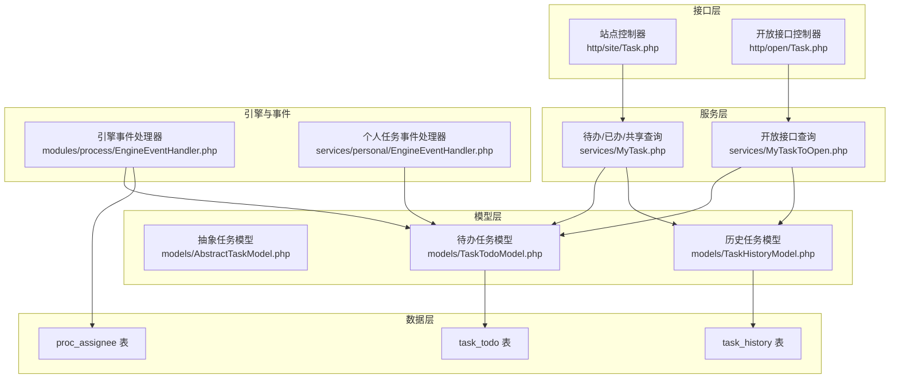
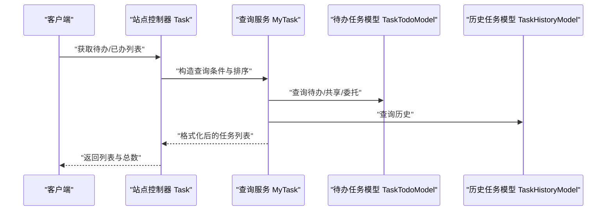
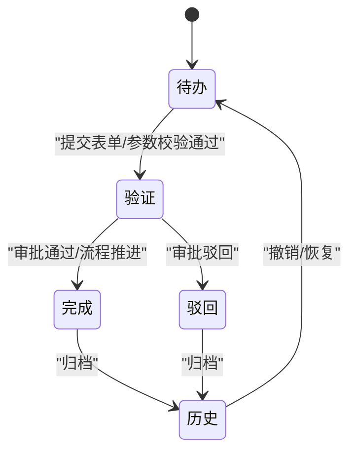
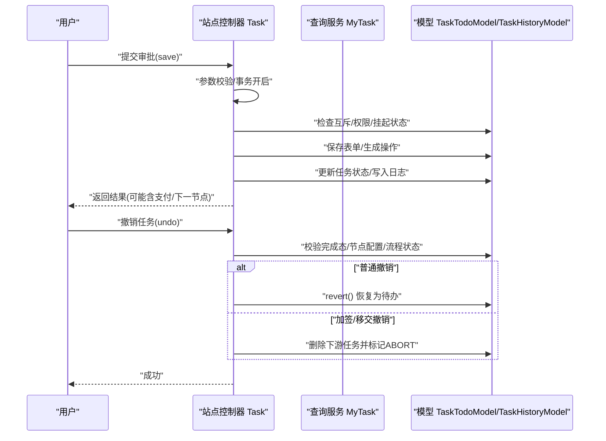
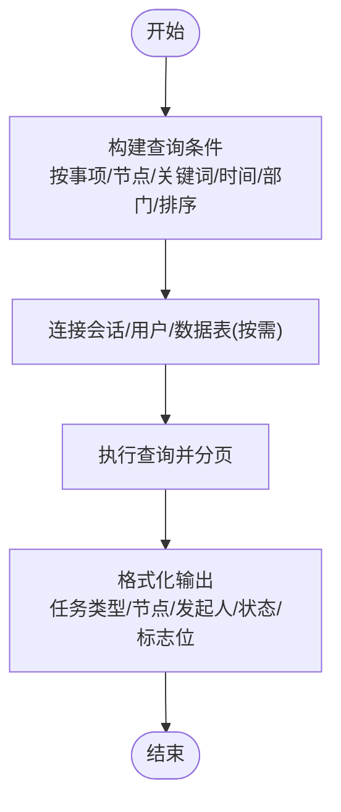
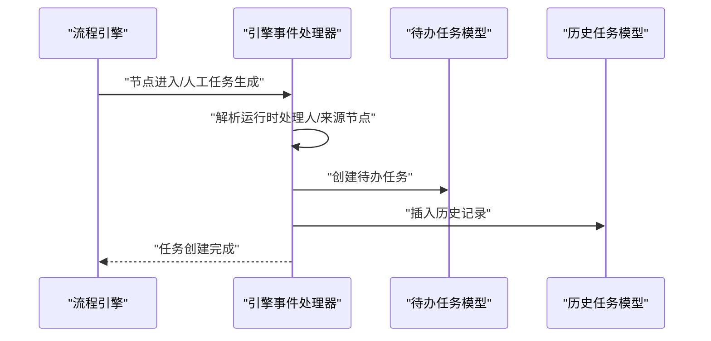
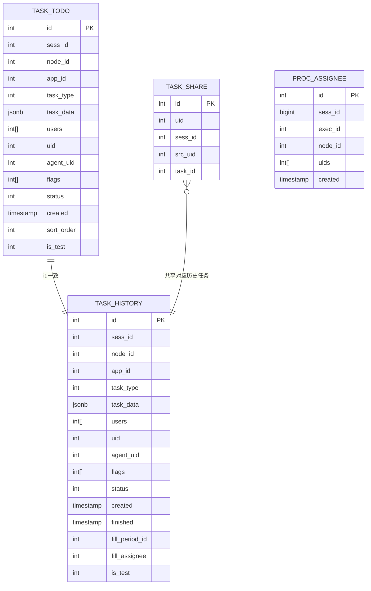
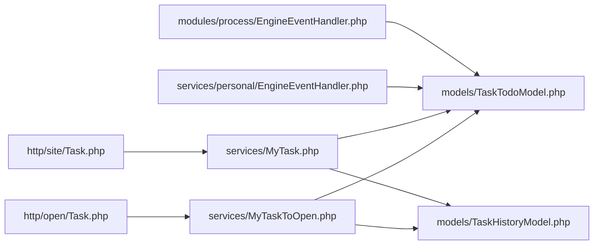

# 任务管理服务

<cite>
**本文引用的文件**
- [process/docs/sql/database.sql](file://process/docs/sql/database.sql)
- [process/src/models/AbstractTaskModel.php](file://process/src/models/AbstractTaskModel.php)
- [process/src/models/TaskTodoModel.php](file://process/src/models/TaskTodoModel.php)
- [process/src/models/TaskHistoryModel.php](file://process/src/models/TaskHistoryModel.php)
- [process/src/services/MyTask.php](file://process/src/services/MyTask.php)
- [process/src/services/MyTaskToOpen.php](file://process/src/services/MyTaskToOpen.php)
- [process/src/http/site/Task.php](file://process/src/http/site/Task.php)
- [process/src/http/open/Task.php](file://process/src/http/open/Task.php)
- [process/src/modules/process/EngineEventHandler.php](file://process/src/modules/process/EngineEventHandler.php)
- [process/src/services/personal/EngineEventHandler.php](file://process/src/services/personal/EngineEventHandler.php)
- [process/src/migrations/migration_20251119_090014_proc_assignee.php](file://process/src/migrations/migration_20251119_090014_proc_assignee.php)
- [process/src/engine/ProcExecute.php](file://process/src/engine/ProcExecute.php)
- [process/src/engine/ProcTask.php](file://process/src/engine/ProcTask.php)
- [process/src/engine/ProcessInstance.php](file://process/src/engine/ProcessInstance.php)
- [process/src/http/system/Process.php](file://process/src/http/system/Process.php)
</cite>

## 目录
1. [引言](#引言)
2. [项目结构](#项目结构)
3. [核心组件](#核心组件)
4. [架构总览](#架构总览)
5. [详细组件分析](#详细组件分析)
6. [依赖分析](#依赖分析)
7. [性能考量](#性能考量)
8. [故障排查指南](#故障排查指南)
9. [结论](#结论)
10. [附录](#附录)

## 引言
本文件面向 htdNew 项目的任务管理服务，系统性梳理任务生命周期管理、待办任务处理与历史任务查询机制，覆盖填单任务创建、个人任务管理、开放接口任务处理以及待办任务列表管理。文档重点阐述任务状态流转、任务分配策略、任务超时处理与异常处理机制，并给出接口设计要点、参数传递规范、性能优化建议与扩展开发指南，帮助开发者快速理解与高效迭代。

## 项目结构
任务管理服务围绕“待办任务表 task_todo”与“历史任务表 task_history”两大核心数据表展开，配合服务层 MyTask/MyTaskToOpen 提供统一的查询与格式化能力；站点控制器 http/site/Task.php 与开放接口 http/open/Task.php 提供对外服务；引擎事件处理器 modules/process/EngineEventHandler.php 与 personal/EngineEventHandler.php 负责流程节点触发的任务创建与个人任务创建；模型层 models/TaskTodoModel.php、models/TaskHistoryModel.php、models/AbstractTaskModel.php 封装任务状态、标志位、并发互斥与完成归档逻辑。

图表来源
- [process/src/http/site/Task.php](file://process/src/http/site/Task.php#L1-L120)
- [process/src/http/open/Task.php](file://process/src/http/open/Task.php#L1-L120)
- [process/src/services/MyTask.php](file://process/src/services/MyTask.php#L1-L120)
- [process/src/services/MyTaskToOpen.php](file://process/src/services/MyTaskToOpen.php#L372-L403)
- [process/src/modules/process/EngineEventHandler.php](file://process/src/modules/process/EngineEventHandler.php#L93-L112)
- [process/src/services/personal/EngineEventHandler.php](file://process/src/services/personal/EngineEventHandler.php#L78-L96)
- [process/src/models/AbstractTaskModel.php](file://process/src/models/AbstractTaskModel.php#L1-L40)
- [process/src/models/TaskTodoModel.php](file://process/src/models/TaskTodoModel.php#L1-L40)
- [process/src/models/TaskHistoryModel.php](file://process/src/models/TaskHistoryModel.php#L1-L40)
- [process/docs/sql/database.sql](file://process/docs/sql/database.sql#L335-L368)
- [process/src/migrations/migration_20251119_090014_proc_assignee.php](file://process/src/migrations/migration_20251119_090014_proc_assignee.php#L1-L32)

章节来源
- [process/src/http/site/Task.php](file://process/src/http/site/Task.php#L1-L120)
- [process/src/http/open/Task.php](file://process/src/http/open/Task.php#L1-L120)
- [process/src/services/MyTask.php](file://process/src/services/MyTask.php#L1-L120)
- [process/src/services/MyTaskToOpen.php](file://process/src/services/MyTaskToOpen.php#L372-L403)
- [process/src/models/TaskTodoModel.php](file://process/src/models/TaskTodoModel.php#L1-L40)
- [process/src/models/TaskHistoryModel.php](file://process/src/models/TaskHistoryModel.php#L1-L40)
- [process/docs/sql/database.sql](file://process/docs/sql/database.sql#L335-L368)
- [process/src/migrations/migration_20251119_090014_proc_assignee.php](file://process/src/migrations/migration_20251119_090014_proc_assignee.php#L1-L32)

## 核心组件
- 抽象任务模型 AbstractTaskModel：提供任务变量写入、互斥锁、跳转等通用能力，作为待办/历史任务模型的基类。
- 待办任务模型 TaskTodoModel：维护任务状态、标志位、并发互斥、完成归档至历史表等。
- 历史任务模型 TaskHistoryModel：维护历史任务全量数据、可撤销恢复、重报判定等。
- 查询服务 MyTask/MyTaskToOpen：统一构建查询条件、排序、格式化输出，支持待办/已办/共享/委托等多维度。
- 控制器 Task（站点/开放）：对外暴露任务列表、审批、撤销、移交、加签、处理加签、下一任务等接口。
- 引擎事件处理器 EngineEventHandler/PersonalEngineEventHandler：在流程节点进入或人工任务生成时创建任务。

章节来源
- [process/src/models/AbstractTaskModel.php](file://process/src/models/AbstractTaskModel.php#L1-L106)
- [process/src/models/TaskTodoModel.php](file://process/src/models/TaskTodoModel.php#L1-L120)
- [process/src/models/TaskHistoryModel.php](file://process/src/models/TaskHistoryModel.php#L1-L120)
- [process/src/services/MyTask.php](file://process/src/services/MyTask.php#L1-L120)
- [process/src/services/MyTaskToOpen.php](file://process/src/services/MyTaskToOpen.php#L372-L403)
- [process/src/http/site/Task.php](file://process/src/http/site/Task.php#L100-L205)
- [process/src/http/open/Task.php](file://process/src/http/open/Task.php#L38-L120)
- [process/src/modules/process/EngineEventHandler.php](file://process/src/modules/process/EngineEventHandler.php#L93-L112)
- [process/src/services/personal/EngineEventHandler.php](file://process/src/services/personal/EngineEventHandler.php#L78-L96)

## 架构总览
任务管理服务采用“控制器-服务-模型-数据库”的分层架构。控制器负责参数校验与事务控制，服务层负责复杂查询与格式化，模型层负责状态与标志位管理，数据库层提供 task_todo 与 task_history 的持久化支撑。

图表来源
- [process/src/http/site/Task.php](file://process/src/http/site/Task.php#L52-L101)
- [process/src/services/MyTask.php](file://process/src/services/MyTask.php#L118-L180)
- [process/src/models/TaskTodoModel.php](file://process/src/models/TaskTodoModel.php#L248-L288)
- [process/src/models/TaskHistoryModel.php](file://process/src/models/TaskHistoryModel.php#L1-L64)

章节来源
- [process/src/http/site/Task.php](file://process/src/http/site/Task.php#L52-L101)
- [process/src/services/MyTask.php](file://process/src/services/MyTask.php#L118-L180)

## 详细组件分析

### 任务生命周期与状态流转
- 生命周期阶段：创建（待办）、处理（验证/完成）、归档（历史）、撤销/恢复。
- 状态定义：
  - 待办任务：INIT、VALIDATE、COMPLETE、LOCK、SUSPEND。
  - 历史任务：INIT、COMPLETE、ABORT、SUSPEND。
- 关键流程：
  - 完成：待办任务 complete() 归档至历史并删除待办记录，必要时解除互斥锁。
  - 撤销：历史任务 revert() 恢复为待办，清理完成态字段与代理信息。
  - 锁定：批量审批时对任务加锁，避免并发冲突。
  - 跳转：支持跳转到目标节点，完成当前任务并归档。

图表来源
- [process/src/models/TaskTodoModel.php](file://process/src/models/TaskTodoModel.php#L164-L211)
- [process/src/models/TaskHistoryModel.php](file://process/src/models/TaskHistoryModel.php#L131-L168)

章节来源
- [process/src/models/TaskTodoModel.php](file://process/src/models/TaskTodoModel.php#L164-L211)
- [process/src/models/TaskHistoryModel.php](file://process/src/models/TaskHistoryModel.php#L131-L168)

### 待办任务处理（站点接口）
- 列表查询：支持按事项、节点、关键词、时间范围、部门、审批人/岗位、排序方式等过滤。
- 审批保存：表单数据与审批意见持久化，支持暂存、两步表单步骤动作、支付前置校验。
- 审批提交：根据操作类型与节点配置决定下一处理人、是否需要支付、是否允许下一步。
- 撤销：仅限已完成且允许撤销的历史任务，支持按操作类型区分流程撤销与加签/移交等分支撤销。
- 移交他人：复制待办为新任务，更新历史 task_data 记录移交关系，写入日志与事件派发。
- 加签/处理加签：支持前加签、后加签、并行加签，校验重复加签人，写入日志与通知。
- 下一任务：基于用户待办集合与去重策略返回下一条任务。

图表来源
- [process/src/http/site/Task.php](file://process/src/http/site/Task.php#L111-L205)
- [process/src/http/site/Task.php](file://process/src/http/site/Task.php#L311-L364)
- [process/src/http/site/Task.php](file://process/src/http/site/Task.php#L366-L480)
- [process/src/http/site/Task.php](file://process/src/http/site/Task.php#L482-L747)
- [process/src/http/site/Task.php](file://process/src/http/site/Task.php#L749-L784)
- [process/src/models/TaskTodoModel.php](file://process/src/models/TaskTodoModel.php#L164-L211)
- [process/src/models/TaskHistoryModel.php](file://process/src/models/TaskHistoryModel.php#L131-L168)

章节来源
- [process/src/http/site/Task.php](file://process/src/http/site/Task.php#L111-L205)
- [process/src/http/site/Task.php](file://process/src/http/site/Task.php#L311-L364)
- [process/src/http/site/Task.php](file://process/src/http/site/Task.php#L366-L480)
- [process/src/http/site/Task.php](file://process/src/http/site/Task.php#L482-L747)
- [process/src/http/site/Task.php](file://process/src/http/site/Task.php#L749-L784)

### 历史任务查询（站点与开放接口）
- 站点接口 Task：支持按事项、节点、关键词、时间范围、部门、审批人/岗位、排序方式、测试数据等过滤，返回格式化后的任务列表与总数。
- 开放接口 Task：支持按学工号/工号查询他人任务，批量节点查询、历史详情查询、用户统计等。

图表来源
- [process/src/services/MyTask.php](file://process/src/services/MyTask.php#L338-L498)
- [process/src/services/MyTask.php](file://process/src/services/MyTask.php#L516-L585)
- [process/src/http/open/Task.php](file://process/src/http/open/Task.php#L38-L120)
- [process/src/http/open/Task.php](file://process/src/http/open/Task.php#L156-L223)
- [process/src/http/open/Task.php](file://process/src/http/open/Task.php#L225-L261)

章节来源
- [process/src/services/MyTask.php](file://process/src/services/MyTask.php#L338-L498)
- [process/src/services/MyTask.php](file://process/src/services/MyTask.php#L516-L585)
- [process/src/http/open/Task.php](file://process/src/http/open/Task.php#L38-L120)
- [process/src/http/open/Task.php](file://process/src/http/open/Task.php#L156-L223)
- [process/src/http/open/Task.php](file://process/src/http/open/Task.php#L225-L261)

### 填单任务创建与个人任务管理
- 填单任务：由引擎事件处理器在流程节点触发时创建，写入 task_todo 并同步历史记录。
- 个人任务：由 personal/EngineEventHandler 在个人任务节点创建，支持多实例运行时的分配策略。
- 分配策略：若未显式指定处理人，则从运行时上下文动态解析；支持多实例与竞争模式下的变量写入。

图表来源
- [process/src/modules/process/EngineEventHandler.php](file://process/src/modules/process/EngineEventHandler.php#L93-L112)
- [process/src/services/personal/EngineEventHandler.php](file://process/src/services/personal/EngineEventHandler.php#L78-L96)
- [process/src/http/site/Task.php](file://process/src/http/site/Task.php#L410-L446)

章节来源
- [process/src/modules/process/EngineEventHandler.php](file://process/src/modules/process/EngineEventHandler.php#L93-L112)
- [process/src/services/personal/EngineEventHandler.php](file://process/src/services/personal/EngineEventHandler.php#L78-L96)
- [process/src/http/site/Task.php](file://process/src/http/site/Task.php#L410-L446)

### 任务分配策略与并发控制
- 分配策略：优先使用显式 assignee，否则从运行时上下文解析；多实例节点支持会签/竞争变量写入。
- 并发控制：基于 Redis 的任务互斥锁，防止同一任务被多人同时处理；流程级互斥与会话级互斥联合保护。
- 代理与加签：支持代处理、加签/处理加签，任务数据中记录源任务与下游任务 ID，便于撤销与审计。

章节来源
- [process/src/models/AbstractTaskModel.php](file://process/src/models/AbstractTaskModel.php#L78-L106)
- [process/src/models/TaskTodoModel.php](file://process/src/models/TaskTodoModel.php#L148-L163)
- [process/src/http/site/Task.php](file://process/src/http/site/Task.php#L366-L480)

### 任务超时处理与标志位
- 超时标志：待办任务支持 FLAG_TIMEOUT 标志位，便于识别与统计超时任务。
- 超时统计：开放接口提供用户统计，可结合会话状态标志位统计超时次数。
- 催办：支持 FLAG_REMIND 标志位与提醒状态枚举，控制催办频率与可见性。

章节来源
- [process/src/models/TaskTodoModel.php](file://process/src/models/TaskTodoModel.php#L22-L44)
- [process/src/http/open/Task.php](file://process/src/http/open/Task.php#L265-L335)
- [process/src/http/system/Process.php](file://process/src/http/system/Process.php#L117-L141)

### 数据模型与索引
- 任务表结构：task_todo 与 task_history 包含任务类型、参与者、标志位、状态、创建/完成时间等字段；task_share 用于任务共享。
- 索引策略：对 node_id、uid、sess_id、fill_period_id 等常用查询字段建立索引，提升查询性能。
- 分配记录：proc_assignee 表记录会话-节点-处理人映射，支持查询与审计。

图表来源
- [process/docs/sql/database.sql](file://process/docs/sql/database.sql#L335-L368)
- [process/src/migrations/migration_20251119_090014_proc_assignee.php](file://process/src/migrations/migration_20251119_090014_proc_assignee.php#L1-L32)

章节来源
- [process/docs/sql/database.sql](file://process/docs/sql/database.sql#L335-L368)
- [process/src/migrations/migration_20251119_090014_proc_assignee.php](file://process/src/migrations/migration_20251119_090014_proc_assignee.php#L1-L32)

## 依赖分析
- 控制器依赖服务层进行复杂查询与格式化，减少控制器内联逻辑。
- 服务层依赖模型层的状态与标志位管理，确保业务一致性。
- 引擎事件处理器依赖会话与节点上下文，动态解析处理人并创建任务。
- 数据层通过索引与分表策略（如 task_share、proc_assignee）支撑高并发查询。

图表来源
- [process/src/http/site/Task.php](file://process/src/http/site/Task.php#L1-L120)
- [process/src/http/open/Task.php](file://process/src/http/open/Task.php#L1-L120)
- [process/src/services/MyTask.php](file://process/src/services/MyTask.php#L1-L120)
- [process/src/services/MyTaskToOpen.php](file://process/src/services/MyTaskToOpen.php#L372-L403)
- [process/src/modules/process/EngineEventHandler.php](file://process/src/modules/process/EngineEventHandler.php#L93-L112)
- [process/src/services/personal/EngineEventHandler.php](file://process/src/services/personal/EngineEventHandler.php#L78-L96)
- [process/src/models/TaskTodoModel.php](file://process/src/models/TaskTodoModel.php#L1-L40)
- [process/src/models/TaskHistoryModel.php](file://process/src/models/TaskHistoryModel.php#L1-L40)

章节来源
- [process/src/http/site/Task.php](file://process/src/http/site/Task.php#L1-L120)
- [process/src/http/open/Task.php](file://process/src/http/open/Task.php#L1-L120)
- [process/src/services/MyTask.php](file://process/src/services/MyTask.php#L1-L120)
- [process/src/services/MyTaskToOpen.php](file://process/src/services/MyTaskToOpen.php#L372-L403)
- [process/src/models/TaskTodoModel.php](file://process/src/models/TaskTodoModel.php#L1-L40)
- [process/src/models/TaskHistoryModel.php](file://process/src/models/TaskHistoryModel.php#L1-L40)

## 性能考量
- 查询优化
  - 使用服务层统一构建查询条件，避免重复 JOIN 与冗余字段查询。
  - 对高频过滤字段（node_id、uid、sess_id、fill_period_id）建立索引，减少全表扫描。
  - 分页查询与排序分离，避免大偏移量导致的慢查询。
- 并发控制
  - 任务互斥锁采用 Redis NX+EX 策略，避免死锁与长时间占用。
  - 会话级互斥与流程令牌上下文结合，降低并发冲突概率。
- 写入优化
  - 批量审批时对任务加锁，减少无效处理与重复写入。
  - 完成归档采用原子更新与删除，保证一致性与性能平衡。
- 缓存与事件
  - 事件派发延迟到事务成功后执行，减少阻塞。
  - 会话与节点缓存命中率提升，降低数据库压力。

## 故障排查指南
- 权限与互斥
  - “没有审批权限/任务已处理/任务正被他人处理/流程已挂起/当前任务正在加签中”等错误提示，需检查用户权限、任务状态、互斥锁与流程状态。
- 审批异常
  - “找不到合适的出口/处理人缺失”：检查节点配置与分配策略，确认下一节点是否存在有效处理人。
- 撤销失败
  - “未审批的任务无法收回/当前环节禁止收回/流程已被他人修改”：确认历史任务完成态、节点配置与会话状态。
- 移交/加签异常
  - “重复加签人/加签模式不匹配”：核对加签人列表与节点配置，确保不重复加签。

章节来源
- [process/src/http/site/Task.php](file://process/src/http/site/Task.php#L206-L283)
- [process/src/http/site/Task.php](file://process/src/http/site/Task.php#L284-L364)
- [process/src/http/site/Task.php](file://process/src/http/site/Task.php#L366-L480)
- [process/src/http/site/Task.php](file://process/src/http/site/Task.php#L482-L747)
- [process/src/http/open/Task.php](file://process/src/http/open/Task.php#L74-L131)
- [process/src/http/open/Task.php](file://process/src/http/open/Task.php#L133-L223)

## 结论
htdNew 任务管理服务以 task_todo 与 task_history 为核心，结合服务层统一查询与格式化、控制器完备的业务流程、引擎事件驱动的任务创建与个人任务管理，形成了完整的任务生命周期闭环。通过严格的并发控制、标志位管理与索引优化，系统在高并发场景下具备良好的稳定性与可扩展性。建议在后续迭代中进一步完善任务超时统计与可视化、增强批量审批的可观测性与审计能力。

## 附录
- 引擎与流程对象
  - 引擎执行对象 ProcExecute、流程任务 ProcTask、流程实例 ProcessInstance 作为引擎层基础类，保留序列化兼容性。

章节来源
- [process/src/engine/ProcExecute.php](file://process/src/engine/ProcExecute.php#L1-L11)
- [process/src/engine/ProcTask.php](file://process/src/engine/ProcTask.php#L1-L11)
- [process/src/engine/ProcessInstance.php](file://process/src/engine/ProcessInstance.php#L1-L11)