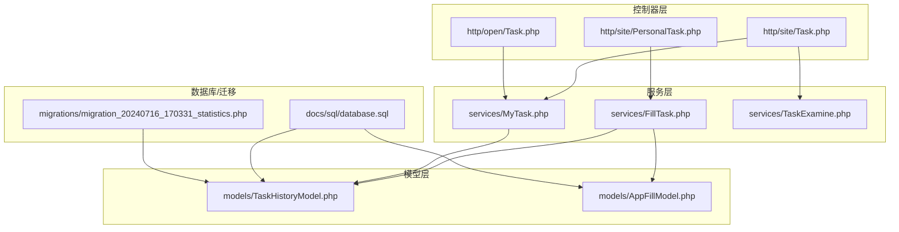
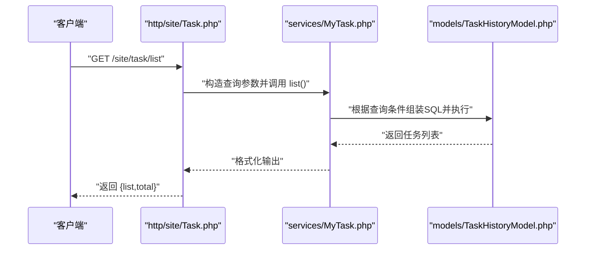
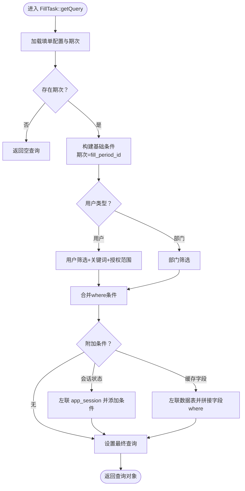
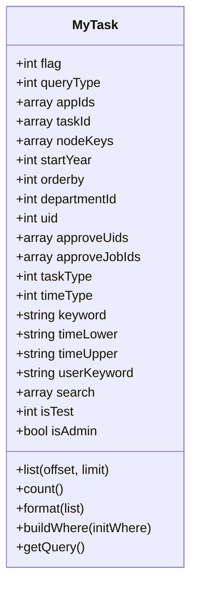
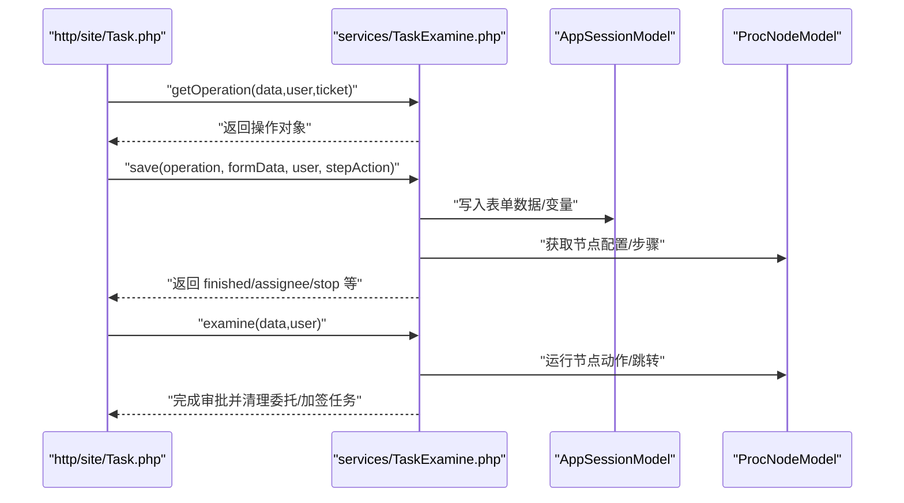
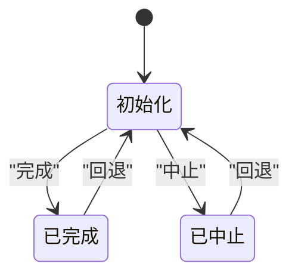
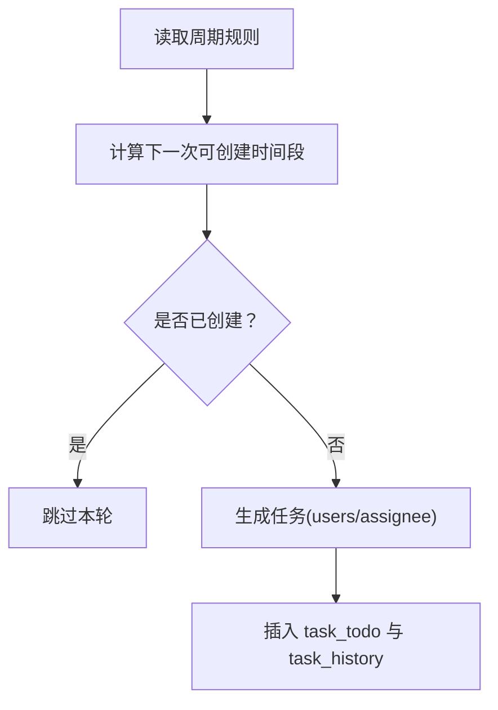
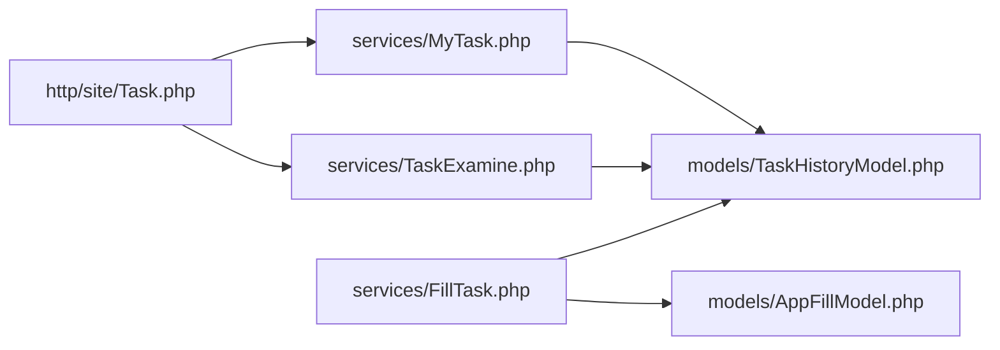

# 填单任务服务

<cite>
**本文引用的文件**
- [FillTask.php](file://process/src/services/FillTask.php)
- [MyTask.php](file://process/src/services/MyTask.php)
- [Task.php](file://process/src/http/site/Task.php)
- [PersonalTask.php](file://process/src/http/site/PersonalTask.php)
- [TaskHistoryModel.php](file://process/src/models/TaskHistoryModel.php)
- [AppFillModel.php](file://process/src/models/AppFillModel.php)
- [Task.php（open）](file://process/src/http/open/Task.php)
- [TaskExamine.php](file://process/src/services/TaskExamine.php)
- [database.sql](file://process/docs/sql/database.sql)
- [migration_20240716_170331_statistics.php](file://process/migrations/migration_20240716_170331_statistics.php)
</cite>

## 目录
1. [引言](#引言)
2. [项目结构](#项目结构)
3. [核心组件](#核心组件)
4. [架构总览](#架构总览)
5. [详细组件分析](#详细组件分析)
6. [依赖关系分析](#依赖关系分析)
7. [性能考量](#性能考量)
8. [故障排查指南](#故障排查指南)
9. [结论](#结论)
10. [附录](#附录)

## 引言
本文件面向 htdNew 项目的“填单任务服务”，系统化梳理填单任务的生命周期管理、状态跟踪与权限控制机制，覆盖查询、统计分析、用户/部门筛选与权限验证，并阐述任务分配策略与周期性任务管理。文档同时给出接口设计、参数传递与异常处理机制，提供性能优化建议与扩展开发指南，帮助开发者快速理解与高效迭代。

## 项目结构
填单任务服务主要由以下层次构成：
- 控制器层：对外提供任务列表、审批、填单提交等接口
- 服务层：封装查询、格式化、权限校验、统计分析等业务逻辑
- 模型层：任务历史、任务待办、应用填单、周期期次等数据模型
- 数据库与迁移：任务与统计相关表结构定义与初始化

图表来源
- [Task.php](file://process/src/http/site/Task.php#L52-L101)
- [PersonalTask.php](file://process/src/http/site/PersonalTask.php#L1-L200)
- [Task.php（open）](file://process/src/http/open/Task.php)
- [FillTask.php](file://process/src/services/FillTask.php#L1-L379)
- [MyTask.php](file://process/src/services/MyTask.php#L1-L617)
- [TaskExamine.php](file://process/src/services/TaskExamine.php#L1-L266)
- [TaskHistoryModel.php](file://process/src/models/TaskHistoryModel.php#L1-L270)
- [AppFillModel.php](file://process/src/models/AppFillModel.php#L1-L220)
- [database.sql](file://process/docs/sql/database.sql#L335-L368)
- [migration_20240716_170331_statistics.php](file://process/migrations/migration_20240716_170331_statistics.php#L60-L87)

章节来源
- [Task.php](file://process/src/http/site/Task.php#L52-L101)
- [FillTask.php](file://process/src/services/FillTask.php#L1-L379)
- [MyTask.php](file://process/src/services/MyTask.php#L1-L617)
- [TaskHistoryModel.php](file://process/src/models/TaskHistoryModel.php#L1-L270)
- [AppFillModel.php](file://process/src/models/AppFillModel.php#L1-L220)
- [database.sql](file://process/docs/sql/database.sql#L335-L368)
- [migration_20240716_170331_statistics.php](file://process/migrations/migration_20240716_170331_statistics.php#L60-L87)

## 核心组件
- 填单查询与统计服务（FillTask）
  - 支持按任务/会话状态、周期期次、用户/部门筛选、关键词搜索、缓存字段联动查询与格式化输出
  - 提供统计接口，按状态聚合计数
- 待办/已办/共享任务服务（MyTask）
  - 支持多种查询类型、排序方式、时间维度、节点关键字过滤、审批人/岗位过滤、测试态控制
  - 对填单任务与流程任务分别格式化输出
- 任务审批服务（TaskExamine）
  - 表单保存、多步表单推进、审批操作构建、委托与加签处理、节点变量设置、前后置触发器
- 任务模型（TaskHistoryModel）
  - 定义任务状态、类型、权限校验、重报判定、回退至待办等能力
- 填报模型（AppFillModel）
  - 定义周期规则、任务分配策略（用户/部门）、创建周期期次任务、权限集合
- 控制器（Task、PersonalTask、Open/Task）
  - 对外暴露任务列表、审批、填单提交、统计等接口；负责参数解析、事务控制、异常处理

章节来源
- [FillTask.php](file://process/src/services/FillTask.php#L1-L379)
- [MyTask.php](file://process/src/services/MyTask.php#L1-L617)
- [TaskExamine.php](file://process/src/services/TaskExamine.php#L1-L266)
- [TaskHistoryModel.php](file://process/src/models/TaskHistoryModel.php#L1-L270)
- [AppFillModel.php](file://process/src/models/AppFillModel.php#L1-L220)
- [Task.php](file://process/src/http/site/Task.php#L103-L197)
- [PersonalTask.php](file://process/src/http/site/PersonalTask.php#L1-L200)
- [Task.php（open）](file://process/src/http/open/Task.php)

## 架构总览
填单任务服务围绕“控制器—服务—模型—数据库”的分层架构展开，关键交互如下：

图表来源
- [Task.php](file://process/src/http/site/Task.php#L52-L101)
- [MyTask.php](file://process/src/services/MyTask.php#L118-L149)
- [TaskHistoryModel.php](file://process/src/models/TaskHistoryModel.php#L1-L270)

章节来源
- [Task.php](file://process/src/http/site/Task.php#L52-L101)
- [MyTask.php](file://process/src/services/MyTask.php#L118-L149)
- [TaskHistoryModel.php](file://process/src/models/TaskHistoryModel.php#L1-L270)

## 详细组件分析

### 填单查询与统计服务（FillTask）
- 生命周期与状态
  - 任务状态映射：未填报、已填报、无效
  - 通过任务历史表记录状态变化与完成时间
- 查询与筛选
  - 支持按周期期次、任务状态、会话状态、用户/部门、关键词、缓存字段条件等组合查询
  - 用户筛选支持部门树展开与关键词搜索
  - 权限控制：基于应用编辑权限与填单授权范围，限制可见用户集合
- 统计分析
  - 按周期期次聚合统计未填报/已填报数量
- 输出格式化
  - 将任务记录格式化为统一字段，包含姓名、工号、部门、会话状态、任务状态、完成时间等

图表来源
- [FillTask.php](file://process/src/services/FillTask.php#L141-L208)

章节来源
- [FillTask.php](file://process/src/services/FillTask.php#L51-L56)
- [FillTask.php](file://process/src/services/FillTask.php#L78-L91)
- [FillTask.php](file://process/src/services/FillTask.php#L93-L97)
- [FillTask.php](file://process/src/services/FillTask.php#L99-L140)
- [FillTask.php](file://process/src/services/FillTask.php#L141-L208)
- [FillTask.php](file://process/src/services/FillTask.php#L210-L249)
- [FillTask.php](file://process/src/services/FillTask.php#L251-L379)

### 待办/已办/共享任务服务（MyTask）
- 查询类型与排序
  - 支持待办、已办、共享、委托待办、委托已办五种类型
  - 支持按接收时间、自定义排序、完成时间等多种排序方式
- 筛选条件
  - 事项、节点、年份、部门、关键词、发起人、审批人/岗位、测试态等
  - 填单任务关键词支持关联填单期次检索
- 输出格式
  - 对填单任务与流程任务分别格式化，包含应用信息、节点信息、会话状态、任务标志、是否已读等

图表来源
- [MyTask.php](file://process/src/services/MyTask.php#L1-L617)

章节来源
- [MyTask.php](file://process/src/services/MyTask.php#L1-L117)
- [MyTask.php](file://process/src/services/MyTask.php#L118-L149)
- [MyTask.php](file://process/src/services/MyTask.php#L338-L342)
- [MyTask.php](file://process/src/services/MyTask.php#L344-L498)
- [MyTask.php](file://process/src/services/MyTask.php#L516-L585)

### 任务审批服务（TaskExamine）
- 表单保存与多步表单
  - 根据节点场景与表单授权决定是否必填
  - 多步表单推进/暂停/完成状态维护
- 审批操作与权限
  - 构建审批操作对象，校验加签人员合法性
  - 设置节点变量、运行前置触发器、执行节点动作
- 委托与加签
  - 支持委托审批与加签流程，清理相关任务与状态

图表来源
- [TaskExamine.php](file://process/src/services/TaskExamine.php#L53-L115)
- [TaskExamine.php](file://process/src/services/TaskExamine.php#L169-L211)
- [TaskExamine.php](file://process/src/services/TaskExamine.php#L228-L265)
- [Task.php](file://process/src/http/site/Task.php#L103-L197)

章节来源
- [TaskExamine.php](file://process/src/services/TaskExamine.php#L1-L266)
- [Task.php](file://process/src/http/site/Task.php#L103-L197)

### 任务模型（TaskHistoryModel）
- 状态与类型
  - 类型：流程、加签、填单
  - 状态：初始、完成、中止、挂起
- 权限与重报
  - 权限校验：任务参与人、发起人、委托人、流程监控者
  - 重报判定：依据填单与期次结束时间、会话状态
- 回退与撤销
  - 回退至待办：还原字段并派发接收事件
  - 中止：更新状态与完成时间并删除待办/委托任务

图表来源
- [TaskHistoryModel.php](file://process/src/models/TaskHistoryModel.php#L19-L23)
- [TaskHistoryModel.php](file://process/src/models/TaskHistoryModel.php#L100-L123)
- [TaskHistoryModel.php](file://process/src/models/TaskHistoryModel.php#L131-L168)

章节来源
- [TaskHistoryModel.php](file://process/src/models/TaskHistoryModel.php#L1-L270)

### 填报模型（AppFillModel）
- 周期规则与任务创建
  - 支持日、周、月、年、自定义周期，计算下一次可创建时间段
  - 任务创建：按用户或部门分配，生成待办与历史记录
- 权限与范围
  - 编辑权限与填单授权共同决定可见填单集合
- 用户/部门分配
  - 用户类型：直接分配给用户
  - 部门类型：结合岗位与部门关系生成分配集合

图表来源
- [AppFillModel.php](file://process/src/models/AppFillModel.php#L127-L170)
- [AppFillModel.php](file://process/src/models/AppFillModel.php#L181-L201)
- [AppFillModel.php](file://process/src/models/AppFillModel.php#L204-L220)

章节来源
- [AppFillModel.php](file://process/src/models/AppFillModel.php#L1-L220)

### 控制器（Task、PersonalTask、Open/Task）
- 任务列表
  - 解析查询参数，构造 MyTask 查询，返回分页列表与总数
- 审批与填单提交
  - 参数校验、事务控制、表单保存、多步推进、委托/加签处理、前后置触发器
- 填单大厅
  - 提供个人修改统计与列表查询接口

章节来源
- [Task.php](file://process/src/http/site/Task.php#L52-L101)
- [Task.php](file://process/src/http/site/Task.php#L103-L197)
- [Task.php](file://process/src/http/site/Task.php#L932-L953)
- [PersonalTask.php](file://process/src/http/site/PersonalTask.php#L1-L200)
- [Task.php（open）](file://process/src/http/open/Task.php)

## 依赖关系分析
- 服务层依赖
  - FillTask 依赖 TaskHistoryModel、AppFillModel、AppFillPeriodModel、UsersModel、DepartmentModel、AppSessionModel、DataTableModel 等
  - MyTask 依赖 TaskTodoModel、TaskHistoryModel、AppSessionModel、UsersModel、DepartmentModel、ProcNodeModel、AppModel 等
  - TaskExamine 依赖 TaskTodoModel、AppSessionModel、ProcNodeModel、AppVersionModel、TriggerModel 等
- 控制器依赖
  - Task 控制器依赖 MyTask、TaskExamine、TaskTodoModel、TaskHistoryModel 等
  - PersonalTask 控制器依赖 PersonalSessionModel、PersonalTaskModel 等
- 数据层依赖
  - 任务历史与待办表、应用填单与期次表、统计数据表等

图表来源
- [Task.php](file://process/src/http/site/Task.php#L52-L101)
- [MyTask.php](file://process/src/services/MyTask.php#L1-L617)
- [TaskExamine.php](file://process/src/services/TaskExamine.php#L1-L266)
- [FillTask.php](file://process/src/services/FillTask.php#L1-L379)
- [TaskHistoryModel.php](file://process/src/models/TaskHistoryModel.php#L1-L270)
- [AppFillModel.php](file://process/src/models/AppFillModel.php#L1-L220)

章节来源
- [Task.php](file://process/src/http/site/Task.php#L52-L101)
- [FillTask.php](file://process/src/services/FillTask.php#L1-L379)
- [MyTask.php](file://process/src/services/MyTask.php#L1-L617)
- [TaskExamine.php](file://process/src/services/TaskExamine.php#L1-L266)
- [TaskHistoryModel.php](file://process/src/models/TaskHistoryModel.php#L1-L270)
- [AppFillModel.php](file://process/src/models/AppFillModel.php#L1-L220)

## 性能考量
- 查询优化
  - 使用索引：任务历史表对 uid/node_id/sess_id/fill_period_id 等建立索引
  - 关联查询：尽量使用 left join 并限定选择列，避免全表扫描
  - 分页与总数：先 count 再分页，避免大结果集全量扫描
- 缓存与字段联动
  - 填单查询支持缓存字段设置，按可见字段拉取数据表并做内连接，减少二次查询
- 统计表
  - 提供按应用/节点/用户的统计表，便于报表与分析场景快速查询
- 事务与锁
  - 审批与填单提交使用事务包裹，失败回滚，避免中间态数据
- 批处理
  - 批量审批时对特定控件（如手写签名）做增量合并，减少重复写入

章节来源
- [database.sql](file://process/docs/sql/database.sql#L1313-L1379)
- [FillTask.php](file://process/src/services/FillTask.php#L186-L208)
- [FillTask.php](file://process/src/services/FillTask.php#L355-L379)
- [TaskExamine.php](file://process/src/services/TaskExamine.php#L144-L157)
- [Task.php](file://process/src/http/site/Task.php#L133-L197)

## 故障排查指南
- 权限相关
  - 若提示“没有权限”，检查用户是否具备应用编辑权限或填单授权范围内的部门/关系
  - 用户类型筛选时若返回空数组，表示在授权范围内无匹配用户
- 参数错误
  - 审批接口缺少部门参数或加签人员已在审批人/加签人列表中，需修正后再提交
- 任务状态
  - 已完成/已中止的任务不可再次处理，需确认任务状态或尝试回退
- 填单期次
  - 期次不存在或未发布会导致查询为空，需核对填单配置与期次编号

章节来源
- [FillTask.php](file://process/src/services/FillTask.php#L309-L352)
- [TaskExamine.php](file://process/src/services/TaskExamine.php#L228-L265)
- [TaskHistoryModel.php](file://process/src/models/TaskHistoryModel.php#L71-L86)
- [AppFillModel.php](file://process/src/models/AppFillModel.php#L64-L82)

## 结论
填单任务服务通过清晰的分层设计与完善的权限控制，实现了从查询、筛选、统计到审批、回退、重报的完整生命周期管理。配合统计表与缓存字段联动，能够满足高并发下的填单大厅与报表需求。建议在扩展新功能时遵循现有分层与权限约定，确保一致性与可维护性。

## 附录

### 接口设计与参数传递
- 任务列表（站点）
  - 方法：GET
  - 路径：/site/task/list
  - 查询参数：query_type、task_type、flag、app_id[]、start_year、orderby、department_id、time_type、keyword、time_lower、time_upper、user_keyword、node_keys[]、search、is_test
  - 返回：list、total
- 审批/填单提交（站点）
  - 方法：POST
  - 路径：/site/task/save
  - 请求体：task_id、form_data、examine_data、step_action、two_factor_ticket、temp_save
  - 返回：根据审批流程返回下一步处理信息或完成状态
- 填单大厅（站点）
  - 方法：GET/POST
  - 路径：/site/personal/task/*
  - 返回：个人修改统计、列表与明细

章节来源
- [Task.php](file://process/src/http/site/Task.php#L52-L101)
- [Task.php](file://process/src/http/site/Task.php#L103-L197)
- [PersonalTask.php](file://process/src/http/site/PersonalTask.php#L1-L200)

### 异常处理机制
- 参数校验：控制器层对必填参数进行校验，返回参数错误
- 权限校验：服务层在查询与操作前进行权限判断，抛出用户异常
- 业务异常：审批阶段捕获前置触发器异常，返回友好提示
- 事务回滚：审批与填单提交在异常时回滚，保证数据一致性

章节来源
- [Task.php](file://process/src/http/site/Task.php#L133-L197)
- [TaskExamine.php](file://process/src/services/TaskExamine.php#L228-L265)
- [FillTask.php](file://process/src/services/FillTask.php#L66-L76)

### 扩展开发指南
- 新增筛选条件
  - 在 FillTask 的查询构建处增加 where 条件分支，并在格式化输出处补充字段映射
- 新增统计维度
  - 在统计表结构中新增字段，迁移脚本中创建索引，服务层按需聚合
- 新增周期策略
  - 在 AppFillModel 的周期函数中新增策略分支，计算下一次可创建时间段
- 新增审批动作
  - 在 TaskExamine 的操作构建与节点动作执行处扩展，确保前后置触发器幂等

章节来源
- [FillTask.php](file://process/src/services/FillTask.php#L141-L208)
- [migration_20240716_170331_statistics.php](file://process/migrations/migration_20240716_170331_statistics.php#L60-L87)
- [AppFillModel.php](file://process/src/models/AppFillModel.php#L127-L170)
- [TaskExamine.php](file://process/src/services/TaskExamine.php#L169-L211)