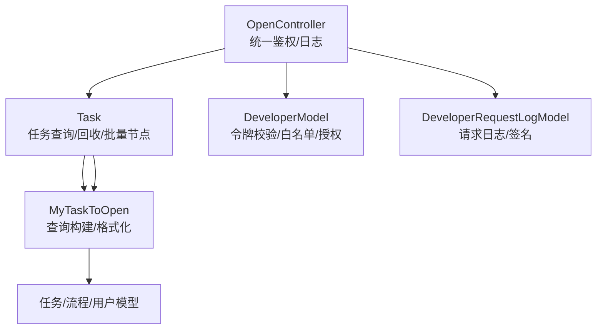
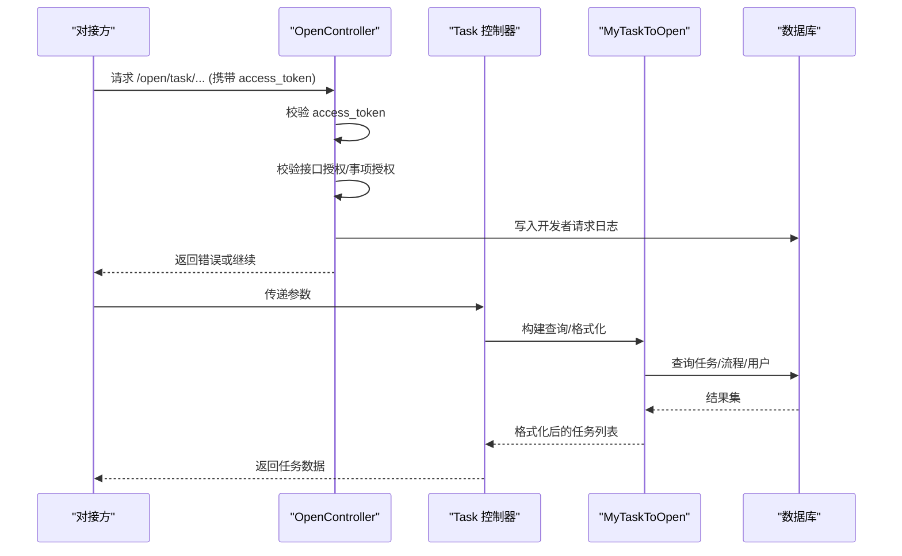
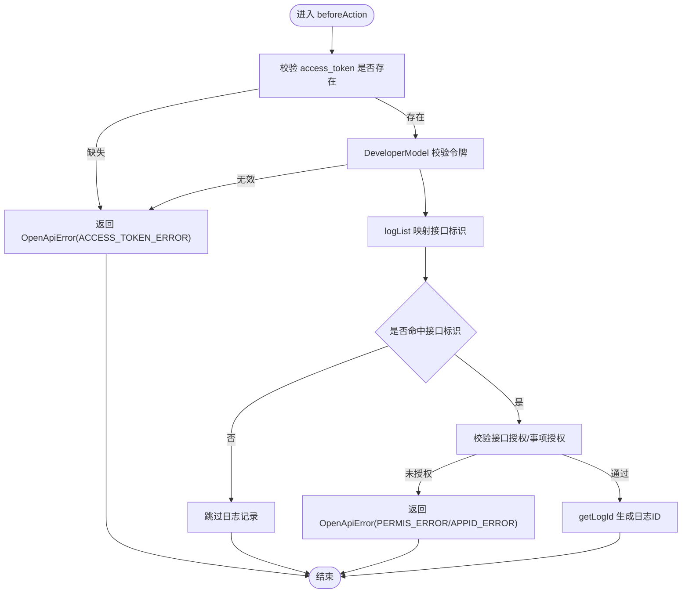
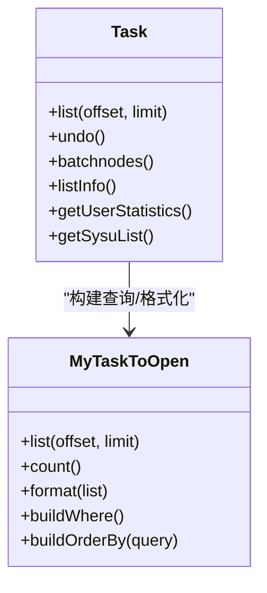
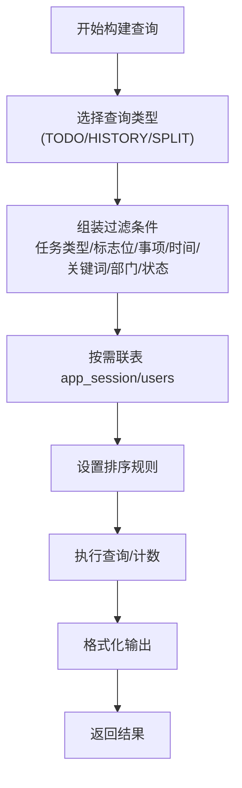
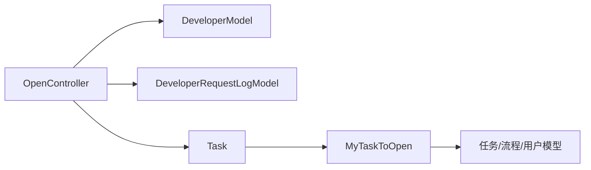

# 开放接口任务服务

<cite>
**本文引用的文件**
- [OpenController.php](file://process/src/http/OpenController.php)
- [Task.php](file://process/src/http/open/Task.php)
- [MyTaskToOpen.php](file://process/src/services/MyTaskToOpen.php)
- [DeveloperModel.php](file://process/src/models/DeveloperModel.php)
- [DeveloperRequestLogModel.php](file://process/src/models/DeveloperRequestLogModel.php)
- [OpenApiError.php](file://process/src/response/OpenApiError.php)
- [api.php](file://process/src/config/api.php)
- [SecurityHelper.php](file://process/src/helpers/SecurityHelper.php)
</cite>

## 目录
1. [简介](#简介)
2. [项目结构](#项目结构)
3. [核心组件](#核心组件)
4. [架构总览](#架构总览)
5. [详细组件分析](#详细组件分析)
6. [依赖分析](#依赖分析)
7. [性能考量](#性能考量)
8. [故障排查指南](#故障排查指南)
9. [结论](#结论)
10. [附录](#附录)

## 简介
本文件面向 htdNew 项目的“开放接口任务服务”，系统化阐述开放接口任务处理的特殊机制与安全控制，覆盖以下关键主题：
- 开放接口任务的核心能力：任务查询、权限验证、数据脱敏与安全传输
- 与内部任务的区别、访问控制与审计日志
- 认证机制、参数校验与异常处理策略
- 安全最佳实践与性能优化建议

## 项目结构
开放接口任务服务位于 http/open 下的 Task 控制器，配合 OpenController 抽象基类实现统一的令牌校验、权限检查与审计日志；查询逻辑由 MyTaskToOpen 服务封装，底层依赖多张任务与流程相关模型。

图表来源
- [OpenController.php](file://process/src/http/OpenController.php#L1-L209)
- [Task.php](file://process/src/http/open/Task.php#L1-L381)
- [MyTaskToOpen.php](file://process/src/services/MyTaskToOpen.php#L1-L404)
- [DeveloperModel.php](file://process/src/models/DeveloperModel.php#L1-L108)
- [DeveloperRequestLogModel.php](file://process/src/models/DeveloperRequestLogModel.php#L1-L86)

章节来源
- [OpenController.php](file://process/src/http/OpenController.php#L1-L209)
- [Task.php](file://process/src/http/open/Task.php#L1-L381)
- [MyTaskToOpen.php](file://process/src/services/MyTaskToOpen.php#L1-L404)
- [DeveloperModel.php](file://process/src/models/DeveloperModel.php#L1-L108)
- [DeveloperRequestLogModel.php](file://process/src/models/DeveloperRequestLogModel.php#L1-L86)

## 核心组件
- OpenController 抽象基类
  - 统一前置过滤：令牌校验、接口授权、事项授权、审计日志
  - 提供日志映射与日志 ID 生成
- Task 控制器
  - 任务列表、任务详情、用户统计、回收、批量节点、特定学校定制接口
- MyTaskToOpen 服务
  - 构建查询条件、排序、联表、格式化输出
- DeveloperModel/DeveloperRequestLogModel
  - 第三方开发者令牌与授权、请求日志与签名
- OpenApiError
  - 统一错误响应结构
- api.php
  - 接口清单与分组，便于对接方查阅

章节来源
- [OpenController.php](file://process/src/http/OpenController.php#L1-L209)
- [Task.php](file://process/src/http/open/Task.php#L1-L381)
- [MyTaskToOpen.php](file://process/src/services/MyTaskToOpen.php#L1-L404)
- [DeveloperModel.php](file://process/src/models/DeveloperModel.php#L1-L108)
- [DeveloperRequestLogModel.php](file://process/src/models/DeveloperRequestLogModel.php#L1-L86)
- [OpenApiError.php](file://process/src/response/OpenApiError.php#L1-L29)
- [api.php](file://process/src/config/api.php#L1-L913)

## 架构总览
开放接口任务服务采用“控制器-服务-模型”的分层设计，OpenController 负责统一鉴权与日志，Task 控制器聚焦任务域业务，MyTaskToOpen 封装复杂查询与格式化，DeveloperModel/DeveloperRequestLogModel 提供安全与审计支撑。

图表来源
- [OpenController.php](file://process/src/http/OpenController.php#L177-L208)
- [Task.php](file://process/src/http/open/Task.php#L38-L121)
- [MyTaskToOpen.php](file://process/src/services/MyTaskToOpen.php#L85-L129)
- [DeveloperRequestLogModel.php](file://process/src/models/DeveloperRequestLogModel.php#L41-L69)

## 详细组件分析

### OpenController 抽象基类
- 令牌校验
  - 合并 GET/POST 参数，要求 access_token 存在
  - 通过 DeveloperModel 校验令牌有效性
- 接口授权
  - 通过 logList 将请求路径映射到接口标识
  - 校验开发者是否拥有对应接口权限
- 事项授权
  - 若请求包含 app_id，则校验是否在开发者授权的事项范围内
- 审计日志
  - 通过 getLogId 生成日志 ID，并在请求结束后补充结果与错误信息
- 日志映射
  - 提供大量 open.* 接口到标识的映射，支持兼容匹配

图表来源
- [OpenController.php](file://process/src/http/OpenController.php#L177-L208)
- [DeveloperModel.php](file://process/src/models/DeveloperModel.php#L96-L107)
- [DeveloperRequestLogModel.php](file://process/src/models/DeveloperRequestLogModel.php#L41-L69)

章节来源
- [OpenController.php](file://process/src/http/OpenController.php#L1-L209)
- [DeveloperModel.php](file://process/src/models/DeveloperModel.php#L1-L108)
- [DeveloperRequestLogModel.php](file://process/src/models/DeveloperRequestLogModel.php#L1-L86)
- [OpenApiError.php](file://process/src/response/OpenApiError.php#L1-L29)

### Task 控制器（任务域）
- 任务列表 list
  - 输入：学号/工号、查询类型、任务类型、标志位、事项 ID、时间范围、关键词等
  - 输出：任务列表与总数
- 任务回收 undo
  - 校验任务状态、节点配置、流程状态、互斥锁等
  - 支持普通流程与加签/移交场景的回退
  - 记录流程日志
- 批量节点 batchnodes
  - 基于用户与 app_id 过滤可用节点，返回可批量审批的节点信息
- 任务详情 listInfo
  - 限制最多 20 条，按任务 ID 列表查询
- 用户统计 getUserStatistics
  - 统计待办、已办、申请次数、撤销次数、办结次数等
- 中山大学定制 getSysuList
  - 返回特定字段与 URL，适配该校前端展示

图表来源
- [Task.php](file://process/src/http/open/Task.php#L38-L381)
- [MyTaskToOpen.php](file://process/src/services/MyTaskToOpen.php#L85-L229)

章节来源
- [Task.php](file://process/src/http/open/Task.php#L1-L381)
- [MyTaskToOpen.php](file://process/src/services/MyTaskToOpen.php#L1-L404)

### MyTaskToOpen 服务（查询与格式化）
- 查询构建
  - 支持待办/已办/共享三种查询类型
  - 支持任务类型、标志位、事项 ID、年份、时间范围、关键词、部门、状态等多维过滤
  - 自动联表 app_session 与 users，按需联表
- 排序规则
  - 支持按接收时间升/降序、自定义排序
- 数据格式化
  - 对流程任务与填报任务分别格式化，补充 URL、标志位、是否可回收等
  - 处理加签/移交/处理加签等场景的可回收判定

图表来源
- [MyTaskToOpen.php](file://process/src/services/MyTaskToOpen.php#L236-L396)
- [MyTaskToOpen.php](file://process/src/services/MyTaskToOpen.php#L93-L229)

章节来源
- [MyTaskToOpen.php](file://process/src/services/MyTaskToOpen.php#L1-L404)

### 安全与审计（DeveloperModel/DeveloperRequestLogModel/OpenApiError）
- 令牌生成与校验
  - 令牌有效期、Redis 缓存映射、前后 10 秒容差
- 授权控制
  - 接口授权：开发者 JSON 字段中包含接口标识
  - 事项授权：开发者授权的 app_ids 与请求中的 app_id 匹配
- 审计日志
  - 记录开发者 ID、IP、API、请求方式、成功与否、错误信息
  - 支持签名生成（SHA256，参数名升序拼接+盐）
- 错误响应
  - 统一结构：e(错误码)、m(消息)、d(扩展错误)

章节来源
- [DeveloperModel.php](file://process/src/models/DeveloperModel.php#L1-L108)
- [DeveloperRequestLogModel.php](file://process/src/models/DeveloperRequestLogModel.php#L1-L86)
- [OpenApiError.php](file://process/src/response/OpenApiError.php#L1-L29)

### 与内部任务的区别、访问控制与审计
- 区别
  - 开放接口任务通过 OpenController 统一鉴权，内部任务通常走后台权限体系
- 访问控制
  - 令牌 + 接口授权 + 事项授权三重校验
  - 白名单 IP/域名可由 DeveloperModel 扩展（当前字段存在但未在 OpenController 使用）
- 审计日志
  - 所有命中接口标识的请求均记录，便于追踪与合规

章节来源
- [OpenController.php](file://process/src/http/OpenController.php#L177-L208)
- [DeveloperModel.php](file://process/src/models/DeveloperModel.php#L1-L108)
- [DeveloperRequestLogModel.php](file://process/src/models/DeveloperRequestLogModel.php#L1-L86)

### 认证机制、参数校验与异常处理
- 认证机制
  - access_token 必填；DeveloperModel 校验；Redis 缓存键过期时间控制
- 参数校验
  - 控制器内对必填参数进行校验（如 number、task_id、app_id 数组等）
  - MyTaskToOpen 在查询构建阶段对关键词、时间范围、任务 ID 列表等进行约束
- 异常处理
  - 使用 OpenApiError 统一错误返回
  - 用户侧异常抛出 UserException，最终由框架转换为统一错误响应

章节来源
- [OpenController.php](file://process/src/http/OpenController.php#L177-L208)
- [Task.php](file://process/src/http/open/Task.php#L74-L121)
- [MyTaskToOpen.php](file://process/src/services/MyTaskToOpen.php#L236-L396)
- [OpenApiError.php](file://process/src/response/OpenApiError.php#L1-L29)

## 依赖分析
- 组件耦合
  - Task 依赖 MyTaskToOpen 进行查询与格式化，降低控制器复杂度
  - OpenController 作为横切关注点，被所有开放接口控制器继承
- 外部依赖
  - Redis 用于令牌缓存与签名生成
  - 数据库用于任务、流程、用户、开发者与日志表
- 可能的循环依赖
  - 控制器与服务之间为单向依赖，未见循环

图表来源
- [OpenController.php](file://process/src/http/OpenController.php#L1-L209)
- [Task.php](file://process/src/http/open/Task.php#L1-L381)
- [MyTaskToOpen.php](file://process/src/services/MyTaskToOpen.php#L1-L404)
- [DeveloperModel.php](file://process/src/models/DeveloperModel.php#L1-L108)
- [DeveloperRequestLogModel.php](file://process/src/models/DeveloperRequestLogModel.php#L1-L86)

章节来源
- [OpenController.php](file://process/src/http/OpenController.php#L1-L209)
- [Task.php](file://process/src/http/open/Task.php#L1-L381)
- [MyTaskToOpen.php](file://process/src/services/MyTaskToOpen.php#L1-L404)
- [DeveloperModel.php](file://process/src/models/DeveloperModel.php#L1-L108)
- [DeveloperRequestLogModel.php](file://process/src/models/DeveloperRequestLogModel.php#L1-L86)

## 性能考量
- 查询优化
  - MyTaskToOpen 按需联表，避免不必要的 JOIN
  - 支持关键词模糊匹配时区分学号与姓名，减少无效扫描
- 缓存利用
  - 令牌与签名使用 Redis，建议结合热点数据做本地缓存
- 并发控制
  - 回收操作使用事务与互斥锁，避免并发冲突
- 分页与限额
  - listInfo 限制最大条数，防止一次性返回过多数据

章节来源
- [MyTaskToOpen.php](file://process/src/services/MyTaskToOpen.php#L236-L396)
- [Task.php](file://process/src/http/open/Task.php#L225-L261)

## 故障排查指南
- 常见错误与定位
  - ACCESS_TOKEN_ERROR：确认 access_token 是否正确、是否过期
  - PERMIS_ERROR：核对开发者接口授权列表
  - APPID_ERROR：核对开发者授权的 app_ids 与请求中的 app_id
- 日志审计
  - 通过开发者请求日志表定位失败原因与错误详情
- 参数校验
  - 检查必填参数是否齐全，如 number、task_id、app_id 等
- 回收失败
  - 检查流程状态、节点配置、互斥锁与任务标志位

章节来源
- [OpenApiError.php](file://process/src/response/OpenApiError.php#L1-L29)
- [DeveloperRequestLogModel.php](file://process/src/models/DeveloperRequestLogModel.php#L41-L69)
- [Task.php](file://process/src/http/open/Task.php#L74-L121)

## 结论
开放接口任务服务通过 OpenController 实现统一的安全与审计，Task 控制器聚焦任务域业务，MyTaskToOpen 提供灵活的查询与格式化能力。整体设计清晰、职责分离明确，具备良好的扩展性与安全性。建议在生产环境中强化白名单与速率限制，并持续完善日志与告警体系。

## 附录
- 接口清单参考
  - 可在配置文件中查看开放接口分组与标识，便于对接方查阅与集成

章节来源
- [api.php](file://process/src/config/api.php#L1-L913)