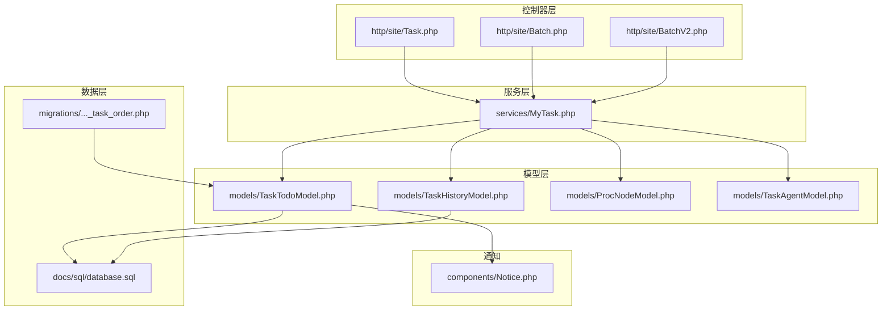
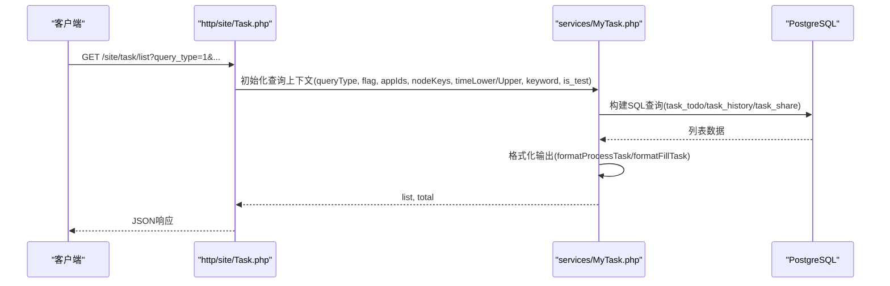
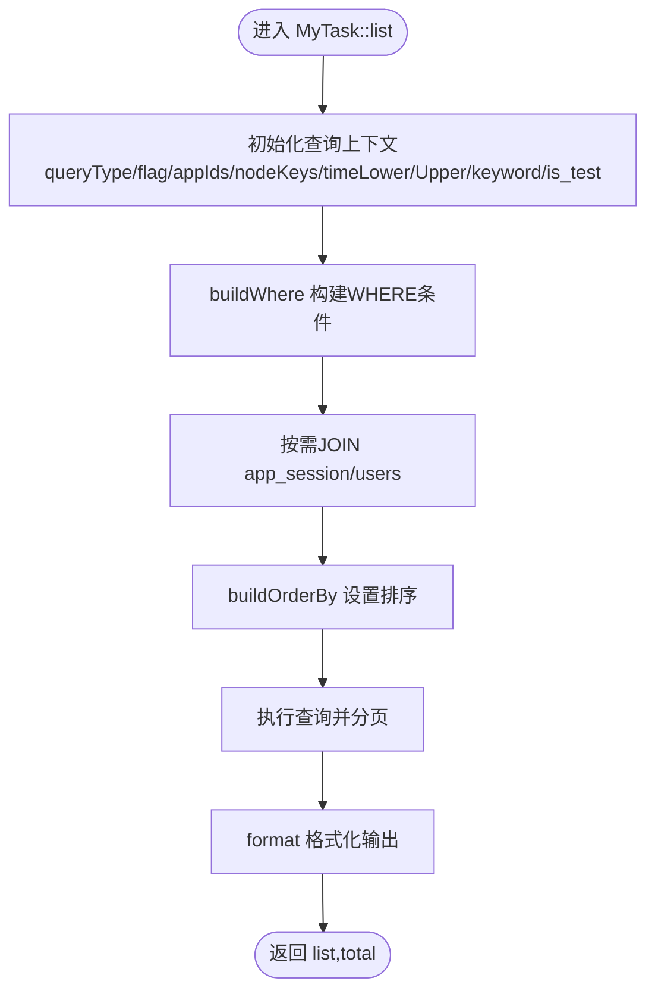
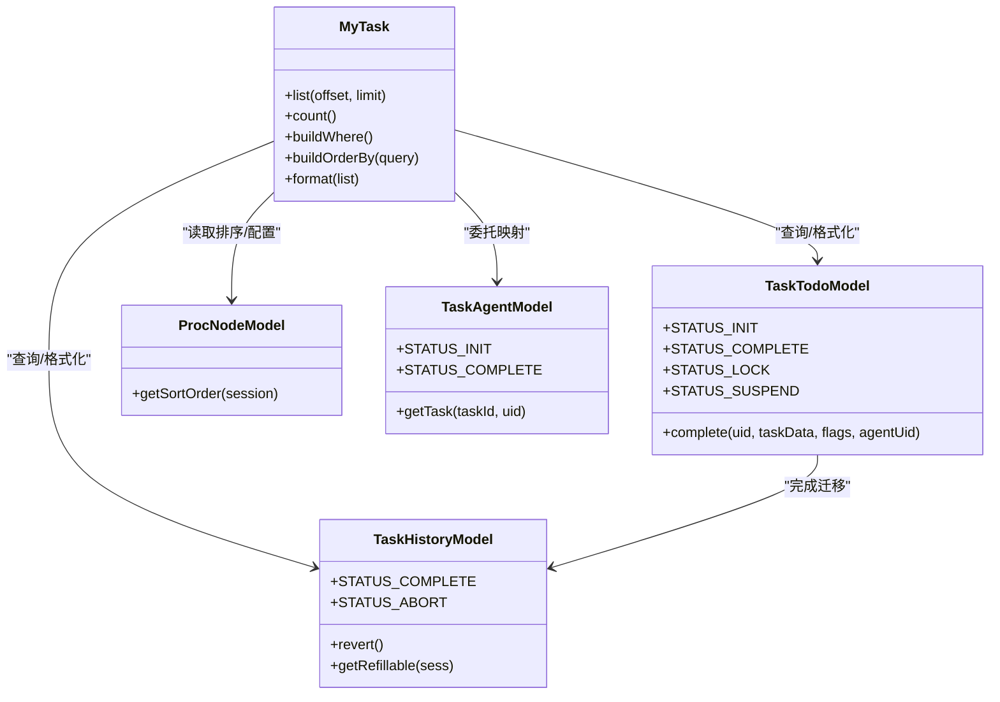
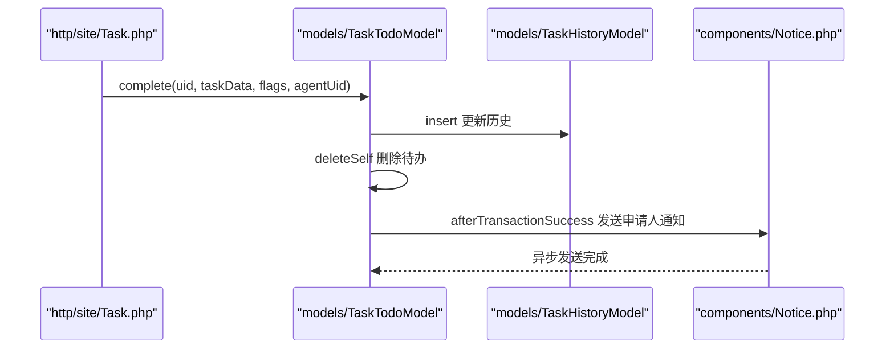
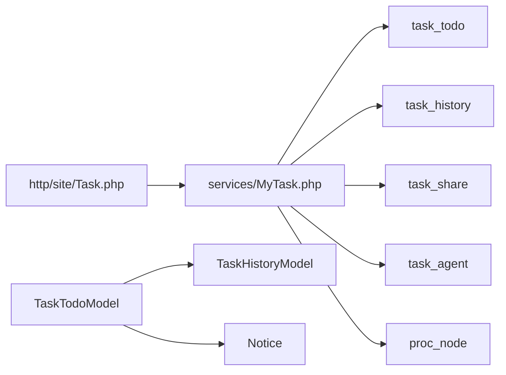

# 待办任务列表服务

<cite>
**本文引用的文件**
- [process/src/services/MyTask.php](file://process/src/services/MyTask.php)
- [process/src/models/TaskTodoModel.php](file://process/src/models/TaskTodoModel.php)
- [process/src/models/TaskHistoryModel.php](file://process/src/models/TaskHistoryModel.php)
- [process/src/http/site/Task.php](file://process/src/http/site/Task.php)
- [process/docs/sql/database.sql](file://process/docs/sql/database.sql)
- [process/src/migrations/migration_20240307_103639_task_order.php](file://process/src/migrations/migration_20240307_103639_task_order.php)
- [process/src/components/Notice.php](file://process/src/components/Notice.php)
- [process/src/models/ProcNodeModel.php](file://process/src/models/ProcNodeModel.php)
- [process/src/models/TaskAgentModel.php](file://process/src/models/TaskAgentModel.php)
- [process/src/http/site/Batch.php](file://process/src/http/site/Batch.php)
- [process/src/http/site/BatchV2.php](file://process/src/http/site/BatchV2.php)
- [process/docker/services/postgres/postgresql.conf](file://process/docker/services/postgres/postgresql.conf)
</cite>

## 目录
1. [简介](#简介)
2. [项目结构](#项目结构)
3. [核心组件](#核心组件)
4. [架构总览](#架构总览)
5. [详细组件分析](#详细组件分析)
6. [依赖关系分析](#依赖关系分析)
7. [性能考量](#性能考量)
8. [故障排查指南](#故障排查指南)
9. [结论](#结论)
10. [附录](#附录)

## 简介
本文件面向 htdNew 项目的“待办任务列表服务”，系统性阐述待办任务的生成算法、数据聚合机制与核心能力，包括任务聚合、状态统计、优先级排序与批量操作；阐明待办任务与任务历史的关系、状态转换与通知机制；给出查询优化、缓存策略与性能调优建议，并提供接口设计、数据结构与扩展开发指南。

## 项目结构
围绕待办任务列表服务的关键代码分布在以下模块：
- 服务层：MyTask 负责构建查询、排序、格式化输出与计数
- 模型层：TaskTodoModel（待办）、TaskHistoryModel（历史）、ProcNodeModel（节点）、TaskAgentModel（委托）
- 控制器层：Task 控制器提供列表与审批接口
- 数据层：SQL 与迁移文件定义 task_todo、task_history 等表结构与索引
- 通知组件：Notice 提供消息发送与异步投递
- 批量处理：Batch/BatchV2 支持默认数据集的批量审批与视图配置

图表来源
- [process/src/http/site/Task.php](file://process/src/http/site/Task.php#L52-L101)
- [process/src/services/MyTask.php](file://process/src/services/MyTask.php#L118-L149)
- [process/src/models/TaskTodoModel.php](file://process/src/models/TaskTodoModel.php#L1-L120)
- [process/src/models/TaskHistoryModel.php](file://process/src/models/TaskHistoryModel.php#L1-L90)
- [process/src/models/ProcNodeModel.php](file://process/src/models/ProcNodeModel.php#L340-L369)
- [process/src/models/TaskAgentModel.php](file://process/src/models/TaskAgentModel.php#L1-L47)
- [process/docs/sql/database.sql](file://process/docs/sql/database.sql#L335-L368)
- [process/src/migrations/migration_20240307_103639_task_order.php](file://process/src/migrations/migration_20240307_103639_task_order.php#L1-L22)
- [process/src/components/Notice.php](file://process/src/components/Notice.php#L1-L120)

章节来源
- [process/src/http/site/Task.php](file://process/src/http/site/Task.php#L52-L101)
- [process/src/services/MyTask.php](file://process/src/services/MyTask.php#L118-L149)
- [process/src/models/TaskTodoModel.php](file://process/src/models/TaskTodoModel.php#L1-L120)
- [process/src/models/TaskHistoryModel.php](file://process/src/models/TaskHistoryModel.php#L1-L90)
- [process/docs/sql/database.sql](file://process/docs/sql/database.sql#L335-L368)

## 核心组件
- MyTask：构建待办/已办/共享/委托待办/委托已办的查询条件、排序、格式化输出与计数；支持关键词、时间范围、事项/节点、审批人/岗位、测试数据等多维过滤。
- TaskTodoModel：待办任务实体，负责状态变更、回收校验、变量写入、并发互斥锁、完成后的历史迁移与通知。
- TaskHistoryModel：历史任务实体，负责状态管理、重报判定、回退至待办、任务中心日志查询。
- ProcNodeModel：节点模型，提供自定义排序值与节点配置，驱动待办任务的排序与标记。
- TaskAgentModel：委托关系模型，支撑“代处理”场景。
- 控制器 Task：对外提供任务列表与审批接口，封装 MyTask 的查询参数与返回结构。
- 通知 Notice：按消息类型与平台配置异步发送消息，支持队列投递与平台过滤。

章节来源
- [process/src/services/MyTask.php](file://process/src/services/MyTask.php#L1-L120)
- [process/src/models/TaskTodoModel.php](file://process/src/models/TaskTodoModel.php#L120-L212)
- [process/src/models/TaskHistoryModel.php](file://process/src/models/TaskHistoryModel.php#L90-L170)
- [process/src/models/ProcNodeModel.php](file://process/src/models/ProcNodeModel.php#L340-L369)
- [process/src/models/TaskAgentModel.php](file://process/src/models/TaskAgentModel.php#L1-L47)
- [process/src/http/site/Task.php](file://process/src/http/site/Task.php#L52-L101)
- [process/src/components/Notice.php](file://process/src/components/Notice.php#L1-L120)

## 架构总览
待办任务列表服务采用“控制器-服务-模型-数据层”的分层架构：
- 控制器接收请求参数，构造 MyTask 查询上下文，调用 list/count 输出结果
- MyTask 构建 SQL 查询，连接 task_todo/task_history/task_share 等表，按条件与排序返回
- 模型层负责任务状态转换、历史迁移、节点配置与委托关系
- 通知组件在关键节点（如任务完成）异步发送消息

图表来源
- [process/src/http/site/Task.php](file://process/src/http/site/Task.php#L52-L101)
- [process/src/services/MyTask.php](file://process/src/services/MyTask.php#L118-L149)
- [process/docs/sql/database.sql](file://process/docs/sql/database.sql#L335-L368)

## 详细组件分析

### 待办任务列表生成算法与数据聚合
- 查询构建
  - 根据 query_type 决定查询主表：task_todo 或 task_history；共享任务通过 task_share 关联 task_history
  - 通过 buildWhere 动态拼接过滤条件：任务类型、事项/节点、时间范围、关键字、发起人/审批人/岗位、测试数据等
  - joinSession 与 joinUser 控制是否连接 app_session/users 表，避免不必要的字段查询
- 排序策略
  - 支持按接收时间、自定义排序、完成时间等多种排序方式
  - 自定义排序使用 task_todo.sort_order 字段，配合索引 idx_task_todo_sort_order
- 格式化输出
  - 对流程任务与填报任务分别格式化，补充节点名、申请人、部门、标记、是否已读等信息
  - 从 TaskReadLogModel 读取已读状态，提升前端体验
- 计数与分页
  - count() 返回满足条件的总数，list() 支持 offset/limit 分页

图表来源
- [process/src/services/MyTask.php](file://process/src/services/MyTask.php#L338-L514)
- [process/src/services/MyTask.php](file://process/src/services/MyTask.php#L516-L585)
- [process/src/services/MyTask.php](file://process/src/services/MyTask.php#L118-L149)

章节来源
- [process/src/services/MyTask.php](file://process/src/services/MyTask.php#L338-L514)
- [process/src/services/MyTask.php](file://process/src/services/MyTask.php#L516-L585)
- [process/src/services/MyTask.php](file://process/src/services/MyTask.php#L118-L149)

### 任务聚合与状态统计
- 任务聚合
  - 待办聚合：按用户、状态、任务类型聚合，支持测试数据隔离
  - 已办聚合：基于 task_history 表，按完成时间、状态等统计
  - 共享聚合：通过 task_share 关联 task_history，按接收人维度聚合
  - 委托聚合：区分委托待办与委托已办，基于 TaskAgentModel 映射
- 状态统计
  - 通过 flags 字段标记催办、驳回、超时、异常、重报、禁止收回等状态
  - 完成后根据节点配置决定是否允许回收（disable_undo 标记）

章节来源
- [process/src/services/MyTask.php](file://process/src/services/MyTask.php#L533-L585)
- [process/src/models/TaskTodoModel.php](file://process/src/models/TaskTodoModel.php#L1-L120)
- [process/src/models/TaskHistoryModel.php](file://process/src/models/TaskHistoryModel.php#L1-L90)
- [process/src/models/TaskAgentModel.php](file://process/src/models/TaskAgentModel.php#L1-L47)

### 优先级排序与批量操作
- 优先级排序
  - 自定义排序：sort_order 字段与 idx_task_todo_sort_order 索引，支持升序/降序
  - 接收时间排序：按 task_todo.id 或 created 字段
  - 完成时间排序：按 finished 字段
- 批量操作
  - 默认数据集批量审批：BatchV2 基于节点配置提供在线编辑、可见字段、可搜索字段、可写字段
  - 批量日志：Batch 提供批量任务执行日志查询
  - 并发控制：批量更新使用分布式锁，避免重复提交

图表来源
- [process/src/services/MyTask.php](file://process/src/services/MyTask.php#L118-L149)
- [process/src/models/TaskTodoModel.php](file://process/src/models/TaskTodoModel.php#L164-L212)
- [process/src/models/TaskHistoryModel.php](file://process/src/models/TaskHistoryModel.php#L131-L169)
- [process/src/models/ProcNodeModel.php](file://process/src/models/ProcNodeModel.php#L340-L369)
- [process/src/models/TaskAgentModel.php](file://process/src/models/TaskAgentModel.php#L1-L47)

章节来源
- [process/src/http/site/BatchV2.php](file://process/src/http/site/BatchV2.php#L32-L68)
- [process/src/http/site/Batch.php](file://process/src/http/site/Batch.php#L2113-L2142)
- [process/src/migrations/migration_20240307_103639_task_order.php](file://process/src/migrations/migration_20240307_103639_task_order.php#L1-L22)

### 待办任务与任务历史的关系、状态转换与通知机制
- 关系与迁移
  - 待办任务完成时，TaskTodoModel::complete 将任务更新为已完成并迁移到 task_history，同时删除 task_todo 记录
  - 历史任务可回退至待办：TaskHistoryModel::revert 将状态还原并插入 task_todo
- 状态转换
  - 待办：INIT/VALIDATE；完成：COMPLETE；锁定：LOCK；挂起：SUSPEND
  - 历史：COMPLETE/ABORT/SUSPEND
- 通知机制
  - 完成后若节点配置了申请人通知，则通过 Notice 组件异步发送消息
  - 支持多平台配置与过滤，消息通过队列投递

图表来源
- [process/src/http/site/Task.php](file://process/src/http/site/Task.php#L410-L446)
- [process/src/models/TaskTodoModel.php](file://process/src/models/TaskTodoModel.php#L164-L212)
- [process/src/components/Notice.php](file://process/src/components/Notice.php#L1-L120)

章节来源
- [process/src/models/TaskTodoModel.php](file://process/src/models/TaskTodoModel.php#L164-L212)
- [process/src/models/TaskHistoryModel.php](file://process/src/models/TaskHistoryModel.php#L131-L169)
- [process/src/http/site/Task.php](file://process/src/http/site/Task.php#L410-L446)
- [process/src/components/Notice.php](file://process/src/components/Notice.php#L1-L120)

### 接口设计与数据结构
- 列表接口
  - 路径：GET /site/task/list
  - 参数：query_type、task_type、flag、app_id[]、node_keys[]、start_year、orderby、department_id、time_type、time_lower、time_upper、keyword、user_keyword、search、is_test
  - 返回：list（数组）、total（整数）
- 审批接口
  - 路径：POST /site/task/save
  - 参数：task_id、examine_data、form_data、step_action、temp_save、two_factor_ticket
  - 返回：操作结果（可能包含下一步指派人、支付信息等）

章节来源
- [process/src/http/site/Task.php](file://process/src/http/site/Task.php#L52-L101)
- [process/src/http/site/Task.php](file://process/src/http/site/Task.php#L111-L200)

### 扩展开发指南
- 新增查询条件
  - 在 MyTask::buildWhere 中添加新的 WHERE 条件分支，必要时增加索引
- 新增排序规则
  - 在 MyTask::buildOrderBy 中扩展排序逻辑，确保对应字段建立索引
- 新增任务类型
  - 在 TaskTodoModel/TaskHistoryModel 中补充类型常量与状态机
- 委托与共享
  - 使用 TaskAgentModel 与 task_share 表扩展“代处理/共享”能力
- 通知扩展
  - 在 Notice 中新增平台对象与消息模板配置，支持异步发送

章节来源
- [process/src/services/MyTask.php](file://process/src/services/MyTask.php#L338-L514)
- [process/src/models/TaskAgentModel.php](file://process/src/models/TaskAgentModel.php#L1-L47)
- [process/src/components/Notice.php](file://process/src/components/Notice.php#L1-L120)

## 依赖关系分析
- 组件耦合
  - MyTask 依赖 TaskTodoModel/TaskHistoryModel/ProcNodeModel/TaskAgentModel/TaskReadLogModel 等，形成清晰的数据访问层
  - 控制器仅负责参数解析与返回包装，降低业务复杂度
- 外部依赖
  - PostgreSQL 提供 task_todo、task_history、task_share 等表与索引
  - Notice 通过队列投递消息，解耦通知与主流程
- 潜在环路
  - 无直接循环依赖；通知与模型通过上下文传递，避免强耦合

图表来源
- [process/src/http/site/Task.php](file://process/src/http/site/Task.php#L52-L101)
- [process/src/services/MyTask.php](file://process/src/services/MyTask.php#L516-L585)
- [process/docs/sql/database.sql](file://process/docs/sql/database.sql#L335-L368)
- [process/src/models/TaskTodoModel.php](file://process/src/models/TaskTodoModel.php#L164-L212)
- [process/src/components/Notice.php](file://process/src/components/Notice.php#L1-L120)

章节来源
- [process/src/http/site/Task.php](file://process/src/http/site/Task.php#L52-L101)
- [process/src/services/MyTask.php](file://process/src/services/MyTask.php#L516-L585)
- [process/docs/sql/database.sql](file://process/docs/sql/database.sql#L335-L368)

## 性能考量
- 索引与查询优化
  - task_todo.sort_order 与 idx_task_todo_sort_order 索引支持自定义排序
  - task_history 建议使用 idx_task_history_uid、idx_task_history_node_id、idx_task_history_sess_id 等索引
  - PostgreSQL 配置项 seq_page_cost/random_page_cost 等可根据实际负载调整
- 缓存策略
  - ProcNodeModel/AppModel/UsersCollection 等通过缓存减少重复查询
  - 任务已读状态通过 TaskReadLogModel 一次性拉取，避免 N+1 查询
- 批量与异步
  - 批量审批与消息发送通过队列异步执行，降低主流程延迟
  - 批量更新使用分布式锁，避免并发冲突

章节来源
- [process/src/migrations/migration_20240307_103639_task_order.php](file://process/src/migrations/migration_20240307_103639_task_order.php#L1-L22)
- [process/docs/sql/database.sql](file://process/docs/sql/database.sql#L335-L368)
- [process/docker/services/postgres/postgresql.conf](file://process/docker/services/postgres/postgresql.conf#L287-L322)
- [process/src/components/Notice.php](file://process/src/components/Notice.php#L1-L120)

## 故障排查指南
- 列表为空或数量不符
  - 检查 query_type 与 is_test 参数是否正确；确认 app_id/node_keys/keyword 等过滤条件
  - 核对 task_todo/task_history 索引是否存在
- 排序异常
  - 确认 sort_order 字段是否正确写入；检查 idx_task_todo_sort_order 是否生效
- 审批失败或状态未更新
  - 查看 TaskTodoModel::complete 是否成功迁移至 task_history；检查 flags 与节点配置
- 通知未送达
  - 检查 Notice 配置与平台启用状态；确认队列消费者运行正常

章节来源
- [process/src/services/MyTask.php](file://process/src/services/MyTask.php#L338-L514)
- [process/src/models/TaskTodoModel.php](file://process/src/models/TaskTodoModel.php#L164-L212)
- [process/src/components/Notice.php](file://process/src/components/Notice.php#L1-L120)

## 结论
待办任务列表服务通过 MyTask 的灵活查询与格式化输出，结合 TaskTodoModel/TaskHistoryModel 的状态机与迁移机制，实现了任务聚合、状态统计、优先级排序与批量操作的完整闭环。配合通知异步投递与索引优化，整体具备良好的扩展性与性能表现。建议在新增功能时遵循现有分层与缓存策略，确保查询与写入路径清晰可控。

## 附录
- 数据库表与索引
  - task_todo：待办任务主表，包含 sort_order、flags、status 等字段
  - task_history：历史任务表，包含 task_type、users、flags、status、finished 等字段
  - task_share：共享任务映射表
- 迁移与索引
  - 新增 sort_order 与 idx_task_todo_sort_order 索引
  - 建议为 task_history 常用查询字段建立索引

章节来源
- [process/docs/sql/database.sql](file://process/docs/sql/database.sql#L335-L368)
- [process/src/migrations/migration_20240307_103639_task_order.php](file://process/src/migrations/migration_20240307_103639_task_order.php#L1-L22)