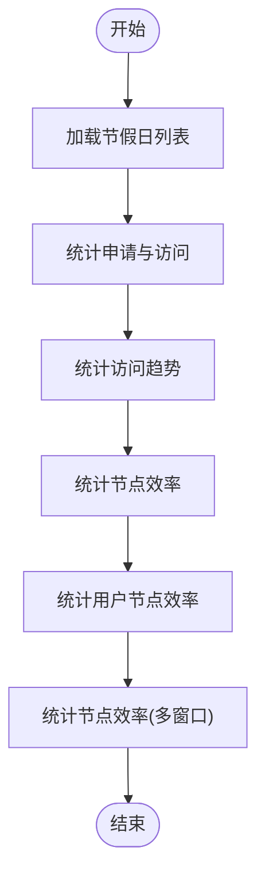

# 实用工具任务

<cite>
**本文引用的文件**
- [process/src/services/task/AbstractTask.php](file://process/src/services/task/AbstractTask.php)
- [process/src/services/task/AigcPush.php](file://process/src/services/task/AigcPush.php)
- [process/src/services/task/ReportV2.php](file://process/src/services/task/ReportV2.php)
- [process/src/services/Statistics.php](file://process/src/services/Statistics.php)
- [process/src/services/StatisticsBaseNotice.php](file://process/src/services/StatisticsBaseNotice.php)
- [process/src/commands/Common.php](file://process/src/commands/Common.php)
- [process/src/commands/Demo.php](file://process/src/commands/Demo.php)
- [process/src/config/crontab.php](file://process/src/config/crontab.php)
</cite>

## 目录
1. [引言](#引言)
2. [项目结构](#项目结构)
3. [核心组件](#核心组件)
4. [架构总览](#架构总览)
5. [详细组件分析](#详细组件分析)
6. [依赖关系分析](#依赖关系分析)
7. [性能考量](#性能考量)
8. [故障排查指南](#故障排查指南)
9. [结论](#结论)
10. [附录](#附录)

## 引言
本文件围绕 htdNew 项目的“实用工具任务”进行系统化说明，覆盖流水号生成、汇率更新、节假日管理、字典刷新、报表生成与测试任务等辅助性能力。文档从架构、组件、数据流、处理逻辑、集成点、异常处理、性能优化与扩展开发等方面展开，帮助读者快速理解并高效维护与扩展这些工具任务。

## 项目结构
实用工具任务主要位于以下位置：
- 通用任务基类：process/src/services/task/AbstractTask.php
- 典型任务实现：
  - 知识库推送：process/src/services/task/AigcPush.php
  - 报表迁移与初始化：process/src/services/task/ReportV2.php
  - 统计分析与报表生成：process/src/services/Statistics.php、process/src/services/StatisticsBaseNotice.php
- CLI 命令入口：process/src/commands/Common.php、process/src/commands/Demo.php
- 计划任务组件注册：process/src/config/crontab.php

图表来源
- [process/src/services/task/AbstractTask.php](file://process/src/services/task/AbstractTask.php#L1-L30)
- [process/src/services/task/AigcPush.php](file://process/src/services/task/AigcPush.php#L1-L120)
- [process/src/services/task/ReportV2.php](file://process/src/services/task/ReportV2.php#L1-L60)
- [process/src/services/Statistics.php](file://process/src/services/Statistics.php#L1-L60)
- [process/src/services/StatisticsBaseNotice.php](file://process/src/services/StatisticsBaseNotice.php#L1-L60)
- [process/src/commands/Common.php](file://process/src/commands/Common.php#L1-L65)
- [process/src/commands/Demo.php](file://process/src/commands/Demo.php#L1-L40)
- [process/src/config/crontab.php](file://process/src/config/crontab.php#L1-L10)

章节来源
- [process/src/config/crontab.php](file://process/src/config/crontab.php#L1-L10)

## 核心组件
- 任务基类 AbstractTask
  - 设计目的：统一任务生命周期与序列化行为，屏蔽无关属性，便于跨进程/协程持久化与恢复。
  - 关键特性：抽象 run 方法；__set 忽略无效参数；__serialize 仅序列化实例公共非静态属性。
- AigcPush（知识库推送）
  - 功能：按类型推送事项、部门/国家/地区、新闻、通知公告、预约、规章制度等至第三方平台，并具备异常检测与重试。
  - 关键机制：Redis 缓存状态位检测执行中/异常；分片批量推送；错误日志与回滚标记；定时清理与幂等控制。
- ReportV2（报表任务）
  - 功能：初始化默认数据集、迁移旧报表到新报表模型、重置采集规则、支持协程异步执行。
  - 关键机制：字段映射与配置转换、应用/表单 ID 缓存、分页拉取第三方报表列表并入库。
- Statistics（统计分析）
  - 功能：按日/累计维度统计申请、访问、节点效率、用户效率、超时/催办等指标，支持节假日工作日时长计算。
  - 关键机制：基于 Redis 的增量更新游标；多时间窗口聚合；PGSQL/兼容写入；缓存清理与重算模式。
- StatisticsBaseNotice（业务简报）
  - 功能：生成学校/部门两级业务简报 Word/PDF，并通过消息通道下发。
  - 关键机制：模板填充、多块克隆、Word 转 PDF、文件存储与消息发送。
- 命令入口（Common/Demo）
  - 设计目的：提供 CLI 快速调用工具任务的统一入口，便于运维与测试。

章节来源
- [process/src/services/task/AbstractTask.php](file://process/src/services/task/AbstractTask.php#L1-L30)
- [process/src/services/task/AigcPush.php](file://process/src/services/task/AigcPush.php#L1-L120)
- [process/src/services/task/ReportV2.php](file://process/src/services/task/ReportV2.php#L1-L60)
- [process/src/services/Statistics.php](file://process/src/services/Statistics.php#L1-L80)
- [process/src/services/StatisticsBaseNotice.php](file://process/src/services/StatisticsBaseNotice.php#L1-L60)
- [process/src/commands/Common.php](file://process/src/commands/Common.php#L1-L65)
- [process/src/commands/Demo.php](file://process/src/commands/Demo.php#L1-L40)

## 架构总览
工具任务采用“基类抽象 + 具体任务实现 + 命令入口 + 计划任务配置”的分层架构：
- 基类层：统一任务接口与序列化契约。
- 任务层：面向具体业务场景的任务实现，负责数据准备、调用外部服务、落库与异常处理。
- 入口层：CLI 命令封装任务调用，便于手动执行与脚本编排。
- 配置层：计划任务组件注册，统一纳入调度体系。

图表来源
- [process/src/services/task/AbstractTask.php](file://process/src/services/task/AbstractTask.php#L1-L30)
- [process/src/services/task/AigcPush.php](file://process/src/services/task/AigcPush.php#L1-L120)
- [process/src/services/task/ReportV2.php](file://process/src/services/task/ReportV2.php#L1-L60)
- [process/src/services/Statistics.php](file://process/src/services/Statistics.php#L1-L80)
- [process/src/services/StatisticsBaseNotice.php](file://process/src/services/StatisticsBaseNotice.php#L1-L60)

## 详细组件分析

### AigcPush（知识库推送）
- 设计目的
  - 将事项、部门/国家/地区、新闻、通知公告、预约、规章制度等数据结构化后推送至第三方平台，支撑智能检索与导航。
- 执行频率与维护策略
  - 支持定时与手动触发；通过 Redis 状态位检测执行中/异常，避免并发重复执行；异常时保留/删除本次推送数据，等待重试。
- 接口与参数
  - run()：根据 type 分派不同推送分支；支持 isCrontab 标记。
  - pushData()/pushDca()：构造数据并批量推送；支持分片与重试。
  - check_abnormal_push_data()/set_check_push_data()：执行状态检测与标记。
  - 参数示例路径：[process/src/services/task/AigcPush.php](file://process/src/services/task/AigcPush.php#L1-L120)
- 异常处理
  - 捕获 Throwable 并设置重试标志；记录日志与错误文件；必要时删除本次推送数据以避免脏数据。
- 关键流程图

图表来源
- [process/src/services/task/AigcPush.php](file://process/src/services/task/AigcPush.php#L1-L120)

章节来源
- [process/src/services/task/AigcPush.php](file://process/src/services/task/AigcPush.php#L1-L220)

### ReportV2（报表任务）
- 设计目的
  - 初始化默认数据集、迁移旧报表到新模型、重置采集规则；支持协程异步执行以提升吞吐。
- 执行频率与维护策略
  - 可按需手动执行；支持 reportId 精确迁移；可选择是否清理旧数据集与采集规则。
- 接口与参数
  - run()：根据 type 分派 initDataSet/migrateReport/migrate50Report/resetRule。
  - initDataSet()：为已发布/待审/未发布事项构建默认数据集。
  - migrateReport()：分页拉取第三方报表并转换入库。
  - migrate50Report()：迁移 5.0 旧报表到新模型。
  - resetRule()：重置默认采集规则。
- 关键流程图

图表来源
- [process/src/services/task/ReportV2.php](file://process/src/services/task/ReportV2.php#L1-L120)

章节来源
- [process/src/services/task/ReportV2.php](file://process/src/services/task/ReportV2.php#L1-L200)

### Statistics（统计分析）
- 设计目的
  - 按日/累计维度统计申请、访问、节点效率、用户效率、超时/催办等指标；支持节假日工作日时长计算。
- 执行频率与维护策略
  - 增量更新：基于 Redis 游标记录上次更新时间，仅处理增量数据；支持 timeLimit=1 清空后全量重建。
- 接口与参数
  - run()：依次执行 app/visit/taskNode/taskUserNode/nodeEfficiency。
  - app()/visit()/taskNode()/taskUserNode()/nodeEfficiency()：分别统计不同维度。
  - clear()：清理历史统计与缓存。
  - getAvgTime(list)：按节假日过滤计算工作日时长。
- 关键流程图

图表来源
- [process/src/services/Statistics.php](file://process/src/services/Statistics.php#L1-L120)

章节来源
- [process/src/services/Statistics.php](file://process/src/services/Statistics.php#L1-L220)

### StatisticsBaseNotice（业务简报）
- 设计目的
  - 自动生成学校/部门两级业务简报 Word/PDF，并通过消息通道下发。
- 执行频率与维护策略
  - 月度定时生成；模板填充与克隆行块；Word 转 PDF；文件上传与消息发送。
- 接口与参数
  - run()：汇总月报与部门报。
  - runDataReport()/runDepartmentDataReport()：生成 Word/PDF 并发送。
  - overallState()/appState()：按维度采集指标。
- 关键流程图

图表来源
- [process/src/services/StatisticsBaseNotice.php](file://process/src/services/StatisticsBaseNotice.php#L1-L120)

章节来源
- [process/src/services/StatisticsBaseNotice.php](file://process/src/services/StatisticsBaseNotice.php#L1-L200)

### 命令入口（Common/Demo）
- 设计目的
  - 提供 CLI 快速调用工具任务的统一入口，便于运维与测试。
- 典型用法
  - Common::aigcPush()、Common::tjAll()、Common::notice()、Common::WechatWorkSyncUsers()。
  - Demo::downloadTask($id)、Demo::queryOracle()。
- 参数与异常
  - 参数通过构造函数注入或方法参数传入；异常捕获并记录，返回统一响应对象。

章节来源
- [process/src/commands/Common.php](file://process/src/commands/Common.php#L1-L65)
- [process/src/commands/Demo.php](file://process/src/commands/Demo.php#L1-L100)

## 依赖关系分析
- 组件耦合
  - 任务均继承 AbstractTask，统一生命周期与序列化。
  - AigcPush 依赖第三方平台模型与缓存/日志组件；ReportV2 依赖报表模型与应用/模块模型；Statistics 依赖多统计模型与 Redis 游标；StatisticsBaseNotice 依赖模板引擎与文件存储。
- 外部依赖
  - Redis：状态检测、增量游标、缓存加速。
  - 第三方平台：AigcPush 推送目标系统。
  - 文件存储与消息通道：StatisticsBaseNotice 下发简报。
- 潜在循环依赖
  - 任务间无直接循环依赖；通过模型与服务层间接交互，保持较低耦合。

图表来源
- [process/src/services/task/AigcPush.php](file://process/src/services/task/AigcPush.php#L1-L120)
- [process/src/services/task/ReportV2.php](file://process/src/services/task/ReportV2.php#L1-L120)
- [process/src/services/Statistics.php](file://process/src/services/Statistics.php#L1-L120)
- [process/src/services/StatisticsBaseNotice.php](file://process/src/services/StatisticsBaseNotice.php#L1-L120)

## 性能考量
- 增量更新与游标
  - Statistics 使用 Redis 游标记录上次更新时间，仅处理增量数据，降低全量扫描成本。
- 批量化与分片
  - AigcPush 对菜单等大批量数据进行分片推送，减少单次请求压力与超时风险。
- 协程异步
  - ReportV2 在同步模式下支持协程并发执行，提高报表迁移吞吐。
- 缓存与去重
  - ReportV2 缓存应用/表单 ID 映射；AigcPush 使用 Redis 状态位避免重复执行。
- I/O 与网络
  - StatisticsBaseNotice 生成 Word/PDF 为 I/O 密集型，建议在低峰期执行并限制并发。
- 内存与超时
  - Statistics 在全量场景下临时放开内存限制；建议合理拆分时段与批次。

[本节为通用指导，无需列出章节来源]

## 故障排查指南
- 知识库推送异常
  - 现象：推送失败、重复执行、数据不一致。
  - 排查要点：检查 Redis 状态位是否过期；查看错误日志与错误文件；确认第三方平台可用性；必要时删除本次推送数据以允许重试。
  - 参考路径：[process/src/services/task/AigcPush.php](file://process/src/services/task/AigcPush.php#L1-L120)
- 报表迁移中断
  - 现象：迁移卡顿、字段映射失败、目标模型冲突。
  - 排查要点：确认 reportId 是否正确；检查字段映射与配置转换逻辑；查看日志定位失败项；必要时开启同步模式逐条验证。
  - 参考路径：[process/src/services/task/ReportV2.php](file://process/src/services/task/ReportV2.php#L1-L200)
- 统计数据偏差
  - 现象：节点效率/用户效率异常、时长计算不准确。
  - 排查要点：核对节假日列表；检查 getAvgTime 中节假日过滤逻辑；确认 Redis 游标是否被意外清理；必要时启用 timeLimit=1 全量重建。
  - 参考路径：[process/src/services/Statistics.php](file://process/src/services/Statistics.php#L1-L220)
- 简报生成失败
  - 现象：Word 生成失败、PDF 转换异常、消息发送失败。
  - 排查要点：确认模板存在与可读；检查 Word 转 PDF 依赖；验证文件存储与消息通道配置；查看日志定位具体步骤。
  - 参考路径：[process/src/services/StatisticsBaseNotice.php](file://process/src/services/StatisticsBaseNotice.php#L1-L200)
- 命令调用异常
  - 现象：CLI 调用抛出异常或无输出。
  - 排查要点：检查命令入口参数与构造函数注入；捕获并记录异常；查看统一响应对象中的错误信息。
  - 参考路径：[process/src/commands/Common.php](file://process/src/commands/Common.php#L1-L65)、[process/src/commands/Demo.php](file://process/src/commands/Demo.php#L1-L100)

章节来源
- [process/src/services/task/AigcPush.php](file://process/src/services/task/AigcPush.php#L1-L220)
- [process/src/services/task/ReportV2.php](file://process/src/services/task/ReportV2.php#L1-L200)
- [process/src/services/Statistics.php](file://process/src/services/Statistics.php#L1-L220)
- [process/src/services/StatisticsBaseNotice.php](file://process/src/services/StatisticsBaseNotice.php#L1-L200)
- [process/src/commands/Common.php](file://process/src/commands/Common.php#L1-L65)
- [process/src/commands/Demo.php](file://process/src/commands/Demo.php#L1-L100)

## 结论
htdNew 的实用工具任务以 AbstractTask 为统一基类，围绕知识库推送、报表迁移与初始化、统计分析与简报生成等场景提供了高内聚、低耦合的实现方案。通过 Redis 游标、批量化、协程异步与缓存等手段，兼顾了性能与可靠性。建议在生产环境中结合计划任务配置与告警机制，确保任务稳定运行与问题快速定位。

[本节为总结性内容，无需列出章节来源]

## 附录
- 计划任务组件注册
  - 通过 crontab.php 将组件与 CLI 组件合并注册，统一纳入调度体系。
  - 参考路径：[process/src/config/crontab.php](file://process/src/config/crontab.php#L1-L10)
- 常用命令入口
  - Common/Demo 提供一键调用工具任务的能力，适合运维与测试场景。
  - 参考路径：[process/src/commands/Common.php](file://process/src/commands/Common.php#L1-L65)、[process/src/commands/Demo.php](file://process/src/commands/Demo.php#L1-L100)

章节来源
- [process/src/config/crontab.php](file://process/src/config/crontab.php#L1-L10)
- [process/src/commands/Common.php](file://process/src/commands/Common.php#L1-L65)
- [process/src/commands/Demo.php](file://process/src/commands/Demo.php#L1-L100)