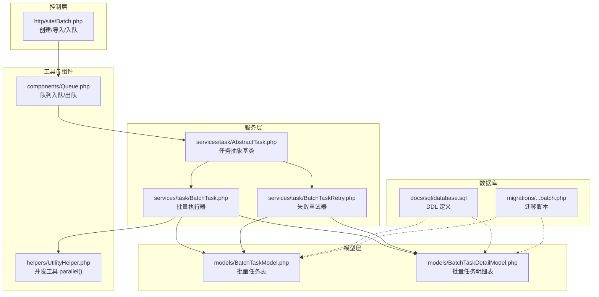
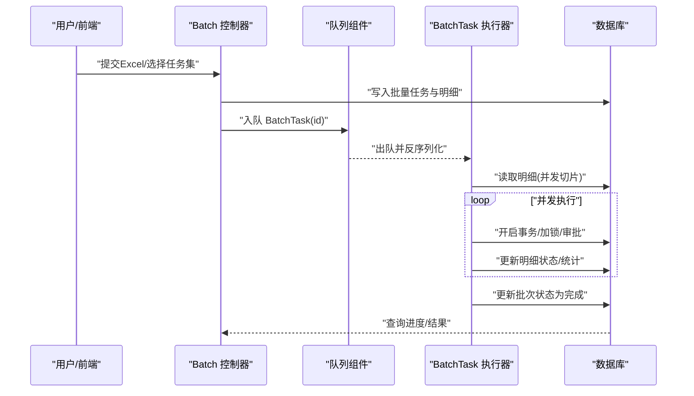
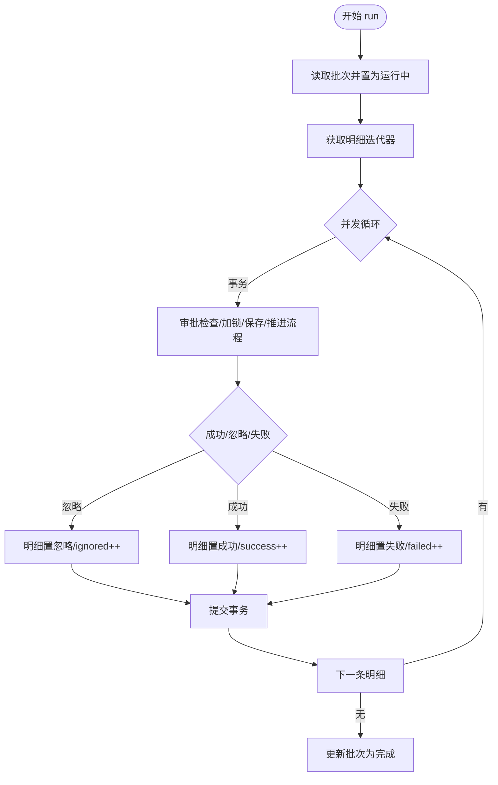
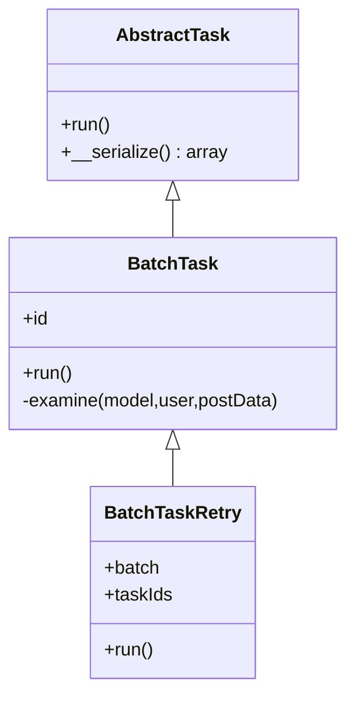
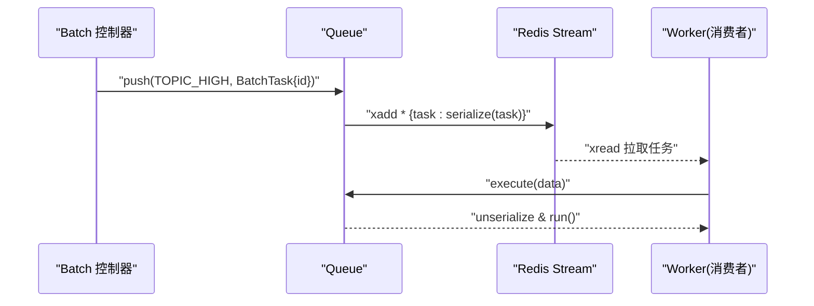
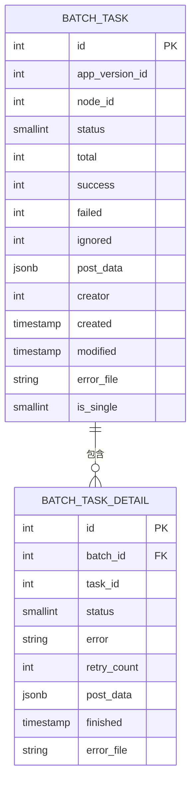
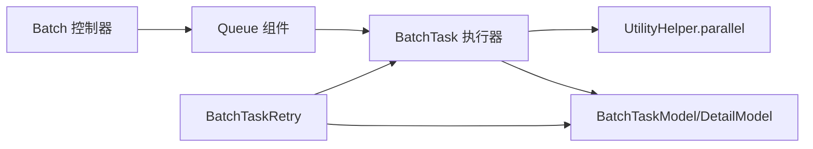

# 批量任务执行

<cite>
**本文引用的文件**
- [Batch.php](file://process/src/http/site/Batch.php)
- [BatchTask.php](file://process/src/services/task/BatchTask.php)
- [BatchTaskRetry.php](file://process/src/services/task/BatchTaskRetry.php)
- [AbstractTask.php](file://process/src/services/task/AbstractTask.php)
- [BatchTaskModel.php](file://process/src/models/BatchTaskModel.php)
- [BatchTaskDetailModel.php](file://process/src/models/BatchTaskDetailModel.php)
- [Queue.php](file://process/src/components/Queue.php)
- [UtilityHelper.php](file://process/src/helpers/UtilityHelper.php)
- [database.sql](file://process/docs/sql/database.sql)
- [migration_20230822_094832_batch.php](file://process/src/migrations/migration_20230822_094832_batch.php)
</cite>

## 目录
1. [引言](#引言)
2. [项目结构](#项目结构)
3. [核心组件](#核心组件)
4. [架构总览](#架构总览)
5. [详细组件分析](#详细组件分析)
6. [依赖关系分析](#依赖关系分析)
7. [性能与并发特性](#性能与并发特性)
8. [故障排查指南](#故障排查指南)
9. [结论](#结论)
10. [附录：配置与最佳实践](#附录配置与最佳实践)

## 引言
本文件围绕“批量任务执行”能力进行系统化说明，覆盖从任务创建、分片、并发执行到结果汇总的完整生命周期；阐述状态跟踪、进度监控、异常重试与断点续传机制；并给出配置参数、执行策略与性能优化建议及代码级参考路径。

## 项目结构
批量任务相关代码主要分布在以下模块：
- 控制层：负责接收请求、解析Excel、构造任务元数据、入队触发执行
- 服务层：定义抽象任务基类、具体批量任务执行器、重试器
- 数据模型层：批量任务与明细的持久化模型
- 工具与组件：并发工具、消息队列组件
- 数据库：批量任务相关表结构定义与迁移

图表来源
- [Batch.php](file://process/src/http/site/Batch.php#L1400-L1530)
- [BatchTask.php](file://process/src/services/task/BatchTask.php#L1-L135)
- [BatchTaskRetry.php](file://process/src/services/task/BatchTaskRetry.php#L1-L143)
- [AbstractTask.php](file://process/src/services/task/AbstractTask.php#L1-L30)
- [BatchTaskModel.php](file://process/src/models/BatchTaskModel.php#L1-L115)
- [BatchTaskDetailModel.php](file://process/src/models/BatchTaskDetailModel.php#L1-L58)
- [Queue.php](file://process/src/components/Queue.php#L1-L173)
- [UtilityHelper.php](file://process/src/helpers/UtilityHelper.php#L350-L383)
- [database.sql](file://process/docs/sql/database.sql#L382-L402)
- [migration_20230822_094832_batch.php](file://process/src/migrations/migration_20230822_094832_batch.php#L35-L80)

章节来源
- [Batch.php](file://process/src/http/site/Batch.php#L1400-L1530)
- [BatchTask.php](file://process/src/services/task/BatchTask.php#L1-L135)
- [BatchTaskRetry.php](file://process/src/services/task/BatchTaskRetry.php#L1-L143)
- [AbstractTask.php](file://process/src/services/task/AbstractTask.php#L1-L30)
- [BatchTaskModel.php](file://process/src/models/BatchTaskModel.php#L1-L115)
- [BatchTaskDetailModel.php](file://process/src/models/BatchTaskDetailModel.php#L1-L58)
- [Queue.php](file://process/src/components/Queue.php#L1-L173)
- [UtilityHelper.php](file://process/src/helpers/UtilityHelper.php#L350-L383)
- [database.sql](file://process/docs/sql/database.sql#L382-L402)
- [migration_20230822_094832_batch.php](file://process/src/migrations/migration_20230822_094832_batch.php#L35-L80)

## 核心组件
- 抽象任务基类：统一任务接口与序列化行为，便于入队传输
- 批量任务执行器：负责初始化、并发执行、状态统计与汇总
- 批量任务重试器：针对失败明细进行重试，支持计数与解锁
- 队列组件：提供主题入队、消费者数量配置、反序列化执行
- 并发工具：基于协程通道与屏障实现可控并发
- 模型层：批量任务与明细的数据结构与状态常量

章节来源
- [AbstractTask.php](file://process/src/services/task/AbstractTask.php#L1-L30)
- [BatchTask.php](file://process/src/services/task/BatchTask.php#L1-L135)
- [BatchTaskRetry.php](file://process/src/services/task/BatchTaskRetry.php#L1-L143)
- [Queue.php](file://process/src/components/Queue.php#L1-L173)
- [UtilityHelper.php](file://process/src/helpers/UtilityHelper.php#L350-L383)
- [BatchTaskModel.php](file://process/src/models/BatchTaskModel.php#L1-L115)
- [BatchTaskDetailModel.php](file://process/src/models/BatchTaskDetailModel.php#L1-L58)

## 架构总览
批量任务从“创建/导入”开始，写入明细表后入队，由消费者拉取执行；执行过程中按并发上限切分并行，逐条审批并更新统计；完成后汇总状态并标记完成。

图表来源
- [Batch.php](file://process/src/http/site/Batch.php#L1400-L1530)
- [BatchTask.php](file://process/src/services/task/BatchTask.php#L1-L135)
- [Queue.php](file://process/src/components/Queue.php#L1-L173)
- [BatchTaskModel.php](file://process/src/models/BatchTaskModel.php#L1-L115)
- [BatchTaskDetailModel.php](file://process/src/models/BatchTaskDetailModel.php#L1-L58)

## 详细组件分析

### 批量任务执行器（BatchTask）
- 初始化与状态推进：首次运行将批次状态置为“运行中”，避免重复启动
- 并发执行：使用并发工具限制最大协程数，遍历明细并行处理
- 事务与错误处理：每条明细独立事务，捕获表单校验、业务异常与未知异常，分别记录失败并更新统计
- 结果汇总：所有明细完成后，将批次状态置为“完成”，并刷新修改时间

图表来源
- [BatchTask.php](file://process/src/services/task/BatchTask.php#L1-L135)
- [BatchTaskDetailModel.php](file://process/src/models/BatchTaskDetailModel.php#L1-L58)
- [BatchTaskModel.php](file://process/src/models/BatchTaskModel.php#L1-L115)

章节来源
- [BatchTask.php](file://process/src/services/task/BatchTask.php#L1-L135)

### 批量任务重试器（BatchTaskRetry）
- 重试范围：可按任务ID集合或仅失败明细重试
- 复用审批逻辑：继承执行器的审批流程，减少重复代码
- 重试计数与解锁：失败明细累计重试次数，超过阈值自动批量解锁
- 统计修正：成功/忽略会抵消失败计数，确保统计一致性

图表来源
- [AbstractTask.php](file://process/src/services/task/AbstractTask.php#L1-L30)
- [BatchTask.php](file://process/src/services/task/BatchTask.php#L1-L135)
- [BatchTaskRetry.php](file://process/src/services/task/BatchTaskRetry.php#L1-L143)

章节来源
- [BatchTaskRetry.php](file://process/src/services/task/BatchTaskRetry.php#L1-L143)

### 队列组件（Queue）
- 主题与入队：支持高/中/低优先级主题，序列化任务对象后写入流式队列
- 消费者配置：通过缓存与YAML配置消费者数量，支持动态调整
- 反序列化执行：取出任务后反序列化并调用 run()

图表来源
- [Queue.php](file://process/src/components/Queue.php#L1-L173)
- [Batch.php](file://process/src/http/site/Batch.php#L1517-L1522)

章节来源
- [Queue.php](file://process/src/components/Queue.php#L1-L173)
- [Batch.php](file://process/src/http/site/Batch.php#L1517-L1522)

### 并发工具（UtilityHelper::parallel）
- 限流并发：通过通道容量限制同时运行的协程数
- 统一收尾：使用屏障等待所有协程完成，保证批次级一致性
- 失败隔离：单条明细异常不影响整体流程，失败回调可选

章节来源
- [UtilityHelper.php](file://process/src/helpers/UtilityHelper.php#L350-L383)

### 数据模型与表结构
- 批量任务表：记录批次维度的统计与状态
- 明细表：记录每条任务的执行状态、错误与重试次数
- 迁移与DDL：提供建表、索引与默认值定义

图表来源
- [BatchTaskModel.php](file://process/src/models/BatchTaskModel.php#L1-L115)
- [BatchTaskDetailModel.php](file://process/src/models/BatchTaskDetailModel.php#L1-L58)
- [database.sql](file://process/docs/sql/database.sql#L382-L402)
- [migration_20230822_094832_batch.php](file://process/src/migrations/migration_20230822_094832_batch.php#L35-L80)

章节来源
- [BatchTaskModel.php](file://process/src/models/BatchTaskModel.php#L1-L115)
- [BatchTaskDetailModel.php](file://process/src/models/BatchTaskDetailModel.php#L1-L58)
- [database.sql](file://process/docs/sql/database.sql#L382-L402)
- [migration_20230822_094832_batch.php](file://process/src/migrations/migration_20230822_094832_batch.php#L35-L80)

## 依赖关系分析
- 控制层依赖队列组件与模型层，负责创建批次、写入明细并入队
- 执行器依赖并发工具、模型层与审批服务，负责并发执行与状态更新
- 重试器依赖执行器的审批流程与模型层，负责失败明细的再次处理
- 队列组件依赖Redis Stream与序列化机制，支撑异步解耦

图表来源
- [Batch.php](file://process/src/http/site/Batch.php#L1400-L1530)
- [Queue.php](file://process/src/components/Queue.php#L1-L173)
- [BatchTask.php](file://process/src/services/task/BatchTask.php#L1-L135)
- [BatchTaskRetry.php](file://process/src/services/task/BatchTaskRetry.php#L1-L143)
- [UtilityHelper.php](file://process/src/helpers/UtilityHelper.php#L350-L383)
- [BatchTaskModel.php](file://process/src/models/BatchTaskModel.php#L1-L115)
- [BatchTaskDetailModel.php](file://process/src/models/BatchTaskDetailModel.php#L1-L58)

章节来源
- [Batch.php](file://process/src/http/site/Batch.php#L1400-L1530)
- [Queue.php](file://process/src/components/Queue.php#L1-L173)
- [BatchTask.php](file://process/src/services/task/BatchTask.php#L1-L135)
- [BatchTaskRetry.php](file://process/src/services/task/BatchTaskRetry.php#L1-L143)
- [UtilityHelper.php](file://process/src/helpers/UtilityHelper.php#L350-L383)
- [BatchTaskModel.php](file://process/src/models/BatchTaskModel.php#L1-L115)
- [BatchTaskDetailModel.php](file://process/src/models/BatchTaskDetailModel.php#L1-L58)

## 性能与并发特性
- 并发上限：执行器内置最大并发常量，避免资源争用
- 限流与背压：并发工具通过通道容量实现背压，防止瞬时洪峰
- 事务粒度：按明细拆分事务，降低锁竞争与回滚成本
- 统计更新：使用数据库表达式原子累加，减少读写竞争
- 队列优先级：高优主题优先执行，保障关键批次及时处理

章节来源
- [BatchTask.php](file://process/src/services/task/BatchTask.php#L1-L135)
- [UtilityHelper.php](file://process/src/helpers/UtilityHelper.php#L350-L383)
- [Queue.php](file://process/src/components/Queue.php#L1-L173)

## 故障排查指南
- 任务长时间无进展
  - 检查队列消费者数量与主题堆积情况
  - 核对批次状态是否仍为“初始化”或“运行中”
- 大量失败明细
  - 查看明细表错误字段与重试次数，必要时触发重试器
  - 关注并发上限与数据库锁竞争
- 重试无效或死循环
  - 确认重试阈值与自动解锁逻辑
  - 检查审批前置条件（流程挂起、他人占用等）是否变化

章节来源
- [BatchTaskRetry.php](file://process/src/services/task/BatchTaskRetry.php#L1-L143)
- [BatchTask.php](file://process/src/services/task/BatchTask.php#L1-L135)
- [Queue.php](file://process/src/components/Queue.php#L1-L173)

## 结论
该批量任务体系以“明细驱动+并发执行+事务隔离+统计原子更新”为核心设计，结合队列解耦与重试机制，实现了高吞吐、可观测、可恢复的批量审批能力。通过合理设置并发与消费者数量、规范错误处理与重试策略，可在复杂业务场景下稳定落地。

## 附录：配置与最佳实践

- 配置参数
  - 并发上限：执行器内部常量，建议根据数据库与业务复杂度评估
  - 队列消费者数量：通过组件配置接口动态调整
  - 重试阈值：失败明细达到阈值后自动解锁，避免长期阻塞
  - 主题优先级：高优批次使用高优主题，缩短排队时间

- 执行策略
  - 分片策略：按明细迭代器分片，充分利用并发工具
  - 锁策略：明细级加锁，避免重复处理与冲突
  - 统计策略：原子更新成功/失败/忽略计数，保证最终一致性

- 性能优化
  - 适度提升并发上限与消费者数量
  - 优化审批前置检查，减少无效事务
  - 对高频失败场景预检数据，降低导入阶段失败率

- 代码级参考路径
  - 创建与入队：[Batch.php](file://process/src/http/site/Batch.php#L1400-L1530)
  - 执行器主流程：[BatchTask.php](file://process/src/services/task/BatchTask.php#L1-L135)
  - 重试器逻辑：[BatchTaskRetry.php](file://process/src/services/task/BatchTaskRetry.php#L1-L143)
  - 队列入队/出队：[Queue.php](file://process/src/components/Queue.php#L1-L173)
  - 并发工具：[UtilityHelper.php](file://process/src/helpers/UtilityHelper.php#L350-L383)
  - 模型与表结构：[BatchTaskModel.php](file://process/src/models/BatchTaskModel.php#L1-L115)、[BatchTaskDetailModel.php](file://process/src/models/BatchTaskDetailModel.php#L1-L58)、[database.sql](file://process/docs/sql/database.sql#L382-L402)、[migration_20230822_094832_batch.php](file://process/src/migrations/migration_20230822_094832_batch.php#L35-L80)