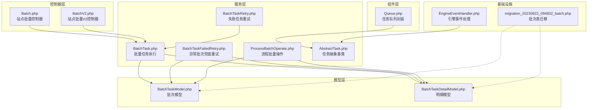
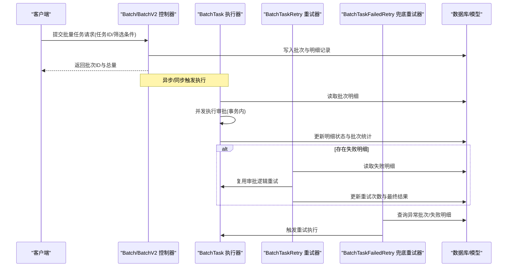
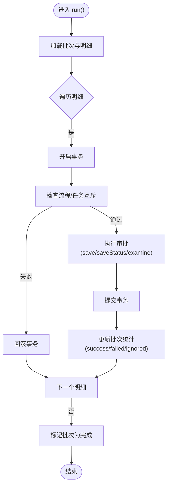
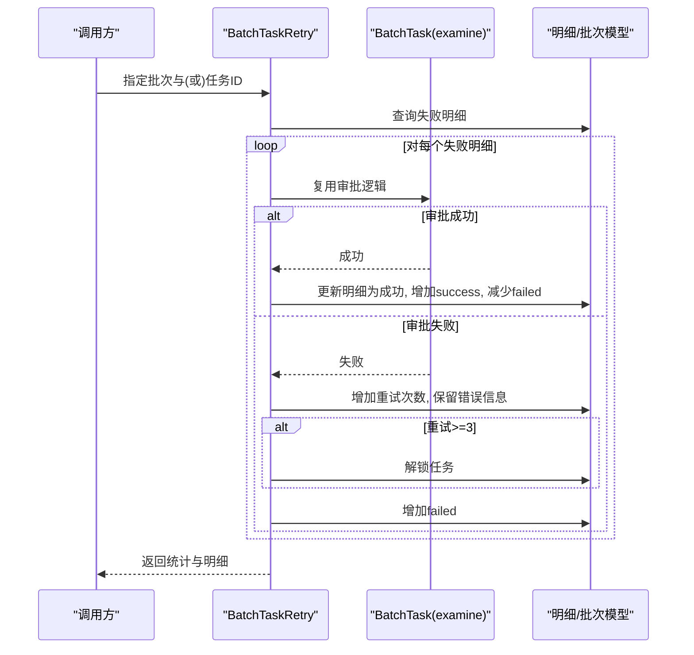
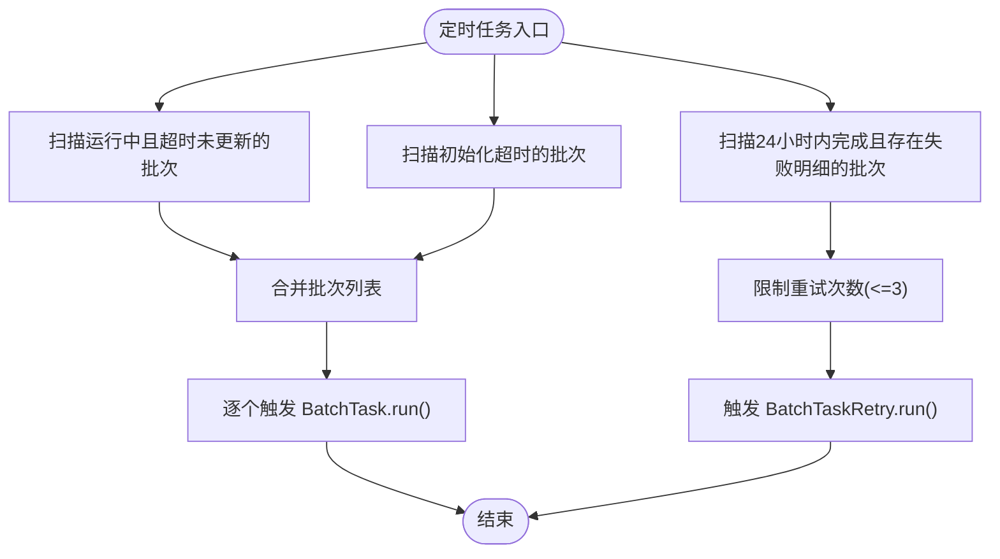
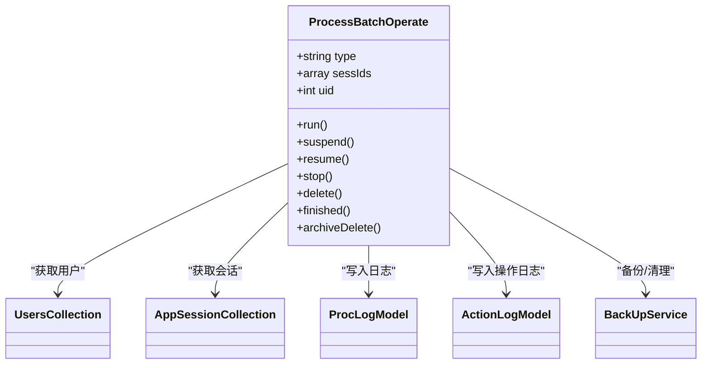
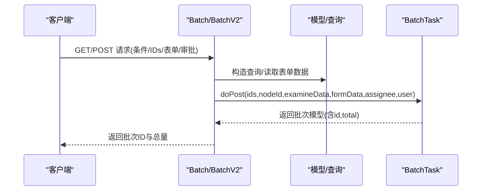
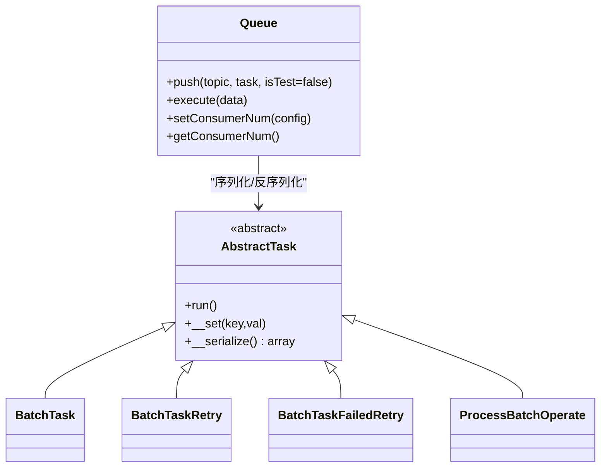
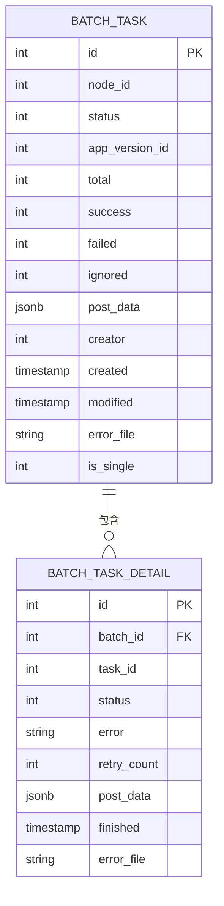
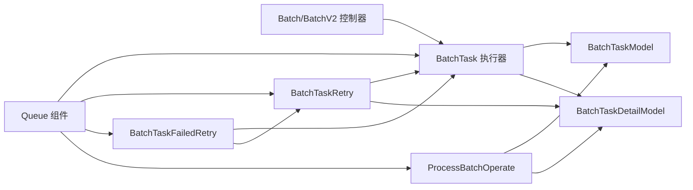

# 批量任务服务

<cite>
**本文引用的文件**
- [Batch.php](file://process/src/http/site/Batch.php)
- [BatchV2.php](file://process/src/http/site/BatchV2.php)
- [BatchTask.php](file://process/src/services/task/BatchTask.php)
- [BatchTaskRetry.php](file://process/src/services/task/BatchTaskRetry.php)
- [BatchTaskFailedRetry.php](file://process/src/services/task/BatchTaskFailedRetry.php)
- [ProcessBatchOperate.php](file://process/src/services/task/ProcessBatchOperate.php)
- [BatchTaskModel.php](file://process/src/models/BatchTaskModel.php)
- [BatchTaskDetailModel.php](file://process/src/models/BatchTaskDetailModel.php)
- [AbstractTask.php](file://process/src/services/task/AbstractTask.php)
- [Queue.php](file://process/src/components/Queue.php)
- [migration_20230822_094832_batch.php](file://process/src/migrations/migration_20230822_094832_batch.php)
- [EngineEventHandler.php](file://process/src/modules/process/EngineEventHandler.php)
</cite>

## 目录
1. [引言](#引言)
2. [项目结构](#项目结构)
3. [核心组件](#核心组件)
4. [架构总览](#架构总览)
5. [详细组件分析](#详细组件分析)
6. [依赖关系分析](#依赖关系分析)
7. [性能考虑](#性能考虑)
8. [故障排查指南](#故障排查指南)
9. [结论](#结论)
10. [附录](#附录)

## 引言
本文件面向 htdNew 项目的“批量任务服务”，系统性阐述批量任务的创建、执行、重试与失败恢复机制，以及流程批量操作能力。文档覆盖以下要点：
- 批量任务创建与提交：基于控制器接口接收任务清单与审批参数，生成批次与明细记录。
- 批量任务执行策略：并发控制、事务隔离、状态流转与错误处理。
- 重试策略：失败任务自动重试、异常批次兜底重试、最大重试次数与解锁机制。
- 流程批量操作：挂起、恢复、终止、删除、完成等批量流程状态变更。
- 接口设计与参数传递：控制器层参数校验、上下文构建与返回结构。
- 性能优化与扩展建议：并发度、数据库索引、队列与消费者配置。

## 项目结构
批量任务相关代码主要分布在以下模块：
- 控制器层：站点控制器负责接收请求、构造查询、生成模板与提交批量任务。
- 服务层：批量任务执行、重试与失败兜底、流程批量操作。
- 模型层：批次与明细的数据结构与状态常量。
- 组件层：任务队列封装与序列化/反序列化。
- 迁移脚本：批次与明细表结构定义。

图表来源
- [Batch.php](file://process/src/http/site/Batch.php#L1-L200)
- [BatchV2.php](file://process/src/http/site/BatchV2.php#L1-L120)
- [BatchTask.php](file://process/src/services/task/BatchTask.php#L1-L135)
- [BatchTaskRetry.php](file://process/src/services/task/BatchTaskRetry.php#L1-L143)
- [BatchTaskFailedRetry.php](file://process/src/services/task/BatchTaskFailedRetry.php#L1-L66)
- [ProcessBatchOperate.php](file://process/src/services/task/ProcessBatchOperate.php#L1-L270)
- [BatchTaskModel.php](file://process/src/models/BatchTaskModel.php#L1-L115)
- [BatchTaskDetailModel.php](file://process/src/models/BatchTaskDetailModel.php#L1-L58)
- [AbstractTask.php](file://process/src/services/task/AbstractTask.php#L1-L30)
- [Queue.php](file://process/src/components/Queue.php#L1-L52)
- [migration_20230822_094832_batch.php](file://process/src/migrations/migration_20230822_094832_batch.php#L35-L61)
- [EngineEventHandler.php](file://process/src/modules/process/EngineEventHandler.php#L166-L203)

章节来源
- [Batch.php](file://process/src/http/site/Batch.php#L1-L200)
- [BatchV2.php](file://process/src/http/site/BatchV2.php#L1-L120)
- [BatchTask.php](file://process/src/services/task/BatchTask.php#L1-L135)
- [BatchTaskRetry.php](file://process/src/services/task/BatchTaskRetry.php#L1-L143)
- [BatchTaskFailedRetry.php](file://process/src/services/task/BatchTaskFailedRetry.php#L1-L66)
- [ProcessBatchOperate.php](file://process/src/services/task/ProcessBatchOperate.php#L1-L270)
- [BatchTaskModel.php](file://process/src/models/BatchTaskModel.php#L1-L115)
- [BatchTaskDetailModel.php](file://process/src/models/BatchTaskDetailModel.php#L1-L58)
- [AbstractTask.php](file://process/src/services/task/AbstractTask.php#L1-L30)
- [Queue.php](file://process/src/components/Queue.php#L1-L52)
- [migration_20230822_094832_batch.php](file://process/src/migrations/migration_20230822_094832_batch.php#L35-L61)
- [EngineEventHandler.php](file://process/src/modules/process/EngineEventHandler.php#L166-L203)

## 核心组件
- 批量任务执行器：负责遍历批次明细、并发执行审批、维护统计计数与状态。
- 失败任务重试器：按批次或指定任务ID重试失败项，记录重试次数并在阈值后解锁。
- 异常批次兜底重试器：检测长时间未更新或超时未启动的批次，自动触发重试。
- 流程批量操作器：对多个流程实例执行挂起、恢复、终止、删除、完成等操作。
- 批次与明细模型：定义状态枚举、统计字段与明细持久化结构。
- 任务队列组件：封装任务序列化、入队与消费执行。
- 抽象任务基类：统一任务生命周期与序列化行为。

章节来源
- [BatchTask.php](file://process/src/services/task/BatchTask.php#L1-L135)
- [BatchTaskRetry.php](file://process/src/services/task/BatchTaskRetry.php#L1-L143)
- [BatchTaskFailedRetry.php](file://process/src/services/task/BatchTaskFailedRetry.php#L1-L66)
- [ProcessBatchOperate.php](file://process/src/services/task/ProcessBatchOperate.php#L1-L270)
- [BatchTaskModel.php](file://process/src/models/BatchTaskModel.php#L1-L115)
- [BatchTaskDetailModel.php](file://process/src/models/BatchTaskDetailModel.php#L1-L58)
- [Queue.php](file://process/src/components/Queue.php#L1-L52)
- [AbstractTask.php](file://process/src/services/task/AbstractTask.php#L1-L30)

## 架构总览
批量任务从控制器接收请求，生成批次与明细，随后由执行器并发处理。失败与异常通过重试器与兜底重试器保障可靠性。流程批量操作器独立于审批流程，提供对实例状态的批量变更。

图表来源
- [Batch.php](file://process/src/http/site/Batch.php#L178-L210)
- [BatchV2.php](file://process/src/http/site/BatchV2.php#L367-L389)
- [BatchTask.php](file://process/src/services/task/BatchTask.php#L24-L103)
- [BatchTaskRetry.php](file://process/src/services/task/BatchTaskRetry.php#L20-L141)
- [BatchTaskFailedRetry.php](file://process/src/services/task/BatchTaskFailedRetry.php#L16-L65)
- [BatchTaskModel.php](file://process/src/models/BatchTaskModel.php#L63-L102)
- [BatchTaskDetailModel.php](file://process/src/models/BatchTaskDetailModel.php#L46-L52)

## 详细组件分析

### 批量任务执行器（BatchTask）
- 并发策略：固定最大协程数，按批次明细并行执行。
- 事务与锁：每条明细在独立事务中执行，避免相互影响；对任务与流程互斥进行检查，防止并发冲突。
- 审批流程：构造审批操作对象，保存表单与审批数据，执行审批并持久化会话状态。
- 统计与状态：根据执行结果更新明细状态与批次统计字段，并最终标记批次为完成。

图表来源
- [BatchTask.php](file://process/src/services/task/BatchTask.php#L24-L135)
- [BatchTaskDetailModel.php](file://process/src/models/BatchTaskDetailModel.php#L46-L52)
- [BatchTaskModel.php](file://process/src/models/BatchTaskModel.php#L63-L102)

章节来源
- [BatchTask.php](file://process/src/services/task/BatchTask.php#L1-L135)
- [BatchTaskDetailModel.php](file://process/src/models/BatchTaskDetailModel.php#L1-L58)
- [BatchTaskModel.php](file://process/src/models/BatchTaskModel.php#L1-L115)

### 失败任务重试器（BatchTaskRetry）
- 重试范围：可按批次或指定任务ID重试失败项；复用审批执行器的审批逻辑。
- 重试次数：失败明细记录重试次数，超过阈值后自动解锁任务。
- 结果汇总：返回成功/失败/忽略数量与明细列表，便于前端展示。

图表来源
- [BatchTaskRetry.php](file://process/src/services/task/BatchTaskRetry.php#L20-L141)
- [BatchTask.php](file://process/src/services/task/BatchTask.php#L105-L135)
- [BatchTaskDetailModel.php](file://process/src/models/BatchTaskDetailModel.php#L21-L33)

章节来源
- [BatchTaskRetry.php](file://process/src/services/task/BatchTaskRetry.php#L1-L143)
- [BatchTask.php](file://process/src/services/task/BatchTask.php#L105-L135)
- [BatchTaskDetailModel.php](file://process/src/models/BatchTaskDetailModel.php#L1-L58)

### 异常批次兜底重试器（BatchTaskFailedRetry）
- 异常检测：两类场景触发重试
  - 运行中但长时间未更新状态的批次。
  - 初始化超过时限仍未执行的批次。
- 失败明细重试：对24小时内完成且存在失败明细的批次，仅重试失败项，限制重试次数。

图表来源
- [BatchTaskFailedRetry.php](file://process/src/services/task/BatchTaskFailedRetry.php#L16-L65)
- [BatchTask.php](file://process/src/services/task/BatchTask.php#L24-L103)
- [BatchTaskRetry.php](file://process/src/services/task/BatchTaskRetry.php#L20-L141)

章节来源
- [BatchTaskFailedRetry.php](file://process/src/services/task/BatchTaskFailedRetry.php#L1-L66)
- [BatchTask.php](file://process/src/services/task/BatchTask.php#L24-L103)
- [BatchTaskRetry.php](file://process/src/services/task/BatchTaskRetry.php#L20-L141)

### 流程批量操作器（ProcessBatchOperate）
- 支持操作：挂起、恢复、终止、删除、完成等。
- 权限校验：对每个实例逐一校验监控权限与授权。
- 日志与备份：记录操作日志与备份流程数据，保证可追溯性。

图表来源
- [ProcessBatchOperate.php](file://process/src/services/task/ProcessBatchOperate.php#L1-L270)

章节来源
- [ProcessBatchOperate.php](file://process/src/services/task/ProcessBatchOperate.php#L1-L270)

### 控制器层（Batch 与 BatchV2）
- 批量列表与筛选：支持关键词、部门、任务ID等条件，返回任务与表单数据摘要。
- 模板导出：生成审批模板（含下拉选项、联动校验），支持单实例或多实例导出。
- 批量提交：接收表单数据、审批数据与可选的受托人配置，创建批次与明细并返回批次ID与总量。
- V2增强：基于默认数据集的批量审批，支持视图配置、字段可见/可搜索/可写与必填字段推导。

图表来源
- [Batch.php](file://process/src/http/site/Batch.php#L105-L191)
- [BatchV2.php](file://process/src/http/site/BatchV2.php#L367-L389)

章节来源
- [Batch.php](file://process/src/http/site/Batch.php#L1-L200)
- [BatchV2.php](file://process/src/http/site/BatchV2.php#L1-L120)
- [BatchV2.php](file://process/src/http/site/BatchV2.php#L367-L389)

### 任务队列与抽象基类
- 任务序列化：仅序列化公开实例属性，避免无关状态进入队列。
- 入队与消费：通过组件封装，将任务对象序列化后写入流式队列，消费端反序列化并调用 run()。
- 抽象基类：统一 run() 接口与无效属性忽略逻辑。

图表来源
- [AbstractTask.php](file://process/src/services/task/AbstractTask.php#L1-L30)
- [Queue.php](file://process/src/components/Queue.php#L1-L52)
- [BatchTask.php](file://process/src/services/task/BatchTask.php#L1-L135)
- [BatchTaskRetry.php](file://process/src/services/task/BatchTaskRetry.php#L1-L143)
- [BatchTaskFailedRetry.php](file://process/src/services/task/BatchTaskFailedRetry.php#L1-L66)
- [ProcessBatchOperate.php](file://process/src/services/task/ProcessBatchOperate.php#L1-L270)

章节来源
- [AbstractTask.php](file://process/src/services/task/AbstractTask.php#L1-L30)
- [Queue.php](file://process/src/components/Queue.php#L1-L52)

### 数据模型与表结构
- 批次模型：包含状态、统计字段、创建者、是否单Excel等，提供明细迭代器。
- 明细模型：记录任务ID、状态、错误信息、重试次数、完成时间等。
- 迁移脚本：定义批次与明细表结构及索引。

图表来源
- [BatchTaskModel.php](file://process/src/models/BatchTaskModel.php#L1-L115)
- [BatchTaskDetailModel.php](file://process/src/models/BatchTaskDetailModel.php#L1-L58)
- [migration_20230822_094832_batch.php](file://process/src/migrations/migration_20230822_094832_batch.php#L35-L61)

章节来源
- [BatchTaskModel.php](file://process/src/models/BatchTaskModel.php#L1-L115)
- [BatchTaskDetailModel.php](file://process/src/models/BatchTaskDetailModel.php#L1-L58)
- [migration_20230822_094832_batch.php](file://process/src/migrations/migration_20230822_094832_batch.php#L35-L61)

## 依赖关系分析
- 控制器依赖模型与服务层，服务层依赖模型与工具组件。
- 执行器与重试器共享审批逻辑，降低重复实现。
- 兜底重试器依赖执行器与重试器，形成闭环。
- 队列组件解耦任务执行与调度，便于水平扩展。

图表来源
- [Batch.php](file://process/src/http/site/Batch.php#L178-L210)
- [BatchV2.php](file://process/src/http/site/BatchV2.php#L367-L389)
- [BatchTask.php](file://process/src/services/task/BatchTask.php#L24-L135)
- [BatchTaskRetry.php](file://process/src/services/task/BatchTaskRetry.php#L20-L141)
- [BatchTaskFailedRetry.php](file://process/src/services/task/BatchTaskFailedRetry.php#L16-L65)
- [ProcessBatchOperate.php](file://process/src/services/task/ProcessBatchOperate.php#L31-L204)
- [Queue.php](file://process/src/components/Queue.php#L26-L40)

章节来源
- [Batch.php](file://process/src/http/site/Batch.php#L178-L210)
- [BatchV2.php](file://process/src/http/site/BatchV2.php#L367-L389)
- [BatchTask.php](file://process/src/services/task/BatchTask.php#L24-L135)
- [BatchTaskRetry.php](file://process/src/services/task/BatchTaskRetry.php#L20-L141)
- [BatchTaskFailedRetry.php](file://process/src/services/task/BatchTaskFailedRetry.php#L16-L65)
- [ProcessBatchOperate.php](file://process/src/services/task/ProcessBatchOperate.php#L31-L204)
- [Queue.php](file://process/src/components/Queue.php#L26-L40)

## 性能考虑
- 并发控制
  - 执行器采用固定最大协程数并发处理明细，避免数据库与业务组件争用。
  - 建议根据CPU核数与数据库连接池上限调整并发度，避免抖动。
- 事务粒度
  - 明细级事务确保失败不影响其他明细，同时减少长事务持有锁的时间。
- 数据库优化
  - 为批次与明细表建立必要索引（如创建者、状态、创建时间、批次ID）以提升查询效率。
  - 批量写入与统计更新使用表达式原子更新，降低竞争。
- 队列与消费者
  - 通过队列组件配置消费者数量，结合任务优先级主题（高/中/低）分流。
  - 消费端幂等处理与重试上限，避免重复执行。
- I/O 与导出
  - 模板导出使用临时文件与定时清理，避免长期占用磁盘空间。
- 监控与告警
  - 关注批次长时间未更新、失败率突增、重试次数达到阈值等指标。

## 故障排查指南
- 常见问题定位
  - 批次状态异常：检查兜底重试器是否触发，确认是否存在长时间未更新或超时未启动的批次。
  - 失败明细过多：查看明细重试次数与错误信息，确认是否达到重试上限并已解锁。
  - 并发冲突：检查任务与流程互斥检查逻辑，确认是否存在他人正在处理。
- 日志与审计
  - 查看流程日志与操作日志，定位异常发生阶段。
  - 对流程批量操作，核对权限校验与授权范围。
- 排查步骤
  1) 确认批次与明细状态是否符合预期。
  2) 检查队列消费者是否正常运行。
  3) 核对数据库索引与慢查询。
  4) 复现失败场景，观察错误栈与事务回滚路径。
  5) 对批量模板导出问题，检查临时文件清理与权限。

章节来源
- [BatchTaskFailedRetry.php](file://process/src/services/task/BatchTaskFailedRetry.php#L16-L65)
- [BatchTaskRetry.php](file://process/src/services/task/BatchTaskRetry.php#L74-L141)
- [BatchTask.php](file://process/src/services/task/BatchTask.php#L54-L96)
- [ProcessBatchOperate.php](file://process/src/services/task/ProcessBatchOperate.php#L37-L204)

## 结论
批量任务服务通过“控制器-执行器-重试器-兜底重试器”的协作，实现了高可靠、可扩展的批量审批能力；配合流程批量操作器，满足大规模流程实例的状态治理需求。通过合理的并发控制、事务隔离与重试策略，系统在复杂业务场景下仍能保持稳定与可观的吞吐。

## 附录

### 接口设计与参数传递
- 批量提交
  - 输入：任务ID数组、环节ID、审批数据、表单数据、受托人配置。
  - 输出：批次ID、总任务数。
- 批量筛选与导出
  - 输入：关键词、部门ID、任务ID数组、节点ID。
  - 输出：任务列表、模板文件（多实例打包或单实例导出）。
- V2 批量审批
  - 输入：视图配置、筛选条件、节点ID、审批数据、表单数据。
  - 输出：批次ID、总任务数。

章节来源
- [Batch.php](file://process/src/http/site/Batch.php#L178-L210)
- [BatchV2.php](file://process/src/http/site/BatchV2.php#L367-L389)

### 异常处理机制
- 表单校验异常：捕获表单验证异常，记录错误并计入失败统计。
- 用户异常：捕获用户异常，记录错误并计入失败统计。
- 其他异常：捕获通用异常，记录错误并解锁任务。
- 事务回滚：在活跃事务中回滚，非活跃事务仅记录错误。

章节来源
- [BatchTask.php](file://process/src/services/task/BatchTask.php#L54-L96)
- [BatchTaskRetry.php](file://process/src/services/task/BatchTaskRetry.php#L74-L141)

### 扩展开发指南
- 新增批量任务类型：继承抽象任务基类，实现 run()，在控制器中注册入口。
- 自定义重试策略：在重试器中扩展条件与阈值，注意与解锁逻辑协同。
- 队列与消费者：通过队列组件配置主题与消费者数量，结合业务优先级进行分流。
- 监控与可观测性：为关键指标（批次成功率、失败率、重试次数、队列积压）埋点并告警。

章节来源
- [AbstractTask.php](file://process/src/services/task/AbstractTask.php#L1-L30)
- [Queue.php](file://process/src/components/Queue.php#L26-L40)
- [EngineEventHandler.php](file://process/src/modules/process/EngineEventHandler.php#L166-L203)