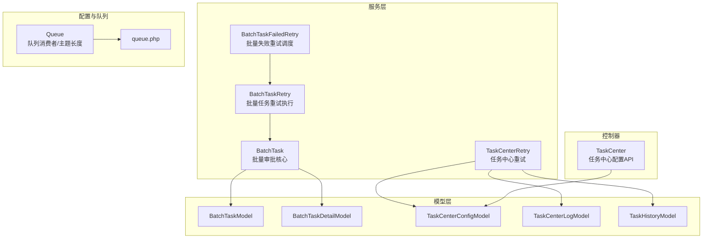
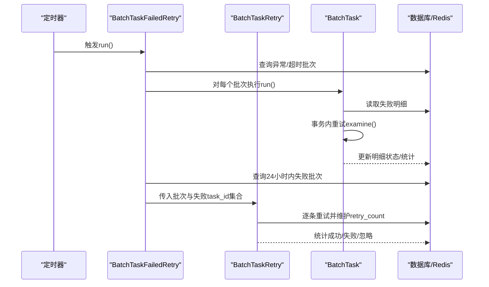
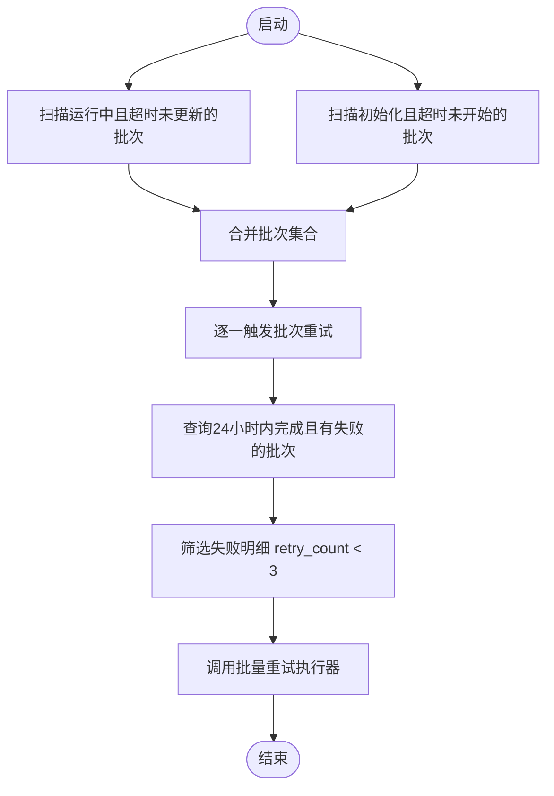
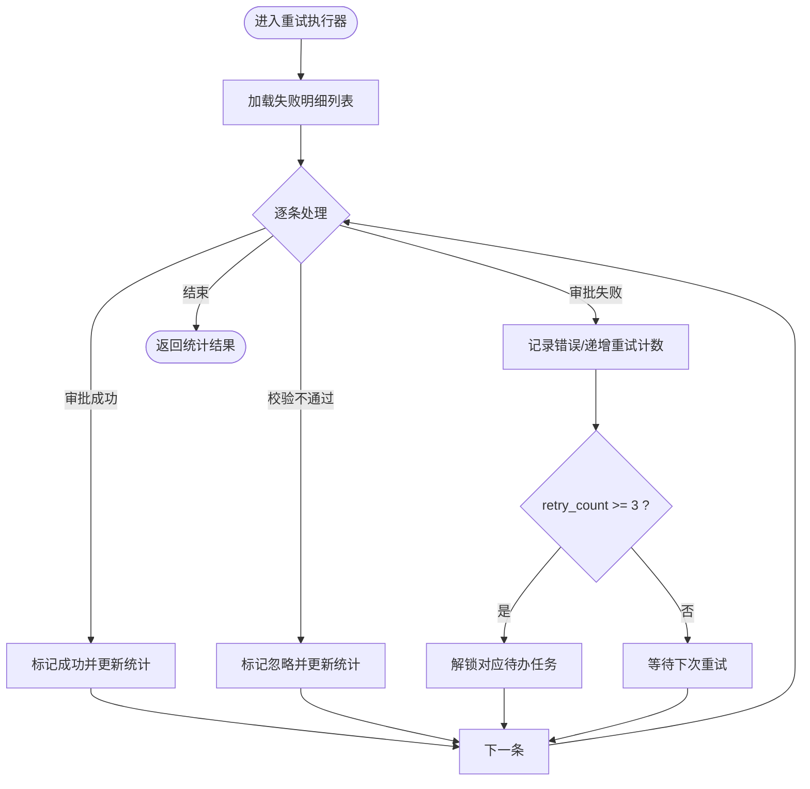
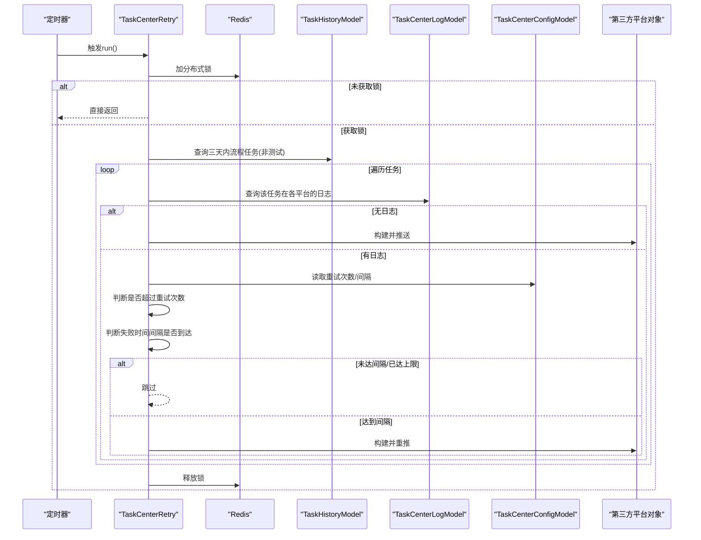
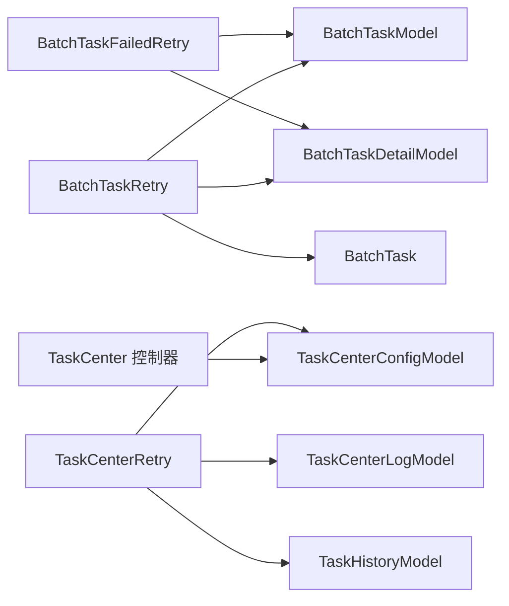

# 批量任务重试

<cite>
**本文引用的文件**
- [BatchTaskFailedRetry.php](file://process/src/services/task/BatchTaskFailedRetry.php)
- [BatchTaskRetry.php](file://process/src/services/task/BatchTaskRetry.php)
- [BatchTask.php](file://process/src/services/task/BatchTask.php)
- [BatchTaskModel.php](file://process/src/models/BatchTaskModel.php)
- [BatchTaskDetailModel.php](file://process/src/models/BatchTaskDetailModel.php)
- [TaskCenterRetry.php](file://process/src/services/task/TaskCenterRetry.php)
- [TaskCenterConfigModel.php](file://process/src/models/TaskCenterConfigModel.php)
- [TaskCenterLogModel.php](file://process/src/models/TaskCenterLogModel.php)
- [TaskCenter.php](file://process/src/http/system/TaskCenter.php)
- [TaskCenterLogService.php](file://process/src/services/taskCenter/TaskCenterLogService.php)
- [TaskHistoryModel.php](file://process/src/models/TaskHistoryModel.php)
- [Queue.php](file://process/src/components/Queue.php)
- [queue.php](file://process/src/config/queue.php)
- [SendMessageListener.php](file://process/src/services/listeners/SendMessageListener.php)
- [StudentAccessRecord.php](file://process_envs/gdufs/product/task/StudentAccessRecord.php)
</cite>

## 目录
1. [引言](#引言)
2. [项目结构](#项目结构)
3. [核心组件](#核心组件)
4. [架构总览](#架构总览)
5. [详细组件分析](#详细组件分析)
6. [依赖关系分析](#依赖关系分析)
7. [性能考量](#性能考量)
8. [故障排除指南](#故障排除指南)
9. [结论](#结论)
10. [附录](#附录)

## 引言
本文件围绕“批量任务重试”机制展开，系统性阐述以下内容：
- 批量任务的重试策略与失败处理流程
- 重试服务的工作原理：重试条件判断、重试间隔设置、最大重试次数与重试队列管理
- 失败任务的识别、分类与处理策略
- 重试机制的配置项、性能影响与监控指标
- 重试策略调优建议与故障排除方法

## 项目结构
与批量任务重试直接相关的模块主要分布在以下位置：
- 服务层：批量任务重试与失败检测、任务中心重试
- 模型层：批量任务与明细、任务中心配置与日志、任务历史
- 配置与队列：队列消费者数量与主题长度等
- 控制器：任务中心配置的增删改查

图表来源
- [BatchTaskFailedRetry.php](file://process/src/services/task/BatchTaskFailedRetry.php#L1-L66)
- [BatchTaskRetry.php](file://process/src/services/task/BatchTaskRetry.php#L1-L143)
- [BatchTask.php](file://process/src/services/task/BatchTask.php#L64-L90)
- [BatchTaskModel.php](file://process/src/models/BatchTaskModel.php#L1-L115)
- [BatchTaskDetailModel.php](file://process/src/models/BatchTaskDetailModel.php#L1-L58)
- [TaskCenterRetry.php](file://process/src/services/task/TaskCenterRetry.php#L1-L223)
- [TaskCenterConfigModel.php](file://process/src/models/TaskCenterConfigModel.php#L1-L62)
- [TaskCenterLogModel.php](file://process/src/models/TaskCenterLogModel.php#L1-L74)
- [TaskHistoryModel.php](file://process/src/models/TaskHistoryModel.php#L1-L270)
- [queue.php](file://process/src/config/queue.php#L1-L13)
- [Queue.php](file://process/src/components/Queue.php#L48-L95)
- [TaskCenter.php](file://process/src/http/system/TaskCenter.php#L815-L861)

章节来源
- [BatchTaskFailedRetry.php](file://process/src/services/task/BatchTaskFailedRetry.php#L1-L66)
- [TaskCenterRetry.php](file://process/src/services/task/TaskCenterRetry.php#L1-L223)
- [TaskCenter.php](file://process/src/http/system/TaskCenter.php#L815-L861)

## 核心组件
- 批量失败重试调度器：定时扫描异常批量任务并触发重试
- 批量任务重试执行器：对失败明细进行重试，维护统计与错误信息
- 批量审批核心：封装审批流程与状态变更
- 任务中心重试器：按配置对未推送或失败的任务进行重推
- 配置与日志模型：任务中心重试次数与间隔、推送日志与状态
- 队列与监听：消息入队与延迟/定时发送策略

章节来源
- [BatchTaskFailedRetry.php](file://process/src/services/task/BatchTaskFailedRetry.php#L1-L66)
- [BatchTaskRetry.php](file://process/src/services/task/BatchTaskRetry.php#L1-L143)
- [BatchTask.php](file://process/src/services/task/BatchTask.php#L64-L90)
- [TaskCenterRetry.php](file://process/src/services/task/TaskCenterRetry.php#L1-L223)
- [TaskCenterConfigModel.php](file://process/src/models/TaskCenterConfigModel.php#L1-L62)
- [TaskCenterLogModel.php](file://process/src/models/TaskCenterLogModel.php#L1-L74)
- [TaskHistoryModel.php](file://process/src/models/TaskHistoryModel.php#L1-L270)

## 架构总览
批量任务重试由“检测-分类-重试-监控”闭环构成：
- 检测：通过批量失败重试调度器识别长时间无更新或长时间未开始的批量任务，以及24小时内有失败明细的批次
- 分类：区分“异常退出的批次”和“失败明细”，分别进入不同重试路径
- 重试：批量任务重试执行器对失败明细逐条重试，事务内原子处理；任务中心重试器按配置进行重推
- 监控：任务中心日志记录推送结果、失败时间与重试计数，支持查询与可视化

图表来源
- [BatchTaskFailedRetry.php](file://process/src/services/task/BatchTaskFailedRetry.php#L1-L66)
- [BatchTaskRetry.php](file://process/src/services/task/BatchTaskRetry.php#L1-L143)
- [BatchTask.php](file://process/src/services/task/BatchTask.php#L64-L90)

## 详细组件分析

### 批量失败重试调度器（BatchTaskFailedRetry）
职责：
- 发现两类异常批次并重试：
  - 正在运行但长时间未更新状态（默认10分钟）
  - 初始化超过一定时间仍未开始（默认1小时）
- 发现24小时内“完成但存在失败”的批次，筛选失败明细（retry_count < 3）并触发批量重试

关键点：
- 时间阈值硬编码于调度器中
- 对失败明细重试时，使用批量重试执行器，并限制最大重试次数

图表来源
- [BatchTaskFailedRetry.php](file://process/src/services/task/BatchTaskFailedRetry.php#L1-L66)

章节来源
- [BatchTaskFailedRetry.php](file://process/src/services/task/BatchTaskFailedRetry.php#L1-L66)

### 批量任务重试执行器（BatchTaskRetry）
职责：
- 对失败明细进行重试，继承自批量审批核心
- 在事务内调用审批流程，根据异常类型更新错误信息与重试计数
- 达到最大重试次数后，解锁对应待办任务，避免阻塞

关键点：
- 重试次数上限：单个明细达到固定阈值后解锁
- 错误分类：表单校验异常、用户异常、其他异常分别处理
- 统计输出：成功/失败/忽略计数与明细

图表来源
- [BatchTaskRetry.php](file://process/src/services/task/BatchTaskRetry.php#L1-L143)
- [BatchTask.php](file://process/src/services/task/BatchTask.php#L64-L90)
- [BatchTaskDetailModel.php](file://process/src/models/BatchTaskDetailModel.php#L1-L58)

章节来源
- [BatchTaskRetry.php](file://process/src/services/task/BatchTaskRetry.php#L1-L143)
- [BatchTask.php](file://process/src/services/task/BatchTask.php#L64-L90)
- [BatchTaskDetailModel.php](file://process/src/models/BatchTaskDetailModel.php#L1-L58)

### 批量审批核心（BatchTask）
职责：
- 封装审批流程入口，负责状态更新与统计维护
- 在异常分支中回滚事务并记录错误，同时更新批次失败计数

章节来源
- [BatchTask.php](file://process/src/services/task/BatchTask.php#L64-L90)
- [BatchTaskModel.php](file://process/src/models/BatchTaskModel.php#L1-L115)

### 任务中心重试器（TaskCenterRetry）
职责：
- 重试范围：最近三天内非测试流程任务
- 重试条件：
  - 未推送：直接构建数据并推送
  - 失败重试：受配置控制（最大重试次数、失败间隔）
- 并发控制：使用Redis分布式锁，避免重复执行
- 数据一致性：对比任务状态与日志记录，确保只在必要时重推

图表来源
- [TaskCenterRetry.php](file://process/src/services/task/TaskCenterRetry.php#L1-L223)
- [TaskCenterConfigModel.php](file://process/src/models/TaskCenterConfigModel.php#L1-L62)
- [TaskCenterLogModel.php](file://process/src/models/TaskCenterLogModel.php#L1-L74)
- [TaskHistoryModel.php](file://process/src/models/TaskHistoryModel.php#L1-L270)

章节来源
- [TaskCenterRetry.php](file://process/src/services/task/TaskCenterRetry.php#L1-L223)
- [TaskCenterConfigModel.php](file://process/src/models/TaskCenterConfigModel.php#L1-L62)
- [TaskCenterLogModel.php](file://process/src/models/TaskCenterLogModel.php#L1-L74)
- [TaskHistoryModel.php](file://process/src/models/TaskHistoryModel.php#L1-L270)

### 任务中心配置与日志
- 配置模型：存储最大重试次数与失败重试间隔（分钟）
- 日志模型：记录推送状态、重试次数、失败时间、推送结果等
- 日志服务：在推送后更新日志，失败时递增重试计数并记录失败时间

章节来源
- [TaskCenterConfigModel.php](file://process/src/models/TaskCenterConfigModel.php#L1-L62)
- [TaskCenterLogModel.php](file://process/src/models/TaskCenterLogModel.php#L1-L74)
- [TaskCenterLogService.php](file://process/src/services/taskCenter/TaskCenterLogService.php#L48-L78)
- [TaskCenter.php](file://process/src/http/system/TaskCenter.php#L815-L861)

### 队列与监听（与重试的关系）
- 队列消费者数量与主题长度可通过配置与组件读取
- 消息发送监听器在事务成功后将消息入队，支持延时/定时发送策略
- 重试与队列的关系体现在：失败明细可能通过队列进一步派发或延后处理

章节来源
- [queue.php](file://process/src/config/queue.php#L1-L13)
- [Queue.php](file://process/src/components/Queue.php#L48-L95)
- [SendMessageListener.php](file://process/src/services/listeners/SendMessageListener.php#L76-L105)

### 外部重试示例（环境特定）
- 某环境任务在调用外部API时采用固定最大重试次数与日志记录，超过次数后返回错误信息而非抛出异常，便于上层统一处理

章节来源
- [StudentAccessRecord.php](file://process_envs/gdufs/product/task/StudentAccessRecord.php#L373-L404)

## 依赖关系分析
- 批量失败重试调度器依赖模型层的批次与明细表，用于判定异常与筛选失败明细
- 批量重试执行器继承批量审批核心，复用审批流程与状态更新逻辑
- 任务中心重试器依赖配置模型与日志模型，结合第三方平台对象进行重推
- 控制器提供任务中心配置的增删改查，直接影响重试行为

图表来源
- [BatchTaskFailedRetry.php](file://process/src/services/task/BatchTaskFailedRetry.php#L1-L66)
- [BatchTaskRetry.php](file://process/src/services/task/BatchTaskRetry.php#L1-L143)
- [BatchTask.php](file://process/src/services/task/BatchTask.php#L64-L90)
- [TaskCenterRetry.php](file://process/src/services/task/TaskCenterRetry.php#L1-L223)
- [TaskCenterConfigModel.php](file://process/src/models/TaskCenterConfigModel.php#L1-L62)
- [TaskCenterLogModel.php](file://process/src/models/TaskCenterLogModel.php#L1-L74)
- [TaskHistoryModel.php](file://process/src/models/TaskHistoryModel.php#L1-L270)
- [TaskCenter.php](file://process/src/http/system/TaskCenter.php#L815-L861)

## 性能考量
- 时间阈值与扫描范围
  - 批量失败重试调度器对“运行中超时/初始化超时”的批次进行全表扫描，建议结合索引优化与分页/限流策略
  - 任务中心重试器限定三天内非测试任务，减少扫描范围
- 事务与并发
  - 批量重试执行器在事务内处理，失败回滚并更新统计，注意长事务对数据库压力
  - 任务中心重试器使用Redis分布式锁，避免重复执行，建议锁超时合理设置
- 重试次数与间隔
  - 任务中心重试次数与间隔直接影响重试频率与系统负载，应结合业务峰值与下游能力调优
- 队列与消费
  - 队列消费者数量与主题长度可作为弹性扩容手段，配合限流与背压策略

## 故障排除指南
- 批量任务长时间无进展
  - 检查“运行中超时未更新”与“初始化超时未开始”的阈值是否合理
  - 确认调度器是否正常执行与日志输出
- 失败明细无法重试
  - 核对失败明细的重试计数是否已达上限
  - 检查异常类型分支是否正确记录错误与回滚事务
- 任务中心重试未生效
  - 确认配置的最大重试次数与失败间隔是否正确
  - 检查日志中失败时间与重试计数是否按预期更新
  - 核对Redis分布式锁是否被占用或提前释放
- 队列积压或消费异常
  - 查看队列主题长度与消费者数量配置
  - 检查监听器在事务成功后的入队时机与参数

章节来源
- [BatchTaskFailedRetry.php](file://process/src/services/task/BatchTaskFailedRetry.php#L1-L66)
- [BatchTaskRetry.php](file://process/src/services/task/BatchTaskRetry.php#L1-L143)
- [TaskCenterRetry.php](file://process/src/services/task/TaskCenterRetry.php#L1-L223)
- [TaskCenterLogService.php](file://process/src/services/taskCenter/TaskCenterLogService.php#L48-L78)
- [Queue.php](file://process/src/components/Queue.php#L48-L95)
- [queue.php](file://process/src/config/queue.php#L1-L13)

## 结论
本机制通过“异常检测—分类—重试—监控”的闭环设计，实现了对批量任务失败的自动化恢复与可观测性。关键在于：
- 明确的重试条件与阈值（时间、次数、间隔）
- 事务内原子重试与失败明细的精细化控制
- 任务中心重试的配置化与幂等保障
- 队列与监听的协同以支撑异步与延时场景

## 附录

### 配置项与含义
- 任务中心重试次数（最大重试次数）
- 任务中心重试间隔（分钟）
- 批量失败重试时间阈值（运行中超时、初始化超时）
- 批量失败明细最大重试次数（单条明细）

章节来源
- [TaskCenterConfigModel.php](file://process/src/models/TaskCenterConfigModel.php#L1-L62)
- [TaskCenter.php](file://process/src/http/system/TaskCenter.php#L815-L861)
- [BatchTaskFailedRetry.php](file://process/src/services/task/BatchTaskFailedRetry.php#L1-L66)
- [BatchTaskRetry.php](file://process/src/services/task/BatchTaskRetry.php#L1-L143)