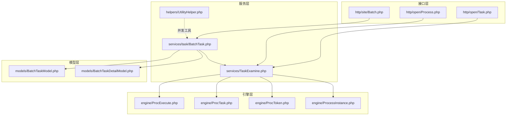
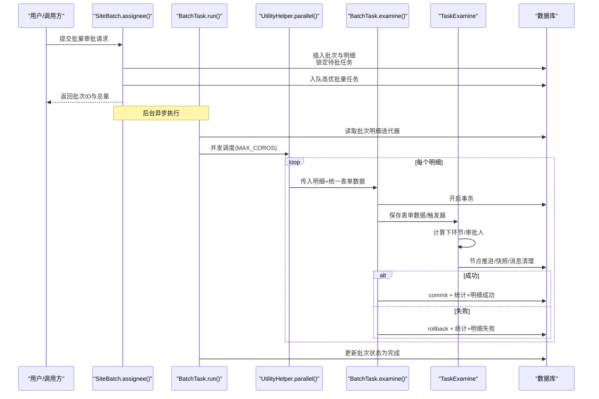
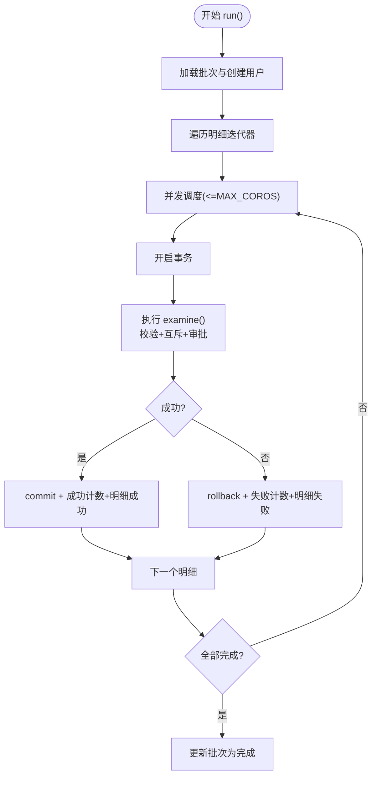
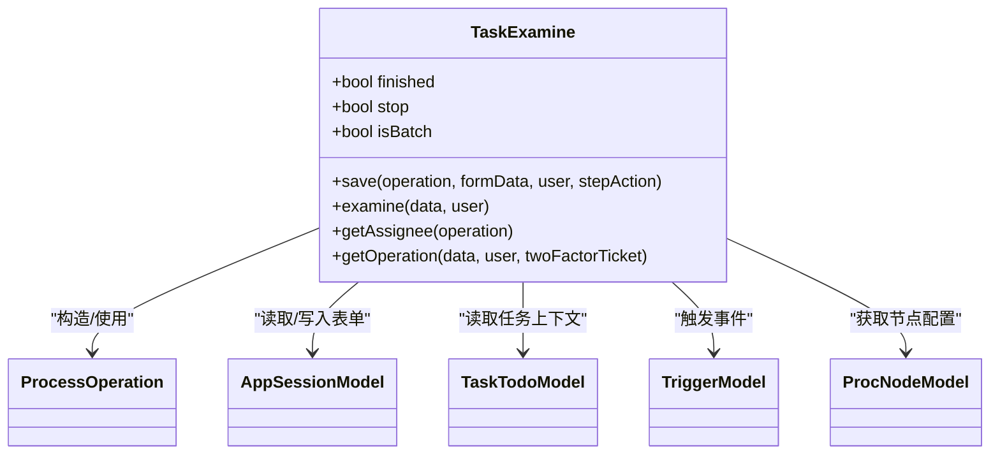
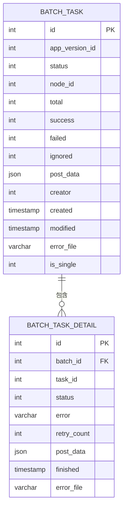
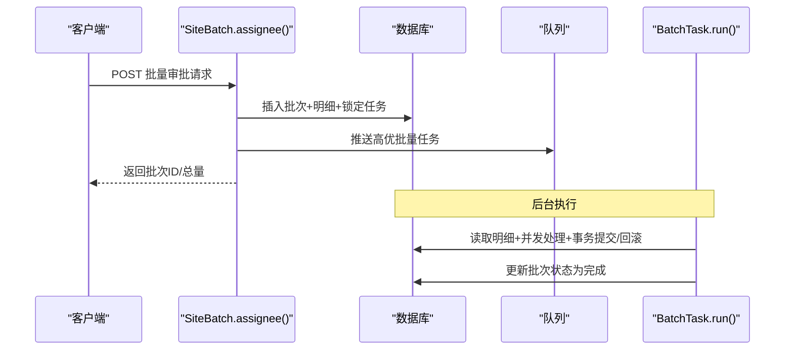
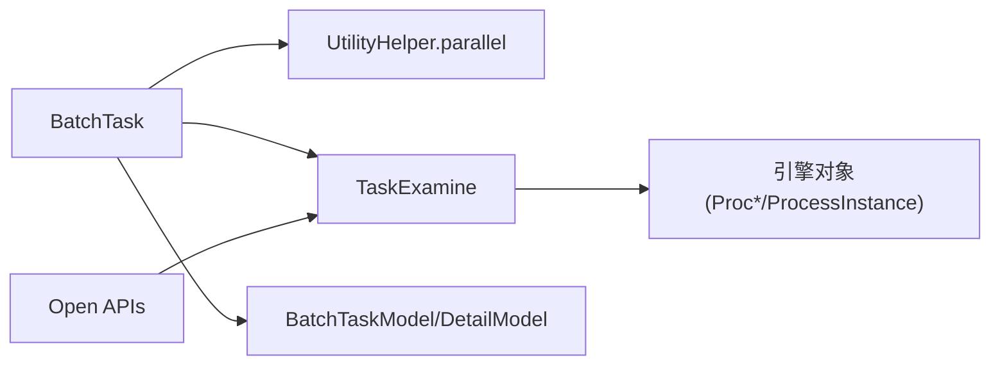

# 流程批量操作

<cite>
**本文引用的文件**
- [BatchTask.php](file://process/src/services/task/BatchTask.php)
- [BatchTaskModel.php](file://process/src/models/BatchTaskModel.php)
- [BatchTaskDetailModel.php](file://process/src/models/BatchTaskDetailModel.php)
- [Batch.php](file://process/src/http/site/Batch.php)
- [BatchV2.php](file://process/src/http/site/BatchV2.php)
- [UtilityHelper.php](file://process/src/helpers/UtilityHelper.php)
- [TaskExamine.php](file://process/src/services/TaskExamine.php)
- [ProcExecute.php](file://process/src/engine/ProcExecute.php)
- [ProcTask.php](file://process/src/engine/ProcTask.php)
- [ProcToken.php](file://process/src/engine/ProcToken.php)
- [ProcessInstance.php](file://process/src/engine/ProcessInstance.php)
- [Task.php](file://process/src/http/open/Task.php)
- [Process.php](file://process/src/http/open/Process.php)
- [migration_20240629_node_batch_Approve_defaule.php](file://process/src/migrations/migration_20240629_node_batch_Approve_defaule.php)
</cite>

## 目录
1. [引言](#引言)
2. [项目结构](#项目结构)
3. [核心组件](#核心组件)
4. [架构总览](#架构总览)
5. [详细组件分析](#详细组件分析)
6. [依赖分析](#依赖分析)
7. [性能考量](#性能考量)
8. [故障排查指南](#故障排查指南)
9. [结论](#结论)
10. [附录](#附录)

## 引言
本文件围绕流程引擎中的“批量操作”能力，系统性梳理批量节点执行、批量任务分配与批量状态更新的实现原理与策略，阐述其与流程引擎的集成方式与数据流转过程，并覆盖权限控制、并发安全与事务管理要点。同时提供使用示例与性能优化建议，帮助读者在实际场景中高效、安全地落地批量审批。

## 项目结构
批量操作涉及三层：HTTP 接口层负责接收请求与校验、服务层负责并发调度与事务控制、模型层负责持久化与状态统计。流程引擎侧通过 TaskExamine 与引擎对象协同完成节点执行与状态推进。

图表来源
- [Batch.php](file://process/src/http/site/Batch.php#L180-L2037)
- [BatchTask.php](file://process/src/services/task/BatchTask.php#L1-L135)
- [TaskExamine.php](file://process/src/services/TaskExamine.php#L1-L266)
- [BatchTaskModel.php](file://process/src/models/BatchTaskModel.php#L1-L115)
- [BatchTaskDetailModel.php](file://process/src/models/BatchTaskDetailModel.php#L1-L58)
- [ProcExecute.php](file://process/src/engine/ProcExecute.php#L1-L11)
- [ProcTask.php](file://process/src/engine/ProcTask.php#L1-L11)
- [ProcToken.php](file://process/src/engine/ProcToken.php#L1-L11)
- [ProcessInstance.php](file://process/src/engine/ProcessInstance.php#L1-L11)

章节来源
- [Batch.php](file://process/src/http/site/Batch.php#L180-L2037)
- [BatchTask.php](file://process/src/services/task/BatchTask.php#L1-L135)
- [TaskExamine.php](file://process/src/services/TaskExamine.php#L1-L266)

## 核心组件
- 批量任务服务：负责并发调度、事务拆分、状态统计与异常回滚。
- 批量任务模型：记录批次元数据、状态与计数。
- 批量任务明细模型：记录每条任务的执行状态、错误信息与重试次数。
- 审批服务：封装保存表单数据、触发器、节点跳转与流程推进。
- 并发工具：基于协程通道与屏障的并行执行器。
- 引擎适配：对上游引擎类进行命名空间适配，确保序列化兼容。

章节来源
- [BatchTask.php](file://process/src/services/task/BatchTask.php#L1-L135)
- [BatchTaskModel.php](file://process/src/models/BatchTaskModel.php#L1-L115)
- [BatchTaskDetailModel.php](file://process/src/models/BatchTaskDetailModel.php#L1-L58)
- [TaskExamine.php](file://process/src/services/TaskExamine.php#L1-L266)
- [UtilityHelper.php](file://process/src/helpers/UtilityHelper.php#L351-L405)
- [ProcExecute.php](file://process/src/engine/ProcExecute.php#L1-L11)
- [ProcTask.php](file://process/src/engine/ProcTask.php#L1-L11)
- [ProcToken.php](file://process/src/engine/ProcToken.php#L1-L11)
- [ProcessInstance.php](file://process/src/engine/ProcessInstance.php#L1-L11)

## 架构总览
批量审批从接口层接收请求，构建批次与明细，预占任务并入队高优任务，后台服务并发执行，每个明细独立开启事务，分别落库统计与回写状态。审批流程通过 TaskExamine 完成表单保存、触发器与节点推进，最终汇总批次状态。

图表来源
- [Batch.php](file://process/src/http/site/Batch.php#L180-L2037)
- [BatchTask.php](file://process/src/services/task/BatchTask.php#L1-L135)
- [UtilityHelper.php](file://process/src/helpers/UtilityHelper.php#L351-L405)
- [TaskExamine.php](file://process/src/services/TaskExamine.php#L1-L266)

## 详细组件分析

### 批量任务服务（并发执行与事务）
- 并发策略：使用并发工具限制最大协程数，对明细集合进行并行遍历，每个明细独立事务，避免串行瓶颈。
- 事务边界：每个明细独立开启事务，成功提交、失败回滚，保证数据一致性。
- 状态统计：成功/失败/忽略均通过表达式原子自增，减少竞争写。
- 异常处理：捕获表单校验异常、用户异常与通用异常，分别记录错误信息并回滚，必要时释放任务互斥锁。
- 断点续传：批次状态初始化后进入运行态，支持后续重试与恢复。

图表来源
- [BatchTask.php](file://process/src/services/task/BatchTask.php#L1-L135)

章节来源
- [BatchTask.php](file://process/src/services/task/BatchTask.php#L1-L135)

### 审批服务（表单保存、触发器与节点推进）
- 表单保存：根据节点场景与表单授权，逐表单生成保存数据，批量模式下对手写签名等组件进行追加合并。
- 触发器：在动作前触发器与审批事件中保持幂等，确保重复执行的安全性。
- 节点推进：计算下环节与审批人，执行操作、跳过后续任务、创建快照、清理消息与委托任务。
- 临时保存：支持暂存审批数据，便于后续继续。

图表来源
- [TaskExamine.php](file://process/src/services/TaskExamine.php#L1-L266)

章节来源
- [TaskExamine.php](file://process/src/services/TaskExamine.php#L1-L266)

### 批量任务模型与明细模型
- 批量任务模型：记录应用版本、环节、状态、计数、创建者、是否单文件等，提供明细迭代器与序列号生成。
- 明细模型：记录批次ID、任务ID、状态、错误信息、重试次数、Excel场景下的明细表单数据等。

图表来源
- [BatchTaskModel.php](file://process/src/models/BatchTaskModel.php#L1-L115)
- [BatchTaskDetailModel.php](file://process/src/models/BatchTaskDetailModel.php#L1-L58)

章节来源
- [BatchTaskModel.php](file://process/src/models/BatchTaskModel.php#L1-L115)
- [BatchTaskDetailModel.php](file://process/src/models/BatchTaskDetailModel.php#L1-L58)

### 接口层（站点与开放接口）
- 站点接口：接收批量审批请求，构建批次与明细，锁定待批任务，入队高优任务，返回批次ID与总量。
- 开放接口：提供批量节点查询、任务回收等能力，支撑外部系统对接。

图表来源
- [Batch.php](file://process/src/http/site/Batch.php#L180-L2037)
- [BatchTask.php](file://process/src/services/task/BatchTask.php#L1-L135)

章节来源
- [Batch.php](file://process/src/http/site/Batch.php#L180-L2037)
- [BatchV2.php](file://process/src/http/site/BatchV2.php#L1-L45)
- [Task.php](file://process/src/http/open/Task.php#L144-L180)
- [Process.php](file://process/src/http/open/Process.php#L190-L215)

### 引擎适配与迁移
- 引擎适配：对上游引擎类进行命名空间适配，保留序列化兼容性。
- 迁移脚本：默认启用节点批量审批开关，确保新旧节点具备批量能力。

章节来源
- [ProcExecute.php](file://process/src/engine/ProcExecute.php#L1-L11)
- [ProcTask.php](file://process/src/engine/ProcTask.php#L1-L11)
- [ProcToken.php](file://process/src/engine/ProcToken.php#L1-L11)
- [ProcessInstance.php](file://process/src/engine/ProcessInstance.php#L1-L11)
- [migration_20240629_node_batch_Approve_defaule.php](file://process/src/migrations/migration_20240629_node_batch_Approve_defaule.php#L1-L24)

## 依赖分析
- 组件耦合
  - BatchTask 依赖 UtilityHelper 的并行执行器与 TaskExamine 的审批流程。
  - TaskExamine 依赖引擎对象（ProcExecute/ProcTask/ProcToken/ProcessInstance）与节点配置。
  - 模型层承担状态持久化职责，服务层通过表达式原子更新降低竞争。
- 外部依赖
  - 数据库事务与批量插入。
  - 队列系统用于高优任务投递。
- 潜在循环依赖
  - 服务层与引擎层通过方法调用解耦，未见直接循环依赖迹象。

图表来源
- [BatchTask.php](file://process/src/services/task/BatchTask.php#L1-L135)
- [UtilityHelper.php](file://process/src/helpers/UtilityHelper.php#L351-L405)
- [TaskExamine.php](file://process/src/services/TaskExamine.php#L1-L266)
- [BatchTaskModel.php](file://process/src/models/BatchTaskModel.php#L1-L115)
- [BatchTaskDetailModel.php](file://process/src/models/BatchTaskDetailModel.php#L1-L58)

章节来源
- [BatchTask.php](file://process/src/services/task/BatchTask.php#L1-L135)
- [TaskExamine.php](file://process/src/services/TaskExamine.php#L1-L266)
- [UtilityHelper.php](file://process/src/helpers/UtilityHelper.php#L351-L405)

## 性能考量
- 并发度控制：通过最大协程数限制避免数据库连接与锁竞争；根据实例规格与数据库性能调优。
- 事务粒度：明细级事务降低长事务占用，提升吞吐；注意异常分支的回滚成本。
- 原子更新：使用表达式自增减少热点写竞争。
- I/O 优化：批量插入明细、尽量减少跨模块查询。
- 缓存与锁：节点配置与应用版本采用缓存读取；互斥锁与任务锁定避免并发冲突。
- 日志与可观测：对异常与回滚路径记录日志，便于定位性能瓶颈。

## 故障排查指南
- 权限与状态
  - 仅批次创建者可取消未运行的批次。
  - 任务被他人处理或流程挂起时会抛出用户异常，需检查互斥锁与会话状态。
- 并发与死锁
  - 预锁定待批任务，完成后释放；若异常回滚需确保任务状态复位。
  - 并发度过高可能导致锁竞争，适当下调 MAX_COROS。
- 事务与回滚
  - 表单校验异常与通用异常均会回滚；确认触发器幂等性，避免重复副作用。
- 数据一致性
  - 成功/失败/忽略计数通过表达式更新，确保原子性；如出现不一致，核查表达式与并发写入。
- 日志与追踪
  - 关注批次与明细状态变化，结合日志定位具体失败原因。

章节来源
- [Batch.php](file://process/src/http/site/Batch.php#L2159-L2175)
- [BatchTask.php](file://process/src/services/task/BatchTask.php#L1-L135)

## 结论
该批量操作方案以“明细级事务 + 并发调度 + 原子计数”为核心，结合 TaskExamine 的审批流程与引擎对象，实现了高吞吐、强一致的批量节点执行与状态更新。通过严格的权限控制、互斥锁与异常回滚机制，保障了并发安全与数据一致性。配合队列与表达式更新，可在大规模场景下获得稳定性能表现。

## 附录

### 使用示例（步骤说明）
- 准备阶段
  - 确认目标环节已启用批量审批。
  - 准备待批任务ID列表与审批数据（含动作、意见、表单数据等）。
- 创建批次
  - 调用站点接口提交批量审批请求，系统插入批次与明细并锁定任务，随后入队高优任务。
- 查看进度
  - 通过日志接口查看批次状态、成功/失败/忽略计数与错误文件。
- 取消批次
  - 仅批次创建者且处于初始状态可取消；系统删除批次与明细并释放任务锁定。

章节来源
- [Batch.php](file://process/src/http/site/Batch.php#L180-L2037)
- [Batch.php](file://process/src/http/site/Batch.php#L2106-L2181)
- [BatchTask.php](file://process/src/services/task/BatchTask.php#L1-L135)