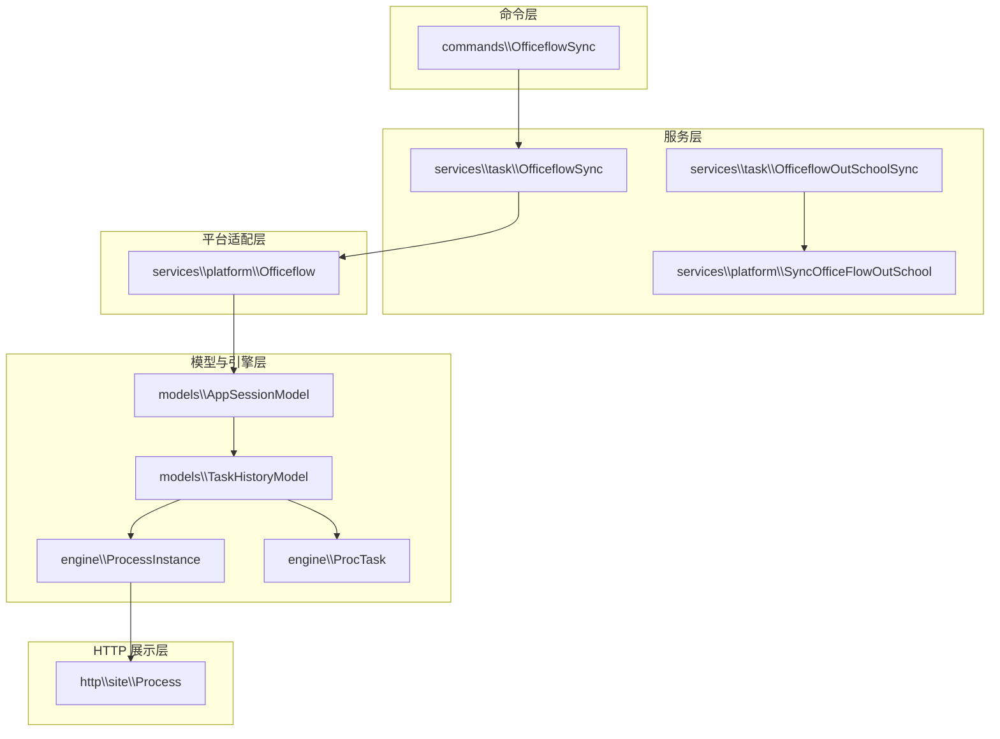
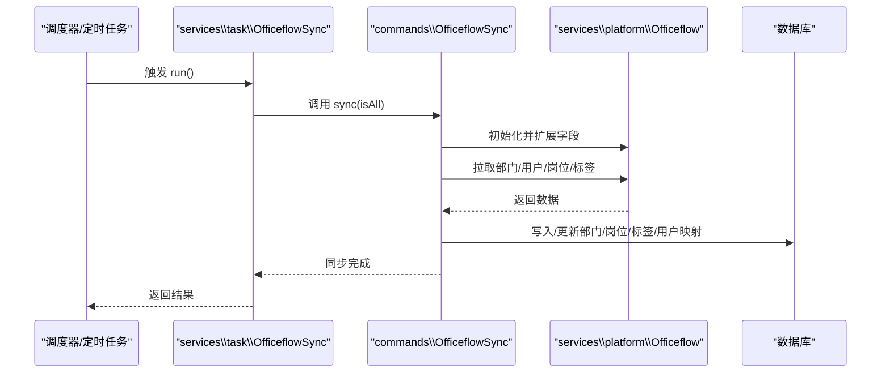
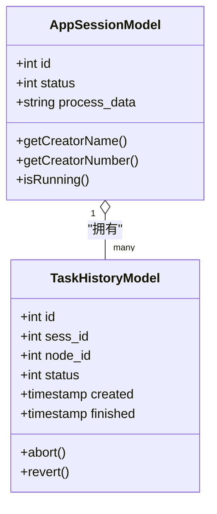
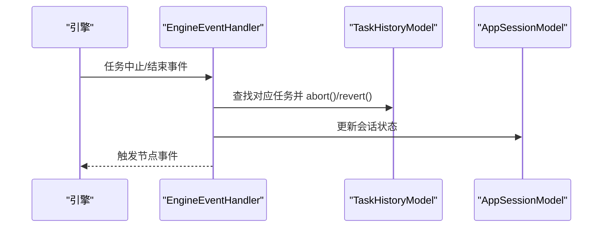
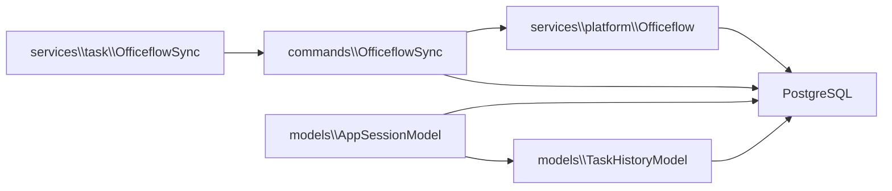

# 办公流程同步服务

<cite>
**本文引用的文件**
- [OfficeflowSync.php](file://process/src/commands/OfficeflowSync.php)
- [OfficeflowSync.php](file://process/src/services/task/OfficeflowSync.php)
- [SyncOfficeFlowOutSchool.php](file://process/src/services/platform/SyncOfficeFlowOutSchool.php)
- [Officeflow.php](file://process/src/services/platform/Officeflow.php)
- [TaskHistoryModel.php](file://process/src/models/TaskHistoryModel.php)
- [AppSessionModel.php](file://process/src/models/AppSessionModel.php)
- [ProcessInstance.php](file://process/src/engine/ProcessInstance.php)
- [ProcTask.php](file://process/src/engine/ProcTask.php)
- [Process.php](file://process/src/http/site/Process.php)
- [EngineEventHandler.php](file://process/src/modules/process/EngineEventHandler.php)
- [BatchTaskFailedRetry.php](file://process/src/services/task/BatchTaskFailedRetry.php)
- [BatchTask.php](file://process/src/services/task/BatchTask.php)
- [database.sql](file://process/docs/sql/database.sql)
</cite>

## 目录
1. [简介](#简介)
2. [项目结构](#项目结构)
3. [核心组件](#核心组件)
4. [架构总览](#架构总览)
5. [详细组件分析](#详细组件分析)
6. [依赖分析](#依赖分析)
7. [性能考虑](#性能考虑)
8. [故障排查指南](#故障排查指南)
9. [结论](#结论)
10. [附录](#附录)

## 简介
本文件面向 htdNew 项目的“办公流程同步服务”，系统性阐述办公流程数据同步的核心机制，覆盖流程实例、流程节点与流程历史的同步逻辑；明确办公流程同步与“外出流程同步”的区别与联系；总结状态管理、流转跟踪与数据一致性保障机制；给出配置参数、批量处理与异常恢复策略，并提供使用场景与集成示例。

## 项目结构
办公流程同步服务由“命令层”“服务层”“平台适配层”“模型与引擎层”“HTTP 展示层”等多层协同构成，围绕 Officeflow 平台数据源进行增量/全量同步，最终落库并驱动流程引擎运行。

图示来源
- [OfficeflowSync.php](file://process/src/commands/OfficeflowSync.php#L1-L120)
- [OfficeflowSync.php](file://process/src/services/task/OfficeflowSync.php#L1-L18)
- [SyncOfficeFlowOutSchool.php](file://process/src/services/platform/SyncOfficeFlowOutSchool.php#L1-L11)
- [Officeflow.php](file://process/src/services/platform/Officeflow.php#L30-L229)
- [AppSessionModel.php](file://process/src/models/AppSessionModel.php#L1-L200)
- [TaskHistoryModel.php](file://process/src/models/TaskHistoryModel.php#L1-L120)
- [Process.php](file://process/src/http/site/Process.php#L726-L757)

章节来源
- [OfficeflowSync.php](file://process/src/commands/OfficeflowSync.php#L1-L120)
- [Officeflow.php](file://process/src/services/platform/Officeflow.php#L30-L229)

## 核心组件
- 命令入口 OfficeflowSync：负责加锁、初始化平台适配器、触发索引同步、岗位/标签/用户 OpenID 同步等。
- 服务任务 OfficeflowSync：作为调度器，委托命令入口执行同步。
- 平台适配 Officeflow：对接 4.0 数据源，按身份维度扩展字段、拉取部门/用户/岗位/标签等。
- 流程会话 AppSessionModel：承载流程实例状态、快照、参与者等，驱动流程引擎。
- 任务历史 TaskHistoryModel：记录流程节点任务的生命周期、状态与完成时间。
- 引擎 ProcessInstance/ProcTask：封装流程执行、令牌与任务对象，支撑状态流转。
- 外出流程同步服务：提供外出流程同步占位实现，便于后续扩展。

章节来源
- [OfficeflowSync.php](file://process/src/commands/OfficeflowSync.php#L1-L120)
- [OfficeflowSync.php](file://process/src/services/task/OfficeflowSync.php#L1-L18)
- [Officeflow.php](file://process/src/services/platform/Officeflow.php#L30-L229)
- [AppSessionModel.php](file://process/src/models/AppSessionModel.php#L1-L200)
- [TaskHistoryModel.php](file://process/src/models/TaskHistoryModel.php#L1-L120)
- [Process.php](file://process/src/http/site/Process.php#L726-L757)

## 架构总览
办公流程同步采用“命令-服务-平台-模型-引擎-展示”的分层架构。命令层负责控制与协调；服务层承担调度；平台层对接外部数据源；模型与引擎层维护流程状态与历史；HTTP 展示层消费状态并渲染前端。

图示来源
- [OfficeflowSync.php](file://process/src/services/task/OfficeflowSync.php#L1-L18)
- [OfficeflowSync.php](file://process/src/commands/OfficeflowSync.php#L1-L120)
- [Officeflow.php](file://process/src/services/platform/Officeflow.php#L30-L229)

## 详细组件分析

### 办公流程同步命令（commands\OfficeflowSync）
职责与流程要点
- 加锁控制：使用 Redis 键进行互斥，避免并发重复执行；设置超时（约 8 小时），finally 释放锁。
- 初始化平台适配器：构造 Officeflow 对象，按需扩展身份字段。
- 环境事件联动：通过全局事件分发器决定是否同步部门、岗位、标签等。
- 同步索引：调用 index(1) 触发索引同步（具体实现位于平台适配器）。
- 岗位同步：比对历史映射与远端岗位，启用/禁用/新增/更新本地岗位，并维护岗位-部门-用户映射。
- 标签同步：同步标签组、标签与标签用户，处理动态/静态标签冲突与去重。
- 用户 OpenID 同步：按平台聚合用户 OpenID，去重与冲突判定，批量插入缺失的 OpenID 记录。
- 异常处理：捕获异常并抛出，确保锁释放。

关键行为与复杂度
- 岗位同步：遍历岗位列表与历史映射，涉及多次查询与更新，整体复杂度近似 O(N)。
- 标签同步：按标签组与标签分步处理，用户分块批量插入，复杂度近似 O(M)。
- OpenID 同步：分页拉取用户，按用户名/平台/OpenID 去重，批量插入，复杂度近似 O(K)。

章节来源
- [OfficeflowSync.php](file://process/src/commands/OfficeflowSync.php#L1-L120)
- [OfficeflowSync.php](file://process/src/commands/OfficeflowSync.php#L120-L240)
- [OfficeflowSync.php](file://process/src/commands/OfficeflowSync.php#L240-L360)
- [OfficeflowSync.php](file://process/src/commands/OfficeflowSync.php#L360-L495)

### 办公流程同步服务（services\task\OfficeflowSync）
职责与流程要点
- 作为调度器，接收 isAll 参数，委托命令入口执行同步。
- 适合在计划任务或服务启动时调用，屏蔽上层差异。

章节来源
- [OfficeflowSync.php](file://process/src/services/task/OfficeflowSync.php#L1-L18)

### 外出流程同步服务（services\task\OfficeflowOutSchoolSync 与 services\platform\SyncOfficeFlowOutSchool）
职责与流程要点
- 当前实现为空方法占位，仅用于对外暴露外出流程同步接口，便于后续扩展。
- 服务层与平台层分离，利于未来接入外出流程数据源。

章节来源
- [OfficeflowOutSchoolSync.php](file://process/src/services/task/OfficeflowOutSchoolSync.php#L1-L18)
- [SyncOfficeFlowOutSchool.php](file://process/src/services/platform/SyncOfficeFlowOutSchool.php#L1-L11)

### 平台适配 Officeflow（services\platform\Officeflow）
职责与流程要点
- 数据源初始化：优先从数据库配置读取，否则从 YAML/平台配置读取；校验 URL 有效性。
- 字段扩展：按身份维度计算需扩展的字段，动态 alter table 并注册扩展属性。
- 部门数据：递归拉取部门树，处理部分院校的特殊映射与撤销逻辑。
- 用户/岗位/标签：提供统一接口供命令层调用，支持分页与增量模式。

章节来源
- [Officeflow.php](file://process/src/services/platform/Officeflow.php#L30-L229)

### 流程实例与任务历史（models\AppSessionModel 与 models\TaskHistoryModel）
职责与流程要点
- AppSessionModel：维护流程实例状态、快照、参与者、匿名发起等；提供运行中/结束状态集合。
- TaskHistoryModel：记录任务类型、状态、完成时间、节点与会话关联；提供任务完成/中止/回退等操作。

图示来源
- [AppSessionModel.php](file://process/src/models/AppSessionModel.php#L1-L200)
- [TaskHistoryModel.php](file://process/src/models/TaskHistoryModel.php#L1-L120)

章节来源
- [AppSessionModel.php](file://process/src/models/AppSessionModel.php#L1-L200)
- [TaskHistoryModel.php](file://process/src/models/TaskHistoryModel.php#L1-L120)

### 引擎与节点任务（engine\ProcessInstance 与 engine\ProcTask）
职责与流程要点
- ProcessInstance/ProcTask：封装底层引擎对象，保留序列化兼容性，供流程实例持久化与运行时使用。

章节来源
- [ProcessInstance.php](file://process/src/engine/ProcessInstance.php#L1-L11)
- [ProcTask.php](file://process/src/engine/ProcTask.php#L1-L11)

### 流转跟踪与节点历史（http\site\Process 与 modules\process\EngineEventHandler）
职责与流程要点
- http\site\Process：根据任务历史统计当前节点与历史节点，支持父子流程节点映射与时间戳聚合。
- modules\process\EngineEventHandler：监听任务中止/结束事件，更新会话状态与消息忽略，触发节点级事件。

图示来源
- [Process.php](file://process/src/http/site/Process.php#L726-L757)
- [EngineEventHandler.php](file://process/src/modules/process/EngineEventHandler.php#L46-L84)
- [TaskHistoryModel.php](file://process/src/models/TaskHistoryModel.php#L100-L170)
- [AppSessionModel.php](file://process/src/models/AppSessionModel.php#L1-L200)

章节来源
- [Process.php](file://process/src/http/site/Process.php#L726-L757)
- [EngineEventHandler.php](file://process/src/modules/process/EngineEventHandler.php#L46-L84)

### 数据一致性与状态管理
- 状态枚举：AppSessionModel 定义了运行中、完成、终止、取消、驳回等状态；TaskHistoryModel 定义了初始化、完成、中止等状态。
- 一致性保障：
  - 通过 Redis 锁避免并发重复执行。
  - 任务中止/回退时清理待办与代理任务，保证历史与待办一致。
  - 会话状态与任务状态联动，确保前端展示与引擎状态一致。

章节来源
- [AppSessionModel.php](file://process/src/models/AppSessionModel.php#L100-L170)
- [TaskHistoryModel.php](file://process/src/models/TaskHistoryModel.php#L1-L120)
- [EngineEventHandler.php](file://process/src/modules/process/EngineEventHandler.php#L46-L84)

### 办公流程同步与外出流程同步的区别与联系
- 区别：
  - 办公流程同步：面向组织内的流程实例、节点与历史，对接 Officeflow 平台，覆盖部门、岗位、标签与用户 OpenID 的同步。
  - 外出流程同步：当前为占位实现，尚未接入具体业务数据源，未来可扩展为独立的同步通道。
- 联系：
  - 两者共享相同的调度与平台适配框架，便于统一管理与扩展。
  - 均依赖 AppSessionModel/TaskHistoryModel 等模型层进行状态与历史管理。

章节来源
- [OfficeflowSync.php](file://process/src/commands/OfficeflowSync.php#L1-L120)
- [OfficeflowOutSchoolSync.php](file://process/src/services/task/OfficeflowOutSchoolSync.php#L1-L18)
- [SyncOfficeFlowOutSchool.php](file://process/src/services/platform/SyncOfficeFlowOutSchool.php#L1-L11)

### 配置参数与环境适配
- 数据源配置：
  - 优先从数据库配置读取 Officeflow 数据库连接与 URL。
  - 若无数据库配置，则从平台配置与 YAML 中读取，校验 URL 有效性。
- 身份字段扩展：
  - 按身份维度计算需扩展字段，动态 alter table 并注册扩展属性。
- 环境事件：
  - 通过全局事件分发器控制是否同步部门、岗位、标签等，便于按环境定制。

章节来源
- [Officeflow.php](file://process/src/services/platform/Officeflow.php#L30-L229)

### 批量处理与异常恢复策略
- 批量处理：
  - 标签用户同步采用分块批量插入，提升写入效率。
  - OpenID 同步按页拉取用户，避免一次性查询过大。
- 异常恢复：
  - Redis 锁超时释放，避免死锁；finally 确保锁释放。
  - 批量任务失败重试：超过阈值未更新或长时间未开始的任务会被重试。
  - 事务回滚与状态上报：捕获异常时回滚事务并记录失败明细。

章节来源
- [OfficeflowSync.php](file://process/src/commands/OfficeflowSync.php#L360-L495)
- [BatchTaskFailedRetry.php](file://process/src/services/task/BatchTaskFailedRetry.php#L1-L45)
- [BatchTask.php](file://process/src/services/task/BatchTask.php#L64-L90)

### 使用场景与集成示例
- 场景：
  - 新环境初始化：先扩展字段，再同步部门/岗位/标签/用户 OpenID。
  - 日常增量同步：按小时周期执行，优先增量模式，必要时全量。
  - 环境差异化：通过事件开关控制是否同步部门/岗位/标签。
- 集成：
  - 在计划任务中调用 services\task\OfficeflowSync::run()，传入 isAll 控制全量/增量。
  - 如需同步外出流程，可在服务层新增对应任务并接入平台适配器。

章节来源
- [OfficeflowSync.php](file://process/src/services/task/OfficeflowSync.php#L1-L18)
- [OfficeflowSync.php](file://process/src/commands/OfficeflowSync.php#L1-L120)

## 依赖分析
- 组件耦合：
  - commands\OfficeflowSync 依赖 services\platform\Officeflow 与 models 层。
  - services\task\OfficeflowSync 仅作调度，耦合度低。
  - 平台适配层与模型/引擎层解耦，便于替换数据源。
- 外部依赖：
  - Redis：用于互斥锁。
  - PostgreSQL：存储流程实例、任务历史与扩展字段。
- 循环依赖：
  - 未发现直接循环依赖；事件分发通过全局分发器解耦。

图示来源
- [OfficeflowSync.php](file://process/src/commands/OfficeflowSync.php#L1-L120)
- [Officeflow.php](file://process/src/services/platform/Officeflow.php#L30-L229)
- [AppSessionModel.php](file://process/src/models/AppSessionModel.php#L1-L200)
- [TaskHistoryModel.php](file://process/src/models/TaskHistoryModel.php#L1-L120)

章节来源
- [OfficeflowSync.php](file://process/src/commands/OfficeflowSync.php#L1-L120)
- [Officeflow.php](file://process/src/services/platform/Officeflow.php#L30-L229)
- [AppSessionModel.php](file://process/src/models/AppSessionModel.php#L1-L200)
- [TaskHistoryModel.php](file://process/src/models/TaskHistoryModel.php#L1-L120)

## 性能考虑
- 分页与批量：
  - OpenID 同步与标签用户同步均采用分页与分块批量插入，降低单次写入压力。
- 去重与索引：
  - 标签用户去重与批量插入前先去重，减少重复写入。
  - 数据库层面建议为常用查询字段建立索引（如 app_session 的 creator/agent、task_history 的 sess_id/node_id/status）。
- 锁与并发：
  - Redis 锁避免并发重复执行；合理设置超时，防止长时间占用。

章节来源
- [OfficeflowSync.php](file://process/src/commands/OfficeflowSync.php#L360-L495)
- [database.sql](file://process/docs/sql/database.sql#L172-L201)

## 故障排查指南
- 常见问题
  - 同步卡住：检查 Redis 锁是否未释放；查看 finally 是否执行。
  - 字段扩展失败：检查平台 URL 与数据库配置；确认 alter table 权限。
  - 标签冲突：动态/静态标签同名导致冲突，需人工核对或调整策略。
  - OpenID 冲突：同一 OpenID 绑定多个用户，需按用户名一致性判断处理。
- 排查步骤
  - 查看命令层异常日志与抛出信息。
  - 核对平台配置与网络连通性。
  - 检查批量任务重试策略是否生效。

章节来源
- [OfficeflowSync.php](file://process/src/commands/OfficeflowSync.php#L1-L120)
- [BatchTaskFailedRetry.php](file://process/src/services/task/BatchTaskFailedRetry.php#L1-L45)
- [BatchTask.php](file://process/src/services/task/BatchTask.php#L64-L90)

## 结论
办公流程同步服务通过清晰的分层设计与事件驱动机制，实现了对 Officeflow 平台的高效同步。其具备完善的加锁、分页、批量与异常恢复能力，能够满足生产环境的稳定性与一致性要求。外出流程同步作为预留扩展点，可在未来快速接入新的业务场景。

## 附录
- 数据库表结构参考（实例与任务历史）
  - app_session：流程实例表，包含状态、快照、流程数据等。
  - task_history：任务历史表，包含任务类型、状态、节点与会话关联等。

章节来源
- [database.sql](file://process/docs/sql/database.sql#L172-L201)