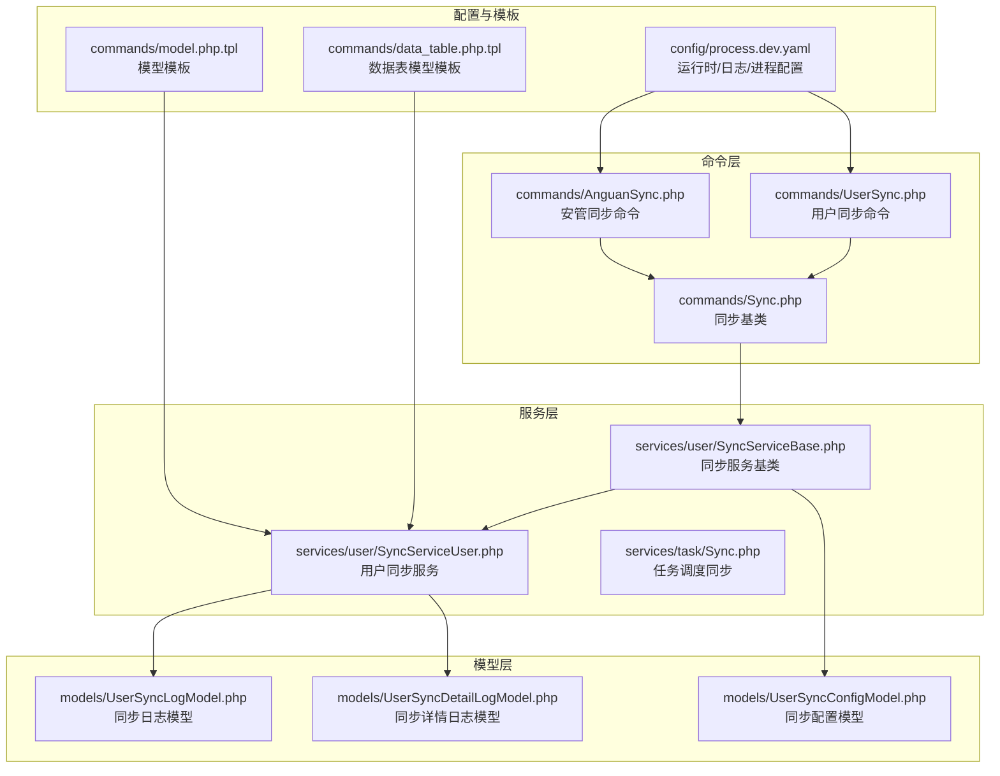
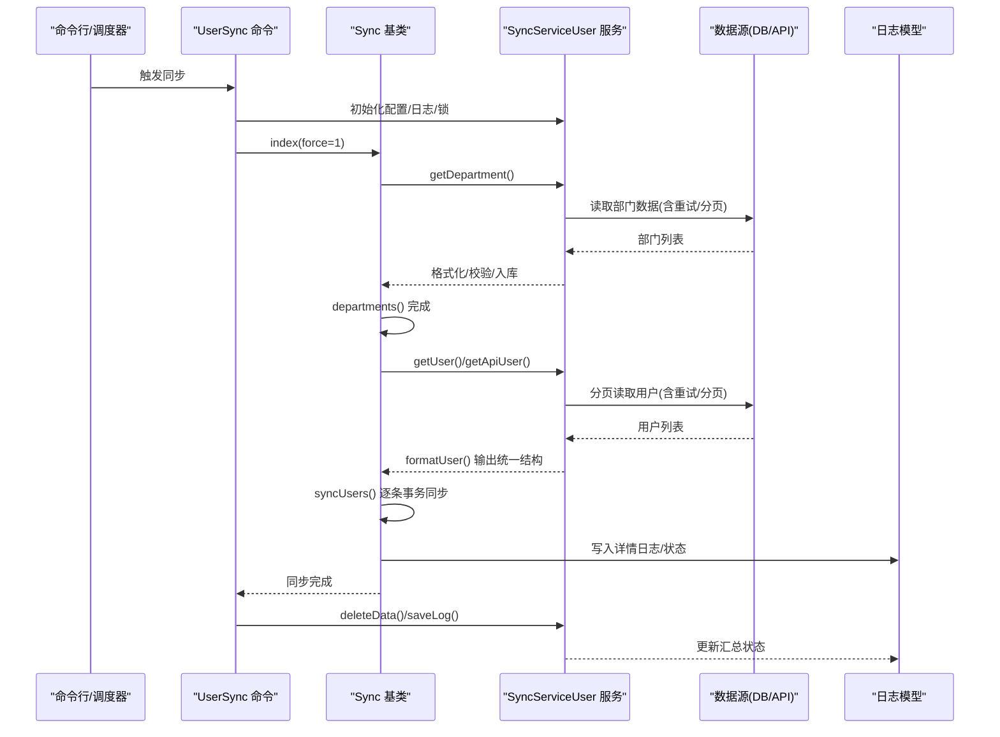
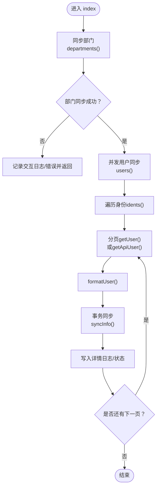
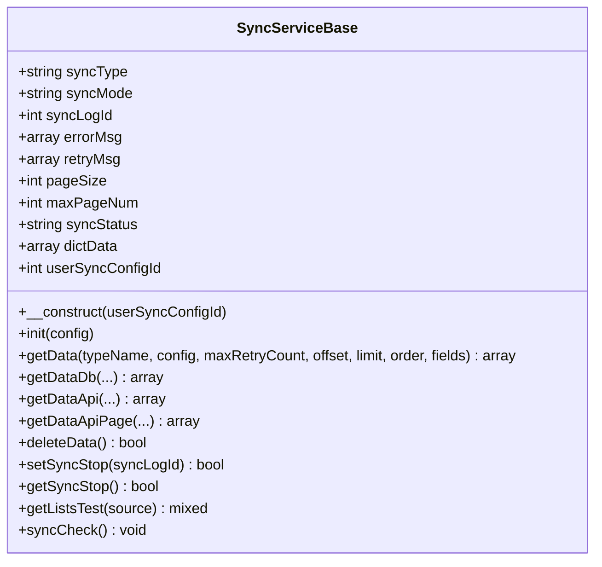
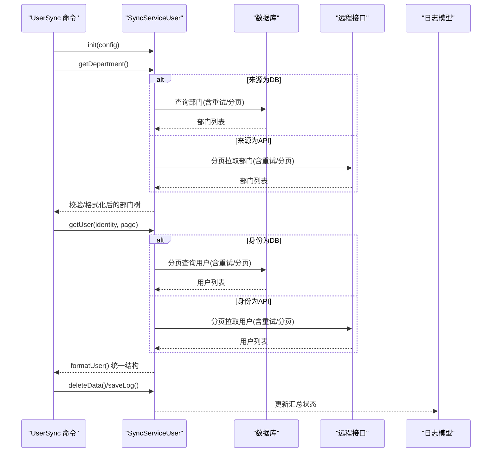
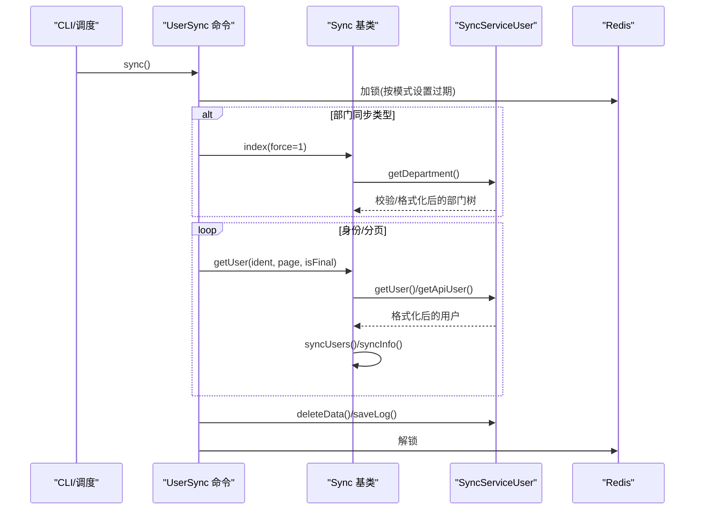
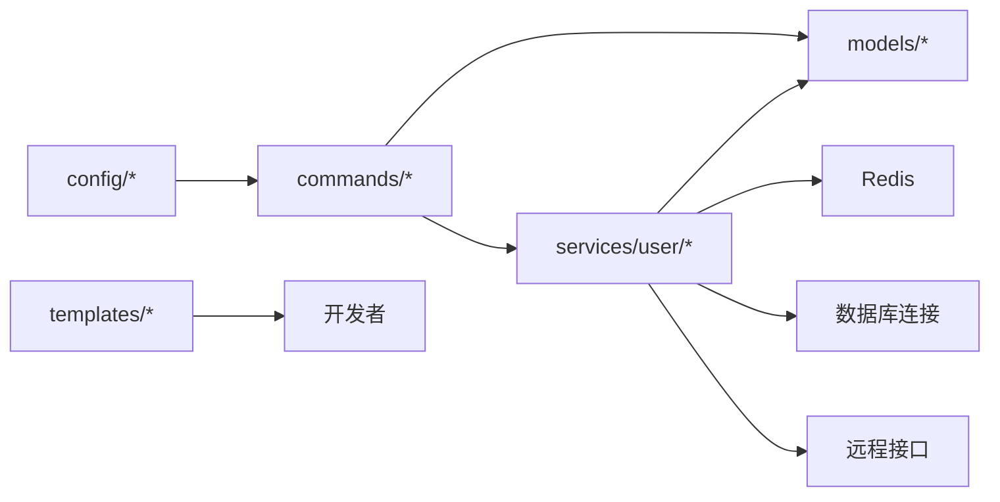

# 同步基础服务

<cite>
**本文引用的文件**
- [process/src/commands/Sync.php](file://process/src/commands/Sync.php)
- [process/src/commands/UserSync.php](file://process/src/commands/UserSync.php)
- [process/src/services/user/SyncServiceBase.php](file://process/src/services/user/SyncServiceBase.php)
- [process/src/services/user/SyncServiceUser.php](file://process/src/services/user/SyncServiceUser.php)
- [process/src/services/task/Sync.php](file://process/src/services/task/Sync.php)
- [process/src/models/UserSyncLogModel.php](file://process/src/models/UserSyncLogModel.php)
- [process/src/models/UserSyncDetailLogModel.php](file://process/src/models/UserSyncDetailLogModel.php)
- [process/src/models/UserSyncConfigModel.php](file://process/src/models/UserSyncConfigModel.php)
- [process/src/commands/AnguanSync.php](file://process/src/commands/AnguanSync.php)
- [process/src/config/process.dev.yaml](file://process/src/config/process.dev.yaml)
- [process/src/commands/data_table.php.tpl](file://process/src/commands/data_table.php.tpl)
- [process/src/commands/model.php.tpl](file://process/src/commands/model.php.tpl)
</cite>

## 目录
1. [简介](#简介)
2. [项目结构](#项目结构)
3. [核心组件](#核心组件)
4. [架构总览](#架构总览)
5. [详细组件分析](#详细组件分析)
6. [依赖分析](#依赖分析)
7. [性能考量](#性能考量)
8. [故障排查指南](#故障排查指南)
9. [结论](#结论)
10. [附录](#附录)

## 简介
本文件面向 htdNew 项目的“同步基础服务”，系统性梳理同步服务的架构设计、通用同步机制与生命周期管理，重点解析 Sync 基类的设计原则与扩展接口，阐述错误处理与重试机制、配置抽象、数据转换模板与通用同步策略，并提供扩展开发指南与最佳实践，同时说明不同版本同步服务的差异与升级路径。

## 项目结构
同步基础服务由“命令层”“服务层”“模型层”“配置与模板”四部分组成：
- 命令层：负责 CLI 触发与流程编排，典型入口为命令基类与具体同步命令。
- 服务层：封装通用数据源访问、重试、分页、格式化、删除策略与日志上报。
- 模型层：定义同步日志、详情日志、同步配置等数据模型。
- 配置与模板：提供运行时路径、日志路径、进程配置及数据表/模型生成模板。

**图表来源**
- [process/src/commands/Sync.php](file://process/src/commands/Sync.php#L1-L587)
- [process/src/commands/UserSync.php](file://process/src/commands/UserSync.php#L1-L221)
- [process/src/commands/AnguanSync.php](file://process/src/commands/AnguanSync.php#L1-L198)
- [process/src/services/user/SyncServiceBase.php](file://process/src/services/user/SyncServiceBase.php#L1-L479)
- [process/src/services/user/SyncServiceUser.php](file://process/src/services/user/SyncServiceUser.php#L1-L934)
- [process/src/services/task/Sync.php](file://process/src/services/task/Sync.php#L1-L11)
- [process/src/models/UserSyncLogModel.php](file://process/src/models/UserSyncLogModel.php#L1-L81)
- [process/src/models/UserSyncDetailLogModel.php](file://process/src/models/UserSyncDetailLogModel.php#L1-L57)
- [process/src/models/UserSyncConfigModel.php](file://process/src/models/UserSyncConfigModel.php#L1-L59)
- [process/src/config/process.dev.yaml](file://process/src/config/process.dev.yaml#L1-L89)
- [process/src/commands/data_table.php.tpl](file://process/src/commands/data_table.php.tpl#L1-L23)
- [process/src/commands/model.php.tpl](file://process/src/commands/model.php.tpl#L1-L18)

**章节来源**
- [process/src/commands/Sync.php](file://process/src/commands/Sync.php#L1-L587)
- [process/src/commands/UserSync.php](file://process/src/commands/UserSync.php#L1-L221)
- [process/src/services/user/SyncServiceBase.php](file://process/src/services/user/SyncServiceBase.php#L1-L479)
- [process/src/services/user/SyncServiceUser.php](file://process/src/services/user/SyncServiceUser.php#L1-L934)
- [process/src/models/UserSyncLogModel.php](file://process/src/models/UserSyncLogModel.php#L1-L81)
- [process/src/models/UserSyncDetailLogModel.php](file://process/src/models/UserSyncDetailLogModel.php#L1-L57)
- [process/src/models/UserSyncConfigModel.php](file://process/src/models/UserSyncConfigModel.php#L1-L59)
- [process/src/config/process.dev.yaml](file://process/src/config/process.dev.yaml#L1-L89)
- [process/src/commands/data_table.php.tpl](file://process/src/commands/data_table.php.tpl#L1-L23)
- [process/src/commands/model.php.tpl](file://process/src/commands/model.php.tpl#L1-L18)

## 核心组件
- 同步基类（命令层）
  - 定义抽象接口：身份枚举、部门获取、用户分页获取、用户格式化、清理钩子等。
  - 提供并发协程通道、断点续传、交互日志、事务与错误回滚、历史记录写入等通用能力。
  - 生命周期：index → departments → users → syncUsers → syncInfo → 各维度同步（部门/标签/岗位/关系）。
- 同步服务基类（服务层）
  - 抽象数据源访问：数据库/接口两类，支持分页、条件拼接、排序、SQL/表两种读取方式。
  - 重试与分页：统一重试策略、最大页数限制、分页去重与停止信号。
  - 删除策略：全量模式下的“删除源头不存在的数据”能力。
  - 日志与状态：统一错误收集、状态标记、停止信号检测。
- 用户同步服务（服务层）
  - 配置抽象：部门/用户配置、身份映射、字段映射、条件过滤、字典码表缓存。
  - 数据获取：数据库/接口两类，支持增量时间字段、条件过滤、分页拉取。
  - 数据格式化：统一输出结构（users/user_info/identity/department/team/job/relation），并校验关键字段。
  - 删除与统计：按配置执行删除、统计成功/删除数量、汇总错误与重试信息。
- 模型层
  - 同步日志模型：触发方式、同步方式、状态、错误信息、统计数据等。
  - 详情日志模型：按类型（部门/用户/标签/岗位）记录明细与状态。
  - 同步配置模型：同步类型（部门/岗位/标签等）、配置内容、创建者等。
- 配置与模板
  - 运行时路径、日志路径、进程数量与业务配置文件路径等。
  - 数据表模型与通用模型模板，用于快速生成数据表/模型骨架。

**章节来源**
- [process/src/commands/Sync.php](file://process/src/commands/Sync.php#L1-L587)
- [process/src/services/user/SyncServiceBase.php](file://process/src/services/user/SyncServiceBase.php#L1-L479)
- [process/src/services/user/SyncServiceUser.php](file://process/src/services/user/SyncServiceUser.php#L1-L934)
- [process/src/models/UserSyncLogModel.php](file://process/src/models/UserSyncLogModel.php#L1-L81)
- [process/src/models/UserSyncDetailLogModel.php](file://process/src/models/UserSyncDetailLogModel.php#L1-L57)
- [process/src/models/UserSyncConfigModel.php](file://process/src/models/UserSyncConfigModel.php#L1-L59)
- [process/src/config/process.dev.yaml](file://process/src/config/process.dev.yaml#L1-L89)
- [process/src/commands/data_table.php.tpl](file://process/src/commands/data_table.php.tpl#L1-L23)
- [process/src/commands/model.php.tpl](file://process/src/commands/model.php.tpl#L1-L18)

## 架构总览
同步服务采用“命令层编排 + 服务层抽象 + 模型层记录”的分层架构。命令层负责流程编排与生命周期管理；服务层负责数据源访问、重试与格式化；模型层负责日志与配置持久化；配置与模板提供运行时与开发辅助。

**图表来源**
- [process/src/commands/UserSync.php](file://process/src/commands/UserSync.php#L1-L221)
- [process/src/commands/Sync.php](file://process/src/commands/Sync.php#L1-L587)
- [process/src/services/user/SyncServiceBase.php](file://process/src/services/user/SyncServiceBase.php#L1-L479)
- [process/src/services/user/SyncServiceUser.php](file://process/src/services/user/SyncServiceUser.php#L1-L934)
- [process/src/models/UserSyncLogModel.php](file://process/src/models/UserSyncLogModel.php#L1-L81)
- [process/src/models/UserSyncDetailLogModel.php](file://process/src/models/UserSyncDetailLogModel.php#L1-L57)

## 详细组件分析

### Sync 基类（命令层）
- 设计原则
  - 抽象接口驱动：通过抽象方法约束子类提供身份、部门、用户数据源，确保扩展一致性。
  - 并发与断点：基于协程通道与断点续传文件，支持高吞吐与容错恢复。
  - 事务与日志：每用户同步置于事务内，失败回滚并记录交互日志与同步详情日志。
- 生命周期
  - index：初始化内存限制，先同步部门（失败即中止），再并发同步用户。
  - departments/syncDepartments：构建部门树，校验禁用状态，写入详情日志。
  - users：按身份分页并发拉取，写入历史记录，支持强制重跑。
  - syncUsers/syncInfo：逐条事务同步用户基础信息、身份专属表、部门/标签/岗位/关系。
  - 关系同步：根据身份与关系键动态解析 relation_id，增删差集。
- 扩展接口
  - formatUser：可自定义用户字段映射与结构。
  - clearDb：可选清理标签/岗位等中间态。
- 错误处理与重试
  - 服务层统一重试与分页；命令层在用户同步失败时回滚并记录错误。
- 配置与模板
  - 协程数、频率（断点续传有效期）、日志级别与输出位置可通过属性配置。
  - 断点续传文件路径与历史记录写入/读取。

**图表来源**
- [process/src/commands/Sync.php](file://process/src/commands/Sync.php#L1-L587)

**章节来源**
- [process/src/commands/Sync.php](file://process/src/commands/Sync.php#L1-L587)

### SyncServiceBase（服务层）
- 数据源抽象
  - 数据库：支持表读取与 SQL 读取，自动注入排序与分页，适配多种数据库方言。
  - 接口：支持分页拉取，自动去重（连续两页相同视为结束），字段条件抽取与动态参数注入。
- 重试与分页
  - 统一重试上限与等待间隔，失败时记录错误并标记状态。
  - 分页最大页数限制，防止无限循环。
- 删除策略
  - deleteData：仅在全量模式且状态正常时执行，避免中途终止导致误删。
- 停止信号
  - 通过 Redis 键检测同步停止，设置状态并延长锁有效期。
- 日志与状态
  - 统一错误收集、状态标记、测试运行接口。

**图表来源**
- [process/src/services/user/SyncServiceBase.php](file://process/src/services/user/SyncServiceBase.php#L1-L479)

**章节来源**
- [process/src/services/user/SyncServiceBase.php](file://process/src/services/user/SyncServiceBase.php#L1-L479)

### SyncServiceUser（服务层）
- 配置抽象
  - 部门配置：来源类型（DB/API）、条件、字段映射、父子编码、排序等。
  - 用户配置：按身份拆分，支持 DB/SQL 与 API 两类，条件过滤、增量时间字段、字段映射。
- 数据获取与格式化
  - 部门：校验编码/名称/父子关系，构建树并验证重复与缺失父节点。
  - 用户：提取字典码表值，校验必填字段与格式，组装统一结构，支持学生身份的关系映射。
- 删除与统计
  - 全量模式下对比源头部门集合，删除不存在的部门；统计成功/删除数量，汇总错误与重试信息。
- 日志与状态
  - 详情日志按类型记录，状态更新，最终汇总到同步日志模型。

**图表来源**
- [process/src/services/user/SyncServiceUser.php](file://process/src/services/user/SyncServiceUser.php#L1-L934)
- [process/src/models/UserSyncLogModel.php](file://process/src/models/UserSyncLogModel.php#L1-L81)
- [process/src/models/UserSyncDetailLogModel.php](file://process/src/models/UserSyncDetailLogModel.php#L1-L57)

**章节来源**
- [process/src/services/user/SyncServiceUser.php](file://process/src/services/user/SyncServiceUser.php#L1-L934)

### UserSync 命令（命令层）
- 生命周期
  - 初始化同步日志与锁，按同步类型选择对应服务实例，执行同步流程，最终保存日志并释放锁。
  - 全量/增量模式设置不同的锁超时时间，避免长时间阻塞。
- 与 Sync 基类协作
  - 重写部门/用户数据源方法，委托给服务层实现。
  - 处理岗位/标签等特殊类型的同步流程。

**图表来源**
- [process/src/commands/UserSync.php](file://process/src/commands/UserSync.php#L1-L221)
- [process/src/commands/Sync.php](file://process/src/commands/Sync.php#L1-L587)
- [process/src/services/user/SyncServiceUser.php](file://process/src/services/user/SyncServiceUser.php#L1-L934)

**章节来源**
- [process/src/commands/UserSync.php](file://process/src/commands/UserSync.php#L1-L221)

### AnguanSync 命令（命令层）
- 场景化示例
  - 直接实现部门与用户的获取逻辑，演示如何在命令层定制数据源与格式化。
  - 展示不同环境下的身份字典映射与部门树生成。

**章节来源**
- [process/src/commands/AnguanSync.php](file://process/src/commands/AnguanSync.php#L1-L198)

### 任务调度同步（服务层）
- 通过任务服务触发同步命令，实现定时/周期性同步。

**章节来源**
- [process/src/services/task/Sync.php](file://process/src/services/task/Sync.php#L1-L11)

## 依赖分析
- 命令层依赖服务层接口与模型层日志。
- 服务层依赖数据源（数据库/接口）、字典码表、Redis 锁与停止信号。
- 模型层提供日志与配置持久化，支撑可观测与审计。
- 配置与模板为运行时与开发提供基础设施。

**图表来源**
- [process/src/commands/Sync.php](file://process/src/commands/Sync.php#L1-L587)
- [process/src/commands/UserSync.php](file://process/src/commands/UserSync.php#L1-L221)
- [process/src/services/user/SyncServiceBase.php](file://process/src/services/user/SyncServiceBase.php#L1-L479)
- [process/src/services/user/SyncServiceUser.php](file://process/src/services/user/SyncServiceUser.php#L1-L934)
- [process/src/models/UserSyncLogModel.php](file://process/src/models/UserSyncLogModel.php#L1-L81)
- [process/src/models/UserSyncDetailLogModel.php](file://process/src/models/UserSyncDetailLogModel.php#L1-L57)
- [process/src/config/process.dev.yaml](file://process/src/config/process.dev.yaml#L1-L89)
- [process/src/commands/data_table.php.tpl](file://process/src/commands/data_table.php.tpl#L1-L23)
- [process/src/commands/model.php.tpl](file://process/src/commands/model.php.tpl#L1-L18)

**章节来源**
- [process/src/commands/Sync.php](file://process/src/commands/Sync.php#L1-L587)
- [process/src/commands/UserSync.php](file://process/src/commands/UserSync.php#L1-L221)
- [process/src/services/user/SyncServiceBase.php](file://process/src/services/user/SyncServiceBase.php#L1-L479)
- [process/src/services/user/SyncServiceUser.php](file://process/src/services/user/SyncServiceUser.php#L1-L934)
- [process/src/models/UserSyncLogModel.php](file://process/src/models/UserSyncLogModel.php#L1-L81)
- [process/src/models/UserSyncDetailLogModel.php](file://process/src/models/UserSyncDetailLogModel.php#L1-L57)
- [process/src/config/process.dev.yaml](file://process/src/config/process.dev.yaml#L1-L89)
- [process/src/commands/data_table.php.tpl](file://process/src/commands/data_table.php.tpl#L1-L23)
- [process/src/commands/model.php.tpl](file://process/src/commands/model.php.tpl#L1-L18)

## 性能考量
- 并发与限流
  - 基于协程通道控制并发度，按数据量与下游承载能力调优协程数。
  - 断点续传文件与历史记录避免重复工作，提升长耗时同步的恢复效率。
- 分页与重试
  - 服务层统一重试与分页策略，减少抖动与空页浪费。
  - 接口分页去重与最大页数限制，防止死循环。
- 数据库适配
  - SQL 分页适配多种数据库方言，避免跨库差异带来的性能问题。
- 日志与监控
  - 交互日志与详情日志结合，定位慢点与失败点，指导优化。

[本节为通用建议，无需列出具体文件来源]

## 故障排查指南
- 常见问题
  - 部门树校验失败：重复编码、缺失父节点、编码与名称为空等。
  - 用户字段缺失或格式错误：学工号/姓名/用户名为空，手机号/邮箱格式不符。
  - 数据源异常：数据库连接失败、接口返回格式错误、分页数据重复。
  - 锁冲突：上一次同步未完成导致锁未释放。
- 定位手段
  - 查看同步日志与详情日志，定位失败类型与具体数据。
  - 使用测试运行接口验证数据源连通性与格式。
  - 检查 Redis 锁状态与过期时间，必要时手动释放。
- 处理建议
  - 对于部门/用户异常，先修复源头数据，再重试。
  - 对于接口异常，检查条件过滤与分页节点配置。
  - 对于锁冲突，确认模式（全量/增量）与锁时长设置。

**章节来源**
- [process/src/services/user/SyncServiceUser.php](file://process/src/services/user/SyncServiceUser.php#L1-L934)
- [process/src/services/user/SyncServiceBase.php](file://process/src/services/user/SyncServiceBase.php#L1-L479)
- [process/src/models/UserSyncLogModel.php](file://process/src/models/UserSyncLogModel.php#L1-L81)
- [process/src/models/UserSyncDetailLogModel.php](file://process/src/models/UserSyncDetailLogModel.php#L1-L57)

## 结论
同步基础服务通过命令层与服务层的清晰分工，实现了可扩展、可观测、可恢复的通用同步框架。Sync 基类提供一致的生命周期与并发控制，服务层提供强大的数据源抽象与重试策略，模型层保障日志与配置的完整性。遵循本文的扩展指南与最佳实践，可在不同环境中快速落地稳定的同步能力。

[本节为总结性内容，无需列出具体文件来源]

## 附录

### 配置抽象与运行时
- 运行时路径与日志路径：用于断点续传文件与日志输出。
- 进程配置：HTTP/队列/计划任务等进程数量与业务配置文件路径。
- 同步配置模型：同步类型与配置内容，支撑不同场景的差异化需求。

**章节来源**
- [process/src/config/process.dev.yaml](file://process/src/config/process.dev.yaml#L1-L89)
- [process/src/models/UserSyncConfigModel.php](file://process/src/models/UserSyncConfigModel.php#L1-L59)

### 数据转换模板
- 数据表模型模板与通用模型模板：用于快速生成数据表/模型骨架，规范字段与表名。

**章节来源**
- [process/src/commands/data_table.php.tpl](file://process/src/commands/data_table.php.tpl#L1-L23)
- [process/src/commands/model.php.tpl](file://process/src/commands/model.php.tpl#L1-L18)

### 扩展开发指南与最佳实践
- 新增命令类
  - 继承命令层基类，实现 idents/getDepartment/getUser/formatUser 等抽象方法。
  - 在 UserSync 命令中注册新类型的服务实例。
- 新增数据源
  - 在服务层基类中扩展数据源读取方法，保持重试与分页一致性。
- 字段映射与校验
  - 在用户同步服务中完善字段映射与校验逻辑，确保输出结构统一。
- 日志与可观测
  - 通过详情日志记录关键步骤与状态，便于问题定位与审计。
- 锁与停止信号
  - 正确设置锁时长与停止信号，避免长时间阻塞与误删。

**章节来源**
- [process/src/commands/Sync.php](file://process/src/commands/Sync.php#L1-L587)
- [process/src/commands/UserSync.php](file://process/src/commands/UserSync.php#L1-L221)
- [process/src/services/user/SyncServiceBase.php](file://process/src/services/user/SyncServiceBase.php#L1-L479)
- [process/src/services/user/SyncServiceUser.php](file://process/src/services/user/SyncServiceUser.php#L1-L934)

### 不同版本同步服务的差异与升级路径
- 命令层与服务层的职责划分更加清晰，服务层承担更多数据源抽象与重试逻辑，命令层聚焦流程编排。
- 用户同步服务引入更完善的配置抽象与字段映射，支持按身份细化配置与条件过滤。
- 日志模型与状态枚举标准化，便于统一监控与告警。
- 建议升级路径
  - 逐步将旧命令类迁移至新的服务层抽象，复用重试与分页能力。
  - 统一字段映射与校验逻辑，减少重复实现。
  - 引入测试运行接口，提升调试效率。

**章节来源**
- [process/src/commands/Sync.php](file://process/src/commands/Sync.php#L1-L587)
- [process/src/services/user/SyncServiceBase.php](file://process/src/services/user/SyncServiceBase.php#L1-L479)
- [process/src/services/user/SyncServiceUser.php](file://process/src/services/user/SyncServiceUser.php#L1-L934)
- [process/src/models/UserSyncLogModel.php](file://process/src/models/UserSyncLogModel.php#L1-L81)
- [process/src/models/UserSyncDetailLogModel.php](file://process/src/models/UserSyncDetailLogModel.php#L1-L57)